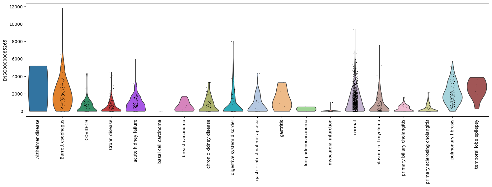
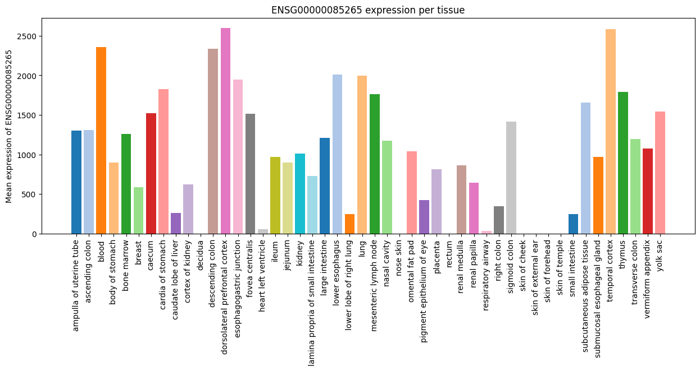

# cellNexusPy

## Importing the package


```python
from cellnexuspy import get_metadata, get_anndata
```

## Getting the metadata

The `get_metadata()` function returns a database connection and a DuckDB table.

The table can be used to query the metadata, while the connection's main purpose is to be closed when you are finished:


```python
sample_dataset = "https://object-store.rc.nectar.org.au/v1/AUTH_06d6e008e3e642da99d806ba3ea629c5/cellNexus-metadata/sample_metadata.1.3.0.parquet"

conn, table = get_metadata(parquet_url = sample_dataset)
table
```


    ┌──────────────────────────────────────────────────────────────────────────┬──────────────────────────────────────┬────────────────────┬──────────────────────────────────┬────────────────────────────────────┬────────────────────────────┬──────────────────────────────────┬───────────┬────────────────────────┬────────────┬────────────────────────────────────────────────────────────────────────────────────────────────────────────────────────────────────────────────────────────────────────────────────────────────────────────────────────────────────────────────────────────────────────────────────────────────────────────────┬──────────────────────────────────────┬──────────────────────────────────────┬───────────────────┬─────────────────────────┬────────────────────────────────────┬─────────┬──────────────────────────┬────────────┬───────────────┬──────────────────────────────────────────────────────────────────────────────┬───────────────┬─────────────┬──────────┬─────────────────┬─────────────────────┬──────────────┬───────────────────────────┬────────────────────┬──────────────┬───────────────────┬────────────┬──────────────────┬───────────────────────────────────────────────────────────────────────────────────────────┬────────────────┬────────────────────────────┬──────────────────────────────────────────┬─────────┬──────────────────────┬─────────────────┬─────────────────────────┬─────────────────────────┬─────────────┬─────────────────────────────────────────────────────────────────────────────────────────────────────────────┬───────────┬─────────────────────────────────────────────────────────────────────────────────────┬────────────────────────────┬─────────┬─────────┬──────────┬──────────────────────────┬──────────────────────┬───────────────────────────────────┬────────────────────────────────┬────────────────────────────┬──────────────────────────────┬────────────────────┬───────────────┬───────────────────────────────────┬───────────────────────────────────────────┬───────────────────┬──────────────────────┬────────────────────────────┬───────────┬──────────────────┬───────────────────────┬──────────────────────┬──────────────────────┬────────────────────┬───────────────┬─────────┬───────────────────┬────────────┬────────────┬────────────┬─────────────┬─────────────┬─────────────┬──────────────┬──────────────┬──────────────┬───────────────┬───────────────┬───────────────┬───────────────┬────────────────┬────────────────┬────────────────┬──────────────┬────────────┬─────────────────────────┬───────────────────────────────────────────┬───────────────────────────────────────────┬──────────────────────────┬──────────────────────────┬────────────────────────────┬──────────────────┐
    │                                 cell_id                                  │              dataset_id              │ observation_joinid │            sample_id             │             cell_type              │ cell_type_ontology_term_id │             sample_              │   assay   │ assay_ontology_term_id │ cell_count │                                                                                                                                                    citation                                                                                                                                                    │            collection_id             │          dataset_version_id          │ default_embedding │    development_stage    │ development_stage_ontology_term_id │ disease │ disease_ontology_term_id │  donor_id  │ experiment___ │                                 explorer_url                                 │ feature_count │  filesize   │ filetype │ is_primary_data │ mean_genes_per_cell │   organism   │ organism_ontology_term_id │ primary_cell_count │ published_at │ raw_data_location │ revised_at │ run_from_cell_id │                                     sample_heuristic                                      │ schema_version │  self_reported_ethnicity   │ self_reported_ethnicity_ontology_term_id │   sex   │ sex_ontology_term_id │ suspension_type │         tissue          │ tissue_ontology_term_id │ tissue_type │                                                    title                                                    │ tombstone │                                         url                                         │ x_approximate_distribution │ X_umap1 │ X_umap2 │ age_days │      tissue_groups       │       atlas_id       │ cell_annotation_blueprint_singler │ cell_annotation_monaco_singler │ cell_annotation_azimuth_l2 │ nFeature_expressed_in_sample │     nCount_RNA     │ empty_droplet │      observation_originalid       │              ensemble_joinid              │ cell_type_unified │ data_driven_ensemble │ cell_type_unified_ensemble │ is_immune │ subsets_Mito_sum │ subsets_Mito_detected │ subsets_Mito_percent │ subsets_Ribo_percent │ high_mitochondrion │ high_ribosome │  alive  │ scDblFinder.class │ metacell_2 │ metacell_4 │ metacell_8 │ metacell_16 │ metacell_32 │ metacell_64 │ metacell_128 │ metacell_256 │ metacell_512 │ metacell_1024 │ metacell_2048 │ metacell_4096 │ metacell_8192 │ metacell_16384 │ metacell_32768 │ metacell_65536 │ sample_chunk │ cell_chunk │ sample_pseudobulk_chunk │       file_id_cellNexus_single_cell       │       file_id_cellNexus_pseudobulk        │ ethnicity_flagging_score │ low_confidence_ethnicity │     imputed_ethnicity      │ aggregated_cells │
    │                                 varchar                                  │               varchar                │      varchar       │             varchar              │              varchar               │          varchar           │             varchar              │  varchar  │        varchar         │   int32    │                                                                                                                                                    varchar                                                                                                                                                     │               varchar                │               varchar                │      varchar      │         varchar         │              varchar               │ varchar │         varchar          │  varchar   │    varchar    │                                   varchar                                    │     int32     │   double    │ varchar  │     varchar     │       double        │   varchar    │          varchar          │      varchar       │   varchar    │      varchar      │  varchar   │     varchar      │                                          varchar                                          │    varchar     │          varchar           │                 varchar                  │ varchar │       varchar        │     varchar     │         varchar         │         varchar         │   varchar   │                                                   varchar                                                   │  boolean  │                                       varchar                                       │          varchar           │ double  │ double  │  int32   │         varchar          │       varchar        │              varchar              │            varchar             │          varchar           │            int32             │       double       │    boolean    │              varchar              │                  varchar                  │      varchar      │       varchar        │          varchar           │  boolean  │      int32       │         int32         │        int32         │        int32         │      boolean       │    boolean    │ boolean │      varchar      │   int32    │   int32    │   int32    │    int32    │    int32    │    int32    │    int32     │    int32     │    int32     │     int32     │     int32     │     int32     │     int32     │     int32      │     int32      │     int32      │    int32     │   int32    │          int32          │                  varchar                  │                  varchar                  │          double          │         varchar          │          varchar           │      int32       │
    ├──────────────────────────────────────────────────────────────────────────┼──────────────────────────────────────┼────────────────────┼──────────────────────────────────┼────────────────────────────────────┼────────────────────────────┼──────────────────────────────────┼───────────┼────────────────────────┼────────────┼────────────────────────────────────────────────────────────────────────────────────────────────────────────────────────────────────────────────────────────────────────────────────────────────────────────────────────────────────────────────────────────────────────────────────────────────────────────────┼──────────────────────────────────────┼──────────────────────────────────────┼───────────────────┼─────────────────────────┼────────────────────────────────────┼─────────┼──────────────────────────┼────────────┼───────────────┼──────────────────────────────────────────────────────────────────────────────┼───────────────┼─────────────┼──────────┼─────────────────┼─────────────────────┼──────────────┼───────────────────────────┼────────────────────┼──────────────┼───────────────────┼────────────┼──────────────────┼───────────────────────────────────────────────────────────────────────────────────────────┼────────────────┼────────────────────────────┼──────────────────────────────────────────┼─────────┼──────────────────────┼─────────────────┼─────────────────────────┼─────────────────────────┼─────────────┼─────────────────────────────────────────────────────────────────────────────────────────────────────────────┼───────────┼─────────────────────────────────────────────────────────────────────────────────────┼────────────────────────────┼─────────┼─────────┼──────────┼──────────────────────────┼──────────────────────┼───────────────────────────────────┼────────────────────────────────┼────────────────────────────┼──────────────────────────────┼────────────────────┼───────────────┼───────────────────────────────────┼───────────────────────────────────────────┼───────────────────┼──────────────────────┼────────────────────────────┼───────────┼──────────────────┼───────────────────────┼──────────────────────┼──────────────────────┼────────────────────┼───────────────┼─────────┼───────────────────┼────────────┼────────────┼────────────┼─────────────┼─────────────┼─────────────┼──────────────┼──────────────┼──────────────┼───────────────┼───────────────┼───────────────┼───────────────┼────────────────┼────────────────┼────────────────┼──────────────┼────────────┼─────────────────────────┼───────────────────────────────────────────┼───────────────────────────────────────────┼──────────────────────────┼──────────────────────────┼────────────────────────────┼──────────────────┤
    │ 10X389_2:AATCGTGTCTGGGAGA___00476f9f-ebc1-4b72-b541-32f912ce36ea         │ 00476f9f-ebc1-4b72-b541-32f912ce36ea │ 6Q`5Q?s8MG         │ 9303a73f5d745c5af351a77790608355 │ neuron                             │ CL:0000540                 │ 9303a73f5d745c5af351a77790608355 │ 10x 3' v3 │ EFO:0009922            │      10099 │ Publication: https://doi.org/10.1126/science.add7046 Dataset Version: https://datasets.cellxgene.cziscience.com/34c82f0d-04a7-4b13-8d4f-ae06065a2b1c.h5ad curated and distributed by CZ CELLxGENE Discover in Collection: https://cellxgene.cziscience.com/collections/283d65eb-dd53-496d-adb7-7570c7caa443    │ 283d65eb-dd53-496d-adb7-7570c7caa443 │ 34c82f0d-04a7-4b13-8d4f-ae06065a2b1c │ NULL              │ 42-year-old human stage │ HsapDv:0000136                     │ normal  │ PATO:0000461             │ H19.30.001 │               │ https://cellxgene.cziscience.com/e/00476f9f-ebc1-4b72-b541-32f912ce36ea.cxg/ │         59236 │ 132063592.0 │ H5AD     │ TRUE            │   5567.875334191504 │ Homo sapiens │ NCBITaxon:9606            │ 10099              │ 2022-12-08   │ X                 │ 2024-06-11 │ NULL             │ H19.30.001___hypothalamus___42-year-old human stage___10x 3' v3______normal___TRUE        │ 5.1.0          │ European                   │ HANCESTRO:0005                           │ male    │ PATO:0000384         │ nucleus         │ hypothalamus            │ UBERON:0001898          │ tissue      │ Dissection: Hypothalamus (HTH) - mammillary region of HTH (HTHma)                                           │ false     │ https://datasets.cellxgene.cziscience.com/34c82f0d-04a7-4b13-8d4f-ae06065a2b1c.h5ad │ NULL                       │    NULL │    NULL │    15330 │ limbic and basal systems │ cellxgene/21-08-2025 │ Neurons                           │ Myeloid dendritic cells        │ CD4 TCM                    │                         1034 │  2.549410000002595 │ false         │ 10X389_2:AATCGTGTCTGGGAGA         │ cd4 tcm_non immune_cdc_neuron             │ neuron            │ non immune           │ neuron                     │ false     │                0 │                     0 │                    0 │                    0 │ false              │ false         │ true    │ singlet           │        503 │        911 │        550 │         130 │         186 │         110 │           60 │            7 │            7 │             4 │             1 │             1 │             1 │           NULL │           NULL │           NULL │            1 │          1 │                       1 │ 41b6d6f9efa181cf4a2c648cdf479935___1.h5ad │ 5665bf887e0c2e60ffd5f67066496f12___1.h5ad │                     NULL │ NULL                     │ European                   │             8673 │
    │ 10X389_2:ACCAAACGTCTCAGGC___00476f9f-ebc1-4b72-b541-32f912ce36ea         │ 00476f9f-ebc1-4b72-b541-32f912ce36ea │ =rzn8n*;Bt         │ 9303a73f5d745c5af351a77790608355 │ neuron                             │ CL:0000540                 │ 9303a73f5d745c5af351a77790608355 │ 10x 3' v3 │ EFO:0009922            │      10099 │ Publication: https://doi.org/10.1126/science.add7046 Dataset Version: https://datasets.cellxgene.cziscience.com/34c82f0d-04a7-4b13-8d4f-ae06065a2b1c.h5ad curated and distributed by CZ CELLxGENE Discover in Collection: https://cellxgene.cziscience.com/collections/283d65eb-dd53-496d-adb7-7570c7caa443    │ 283d65eb-dd53-496d-adb7-7570c7caa443 │ 34c82f0d-04a7-4b13-8d4f-ae06065a2b1c │ NULL              │ 42-year-old human stage │ HsapDv:0000136                     │ normal  │ PATO:0000461             │ H19.30.001 │               │ https://cellxgene.cziscience.com/e/00476f9f-ebc1-4b72-b541-32f912ce36ea.cxg/ │         59236 │ 132063592.0 │ H5AD     │ TRUE            │   5567.875334191504 │ Homo sapiens │ NCBITaxon:9606            │ 10099              │ 2022-12-08   │ X                 │ 2024-06-11 │ NULL             │ H19.30.001___hypothalamus___42-year-old human stage___10x 3' v3______normal___TRUE        │ 5.1.0          │ European                   │ HANCESTRO:0005                           │ male    │ PATO:0000384         │ nucleus         │ hypothalamus            │ UBERON:0001898          │ tissue      │ Dissection: Hypothalamus (HTH) - mammillary region of HTH (HTHma)                                           │ false     │ https://datasets.cellxgene.cziscience.com/34c82f0d-04a7-4b13-8d4f-ae06065a2b1c.h5ad │ NULL                       │    NULL │    NULL │    15330 │ limbic and basal systems │ cellxgene/21-08-2025 │ Neurons                           │ Myeloid dendritic cells        │ HSPC                       │                         6544 │  47.12423000001045 │ false         │ 10X389_2:ACCAAACGTCTCAGGC         │ cd4 tcm_non immune_cdc_neuron             │ neuron            │ non immune           │ neuron                     │ false     │                0 │                     0 │                    0 │                    0 │ false              │ false         │ true    │ singlet           │         54 │       1565 │         47 │         338 │         224 │          17 │           42 │            2 │            1 │             3 │             1 │             1 │             1 │           NULL │           NULL │           NULL │            1 │          1 │                       1 │ 41b6d6f9efa181cf4a2c648cdf479935___1.h5ad │ 5665bf887e0c2e60ffd5f67066496f12___1.h5ad │                     NULL │ NULL                     │ European                   │             8673 │
    │ 10X389_2:TCCGGGACACAGCGCT___00476f9f-ebc1-4b72-b541-32f912ce36ea         │ 00476f9f-ebc1-4b72-b541-32f912ce36ea │ {UrC34cLRz         │ 9303a73f5d745c5af351a77790608355 │ neuron                             │ CL:0000540                 │ 9303a73f5d745c5af351a77790608355 │ 10x 3' v3 │ EFO:0009922            │      10099 │ Publication: https://doi.org/10.1126/science.add7046 Dataset Version: https://datasets.cellxgene.cziscience.com/34c82f0d-04a7-4b13-8d4f-ae06065a2b1c.h5ad curated and distributed by CZ CELLxGENE Discover in Collection: https://cellxgene.cziscience.com/collections/283d65eb-dd53-496d-adb7-7570c7caa443    │ 283d65eb-dd53-496d-adb7-7570c7caa443 │ 34c82f0d-04a7-4b13-8d4f-ae06065a2b1c │ NULL              │ 42-year-old human stage │ HsapDv:0000136                     │ normal  │ PATO:0000461             │ H19.30.001 │               │ https://cellxgene.cziscience.com/e/00476f9f-ebc1-4b72-b541-32f912ce36ea.cxg/ │         59236 │ 132063592.0 │ H5AD     │ TRUE            │   5567.875334191504 │ Homo sapiens │ NCBITaxon:9606            │ 10099              │ 2022-12-08   │ X                 │ 2024-06-11 │ NULL             │ H19.30.001___hypothalamus___42-year-old human stage___10x 3' v3______normal___TRUE        │ 5.1.0          │ European                   │ HANCESTRO:0005                           │ male    │ PATO:0000384         │ nucleus         │ hypothalamus            │ UBERON:0001898          │ tissue      │ Dissection: Hypothalamus (HTH) - mammillary region of HTH (HTHma)                                           │ false     │ https://datasets.cellxgene.cziscience.com/34c82f0d-04a7-4b13-8d4f-ae06065a2b1c.h5ad │ NULL                       │    NULL │    NULL │    15330 │ limbic and basal systems │ cellxgene/21-08-2025 │ Neurons                           │ Progenitor cells               │ HSPC                       │                         6332 │  39.11184000001086 │ false         │ 10X389_2:TCCGGGACACAGCGCT         │ cd4 tcm_non immune_progenitor_neuron      │ neuron            │ non immune           │ neuron                     │ false     │                0 │                     0 │                    0 │                    0 │ false              │ false         │ true    │ singlet           │        989 │       1865 │        199 │         132 │          41 │          60 │           12 │            2 │            1 │             3 │             1 │             1 │             1 │           NULL │           NULL │           NULL │            1 │          1 │                       1 │ 41b6d6f9efa181cf4a2c648cdf479935___1.h5ad │ 5665bf887e0c2e60ffd5f67066496f12___1.h5ad │                     NULL │ NULL                     │ European                   │             8673 │
    │ 10X389_1:GTGACGCGTATCCCAA___00476f9f-ebc1-4b72-b541-32f912ce36ea         │ 00476f9f-ebc1-4b72-b541-32f912ce36ea │ aX=h+H$b%3         │ 9303a73f5d745c5af351a77790608355 │ neuron                             │ CL:0000540                 │ 9303a73f5d745c5af351a77790608355 │ 10x 3' v3 │ EFO:0009922            │      10099 │ Publication: https://doi.org/10.1126/science.add7046 Dataset Version: https://datasets.cellxgene.cziscience.com/34c82f0d-04a7-4b13-8d4f-ae06065a2b1c.h5ad curated and distributed by CZ CELLxGENE Discover in Collection: https://cellxgene.cziscience.com/collections/283d65eb-dd53-496d-adb7-7570c7caa443    │ 283d65eb-dd53-496d-adb7-7570c7caa443 │ 34c82f0d-04a7-4b13-8d4f-ae06065a2b1c │ NULL              │ 42-year-old human stage │ HsapDv:0000136                     │ normal  │ PATO:0000461             │ H19.30.001 │               │ https://cellxgene.cziscience.com/e/00476f9f-ebc1-4b72-b541-32f912ce36ea.cxg/ │         59236 │ 132063592.0 │ H5AD     │ TRUE            │   5567.875334191504 │ Homo sapiens │ NCBITaxon:9606            │ 10099              │ 2022-12-08   │ X                 │ 2024-06-11 │ NULL             │ H19.30.001___hypothalamus___42-year-old human stage___10x 3' v3______normal___TRUE        │ 5.1.0          │ European                   │ HANCESTRO:0005                           │ male    │ PATO:0000384         │ nucleus         │ hypothalamus            │ UBERON:0001898          │ tissue      │ Dissection: Hypothalamus (HTH) - mammillary region of HTH (HTHma)                                           │ false     │ https://datasets.cellxgene.cziscience.com/34c82f0d-04a7-4b13-8d4f-ae06065a2b1c.h5ad │ NULL                       │    NULL │    NULL │    15330 │ limbic and basal systems │ cellxgene/21-08-2025 │ Neurons                           │ Plasmacytoid dendritic cells   │ HSPC                       │                         6851 │ 58.489660000009906 │ false         │ 10X389_1:GTGACGCGTATCCCAA         │ cd4 tcm_non immune_pdc_neuron             │ neuron            │ non immune           │ neuron                     │ false     │                0 │                     0 │                    0 │                    0 │ false              │ false         │ true    │ singlet           │        114 │       1199 │        981 │         290 │          24 │          59 │           16 │           23 │            1 │             3 │             1 │             1 │             1 │           NULL │           NULL │           NULL │            1 │          1 │                       1 │ 41b6d6f9efa181cf4a2c648cdf479935___1.h5ad │ 5665bf887e0c2e60ffd5f67066496f12___1.h5ad │                     NULL │ NULL                     │ European                   │             8673 │
    │ 10X389_2:ACTGCAACAAGAGATT___00476f9f-ebc1-4b72-b541-32f912ce36ea         │ 00476f9f-ebc1-4b72-b541-32f912ce36ea │ yujwks<ZXP         │ 9303a73f5d745c5af351a77790608355 │ neuron                             │ CL:0000540                 │ 9303a73f5d745c5af351a77790608355 │ 10x 3' v3 │ EFO:0009922            │      10099 │ Publication: https://doi.org/10.1126/science.add7046 Dataset Version: https://datasets.cellxgene.cziscience.com/34c82f0d-04a7-4b13-8d4f-ae06065a2b1c.h5ad curated and distributed by CZ CELLxGENE Discover in Collection: https://cellxgene.cziscience.com/collections/283d65eb-dd53-496d-adb7-7570c7caa443    │ 283d65eb-dd53-496d-adb7-7570c7caa443 │ 34c82f0d-04a7-4b13-8d4f-ae06065a2b1c │ NULL              │ 42-year-old human stage │ HsapDv:0000136                     │ normal  │ PATO:0000461             │ H19.30.001 │               │ https://cellxgene.cziscience.com/e/00476f9f-ebc1-4b72-b541-32f912ce36ea.cxg/ │         59236 │ 132063592.0 │ H5AD     │ TRUE            │   5567.875334191504 │ Homo sapiens │ NCBITaxon:9606            │ 10099              │ 2022-12-08   │ X                 │ 2024-06-11 │ NULL             │ H19.30.001___hypothalamus___42-year-old human stage___10x 3' v3______normal___TRUE        │ 5.1.0          │ European                   │ HANCESTRO:0005                           │ male    │ PATO:0000384         │ nucleus         │ hypothalamus            │ UBERON:0001898          │ tissue      │ Dissection: Hypothalamus (HTH) - mammillary region of HTH (HTHma)                                           │ false     │ https://datasets.cellxgene.cziscience.com/34c82f0d-04a7-4b13-8d4f-ae06065a2b1c.h5ad │ NULL                       │    NULL │    NULL │    15330 │ limbic and basal systems │ cellxgene/21-08-2025 │ Neurons                           │ Plasmacytoid dendritic cells   │ HSPC                       │                         6254 │  38.74055000000987 │ false         │ 10X389_2:ACTGCAACAAGAGATT         │ cd4 tcm_non immune_pdc_neuron             │ neuron            │ non immune           │ neuron                     │ false     │                0 │                     0 │                    0 │                    0 │ false              │ false         │ true    │ singlet           │       2585 │        685 │        881 │         202 │         141 │          59 │           16 │           23 │            1 │             3 │             1 │             1 │             1 │           NULL │           NULL │           NULL │            1 │          1 │                       1 │ 41b6d6f9efa181cf4a2c648cdf479935___1.h5ad │ 5665bf887e0c2e60ffd5f67066496f12___1.h5ad │                     NULL │ NULL                     │ European                   │             8673 │
    │ 10X389_2:AGGAGGTAGTTCCGTA___00476f9f-ebc1-4b72-b541-32f912ce36ea         │ 00476f9f-ebc1-4b72-b541-32f912ce36ea │ `I`7=IHlhJ         │ 9303a73f5d745c5af351a77790608355 │ neuron                             │ CL:0000540                 │ 9303a73f5d745c5af351a77790608355 │ 10x 3' v3 │ EFO:0009922            │      10099 │ Publication: https://doi.org/10.1126/science.add7046 Dataset Version: https://datasets.cellxgene.cziscience.com/34c82f0d-04a7-4b13-8d4f-ae06065a2b1c.h5ad curated and distributed by CZ CELLxGENE Discover in Collection: https://cellxgene.cziscience.com/collections/283d65eb-dd53-496d-adb7-7570c7caa443    │ 283d65eb-dd53-496d-adb7-7570c7caa443 │ 34c82f0d-04a7-4b13-8d4f-ae06065a2b1c │ NULL              │ 42-year-old human stage │ HsapDv:0000136                     │ normal  │ PATO:0000461             │ H19.30.001 │               │ https://cellxgene.cziscience.com/e/00476f9f-ebc1-4b72-b541-32f912ce36ea.cxg/ │         59236 │ 132063592.0 │ H5AD     │ TRUE            │   5567.875334191504 │ Homo sapiens │ NCBITaxon:9606            │ 10099              │ 2022-12-08   │ X                 │ 2024-06-11 │ NULL             │ H19.30.001___hypothalamus___42-year-old human stage___10x 3' v3______normal___TRUE        │ 5.1.0          │ European                   │ HANCESTRO:0005                           │ male    │ PATO:0000384         │ nucleus         │ hypothalamus            │ UBERON:0001898          │ tissue      │ Dissection: Hypothalamus (HTH) - mammillary region of HTH (HTHma)                                           │ false     │ https://datasets.cellxgene.cziscience.com/34c82f0d-04a7-4b13-8d4f-ae06065a2b1c.h5ad │ NULL                       │    NULL │    NULL │    15330 │ limbic and basal systems │ cellxgene/21-08-2025 │ Neurons                           │ Myeloid dendritic cells        │ HSPC                       │                         5436 │ 27.894660000009644 │ false         │ 10X389_2:AGGAGGTAGTTCCGTA         │ cd4 tcm_non immune_cdc_neuron             │ neuron            │ non immune           │ neuron                     │ false     │                0 │                     0 │                    0 │                    0 │ false              │ false         │ true    │ singlet           │       1461 │         12 │        700 │         238 │         144 │          37 │           12 │            2 │            1 │             3 │             1 │             1 │             1 │           NULL │           NULL │           NULL │            1 │          1 │                       1 │ 41b6d6f9efa181cf4a2c648cdf479935___1.h5ad │ 5665bf887e0c2e60ffd5f67066496f12___1.h5ad │                     NULL │ NULL                     │ European                   │             8673 │
    │ 10X389_2:GAAGGACGTATGACAA___00476f9f-ebc1-4b72-b541-32f912ce36ea         │ 00476f9f-ebc1-4b72-b541-32f912ce36ea │ 9UR&U96Up(         │ 9303a73f5d745c5af351a77790608355 │ neuron                             │ CL:0000540                 │ 9303a73f5d745c5af351a77790608355 │ 10x 3' v3 │ EFO:0009922            │      10099 │ Publication: https://doi.org/10.1126/science.add7046 Dataset Version: https://datasets.cellxgene.cziscience.com/34c82f0d-04a7-4b13-8d4f-ae06065a2b1c.h5ad curated and distributed by CZ CELLxGENE Discover in Collection: https://cellxgene.cziscience.com/collections/283d65eb-dd53-496d-adb7-7570c7caa443    │ 283d65eb-dd53-496d-adb7-7570c7caa443 │ 34c82f0d-04a7-4b13-8d4f-ae06065a2b1c │ NULL              │ 42-year-old human stage │ HsapDv:0000136                     │ normal  │ PATO:0000461             │ H19.30.001 │               │ https://cellxgene.cziscience.com/e/00476f9f-ebc1-4b72-b541-32f912ce36ea.cxg/ │         59236 │ 132063592.0 │ H5AD     │ TRUE            │   5567.875334191504 │ Homo sapiens │ NCBITaxon:9606            │ 10099              │ 2022-12-08   │ X                 │ 2024-06-11 │ NULL             │ H19.30.001___hypothalamus___42-year-old human stage___10x 3' v3______normal___TRUE        │ 5.1.0          │ European                   │ HANCESTRO:0005                           │ male    │ PATO:0000384         │ nucleus         │ hypothalamus            │ UBERON:0001898          │ tissue      │ Dissection: Hypothalamus (HTH) - mammillary region of HTH (HTHma)                                           │ false     │ https://datasets.cellxgene.cziscience.com/34c82f0d-04a7-4b13-8d4f-ae06065a2b1c.h5ad │ NULL                       │    NULL │    NULL │    15330 │ limbic and basal systems │ cellxgene/21-08-2025 │ Neurons                           │ Plasmacytoid dendritic cells   │ HSPC                       │                         6881 │ 48.611990000010685 │ false         │ 10X389_2:GAAGGACGTATGACAA         │ cd4 tcm_non immune_pdc_neuron             │ neuron            │ non immune           │ neuron                     │ false     │                0 │                     0 │                    0 │                    0 │ false              │ false         │ true    │ singlet           │       1422 │       1401 │        349 │         221 │          28 │          37 │           12 │            2 │            1 │             3 │             1 │             1 │             1 │           NULL │           NULL │           NULL │            1 │          1 │                       1 │ 41b6d6f9efa181cf4a2c648cdf479935___1.h5ad │ 5665bf887e0c2e60ffd5f67066496f12___1.h5ad │                     NULL │ NULL                     │ European                   │             8673 │
    │ 10X389_2:GCCAGGTTCCCGAGAC___00476f9f-ebc1-4b72-b541-32f912ce36ea         │ 00476f9f-ebc1-4b72-b541-32f912ce36ea │ GknSduSP`2         │ 9303a73f5d745c5af351a77790608355 │ neuron                             │ CL:0000540                 │ 9303a73f5d745c5af351a77790608355 │ 10x 3' v3 │ EFO:0009922            │      10099 │ Publication: https://doi.org/10.1126/science.add7046 Dataset Version: https://datasets.cellxgene.cziscience.com/34c82f0d-04a7-4b13-8d4f-ae06065a2b1c.h5ad curated and distributed by CZ CELLxGENE Discover in Collection: https://cellxgene.cziscience.com/collections/283d65eb-dd53-496d-adb7-7570c7caa443    │ 283d65eb-dd53-496d-adb7-7570c7caa443 │ 34c82f0d-04a7-4b13-8d4f-ae06065a2b1c │ NULL              │ 42-year-old human stage │ HsapDv:0000136                     │ normal  │ PATO:0000461             │ H19.30.001 │               │ https://cellxgene.cziscience.com/e/00476f9f-ebc1-4b72-b541-32f912ce36ea.cxg/ │         59236 │ 132063592.0 │ H5AD     │ TRUE            │   5567.875334191504 │ Homo sapiens │ NCBITaxon:9606            │ 10099              │ 2022-12-08   │ X                 │ 2024-06-11 │ NULL             │ H19.30.001___hypothalamus___42-year-old human stage___10x 3' v3______normal___TRUE        │ 5.1.0          │ European                   │ HANCESTRO:0005                           │ male    │ PATO:0000384         │ nucleus         │ hypothalamus            │ UBERON:0001898          │ tissue      │ Dissection: Hypothalamus (HTH) - mammillary region of HTH (HTHma)                                           │ false     │ https://datasets.cellxgene.cziscience.com/34c82f0d-04a7-4b13-8d4f-ae06065a2b1c.h5ad │ NULL                       │    NULL │    NULL │    15330 │ limbic and basal systems │ cellxgene/21-08-2025 │ Neurons                           │ Low-density basophils          │ HSPC                       │                         7277 │  85.63485000001113 │ false         │ 10X389_2:GCCAGGTTCCCGAGAC         │ cd4 tcm_non immune_granulocyte_neuron     │ neuron            │ non immune           │ neuron                     │ false     │                0 │                     0 │                    0 │                    0 │ false              │ false         │ true    │ singlet           │       2339 │       1080 │        448 │         116 │          30 │          17 │           42 │            2 │            1 │             3 │             1 │             1 │             1 │           NULL │           NULL │           NULL │            1 │          1 │                       1 │ 41b6d6f9efa181cf4a2c648cdf479935___1.h5ad │ 5665bf887e0c2e60ffd5f67066496f12___1.h5ad │                     NULL │ NULL                     │ European                   │             8673 │
    │ 10X389_1:TTGGATGCAAGCGCAA___00476f9f-ebc1-4b72-b541-32f912ce36ea         │ 00476f9f-ebc1-4b72-b541-32f912ce36ea │ U}{>K6!kF$         │ 9303a73f5d745c5af351a77790608355 │ neuron                             │ CL:0000540                 │ 9303a73f5d745c5af351a77790608355 │ 10x 3' v3 │ EFO:0009922            │      10099 │ Publication: https://doi.org/10.1126/science.add7046 Dataset Version: https://datasets.cellxgene.cziscience.com/34c82f0d-04a7-4b13-8d4f-ae06065a2b1c.h5ad curated and distributed by CZ CELLxGENE Discover in Collection: https://cellxgene.cziscience.com/collections/283d65eb-dd53-496d-adb7-7570c7caa443    │ 283d65eb-dd53-496d-adb7-7570c7caa443 │ 34c82f0d-04a7-4b13-8d4f-ae06065a2b1c │ NULL              │ 42-year-old human stage │ HsapDv:0000136                     │ normal  │ PATO:0000461             │ H19.30.001 │               │ https://cellxgene.cziscience.com/e/00476f9f-ebc1-4b72-b541-32f912ce36ea.cxg/ │         59236 │ 132063592.0 │ H5AD     │ TRUE            │   5567.875334191504 │ Homo sapiens │ NCBITaxon:9606            │ 10099              │ 2022-12-08   │ X                 │ 2024-06-11 │ NULL             │ H19.30.001___hypothalamus___42-year-old human stage___10x 3' v3______normal___TRUE        │ 5.1.0          │ European                   │ HANCESTRO:0005                           │ male    │ PATO:0000384         │ nucleus         │ hypothalamus            │ UBERON:0001898          │ tissue      │ Dissection: Hypothalamus (HTH) - mammillary region of HTH (HTHma)                                           │ false     │ https://datasets.cellxgene.cziscience.com/34c82f0d-04a7-4b13-8d4f-ae06065a2b1c.h5ad │ NULL                       │    NULL │    NULL │    15330 │ limbic and basal systems │ cellxgene/21-08-2025 │ Neurons                           │ Progenitor cells               │ HSPC                       │                         6053 │ 32.747690000010174 │ false         │ 10X389_1:TTGGATGCAAGCGCAA         │ cd4 tcm_non immune_progenitor_neuron      │ neuron            │ non immune           │ neuron                     │ false     │                0 │                     0 │                    0 │                    0 │ false              │ false         │ true    │ singlet           │       2213 │        215 │        773 │          33 │         141 │          59 │           16 │           23 │            1 │             3 │             1 │             1 │             1 │           NULL │           NULL │           NULL │            1 │          1 │                       1 │ 41b6d6f9efa181cf4a2c648cdf479935___1.h5ad │ 5665bf887e0c2e60ffd5f67066496f12___1.h5ad │                     NULL │ NULL                     │ European                   │             8673 │
    │ 10X389_1:ACACGCGGTCCTGAAT___00476f9f-ebc1-4b72-b541-32f912ce36ea         │ 00476f9f-ebc1-4b72-b541-32f912ce36ea │ A;nR~xd6D5         │ 9303a73f5d745c5af351a77790608355 │ neuron                             │ CL:0000540                 │ 9303a73f5d745c5af351a77790608355 │ 10x 3' v3 │ EFO:0009922            │      10099 │ Publication: https://doi.org/10.1126/science.add7046 Dataset Version: https://datasets.cellxgene.cziscience.com/34c82f0d-04a7-4b13-8d4f-ae06065a2b1c.h5ad curated and distributed by CZ CELLxGENE Discover in Collection: https://cellxgene.cziscience.com/collections/283d65eb-dd53-496d-adb7-7570c7caa443    │ 283d65eb-dd53-496d-adb7-7570c7caa443 │ 34c82f0d-04a7-4b13-8d4f-ae06065a2b1c │ NULL              │ 42-year-old human stage │ HsapDv:0000136                     │ normal  │ PATO:0000461             │ H19.30.001 │               │ https://cellxgene.cziscience.com/e/00476f9f-ebc1-4b72-b541-32f912ce36ea.cxg/ │         59236 │ 132063592.0 │ H5AD     │ TRUE            │   5567.875334191504 │ Homo sapiens │ NCBITaxon:9606            │ 10099              │ 2022-12-08   │ X                 │ 2024-06-11 │ NULL             │ H19.30.001___hypothalamus___42-year-old human stage___10x 3' v3______normal___TRUE        │ 5.1.0          │ European                   │ HANCESTRO:0005                           │ male    │ PATO:0000384         │ nucleus         │ hypothalamus            │ UBERON:0001898          │ tissue      │ Dissection: Hypothalamus (HTH) - mammillary region of HTH (HTHma)                                           │ false     │ https://datasets.cellxgene.cziscience.com/34c82f0d-04a7-4b13-8d4f-ae06065a2b1c.h5ad │ NULL                       │    NULL │    NULL │    15330 │ limbic and basal systems │ cellxgene/21-08-2025 │ Neurons                           │ Myeloid dendritic cells        │ HSPC                       │                         6389 │ 41.608600000010455 │ false         │ 10X389_1:ACACGCGGTCCTGAAT         │ cd4 tcm_non immune_cdc_neuron             │ neuron            │ non immune           │ neuron                     │ false     │                0 │                     0 │                    0 │                    0 │ false              │ false         │ true    │ singlet           │       2586 │        685 │        881 │         202 │         141 │          59 │           16 │           23 │            1 │             3 │             1 │             1 │             1 │           NULL │           NULL │           NULL │            1 │          1 │                       1 │ 41b6d6f9efa181cf4a2c648cdf479935___1.h5ad │ 5665bf887e0c2e60ffd5f67066496f12___1.h5ad │                     NULL │ NULL                     │ European                   │             8673 │
    │                                ·                                         │                  ·                   │     ·              │                ·                 │   ·                                │     ·                      │                ·                 │     ·     │      ·                 │        ·   │                                                                                                                                                      ·                                                                                                                                                         │                  ·                   │                  ·                   │  ·                │            ·            │       ·                            │   ·     │      ·                   │   ·        │       ·       │                                      ·                                       │           ·   │      ·      │  ·       │  ·              │           ·         │      ·       │       ·                   │   ·                │     ·        │ ·                 │     ·      │  ·               │                                         ·                                                 │   ·            │    ·                       │       ·                                  │  ·      │      ·               │  ·              │      ·                  │       ·                 │   ·         │                                 ·                                                                           │   ·       │                                          ·                                          │  ·                         │      ·  │      ·  │      ·   │         ·                │          ·           │    ·                              │            ·                   │  ·                         │                           ·  │          ·         │   ·           │             ·                     │               ·                           │   ·               │    ·                 │   ·                        │  ·        │                · │                     · │                    · │                    · │   ·                │   ·           │  ·      │    ·              │          · │          · │          · │           · │           · │           · │            · │            · │            · │             · │             · │             · │             · │             ·  │             ·  │             ·  │            · │          · │                       · │                     ·                     │                     ·                     │                       ·  │  ·                       │    ·                       │               ·  │
    │                                ·                                         │                  ·                   │     ·              │                ·                 │   ·                                │     ·                      │                ·                 │     ·     │      ·                 │        ·   │                                                                                                                                                      ·                                                                                                                                                         │                  ·                   │                  ·                   │  ·                │            ·            │       ·                            │   ·     │      ·                   │   ·        │       ·       │                                      ·                                       │           ·   │      ·      │  ·       │  ·              │           ·         │      ·       │       ·                   │   ·                │     ·        │ ·                 │     ·      │  ·               │                                         ·                                                 │   ·            │    ·                       │       ·                                  │  ·      │      ·               │  ·              │      ·                  │       ·                 │   ·         │                                 ·                                                                           │   ·       │                                          ·                                          │  ·                         │      ·  │      ·  │      ·   │         ·                │          ·           │    ·                              │            ·                   │  ·                         │                           ·  │          ·         │   ·           │             ·                     │               ·                           │   ·               │    ·                 │   ·                        │  ·        │                · │                     · │                    · │                    · │   ·                │   ·           │  ·      │    ·              │          · │          · │          · │           · │           · │           · │            · │            · │            · │             · │             · │             · │             · │             ·  │             ·  │             ·  │            · │          · │                       · │                     ·                     │                     ·                     │                       ·  │  ·                       │    ·                       │               ·  │
    │                                ·                                         │                  ·                   │     ·              │                ·                 │   ·                                │     ·                      │                ·                 │     ·     │      ·                 │        ·   │                                                                                                                                                      ·                                                                                                                                                         │                  ·                   │                  ·                   │  ·                │            ·            │       ·                            │   ·     │      ·                   │   ·        │       ·       │                                      ·                                       │           ·   │      ·      │  ·       │  ·              │           ·         │      ·       │       ·                   │   ·                │     ·        │ ·                 │     ·      │  ·               │                                         ·                                                 │   ·            │    ·                       │       ·                                  │  ·      │      ·               │  ·              │      ·                  │       ·                 │   ·         │                                 ·                                                                           │   ·       │                                          ·                                          │  ·                         │      ·  │      ·  │      ·   │         ·                │          ·           │    ·                              │            ·                   │  ·                         │                           ·  │          ·         │   ·           │             ·                     │               ·                           │   ·               │    ·                 │   ·                        │  ·        │                · │                     · │                    · │                    · │   ·                │   ·           │  ·      │    ·              │          · │          · │          · │           · │           · │           · │            · │            · │            · │             · │             · │             · │             · │             ·  │             ·  │             ·  │            · │          · │                       · │                     ·                     │                     ·                     │                       ·  │  ·                       │    ·                       │               ·  │
    │ ACACCAAAGAGCCTAG_Donor1_lung_rest___01209dce-3575-4bed-b1df-129f57fbc031 │ 01209dce-3575-4bed-b1df-129f57fbc031 │ j)WaHcc{DG         │ 2eedd5bde16b2bd0724fea31b2c98961 │ CD8-positive, alpha-beta thymocyte │ CL:0000811                 │ 2eedd5bde16b2bd0724fea31b2c98961 │ 10x 3' v2 │ EFO:0009899            │      51876 │ Publication: https://doi.org/10.1038/s41467-019-12464-3 Dataset Version: https://datasets.cellxgene.cziscience.com/71c5026d-9567-4d0f-a808-edf29440df43.h5ad curated and distributed by CZ CELLxGENE Discover in Collection: https://cellxgene.cziscience.com/collections/24d42e5e-ce6d-45ff-a66b-a3b3b715deaf │ 24d42e5e-ce6d-45ff-a66b-a3b3b715deaf │ 71c5026d-9567-4d0f-a808-edf29440df43 │ NULL              │ 65-year-old human stage │ HsapDv:0000159                     │ normal  │ PATO:0000461             │ Donor1     │               │ https://cellxgene.cziscience.com/e/01209dce-3575-4bed-b1df-129f57fbc031.cxg/ │         54649 │ 314676313.0 │ H5AD     │ TRUE            │  1219.6768255069783 │ Homo sapiens │ NCBITaxon:9606            │ 51876              │ 2021-03-09   │ raw.X             │ 2024-06-11 │ NULL             │ Donor1___lower lobe of left lung___65-year-old human stage___10x 3' v2______normal___TRUE │ 5.1.0          │ Hispanic or Latin American │ HANCESTRO:0014                           │ male    │ PATO:0000384         │ cell            │ lower lobe of left lung │ UBERON:0008953          │ tissue      │ Single-cell transcriptomics of human T cells reveals tissue and activation signatures in health and disease │ false     │ https://datasets.cellxgene.cziscience.com/71c5026d-9567-4d0f-a808-edf29440df43.h5ad │ NULL                       │    NULL │    NULL │    23725 │ respiratory system       │ cellxgene/21-08-2025 │ CD8+ Tcm                          │ Central memory CD8 T cells     │ CD4 TCM                    │                          876 │ 1854.0075000000008 │ false         │ ACACCAAAGAGCCTAG_Donor1_lung_rest │ cd4 tcm_cd8 tcm_cd8 tcm_cd8 naive         │ cd8 naive         │ cd8 tcm              │ t cd8                      │ true      │                0 │                     0 │                    0 │                    0 │ false              │ false         │ true    │ singlet           │         23 │         25 │         12 │           6 │           2 │           1 │            1 │         NULL │         NULL │          NULL │          NULL │          NULL │          NULL │           NULL │           NULL │           NULL │            1 │          1 │                       1 │ ea7454e0784218aae24af78dd5b31562___1.h5ad │ 139040b951e384864c37af17a0fe5153___1.h5ad │                     NULL │ NULL                     │ Hispanic or Latin American │              242 │
    │ GACTACAAGTGAATTG_Donor1_lung_rest___01209dce-3575-4bed-b1df-129f57fbc031 │ 01209dce-3575-4bed-b1df-129f57fbc031 │ cVC`y!?L{w         │ 2eedd5bde16b2bd0724fea31b2c98961 │ CD8-positive, alpha-beta thymocyte │ CL:0000811                 │ 2eedd5bde16b2bd0724fea31b2c98961 │ 10x 3' v2 │ EFO:0009899            │      51876 │ Publication: https://doi.org/10.1038/s41467-019-12464-3 Dataset Version: https://datasets.cellxgene.cziscience.com/71c5026d-9567-4d0f-a808-edf29440df43.h5ad curated and distributed by CZ CELLxGENE Discover in Collection: https://cellxgene.cziscience.com/collections/24d42e5e-ce6d-45ff-a66b-a3b3b715deaf │ 24d42e5e-ce6d-45ff-a66b-a3b3b715deaf │ 71c5026d-9567-4d0f-a808-edf29440df43 │ NULL              │ 65-year-old human stage │ HsapDv:0000159                     │ normal  │ PATO:0000461             │ Donor1     │               │ https://cellxgene.cziscience.com/e/01209dce-3575-4bed-b1df-129f57fbc031.cxg/ │         54649 │ 314676313.0 │ H5AD     │ TRUE            │  1219.6768255069783 │ Homo sapiens │ NCBITaxon:9606            │ 51876              │ 2021-03-09   │ raw.X             │ 2024-06-11 │ NULL             │ Donor1___lower lobe of left lung___65-year-old human stage___10x 3' v2______normal___TRUE │ 5.1.0          │ Hispanic or Latin American │ HANCESTRO:0014                           │ male    │ PATO:0000384         │ cell            │ lower lobe of left lung │ UBERON:0008953          │ tissue      │ Single-cell transcriptomics of human T cells reveals tissue and activation signatures in health and disease │ false     │ https://datasets.cellxgene.cziscience.com/71c5026d-9567-4d0f-a808-edf29440df43.h5ad │ NULL                       │    NULL │    NULL │    23725 │ respiratory system       │ cellxgene/21-08-2025 │ CD8+ Tcm                          │ Vd2 gd T cells                 │ CD8 TEM                    │                         1066 │ 2400.0693000000006 │ false         │ GACTACAAGTGAATTG_Donor1_lung_rest │ cd4 tcm_cd8 tcm_tgd_cd8 naive             │ cd8 naive         │ t                    │ cd8 naive                  │ true      │                0 │                     0 │                    0 │                    0 │ false              │ false         │ true    │ singlet           │        236 │         38 │         86 │           3 │          12 │           1 │            1 │            2 │            2 │          NULL │          NULL │          NULL │          NULL │           NULL │           NULL │           NULL │            1 │          1 │                       1 │ bbec40eb2142a9570836ffed1c4c2bbe___1.h5ad │ 139040b951e384864c37af17a0fe5153___1.h5ad │                     NULL │ NULL                     │ Hispanic or Latin American │              891 │
    │ GGACGTCGTGCTAGCC_Donor1_lung_rest___01209dce-3575-4bed-b1df-129f57fbc031 │ 01209dce-3575-4bed-b1df-129f57fbc031 │ pSmoSMW9^A         │ 2eedd5bde16b2bd0724fea31b2c98961 │ CD4-positive, alpha-beta thymocyte │ CL:0000810                 │ 2eedd5bde16b2bd0724fea31b2c98961 │ 10x 3' v2 │ EFO:0009899            │      51876 │ Publication: https://doi.org/10.1038/s41467-019-12464-3 Dataset Version: https://datasets.cellxgene.cziscience.com/71c5026d-9567-4d0f-a808-edf29440df43.h5ad curated and distributed by CZ CELLxGENE Discover in Collection: https://cellxgene.cziscience.com/collections/24d42e5e-ce6d-45ff-a66b-a3b3b715deaf │ 24d42e5e-ce6d-45ff-a66b-a3b3b715deaf │ 71c5026d-9567-4d0f-a808-edf29440df43 │ NULL              │ 65-year-old human stage │ HsapDv:0000159                     │ normal  │ PATO:0000461             │ Donor1     │               │ https://cellxgene.cziscience.com/e/01209dce-3575-4bed-b1df-129f57fbc031.cxg/ │         54649 │ 314676313.0 │ H5AD     │ TRUE            │  1219.6768255069783 │ Homo sapiens │ NCBITaxon:9606            │ 51876              │ 2021-03-09   │ raw.X             │ 2024-06-11 │ NULL             │ Donor1___lower lobe of left lung___65-year-old human stage___10x 3' v2______normal___TRUE │ 5.1.0          │ Hispanic or Latin American │ HANCESTRO:0014                           │ male    │ PATO:0000384         │ cell            │ lower lobe of left lung │ UBERON:0008953          │ tissue      │ Single-cell transcriptomics of human T cells reveals tissue and activation signatures in health and disease │ false     │ https://datasets.cellxgene.cziscience.com/71c5026d-9567-4d0f-a808-edf29440df43.h5ad │ NULL                       │    NULL │    NULL │    23725 │ respiratory system       │ cellxgene/21-08-2025 │ CD4+ Tcm                          │ Th17 cells                     │ CD4 TCM                    │                          928 │ 2021.1804599999998 │ false         │ GGACGTCGTGCTAGCC_Donor1_lung_rest │ cd4 tcm_cd4 tcm_cd4 th17 em_cd4 naive     │ cd4 naive         │ cd4 tcm              │ t cd4                      │ true      │                0 │                     0 │                    0 │                    0 │ false              │ false         │ true    │ singlet           │         11 │         15 │          1 │          21 │           6 │           7 │            2 │            1 │            2 │          NULL │          NULL │          NULL │          NULL │           NULL │           NULL │           NULL │            1 │          1 │                       1 │ 9dfa71e52562890c138f39095990e085___1.h5ad │ 139040b951e384864c37af17a0fe5153___1.h5ad │                     NULL │ NULL                     │ Hispanic or Latin American │              856 │
    │ GGCGACTAGAGACTTA_Donor1_lung_rest___01209dce-3575-4bed-b1df-129f57fbc031 │ 01209dce-3575-4bed-b1df-129f57fbc031 │ 1LQY~&e2`W         │ 2eedd5bde16b2bd0724fea31b2c98961 │ CD4-positive, alpha-beta thymocyte │ CL:0000810                 │ 2eedd5bde16b2bd0724fea31b2c98961 │ 10x 3' v2 │ EFO:0009899            │      51876 │ Publication: https://doi.org/10.1038/s41467-019-12464-3 Dataset Version: https://datasets.cellxgene.cziscience.com/71c5026d-9567-4d0f-a808-edf29440df43.h5ad curated and distributed by CZ CELLxGENE Discover in Collection: https://cellxgene.cziscience.com/collections/24d42e5e-ce6d-45ff-a66b-a3b3b715deaf │ 24d42e5e-ce6d-45ff-a66b-a3b3b715deaf │ 71c5026d-9567-4d0f-a808-edf29440df43 │ NULL              │ 65-year-old human stage │ HsapDv:0000159                     │ normal  │ PATO:0000461             │ Donor1     │               │ https://cellxgene.cziscience.com/e/01209dce-3575-4bed-b1df-129f57fbc031.cxg/ │         54649 │ 314676313.0 │ H5AD     │ TRUE            │  1219.6768255069783 │ Homo sapiens │ NCBITaxon:9606            │ 51876              │ 2021-03-09   │ raw.X             │ 2024-06-11 │ NULL             │ Donor1___lower lobe of left lung___65-year-old human stage___10x 3' v2______normal___TRUE │ 5.1.0          │ Hispanic or Latin American │ HANCESTRO:0014                           │ male    │ PATO:0000384         │ cell            │ lower lobe of left lung │ UBERON:0008953          │ tissue      │ Single-cell transcriptomics of human T cells reveals tissue and activation signatures in health and disease │ false     │ https://datasets.cellxgene.cziscience.com/71c5026d-9567-4d0f-a808-edf29440df43.h5ad │ NULL                       │    NULL │    NULL │    23725 │ respiratory system       │ cellxgene/21-08-2025 │ CD8+ Tcm                          │ Th1/Th17 cells                 │ CD4 TCM                    │                          832 │         1648.21042 │ false         │ GGCGACTAGAGACTTA_Donor1_lung_rest │ cd4 tcm_cd8 tcm_cd4 th1/th17 em_cd4 naive │ cd4 naive         │ t cd4                │ cd4 naive                  │ true      │                0 │                     0 │                    0 │                    0 │ false              │ false         │ true    │ singlet           │        114 │         93 │         37 │          19 │           7 │           4 │            1 │            1 │            1 │          NULL │          NULL │          NULL │          NULL │           NULL │           NULL │           NULL │            1 │          1 │                       1 │ e613c33ed7dd9f8400d45cddd2000cbb___1.h5ad │ 139040b951e384864c37af17a0fe5153___1.h5ad │                     NULL │ NULL                     │ Hispanic or Latin American │              682 │
    │ CTAGCCTGTGCTTCTC_Donor1_lung_rest___01209dce-3575-4bed-b1df-129f57fbc031 │ 01209dce-3575-4bed-b1df-129f57fbc031 │ Xu*q-2+W}S         │ 2eedd5bde16b2bd0724fea31b2c98961 │ CD8-positive, alpha-beta thymocyte │ CL:0000811                 │ 2eedd5bde16b2bd0724fea31b2c98961 │ 10x 3' v2 │ EFO:0009899            │      51876 │ Publication: https://doi.org/10.1038/s41467-019-12464-3 Dataset Version: https://datasets.cellxgene.cziscience.com/71c5026d-9567-4d0f-a808-edf29440df43.h5ad curated and distributed by CZ CELLxGENE Discover in Collection: https://cellxgene.cziscience.com/collections/24d42e5e-ce6d-45ff-a66b-a3b3b715deaf │ 24d42e5e-ce6d-45ff-a66b-a3b3b715deaf │ 71c5026d-9567-4d0f-a808-edf29440df43 │ NULL              │ 65-year-old human stage │ HsapDv:0000159                     │ normal  │ PATO:0000461             │ Donor1     │               │ https://cellxgene.cziscience.com/e/01209dce-3575-4bed-b1df-129f57fbc031.cxg/ │         54649 │ 314676313.0 │ H5AD     │ TRUE            │  1219.6768255069783 │ Homo sapiens │ NCBITaxon:9606            │ 51876              │ 2021-03-09   │ raw.X             │ 2024-06-11 │ NULL             │ Donor1___lower lobe of left lung___65-year-old human stage___10x 3' v2______normal___TRUE │ 5.1.0          │ Hispanic or Latin American │ HANCESTRO:0014                           │ male    │ PATO:0000384         │ cell            │ lower lobe of left lung │ UBERON:0008953          │ tissue      │ Single-cell transcriptomics of human T cells reveals tissue and activation signatures in health and disease │ false     │ https://datasets.cellxgene.cziscience.com/71c5026d-9567-4d0f-a808-edf29440df43.h5ad │ NULL                       │    NULL │    NULL │    23725 │ respiratory system       │ cellxgene/21-08-2025 │ CD4+ Tem                          │ Non-Vd2 gd T cells             │ CD4 TCM                    │                          970 │ 1921.0206200000014 │ false         │ CTAGCCTGTGCTTCTC_Donor1_lung_rest │ cd4 tcm_cd4 tem_tgd_cd8 naive             │ cd8 naive         │ Unknown              │ cd8 naive                  │ true      │                0 │                     0 │                    0 │                    0 │ false              │ false         │ true    │ singlet           │        223 │        211 │         72 │          33 │          16 │           5 │            5 │            3 │            1 │          NULL │          NULL │          NULL │          NULL │           NULL │           NULL │           NULL │            1 │          1 │                       1 │ bbec40eb2142a9570836ffed1c4c2bbe___1.h5ad │ 139040b951e384864c37af17a0fe5153___1.h5ad │                     NULL │ NULL                     │ Hispanic or Latin American │              891 │
    │ ATCGAGTCATACGCCG_Donor1_lung_rest___01209dce-3575-4bed-b1df-129f57fbc031 │ 01209dce-3575-4bed-b1df-129f57fbc031 │ 1@v2KI3cyI         │ 2eedd5bde16b2bd0724fea31b2c98961 │ CD8-positive, alpha-beta thymocyte │ CL:0000811                 │ 2eedd5bde16b2bd0724fea31b2c98961 │ 10x 3' v2 │ EFO:0009899            │      51876 │ Publication: https://doi.org/10.1038/s41467-019-12464-3 Dataset Version: https://datasets.cellxgene.cziscience.com/71c5026d-9567-4d0f-a808-edf29440df43.h5ad curated and distributed by CZ CELLxGENE Discover in Collection: https://cellxgene.cziscience.com/collections/24d42e5e-ce6d-45ff-a66b-a3b3b715deaf │ 24d42e5e-ce6d-45ff-a66b-a3b3b715deaf │ 71c5026d-9567-4d0f-a808-edf29440df43 │ NULL              │ 65-year-old human stage │ HsapDv:0000159                     │ normal  │ PATO:0000461             │ Donor1     │               │ https://cellxgene.cziscience.com/e/01209dce-3575-4bed-b1df-129f57fbc031.cxg/ │         54649 │ 314676313.0 │ H5AD     │ TRUE            │  1219.6768255069783 │ Homo sapiens │ NCBITaxon:9606            │ 51876              │ 2021-03-09   │ raw.X             │ 2024-06-11 │ NULL             │ Donor1___lower lobe of left lung___65-year-old human stage___10x 3' v2______normal___TRUE │ 5.1.0          │ Hispanic or Latin American │ HANCESTRO:0014                           │ male    │ PATO:0000384         │ cell            │ lower lobe of left lung │ UBERON:0008953          │ tissue      │ Single-cell transcriptomics of human T cells reveals tissue and activation signatures in health and disease │ false     │ https://datasets.cellxgene.cziscience.com/71c5026d-9567-4d0f-a808-edf29440df43.h5ad │ NULL                       │    NULL │    NULL │    23725 │ respiratory system       │ cellxgene/21-08-2025 │ CD8+ Tem                          │ Non-Vd2 gd T cells             │ CD4 TCM                    │                         1041 │ 2079.8513000000003 │ false         │ ATCGAGTCATACGCCG_Donor1_lung_rest │ cd4 tcm_cd8 tem_tgd_cd8 naive             │ cd8 naive         │ t                    │ cd8 naive                  │ true      │                0 │                     0 │                    0 │                    0 │ false              │ false         │ true    │ singlet           │        322 │        222 │         76 │           4 │           8 │           7 │            1 │            2 │            2 │          NULL │          NULL │          NULL │          NULL │           NULL │           NULL │           NULL │            1 │          1 │                       1 │ bbec40eb2142a9570836ffed1c4c2bbe___1.h5ad │ 139040b951e384864c37af17a0fe5153___1.h5ad │                     NULL │ NULL                     │ Hispanic or Latin American │              891 │
    │ GGGTCTGTCGTCCAGG_Donor1_lung_rest___01209dce-3575-4bed-b1df-129f57fbc031 │ 01209dce-3575-4bed-b1df-129f57fbc031 │ 3itcTlIN?=         │ 2eedd5bde16b2bd0724fea31b2c98961 │ CD4-positive, alpha-beta thymocyte │ CL:0000810                 │ 2eedd5bde16b2bd0724fea31b2c98961 │ 10x 3' v2 │ EFO:0009899            │      51876 │ Publication: https://doi.org/10.1038/s41467-019-12464-3 Dataset Version: https://datasets.cellxgene.cziscience.com/71c5026d-9567-4d0f-a808-edf29440df43.h5ad curated and distributed by CZ CELLxGENE Discover in Collection: https://cellxgene.cziscience.com/collections/24d42e5e-ce6d-45ff-a66b-a3b3b715deaf │ 24d42e5e-ce6d-45ff-a66b-a3b3b715deaf │ 71c5026d-9567-4d0f-a808-edf29440df43 │ NULL              │ 65-year-old human stage │ HsapDv:0000159                     │ normal  │ PATO:0000461             │ Donor1     │               │ https://cellxgene.cziscience.com/e/01209dce-3575-4bed-b1df-129f57fbc031.cxg/ │         54649 │ 314676313.0 │ H5AD     │ TRUE            │  1219.6768255069783 │ Homo sapiens │ NCBITaxon:9606            │ 51876              │ 2021-03-09   │ raw.X             │ 2024-06-11 │ NULL             │ Donor1___lower lobe of left lung___65-year-old human stage___10x 3' v2______normal___TRUE │ 5.1.0          │ Hispanic or Latin American │ HANCESTRO:0014                           │ male    │ PATO:0000384         │ cell            │ lower lobe of left lung │ UBERON:0008953          │ tissue      │ Single-cell transcriptomics of human T cells reveals tissue and activation signatures in health and disease │ false     │ https://datasets.cellxgene.cziscience.com/71c5026d-9567-4d0f-a808-edf29440df43.h5ad │ NULL                       │    NULL │    NULL │    23725 │ respiratory system       │ cellxgene/21-08-2025 │ CD4+ Tem                          │ Th17 cells                     │ CD4 TCM                    │                          762 │ 1765.2113300000008 │ false         │ GGGTCTGTCGTCCAGG_Donor1_lung_rest │ cd4 tcm_cd4 tem_cd4 th17 em_cd4 naive     │ cd4 naive         │ cd4 th17 em          │ t cd4                      │ true      │                0 │                     0 │                    0 │                    0 │ false              │ false         │ true    │ singlet           │        193 │         32 │          1 │          21 │           6 │           7 │            2 │            1 │            2 │          NULL │          NULL │          NULL │          NULL │           NULL │           NULL │           NULL │            1 │          1 │                       1 │ 9dfa71e52562890c138f39095990e085___1.h5ad │ 139040b951e384864c37af17a0fe5153___1.h5ad │                     NULL │ NULL                     │ Hispanic or Latin American │              856 │
    │ TTAACTCGTTACTGAC_Donor1_lung_rest___01209dce-3575-4bed-b1df-129f57fbc031 │ 01209dce-3575-4bed-b1df-129f57fbc031 │ hRk7OQ5Ph^         │ 2eedd5bde16b2bd0724fea31b2c98961 │ CD8-positive, alpha-beta thymocyte │ CL:0000811                 │ 2eedd5bde16b2bd0724fea31b2c98961 │ 10x 3' v2 │ EFO:0009899            │      51876 │ Publication: https://doi.org/10.1038/s41467-019-12464-3 Dataset Version: https://datasets.cellxgene.cziscience.com/71c5026d-9567-4d0f-a808-edf29440df43.h5ad curated and distributed by CZ CELLxGENE Discover in Collection: https://cellxgene.cziscience.com/collections/24d42e5e-ce6d-45ff-a66b-a3b3b715deaf │ 24d42e5e-ce6d-45ff-a66b-a3b3b715deaf │ 71c5026d-9567-4d0f-a808-edf29440df43 │ NULL              │ 65-year-old human stage │ HsapDv:0000159                     │ normal  │ PATO:0000461             │ Donor1     │               │ https://cellxgene.cziscience.com/e/01209dce-3575-4bed-b1df-129f57fbc031.cxg/ │         54649 │ 314676313.0 │ H5AD     │ TRUE            │  1219.6768255069783 │ Homo sapiens │ NCBITaxon:9606            │ 51876              │ 2021-03-09   │ raw.X             │ 2024-06-11 │ NULL             │ Donor1___lower lobe of left lung___65-year-old human stage___10x 3' v2______normal___TRUE │ 5.1.0          │ Hispanic or Latin American │ HANCESTRO:0014                           │ male    │ PATO:0000384         │ cell            │ lower lobe of left lung │ UBERON:0008953          │ tissue      │ Single-cell transcriptomics of human T cells reveals tissue and activation signatures in health and disease │ false     │ https://datasets.cellxgene.cziscience.com/71c5026d-9567-4d0f-a808-edf29440df43.h5ad │ NULL                       │    NULL │    NULL │    23725 │ respiratory system       │ cellxgene/21-08-2025 │ CD8+ Tcm                          │ Th1/Th17 cells                 │ CD4 TCM                    │                          909 │         1897.68105 │ false         │ TTAACTCGTTACTGAC_Donor1_lung_rest │ cd4 tcm_cd8 tcm_cd4 th1/th17 em_cd8 naive │ cd8 naive         │ t cd4                │ cd8 naive                  │ true      │                0 │                     0 │                    0 │                    0 │ false              │ false         │ true    │ singlet           │        209 │        123 │         12 │           9 │           9 │           4 │            2 │            1 │            1 │          NULL │          NULL │          NULL │          NULL │           NULL │           NULL │           NULL │            1 │          1 │                       1 │ bbec40eb2142a9570836ffed1c4c2bbe___1.h5ad │ 139040b951e384864c37af17a0fe5153___1.h5ad │                     NULL │ NULL                     │ Hispanic or Latin American │              891 │
    │ GTGCATAGTTGACGTT_Donor1_lung_rest___01209dce-3575-4bed-b1df-129f57fbc031 │ 01209dce-3575-4bed-b1df-129f57fbc031 │ Q#-a1ejuu4         │ 2eedd5bde16b2bd0724fea31b2c98961 │ CD8-positive, alpha-beta thymocyte │ CL:0000811                 │ 2eedd5bde16b2bd0724fea31b2c98961 │ 10x 3' v2 │ EFO:0009899            │      51876 │ Publication: https://doi.org/10.1038/s41467-019-12464-3 Dataset Version: https://datasets.cellxgene.cziscience.com/71c5026d-9567-4d0f-a808-edf29440df43.h5ad curated and distributed by CZ CELLxGENE Discover in Collection: https://cellxgene.cziscience.com/collections/24d42e5e-ce6d-45ff-a66b-a3b3b715deaf │ 24d42e5e-ce6d-45ff-a66b-a3b3b715deaf │ 71c5026d-9567-4d0f-a808-edf29440df43 │ NULL              │ 65-year-old human stage │ HsapDv:0000159                     │ normal  │ PATO:0000461             │ Donor1     │               │ https://cellxgene.cziscience.com/e/01209dce-3575-4bed-b1df-129f57fbc031.cxg/ │         54649 │ 314676313.0 │ H5AD     │ TRUE            │  1219.6768255069783 │ Homo sapiens │ NCBITaxon:9606            │ 51876              │ 2021-03-09   │ raw.X             │ 2024-06-11 │ NULL             │ Donor1___lower lobe of left lung___65-year-old human stage___10x 3' v2______normal___TRUE │ 5.1.0          │ Hispanic or Latin American │ HANCESTRO:0014                           │ male    │ PATO:0000384         │ cell            │ lower lobe of left lung │ UBERON:0008953          │ tissue      │ Single-cell transcriptomics of human T cells reveals tissue and activation signatures in health and disease │ false     │ https://datasets.cellxgene.cziscience.com/71c5026d-9567-4d0f-a808-edf29440df43.h5ad │ NULL                       │    NULL │    NULL │    23725 │ respiratory system       │ cellxgene/21-08-2025 │ CD8+ Tcm                          │ Non-Vd2 gd T cells             │ CD8 TCM                    │                          772 │ 1605.6431800000007 │ false         │ GTGCATAGTTGACGTT_Donor1_lung_rest │ cd4 tcm_cd8 tcm_tgd_cd8 naive             │ cd8 naive         │ t                    │ cd8 naive                  │ true      │                0 │                     0 │                    0 │                    0 │ false              │ false         │ true    │ singlet           │        248 │         35 │         66 │           1 │          19 │           5 │            5 │            3 │            1 │          NULL │          NULL │          NULL │          NULL │           NULL │           NULL │           NULL │            1 │          1 │                       1 │ bbec40eb2142a9570836ffed1c4c2bbe___1.h5ad │ 139040b951e384864c37af17a0fe5153___1.h5ad │                     NULL │ NULL                     │ Hispanic or Latin American │              891 │
    │ GGCGTGTGTGAGGGTT_Donor1_lung_rest___01209dce-3575-4bed-b1df-129f57fbc031 │ 01209dce-3575-4bed-b1df-129f57fbc031 │ *Ut2cJY<f^         │ 2eedd5bde16b2bd0724fea31b2c98961 │ CD8-positive, alpha-beta thymocyte │ CL:0000811                 │ 2eedd5bde16b2bd0724fea31b2c98961 │ 10x 3' v2 │ EFO:0009899            │      51876 │ Publication: https://doi.org/10.1038/s41467-019-12464-3 Dataset Version: https://datasets.cellxgene.cziscience.com/71c5026d-9567-4d0f-a808-edf29440df43.h5ad curated and distributed by CZ CELLxGENE Discover in Collection: https://cellxgene.cziscience.com/collections/24d42e5e-ce6d-45ff-a66b-a3b3b715deaf │ 24d42e5e-ce6d-45ff-a66b-a3b3b715deaf │ 71c5026d-9567-4d0f-a808-edf29440df43 │ NULL              │ 65-year-old human stage │ HsapDv:0000159                     │ normal  │ PATO:0000461             │ Donor1     │               │ https://cellxgene.cziscience.com/e/01209dce-3575-4bed-b1df-129f57fbc031.cxg/ │         54649 │ 314676313.0 │ H5AD     │ TRUE            │  1219.6768255069783 │ Homo sapiens │ NCBITaxon:9606            │ 51876              │ 2021-03-09   │ raw.X             │ 2024-06-11 │ NULL             │ Donor1___lower lobe of left lung___65-year-old human stage___10x 3' v2______normal___TRUE │ 5.1.0          │ Hispanic or Latin American │ HANCESTRO:0014                           │ male    │ PATO:0000384         │ cell            │ lower lobe of left lung │ UBERON:0008953          │ tissue      │ Single-cell transcriptomics of human T cells reveals tissue and activation signatures in health and disease │ false     │ https://datasets.cellxgene.cziscience.com/71c5026d-9567-4d0f-a808-edf29440df43.h5ad │ NULL                       │    NULL │    NULL │    23725 │ respiratory system       │ cellxgene/21-08-2025 │ CD8+ Tem                          │ Vd2 gd T cells                 │ ILC                        │                         1149 │         2148.65703 │ false         │ GGCGTGTGTGAGGGTT_Donor1_lung_rest │ cd4 tcm_cd8 tem_tgd_cd8 naive             │ cd8 naive         │ t                    │ cd8 naive                  │ true      │                0 │                     0 │                    0 │                    0 │ false              │ false         │ true    │ singlet           │         10 │        161 │         25 │          17 │          14 │           6 │            2 │            1 │            1 │          NULL │          NULL │          NULL │          NULL │           NULL │           NULL │           NULL │            1 │          1 │                       1 │ bbec40eb2142a9570836ffed1c4c2bbe___1.h5ad │ 139040b951e384864c37af17a0fe5153___1.h5ad │                     NULL │ NULL                     │ Hispanic or Latin American │              891 │
    ├──────────────────────────────────────────────────────────────────────────┴──────────────────────────────────────┴────────────────────┴──────────────────────────────────┴────────────────────────────────────┴────────────────────────────┴──────────────────────────────────┴───────────┴────────────────────────┴────────────┴────────────────────────────────────────────────────────────────────────────────────────────────────────────────────────────────────────────────────────────────────────────────────────────────────────────────────────────────────────────────────────────────────────────────────────────────────────────────┴──────────────────────────────────────┴──────────────────────────────────────┴───────────────────┴─────────────────────────┴────────────────────────────────────┴─────────┴──────────────────────────┴────────────┴───────────────┴──────────────────────────────────────────────────────────────────────────────┴───────────────┴─────────────┴──────────┴─────────────────┴─────────────────────┴──────────────┴───────────────────────────┴────────────────────┴──────────────┴───────────────────┴────────────┴──────────────────┴───────────────────────────────────────────────────────────────────────────────────────────┴────────────────┴────────────────────────────┴──────────────────────────────────────────┴─────────┴──────────────────────┴─────────────────┴─────────────────────────┴─────────────────────────┴─────────────┴─────────────────────────────────────────────────────────────────────────────────────────────────────────────┴───────────┴─────────────────────────────────────────────────────────────────────────────────────┴────────────────────────────┴─────────┴─────────┴──────────┴──────────────────────────┴──────────────────────┴───────────────────────────────────┴────────────────────────────────┴────────────────────────────┴──────────────────────────────┴────────────────────┴───────────────┴───────────────────────────────────┴───────────────────────────────────────────┴───────────────────┴──────────────────────┴────────────────────────────┴───────────┴──────────────────┴───────────────────────┴──────────────────────┴──────────────────────┴────────────────────┴───────────────┴─────────┴───────────────────┴────────────┴────────────┴────────────┴─────────────┴─────────────┴─────────────┴──────────────┴──────────────┴──────────────┴───────────────┴───────────────┴───────────────┴───────────────┴────────────────┴────────────────┴────────────────┴──────────────┴────────────┴─────────────────────────┴───────────────────────────────────────────┴───────────────────────────────────────────┴──────────────────────────┴──────────────────────────┴────────────────────────────┴──────────────────┤
    │ ? rows (>9999 rows, 20 shown)                                                                                                                                                                                                                                                                                                                                                                                                                                                                                                                                                                                                                                                                                                                                                                                                                                                                                                                                                                                                                                                                                                                                                                                                                                                                                                                                                                                                                                                                                                                                                                                                                                                                                                                                                                                                                                                                                                                                                                                                                                                                                                                                                                                                                                                                                                                                                                                                                                                                                                                                                                                                                                                                                                                                                                                                 97 columns │
    └──────────────────────────────────────────────────────────────────────────────────────────────────────────────────────────────────────────────────────────────────────────────────────────────────────────────────────────────────────────────────────────────────────────────────────────────────────────────────────────────────────────────────────────────────────────────────────────────────────────────────────────────────────────────────────────────────────────────────────────────────────────────────────────────────────────────────────────────────────────────────────────────────────────────────────────────────────────────────────────────────────────────────────────────────────────────────────────────────────────────────────────────────────────────────────────────────────────────────────────────────────────────────────────────────────────────────────────────────────────────────────────────────────────────────────────────────────────────────────────────────────────────────────────────────────────────────────────────────────────────────────────────────────────────────────────────────────────────────────────────────────────────────────────────────────────────────────────────────────────────────────────────────────────────────────────────────────────────────────────────────────────────────────────────────────────────────────────────────────────────────────────────────────────────────────────────────────────────────────────────────────────────────────────────────────────────────────────────────────────────────────────────────────────────────────────────────────────────────────────────────────────────────────────────────────────────────────────────────────────────────────────────────────────────────────────────────────────────────────────────────────────────────────────────────────────────────────────────────────────────────────────────────────────────────────────────────────────────────────────────────────────────────────────────────────────────────────────────────────────────────────────────────────────────────────────────────────────────────────────────────────────────────────────────────────────────────────────────────────────────────────────────────────────────────────────────────────────────────────────────────────────────────────────────────────────────────────────────────────────────────────────────────────────────────────────────────────────────────────────────────────────────────────────────────────────────────────────────────────────────────────────────────────────────────────────────────────────────────────────────────────────────────────────────────────────────────────────────────────────────────────────────────────────────────────────────────────────────────────────────────────────┘


### Querying the metadata
The DuckDB table can be queried using a number of methods [described here](https://duckdb.org/docs/api/python/reference/#duckdb.DuckDBPyRelation). In particular:
* [`.filter()`](https://duckdb.org/docs/api/python/reference/#duckdb.DuckDBPyRelation.filter): filters the metadata using a string expression
* [`.aggregate()`](https://duckdb.org/docs/api/python/reference/#duckdb.DuckDBPyRelation.aggregate): groups by one or more columns, and calculates some aggregate statistics such as counts
* [`.fetchdf()`](https://duckdb.org/docs/api/python/reference/#duckdb.DuckDBPyRelation.fetchdf): Executes the query and returns it as a pandas DataFrame


```python
table.aggregate("tissue, cell_type_unified_ensemble, COUNT(*) as n", group_expr="tissue, cell_type_unified_ensemble")
```


    ┌─────────────────────┬────────────────────────────┬────────┐
    │       tissue        │ cell_type_unified_ensemble │   n    │
    │       varchar       │          varchar           │ int64  │
    ├─────────────────────┼────────────────────────────┼────────┤
    │ bone marrow         │ b naive                    │  30605 │
    │ lung                │ nk                         │  91690 │
    │ blood               │ nk                         │ 883765 │
    │ lamina propria      │ cd4 th17 em                │    409 │
    │ lung                │ cd4 th2 em                 │  10577 │
    │ jejunal epithelium  │ b memory                   │     39 │
    │ blood               │ cd4 th2 em                 │  42483 │
    │ thoracic lymph node │ macrophage                 │    199 │
    │ spleen              │ progenitor                 │  36429 │
    │ lamina propria      │ cd4 tcm                    │     16 │
    │      ·              │ ·                          │      · │
    │      ·              │ ·                          │      · │
    │      ·              │ ·                          │      · │
    │ nasopharynx         │ dc                         │     17 │
    │ nasopharynx         │ b memory                   │     33 │
    │ kidney              │ epidermal                  │      1 │
    │ cardiac ventricle   │ Unknown                    │      5 │
    │ adipose tissue      │ cdc                        │      3 │
    │ artery              │ b                          │      4 │
    │ artery              │ mait                       │      2 │
    │ cerebellum          │ b naive                    │      3 │
    │ jejunum             │ cytotoxic                  │     39 │
    │ parietal lobe       │ cd4 tem                    │      1 │
    ├─────────────────────┴────────────────────────────┴────────┤
    │ 6410 rows (20 shown)                            3 columns │
    └───────────────────────────────────────────────────────────┘


```python
table.filter("self_reported_ethnicity == 'African'")
```


    ┌──────────────────────────────────────────────────────────────────────────────────────────────────┬──────────────────────────────────────┬────────────────────┬──────────────────────────────────────────────────┬─────────────────────────────────────────────────┬────────────────────────────┬──────────────────────────────────┬───────────┬────────────────────────┬────────────┬────────────────────────────────────────────────────────────────────────────────────────────────────────────────────────────────────────────────────────────────────────────────────────────────────────────────────────────────────────────────────────────────────────────────────────────────────────────────┬──────────────────────────────────────┬──────────────────────────────────────┬───────────────────┬──────────────────────────┬────────────────────────────────────┬─────────┬──────────────────────────┬──────────────────────────────────────────────────────────────────────────────────────┬───────────────┬──────────────────────────────────────────────────────────────────────────────┬───────────────┬───────────────┬──────────┬─────────────────┬─────────────────────┬──────────────┬───────────────────────────┬────────────────────┬──────────────┬───────────────────┬────────────┬──────────────────┬──────────────────────────────────────────────────────────────────────────────────────────────────────────────────────────────────────────────────────────┬────────────────┬─────────────────────────┬──────────────────────────────────────────┬─────────┬──────────────────────┬─────────────────┬────────────────────┬─────────────────────────┬─────────────┬─────────────────────────────────────────────────────────────────────────┬───────────┬─────────────────────────────────────────────────────────────────────────────────────┬────────────────────────────┬─────────┬─────────┬──────────┬─────────────────────────────────────┬──────────────────────┬───────────────────────────────────┬────────────────────────────────┬────────────────────────────┬──────────────────────────────┬───────────────────┬───────────────┬───────────────────────────────────────────────────────────┬──────────────────────────────────────────────┬───────────────────┬──────────────────────┬────────────────────────────┬───────────┬──────────────────┬───────────────────────┬──────────────────────┬──────────────────────┬────────────────────┬───────────────┬─────────┬───────────────────┬────────────┬────────────┬────────────┬─────────────┬─────────────┬─────────────┬──────────────┬──────────────┬──────────────┬───────────────┬───────────────┬───────────────┬───────────────┬────────────────┬────────────────┬────────────────┬──────────────┬────────────┬─────────────────────────┬───────────────────────────────────────────┬───────────────────────────────────────────┬──────────────────────────┬──────────────────────────┬───────────────────┬──────────────────┐
    │                                             cell_id                                              │              dataset_id              │ observation_joinid │                    sample_id                     │                    cell_type                    │ cell_type_ontology_term_id │             sample_              │   assay   │ assay_ontology_term_id │ cell_count │                                                                                                                                                    citation                                                                                                                                                    │            collection_id             │          dataset_version_id          │ default_embedding │    development_stage     │ development_stage_ontology_term_id │ disease │ disease_ontology_term_id │                                       donor_id                                       │ experiment___ │                                 explorer_url                                 │ feature_count │   filesize    │ filetype │ is_primary_data │ mean_genes_per_cell │   organism   │ organism_ontology_term_id │ primary_cell_count │ published_at │ raw_data_location │ revised_at │ run_from_cell_id │                                                                     sample_heuristic                                                                     │ schema_version │ self_reported_ethnicity │ self_reported_ethnicity_ontology_term_id │   sex   │ sex_ontology_term_id │ suspension_type │       tissue       │ tissue_ontology_term_id │ tissue_type │                                  title                                  │ tombstone │                                         url                                         │ x_approximate_distribution │ X_umap1 │ X_umap2 │ age_days │            tissue_groups            │       atlas_id       │ cell_annotation_blueprint_singler │ cell_annotation_monaco_singler │ cell_annotation_azimuth_l2 │ nFeature_expressed_in_sample │    nCount_RNA     │ empty_droplet │                  observation_originalid                   │               ensemble_joinid                │ cell_type_unified │ data_driven_ensemble │ cell_type_unified_ensemble │ is_immune │ subsets_Mito_sum │ subsets_Mito_detected │ subsets_Mito_percent │ subsets_Ribo_percent │ high_mitochondrion │ high_ribosome │  alive  │ scDblFinder.class │ metacell_2 │ metacell_4 │ metacell_8 │ metacell_16 │ metacell_32 │ metacell_64 │ metacell_128 │ metacell_256 │ metacell_512 │ metacell_1024 │ metacell_2048 │ metacell_4096 │ metacell_8192 │ metacell_16384 │ metacell_32768 │ metacell_65536 │ sample_chunk │ cell_chunk │ sample_pseudobulk_chunk │       file_id_cellNexus_single_cell       │       file_id_cellNexus_pseudobulk        │ ethnicity_flagging_score │ low_confidence_ethnicity │ imputed_ethnicity │ aggregated_cells │
    │                                             varchar                                              │               varchar                │      varchar       │                     varchar                      │                     varchar                     │          varchar           │             varchar              │  varchar  │        varchar         │   int32    │                                                                                                                                                    varchar                                                                                                                                                     │               varchar                │               varchar                │      varchar      │         varchar          │              varchar               │ varchar │         varchar          │                                       varchar                                        │    varchar    │                                   varchar                                    │     int32     │    double     │ varchar  │     varchar     │       double        │   varchar    │          varchar          │      varchar       │   varchar    │      varchar      │  varchar   │     varchar      │                                                                         varchar                                                                          │    varchar     │         varchar         │                 varchar                  │ varchar │       varchar        │     varchar     │      varchar       │         varchar         │   varchar   │                                 varchar                                 │  boolean  │                                       varchar                                       │          varchar           │ double  │ double  │  int32   │               varchar               │       varchar        │              varchar              │            varchar             │          varchar           │            int32             │      double       │    boolean    │                          varchar                          │                   varchar                    │      varchar      │       varchar        │          varchar           │  boolean  │      int32       │         int32         │        int32         │        int32         │      boolean       │    boolean    │ boolean │      varchar      │   int32    │   int32    │   int32    │    int32    │    int32    │    int32    │    int32     │    int32     │    int32     │     int32     │     int32     │     int32     │     int32     │     int32      │     int32      │     int32      │    int32     │   int32    │          int32          │                  varchar                  │                  varchar                  │          double          │         varchar          │      varchar      │      int32       │
    ├──────────────────────────────────────────────────────────────────────────────────────────────────┼──────────────────────────────────────┼────────────────────┼──────────────────────────────────────────────────┼─────────────────────────────────────────────────┼────────────────────────────┼──────────────────────────────────┼───────────┼────────────────────────┼────────────┼────────────────────────────────────────────────────────────────────────────────────────────────────────────────────────────────────────────────────────────────────────────────────────────────────────────────────────────────────────────────────────────────────────────────────────────────────────────────┼──────────────────────────────────────┼──────────────────────────────────────┼───────────────────┼──────────────────────────┼────────────────────────────────────┼─────────┼──────────────────────────┼──────────────────────────────────────────────────────────────────────────────────────┼───────────────┼──────────────────────────────────────────────────────────────────────────────┼───────────────┼───────────────┼──────────┼─────────────────┼─────────────────────┼──────────────┼───────────────────────────┼────────────────────┼──────────────┼───────────────────┼────────────┼──────────────────┼──────────────────────────────────────────────────────────────────────────────────────────────────────────────────────────────────────────────────────────┼────────────────┼─────────────────────────┼──────────────────────────────────────────┼─────────┼──────────────────────┼─────────────────┼────────────────────┼─────────────────────────┼─────────────┼─────────────────────────────────────────────────────────────────────────┼───────────┼─────────────────────────────────────────────────────────────────────────────────────┼────────────────────────────┼─────────┼─────────┼──────────┼─────────────────────────────────────┼──────────────────────┼───────────────────────────────────┼────────────────────────────────┼────────────────────────────┼──────────────────────────────┼───────────────────┼───────────────┼───────────────────────────────────────────────────────────┼──────────────────────────────────────────────┼───────────────────┼──────────────────────┼────────────────────────────┼───────────┼──────────────────┼───────────────────────┼──────────────────────┼──────────────────────┼────────────────────┼───────────────┼─────────┼───────────────────┼────────────┼────────────┼────────────┼─────────────┼─────────────┼─────────────┼──────────────┼──────────────┼──────────────┼───────────────┼───────────────┼───────────────┼───────────────┼────────────────┼────────────────┼────────────────┼──────────────┼────────────┼─────────────────────────┼───────────────────────────────────────────┼───────────────────────────────────────────┼──────────────────────────┼──────────────────────────┼───────────────────┼──────────────────┤
    │ AAGGCAGTCAAAGACA-CV001_KM8854559-ucl_meyer_nikolic_unpubl___9f222629-9e39-47d0-b83f-e08d610c7479 │ 9f222629-9e39-47d0-b83f-e08d610c7479 │ f?~%%i=n!=         │ ea4ebb456daa39324c8c554aeb54bcee                 │ unknown                                         │ unknown                    │ ea4ebb456daa39324c8c554aeb54bcee │ 10x 5' v1 │ EFO:0011025            │    2282447 │ Publication: https://doi.org/10.1038/s41591-023-02327-2 Dataset Version: https://datasets.cellxgene.cziscience.com/8d84ba15-d367-4dce-979c-85da70b868a2.h5ad curated and distributed by CZ CELLxGENE Discover in Collection: https://cellxgene.cziscience.com/collections/6f6d381a-7701-4781-935c-db10d30de293 │ 6f6d381a-7701-4781-935c-db10d30de293 │ 8d84ba15-d367-4dce-979c-85da70b868a2 │ X_umap            │ 12-year-old human stage  │ HsapDv:0000106                     │ normal  │ PATO:0000461             │ homosapiens_None_2023_None_sikkemalisa_002_d10_1101_2022_03_10_483747NP38            │               │ https://cellxgene.cziscience.com/e/9f222629-9e39-47d0-b83f-e08d610c7479.cxg/ │         56239 │ 21851725645.0 │ H5AD     │ TRUE            │  1760.6743113859818 │ Homo sapiens │ NCBITaxon:9606            │ 1959503            │ 2023-05-08   │ raw.X             │ 2024-06-11 │ NULL             │ homosapiens_None_2023_None_sikkemalisa_002_d10_1101_2022_03_10_483747NP38___respiratory airway___12-year-old human stage___10x 5' v1______normal___TRUE  │ 5.1.0          │ African                 │ HANCESTRO:0010                           │ female  │ PATO:0000383         │ NULL            │ respiratory airway │ UBERON:0001005          │ tissue      │ An integrated cell atlas of the human lung in health and disease (full) │ false     │ https://datasets.cellxgene.cziscience.com/8d84ba15-d367-4dce-979c-85da70b868a2.h5ad │ NULL                       │    NULL │    NULL │     4380 │ respiratory system                  │ cellxgene/21-08-2025 │ Epithelial cells                  │ Plasmacytoid dendritic cells   │ Platelet                   │                          770 │ 5700.991400000004 │ false         │ AAGGCAGTCAAAGACA-CV001_KM8854559-ucl_meyer_nikolic_unpubl │ cd8 naive_non immune_pdc_other               │ other             │ non immune           │ other                      │ false     │                0 │                     0 │                    0 │                    0 │ false              │ false         │ true    │ singlet           │        503 │        345 │         30 │          84 │          32 │          26 │            1 │            5 │            1 │             1 │          NULL │          NULL │          NULL │           NULL │           NULL │           NULL │            1 │          7 │                       2 │ 0c011c01df7877423d457cb66d49e6f9___1.h5ad │ c25a6ea6b00d263d6cbb2d06a542a2c7___1.h5ad │       0.6666666666666666 │ TRUE                     │ African           │             1977 │
    │ ATCGAGTGTTGGTTTG-CV001_KM8854559-ucl_meyer_nikolic_unpubl___9f222629-9e39-47d0-b83f-e08d610c7479 │ 9f222629-9e39-47d0-b83f-e08d610c7479 │ A6_Gn<9$^V         │ ea4ebb456daa39324c8c554aeb54bcee                 │ nasal mucosa goblet cell                        │ CL:0002480                 │ ea4ebb456daa39324c8c554aeb54bcee │ 10x 5' v1 │ EFO:0011025            │    2282447 │ Publication: https://doi.org/10.1038/s41591-023-02327-2 Dataset Version: https://datasets.cellxgene.cziscience.com/8d84ba15-d367-4dce-979c-85da70b868a2.h5ad curated and distributed by CZ CELLxGENE Discover in Collection: https://cellxgene.cziscience.com/collections/6f6d381a-7701-4781-935c-db10d30de293 │ 6f6d381a-7701-4781-935c-db10d30de293 │ 8d84ba15-d367-4dce-979c-85da70b868a2 │ X_umap            │ 12-year-old human stage  │ HsapDv:0000106                     │ normal  │ PATO:0000461             │ homosapiens_None_2023_None_sikkemalisa_002_d10_1101_2022_03_10_483747NP38            │               │ https://cellxgene.cziscience.com/e/9f222629-9e39-47d0-b83f-e08d610c7479.cxg/ │         56239 │ 21851725645.0 │ H5AD     │ TRUE            │  1760.6743113859818 │ Homo sapiens │ NCBITaxon:9606            │ 1959503            │ 2023-05-08   │ raw.X             │ 2024-06-11 │ NULL             │ homosapiens_None_2023_None_sikkemalisa_002_d10_1101_2022_03_10_483747NP38___respiratory airway___12-year-old human stage___10x 5' v1______normal___TRUE  │ 5.1.0          │ African                 │ HANCESTRO:0010                           │ female  │ PATO:0000383         │ NULL            │ respiratory airway │ UBERON:0001005          │ tissue      │ An integrated cell atlas of the human lung in health and disease (full) │ false     │ https://datasets.cellxgene.cziscience.com/8d84ba15-d367-4dce-979c-85da70b868a2.h5ad │ NULL                       │    NULL │    NULL │     4380 │ respiratory system                  │ cellxgene/21-08-2025 │ Epithelial cells                  │ Intermediate monocytes         │ Platelet                   │                         1579 │ 5838.655640000009 │ false         │ ATCGAGTGTTGGTTTG-CV001_KM8854559-ucl_meyer_nikolic_unpubl │ cd8 naive_non immune_cd14 mono_secretory     │ secretory         │ non immune           │ secretory                  │ false     │                0 │                     0 │                    0 │                    0 │ false              │ false         │ true    │ singlet           │        193 │        149 │         26 │          15 │          10 │           1 │            4 │            1 │            1 │          NULL │          NULL │          NULL │          NULL │           NULL │           NULL │           NULL │            1 │          7 │                       2 │ 65429f53581208b81bcd446644f12bb4___1.h5ad │ c25a6ea6b00d263d6cbb2d06a542a2c7___1.h5ad │       0.6666666666666666 │ TRUE                     │ African           │              841 │
    │ GGACGTCCAGATCGGA-1-5___9f222629-9e39-47d0-b83f-e08d610c7479                                      │ 9f222629-9e39-47d0-b83f-e08d610c7479 │ !i+`j@se%X         │ 4b19bc3e7421f9242551a74c72121269                 │ club cell                                       │ CL:0000158                 │ 4b19bc3e7421f9242551a74c72121269 │ 10x 5' v2 │ EFO:0009900            │    2282447 │ Publication: https://doi.org/10.1038/s41591-023-02327-2 Dataset Version: https://datasets.cellxgene.cziscience.com/8d84ba15-d367-4dce-979c-85da70b868a2.h5ad curated and distributed by CZ CELLxGENE Discover in Collection: https://cellxgene.cziscience.com/collections/6f6d381a-7701-4781-935c-db10d30de293 │ 6f6d381a-7701-4781-935c-db10d30de293 │ 8d84ba15-d367-4dce-979c-85da70b868a2 │ X_umap            │ 37-year-old human stage  │ HsapDv:0000131                     │ normal  │ PATO:0000461             │ homosapiens_None_2023_None_sikkemalisa_002_d10_1101_2022_03_10_4837472020-3173-NC005 │               │ https://cellxgene.cziscience.com/e/9f222629-9e39-47d0-b83f-e08d610c7479.cxg/ │         56239 │ 21851725645.0 │ H5AD     │ TRUE            │  1760.6743113859818 │ Homo sapiens │ NCBITaxon:9606            │ 1959503            │ 2023-05-08   │ raw.X             │ 2024-06-11 │ NULL             │ homosapiens_None_2023_None_sikkemalisa_002_d10_1101_2022_03_10_4837472020-3173-NC005___nose___37-year-old human stage___10x 5' v2______normal___TRUE     │ 5.1.0          │ African                 │ HANCESTRO:0010                           │ female  │ PATO:0000383         │ NULL            │ nose               │ UBERON:0000004          │ tissue      │ An integrated cell atlas of the human lung in health and disease (full) │ false     │ https://datasets.cellxgene.cziscience.com/8d84ba15-d367-4dce-979c-85da70b868a2.h5ad │ NULL                       │    NULL │    NULL │    13505 │ nasal, oral, and pharyngeal regions │ cellxgene/21-08-2025 │ Keratinocytes                     │ Myeloid dendritic cells        │ Platelet                   │                          650 │ 6378.251689999999 │ false         │ GGACGTCCAGATCGGA-1-5                                      │ NA_non immune_cdc_epithelial                 │ epithelial        │ non immune           │ epithelial                 │ false     │                0 │                     0 │                    0 │                    0 │ false              │ false         │ true    │ singlet           │        838 │          3 │         66 │          48 │          21 │          20 │            1 │            9 │            4 │             1 │             1 │             1 │          NULL │           NULL │           NULL │           NULL │            1 │         11 │                       2 │ 10c4d0e10d3c59cf14469b89aa422bde___1.h5ad │ c25a6ea6b00d263d6cbb2d06a542a2c7___1.h5ad │                      0.9 │ TRUE                     │ European          │             4450 │
    │ LAP89_TATCTTGGTAGTATAG-1_duong___9f222629-9e39-47d0-b83f-e08d610c7479                            │ 9f222629-9e39-47d0-b83f-e08d610c7479 │ =1uke1lGb}         │ b3d27bbec53d4fa905dddf174f974842___LAP89_1_duong │ capillary endothelial cell                      │ CL:0002144                 │ b3d27bbec53d4fa905dddf174f974842 │ 10x 3' v3 │ EFO:0009922            │    2282447 │ Publication: https://doi.org/10.1038/s41591-023-02327-2 Dataset Version: https://datasets.cellxgene.cziscience.com/8d84ba15-d367-4dce-979c-85da70b868a2.h5ad curated and distributed by CZ CELLxGENE Discover in Collection: https://cellxgene.cziscience.com/collections/6f6d381a-7701-4781-935c-db10d30de293 │ 6f6d381a-7701-4781-935c-db10d30de293 │ 8d84ba15-d367-4dce-979c-85da70b868a2 │ X_umap            │ 37-year-old human stage  │ HsapDv:0000131                     │ normal  │ PATO:0000461             │ homosapiens_None_2023_None_sikkemalisa_002_d10_1101_2022_03_10_483747D239            │               │ https://cellxgene.cziscience.com/e/9f222629-9e39-47d0-b83f-e08d610c7479.cxg/ │         56239 │ 21851725645.0 │ H5AD     │ TRUE            │  1760.6743113859818 │ Homo sapiens │ NCBITaxon:9606            │ 1959503            │ 2023-05-08   │ raw.X             │ 2024-06-11 │ NULL             │ homosapiens_None_2023_None_sikkemalisa_002_d10_1101_2022_03_10_483747D239___respiratory airway___37-year-old human stage___10x 3' v3______normal___TRUE  │ 5.1.0          │ African                 │ HANCESTRO:0010                           │ male    │ PATO:0000384         │ NULL            │ respiratory airway │ UBERON:0001005          │ tissue      │ An integrated cell atlas of the human lung in health and disease (full) │ false     │ https://datasets.cellxgene.cziscience.com/8d84ba15-d367-4dce-979c-85da70b868a2.h5ad │ NULL                       │    NULL │    NULL │    13505 │ respiratory system                  │ cellxgene/21-08-2025 │ Adipocytes                        │ Myeloid dendritic cells        │ HSPC                       │                         1675 │ 7536.651880000007 │ false         │ LAP89_TATCTTGGTAGTATAG-1_duong                            │ progenitor_non immune_cdc_endothelial        │ endothelial       │ non immune           │ endothelial                │ false     │                0 │                     0 │                    0 │                    0 │ false              │ false         │ true    │ singlet           │         84 │         35 │         45 │          12 │           9 │           1 │            4 │            2 │            1 │             1 │          NULL │          NULL │          NULL │           NULL │           NULL │           NULL │            1 │          9 │                       2 │ d1054da4d0637db9f8ae8e6f9d4e86fb___1.h5ad │ c25a6ea6b00d263d6cbb2d06a542a2c7___1.h5ad │                    0.875 │ TRUE                     │ African           │             1297 │
    │ LAP89_ATTACTCCAATCGCAT-1_duong___9f222629-9e39-47d0-b83f-e08d610c7479                            │ 9f222629-9e39-47d0-b83f-e08d610c7479 │ 36wN0h{KoY         │ b3d27bbec53d4fa905dddf174f974842___LAP89_1_duong │ type II pneumocyte                              │ CL:0002063                 │ b3d27bbec53d4fa905dddf174f974842 │ 10x 3' v3 │ EFO:0009922            │    2282447 │ Publication: https://doi.org/10.1038/s41591-023-02327-2 Dataset Version: https://datasets.cellxgene.cziscience.com/8d84ba15-d367-4dce-979c-85da70b868a2.h5ad curated and distributed by CZ CELLxGENE Discover in Collection: https://cellxgene.cziscience.com/collections/6f6d381a-7701-4781-935c-db10d30de293 │ 6f6d381a-7701-4781-935c-db10d30de293 │ 8d84ba15-d367-4dce-979c-85da70b868a2 │ X_umap            │ 37-year-old human stage  │ HsapDv:0000131                     │ normal  │ PATO:0000461             │ homosapiens_None_2023_None_sikkemalisa_002_d10_1101_2022_03_10_483747D239            │               │ https://cellxgene.cziscience.com/e/9f222629-9e39-47d0-b83f-e08d610c7479.cxg/ │         56239 │ 21851725645.0 │ H5AD     │ TRUE            │  1760.6743113859818 │ Homo sapiens │ NCBITaxon:9606            │ 1959503            │ 2023-05-08   │ raw.X             │ 2024-06-11 │ NULL             │ homosapiens_None_2023_None_sikkemalisa_002_d10_1101_2022_03_10_483747D239___respiratory airway___37-year-old human stage___10x 3' v3______normal___TRUE  │ 5.1.0          │ African                 │ HANCESTRO:0010                           │ male    │ PATO:0000384         │ NULL            │ respiratory airway │ UBERON:0001005          │ tissue      │ An integrated cell atlas of the human lung in health and disease (full) │ false     │ https://datasets.cellxgene.cziscience.com/8d84ba15-d367-4dce-979c-85da70b868a2.h5ad │ NULL                       │    NULL │    NULL │    13505 │ respiratory system                  │ cellxgene/21-08-2025 │ Adipocytes                        │ Myeloid dendritic cells        │ HSPC                       │                         2041 │ 7602.483380000011 │ false         │ LAP89_ATTACTCCAATCGCAT-1_duong                            │ progenitor_non immune_cdc_pneumocyte         │ pneumocyte        │ non immune           │ pneumocyte                 │ false     │                0 │                     0 │                    0 │                    0 │ false              │ false         │ true    │ singlet           │          3 │        207 │         66 │          12 │           7 │          10 │            1 │            1 │            1 │             1 │          NULL │          NULL │          NULL │           NULL │           NULL │           NULL │            1 │          9 │                       2 │ 03ce407789f19088b4bd94f7fcb1c018___1.h5ad │ c25a6ea6b00d263d6cbb2d06a542a2c7___1.h5ad │                    0.875 │ TRUE                     │ African           │             1137 │
    │ LAP89_GTCAGCGAGTCAGAGC-1_duong___9f222629-9e39-47d0-b83f-e08d610c7479                            │ 9f222629-9e39-47d0-b83f-e08d610c7479 │ EHUd}JYqAv         │ b3d27bbec53d4fa905dddf174f974842___LAP89_1_duong │ type II pneumocyte                              │ CL:0002063                 │ b3d27bbec53d4fa905dddf174f974842 │ 10x 3' v3 │ EFO:0009922            │    2282447 │ Publication: https://doi.org/10.1038/s41591-023-02327-2 Dataset Version: https://datasets.cellxgene.cziscience.com/8d84ba15-d367-4dce-979c-85da70b868a2.h5ad curated and distributed by CZ CELLxGENE Discover in Collection: https://cellxgene.cziscience.com/collections/6f6d381a-7701-4781-935c-db10d30de293 │ 6f6d381a-7701-4781-935c-db10d30de293 │ 8d84ba15-d367-4dce-979c-85da70b868a2 │ X_umap            │ 37-year-old human stage  │ HsapDv:0000131                     │ normal  │ PATO:0000461             │ homosapiens_None_2023_None_sikkemalisa_002_d10_1101_2022_03_10_483747D239            │               │ https://cellxgene.cziscience.com/e/9f222629-9e39-47d0-b83f-e08d610c7479.cxg/ │         56239 │ 21851725645.0 │ H5AD     │ TRUE            │  1760.6743113859818 │ Homo sapiens │ NCBITaxon:9606            │ 1959503            │ 2023-05-08   │ raw.X             │ 2024-06-11 │ NULL             │ homosapiens_None_2023_None_sikkemalisa_002_d10_1101_2022_03_10_483747D239___respiratory airway___37-year-old human stage___10x 3' v3______normal___TRUE  │ 5.1.0          │ African                 │ HANCESTRO:0010                           │ male    │ PATO:0000384         │ NULL            │ respiratory airway │ UBERON:0001005          │ tissue      │ An integrated cell atlas of the human lung in health and disease (full) │ false     │ https://datasets.cellxgene.cziscience.com/8d84ba15-d367-4dce-979c-85da70b868a2.h5ad │ NULL                       │    NULL │    NULL │    13505 │ respiratory system                  │ cellxgene/21-08-2025 │ Adipocytes                        │ Myeloid dendritic cells        │ HSPC                       │                         1627 │ 7550.186420000004 │ false         │ LAP89_GTCAGCGAGTCAGAGC-1_duong                            │ progenitor_non immune_cdc_pneumocyte         │ pneumocyte        │ non immune           │ pneumocyte                 │ false     │                0 │                     0 │                    0 │                    0 │ false              │ false         │ true    │ singlet           │        536 │        190 │        132 │           8 │          10 │           1 │            1 │            1 │            1 │             1 │          NULL │          NULL │          NULL │           NULL │           NULL │           NULL │            1 │          9 │                       2 │ 03ce407789f19088b4bd94f7fcb1c018___1.h5ad │ c25a6ea6b00d263d6cbb2d06a542a2c7___1.h5ad │                    0.875 │ TRUE                     │ African           │             1137 │
    │ TACTTGTGTTGAGGTG-1-5___9f222629-9e39-47d0-b83f-e08d610c7479                                      │ 9f222629-9e39-47d0-b83f-e08d610c7479 │ E~3Q4ZMGx9         │ 4b19bc3e7421f9242551a74c72121269                 │ respiratory hillock cell                        │ CL:4030023                 │ 4b19bc3e7421f9242551a74c72121269 │ 10x 5' v2 │ EFO:0009900            │    2282447 │ Publication: https://doi.org/10.1038/s41591-023-02327-2 Dataset Version: https://datasets.cellxgene.cziscience.com/8d84ba15-d367-4dce-979c-85da70b868a2.h5ad curated and distributed by CZ CELLxGENE Discover in Collection: https://cellxgene.cziscience.com/collections/6f6d381a-7701-4781-935c-db10d30de293 │ 6f6d381a-7701-4781-935c-db10d30de293 │ 8d84ba15-d367-4dce-979c-85da70b868a2 │ X_umap            │ 37-year-old human stage  │ HsapDv:0000131                     │ normal  │ PATO:0000461             │ homosapiens_None_2023_None_sikkemalisa_002_d10_1101_2022_03_10_4837472020-3173-NC005 │               │ https://cellxgene.cziscience.com/e/9f222629-9e39-47d0-b83f-e08d610c7479.cxg/ │         56239 │ 21851725645.0 │ H5AD     │ TRUE            │  1760.6743113859818 │ Homo sapiens │ NCBITaxon:9606            │ 1959503            │ 2023-05-08   │ raw.X             │ 2024-06-11 │ NULL             │ homosapiens_None_2023_None_sikkemalisa_002_d10_1101_2022_03_10_4837472020-3173-NC005___nose___37-year-old human stage___10x 5' v2______normal___TRUE     │ 5.1.0          │ African                 │ HANCESTRO:0010                           │ female  │ PATO:0000383         │ NULL            │ nose               │ UBERON:0000004          │ tissue      │ An integrated cell atlas of the human lung in health and disease (full) │ false     │ https://datasets.cellxgene.cziscience.com/8d84ba15-d367-4dce-979c-85da70b868a2.h5ad │ NULL                       │    NULL │    NULL │    13505 │ nasal, oral, and pharyngeal regions │ cellxgene/21-08-2025 │ Epithelial cells                  │ Myeloid dendritic cells        │ CD4 Proliferating          │                         3860 │ 6153.088149999992 │ false         │ TACTTGTGTTGAGGTG-1-5                                      │ NA_non immune_cdc_epithelial                 │ epithelial        │ non immune           │ epithelial                 │ false     │                0 │                     0 │                    0 │                    0 │ false              │ false         │ true    │ singlet           │        135 │        859 │        308 │          12 │          25 │          22 │            4 │            5 │            5 │             2 │             1 │             1 │          NULL │           NULL │           NULL │           NULL │            1 │         11 │                       2 │ 10c4d0e10d3c59cf14469b89aa422bde___1.h5ad │ c25a6ea6b00d263d6cbb2d06a542a2c7___1.h5ad │                      0.9 │ TRUE                     │ European          │             4450 │
    │ CTACATTCACGAAATA-1-5___9f222629-9e39-47d0-b83f-e08d610c7479                                      │ 9f222629-9e39-47d0-b83f-e08d610c7479 │ GaPe`NvR-P         │ 4b19bc3e7421f9242551a74c72121269                 │ nasal mucosa goblet cell                        │ CL:0002480                 │ 4b19bc3e7421f9242551a74c72121269 │ 10x 5' v2 │ EFO:0009900            │    2282447 │ Publication: https://doi.org/10.1038/s41591-023-02327-2 Dataset Version: https://datasets.cellxgene.cziscience.com/8d84ba15-d367-4dce-979c-85da70b868a2.h5ad curated and distributed by CZ CELLxGENE Discover in Collection: https://cellxgene.cziscience.com/collections/6f6d381a-7701-4781-935c-db10d30de293 │ 6f6d381a-7701-4781-935c-db10d30de293 │ 8d84ba15-d367-4dce-979c-85da70b868a2 │ X_umap            │ 37-year-old human stage  │ HsapDv:0000131                     │ normal  │ PATO:0000461             │ homosapiens_None_2023_None_sikkemalisa_002_d10_1101_2022_03_10_4837472020-3173-NC005 │               │ https://cellxgene.cziscience.com/e/9f222629-9e39-47d0-b83f-e08d610c7479.cxg/ │         56239 │ 21851725645.0 │ H5AD     │ TRUE            │  1760.6743113859818 │ Homo sapiens │ NCBITaxon:9606            │ 1959503            │ 2023-05-08   │ raw.X             │ 2024-06-11 │ NULL             │ homosapiens_None_2023_None_sikkemalisa_002_d10_1101_2022_03_10_4837472020-3173-NC005___nose___37-year-old human stage___10x 5' v2______normal___TRUE     │ 5.1.0          │ African                 │ HANCESTRO:0010                           │ female  │ PATO:0000383         │ NULL            │ nose               │ UBERON:0000004          │ tissue      │ An integrated cell atlas of the human lung in health and disease (full) │ false     │ https://datasets.cellxgene.cziscience.com/8d84ba15-d367-4dce-979c-85da70b868a2.h5ad │ NULL                       │    NULL │    NULL │    13505 │ nasal, oral, and pharyngeal regions │ cellxgene/21-08-2025 │ Epithelial cells                  │ Myeloid dendritic cells        │ Platelet                   │                         1720 │ 6295.899420000004 │ false         │ CTACATTCACGAAATA-1-5                                      │ NA_non immune_cdc_secretory                  │ secretory         │ non immune           │ secretory                  │ false     │                0 │                     0 │                    0 │                    0 │ false              │ false         │ true    │ singlet           │         33 │         84 │        147 │          28 │          13 │          15 │            4 │            2 │            1 │             1 │          NULL │          NULL │          NULL │           NULL │           NULL │           NULL │            1 │         11 │                       2 │ 74206d3aa076189a055d200e84d5b627___1.h5ad │ c25a6ea6b00d263d6cbb2d06a542a2c7___1.h5ad │                      0.9 │ TRUE                     │ European          │             1504 │
    │ TCGTACCAGACACTAA-1-5___9f222629-9e39-47d0-b83f-e08d610c7479                                      │ 9f222629-9e39-47d0-b83f-e08d610c7479 │ Es*y*-1Ex<         │ 4b19bc3e7421f9242551a74c72121269                 │ club cell                                       │ CL:0000158                 │ 4b19bc3e7421f9242551a74c72121269 │ 10x 5' v2 │ EFO:0009900            │    2282447 │ Publication: https://doi.org/10.1038/s41591-023-02327-2 Dataset Version: https://datasets.cellxgene.cziscience.com/8d84ba15-d367-4dce-979c-85da70b868a2.h5ad curated and distributed by CZ CELLxGENE Discover in Collection: https://cellxgene.cziscience.com/collections/6f6d381a-7701-4781-935c-db10d30de293 │ 6f6d381a-7701-4781-935c-db10d30de293 │ 8d84ba15-d367-4dce-979c-85da70b868a2 │ X_umap            │ 37-year-old human stage  │ HsapDv:0000131                     │ normal  │ PATO:0000461             │ homosapiens_None_2023_None_sikkemalisa_002_d10_1101_2022_03_10_4837472020-3173-NC005 │               │ https://cellxgene.cziscience.com/e/9f222629-9e39-47d0-b83f-e08d610c7479.cxg/ │         56239 │ 21851725645.0 │ H5AD     │ TRUE            │  1760.6743113859818 │ Homo sapiens │ NCBITaxon:9606            │ 1959503            │ 2023-05-08   │ raw.X             │ 2024-06-11 │ NULL             │ homosapiens_None_2023_None_sikkemalisa_002_d10_1101_2022_03_10_4837472020-3173-NC005___nose___37-year-old human stage___10x 5' v2______normal___TRUE     │ 5.1.0          │ African                 │ HANCESTRO:0010                           │ female  │ PATO:0000383         │ NULL            │ nose               │ UBERON:0000004          │ tissue      │ An integrated cell atlas of the human lung in health and disease (full) │ false     │ https://datasets.cellxgene.cziscience.com/8d84ba15-d367-4dce-979c-85da70b868a2.h5ad │ NULL                       │    NULL │    NULL │    13505 │ nasal, oral, and pharyngeal regions │ cellxgene/21-08-2025 │ Epithelial cells                  │ Myeloid dendritic cells        │ Platelet                   │                         1952 │ 6321.147249999985 │ false         │ TCGTACCAGACACTAA-1-5                                      │ NA_non immune_cdc_epithelial                 │ epithelial        │ non immune           │ epithelial                 │ false     │                0 │                     0 │                    0 │                    0 │ false              │ false         │ true    │ singlet           │        105 │        850 │        252 │          52 │          59 │           7 │           12 │            4 │            4 │             1 │             1 │             1 │          NULL │           NULL │           NULL │           NULL │            1 │         11 │                       2 │ 10c4d0e10d3c59cf14469b89aa422bde___1.h5ad │ c25a6ea6b00d263d6cbb2d06a542a2c7___1.h5ad │                      0.9 │ TRUE                     │ European          │             4450 │
    │ GTATTCTCATCCCACT-1-5___9f222629-9e39-47d0-b83f-e08d610c7479                                      │ 9f222629-9e39-47d0-b83f-e08d610c7479 │ xs1MLe*nvg         │ 4b19bc3e7421f9242551a74c72121269                 │ club cell                                       │ CL:0000158                 │ 4b19bc3e7421f9242551a74c72121269 │ 10x 5' v2 │ EFO:0009900            │    2282447 │ Publication: https://doi.org/10.1038/s41591-023-02327-2 Dataset Version: https://datasets.cellxgene.cziscience.com/8d84ba15-d367-4dce-979c-85da70b868a2.h5ad curated and distributed by CZ CELLxGENE Discover in Collection: https://cellxgene.cziscience.com/collections/6f6d381a-7701-4781-935c-db10d30de293 │ 6f6d381a-7701-4781-935c-db10d30de293 │ 8d84ba15-d367-4dce-979c-85da70b868a2 │ X_umap            │ 37-year-old human stage  │ HsapDv:0000131                     │ normal  │ PATO:0000461             │ homosapiens_None_2023_None_sikkemalisa_002_d10_1101_2022_03_10_4837472020-3173-NC005 │               │ https://cellxgene.cziscience.com/e/9f222629-9e39-47d0-b83f-e08d610c7479.cxg/ │         56239 │ 21851725645.0 │ H5AD     │ TRUE            │  1760.6743113859818 │ Homo sapiens │ NCBITaxon:9606            │ 1959503            │ 2023-05-08   │ raw.X             │ 2024-06-11 │ NULL             │ homosapiens_None_2023_None_sikkemalisa_002_d10_1101_2022_03_10_4837472020-3173-NC005___nose___37-year-old human stage___10x 5' v2______normal___TRUE     │ 5.1.0          │ African                 │ HANCESTRO:0010                           │ female  │ PATO:0000383         │ NULL            │ nose               │ UBERON:0000004          │ tissue      │ An integrated cell atlas of the human lung in health and disease (full) │ false     │ https://datasets.cellxgene.cziscience.com/8d84ba15-d367-4dce-979c-85da70b868a2.h5ad │ NULL                       │    NULL │    NULL │    13505 │ nasal, oral, and pharyngeal regions │ cellxgene/21-08-2025 │ Epithelial cells                  │ Intermediate monocytes         │ Eryth                      │                          373 │ 6111.819569999998 │ false         │ GTATTCTCATCCCACT-1-5                                      │ NA_non immune_cd14 mono_epithelial           │ epithelial        │ non immune           │ epithelial                 │ false     │                0 │                     0 │                    0 │                    0 │ false              │ false         │ true    │ singlet           │        324 │        120 │         35 │         171 │          22 │          14 │            3 │           10 │            2 │             1 │             1 │             1 │          NULL │           NULL │           NULL │           NULL │            1 │         11 │                       2 │ 10c4d0e10d3c59cf14469b89aa422bde___1.h5ad │ c25a6ea6b00d263d6cbb2d06a542a2c7___1.h5ad │                      0.9 │ TRUE                     │ European          │             4450 │
    │                              ·                                                                   │                  ·                   │     ·              │                ·                                 │    ·                                            │     ·                      │                ·                 │     ·     │      ·                 │       ·    │                                                                                                                                                       ·                                                                                                                                                        │                  ·                   │                  ·                   │   ·               │            ·             │       ·                            │   ·     │      ·                   │                                     ·                                                │       ·       │                                      ·                                       │           ·   │       ·       │  ·       │  ·              │           ·         │      ·       │       ·                   │    ·               │     ·        │   ·               │     ·      │  ·               │                                                                          ·                                                                               │   ·            │    ·                    │       ·                                  │  ·      │      ·               │  ·              │  ·                 │       ·                 │   ·         │                                    ·                                    │   ·       │                                          ·                                          │  ·                         │      ·  │      ·  │       ·  │         ·                           │          ·           │        ·                          │           ·                    │  ·                         │                           ·  │         ·         │   ·           │          ·                                                │                 ·                            │     ·             │     ·                │     ·                      │   ·       │                · │                     · │                    · │                    · │   ·                │   ·           │  ·      │    ·              │          · │          · │          · │           · │           · │           · │            · │            · │            · │             · │             · │             · │            ·  │             ·  │             ·  │             ·  │            · │          · │                       · │                     ·                     │                     ·                     │                       ·  │  ·                       │    ·              │               ·  │
    │                              ·                                                                   │                  ·                   │     ·              │                ·                                 │    ·                                            │     ·                      │                ·                 │     ·     │      ·                 │       ·    │                                                                                                                                                       ·                                                                                                                                                        │                  ·                   │                  ·                   │   ·               │            ·             │       ·                            │   ·     │      ·                   │                                     ·                                                │       ·       │                                      ·                                       │           ·   │       ·       │  ·       │  ·              │           ·         │      ·       │       ·                   │    ·               │     ·        │   ·               │     ·      │  ·               │                                                                          ·                                                                               │   ·            │    ·                    │       ·                                  │  ·      │      ·               │  ·              │  ·                 │       ·                 │   ·         │                                    ·                                    │   ·       │                                          ·                                          │  ·                         │      ·  │      ·  │       ·  │         ·                           │          ·           │        ·                          │           ·                    │  ·                         │                           ·  │         ·         │   ·           │          ·                                                │                 ·                            │     ·             │     ·                │     ·                      │   ·       │                · │                     · │                    · │                    · │   ·                │   ·           │  ·      │    ·              │          · │          · │          · │           · │           · │           · │            · │            · │            · │             · │             · │             · │            ·  │             ·  │             ·  │             ·  │            · │          · │                       · │                     ·                     │                     ·                     │                       ·  │  ·                       │    ·              │               ·  │
    │                              ·                                                                   │                  ·                   │     ·              │                ·                                 │    ·                                            │     ·                      │                ·                 │     ·     │      ·                 │       ·    │                                                                                                                                                       ·                                                                                                                                                        │                  ·                   │                  ·                   │   ·               │            ·             │       ·                            │   ·     │      ·                   │                                     ·                                                │       ·       │                                      ·                                       │           ·   │       ·       │  ·       │  ·              │           ·         │      ·       │       ·                   │    ·               │     ·        │   ·               │     ·      │  ·               │                                                                          ·                                                                               │   ·            │    ·                    │       ·                                  │  ·      │      ·               │  ·              │  ·                 │       ·                 │   ·         │                                    ·                                    │   ·       │                                          ·                                          │  ·                         │      ·  │      ·  │       ·  │         ·                           │          ·           │        ·                          │           ·                    │  ·                         │                           ·  │         ·         │   ·           │          ·                                                │                 ·                            │     ·             │     ·                │     ·                      │   ·       │                · │                     · │                    · │                    · │   ·                │   ·           │  ·      │    ·              │          · │          · │          · │           · │           · │           · │            · │            · │            · │             · │             · │             · │            ·  │             ·  │             ·  │             ·  │            · │          · │                       · │                     ·                     │                     ·                     │                       ·  │  ·                       │    ·              │               ·  │
    │ ATCTACTTCTTTACAC-CV001_KM8853597-ucl_meyer_nikolic_unpubl___9f222629-9e39-47d0-b83f-e08d610c7479 │ 9f222629-9e39-47d0-b83f-e08d610c7479 │ 9_ioYKZ4Kq         │ 2e6c1fb6624e39411662792e9660e7f6                 │ ionocyte                                        │ CL:0005006                 │ 2e6c1fb6624e39411662792e9660e7f6 │ 10x 5' v1 │ EFO:0011025            │    2282447 │ Publication: https://doi.org/10.1038/s41591-023-02327-2 Dataset Version: https://datasets.cellxgene.cziscience.com/8d84ba15-d367-4dce-979c-85da70b868a2.h5ad curated and distributed by CZ CELLxGENE Discover in Collection: https://cellxgene.cziscience.com/collections/6f6d381a-7701-4781-935c-db10d30de293 │ 6f6d381a-7701-4781-935c-db10d30de293 │ 8d84ba15-d367-4dce-979c-85da70b868a2 │ X_umap            │ 12-month-old human stage │ HsapDv:0000185                     │ normal  │ PATO:0000461             │ homosapiens_None_2023_None_sikkemalisa_002_d10_1101_2022_03_10_483747NP18            │               │ https://cellxgene.cziscience.com/e/9f222629-9e39-47d0-b83f-e08d610c7479.cxg/ │         56239 │ 21851725645.0 │ H5AD     │ TRUE            │  1760.6743113859818 │ Homo sapiens │ NCBITaxon:9606            │ 1959503            │ 2023-05-08   │ raw.X             │ 2024-06-11 │ NULL             │ homosapiens_None_2023_None_sikkemalisa_002_d10_1101_2022_03_10_483747NP18___respiratory airway___12-month-old human stage___10x 5' v1______normal___TRUE │ 5.1.0          │ African                 │ HANCESTRO:0010                           │ male    │ PATO:0000384         │ NULL            │ respiratory airway │ UBERON:0001005          │ tissue      │ An integrated cell atlas of the human lung in health and disease (full) │ false     │ https://datasets.cellxgene.cziscience.com/8d84ba15-d367-4dce-979c-85da70b868a2.h5ad │ NULL                       │    NULL │    NULL │      360 │ respiratory system                  │ cellxgene/21-08-2025 │ Epithelial cells                  │ Myeloid dendritic cells        │ HSPC                       │                         1518 │ 6376.953859999983 │ false         │ ATCTACTTCTTTACAC-CV001_KM8853597-ucl_meyer_nikolic_unpubl │ progenitor_non immune_cdc_secretory          │ secretory         │ non immune           │ secretory                  │ false     │                0 │                     0 │                    0 │                    0 │ false              │ false         │ true    │ singlet           │         37 │          6 │          3 │           5 │           2 │           1 │            1 │         NULL │         NULL │          NULL │          NULL │          NULL │          NULL │           NULL │           NULL │           NULL │            1 │          1 │                       1 │ dc67e8b365ae32ed59044c98ecc880f7___1.h5ad │ a4942dd92de40cc23c6161df7e02ccc7___1.h5ad │                     NULL │ NULL                     │ African           │              131 │
    │ CCCAGTTGTGCCTGGT-CV001_KM8853598-ucl_meyer_nikolic_unpubl___9f222629-9e39-47d0-b83f-e08d610c7479 │ 9f222629-9e39-47d0-b83f-e08d610c7479 │ e150<&h9rZ         │ 693c2a06afab5eb9ddafbad9137d295b                 │ respiratory basal cell                          │ CL:0002633                 │ 693c2a06afab5eb9ddafbad9137d295b │ 10x 5' v1 │ EFO:0011025            │    2282447 │ Publication: https://doi.org/10.1038/s41591-023-02327-2 Dataset Version: https://datasets.cellxgene.cziscience.com/8d84ba15-d367-4dce-979c-85da70b868a2.h5ad curated and distributed by CZ CELLxGENE Discover in Collection: https://cellxgene.cziscience.com/collections/6f6d381a-7701-4781-935c-db10d30de293 │ 6f6d381a-7701-4781-935c-db10d30de293 │ 8d84ba15-d367-4dce-979c-85da70b868a2 │ X_umap            │ 12-month-old human stage │ HsapDv:0000185                     │ normal  │ PATO:0000461             │ homosapiens_None_2023_None_sikkemalisa_002_d10_1101_2022_03_10_483747NP18            │               │ https://cellxgene.cziscience.com/e/9f222629-9e39-47d0-b83f-e08d610c7479.cxg/ │         56239 │ 21851725645.0 │ H5AD     │ TRUE            │  1760.6743113859818 │ Homo sapiens │ NCBITaxon:9606            │ 1959503            │ 2023-05-08   │ raw.X             │ 2024-06-11 │ NULL             │ homosapiens_None_2023_None_sikkemalisa_002_d10_1101_2022_03_10_483747NP18___lung___12-month-old human stage___10x 5' v1______normal___TRUE               │ 5.1.0          │ African                 │ HANCESTRO:0010                           │ male    │ PATO:0000384         │ NULL            │ lung               │ UBERON:0002048          │ tissue      │ An integrated cell atlas of the human lung in health and disease (full) │ false     │ https://datasets.cellxgene.cziscience.com/8d84ba15-d367-4dce-979c-85da70b868a2.h5ad │ NULL                       │    NULL │    NULL │      360 │ respiratory system                  │ cellxgene/21-08-2025 │ Epithelial cells                  │ Plasmacytoid dendritic cells   │ Platelet                   │                         2015 │ 5466.221970000016 │ false         │ CCCAGTTGTGCCTGGT-CV001_KM8853598-ucl_meyer_nikolic_unpubl │ progenitor_non immune_pdc_epithelial         │ epithelial        │ non immune           │ epithelial                 │ false     │                0 │                     0 │                    0 │                    0 │ false              │ false         │ true    │ singlet           │        406 │         97 │         77 │          86 │          50 │          27 │            4 │            3 │            1 │             1 │          NULL │          NULL │          NULL │           NULL │           NULL │           NULL │            1 │          4 │                       2 │ 9b99f7fe2ba8ce125d526f932eecf327___1.h5ad │ c25a6ea6b00d263d6cbb2d06a542a2c7___1.h5ad │                     NULL │ NULL                     │ African           │             1864 │
    │ GCAGTTATCGTTACAG-CV001_KM8853597-ucl_meyer_nikolic_unpubl___9f222629-9e39-47d0-b83f-e08d610c7479 │ 9f222629-9e39-47d0-b83f-e08d610c7479 │ a&`Raa>D1;         │ 2e6c1fb6624e39411662792e9660e7f6                 │ respiratory basal cell                          │ CL:0002633                 │ 2e6c1fb6624e39411662792e9660e7f6 │ 10x 5' v1 │ EFO:0011025            │    2282447 │ Publication: https://doi.org/10.1038/s41591-023-02327-2 Dataset Version: https://datasets.cellxgene.cziscience.com/8d84ba15-d367-4dce-979c-85da70b868a2.h5ad curated and distributed by CZ CELLxGENE Discover in Collection: https://cellxgene.cziscience.com/collections/6f6d381a-7701-4781-935c-db10d30de293 │ 6f6d381a-7701-4781-935c-db10d30de293 │ 8d84ba15-d367-4dce-979c-85da70b868a2 │ X_umap            │ 12-month-old human stage │ HsapDv:0000185                     │ normal  │ PATO:0000461             │ homosapiens_None_2023_None_sikkemalisa_002_d10_1101_2022_03_10_483747NP18            │               │ https://cellxgene.cziscience.com/e/9f222629-9e39-47d0-b83f-e08d610c7479.cxg/ │         56239 │ 21851725645.0 │ H5AD     │ TRUE            │  1760.6743113859818 │ Homo sapiens │ NCBITaxon:9606            │ 1959503            │ 2023-05-08   │ raw.X             │ 2024-06-11 │ NULL             │ homosapiens_None_2023_None_sikkemalisa_002_d10_1101_2022_03_10_483747NP18___respiratory airway___12-month-old human stage___10x 5' v1______normal___TRUE │ 5.1.0          │ African                 │ HANCESTRO:0010                           │ male    │ PATO:0000384         │ NULL            │ respiratory airway │ UBERON:0001005          │ tissue      │ An integrated cell atlas of the human lung in health and disease (full) │ false     │ https://datasets.cellxgene.cziscience.com/8d84ba15-d367-4dce-979c-85da70b868a2.h5ad │ NULL                       │    NULL │    NULL │      360 │ respiratory system                  │ cellxgene/21-08-2025 │ Epithelial cells                  │ Myeloid dendritic cells        │ HSPC                       │                         2324 │ 5497.127409999977 │ false         │ GCAGTTATCGTTACAG-CV001_KM8853597-ucl_meyer_nikolic_unpubl │ progenitor_non immune_cdc_epithelial         │ epithelial        │ non immune           │ epithelial                 │ false     │                0 │                     0 │                    0 │                    0 │ false              │ false         │ true    │ singlet           │         71 │          6 │         35 │          30 │           4 │           3 │            2 │            1 │            1 │          NULL │          NULL │          NULL │          NULL │           NULL │           NULL │           NULL │            1 │          1 │                       1 │ 2c6e0353ad4606117ca4c104eacc8f18___1.h5ad │ a4942dd92de40cc23c6161df7e02ccc7___1.h5ad │                     NULL │ NULL                     │ African           │              542 │
    │ ACACCCTAGAACAACT-CV001_KM8854508-ucl_meyer_nikolic_unpubl___9f222629-9e39-47d0-b83f-e08d610c7479 │ 9f222629-9e39-47d0-b83f-e08d610c7479 │ gkLUSQ~a64         │ d59dd0106aca15ba30d72c420799e871                 │ ciliated columnar cell of tracheobronchial tree │ CL:0002145                 │ d59dd0106aca15ba30d72c420799e871 │ 10x 5' v1 │ EFO:0011025            │    2282447 │ Publication: https://doi.org/10.1038/s41591-023-02327-2 Dataset Version: https://datasets.cellxgene.cziscience.com/8d84ba15-d367-4dce-979c-85da70b868a2.h5ad curated and distributed by CZ CELLxGENE Discover in Collection: https://cellxgene.cziscience.com/collections/6f6d381a-7701-4781-935c-db10d30de293 │ 6f6d381a-7701-4781-935c-db10d30de293 │ 8d84ba15-d367-4dce-979c-85da70b868a2 │ X_umap            │ 11-month-old human stage │ HsapDv:0000184                     │ normal  │ PATO:0000461             │ homosapiens_None_2023_None_sikkemalisa_002_d10_1101_2022_03_10_483747NP30            │               │ https://cellxgene.cziscience.com/e/9f222629-9e39-47d0-b83f-e08d610c7479.cxg/ │         56239 │ 21851725645.0 │ H5AD     │ TRUE            │  1760.6743113859818 │ Homo sapiens │ NCBITaxon:9606            │ 1959503            │ 2023-05-08   │ raw.X             │ 2024-06-11 │ NULL             │ homosapiens_None_2023_None_sikkemalisa_002_d10_1101_2022_03_10_483747NP30___respiratory airway___11-month-old human stage___10x 5' v1______normal___TRUE │ 5.1.0          │ African                 │ HANCESTRO:0010                           │ female  │ PATO:0000383         │ NULL            │ respiratory airway │ UBERON:0001005          │ tissue      │ An integrated cell atlas of the human lung in health and disease (full) │ false     │ https://datasets.cellxgene.cziscience.com/8d84ba15-d367-4dce-979c-85da70b868a2.h5ad │ NULL                       │    NULL │    NULL │      330 │ respiratory system                  │ cellxgene/21-08-2025 │ Epithelial cells                  │ Plasmacytoid dendritic cells   │ HSPC                       │                         3067 │ 5897.928969999998 │ false         │ ACACCCTAGAACAACT-CV001_KM8854508-ucl_meyer_nikolic_unpubl │ progenitor_non immune_pdc_epithelial         │ epithelial        │ non immune           │ epithelial                 │ false     │                0 │                     0 │                    0 │                    0 │ false              │ false         │ true    │ singlet           │          9 │        175 │         12 │          42 │           3 │           6 │            2 │            3 │            1 │          NULL │          NULL │          NULL │          NULL │           NULL │           NULL │           NULL │            1 │          2 │                       1 │ 9a985c2b5d60d1db3095bf5450142956___1.h5ad │ a4942dd92de40cc23c6161df7e02ccc7___1.h5ad │                     NULL │ NULL                     │ African           │              946 │
    │ ATTGGACAGCTCAACT_T85___9f222629-9e39-47d0-b83f-e08d610c7479                                      │ 9f222629-9e39-47d0-b83f-e08d610c7479 │ -a;E13$C%g         │ 15f0b42d719a5e8fbbcbb094a0a48aa1                 │ respiratory basal cell                          │ CL:0002633                 │ 15f0b42d719a5e8fbbcbb094a0a48aa1 │ 10x 3' v2 │ EFO:0009899            │    2282447 │ Publication: https://doi.org/10.1038/s41591-023-02327-2 Dataset Version: https://datasets.cellxgene.cziscience.com/8d84ba15-d367-4dce-979c-85da70b868a2.h5ad curated and distributed by CZ CELLxGENE Discover in Collection: https://cellxgene.cziscience.com/collections/6f6d381a-7701-4781-935c-db10d30de293 │ 6f6d381a-7701-4781-935c-db10d30de293 │ 8d84ba15-d367-4dce-979c-85da70b868a2 │ X_umap            │ 59-year-old human stage  │ HsapDv:0000153                     │ normal  │ PATO:0000461             │ homosapiens_None_2023_None_sikkemalisa_002_d10_1101_2022_03_10_483747T85             │               │ https://cellxgene.cziscience.com/e/9f222629-9e39-47d0-b83f-e08d610c7479.cxg/ │         56239 │ 21851725645.0 │ H5AD     │ TRUE            │  1760.6743113859818 │ Homo sapiens │ NCBITaxon:9606            │ 1959503            │ 2023-05-08   │ raw.X             │ 2024-06-11 │ NULL             │ homosapiens_None_2023_None_sikkemalisa_002_d10_1101_2022_03_10_483747T85___respiratory airway___59-year-old human stage___10x 3' v2______normal___TRUE   │ 5.1.0          │ African                 │ HANCESTRO:0010                           │ male    │ PATO:0000384         │ NULL            │ respiratory airway │ UBERON:0001005          │ tissue      │ An integrated cell atlas of the human lung in health and disease (full) │ false     │ https://datasets.cellxgene.cziscience.com/8d84ba15-d367-4dce-979c-85da70b868a2.h5ad │ NULL                       │    NULL │    NULL │    21535 │ respiratory system                  │ cellxgene/21-08-2025 │ Epithelial cells                  │ Myeloid dendritic cells        │ HSPC                       │                         2531 │ 4205.862710000011 │ false         │ ATTGGACAGCTCAACT_T85                                      │ cdc_non immune_cdc_epithelial                │ epithelial        │ non immune           │ epithelial                 │ false     │                0 │                     0 │                    0 │                    0 │ false              │ false         │ true    │ singlet           │        248 │        663 │         42 │          40 │           5 │          25 │           15 │            5 │            4 │             1 │             1 │          NULL │          NULL │           NULL │           NULL │           NULL │            1 │          6 │                       2 │ bed5ce2b45a1b9ffede58a230e1b428a___1.h5ad │ c25a6ea6b00d263d6cbb2d06a542a2c7___1.h5ad │                     NULL │ NULL                     │ African           │             3223 │
    │ TCGGGACGTGCGGTAA-CV001_KM8853597-ucl_meyer_nikolic_unpubl___9f222629-9e39-47d0-b83f-e08d610c7479 │ 9f222629-9e39-47d0-b83f-e08d610c7479 │ BgAn|lZY1X         │ 2e6c1fb6624e39411662792e9660e7f6                 │ respiratory basal cell                          │ CL:0002633                 │ 2e6c1fb6624e39411662792e9660e7f6 │ 10x 5' v1 │ EFO:0011025            │    2282447 │ Publication: https://doi.org/10.1038/s41591-023-02327-2 Dataset Version: https://datasets.cellxgene.cziscience.com/8d84ba15-d367-4dce-979c-85da70b868a2.h5ad curated and distributed by CZ CELLxGENE Discover in Collection: https://cellxgene.cziscience.com/collections/6f6d381a-7701-4781-935c-db10d30de293 │ 6f6d381a-7701-4781-935c-db10d30de293 │ 8d84ba15-d367-4dce-979c-85da70b868a2 │ X_umap            │ 12-month-old human stage │ HsapDv:0000185                     │ normal  │ PATO:0000461             │ homosapiens_None_2023_None_sikkemalisa_002_d10_1101_2022_03_10_483747NP18            │               │ https://cellxgene.cziscience.com/e/9f222629-9e39-47d0-b83f-e08d610c7479.cxg/ │         56239 │ 21851725645.0 │ H5AD     │ TRUE            │  1760.6743113859818 │ Homo sapiens │ NCBITaxon:9606            │ 1959503            │ 2023-05-08   │ raw.X             │ 2024-06-11 │ NULL             │ homosapiens_None_2023_None_sikkemalisa_002_d10_1101_2022_03_10_483747NP18___respiratory airway___12-month-old human stage___10x 5' v1______normal___TRUE │ 5.1.0          │ African                 │ HANCESTRO:0010                           │ male    │ PATO:0000384         │ NULL            │ respiratory airway │ UBERON:0001005          │ tissue      │ An integrated cell atlas of the human lung in health and disease (full) │ false     │ https://datasets.cellxgene.cziscience.com/8d84ba15-d367-4dce-979c-85da70b868a2.h5ad │ NULL                       │    NULL │    NULL │      360 │ respiratory system                  │ cellxgene/21-08-2025 │ Epithelial cells                  │ Myeloid dendritic cells        │ HSPC                       │                         2532 │ 5758.978270000038 │ false         │ TCGGGACGTGCGGTAA-CV001_KM8853597-ucl_meyer_nikolic_unpubl │ progenitor_non immune_cdc_epithelial         │ epithelial        │ non immune           │ epithelial                 │ false     │                0 │                     0 │                    0 │                    0 │ false              │ false         │ true    │ singlet           │         38 │         15 │         20 │          10 │           2 │           4 │            2 │            1 │            1 │          NULL │          NULL │          NULL │          NULL │           NULL │           NULL │           NULL │            1 │          1 │                       1 │ 2c6e0353ad4606117ca4c104eacc8f18___1.h5ad │ a4942dd92de40cc23c6161df7e02ccc7___1.h5ad │                     NULL │ NULL                     │ African           │              542 │
    │ ATCTACTTCTTGAGAC_T85___9f222629-9e39-47d0-b83f-e08d610c7479                                      │ 9f222629-9e39-47d0-b83f-e08d610c7479 │ A@U$<4tuKI         │ 15f0b42d719a5e8fbbcbb094a0a48aa1                 │ respiratory basal cell                          │ CL:0002633                 │ 15f0b42d719a5e8fbbcbb094a0a48aa1 │ 10x 3' v2 │ EFO:0009899            │    2282447 │ Publication: https://doi.org/10.1038/s41591-023-02327-2 Dataset Version: https://datasets.cellxgene.cziscience.com/8d84ba15-d367-4dce-979c-85da70b868a2.h5ad curated and distributed by CZ CELLxGENE Discover in Collection: https://cellxgene.cziscience.com/collections/6f6d381a-7701-4781-935c-db10d30de293 │ 6f6d381a-7701-4781-935c-db10d30de293 │ 8d84ba15-d367-4dce-979c-85da70b868a2 │ X_umap            │ 59-year-old human stage  │ HsapDv:0000153                     │ normal  │ PATO:0000461             │ homosapiens_None_2023_None_sikkemalisa_002_d10_1101_2022_03_10_483747T85             │               │ https://cellxgene.cziscience.com/e/9f222629-9e39-47d0-b83f-e08d610c7479.cxg/ │         56239 │ 21851725645.0 │ H5AD     │ TRUE            │  1760.6743113859818 │ Homo sapiens │ NCBITaxon:9606            │ 1959503            │ 2023-05-08   │ raw.X             │ 2024-06-11 │ NULL             │ homosapiens_None_2023_None_sikkemalisa_002_d10_1101_2022_03_10_483747T85___respiratory airway___59-year-old human stage___10x 3' v2______normal___TRUE   │ 5.1.0          │ African                 │ HANCESTRO:0010                           │ male    │ PATO:0000384         │ NULL            │ respiratory airway │ UBERON:0001005          │ tissue      │ An integrated cell atlas of the human lung in health and disease (full) │ false     │ https://datasets.cellxgene.cziscience.com/8d84ba15-d367-4dce-979c-85da70b868a2.h5ad │ NULL                       │    NULL │    NULL │    21535 │ respiratory system                  │ cellxgene/21-08-2025 │ Epithelial cells                  │ Classical monocytes            │ HSPC                       │                         2043 │  4314.28669999999 │ false         │ ATCTACTTCTTGAGAC_T85                                      │ cdc_non immune_cd14 mono_epithelial          │ epithelial        │ non immune           │ epithelial                 │ false     │                0 │                     0 │                    0 │                    0 │ false              │ false         │ true    │ singlet           │         92 │         67 │        292 │         181 │          94 │          47 │           11 │           10 │            3 │             2 │             1 │          NULL │          NULL │           NULL │           NULL │           NULL │            1 │          6 │                       2 │ bed5ce2b45a1b9ffede58a230e1b428a___1.h5ad │ c25a6ea6b00d263d6cbb2d06a542a2c7___1.h5ad │                     NULL │ NULL                     │ African           │             3223 │
    │ AGGTCATCACATCCGG-CV001_KM8853598-ucl_meyer_nikolic_unpubl___9f222629-9e39-47d0-b83f-e08d610c7479 │ 9f222629-9e39-47d0-b83f-e08d610c7479 │ t{J$fe@e%G         │ 693c2a06afab5eb9ddafbad9137d295b                 │ club cell                                       │ CL:0000158                 │ 693c2a06afab5eb9ddafbad9137d295b │ 10x 5' v1 │ EFO:0011025            │    2282447 │ Publication: https://doi.org/10.1038/s41591-023-02327-2 Dataset Version: https://datasets.cellxgene.cziscience.com/8d84ba15-d367-4dce-979c-85da70b868a2.h5ad curated and distributed by CZ CELLxGENE Discover in Collection: https://cellxgene.cziscience.com/collections/6f6d381a-7701-4781-935c-db10d30de293 │ 6f6d381a-7701-4781-935c-db10d30de293 │ 8d84ba15-d367-4dce-979c-85da70b868a2 │ X_umap            │ 12-month-old human stage │ HsapDv:0000185                     │ normal  │ PATO:0000461             │ homosapiens_None_2023_None_sikkemalisa_002_d10_1101_2022_03_10_483747NP18            │               │ https://cellxgene.cziscience.com/e/9f222629-9e39-47d0-b83f-e08d610c7479.cxg/ │         56239 │ 21851725645.0 │ H5AD     │ TRUE            │  1760.6743113859818 │ Homo sapiens │ NCBITaxon:9606            │ 1959503            │ 2023-05-08   │ raw.X             │ 2024-06-11 │ NULL             │ homosapiens_None_2023_None_sikkemalisa_002_d10_1101_2022_03_10_483747NP18___lung___12-month-old human stage___10x 5' v1______normal___TRUE               │ 5.1.0          │ African                 │ HANCESTRO:0010                           │ male    │ PATO:0000384         │ NULL            │ lung               │ UBERON:0002048          │ tissue      │ An integrated cell atlas of the human lung in health and disease (full) │ false     │ https://datasets.cellxgene.cziscience.com/8d84ba15-d367-4dce-979c-85da70b868a2.h5ad │ NULL                       │    NULL │    NULL │      360 │ respiratory system                  │ cellxgene/21-08-2025 │ Epithelial cells                  │ Classical monocytes            │ Plasmablast                │                         1337 │ 6143.138440000004 │ false         │ AGGTCATCACATCCGG-CV001_KM8853598-ucl_meyer_nikolic_unpubl │ progenitor_non immune_cd14 mono_epithelial   │ epithelial        │ non immune           │ epithelial                 │ false     │                0 │                     0 │                    0 │                    0 │ false              │ false         │ true    │ singlet           │        544 │        189 │        137 │          98 │          11 │          14 │            9 │            1 │            1 │             1 │          NULL │          NULL │          NULL │           NULL │           NULL │           NULL │            1 │          4 │                       2 │ 9b99f7fe2ba8ce125d526f932eecf327___1.h5ad │ c25a6ea6b00d263d6cbb2d06a542a2c7___1.h5ad │                     NULL │ NULL                     │ African           │             1864 │
    │ TTTGTCAGTGCTAGCC_T85___9f222629-9e39-47d0-b83f-e08d610c7479                                      │ 9f222629-9e39-47d0-b83f-e08d610c7479 │ GZ0RwefQ-U         │ 15f0b42d719a5e8fbbcbb094a0a48aa1                 │ nasal mucosa goblet cell                        │ CL:0002480                 │ 15f0b42d719a5e8fbbcbb094a0a48aa1 │ 10x 3' v2 │ EFO:0009899            │    2282447 │ Publication: https://doi.org/10.1038/s41591-023-02327-2 Dataset Version: https://datasets.cellxgene.cziscience.com/8d84ba15-d367-4dce-979c-85da70b868a2.h5ad curated and distributed by CZ CELLxGENE Discover in Collection: https://cellxgene.cziscience.com/collections/6f6d381a-7701-4781-935c-db10d30de293 │ 6f6d381a-7701-4781-935c-db10d30de293 │ 8d84ba15-d367-4dce-979c-85da70b868a2 │ X_umap            │ 59-year-old human stage  │ HsapDv:0000153                     │ normal  │ PATO:0000461             │ homosapiens_None_2023_None_sikkemalisa_002_d10_1101_2022_03_10_483747T85             │               │ https://cellxgene.cziscience.com/e/9f222629-9e39-47d0-b83f-e08d610c7479.cxg/ │         56239 │ 21851725645.0 │ H5AD     │ TRUE            │  1760.6743113859818 │ Homo sapiens │ NCBITaxon:9606            │ 1959503            │ 2023-05-08   │ raw.X             │ 2024-06-11 │ NULL             │ homosapiens_None_2023_None_sikkemalisa_002_d10_1101_2022_03_10_483747T85___respiratory airway___59-year-old human stage___10x 3' v2______normal___TRUE   │ 5.1.0          │ African                 │ HANCESTRO:0010                           │ male    │ PATO:0000384         │ NULL            │ respiratory airway │ UBERON:0001005          │ tissue      │ An integrated cell atlas of the human lung in health and disease (full) │ false     │ https://datasets.cellxgene.cziscience.com/8d84ba15-d367-4dce-979c-85da70b868a2.h5ad │ NULL                       │    NULL │    NULL │    21535 │ respiratory system                  │ cellxgene/21-08-2025 │ Epithelial cells                  │ Classical monocytes            │ ASDC                       │                         3857 │ 6059.514770000011 │ false         │ TTTGTCAGTGCTAGCC_T85                                      │ cdc_non immune_cd14 mono_secretory           │ secretory         │ non immune           │ secretory                  │ false     │                0 │                     0 │                    0 │                    0 │ false              │ false         │ true    │ singlet           │         94 │         18 │         16 │          17 │           4 │           2 │            1 │            1 │         NULL │          NULL │          NULL │          NULL │          NULL │           NULL │           NULL │           NULL │            1 │          6 │                       2 │ c2dd82365ec0a5f01fa0563a35fa7541___1.h5ad │ c25a6ea6b00d263d6cbb2d06a542a2c7___1.h5ad │                     NULL │ NULL                     │ African           │              339 │
    │ LAP91_GACTCTCAGATTAGAC-1_duong___9f222629-9e39-47d0-b83f-e08d610c7479                            │ 9f222629-9e39-47d0-b83f-e08d610c7479 │ ;icMsP?lx@         │ 9c8fa5a8d2ae37179b579a0217670512___LAP91_1_duong │ classical monocyte                              │ CL:0000860                 │ 9c8fa5a8d2ae37179b579a0217670512 │ 10x 3' v3 │ EFO:0009922            │    2282447 │ Publication: https://doi.org/10.1038/s41591-023-02327-2 Dataset Version: https://datasets.cellxgene.cziscience.com/8d84ba15-d367-4dce-979c-85da70b868a2.h5ad curated and distributed by CZ CELLxGENE Discover in Collection: https://cellxgene.cziscience.com/collections/6f6d381a-7701-4781-935c-db10d30de293 │ 6f6d381a-7701-4781-935c-db10d30de293 │ 8d84ba15-d367-4dce-979c-85da70b868a2 │ X_umap            │ 37-year-old human stage  │ HsapDv:0000131                     │ normal  │ PATO:0000461             │ homosapiens_None_2023_None_sikkemalisa_002_d10_1101_2022_03_10_483747D239            │               │ https://cellxgene.cziscience.com/e/9f222629-9e39-47d0-b83f-e08d610c7479.cxg/ │         56239 │ 21851725645.0 │ H5AD     │ TRUE            │  1760.6743113859818 │ Homo sapiens │ NCBITaxon:9606            │ 1959503            │ 2023-05-08   │ raw.X             │ 2024-06-11 │ NULL             │ homosapiens_None_2023_None_sikkemalisa_002_d10_1101_2022_03_10_483747D239___lung parenchyma___37-year-old human stage___10x 3' v3______normal___TRUE     │ 5.1.0          │ African                 │ HANCESTRO:0010                           │ male    │ PATO:0000384         │ NULL            │ lung parenchyma    │ UBERON:0008946          │ tissue      │ An integrated cell atlas of the human lung in health and disease (full) │ false     │ https://datasets.cellxgene.cziscience.com/8d84ba15-d367-4dce-979c-85da70b868a2.h5ad │ NULL                       │    NULL │    NULL │    13505 │ respiratory system                  │ cellxgene/21-08-2025 │ Neutrophils                       │ Low-density neutrophils        │ CD14 Mono                  │                          464 │ 7582.985489999997 │ false         │ LAP91_GACTCTCAGATTAGAC-1_duong                            │ progenitor_granulocyte_granulocyte_monocytic │ monocytic         │ granulocyte          │ Unknown                    │ true      │             NULL │                  NULL │                 NULL │                 NULL │ NULL               │ NULL          │ false   │ singlet           │          4 │         26 │         10 │           6 │           1 │           1 │            1 │         NULL │         NULL │          NULL │          NULL │          NULL │          NULL │           NULL │           NULL │           NULL │            1 │         12 │                       2 │ 7477a838ce5baf4278da7e47da91069b___1.h5ad │ c25a6ea6b00d263d6cbb2d06a542a2c7___1.h5ad │                      1.0 │ FALSE                    │ African           │             NULL │
    ├──────────────────────────────────────────────────────────────────────────────────────────────────┴──────────────────────────────────────┴────────────────────┴──────────────────────────────────────────────────┴─────────────────────────────────────────────────┴────────────────────────────┴──────────────────────────────────┴───────────┴────────────────────────┴────────────┴────────────────────────────────────────────────────────────────────────────────────────────────────────────────────────────────────────────────────────────────────────────────────────────────────────────────────────────────────────────────────────────────────────────────────────────────────────────────┴──────────────────────────────────────┴──────────────────────────────────────┴───────────────────┴──────────────────────────┴────────────────────────────────────┴─────────┴──────────────────────────┴──────────────────────────────────────────────────────────────────────────────────────┴───────────────┴──────────────────────────────────────────────────────────────────────────────┴───────────────┴───────────────┴──────────┴─────────────────┴─────────────────────┴──────────────┴───────────────────────────┴────────────────────┴──────────────┴───────────────────┴────────────┴──────────────────┴──────────────────────────────────────────────────────────────────────────────────────────────────────────────────────────────────────────────────────────┴────────────────┴─────────────────────────┴──────────────────────────────────────────┴─────────┴──────────────────────┴─────────────────┴────────────────────┴─────────────────────────┴─────────────┴─────────────────────────────────────────────────────────────────────────┴───────────┴─────────────────────────────────────────────────────────────────────────────────────┴────────────────────────────┴─────────┴─────────┴──────────┴─────────────────────────────────────┴──────────────────────┴───────────────────────────────────┴────────────────────────────────┴────────────────────────────┴──────────────────────────────┴───────────────────┴───────────────┴───────────────────────────────────────────────────────────┴──────────────────────────────────────────────┴───────────────────┴──────────────────────┴────────────────────────────┴───────────┴──────────────────┴───────────────────────┴──────────────────────┴──────────────────────┴────────────────────┴───────────────┴─────────┴───────────────────┴────────────┴────────────┴────────────┴─────────────┴─────────────┴─────────────┴──────────────┴──────────────┴──────────────┴───────────────┴───────────────┴───────────────┴───────────────┴────────────────┴────────────────┴────────────────┴──────────────┴────────────┴─────────────────────────┴───────────────────────────────────────────┴───────────────────────────────────────────┴──────────────────────────┴──────────────────────────┴───────────────────┴──────────────────┤
    │ ? rows (>9999 rows, 20 shown)                                                                                                                                                                                                                                                                                                                                                                                                                                                                                                                                                                                                                                                                                                                                                                                                                                                                                                                                                                                                                                                                                                                                                                                                                                                                                                                                                                                                                                                                                                                                                                                                                                                                                                                                                                                                                                                                                                                                                                                                                                                                                                                                                                                                                                                                                                                                                                                                                                                                                                                                                                                                                                                                                                                                                                                                                                                                                                                                                                                  97 columns │
    └───────────────────────────────────────────────────────────────────────────────────────────────────────────────────────────────────────────────────────────────────────────────────────────────────────────────────────────────────────────────────────────────────────────────────────────────────────────────────────────────────────────────────────────────────────────────────────────────────────────────────────────────────────────────────────────────────────────────────────────────────────────────────────────────────────────────────────────────────────────────────────────────────────────────────────────────────────────────────────────────────────────────────────────────────────────────────────────────────────────────────────────────────────────────────────────────────────────────────────────────────────────────────────────────────────────────────────────────────────────────────────────────────────────────────────────────────────────────────────────────────────────────────────────────────────────────────────────────────────────────────────────────────────────────────────────────────────────────────────────────────────────────────────────────────────────────────────────────────────────────────────────────────────────────────────────────────────────────────────────────────────────────────────────────────────────────────────────────────────────────────────────────────────────────────────────────────────────────────────────────────────────────────────────────────────────────────────────────────────────────────────────────────────────────────────────────────────────────────────────────────────────────────────────────────────────────────────────────────────────────────────────────────────────────────────────────────────────────────────────────────────────────────────────────────────────────────────────────────────────────────────────────────────────────────────────────────────────────────────────────────────────────────────────────────────────────────────────────────────────────────────────────────────────────────────────────────────────────────────────────────────────────────────────────────────────────────────────────────────────────────────────────────────────────────────────────────────────────────────────────────────────────────────────────────────────────────────────────────────────────────────────────────────────────────────────────────────────────────────────────────────────────────────────────────────────────────────────────────────────────────────────────────────────────────────────────────────────────────────────────────────────────────────────────────────────────────────────────────────────────────────────────────────────────────────────────────────────────────────────────────────────────────────────────────────────────────────────────────────────────────────────────────────────────────────────────────────────────────────────────────────────────────────────┘


# Quality control

cellNexusPy metadata provides quality control records such as empty droplets, inoperable cells (death or damaged), doublets, and samples with low gene counts:


```python
table = table.filter("""
    empty_droplet = 'false'
    AND alive = 'true'
    AND "scDblFinder.class" != 'doublet'
    AND feature_count >= 5000
""")

query = table.filter("""
    self_reported_ethnicity = 'African'
    AND assay LIKE '%10%'
    AND tissue = 'lung parenchyma'
    AND cell_type LIKE '%CD4%'
    AND feature_count >= 5000
""")
query
```


    ┌───────────────────────────────────────────────────────────────────────┬──────────────────────────────────────┬────────────────────┬──────────────────────────────────────────────────┬─────────────────────────────────┬────────────────────────────┬──────────────────────────────────┬───────────┬────────────────────────┬────────────┬────────────────────────────────────────────────────────────────────────────────────────────────────────────────────────────────────────────────────────────────────────────────────────────────────────────────────────────────────────────────────────────────────────────────────────────────────────────────┬──────────────────────────────────────┬──────────────────────────────────────┬───────────────────┬─────────────────────────┬────────────────────────────────────┬─────────┬──────────────────────────┬───────────────────────────────────────────────────────────────────────────────┬───────────────┬──────────────────────────────────────────────────────────────────────────────┬───────────────┬───────────────┬──────────┬─────────────────┬─────────────────────┬──────────────┬───────────────────────────┬────────────────────┬──────────────┬───────────────────┬────────────┬──────────────────┬──────────────────────────────────────────────────────────────────────────────────────────────────────────────────────────────────────────────────────────┬────────────────┬─────────────────────────┬──────────────────────────────────────────┬─────────┬──────────────────────┬─────────────────┬─────────────────┬─────────────────────────┬─────────────┬─────────────────────────────────────────────────────────────────────────┬───────────┬─────────────────────────────────────────────────────────────────────────────────────┬────────────────────────────┬─────────┬─────────┬──────────┬────────────────────┬──────────────────────┬───────────────────────────────────┬────────────────────────────────┬────────────────────────────┬──────────────────────────────┬────────────────────┬───────────────┬────────────────────────────────┬──────────────────────────────────────────┬───────────────────┬──────────────────────┬────────────────────────────┬───────────┬──────────────────┬───────────────────────┬──────────────────────┬──────────────────────┬────────────────────┬───────────────┬─────────┬───────────────────┬────────────┬────────────┬────────────┬─────────────┬─────────────┬─────────────┬──────────────┬──────────────┬──────────────┬───────────────┬───────────────┬───────────────┬───────────────┬────────────────┬────────────────┬────────────────┬──────────────┬────────────┬─────────────────────────┬───────────────────────────────────────────┬───────────────────────────────────────────┬──────────────────────────┬──────────────────────────┬───────────────────┬──────────────────┐
    │                                cell_id                                │              dataset_id              │ observation_joinid │                    sample_id                     │            cell_type            │ cell_type_ontology_term_id │             sample_              │   assay   │ assay_ontology_term_id │ cell_count │                                                                                                                                                    citation                                                                                                                                                    │            collection_id             │          dataset_version_id          │ default_embedding │    development_stage    │ development_stage_ontology_term_id │ disease │ disease_ontology_term_id │                                   donor_id                                    │ experiment___ │                                 explorer_url                                 │ feature_count │   filesize    │ filetype │ is_primary_data │ mean_genes_per_cell │   organism   │ organism_ontology_term_id │ primary_cell_count │ published_at │ raw_data_location │ revised_at │ run_from_cell_id │                                                                     sample_heuristic                                                                     │ schema_version │ self_reported_ethnicity │ self_reported_ethnicity_ontology_term_id │   sex   │ sex_ontology_term_id │ suspension_type │     tissue      │ tissue_ontology_term_id │ tissue_type │                                  title                                  │ tombstone │                                         url                                         │ x_approximate_distribution │ X_umap1 │ X_umap2 │ age_days │   tissue_groups    │       atlas_id       │ cell_annotation_blueprint_singler │ cell_annotation_monaco_singler │ cell_annotation_azimuth_l2 │ nFeature_expressed_in_sample │     nCount_RNA     │ empty_droplet │     observation_originalid     │             ensemble_joinid              │ cell_type_unified │ data_driven_ensemble │ cell_type_unified_ensemble │ is_immune │ subsets_Mito_sum │ subsets_Mito_detected │ subsets_Mito_percent │ subsets_Ribo_percent │ high_mitochondrion │ high_ribosome │  alive  │ scDblFinder.class │ metacell_2 │ metacell_4 │ metacell_8 │ metacell_16 │ metacell_32 │ metacell_64 │ metacell_128 │ metacell_256 │ metacell_512 │ metacell_1024 │ metacell_2048 │ metacell_4096 │ metacell_8192 │ metacell_16384 │ metacell_32768 │ metacell_65536 │ sample_chunk │ cell_chunk │ sample_pseudobulk_chunk │       file_id_cellNexus_single_cell       │       file_id_cellNexus_pseudobulk        │ ethnicity_flagging_score │ low_confidence_ethnicity │ imputed_ethnicity │ aggregated_cells │
    │                                varchar                                │               varchar                │      varchar       │                     varchar                      │             varchar             │          varchar           │             varchar              │  varchar  │        varchar         │   int32    │                                                                                                                                                    varchar                                                                                                                                                     │               varchar                │               varchar                │      varchar      │         varchar         │              varchar               │ varchar │         varchar          │                                    varchar                                    │    varchar    │                                   varchar                                    │     int32     │    double     │ varchar  │     varchar     │       double        │   varchar    │          varchar          │      varchar       │   varchar    │      varchar      │  varchar   │     varchar      │                                                                         varchar                                                                          │    varchar     │         varchar         │                 varchar                  │ varchar │       varchar        │     varchar     │     varchar     │         varchar         │   varchar   │                                 varchar                                 │  boolean  │                                       varchar                                       │          varchar           │ double  │ double  │  int32   │      varchar       │       varchar        │              varchar              │            varchar             │          varchar           │            int32             │       double       │    boolean    │            varchar             │                 varchar                  │      varchar      │       varchar        │          varchar           │  boolean  │      int32       │         int32         │        int32         │        int32         │      boolean       │    boolean    │ boolean │      varchar      │   int32    │   int32    │   int32    │    int32    │    int32    │    int32    │    int32     │    int32     │    int32     │     int32     │     int32     │     int32     │     int32     │     int32      │     int32      │     int32      │    int32     │   int32    │          int32          │                  varchar                  │                  varchar                  │          double          │         varchar          │      varchar      │      int32       │
    ├───────────────────────────────────────────────────────────────────────┼──────────────────────────────────────┼────────────────────┼──────────────────────────────────────────────────┼─────────────────────────────────┼────────────────────────────┼──────────────────────────────────┼───────────┼────────────────────────┼────────────┼────────────────────────────────────────────────────────────────────────────────────────────────────────────────────────────────────────────────────────────────────────────────────────────────────────────────────────────────────────────────────────────────────────────────────────────────────────────────┼──────────────────────────────────────┼──────────────────────────────────────┼───────────────────┼─────────────────────────┼────────────────────────────────────┼─────────┼──────────────────────────┼───────────────────────────────────────────────────────────────────────────────┼───────────────┼──────────────────────────────────────────────────────────────────────────────┼───────────────┼───────────────┼──────────┼─────────────────┼─────────────────────┼──────────────┼───────────────────────────┼────────────────────┼──────────────┼───────────────────┼────────────┼──────────────────┼──────────────────────────────────────────────────────────────────────────────────────────────────────────────────────────────────────────────────────────┼────────────────┼─────────────────────────┼──────────────────────────────────────────┼─────────┼──────────────────────┼─────────────────┼─────────────────┼─────────────────────────┼─────────────┼─────────────────────────────────────────────────────────────────────────┼───────────┼─────────────────────────────────────────────────────────────────────────────────────┼────────────────────────────┼─────────┼─────────┼──────────┼────────────────────┼──────────────────────┼───────────────────────────────────┼────────────────────────────────┼────────────────────────────┼──────────────────────────────┼────────────────────┼───────────────┼────────────────────────────────┼──────────────────────────────────────────┼───────────────────┼──────────────────────┼────────────────────────────┼───────────┼──────────────────┼───────────────────────┼──────────────────────┼──────────────────────┼────────────────────┼───────────────┼─────────┼───────────────────┼────────────┼────────────┼────────────┼─────────────┼─────────────┼─────────────┼──────────────┼──────────────┼──────────────┼───────────────┼───────────────┼───────────────┼───────────────┼────────────────┼────────────────┼────────────────┼──────────────┼────────────┼─────────────────────────┼───────────────────────────────────────────┼───────────────────────────────────────────┼──────────────────────────┼──────────────────────────┼───────────────────┼──────────────────┤
    │ CTGTTTAGTGACTACT_SC24___9f222629-9e39-47d0-b83f-e08d610c7479          │ 9f222629-9e39-47d0-b83f-e08d610c7479 │ WNfm2B*T#b         │ 270eb221dd0456cc063240404aec74cd                 │ CD4-positive, alpha-beta T cell │ CL:0000624                 │ 270eb221dd0456cc063240404aec74cd │ 10x 3' v2 │ EFO:0009899            │    2282447 │ Publication: https://doi.org/10.1038/s41591-023-02327-2 Dataset Version: https://datasets.cellxgene.cziscience.com/8d84ba15-d367-4dce-979c-85da70b868a2.h5ad curated and distributed by CZ CELLxGENE Discover in Collection: https://cellxgene.cziscience.com/collections/6f6d381a-7701-4781-935c-db10d30de293 │ 6f6d381a-7701-4781-935c-db10d30de293 │ 8d84ba15-d367-4dce-979c-85da70b868a2 │ X_umap            │ 22-year-old human stage │ HsapDv:0000116                     │ normal  │ PATO:0000461             │ homosapiens_None_2023_None_sikkemalisa_002_d10_1101_2022_03_10_483747Donor_06 │               │ https://cellxgene.cziscience.com/e/9f222629-9e39-47d0-b83f-e08d610c7479.cxg/ │         56239 │ 21851725645.0 │ H5AD     │ TRUE            │  1760.6743113859818 │ Homo sapiens │ NCBITaxon:9606            │ 1959503            │ 2023-05-08   │ raw.X             │ 2024-06-11 │ NULL             │ homosapiens_None_2023_None_sikkemalisa_002_d10_1101_2022_03_10_483747Donor_06___lung parenchyma___22-year-old human stage___10x 3' v2______normal___TRUE │ 5.1.0          │ African                 │ HANCESTRO:0010                           │ female  │ PATO:0000383         │ NULL            │ lung parenchyma │ UBERON:0008946          │ tissue      │ An integrated cell atlas of the human lung in health and disease (full) │ false     │ https://datasets.cellxgene.cziscience.com/8d84ba15-d367-4dce-979c-85da70b868a2.h5ad │ NULL                       │    NULL │    NULL │     8030 │ respiratory system │ cellxgene/21-08-2025 │ CD4+ T-cells                      │ Naive CD8 T cells              │ CD4 Naive                  │                          723 │ 3414.5829899999985 │ false         │ CTGTTTAGTGACTACT_SC24          │ cd16 mono_t cd4_cd8 naive_t cd4          │ t cd4             │ t cd4                │ t cd4                      │ true      │                0 │                     0 │                    0 │                    0 │ false              │ false         │ true    │ singlet           │         13 │          1 │          4 │           3 │           1 │        NULL │         NULL │         NULL │         NULL │          NULL │          NULL │          NULL │          NULL │           NULL │           NULL │           NULL │            1 │          7 │                       2 │ 8e1c12bf9a1d3ad7e805ac1a66fff5da___1.h5ad │ c25a6ea6b00d263d6cbb2d06a542a2c7___1.h5ad │                      0.5 │ TRUE                     │ South Asian       │               43 │
    │ AAGCCGCGTGTCCTCT_F02607___9f222629-9e39-47d0-b83f-e08d610c7479        │ 9f222629-9e39-47d0-b83f-e08d610c7479 │ _$G0w7n|j@         │ e4d7f8162faf68a85f61bdbd81dae627                 │ CD4-positive, alpha-beta T cell │ CL:0000624                 │ e4d7f8162faf68a85f61bdbd81dae627 │ 10x 5' v1 │ EFO:0011025            │    2282447 │ Publication: https://doi.org/10.1038/s41591-023-02327-2 Dataset Version: https://datasets.cellxgene.cziscience.com/8d84ba15-d367-4dce-979c-85da70b868a2.h5ad curated and distributed by CZ CELLxGENE Discover in Collection: https://cellxgene.cziscience.com/collections/6f6d381a-7701-4781-935c-db10d30de293 │ 6f6d381a-7701-4781-935c-db10d30de293 │ 8d84ba15-d367-4dce-979c-85da70b868a2 │ X_umap            │ 29-year-old human stage │ HsapDv:0000123                     │ normal  │ PATO:0000461             │ homosapiens_None_2023_None_sikkemalisa_002_d10_1101_2022_03_10_483747VUHD104  │               │ https://cellxgene.cziscience.com/e/9f222629-9e39-47d0-b83f-e08d610c7479.cxg/ │         56239 │ 21851725645.0 │ H5AD     │ TRUE            │  1760.6743113859818 │ Homo sapiens │ NCBITaxon:9606            │ 1959503            │ 2023-05-08   │ raw.X             │ 2024-06-11 │ NULL             │ homosapiens_None_2023_None_sikkemalisa_002_d10_1101_2022_03_10_483747VUHD104___lung parenchyma___29-year-old human stage___10x 5' v1______normal___TRUE  │ 5.1.0          │ African                 │ HANCESTRO:0010                           │ male    │ PATO:0000384         │ NULL            │ lung parenchyma │ UBERON:0008946          │ tissue      │ An integrated cell atlas of the human lung in health and disease (full) │ false     │ https://datasets.cellxgene.cziscience.com/8d84ba15-d367-4dce-979c-85da70b868a2.h5ad │ NULL                       │    NULL │    NULL │    10585 │ respiratory system │ cellxgene/21-08-2025 │ Adipocytes                        │ Th17 cells                     │ CD4 TCM                    │                          471 │  4780.512520000001 │ false         │ AAGCCGCGTGTCCTCT_F02607        │ NA_non immune_cd4 th17 em_t cd4          │ t cd4             │ non immune           │ other                      │ false     │                0 │                     0 │                    0 │                    0 │ false              │ false         │ true    │ singlet           │          9 │          3 │          1 │           1 │        NULL │        NULL │         NULL │         NULL │         NULL │          NULL │          NULL │          NULL │          NULL │           NULL │           NULL │           NULL │            1 │         11 │                       2 │ 1334018aa2e484043b9780895420dfe8___2.h5ad │ c25a6ea6b00d263d6cbb2d06a542a2c7___2.h5ad │                      0.0 │ TRUE                     │ European          │               22 │
    │ AGGTCCGTCCAGTAGT_F02526___9f222629-9e39-47d0-b83f-e08d610c7479        │ 9f222629-9e39-47d0-b83f-e08d610c7479 │ UC?pUPL1GZ         │ d0a8856647d20b1fa1e83edb4bb9313e                 │ CD4-positive, alpha-beta T cell │ CL:0000624                 │ d0a8856647d20b1fa1e83edb4bb9313e │ 10x 5' v1 │ EFO:0011025            │    2282447 │ Publication: https://doi.org/10.1038/s41591-023-02327-2 Dataset Version: https://datasets.cellxgene.cziscience.com/8d84ba15-d367-4dce-979c-85da70b868a2.h5ad curated and distributed by CZ CELLxGENE Discover in Collection: https://cellxgene.cziscience.com/collections/6f6d381a-7701-4781-935c-db10d30de293 │ 6f6d381a-7701-4781-935c-db10d30de293 │ 8d84ba15-d367-4dce-979c-85da70b868a2 │ X_umap            │ 55-year-old human stage │ HsapDv:0000149                     │ normal  │ PATO:0000461             │ homosapiens_None_2023_None_sikkemalisa_002_d10_1101_2022_03_10_483747VUHD92   │               │ https://cellxgene.cziscience.com/e/9f222629-9e39-47d0-b83f-e08d610c7479.cxg/ │         56239 │ 21851725645.0 │ H5AD     │ TRUE            │  1760.6743113859818 │ Homo sapiens │ NCBITaxon:9606            │ 1959503            │ 2023-05-08   │ raw.X             │ 2024-06-11 │ NULL             │ homosapiens_None_2023_None_sikkemalisa_002_d10_1101_2022_03_10_483747VUHD92___lung parenchyma___55-year-old human stage___10x 5' v1______normal___TRUE   │ 5.1.0          │ African                 │ HANCESTRO:0010                           │ male    │ PATO:0000384         │ NULL            │ lung parenchyma │ UBERON:0008946          │ tissue      │ An integrated cell atlas of the human lung in health and disease (full) │ false     │ https://datasets.cellxgene.cziscience.com/8d84ba15-d367-4dce-979c-85da70b868a2.h5ad │ NULL                       │    NULL │    NULL │    20075 │ respiratory system │ cellxgene/21-08-2025 │ CD8+ Tem                          │ Effector memory CD8 T cells    │ CD8 TEM                    │                          700 │  5443.884920000003 │ false         │ AGGTCCGTCCAGTAGT_F02526        │ progenitor_cd8 tem_cd8 tem_t cd4         │ t cd4             │ cd8 tem              │ t cd4                      │ true      │                0 │                     0 │                    0 │                    0 │ false              │ false         │ true    │ singlet           │         28 │         50 │          5 │           3 │           1 │           1 │            2 │            1 │         NULL │          NULL │          NULL │          NULL │          NULL │           NULL │           NULL │           NULL │            1 │          5 │                       2 │ e52795dec7b626b6276b867d55328d9f___1.h5ad │ c25a6ea6b00d263d6cbb2d06a542a2c7___1.h5ad │       0.6666666666666666 │ TRUE                     │ European          │              336 │
    │ AGACGTTAGAGAACAG_F02526___9f222629-9e39-47d0-b83f-e08d610c7479        │ 9f222629-9e39-47d0-b83f-e08d610c7479 │ V43m=xZrYN         │ d0a8856647d20b1fa1e83edb4bb9313e                 │ CD4-positive, alpha-beta T cell │ CL:0000624                 │ d0a8856647d20b1fa1e83edb4bb9313e │ 10x 5' v1 │ EFO:0011025            │    2282447 │ Publication: https://doi.org/10.1038/s41591-023-02327-2 Dataset Version: https://datasets.cellxgene.cziscience.com/8d84ba15-d367-4dce-979c-85da70b868a2.h5ad curated and distributed by CZ CELLxGENE Discover in Collection: https://cellxgene.cziscience.com/collections/6f6d381a-7701-4781-935c-db10d30de293 │ 6f6d381a-7701-4781-935c-db10d30de293 │ 8d84ba15-d367-4dce-979c-85da70b868a2 │ X_umap            │ 55-year-old human stage │ HsapDv:0000149                     │ normal  │ PATO:0000461             │ homosapiens_None_2023_None_sikkemalisa_002_d10_1101_2022_03_10_483747VUHD92   │               │ https://cellxgene.cziscience.com/e/9f222629-9e39-47d0-b83f-e08d610c7479.cxg/ │         56239 │ 21851725645.0 │ H5AD     │ TRUE            │  1760.6743113859818 │ Homo sapiens │ NCBITaxon:9606            │ 1959503            │ 2023-05-08   │ raw.X             │ 2024-06-11 │ NULL             │ homosapiens_None_2023_None_sikkemalisa_002_d10_1101_2022_03_10_483747VUHD92___lung parenchyma___55-year-old human stage___10x 5' v1______normal___TRUE   │ 5.1.0          │ African                 │ HANCESTRO:0010                           │ male    │ PATO:0000384         │ NULL            │ lung parenchyma │ UBERON:0008946          │ tissue      │ An integrated cell atlas of the human lung in health and disease (full) │ false     │ https://datasets.cellxgene.cziscience.com/8d84ba15-d367-4dce-979c-85da70b868a2.h5ad │ NULL                       │    NULL │    NULL │    20075 │ respiratory system │ cellxgene/21-08-2025 │ CD4+ Tem                          │ Effector memory CD8 T cells    │ CD4 TCM                    │                          446 │  6417.487769999994 │ false         │ AGACGTTAGAGAACAG_F02526        │ progenitor_cd4 tem_cd8 tem_t cd4         │ t cd4             │ Unknown              │ t cd4                      │ true      │                0 │                     0 │                    0 │                    0 │ false              │ false         │ true    │ singlet           │          6 │         31 │         36 │          12 │           2 │           4 │            3 │            1 │         NULL │          NULL │          NULL │          NULL │          NULL │           NULL │           NULL │           NULL │            1 │          5 │                       2 │ e52795dec7b626b6276b867d55328d9f___1.h5ad │ c25a6ea6b00d263d6cbb2d06a542a2c7___1.h5ad │       0.6666666666666666 │ TRUE                     │ European          │              336 │
    │ TCACGAACACACCGAC_F02526___9f222629-9e39-47d0-b83f-e08d610c7479        │ 9f222629-9e39-47d0-b83f-e08d610c7479 │ <UB2cuB(-R         │ d0a8856647d20b1fa1e83edb4bb9313e                 │ CD4-positive, alpha-beta T cell │ CL:0000624                 │ d0a8856647d20b1fa1e83edb4bb9313e │ 10x 5' v1 │ EFO:0011025            │    2282447 │ Publication: https://doi.org/10.1038/s41591-023-02327-2 Dataset Version: https://datasets.cellxgene.cziscience.com/8d84ba15-d367-4dce-979c-85da70b868a2.h5ad curated and distributed by CZ CELLxGENE Discover in Collection: https://cellxgene.cziscience.com/collections/6f6d381a-7701-4781-935c-db10d30de293 │ 6f6d381a-7701-4781-935c-db10d30de293 │ 8d84ba15-d367-4dce-979c-85da70b868a2 │ X_umap            │ 55-year-old human stage │ HsapDv:0000149                     │ normal  │ PATO:0000461             │ homosapiens_None_2023_None_sikkemalisa_002_d10_1101_2022_03_10_483747VUHD92   │               │ https://cellxgene.cziscience.com/e/9f222629-9e39-47d0-b83f-e08d610c7479.cxg/ │         56239 │ 21851725645.0 │ H5AD     │ TRUE            │  1760.6743113859818 │ Homo sapiens │ NCBITaxon:9606            │ 1959503            │ 2023-05-08   │ raw.X             │ 2024-06-11 │ NULL             │ homosapiens_None_2023_None_sikkemalisa_002_d10_1101_2022_03_10_483747VUHD92___lung parenchyma___55-year-old human stage___10x 5' v1______normal___TRUE   │ 5.1.0          │ African                 │ HANCESTRO:0010                           │ male    │ PATO:0000384         │ NULL            │ lung parenchyma │ UBERON:0008946          │ tissue      │ An integrated cell atlas of the human lung in health and disease (full) │ false     │ https://datasets.cellxgene.cziscience.com/8d84ba15-d367-4dce-979c-85da70b868a2.h5ad │ NULL                       │    NULL │    NULL │    20075 │ respiratory system │ cellxgene/21-08-2025 │ CD4+ Tem                          │ Th1/Th17 cells                 │ CD4 TCM                    │                          661 │  5140.212969999999 │ false         │ TCACGAACACACCGAC_F02526        │ progenitor_cd4 tem_cd4 th1/th17 em_t cd4 │ t cd4             │ cd4 th1/th17 em      │ cd4 th1/th17 em            │ true      │                0 │                     0 │                    0 │                    0 │ false              │ false         │ true    │ singlet           │         50 │         44 │          7 │          10 │           3 │           2 │            1 │         NULL │         NULL │          NULL │          NULL │          NULL │          NULL │           NULL │           NULL │           NULL │            1 │          5 │                       2 │ 05caaf5f714b928ffe4f831211f30cf9___1.h5ad │ c25a6ea6b00d263d6cbb2d06a542a2c7___1.h5ad │       0.6666666666666666 │ TRUE                     │ European          │              186 │
    │ GGCTCGATCACTTACT_F00409___9f222629-9e39-47d0-b83f-e08d610c7479        │ 9f222629-9e39-47d0-b83f-e08d610c7479 │ 98x(9Fs4Q<         │ bfe624d44f7e5868cc22e11ad0f13866                 │ CD4-positive, alpha-beta T cell │ CL:0000624                 │ bfe624d44f7e5868cc22e11ad0f13866 │ 10x 5' v1 │ EFO:0011025            │    2282447 │ Publication: https://doi.org/10.1038/s41591-023-02327-2 Dataset Version: https://datasets.cellxgene.cziscience.com/8d84ba15-d367-4dce-979c-85da70b868a2.h5ad curated and distributed by CZ CELLxGENE Discover in Collection: https://cellxgene.cziscience.com/collections/6f6d381a-7701-4781-935c-db10d30de293 │ 6f6d381a-7701-4781-935c-db10d30de293 │ 8d84ba15-d367-4dce-979c-85da70b868a2 │ X_umap            │ 31-year-old human stage │ HsapDv:0000125                     │ normal  │ PATO:0000461             │ homosapiens_None_2023_None_sikkemalisa_002_d10_1101_2022_03_10_483747VUHD69   │               │ https://cellxgene.cziscience.com/e/9f222629-9e39-47d0-b83f-e08d610c7479.cxg/ │         56239 │ 21851725645.0 │ H5AD     │ TRUE            │  1760.6743113859818 │ Homo sapiens │ NCBITaxon:9606            │ 1959503            │ 2023-05-08   │ raw.X             │ 2024-06-11 │ NULL             │ homosapiens_None_2023_None_sikkemalisa_002_d10_1101_2022_03_10_483747VUHD69___lung parenchyma___31-year-old human stage___10x 5' v1______normal___TRUE   │ 5.1.0          │ African                 │ HANCESTRO:0010                           │ female  │ PATO:0000383         │ NULL            │ lung parenchyma │ UBERON:0008946          │ tissue      │ An integrated cell atlas of the human lung in health and disease (full) │ false     │ https://datasets.cellxgene.cziscience.com/8d84ba15-d367-4dce-979c-85da70b868a2.h5ad │ NULL                       │    NULL │    NULL │    11315 │ respiratory system │ cellxgene/21-08-2025 │ CD4+ Tem                          │ Th1/Th17 cells                 │ CD4 TCM                    │                         1514 │  5529.080849999984 │ false         │ GGCTCGATCACTTACT_F00409        │ cd4 tcm_cd4 tem_cd4 th1/th17 em_t cd4    │ t cd4             │ cd4 th1/th17 em      │ cd4 th1/th17 em            │ true      │                0 │                     0 │                    0 │                    0 │ false              │ false         │ true    │ singlet           │         14 │          5 │          1 │           1 │           1 │        NULL │         NULL │         NULL │         NULL │          NULL │          NULL │          NULL │          NULL │           NULL │           NULL │           NULL │            1 │          1 │                       1 │ 3cef5b6aa0f5772485bb710f71e69456___1.h5ad │ a4942dd92de40cc23c6161df7e02ccc7___1.h5ad │                      1.0 │ FALSE                    │ African           │               47 │
    │ ACGATGTAGAGCCTAG_F02526___9f222629-9e39-47d0-b83f-e08d610c7479        │ 9f222629-9e39-47d0-b83f-e08d610c7479 │ <zRFt{z~mX         │ d0a8856647d20b1fa1e83edb4bb9313e                 │ CD4-positive, alpha-beta T cell │ CL:0000624                 │ d0a8856647d20b1fa1e83edb4bb9313e │ 10x 5' v1 │ EFO:0011025            │    2282447 │ Publication: https://doi.org/10.1038/s41591-023-02327-2 Dataset Version: https://datasets.cellxgene.cziscience.com/8d84ba15-d367-4dce-979c-85da70b868a2.h5ad curated and distributed by CZ CELLxGENE Discover in Collection: https://cellxgene.cziscience.com/collections/6f6d381a-7701-4781-935c-db10d30de293 │ 6f6d381a-7701-4781-935c-db10d30de293 │ 8d84ba15-d367-4dce-979c-85da70b868a2 │ X_umap            │ 55-year-old human stage │ HsapDv:0000149                     │ normal  │ PATO:0000461             │ homosapiens_None_2023_None_sikkemalisa_002_d10_1101_2022_03_10_483747VUHD92   │               │ https://cellxgene.cziscience.com/e/9f222629-9e39-47d0-b83f-e08d610c7479.cxg/ │         56239 │ 21851725645.0 │ H5AD     │ TRUE            │  1760.6743113859818 │ Homo sapiens │ NCBITaxon:9606            │ 1959503            │ 2023-05-08   │ raw.X             │ 2024-06-11 │ NULL             │ homosapiens_None_2023_None_sikkemalisa_002_d10_1101_2022_03_10_483747VUHD92___lung parenchyma___55-year-old human stage___10x 5' v1______normal___TRUE   │ 5.1.0          │ African                 │ HANCESTRO:0010                           │ male    │ PATO:0000384         │ NULL            │ lung parenchyma │ UBERON:0008946          │ tissue      │ An integrated cell atlas of the human lung in health and disease (full) │ false     │ https://datasets.cellxgene.cziscience.com/8d84ba15-d367-4dce-979c-85da70b868a2.h5ad │ NULL                       │    NULL │    NULL │    20075 │ respiratory system │ cellxgene/21-08-2025 │ CD8+ Tcm                          │ Effector memory CD8 T cells    │ CD8 TEM                    │                          806 │  5137.590340000002 │ false         │ ACGATGTAGAGCCTAG_F02526        │ progenitor_cd8 tcm_cd8 tem_t cd4         │ t cd4             │ t cd8                │ t cd4                      │ true      │                0 │                     0 │                    0 │                    0 │ false              │ false         │ true    │ singlet           │         28 │         50 │          5 │           3 │           1 │           1 │            2 │            1 │         NULL │          NULL │          NULL │          NULL │          NULL │           NULL │           NULL │           NULL │            1 │          5 │                       2 │ e52795dec7b626b6276b867d55328d9f___1.h5ad │ c25a6ea6b00d263d6cbb2d06a542a2c7___1.h5ad │       0.6666666666666666 │ TRUE                     │ European          │              336 │
    │ TTCGAAGCAGCTGCTG_F01853___9f222629-9e39-47d0-b83f-e08d610c7479        │ 9f222629-9e39-47d0-b83f-e08d610c7479 │ Agz|pY8y5T         │ a2459ad4272363e6eb775e8e99607c3e                 │ CD4-positive, alpha-beta T cell │ CL:0000624                 │ a2459ad4272363e6eb775e8e99607c3e │ 10x 5' v1 │ EFO:0011025            │    2282447 │ Publication: https://doi.org/10.1038/s41591-023-02327-2 Dataset Version: https://datasets.cellxgene.cziscience.com/8d84ba15-d367-4dce-979c-85da70b868a2.h5ad curated and distributed by CZ CELLxGENE Discover in Collection: https://cellxgene.cziscience.com/collections/6f6d381a-7701-4781-935c-db10d30de293 │ 6f6d381a-7701-4781-935c-db10d30de293 │ 8d84ba15-d367-4dce-979c-85da70b868a2 │ X_umap            │ 53-year-old human stage │ HsapDv:0000147                     │ normal  │ PATO:0000461             │ homosapiens_None_2023_None_sikkemalisa_002_d10_1101_2022_03_10_483747VUHD85   │               │ https://cellxgene.cziscience.com/e/9f222629-9e39-47d0-b83f-e08d610c7479.cxg/ │         56239 │ 21851725645.0 │ H5AD     │ TRUE            │  1760.6743113859818 │ Homo sapiens │ NCBITaxon:9606            │ 1959503            │ 2023-05-08   │ raw.X             │ 2024-06-11 │ NULL             │ homosapiens_None_2023_None_sikkemalisa_002_d10_1101_2022_03_10_483747VUHD85___lung parenchyma___53-year-old human stage___10x 5' v1______normal___TRUE   │ 5.1.0          │ African                 │ HANCESTRO:0010                           │ male    │ PATO:0000384         │ NULL            │ lung parenchyma │ UBERON:0008946          │ tissue      │ An integrated cell atlas of the human lung in health and disease (full) │ false     │ https://datasets.cellxgene.cziscience.com/8d84ba15-d367-4dce-979c-85da70b868a2.h5ad │ NULL                       │    NULL │    NULL │    19345 │ respiratory system │ cellxgene/21-08-2025 │ CD8+ Tcm                          │ T regulatory cells             │ CD4 TCM                    │                          695 │  6153.737810000003 │ false         │ TTCGAAGCAGCTGCTG_F01853        │ NA_cd8 tcm_treg_t cd4                    │ t cd4             │ Unknown              │ treg                       │ true      │                0 │                     0 │                    0 │                    0 │ false              │ false         │ true    │ singlet           │          1 │       NULL │       NULL │        NULL │        NULL │        NULL │         NULL │         NULL │         NULL │          NULL │          NULL │          NULL │          NULL │           NULL │           NULL │           NULL │            1 │          1 │                       1 │ 9e62207287ebeaa020d3e92d17b01f8e___1.h5ad │ a4942dd92de40cc23c6161df7e02ccc7___1.h5ad │                      1.0 │ FALSE                    │ African           │                1 │
    │ GCAGCCAAGCCTATGT_F02526___9f222629-9e39-47d0-b83f-e08d610c7479        │ 9f222629-9e39-47d0-b83f-e08d610c7479 │ Dj{h@$MwO8         │ d0a8856647d20b1fa1e83edb4bb9313e                 │ CD4-positive, alpha-beta T cell │ CL:0000624                 │ d0a8856647d20b1fa1e83edb4bb9313e │ 10x 5' v1 │ EFO:0011025            │    2282447 │ Publication: https://doi.org/10.1038/s41591-023-02327-2 Dataset Version: https://datasets.cellxgene.cziscience.com/8d84ba15-d367-4dce-979c-85da70b868a2.h5ad curated and distributed by CZ CELLxGENE Discover in Collection: https://cellxgene.cziscience.com/collections/6f6d381a-7701-4781-935c-db10d30de293 │ 6f6d381a-7701-4781-935c-db10d30de293 │ 8d84ba15-d367-4dce-979c-85da70b868a2 │ X_umap            │ 55-year-old human stage │ HsapDv:0000149                     │ normal  │ PATO:0000461             │ homosapiens_None_2023_None_sikkemalisa_002_d10_1101_2022_03_10_483747VUHD92   │               │ https://cellxgene.cziscience.com/e/9f222629-9e39-47d0-b83f-e08d610c7479.cxg/ │         56239 │ 21851725645.0 │ H5AD     │ TRUE            │  1760.6743113859818 │ Homo sapiens │ NCBITaxon:9606            │ 1959503            │ 2023-05-08   │ raw.X             │ 2024-06-11 │ NULL             │ homosapiens_None_2023_None_sikkemalisa_002_d10_1101_2022_03_10_483747VUHD92___lung parenchyma___55-year-old human stage___10x 5' v1______normal___TRUE   │ 5.1.0          │ African                 │ HANCESTRO:0010                           │ male    │ PATO:0000384         │ NULL            │ lung parenchyma │ UBERON:0008946          │ tissue      │ An integrated cell atlas of the human lung in health and disease (full) │ false     │ https://datasets.cellxgene.cziscience.com/8d84ba15-d367-4dce-979c-85da70b868a2.h5ad │ NULL                       │    NULL │    NULL │    20075 │ respiratory system │ cellxgene/21-08-2025 │ CD8+ Tem                          │ MAIT cells                     │ MAIT                       │                          952 │         5727.74044 │ false         │ GCAGCCAAGCCTATGT_F02526        │ progenitor_cd8 tem_mait_t cd4            │ t cd4             │ progenitor           │ t cd4                      │ true      │                0 │                     0 │                    0 │                    0 │ false              │ false         │ true    │ singlet           │          4 │         48 │          6 │          14 │           5 │           2 │            1 │            1 │         NULL │          NULL │          NULL │          NULL │          NULL │           NULL │           NULL │           NULL │            1 │          5 │                       2 │ e52795dec7b626b6276b867d55328d9f___1.h5ad │ c25a6ea6b00d263d6cbb2d06a542a2c7___1.h5ad │       0.6666666666666666 │ TRUE                     │ European          │              336 │
    │ CCGTTCAAGATCCTGT_F02607___9f222629-9e39-47d0-b83f-e08d610c7479        │ 9f222629-9e39-47d0-b83f-e08d610c7479 │ N;qgpZ@z91         │ e4d7f8162faf68a85f61bdbd81dae627                 │ CD4-positive, alpha-beta T cell │ CL:0000624                 │ e4d7f8162faf68a85f61bdbd81dae627 │ 10x 5' v1 │ EFO:0011025            │    2282447 │ Publication: https://doi.org/10.1038/s41591-023-02327-2 Dataset Version: https://datasets.cellxgene.cziscience.com/8d84ba15-d367-4dce-979c-85da70b868a2.h5ad curated and distributed by CZ CELLxGENE Discover in Collection: https://cellxgene.cziscience.com/collections/6f6d381a-7701-4781-935c-db10d30de293 │ 6f6d381a-7701-4781-935c-db10d30de293 │ 8d84ba15-d367-4dce-979c-85da70b868a2 │ X_umap            │ 29-year-old human stage │ HsapDv:0000123                     │ normal  │ PATO:0000461             │ homosapiens_None_2023_None_sikkemalisa_002_d10_1101_2022_03_10_483747VUHD104  │               │ https://cellxgene.cziscience.com/e/9f222629-9e39-47d0-b83f-e08d610c7479.cxg/ │         56239 │ 21851725645.0 │ H5AD     │ TRUE            │  1760.6743113859818 │ Homo sapiens │ NCBITaxon:9606            │ 1959503            │ 2023-05-08   │ raw.X             │ 2024-06-11 │ NULL             │ homosapiens_None_2023_None_sikkemalisa_002_d10_1101_2022_03_10_483747VUHD104___lung parenchyma___29-year-old human stage___10x 5' v1______normal___TRUE  │ 5.1.0          │ African                 │ HANCESTRO:0010                           │ male    │ PATO:0000384         │ NULL            │ lung parenchyma │ UBERON:0008946          │ tissue      │ An integrated cell atlas of the human lung in health and disease (full) │ false     │ https://datasets.cellxgene.cziscience.com/8d84ba15-d367-4dce-979c-85da70b868a2.h5ad │ NULL                       │    NULL │    NULL │    10585 │ respiratory system │ cellxgene/21-08-2025 │ CD4+ Tem                          │ Th1/Th17 cells                 │ CD4 TCM                    │                         1234 │  4164.975309999998 │ false         │ CCGTTCAAGATCCTGT_F02607        │ NA_cd4 tem_cd4 th1/th17 em_t cd4         │ t cd4             │ cd4 th1/th17 em      │ cd4 th1/th17 em            │ true      │                0 │                     0 │                    0 │                    0 │ false              │ false         │ true    │ singlet           │          1 │          1 │          1 │        NULL │        NULL │        NULL │         NULL │         NULL │         NULL │          NULL │          NULL │          NULL │          NULL │           NULL │           NULL │           NULL │            1 │         11 │                       2 │ 505f851988e91eb226d9542ec5870881___1.h5ad │ c25a6ea6b00d263d6cbb2d06a542a2c7___1.h5ad │                      0.0 │ TRUE                     │ European          │               14 │
    │                               ·                                       │                  ·                   │     ·              │                ·                                 │                ·                │     ·                      │                ·                 │     ·     │      ·                 │       ·    │                                                                                                                                                       ·                                                                                                                                                        │                  ·                   │                  ·                   │   ·               │            ·            │       ·                            │   ·     │      ·                   │                                      ·                                        │       ·       │                                      ·                                       │           ·   │       ·       │  ·       │  ·              │           ·         │      ·       │       ·                   │    ·               │     ·        │   ·               │     ·      │  ·               │                                                                           ·                                                                              │   ·            │    ·                    │       ·                                  │  ·      │      ·               │  ·              │        ·        │       ·                 │   ·         │                                    ·                                    │   ·       │                                          ·                                          │  ·                         │      ·  │      ·  │      ·   │         ·          │          ·           │   ·                               │     ·                          │    ·                       │                           ·  │          ·         │   ·           │            ·                   │                ·                         │   ·               │     ·                │   ·                        │  ·        │                · │                     · │                    · │                    · │   ·                │   ·           │  ·      │    ·              │          · │          · │          · │           · │           · │           · │            · │            · │           ·  │            ·  │            ·  │            ·  │            ·  │             ·  │             ·  │             ·  │            · │          · │                       · │                     ·                     │                     ·                     │                       ·  │  ·                       │    ·              │                · │
    │                               ·                                       │                  ·                   │     ·              │                ·                                 │                ·                │     ·                      │                ·                 │     ·     │      ·                 │       ·    │                                                                                                                                                       ·                                                                                                                                                        │                  ·                   │                  ·                   │   ·               │            ·            │       ·                            │   ·     │      ·                   │                                      ·                                        │       ·       │                                      ·                                       │           ·   │       ·       │  ·       │  ·              │           ·         │      ·       │       ·                   │    ·               │     ·        │   ·               │     ·      │  ·               │                                                                           ·                                                                              │   ·            │    ·                    │       ·                                  │  ·      │      ·               │  ·              │        ·        │       ·                 │   ·         │                                    ·                                    │   ·       │                                          ·                                          │  ·                         │      ·  │      ·  │      ·   │         ·          │          ·           │   ·                               │     ·                          │    ·                       │                           ·  │          ·         │   ·           │            ·                   │                ·                         │   ·               │     ·                │   ·                        │  ·        │                · │                     · │                    · │                    · │   ·                │   ·           │  ·      │    ·              │          · │          · │          · │           · │           · │           · │            · │            · │           ·  │            ·  │            ·  │            ·  │            ·  │             ·  │             ·  │             ·  │            · │          · │                       · │                     ·                     │                     ·                     │                       ·  │  ·                       │    ·              │                · │
    │                               ·                                       │                  ·                   │     ·              │                ·                                 │                ·                │     ·                      │                ·                 │     ·     │      ·                 │       ·    │                                                                                                                                                       ·                                                                                                                                                        │                  ·                   │                  ·                   │   ·               │            ·            │       ·                            │   ·     │      ·                   │                                      ·                                        │       ·       │                                      ·                                       │           ·   │       ·       │  ·       │  ·              │           ·         │      ·       │       ·                   │    ·               │     ·        │   ·               │     ·      │  ·               │                                                                           ·                                                                              │   ·            │    ·                    │       ·                                  │  ·      │      ·               │  ·              │        ·        │       ·                 │   ·         │                                    ·                                    │   ·       │                                          ·                                          │  ·                         │      ·  │      ·  │      ·   │         ·          │          ·           │   ·                               │     ·                          │    ·                       │                           ·  │          ·         │   ·           │            ·                   │                ·                         │   ·               │     ·                │   ·                        │  ·        │                · │                     · │                    · │                    · │   ·                │   ·           │  ·      │    ·              │          · │          · │          · │           · │           · │           · │            · │            · │           ·  │            ·  │            ·  │            ·  │            ·  │             ·  │             ·  │             ·  │            · │          · │                       · │                     ·                     │                     ·                     │                       ·  │  ·                       │    ·              │                · │
    │ GAGCAGAAGTGGAGTC_F02526___9f222629-9e39-47d0-b83f-e08d610c7479        │ 9f222629-9e39-47d0-b83f-e08d610c7479 │ 6Wbx$vHfdA         │ d0a8856647d20b1fa1e83edb4bb9313e                 │ CD4-positive, alpha-beta T cell │ CL:0000624                 │ d0a8856647d20b1fa1e83edb4bb9313e │ 10x 5' v1 │ EFO:0011025            │    2282447 │ Publication: https://doi.org/10.1038/s41591-023-02327-2 Dataset Version: https://datasets.cellxgene.cziscience.com/8d84ba15-d367-4dce-979c-85da70b868a2.h5ad curated and distributed by CZ CELLxGENE Discover in Collection: https://cellxgene.cziscience.com/collections/6f6d381a-7701-4781-935c-db10d30de293 │ 6f6d381a-7701-4781-935c-db10d30de293 │ 8d84ba15-d367-4dce-979c-85da70b868a2 │ X_umap            │ 55-year-old human stage │ HsapDv:0000149                     │ normal  │ PATO:0000461             │ homosapiens_None_2023_None_sikkemalisa_002_d10_1101_2022_03_10_483747VUHD92   │               │ https://cellxgene.cziscience.com/e/9f222629-9e39-47d0-b83f-e08d610c7479.cxg/ │         56239 │ 21851725645.0 │ H5AD     │ TRUE            │  1760.6743113859818 │ Homo sapiens │ NCBITaxon:9606            │ 1959503            │ 2023-05-08   │ raw.X             │ 2024-06-11 │ NULL             │ homosapiens_None_2023_None_sikkemalisa_002_d10_1101_2022_03_10_483747VUHD92___lung parenchyma___55-year-old human stage___10x 5' v1______normal___TRUE   │ 5.1.0          │ African                 │ HANCESTRO:0010                           │ male    │ PATO:0000384         │ NULL            │ lung parenchyma │ UBERON:0008946          │ tissue      │ An integrated cell atlas of the human lung in health and disease (full) │ false     │ https://datasets.cellxgene.cziscience.com/8d84ba15-d367-4dce-979c-85da70b868a2.h5ad │ NULL                       │    NULL │    NULL │    20075 │ respiratory system │ cellxgene/21-08-2025 │ Tregs                             │ Th17 cells                     │ CD4 TCM                    │                          744 │  5116.505849999994 │ false         │ GAGCAGAAGTGGAGTC_F02526        │ progenitor_treg_cd4 th17 em_t cd4        │ t cd4             │ progenitor           │ t cd4                      │ true      │                0 │                     0 │                    0 │                    0 │ false              │ false         │ true    │ singlet           │         50 │         19 │          2 │           3 │           1 │           1 │            2 │            1 │         NULL │          NULL │          NULL │          NULL │          NULL │           NULL │           NULL │           NULL │            1 │          5 │                       2 │ e52795dec7b626b6276b867d55328d9f___1.h5ad │ c25a6ea6b00d263d6cbb2d06a542a2c7___1.h5ad │       0.6666666666666666 │ TRUE                     │ European          │              336 │
    │ AGCTTCCCATGACTGT_SC84___9f222629-9e39-47d0-b83f-e08d610c7479          │ 9f222629-9e39-47d0-b83f-e08d610c7479 │ aW$eYv!nw6         │ 4f067f7e5f960bc72b0710684a521e84____SC84         │ CD4-positive, alpha-beta T cell │ CL:0000624                 │ 4f067f7e5f960bc72b0710684a521e84 │ 10x 3' v3 │ EFO:0009922            │    2282447 │ Publication: https://doi.org/10.1038/s41591-023-02327-2 Dataset Version: https://datasets.cellxgene.cziscience.com/8d84ba15-d367-4dce-979c-85da70b868a2.h5ad curated and distributed by CZ CELLxGENE Discover in Collection: https://cellxgene.cziscience.com/collections/6f6d381a-7701-4781-935c-db10d30de293 │ 6f6d381a-7701-4781-935c-db10d30de293 │ 8d84ba15-d367-4dce-979c-85da70b868a2 │ X_umap            │ 52-year-old human stage │ HsapDv:0000146                     │ normal  │ PATO:0000461             │ homosapiens_None_2023_None_sikkemalisa_002_d10_1101_2022_03_10_483747NU_CZI01 │               │ https://cellxgene.cziscience.com/e/9f222629-9e39-47d0-b83f-e08d610c7479.cxg/ │         56239 │ 21851725645.0 │ H5AD     │ TRUE            │  1760.6743113859818 │ Homo sapiens │ NCBITaxon:9606            │ 1959503            │ 2023-05-08   │ raw.X             │ 2024-06-11 │ NULL             │ homosapiens_None_2023_None_sikkemalisa_002_d10_1101_2022_03_10_483747NU_CZI01___lung parenchyma___52-year-old human stage___10x 3' v3______normal___TRUE │ 5.1.0          │ African                 │ HANCESTRO:0010                           │ male    │ PATO:0000384         │ NULL            │ lung parenchyma │ UBERON:0008946          │ tissue      │ An integrated cell atlas of the human lung in health and disease (full) │ false     │ https://datasets.cellxgene.cziscience.com/8d84ba15-d367-4dce-979c-85da70b868a2.h5ad │ NULL                       │    NULL │    NULL │    18980 │ respiratory system │ cellxgene/21-08-2025 │ Tregs                             │ T regulatory cells             │ CD4 TCM                    │                         1244 │  4855.224029999997 │ false         │ AGCTTCCCATGACTGT_SC84          │ cd14 mono_treg_treg_t cd4                │ t cd4             │ treg                 │ treg                       │ true      │                0 │                     0 │                    0 │                    0 │ false              │ false         │ true    │ singlet           │         15 │          1 │          5 │           2 │           1 │        NULL │         NULL │         NULL │         NULL │          NULL │          NULL │          NULL │          NULL │           NULL │           NULL │           NULL │            1 │         14 │                       2 │ 5dcd68cc5017f513da840caaa6e9fc8f___1.h5ad │ c25a6ea6b00d263d6cbb2d06a542a2c7___1.h5ad │                      0.5 │ TRUE                     │ European          │               52 │
    │ TGACAGTGTACCAATC_SC84___9f222629-9e39-47d0-b83f-e08d610c7479          │ 9f222629-9e39-47d0-b83f-e08d610c7479 │ MW$lt=VxZM         │ 4f067f7e5f960bc72b0710684a521e84____SC84         │ CD4-positive, alpha-beta T cell │ CL:0000624                 │ 4f067f7e5f960bc72b0710684a521e84 │ 10x 3' v3 │ EFO:0009922            │    2282447 │ Publication: https://doi.org/10.1038/s41591-023-02327-2 Dataset Version: https://datasets.cellxgene.cziscience.com/8d84ba15-d367-4dce-979c-85da70b868a2.h5ad curated and distributed by CZ CELLxGENE Discover in Collection: https://cellxgene.cziscience.com/collections/6f6d381a-7701-4781-935c-db10d30de293 │ 6f6d381a-7701-4781-935c-db10d30de293 │ 8d84ba15-d367-4dce-979c-85da70b868a2 │ X_umap            │ 52-year-old human stage │ HsapDv:0000146                     │ normal  │ PATO:0000461             │ homosapiens_None_2023_None_sikkemalisa_002_d10_1101_2022_03_10_483747NU_CZI01 │               │ https://cellxgene.cziscience.com/e/9f222629-9e39-47d0-b83f-e08d610c7479.cxg/ │         56239 │ 21851725645.0 │ H5AD     │ TRUE            │  1760.6743113859818 │ Homo sapiens │ NCBITaxon:9606            │ 1959503            │ 2023-05-08   │ raw.X             │ 2024-06-11 │ NULL             │ homosapiens_None_2023_None_sikkemalisa_002_d10_1101_2022_03_10_483747NU_CZI01___lung parenchyma___52-year-old human stage___10x 3' v3______normal___TRUE │ 5.1.0          │ African                 │ HANCESTRO:0010                           │ male    │ PATO:0000384         │ NULL            │ lung parenchyma │ UBERON:0008946          │ tissue      │ An integrated cell atlas of the human lung in health and disease (full) │ false     │ https://datasets.cellxgene.cziscience.com/8d84ba15-d367-4dce-979c-85da70b868a2.h5ad │ NULL                       │    NULL │    NULL │    18980 │ respiratory system │ cellxgene/21-08-2025 │ CD4+ Tcm                          │ T regulatory cells             │ CD4 TCM                    │                         1204 │  5285.411519999998 │ false         │ TGACAGTGTACCAATC_SC84          │ cd14 mono_cd4 tcm_treg_t cd4             │ t cd4             │ t cd4                │ t cd4                      │ true      │                0 │                     0 │                    0 │                    0 │ false              │ false         │ true    │ singlet           │         28 │         20 │          4 │           4 │           1 │           1 │            1 │         NULL │         NULL │          NULL │          NULL │          NULL │          NULL │           NULL │           NULL │           NULL │            1 │         14 │                       2 │ 68aa23f4bbaaa7ff1068447055a7cec8___1.h5ad │ c25a6ea6b00d263d6cbb2d06a542a2c7___1.h5ad │                      0.5 │ TRUE                     │ European          │              133 │
    │ TTTCCTCTCAAAGTAG_F02526___9f222629-9e39-47d0-b83f-e08d610c7479        │ 9f222629-9e39-47d0-b83f-e08d610c7479 │ p>fW<SCE$j         │ d0a8856647d20b1fa1e83edb4bb9313e                 │ CD4-positive, alpha-beta T cell │ CL:0000624                 │ d0a8856647d20b1fa1e83edb4bb9313e │ 10x 5' v1 │ EFO:0011025            │    2282447 │ Publication: https://doi.org/10.1038/s41591-023-02327-2 Dataset Version: https://datasets.cellxgene.cziscience.com/8d84ba15-d367-4dce-979c-85da70b868a2.h5ad curated and distributed by CZ CELLxGENE Discover in Collection: https://cellxgene.cziscience.com/collections/6f6d381a-7701-4781-935c-db10d30de293 │ 6f6d381a-7701-4781-935c-db10d30de293 │ 8d84ba15-d367-4dce-979c-85da70b868a2 │ X_umap            │ 55-year-old human stage │ HsapDv:0000149                     │ normal  │ PATO:0000461             │ homosapiens_None_2023_None_sikkemalisa_002_d10_1101_2022_03_10_483747VUHD92   │               │ https://cellxgene.cziscience.com/e/9f222629-9e39-47d0-b83f-e08d610c7479.cxg/ │         56239 │ 21851725645.0 │ H5AD     │ TRUE            │  1760.6743113859818 │ Homo sapiens │ NCBITaxon:9606            │ 1959503            │ 2023-05-08   │ raw.X             │ 2024-06-11 │ NULL             │ homosapiens_None_2023_None_sikkemalisa_002_d10_1101_2022_03_10_483747VUHD92___lung parenchyma___55-year-old human stage___10x 5' v1______normal___TRUE   │ 5.1.0          │ African                 │ HANCESTRO:0010                           │ male    │ PATO:0000384         │ NULL            │ lung parenchyma │ UBERON:0008946          │ tissue      │ An integrated cell atlas of the human lung in health and disease (full) │ false     │ https://datasets.cellxgene.cziscience.com/8d84ba15-d367-4dce-979c-85da70b868a2.h5ad │ NULL                       │    NULL │    NULL │    20075 │ respiratory system │ cellxgene/21-08-2025 │ CD8+ T-cells                      │ Naive CD8 T cells              │ CD8 TCM                    │                         1001 │  4180.012710000006 │ false         │ TTTCCTCTCAAAGTAG_F02526        │ progenitor_t cd8_cd8 naive_t cd4         │ t cd4             │ cd8 naive            │ t cd4                      │ true      │                0 │                     0 │                    0 │                    0 │ false              │ false         │ true    │ singlet           │         10 │         64 │         22 │           8 │           7 │           5 │            1 │            1 │         NULL │          NULL │          NULL │          NULL │          NULL │           NULL │           NULL │           NULL │            1 │          5 │                       2 │ e52795dec7b626b6276b867d55328d9f___1.h5ad │ c25a6ea6b00d263d6cbb2d06a542a2c7___1.h5ad │       0.6666666666666666 │ TRUE                     │ European          │              336 │
    │ LAP92_CTCAAGACAGGCCTGT-1_duong___9f222629-9e39-47d0-b83f-e08d610c7479 │ 9f222629-9e39-47d0-b83f-e08d610c7479 │ VZIjsND18z         │ 9c8fa5a8d2ae37179b579a0217670512___LAP92_1_duong │ CD4-positive, alpha-beta T cell │ CL:0000624                 │ 9c8fa5a8d2ae37179b579a0217670512 │ 10x 3' v3 │ EFO:0009922            │    2282447 │ Publication: https://doi.org/10.1038/s41591-023-02327-2 Dataset Version: https://datasets.cellxgene.cziscience.com/8d84ba15-d367-4dce-979c-85da70b868a2.h5ad curated and distributed by CZ CELLxGENE Discover in Collection: https://cellxgene.cziscience.com/collections/6f6d381a-7701-4781-935c-db10d30de293 │ 6f6d381a-7701-4781-935c-db10d30de293 │ 8d84ba15-d367-4dce-979c-85da70b868a2 │ X_umap            │ 37-year-old human stage │ HsapDv:0000131                     │ normal  │ PATO:0000461             │ homosapiens_None_2023_None_sikkemalisa_002_d10_1101_2022_03_10_483747D239     │               │ https://cellxgene.cziscience.com/e/9f222629-9e39-47d0-b83f-e08d610c7479.cxg/ │         56239 │ 21851725645.0 │ H5AD     │ TRUE            │  1760.6743113859818 │ Homo sapiens │ NCBITaxon:9606            │ 1959503            │ 2023-05-08   │ raw.X             │ 2024-06-11 │ NULL             │ homosapiens_None_2023_None_sikkemalisa_002_d10_1101_2022_03_10_483747D239___lung parenchyma___37-year-old human stage___10x 3' v3______normal___TRUE     │ 5.1.0          │ African                 │ HANCESTRO:0010                           │ male    │ PATO:0000384         │ NULL            │ lung parenchyma │ UBERON:0008946          │ tissue      │ An integrated cell atlas of the human lung in health and disease (full) │ false     │ https://datasets.cellxgene.cziscience.com/8d84ba15-d367-4dce-979c-85da70b868a2.h5ad │ NULL                       │    NULL │    NULL │    13505 │ respiratory system │ cellxgene/21-08-2025 │ CD4+ T-cells                      │ Th1/Th17 cells                 │ CD4 TCM                    │                         1635 │  7540.086690000006 │ false         │ LAP92_CTCAAGACAGGCCTGT-1_duong │ progenitor_t cd4_cd4 th1/th17 em_t cd4   │ t cd4             │ cd4 th1/th17 em      │ cd4 th1/th17 em            │ true      │                0 │                     0 │                    0 │                    0 │ false              │ false         │ true    │ singlet           │          2 │          2 │          2 │        NULL │        NULL │        NULL │         NULL │         NULL │         NULL │          NULL │          NULL │          NULL │          NULL │           NULL │           NULL │           NULL │            1 │         11 │                       2 │ 505f851988e91eb226d9542ec5870881___1.h5ad │ c25a6ea6b00d263d6cbb2d06a542a2c7___1.h5ad │                      1.0 │ FALSE                    │ African           │               14 │
    │ TAGAGCTGTACCCAAT_F00409___9f222629-9e39-47d0-b83f-e08d610c7479        │ 9f222629-9e39-47d0-b83f-e08d610c7479 │ %H2CL-Dl4P         │ bfe624d44f7e5868cc22e11ad0f13866                 │ CD4-positive, alpha-beta T cell │ CL:0000624                 │ bfe624d44f7e5868cc22e11ad0f13866 │ 10x 5' v1 │ EFO:0011025            │    2282447 │ Publication: https://doi.org/10.1038/s41591-023-02327-2 Dataset Version: https://datasets.cellxgene.cziscience.com/8d84ba15-d367-4dce-979c-85da70b868a2.h5ad curated and distributed by CZ CELLxGENE Discover in Collection: https://cellxgene.cziscience.com/collections/6f6d381a-7701-4781-935c-db10d30de293 │ 6f6d381a-7701-4781-935c-db10d30de293 │ 8d84ba15-d367-4dce-979c-85da70b868a2 │ X_umap            │ 31-year-old human stage │ HsapDv:0000125                     │ normal  │ PATO:0000461             │ homosapiens_None_2023_None_sikkemalisa_002_d10_1101_2022_03_10_483747VUHD69   │               │ https://cellxgene.cziscience.com/e/9f222629-9e39-47d0-b83f-e08d610c7479.cxg/ │         56239 │ 21851725645.0 │ H5AD     │ TRUE            │  1760.6743113859818 │ Homo sapiens │ NCBITaxon:9606            │ 1959503            │ 2023-05-08   │ raw.X             │ 2024-06-11 │ NULL             │ homosapiens_None_2023_None_sikkemalisa_002_d10_1101_2022_03_10_483747VUHD69___lung parenchyma___31-year-old human stage___10x 5' v1______normal___TRUE   │ 5.1.0          │ African                 │ HANCESTRO:0010                           │ female  │ PATO:0000383         │ NULL            │ lung parenchyma │ UBERON:0008946          │ tissue      │ An integrated cell atlas of the human lung in health and disease (full) │ false     │ https://datasets.cellxgene.cziscience.com/8d84ba15-d367-4dce-979c-85da70b868a2.h5ad │ NULL                       │    NULL │    NULL │    11315 │ respiratory system │ cellxgene/21-08-2025 │ CD4+ T-cells                      │ Th2 cells                      │ CD4 TCM                    │                         1289 │  4389.498459999986 │ false         │ TAGAGCTGTACCCAAT_F00409        │ cd4 tcm_t cd4_cd4 th2 em_t cd4           │ t cd4             │ t cd4                │ t cd4                      │ true      │                0 │                     0 │                    0 │                    0 │ false              │ false         │ true    │ singlet           │         12 │          8 │          4 │           3 │           1 │           1 │         NULL │         NULL │         NULL │          NULL │          NULL │          NULL │          NULL │           NULL │           NULL │           NULL │            1 │          1 │                       1 │ 2eddb46fd091cbaa989731833867bfce___1.h5ad │ a4942dd92de40cc23c6161df7e02ccc7___1.h5ad │                      1.0 │ FALSE                    │ African           │               77 │
    │ TTGTTCAGTTCCTACC_SC84___9f222629-9e39-47d0-b83f-e08d610c7479          │ 9f222629-9e39-47d0-b83f-e08d610c7479 │ lpLQAK-A9-         │ 4f067f7e5f960bc72b0710684a521e84____SC84         │ CD4-positive, alpha-beta T cell │ CL:0000624                 │ 4f067f7e5f960bc72b0710684a521e84 │ 10x 3' v3 │ EFO:0009922            │    2282447 │ Publication: https://doi.org/10.1038/s41591-023-02327-2 Dataset Version: https://datasets.cellxgene.cziscience.com/8d84ba15-d367-4dce-979c-85da70b868a2.h5ad curated and distributed by CZ CELLxGENE Discover in Collection: https://cellxgene.cziscience.com/collections/6f6d381a-7701-4781-935c-db10d30de293 │ 6f6d381a-7701-4781-935c-db10d30de293 │ 8d84ba15-d367-4dce-979c-85da70b868a2 │ X_umap            │ 52-year-old human stage │ HsapDv:0000146                     │ normal  │ PATO:0000461             │ homosapiens_None_2023_None_sikkemalisa_002_d10_1101_2022_03_10_483747NU_CZI01 │               │ https://cellxgene.cziscience.com/e/9f222629-9e39-47d0-b83f-e08d610c7479.cxg/ │         56239 │ 21851725645.0 │ H5AD     │ TRUE            │  1760.6743113859818 │ Homo sapiens │ NCBITaxon:9606            │ 1959503            │ 2023-05-08   │ raw.X             │ 2024-06-11 │ NULL             │ homosapiens_None_2023_None_sikkemalisa_002_d10_1101_2022_03_10_483747NU_CZI01___lung parenchyma___52-year-old human stage___10x 3' v3______normal___TRUE │ 5.1.0          │ African                 │ HANCESTRO:0010                           │ male    │ PATO:0000384         │ NULL            │ lung parenchyma │ UBERON:0008946          │ tissue      │ An integrated cell atlas of the human lung in health and disease (full) │ false     │ https://datasets.cellxgene.cziscience.com/8d84ba15-d367-4dce-979c-85da70b868a2.h5ad │ NULL                       │    NULL │    NULL │    18980 │ respiratory system │ cellxgene/21-08-2025 │ Tregs                             │ T regulatory cells             │ CD4 TCM                    │                         1435 │ 5752.0132600000015 │ false         │ TTGTTCAGTTCCTACC_SC84          │ cd14 mono_treg_treg_t cd4                │ t cd4             │ treg                 │ treg                       │ true      │                0 │                     0 │                    0 │                    0 │ false              │ false         │ true    │ singlet           │          5 │          9 │          2 │           1 │           2 │        NULL │         NULL │         NULL │         NULL │          NULL │          NULL │          NULL │          NULL │           NULL │           NULL │           NULL │            1 │         14 │                       2 │ 5dcd68cc5017f513da840caaa6e9fc8f___1.h5ad │ c25a6ea6b00d263d6cbb2d06a542a2c7___1.h5ad │                      0.5 │ TRUE                     │ European          │               52 │
    │ AACCTGAAGTAGTGCG_SC84___9f222629-9e39-47d0-b83f-e08d610c7479          │ 9f222629-9e39-47d0-b83f-e08d610c7479 │ ueyYhqXEVE         │ 4f067f7e5f960bc72b0710684a521e84____SC84         │ CD4-positive, alpha-beta T cell │ CL:0000624                 │ 4f067f7e5f960bc72b0710684a521e84 │ 10x 3' v3 │ EFO:0009922            │    2282447 │ Publication: https://doi.org/10.1038/s41591-023-02327-2 Dataset Version: https://datasets.cellxgene.cziscience.com/8d84ba15-d367-4dce-979c-85da70b868a2.h5ad curated and distributed by CZ CELLxGENE Discover in Collection: https://cellxgene.cziscience.com/collections/6f6d381a-7701-4781-935c-db10d30de293 │ 6f6d381a-7701-4781-935c-db10d30de293 │ 8d84ba15-d367-4dce-979c-85da70b868a2 │ X_umap            │ 52-year-old human stage │ HsapDv:0000146                     │ normal  │ PATO:0000461             │ homosapiens_None_2023_None_sikkemalisa_002_d10_1101_2022_03_10_483747NU_CZI01 │               │ https://cellxgene.cziscience.com/e/9f222629-9e39-47d0-b83f-e08d610c7479.cxg/ │         56239 │ 21851725645.0 │ H5AD     │ TRUE            │  1760.6743113859818 │ Homo sapiens │ NCBITaxon:9606            │ 1959503            │ 2023-05-08   │ raw.X             │ 2024-06-11 │ NULL             │ homosapiens_None_2023_None_sikkemalisa_002_d10_1101_2022_03_10_483747NU_CZI01___lung parenchyma___52-year-old human stage___10x 3' v3______normal___TRUE │ 5.1.0          │ African                 │ HANCESTRO:0010                           │ male    │ PATO:0000384         │ NULL            │ lung parenchyma │ UBERON:0008946          │ tissue      │ An integrated cell atlas of the human lung in health and disease (full) │ false     │ https://datasets.cellxgene.cziscience.com/8d84ba15-d367-4dce-979c-85da70b868a2.h5ad │ NULL                       │    NULL │    NULL │    18980 │ respiratory system │ cellxgene/21-08-2025 │ CD4+ T-cells                      │ Th1 cells                      │ CD4 TCM                    │                         1636 │  4877.007010000003 │ false         │ AACCTGAAGTAGTGCG_SC84          │ cd14 mono_t cd4_cd4 th1 em_t cd4         │ t cd4             │ cd4 th1 em           │ cd4 th1 em                 │ true      │                0 │                     0 │                    0 │                    0 │ false              │ false         │ true    │ singlet           │          1 │          1 │       NULL │        NULL │        NULL │        NULL │         NULL │         NULL │         NULL │          NULL │          NULL │          NULL │          NULL │           NULL │           NULL │           NULL │            1 │         14 │                       2 │ f4a5aa07713be579a14fa5e545d4f609___1.h5ad │ c25a6ea6b00d263d6cbb2d06a542a2c7___1.h5ad │                      0.5 │ TRUE                     │ European          │                7 │
    │ CCACCTAGTGGCGAAT_F02526___9f222629-9e39-47d0-b83f-e08d610c7479        │ 9f222629-9e39-47d0-b83f-e08d610c7479 │ KjrWyU@_4n         │ d0a8856647d20b1fa1e83edb4bb9313e                 │ CD4-positive, alpha-beta T cell │ CL:0000624                 │ d0a8856647d20b1fa1e83edb4bb9313e │ 10x 5' v1 │ EFO:0011025            │    2282447 │ Publication: https://doi.org/10.1038/s41591-023-02327-2 Dataset Version: https://datasets.cellxgene.cziscience.com/8d84ba15-d367-4dce-979c-85da70b868a2.h5ad curated and distributed by CZ CELLxGENE Discover in Collection: https://cellxgene.cziscience.com/collections/6f6d381a-7701-4781-935c-db10d30de293 │ 6f6d381a-7701-4781-935c-db10d30de293 │ 8d84ba15-d367-4dce-979c-85da70b868a2 │ X_umap            │ 55-year-old human stage │ HsapDv:0000149                     │ normal  │ PATO:0000461             │ homosapiens_None_2023_None_sikkemalisa_002_d10_1101_2022_03_10_483747VUHD92   │               │ https://cellxgene.cziscience.com/e/9f222629-9e39-47d0-b83f-e08d610c7479.cxg/ │         56239 │ 21851725645.0 │ H5AD     │ TRUE            │  1760.6743113859818 │ Homo sapiens │ NCBITaxon:9606            │ 1959503            │ 2023-05-08   │ raw.X             │ 2024-06-11 │ NULL             │ homosapiens_None_2023_None_sikkemalisa_002_d10_1101_2022_03_10_483747VUHD92___lung parenchyma___55-year-old human stage___10x 5' v1______normal___TRUE   │ 5.1.0          │ African                 │ HANCESTRO:0010                           │ male    │ PATO:0000384         │ NULL            │ lung parenchyma │ UBERON:0008946          │ tissue      │ An integrated cell atlas of the human lung in health and disease (full) │ false     │ https://datasets.cellxgene.cziscience.com/8d84ba15-d367-4dce-979c-85da70b868a2.h5ad │ NULL                       │    NULL │    NULL │    20075 │ respiratory system │ cellxgene/21-08-2025 │ CD4+ Tem                          │ Terminal effector CD4 T cells  │ CD4 TCM                    │                          890 │ 5321.9078300000065 │ false         │ CCACCTAGTGGCGAAT_F02526        │ progenitor_cd4 tem_cd4 tem_t cd4         │ t cd4             │ cd4 tem              │ t cd4                      │ true      │                0 │                     0 │                    0 │                    0 │ false              │ false         │ true    │ singlet           │        137 │         12 │         20 │           1 │           1 │           1 │            2 │            1 │         NULL │          NULL │          NULL │          NULL │          NULL │           NULL │           NULL │           NULL │            1 │          5 │                       2 │ e52795dec7b626b6276b867d55328d9f___1.h5ad │ c25a6ea6b00d263d6cbb2d06a542a2c7___1.h5ad │       0.6666666666666666 │ TRUE                     │ European          │              336 │
    │ LAP93_AACTTCTTCCTAGCGG-1_duong___9f222629-9e39-47d0-b83f-e08d610c7479 │ 9f222629-9e39-47d0-b83f-e08d610c7479 │ ph?I|S#j$s         │ 9c8fa5a8d2ae37179b579a0217670512___LAP93_1_duong │ CD4-positive, alpha-beta T cell │ CL:0000624                 │ 9c8fa5a8d2ae37179b579a0217670512 │ 10x 3' v3 │ EFO:0009922            │    2282447 │ Publication: https://doi.org/10.1038/s41591-023-02327-2 Dataset Version: https://datasets.cellxgene.cziscience.com/8d84ba15-d367-4dce-979c-85da70b868a2.h5ad curated and distributed by CZ CELLxGENE Discover in Collection: https://cellxgene.cziscience.com/collections/6f6d381a-7701-4781-935c-db10d30de293 │ 6f6d381a-7701-4781-935c-db10d30de293 │ 8d84ba15-d367-4dce-979c-85da70b868a2 │ X_umap            │ 37-year-old human stage │ HsapDv:0000131                     │ normal  │ PATO:0000461             │ homosapiens_None_2023_None_sikkemalisa_002_d10_1101_2022_03_10_483747D239     │               │ https://cellxgene.cziscience.com/e/9f222629-9e39-47d0-b83f-e08d610c7479.cxg/ │         56239 │ 21851725645.0 │ H5AD     │ TRUE            │  1760.6743113859818 │ Homo sapiens │ NCBITaxon:9606            │ 1959503            │ 2023-05-08   │ raw.X             │ 2024-06-11 │ NULL             │ homosapiens_None_2023_None_sikkemalisa_002_d10_1101_2022_03_10_483747D239___lung parenchyma___37-year-old human stage___10x 3' v3______normal___TRUE     │ 5.1.0          │ African                 │ HANCESTRO:0010                           │ male    │ PATO:0000384         │ NULL            │ lung parenchyma │ UBERON:0008946          │ tissue      │ An integrated cell atlas of the human lung in health and disease (full) │ false     │ https://datasets.cellxgene.cziscience.com/8d84ba15-d367-4dce-979c-85da70b868a2.h5ad │ NULL                       │    NULL │    NULL │    13505 │ respiratory system │ cellxgene/21-08-2025 │ CD4+ T-cells                      │ Th2 cells                      │ CD4 TCM                    │                         1759 │  7238.649989999993 │ false         │ LAP93_AACTTCTTCCTAGCGG-1_duong │ progenitor_t cd4_cd4 th2 em_t cd4        │ t cd4             │ cd4 th2 em           │ cd4 th2 em                 │ true      │                0 │                     0 │                    0 │                    0 │ false              │ false         │ true    │ singlet           │          1 │       NULL │       NULL │        NULL │        NULL │        NULL │         NULL │         NULL │         NULL │          NULL │          NULL │          NULL │          NULL │           NULL │           NULL │           NULL │            1 │         12 │                       2 │ 2792e50ed8e63eba95be451710643292___1.h5ad │ c25a6ea6b00d263d6cbb2d06a542a2c7___1.h5ad │                      1.0 │ FALSE                    │ African           │                3 │
    ├───────────────────────────────────────────────────────────────────────┴──────────────────────────────────────┴────────────────────┴──────────────────────────────────────────────────┴─────────────────────────────────┴────────────────────────────┴──────────────────────────────────┴───────────┴────────────────────────┴────────────┴────────────────────────────────────────────────────────────────────────────────────────────────────────────────────────────────────────────────────────────────────────────────────────────────────────────────────────────────────────────────────────────────────────────────────────────────────────────────┴──────────────────────────────────────┴──────────────────────────────────────┴───────────────────┴─────────────────────────┴────────────────────────────────────┴─────────┴──────────────────────────┴───────────────────────────────────────────────────────────────────────────────┴───────────────┴──────────────────────────────────────────────────────────────────────────────┴───────────────┴───────────────┴──────────┴─────────────────┴─────────────────────┴──────────────┴───────────────────────────┴────────────────────┴──────────────┴───────────────────┴────────────┴──────────────────┴──────────────────────────────────────────────────────────────────────────────────────────────────────────────────────────────────────────────────────────┴────────────────┴─────────────────────────┴──────────────────────────────────────────┴─────────┴──────────────────────┴─────────────────┴─────────────────┴─────────────────────────┴─────────────┴─────────────────────────────────────────────────────────────────────────┴───────────┴─────────────────────────────────────────────────────────────────────────────────────┴────────────────────────────┴─────────┴─────────┴──────────┴────────────────────┴──────────────────────┴───────────────────────────────────┴────────────────────────────────┴────────────────────────────┴──────────────────────────────┴────────────────────┴───────────────┴────────────────────────────────┴──────────────────────────────────────────┴───────────────────┴──────────────────────┴────────────────────────────┴───────────┴──────────────────┴───────────────────────┴──────────────────────┴──────────────────────┴────────────────────┴───────────────┴─────────┴───────────────────┴────────────┴────────────┴────────────┴─────────────┴─────────────┴─────────────┴──────────────┴──────────────┴──────────────┴───────────────┴───────────────┴───────────────┴───────────────┴────────────────┴────────────────┴────────────────┴──────────────┴────────────┴─────────────────────────┴───────────────────────────────────────────┴───────────────────────────────────────────┴──────────────────────────┴──────────────────────────┴───────────────────┴──────────────────┤
    │ 1780 rows (20 shown)                                                                                                                                                                                                                                                                                                                                                                                                                                                                                                                                                                                                                                                                                                                                                                                                                                                                                                                                                                                                                                                                                                                                                                                                                                                                                                                                                                                                                                                                                                                                                                                                                                                                                                                                                                                                                                                                                                                                                                                                                                                                                                                                                                                                                                                                                                                                                                                                                                                                                                                                                                                                                                                                                                                                                                                                                                                                                      97 columns │
    └──────────────────────────────────────────────────────────────────────────────────────────────────────────────────────────────────────────────────────────────────────────────────────────────────────────────────────────────────────────────────────────────────────────────────────────────────────────────────────────────────────────────────────────────────────────────────────────────────────────────────────────────────────────────────────────────────────────────────────────────────────────────────────────────────────────────────────────────────────────────────────────────────────────────────────────────────────────────────────────────────────────────────────────────────────────────────────────────────────────────────────────────────────────────────────────────────────────────────────────────────────────────────────────────────────────────────────────────────────────────────────────────────────────────────────────────────────────────────────────────────────────────────────────────────────────────────────────────────────────────────────────────────────────────────────────────────────────────────────────────────────────────────────────────────────────────────────────────────────────────────────────────────────────────────────────────────────────────────────────────────────────────────────────────────────────────────────────────────────────────────────────────────────────────────────────────────────────────────────────────────────────────────────────────────────────────────────────────────────────────────────────────────────────────────────────────────────────────────────────────────────────────────────────────────────────────────────────────────────────────────────────────────────────────────────────────────────────────────────────────────────────────────────────────────────────────────────────────────────────────────────────────────────────────────────────────────────────────────────────────────────────────────────────────────────────────────────────────────────────────────────────────────────────────────────────────────────────────────────────────────────────────────────────────────────────────────────────────────────────────────────────────────────────────────────────────────────────────────────────────────────────────────────────────────────────────────────────────────────────────────────────────────────────────────────────────────────────────────────────────────────────────────────────────────────────────────────────────────────────────────────────────────────────────────────────────────────────────────────────────────────────────────────────────────────────────────────────────────────────────────────────────────────────────────────────────────────────────────────────────────────────────────────────────────────────────────────────────────────────────────────┘


## Query raw counts

Once you have filtered your query accordingly, you can pass it into `get_anndata()` to obtain an AnnData object:


```python
adata = get_anndata(query, assay ="counts")
adata
```


    View of AnnData object with n_obs × n_vars = 1780 × 56239
        obs: 'cell_id', 'dataset_id', 'observation_joinid', 'sample_id', 'cell_type', 'cell_type_ontology_term_id', 'sample_', 'assay', 'assay_ontology_term_id', 'cell_count', 'citation', 'collection_id', 'dataset_version_id', 'default_embedding', 'development_stage', 'development_stage_ontology_term_id', 'disease', 'disease_ontology_term_id', 'donor_id', 'experiment___', 'explorer_url', 'feature_count', 'filesize', 'filetype', 'is_primary_data', 'mean_genes_per_cell', 'organism', 'organism_ontology_term_id', 'primary_cell_count', 'published_at', 'raw_data_location', 'revised_at', 'run_from_cell_id', 'sample_heuristic', 'schema_version', 'self_reported_ethnicity', 'self_reported_ethnicity_ontology_term_id', 'sex', 'sex_ontology_term_id', 'suspension_type', 'tissue', 'tissue_ontology_term_id', 'tissue_type', 'title', 'tombstone', 'url', 'x_approximate_distribution', 'X_umap1', 'X_umap2', 'age_days', 'tissue_groups', 'atlas_id', 'cell_annotation_blueprint_singler', 'cell_annotation_monaco_singler', 'cell_annotation_azimuth_l2', 'nFeature_expressed_in_sample', 'nCount_RNA', 'empty_droplet', 'observation_originalid', 'ensemble_joinid', 'cell_type_unified', 'data_driven_ensemble', 'cell_type_unified_ensemble', 'is_immune', 'subsets_Mito_sum', 'subsets_Mito_detected', 'subsets_Mito_percent', 'subsets_Ribo_percent', 'high_mitochondrion', 'high_ribosome', 'alive', 'scDblFinder.class', 'metacell_2', 'metacell_4', 'metacell_8', 'metacell_16', 'metacell_32', 'metacell_64', 'metacell_128', 'metacell_256', 'metacell_512', 'metacell_1024', 'metacell_2048', 'metacell_4096', 'metacell_8192', 'metacell_16384', 'metacell_32768', 'metacell_65536', 'sample_chunk', 'cell_chunk', 'sample_pseudobulk_chunk', 'file_id_cellNexus_single_cell', 'file_id_cellNexus_pseudobulk', 'ethnicity_flagging_score', 'low_confidence_ethnicity', 'imputed_ethnicity', 'aggregated_cells'


## Query counts scaled per million

You can query counts scaled per million. This is helpful if just few genes are of interest:


```python
adata = get_anndata(query, assay = 'cpm')
adata
```


    View of AnnData object with n_obs × n_vars = 1780 × 56239
        obs: 'cell_id', 'dataset_id', 'observation_joinid', 'sample_id', 'cell_type', 'cell_type_ontology_term_id', 'sample_', 'assay', 'assay_ontology_term_id', 'cell_count', 'citation', 'collection_id', 'dataset_version_id', 'default_embedding', 'development_stage', 'development_stage_ontology_term_id', 'disease', 'disease_ontology_term_id', 'donor_id', 'experiment___', 'explorer_url', 'feature_count', 'filesize', 'filetype', 'is_primary_data', 'mean_genes_per_cell', 'organism', 'organism_ontology_term_id', 'primary_cell_count', 'published_at', 'raw_data_location', 'revised_at', 'run_from_cell_id', 'sample_heuristic', 'schema_version', 'self_reported_ethnicity', 'self_reported_ethnicity_ontology_term_id', 'sex', 'sex_ontology_term_id', 'suspension_type', 'tissue', 'tissue_ontology_term_id', 'tissue_type', 'title', 'tombstone', 'url', 'x_approximate_distribution', 'X_umap1', 'X_umap2', 'age_days', 'tissue_groups', 'atlas_id', 'cell_annotation_blueprint_singler', 'cell_annotation_monaco_singler', 'cell_annotation_azimuth_l2', 'nFeature_expressed_in_sample', 'nCount_RNA', 'empty_droplet', 'observation_originalid', 'ensemble_joinid', 'cell_type_unified', 'data_driven_ensemble', 'cell_type_unified_ensemble', 'is_immune', 'subsets_Mito_sum', 'subsets_Mito_detected', 'subsets_Mito_percent', 'subsets_Ribo_percent', 'high_mitochondrion', 'high_ribosome', 'alive', 'scDblFinder.class', 'metacell_2', 'metacell_4', 'metacell_8', 'metacell_16', 'metacell_32', 'metacell_64', 'metacell_128', 'metacell_256', 'metacell_512', 'metacell_1024', 'metacell_2048', 'metacell_4096', 'metacell_8192', 'metacell_16384', 'metacell_32768', 'metacell_65536', 'sample_chunk', 'cell_chunk', 'sample_pseudobulk_chunk', 'file_id_cellNexus_single_cell', 'file_id_cellNexus_pseudobulk', 'ethnicity_flagging_score', 'low_confidence_ethnicity', 'imputed_ethnicity', 'aggregated_cells'


## Query pseudobulk

cellNexusPy metadata allows to work with pseudobulk data:


```python
get_anndata(query, aggregation = "pseudobulk")
```


    View of AnnData object with n_obs × n_vars = 68 × 56239
        obs: 'dataset_id', 'sample_id', 'sample_', 'assay', 'assay_ontology_term_id', 'cell_count', 'citation', 'collection_id', 'dataset_version_id', 'default_embedding', 'development_stage', 'development_stage_ontology_term_id', 'disease', 'disease_ontology_term_id', 'donor_id', 'experiment___', 'explorer_url', 'feature_count', 'filesize', 'filetype', 'is_primary_data', 'mean_genes_per_cell', 'organism', 'organism_ontology_term_id', 'primary_cell_count', 'published_at', 'raw_data_location', 'revised_at', 'run_from_cell_id', 'sample_heuristic', 'schema_version', 'self_reported_ethnicity', 'self_reported_ethnicity_ontology_term_id', 'sex', 'sex_ontology_term_id', 'suspension_type', 'tissue', 'tissue_ontology_term_id', 'tissue_type', 'title', 'tombstone', 'url', 'x_approximate_distribution', 'X_umap1', 'X_umap2', 'age_days', 'tissue_groups', 'atlas_id', 'cell_type_unified_ensemble', 'sample_chunk', 'cell_chunk', 'sample_pseudobulk_chunk', 'file_id_cellNexus_pseudobulk', 'ethnicity_flagging_score', 'low_confidence_ethnicity', 'imputed_ethnicity', 'aggregated_cells'


## Query metacell

cellNexusPy metadata provides a series of metacell affrefation levels, starting with 2, 4, 8, and so on. 

For example, `metacel_2` represents group of cells that can be split into two distinct metacells:


```python
get_anndata(query, aggregation = "metacell_2")
```


    View of AnnData object with n_obs × n_vars = 543 × 56239
        obs: 'dataset_id', 'sample_id', 'assay', 'assay_ontology_term_id', 'development_stage', 'development_stage_ontology_term_id', 'disease', 'disease_ontology_term_id', 'donor_id', 'experiment___', 'explorer_url', 'feature_count', 'is_primary_data', 'organism', 'organism_ontology_term_id', 'published_at', 'raw_data_location', 'revised_at', 'sample_heuristic', 'schema_version', 'self_reported_ethnicity', 'self_reported_ethnicity_ontology_term_id', 'sex', 'sex_ontology_term_id', 'tissue', 'tissue_ontology_term_id', 'tissue_type', 'title', 'tombstone', 'url', 'age_days', 'tissue_groups', 'atlas_id', 'sample_chunk', 'file_id_cellNexus_single_cell', 'file_id_cellNexus_metacell'


## Extract only a subset of genes

We can query a subset of genes. Notice how the result only has `nvars = 1`:


```python
get_anndata(query, assay = "cpm", features = ['ENSG00000134644'])
```


    View of AnnData object with n_obs × n_vars = 1055 × 1
        obs: 'cell_id', 'dataset_id', 'observation_joinid', 'sample_id', 'cell_type', 'cell_type_ontology_term_id', 'sample_', 'assay', 'assay_ontology_term_id', 'cell_count', 'citation', 'collection_id', 'dataset_version_id', 'default_embedding', 'development_stage', 'development_stage_ontology_term_id', 'disease', 'disease_ontology_term_id', 'donor_id', 'experiment___', 'explorer_url', 'feature_count', 'filesize', 'filetype', 'is_primary_data', 'mean_genes_per_cell', 'organism', 'organism_ontology_term_id', 'primary_cell_count', 'published_at', 'raw_data_location', 'revised_at', 'run_from_cell_id', 'sample_heuristic', 'schema_version', 'self_reported_ethnicity', 'self_reported_ethnicity_ontology_term_id', 'sex', 'sex_ontology_term_id', 'suspension_type', 'tissue', 'tissue_ontology_term_id', 'tissue_type', 'title', 'tombstone', 'url', 'x_approximate_distribution', 'X_umap1', 'X_umap2', 'age_days', 'tissue_groups', 'atlas_id', 'cell_annotation_blueprint_singler', 'cell_annotation_monaco_singler', 'cell_annotation_azimuth_l2', 'nFeature_expressed_in_sample', 'nCount_RNA', 'empty_droplet', 'observation_originalid', 'ensemble_joinid', 'cell_type_unified', 'data_driven_ensemble', 'cell_type_unified_ensemble', 'is_immune', 'subsets_Mito_sum', 'subsets_Mito_detected', 'subsets_Mito_percent', 'subsets_Ribo_percent', 'high_mitochondrion', 'high_ribosome', 'alive', 'scDblFinder.class', 'metacell_2', 'metacell_4', 'metacell_8', 'metacell_16', 'metacell_32', 'metacell_64', 'metacell_128', 'metacell_256', 'metacell_512', 'metacell_1024', 'metacell_2048', 'metacell_4096', 'metacell_8192', 'metacell_16384', 'metacell_32768', 'metacell_65536', 'sample_chunk', 'cell_chunk', 'sample_pseudobulk_chunk', 'file_id_cellNexus_single_cell', 'file_id_cellNexus_pseudobulk', 'ethnicity_flagging_score', 'low_confidence_ethnicity', 'imputed_ethnicity', 'aggregated_cells'


# Visualizing gene expression

Taking advantage of the `AnnData` object, we can use `scanpy` library to visualize gene expression gfor a groups of interest:


```python
query = table.filter("""
    cell_type_unified_ensemble = 'cd14 mono'
""")

adata = get_anndata(query, assay = 'cpm')
```


```python
from matplotlib.pyplot import rc_context
import scanpy as sc

with rc_context({"figure.figsize": (15, 5)}):
    sc.pl.violin(adata, ["ENSG00000085265"], groupby="disease",rotation=90)

```


    

    


Furthermore, it is possible to use `matplotlib` to generate customized plots:


```python
import matplotlib.pyplot as plt

gene = "ENSG00000085265"
group = "tissue"

# Compute mean expression per condition
mean_expr = adata.to_df()[gene].groupby(adata.obs[group]).mean()

# Plot
colors = plt.cm.tab20.colors[:len(mean_expr)]

plt.figure(figsize=(15,5))
plt.bar(mean_expr.index, mean_expr.values,color=colors)
plt.ylabel(f"Mean expression of {gene}")
plt.xticks(rotation=90)
plt.title(f"{gene} expression per {group}")
plt.show()
```

    /tmp/ipykernel_452882/4092819108.py:7: FutureWarning: The default of observed=False is deprecated and will be changed to True in a future version of pandas. Pass observed=False to retain current behavior or observed=True to adopt the future default and silence this warning.
      mean_expr = adata.to_df()[gene].groupby(adata.obs[group]).mean()


    

    


# Saving as H5AD 

It is possible to save `AnnData` objects using the function `write_h5ad`:


```python
adata.obs.index.name = None
adata.obs["run_from_cell_id"] = adata.obs["run_from_cell_id"].fillna("NA").astype(str)
adata.obs["suspension_type"] = adata.obs["suspension_type"].fillna("NA").astype(str)
adata.obs["x_approximate_distribution"] = adata.obs["x_approximate_distribution"].fillna("NA").astype(str)

adata.write_h5ad("myH5ADfile.h5ad")
```

## Finishing Up

When you are finished, you should close the connection:


```python
conn.close()
```

# Cell metadata

Dataset-specific columns (definitions available at cellxgene.cziscience.com)

`cell_count`, `collection_id`, `filetype`, `is_primary_data`, `mean_genes_per_cell`, `published_at`, `revised_at`, `schema_version`, `tombstone`, `x_normalization`, `explorer_url`, `dataset_id`, `dataset_version_id`

Sample-specific columns (definitions available at cellxgene.cziscience.com)

`sample_id`, `sample_`, `age_days`, `assay`, `assay_ontology_term_id`, `development_stage`, `development_stage_ontology_term_id`, `self_reported_ethnicity`, `self_reported_ethnicity_ontology_term_id`, `experiment___`, `organism`, `organism_ontology_term_id`, `sample_placeholder`, `sex`, `sex_ontology_term_id`, `tissue`, `tissue_type`, `tissue_ontology_term_id`, `tissue_groups`, `disease`, `disease_ontology_term_id`, `is_primary_data`, `donor_id`, `is_immune`

Cell-specific columns (definitions available at cellxgene.cziscience.com)

`cell_id`, `cell_type`, `cell_type_ontology_term_id`, `cell_annotation_azimuth_l2`, `cell_annotation_blueprint_singler`, `observation_joinid`, `empty_droplet`, `alive`, `scDblFinder.class`

Through harmonisation and curation we introduced custom column, not present in the original CELLxGENE metadata

* `age_days`: donors' age in days
* `cell_type_unified_ensemble`: the consensus call identity (for immune cells) using the original and three novel annotations using Seurat Azimuth and SingleR
* `cell_annotation_azimuth_l2`: Azimuth cell annotation
* `cell_annotation_blueprint_singler`: SingleR cell annotation using Blueprint reference
* `cell_annotation_blueprint_monaco`: SingleR cell annotation using Monaco reference
* `sample_heuristic`: sample subdivision for internal use
* `file_id_cellNexus_single_cell`: file subdivision for internal use
* `file_id_cellNexus_pseudobulk`: file subdivision for internal use
* `sample_id`: sample ID
* `nCount_RNA`: total number of RNA detected in a cell per sample
* `nFeature_expressed_in_sample`: total number of genes expressed in a cell per sample


# RNA abundance

The `counts` assay includes RNA abundance in the positive real scale (not transformed with non-linear functions, e.g. log sqrt). Originally CELLxGENE include a mix of scales and transformations specified in the x_normalization column.

The `cpm` assay includes counts per million.

# Other representations

The `rank` assay is the representation of each cell’s gene expression profile where genes are ranked by expression intensity.

The `pseudobulk` assay includes aggregated RNA abundance for sample and cell type combination.

The metacell (e.g `metacell_2`, `metacell_4`, etc) assays represent hierarchical partitions of cells into metacell groups.
