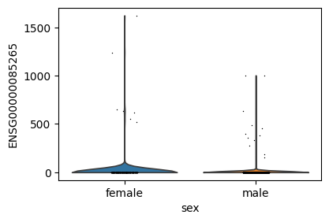
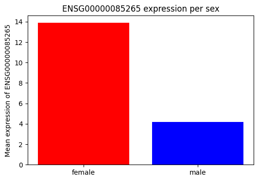

# cellNexusPy

## Importing the package


```python
from cellnexuspy import get_metadata, get_anndata
```

## Getting the metadata

The `get_metadata()` function returns a database connection and a DuckDB table.

The table can be used to query the metadata, while the connection's main purpose is to be closed when you are finished:


```python
conn, table = get_metadata()
table
```


    ┌──────────────────────────────────────────────────────────────────┬──────────────────────────────────────┬────────────────────┬──────────────────────────────────┬───────────┬────────────────────────────┬──────────────────────────────────┬───────────┬────────────────────────┬────────────┬─────────────────────────────────────────────────────────────────────────────────────────────────────────────────────────────────────────────────────────────────────────────────────────────────────────────────────────────────────────────────────────────────────────────────────────────────────────────┬──────────────────────────────────────┬──────────────────────────────────────┬───────────────────┬─────────────────────────┬────────────────────────────────────┬─────────┬──────────────────────────┬────────────┬───────────────┬──────────────────────────────────────────────────────────────────────────────┬───────────────┬────────────┬──────────┬─────────────────┬─────────────────────┬──────────────┬───────────────────────────┬────────────────────┬──────────────┬───────────────────┬────────────┬──────────────────┬──────────────────────────────────────────────────────────────────────────────────────┬────────────────┬─────────────────────────┬──────────────────────────────────────────┬─────────┬──────────────────────┬─────────────────┬────────────────┬─────────────────────────┬─────────────┬────────────────────────────────────────────────────────────────────────────────────────────────────────┬───────────┬─────────────────────────────────────────────────────────────────────────────────────┬────────────────────────────┬─────────┬─────────┬──────────┬─────────────────────────────────────┬──────────────────────┬───────────────────────────────────┬────────────────────────────────┬────────────────────────────┬──────────────────────────────┬────────────────────┬───────────────┬───────────────────────────┬────────────────────────────────────┬───────────────────┬──────────────────────┬────────────────────────────┬───────────┬──────────────────┬───────────────────────┬──────────────────────┬──────────────────────┬────────────────────┬───────────────┬─────────┬───────────────────┬────────────┬────────────┬────────────┬─────────────┬─────────────┬─────────────┬──────────────┬──────────────┬──────────────┬───────────────┬───────────────┬───────────────┬───────────────┬────────────────┬────────────────┬────────────────┬──────────────┬────────────┬─────────────────────────┬───────────────────────────────────────────┬───────────────────────────────────────────┬───────────────────┐
    │                             cell_id                              │              dataset_id              │ observation_joinid │            sample_id             │ cell_type │ cell_type_ontology_term_id │             sample_              │   assay   │ assay_ontology_term_id │ cell_count │                                                                                                                                                  citation                                                                                                                                                   │            collection_id             │          dataset_version_id          │ default_embedding │    development_stage    │ development_stage_ontology_term_id │ disease │ disease_ontology_term_id │  donor_id  │ experiment___ │                                 explorer_url                                 │ feature_count │  filesize  │ filetype │ is_primary_data │ mean_genes_per_cell │   organism   │ organism_ontology_term_id │ primary_cell_count │ published_at │ raw_data_location │ revised_at │ run_from_cell_id │                                   sample_heuristic                                   │ schema_version │ self_reported_ethnicity │ self_reported_ethnicity_ontology_term_id │   sex   │ sex_ontology_term_id │ suspension_type │     tissue     │ tissue_ontology_term_id │ tissue_type │                                                 title                                                  │ tombstone │                                         url                                         │ x_approximate_distribution │ X_umap1 │ X_umap2 │ age_days │            tissue_groups            │       atlas_id       │ cell_annotation_blueprint_singler │ cell_annotation_monaco_singler │ cell_annotation_azimuth_l2 │ nFeature_expressed_in_sample │     nCount_RNA     │ empty_droplet │  observation_originalid   │          ensemble_joinid           │ cell_type_unified │ data_driven_ensemble │ cell_type_unified_ensemble │ is_immune │ subsets_Mito_sum │ subsets_Mito_detected │ subsets_Mito_percent │ subsets_Ribo_percent │ high_mitochondrion │ high_ribosome │  alive  │ scDblFinder.class │ metacell_2 │ metacell_4 │ metacell_8 │ metacell_16 │ metacell_32 │ metacell_64 │ metacell_128 │ metacell_256 │ metacell_512 │ metacell_1024 │ metacell_2048 │ metacell_4096 │ metacell_8192 │ metacell_16384 │ metacell_32768 │ metacell_65536 │ sample_chunk │ cell_chunk │ sample_pseudobulk_chunk │       file_id_cellNexus_single_cell       │       file_id_cellNexus_pseudobulk        │ .aggregated_cells │
    │                             varchar                              │               varchar                │      varchar       │             varchar              │  varchar  │          varchar           │             varchar              │  varchar  │        varchar         │   int32    │                                                                                                                                                   varchar                                                                                                                                                   │               varchar                │               varchar                │      varchar      │         varchar         │              varchar               │ varchar │         varchar          │  varchar   │    varchar    │                                   varchar                                    │     int32     │   double   │ varchar  │     varchar     │       double        │   varchar    │          varchar          │      varchar       │   varchar    │      varchar      │  varchar   │     varchar      │                                       varchar                                        │    varchar     │         varchar         │                 varchar                  │ varchar │       varchar        │     varchar     │    varchar     │         varchar         │   varchar   │                                                varchar                                                 │  boolean  │                                       varchar                                       │          varchar           │ double  │ double  │  int32   │               varchar               │       varchar        │              varchar              │            varchar             │          varchar           │            int32             │       double       │    boolean    │          varchar          │              varchar               │      varchar      │       varchar        │          varchar           │  boolean  │      int32       │         int32         │        int32         │        int32         │      boolean       │    boolean    │ boolean │      varchar      │   int32    │   int32    │   int32    │    int32    │    int32    │    int32    │    int32     │    int32     │    int32     │     int32     │     int32     │     int32     │     int32     │     int32      │     int32      │     int32      │    int32     │   int32    │          int32          │                  varchar                  │                  varchar                  │       int32       │
    ├──────────────────────────────────────────────────────────────────┼──────────────────────────────────────┼────────────────────┼──────────────────────────────────┼───────────┼────────────────────────────┼──────────────────────────────────┼───────────┼────────────────────────┼────────────┼─────────────────────────────────────────────────────────────────────────────────────────────────────────────────────────────────────────────────────────────────────────────────────────────────────────────────────────────────────────────────────────────────────────────────────────────────────────────┼──────────────────────────────────────┼──────────────────────────────────────┼───────────────────┼─────────────────────────┼────────────────────────────────────┼─────────┼──────────────────────────┼────────────┼───────────────┼──────────────────────────────────────────────────────────────────────────────┼───────────────┼────────────┼──────────┼─────────────────┼─────────────────────┼──────────────┼───────────────────────────┼────────────────────┼──────────────┼───────────────────┼────────────┼──────────────────┼──────────────────────────────────────────────────────────────────────────────────────┼────────────────┼─────────────────────────┼──────────────────────────────────────────┼─────────┼──────────────────────┼─────────────────┼────────────────┼─────────────────────────┼─────────────┼────────────────────────────────────────────────────────────────────────────────────────────────────────┼───────────┼─────────────────────────────────────────────────────────────────────────────────────┼────────────────────────────┼─────────┼─────────┼──────────┼─────────────────────────────────────┼──────────────────────┼───────────────────────────────────┼────────────────────────────────┼────────────────────────────┼──────────────────────────────┼────────────────────┼───────────────┼───────────────────────────┼────────────────────────────────────┼───────────────────┼──────────────────────┼────────────────────────────┼───────────┼──────────────────┼───────────────────────┼──────────────────────┼──────────────────────┼────────────────────┼───────────────┼─────────┼───────────────────┼────────────┼────────────┼────────────┼─────────────┼─────────────┼─────────────┼──────────────┼──────────────┼──────────────┼───────────────┼───────────────┼───────────────┼───────────────┼────────────────┼────────────────┼────────────────┼──────────────┼────────────┼─────────────────────────┼───────────────────────────────────────────┼───────────────────────────────────────────┼───────────────────┤
    │ 10X383_6:CCTCATGGTACACGCC___0ee5ae70-c3f5-473f-bd1c-287f4690ffc5 │ 0ee5ae70-c3f5-473f-bd1c-287f4690ffc5 │ *|Vt;4ATOI         │ e732d3bf987f8dedf9c6d5365865d353 │ leukocyte │ CL:0000738                 │ e732d3bf987f8dedf9c6d5365865d353 │ 10x 3' v3 │ EFO:0009922            │      13623 │ Publication: https://doi.org/10.1126/science.add7046 Dataset Version: https://datasets.cellxgene.cziscience.com/6918480f-892a-42bf-a5cd-5e988f6e46b9.h5ad curated and distributed by CZ CELLxGENE Discover in Collection: https://cellxgene.cziscience.com/collections/283d65eb-dd53-496d-adb7-7570c7caa443 │ 283d65eb-dd53-496d-adb7-7570c7caa443 │ 6918480f-892a-42bf-a5cd-5e988f6e46b9 │ NULL              │ 29-year-old human stage │ HsapDv:0000123                     │ normal  │ PATO:0000461             │ H19.30.002 │               │ https://cellxgene.cziscience.com/e/0ee5ae70-c3f5-473f-bd1c-287f4690ffc5.cxg/ │         59236 │ 74734654.0 │ H5AD     │ TRUE            │   2034.543125596418 │ Homo sapiens │ NCBITaxon:9606            │ 13623              │ 2022-12-08   │ X                 │ 2024-06-11 │ NULL             │ H19.30.002___myelencephalon___29-year-old human stage___10x 3' v3______normal___TRUE │ 5.1.0          │ European                │ HANCESTRO:0005                           │ male    │ PATO:0000384         │ nucleus         │ myelencephalon │ UBERON:0005290          │ tissue      │ Dissection: Myelencephalon (medulla oblongata) (Mo) - sensory relay nuclei in medulla oblongata - MoSR │ false     │ https://datasets.cellxgene.cziscience.com/6918480f-892a-42bf-a5cd-5e988f6e46b9.h5ad │ NULL                       │    NULL │    NULL │    10585 │ brainstem and cerebellar structures │ cellxgene/21-08-2025 │ NK cells                          │ Natural killer cells           │ CD4 TCM                    │                          640 │   8.61724000001459 │ false         │ 10X383_6:CCTCATGGTACACGCC │ cd4 tcm_nk_nk_immune               │ immune            │ nk                   │ immune                     │ false     │                0 │                     0 │                    0 │                    0 │ false              │ false         │ true    │ singlet           │          6 │          1 │          1 │        NULL │        NULL │        NULL │         NULL │         NULL │         NULL │          NULL │          NULL │          NULL │          NULL │           NULL │           NULL │           NULL │            1 │          1 │                       1 │ 951aa2f741fc5b64acc1b7d72456d05c___1.h5ad │ 1d93977fde2e30c44b82205e48d88228___1.h5ad │                14 │
    │ 10X383_6:GATTTCTTCCAACCAA___0ee5ae70-c3f5-473f-bd1c-287f4690ffc5 │ 0ee5ae70-c3f5-473f-bd1c-287f4690ffc5 │ #z5ft!kwbn         │ e732d3bf987f8dedf9c6d5365865d353 │ leukocyte │ CL:0000738                 │ e732d3bf987f8dedf9c6d5365865d353 │ 10x 3' v3 │ EFO:0009922            │      13623 │ Publication: https://doi.org/10.1126/science.add7046 Dataset Version: https://datasets.cellxgene.cziscience.com/6918480f-892a-42bf-a5cd-5e988f6e46b9.h5ad curated and distributed by CZ CELLxGENE Discover in Collection: https://cellxgene.cziscience.com/collections/283d65eb-dd53-496d-adb7-7570c7caa443 │ 283d65eb-dd53-496d-adb7-7570c7caa443 │ 6918480f-892a-42bf-a5cd-5e988f6e46b9 │ NULL              │ 29-year-old human stage │ HsapDv:0000123                     │ normal  │ PATO:0000461             │ H19.30.002 │               │ https://cellxgene.cziscience.com/e/0ee5ae70-c3f5-473f-bd1c-287f4690ffc5.cxg/ │         59236 │ 74734654.0 │ H5AD     │ TRUE            │   2034.543125596418 │ Homo sapiens │ NCBITaxon:9606            │ 13623              │ 2022-12-08   │ X                 │ 2024-06-11 │ NULL             │ H19.30.002___myelencephalon___29-year-old human stage___10x 3' v3______normal___TRUE │ 5.1.0          │ European                │ HANCESTRO:0005                           │ male    │ PATO:0000384         │ nucleus         │ myelencephalon │ UBERON:0005290          │ tissue      │ Dissection: Myelencephalon (medulla oblongata) (Mo) - sensory relay nuclei in medulla oblongata - MoSR │ false     │ https://datasets.cellxgene.cziscience.com/6918480f-892a-42bf-a5cd-5e988f6e46b9.h5ad │ NULL                       │    NULL │    NULL │    10585 │ brainstem and cerebellar structures │ cellxgene/21-08-2025 │ NK cells                          │ Natural killer cells           │ CD4 TCM                    │                          584 │  7.653930000013588 │ false         │ 10X383_6:GATTTCTTCCAACCAA │ cd4 tcm_nk_nk_immune               │ immune            │ nk                   │ immune                     │ false     │                0 │                     0 │                    0 │                    0 │ false              │ false         │ true    │ singlet           │          3 │          1 │          1 │        NULL │        NULL │        NULL │         NULL │         NULL │         NULL │          NULL │          NULL │          NULL │          NULL │           NULL │           NULL │           NULL │            1 │          1 │                       1 │ 951aa2f741fc5b64acc1b7d72456d05c___1.h5ad │ 1d93977fde2e30c44b82205e48d88228___1.h5ad │                14 │
    │ 10X383_5:CTCCAACTCGCTCTAC___0ee5ae70-c3f5-473f-bd1c-287f4690ffc5 │ 0ee5ae70-c3f5-473f-bd1c-287f4690ffc5 │ kd(R>I7G#-         │ e732d3bf987f8dedf9c6d5365865d353 │ leukocyte │ CL:0000738                 │ e732d3bf987f8dedf9c6d5365865d353 │ 10x 3' v3 │ EFO:0009922            │      13623 │ Publication: https://doi.org/10.1126/science.add7046 Dataset Version: https://datasets.cellxgene.cziscience.com/6918480f-892a-42bf-a5cd-5e988f6e46b9.h5ad curated and distributed by CZ CELLxGENE Discover in Collection: https://cellxgene.cziscience.com/collections/283d65eb-dd53-496d-adb7-7570c7caa443 │ 283d65eb-dd53-496d-adb7-7570c7caa443 │ 6918480f-892a-42bf-a5cd-5e988f6e46b9 │ NULL              │ 29-year-old human stage │ HsapDv:0000123                     │ normal  │ PATO:0000461             │ H19.30.002 │               │ https://cellxgene.cziscience.com/e/0ee5ae70-c3f5-473f-bd1c-287f4690ffc5.cxg/ │         59236 │ 74734654.0 │ H5AD     │ TRUE            │   2034.543125596418 │ Homo sapiens │ NCBITaxon:9606            │ 13623              │ 2022-12-08   │ X                 │ 2024-06-11 │ NULL             │ H19.30.002___myelencephalon___29-year-old human stage___10x 3' v3______normal___TRUE │ 5.1.0          │ European                │ HANCESTRO:0005                           │ male    │ PATO:0000384         │ nucleus         │ myelencephalon │ UBERON:0005290          │ tissue      │ Dissection: Myelencephalon (medulla oblongata) (Mo) - sensory relay nuclei in medulla oblongata - MoSR │ false     │ https://datasets.cellxgene.cziscience.com/6918480f-892a-42bf-a5cd-5e988f6e46b9.h5ad │ NULL                       │    NULL │    NULL │    10585 │ brainstem and cerebellar structures │ cellxgene/21-08-2025 │ CD4+ Tcm                          │ Th17 cells                     │ CD4 TCM                    │                          776 │  10.61494000001926 │ false         │ 10X383_5:CTCCAACTCGCTCTAC │ cd4 tcm_cd4 tcm_cd4 th17 em_immune │ immune            │ cd4 tcm              │ immune                     │ false     │                0 │                     0 │                    0 │                    0 │ false              │ false         │ true    │ singlet           │          1 │          3 │          2 │        NULL │        NULL │        NULL │         NULL │         NULL │         NULL │          NULL │          NULL │          NULL │          NULL │           NULL │           NULL │           NULL │            1 │          1 │                       1 │ 951aa2f741fc5b64acc1b7d72456d05c___1.h5ad │ 1d93977fde2e30c44b82205e48d88228___1.h5ad │                14 │
    │ 10X383_5:GATCATGCATGTGGTT___0ee5ae70-c3f5-473f-bd1c-287f4690ffc5 │ 0ee5ae70-c3f5-473f-bd1c-287f4690ffc5 │ mSylksfIn3         │ e732d3bf987f8dedf9c6d5365865d353 │ leukocyte │ CL:0000738                 │ e732d3bf987f8dedf9c6d5365865d353 │ 10x 3' v3 │ EFO:0009922            │      13623 │ Publication: https://doi.org/10.1126/science.add7046 Dataset Version: https://datasets.cellxgene.cziscience.com/6918480f-892a-42bf-a5cd-5e988f6e46b9.h5ad curated and distributed by CZ CELLxGENE Discover in Collection: https://cellxgene.cziscience.com/collections/283d65eb-dd53-496d-adb7-7570c7caa443 │ 283d65eb-dd53-496d-adb7-7570c7caa443 │ 6918480f-892a-42bf-a5cd-5e988f6e46b9 │ NULL              │ 29-year-old human stage │ HsapDv:0000123                     │ normal  │ PATO:0000461             │ H19.30.002 │               │ https://cellxgene.cziscience.com/e/0ee5ae70-c3f5-473f-bd1c-287f4690ffc5.cxg/ │         59236 │ 74734654.0 │ H5AD     │ TRUE            │   2034.543125596418 │ Homo sapiens │ NCBITaxon:9606            │ 13623              │ 2022-12-08   │ X                 │ 2024-06-11 │ NULL             │ H19.30.002___myelencephalon___29-year-old human stage___10x 3' v3______normal___TRUE │ 5.1.0          │ European                │ HANCESTRO:0005                           │ male    │ PATO:0000384         │ nucleus         │ myelencephalon │ UBERON:0005290          │ tissue      │ Dissection: Myelencephalon (medulla oblongata) (Mo) - sensory relay nuclei in medulla oblongata - MoSR │ false     │ https://datasets.cellxgene.cziscience.com/6918480f-892a-42bf-a5cd-5e988f6e46b9.h5ad │ NULL                       │    NULL │    NULL │    10585 │ brainstem and cerebellar structures │ cellxgene/21-08-2025 │ CD8+ Tem                          │ MAIT cells                     │ CD4 TCM                    │                          627 │  7.980630000013889 │ false         │ 10X383_5:GATCATGCATGTGGTT │ cd4 tcm_cd8 tem_mait_immune        │ immune            │ t                    │ immune                     │ false     │                0 │                     0 │                    0 │                    0 │ false              │ false         │ true    │ singlet           │          1 │          3 │          2 │        NULL │        NULL │        NULL │         NULL │         NULL │         NULL │          NULL │          NULL │          NULL │          NULL │           NULL │           NULL │           NULL │            1 │          1 │                       1 │ 951aa2f741fc5b64acc1b7d72456d05c___1.h5ad │ 1d93977fde2e30c44b82205e48d88228___1.h5ad │                14 │
    │ 10X218_3:CAATCGATCCGATGTA___0ee5ae70-c3f5-473f-bd1c-287f4690ffc5 │ 0ee5ae70-c3f5-473f-bd1c-287f4690ffc5 │ XEl?wkHAcg         │ 979206e179f85043e0c653a7a8e5c2ac │ leukocyte │ CL:0000738                 │ 979206e179f85043e0c653a7a8e5c2ac │ 10x 3' v3 │ EFO:0009922            │      13623 │ Publication: https://doi.org/10.1126/science.add7046 Dataset Version: https://datasets.cellxgene.cziscience.com/6918480f-892a-42bf-a5cd-5e988f6e46b9.h5ad curated and distributed by CZ CELLxGENE Discover in Collection: https://cellxgene.cziscience.com/collections/283d65eb-dd53-496d-adb7-7570c7caa443 │ 283d65eb-dd53-496d-adb7-7570c7caa443 │ 6918480f-892a-42bf-a5cd-5e988f6e46b9 │ NULL              │ 50-year-old human stage │ HsapDv:0000144                     │ normal  │ PATO:0000461             │ H18.30.002 │               │ https://cellxgene.cziscience.com/e/0ee5ae70-c3f5-473f-bd1c-287f4690ffc5.cxg/ │         59236 │ 74734654.0 │ H5AD     │ TRUE            │   2034.543125596418 │ Homo sapiens │ NCBITaxon:9606            │ 13623              │ 2022-12-08   │ X                 │ 2024-06-11 │ NULL             │ H18.30.002___myelencephalon___50-year-old human stage___10x 3' v3______normal___TRUE │ 5.1.0          │ European                │ HANCESTRO:0005                           │ male    │ PATO:0000384         │ nucleus         │ myelencephalon │ UBERON:0005290          │ tissue      │ Dissection: Myelencephalon (medulla oblongata) (Mo) - sensory relay nuclei in medulla oblongata - MoSR │ false     │ https://datasets.cellxgene.cziscience.com/6918480f-892a-42bf-a5cd-5e988f6e46b9.h5ad │ NULL                       │    NULL │    NULL │    18250 │ brainstem and cerebellar structures │ cellxgene/21-08-2025 │ CD8+ Tem                          │ MAIT cells                     │ CD4 TCM                    │                         1209 │ 6.5761000000534295 │ false         │ 10X218_3:CAATCGATCCGATGTA │ cd4 tcm_cd8 tem_mait_immune        │ immune            │ t                    │ immune                     │ false     │                0 │                     0 │                    0 │                    0 │ false              │ false         │ true    │ singlet           │          1 │          1 │          1 │        NULL │        NULL │        NULL │         NULL │         NULL │         NULL │          NULL │          NULL │          NULL │          NULL │           NULL │           NULL │           NULL │            1 │          1 │                       1 │ 951aa2f741fc5b64acc1b7d72456d05c___1.h5ad │ 1d93977fde2e30c44b82205e48d88228___1.h5ad │                 8 │
    │ 10X383_5:CTTCCTTCATGGCCCA___0ee5ae70-c3f5-473f-bd1c-287f4690ffc5 │ 0ee5ae70-c3f5-473f-bd1c-287f4690ffc5 │ T_4$MfQ!Ss         │ e732d3bf987f8dedf9c6d5365865d353 │ leukocyte │ CL:0000738                 │ e732d3bf987f8dedf9c6d5365865d353 │ 10x 3' v3 │ EFO:0009922            │      13623 │ Publication: https://doi.org/10.1126/science.add7046 Dataset Version: https://datasets.cellxgene.cziscience.com/6918480f-892a-42bf-a5cd-5e988f6e46b9.h5ad curated and distributed by CZ CELLxGENE Discover in Collection: https://cellxgene.cziscience.com/collections/283d65eb-dd53-496d-adb7-7570c7caa443 │ 283d65eb-dd53-496d-adb7-7570c7caa443 │ 6918480f-892a-42bf-a5cd-5e988f6e46b9 │ NULL              │ 29-year-old human stage │ HsapDv:0000123                     │ normal  │ PATO:0000461             │ H19.30.002 │               │ https://cellxgene.cziscience.com/e/0ee5ae70-c3f5-473f-bd1c-287f4690ffc5.cxg/ │         59236 │ 74734654.0 │ H5AD     │ TRUE            │   2034.543125596418 │ Homo sapiens │ NCBITaxon:9606            │ 13623              │ 2022-12-08   │ X                 │ 2024-06-11 │ NULL             │ H19.30.002___myelencephalon___29-year-old human stage___10x 3' v3______normal___TRUE │ 5.1.0          │ European                │ HANCESTRO:0005                           │ male    │ PATO:0000384         │ nucleus         │ myelencephalon │ UBERON:0005290          │ tissue      │ Dissection: Myelencephalon (medulla oblongata) (Mo) - sensory relay nuclei in medulla oblongata - MoSR │ false     │ https://datasets.cellxgene.cziscience.com/6918480f-892a-42bf-a5cd-5e988f6e46b9.h5ad │ NULL                       │    NULL │    NULL │    10585 │ brainstem and cerebellar structures │ cellxgene/21-08-2025 │ CD8+ Tem                          │ Terminal effector CD8 T cells  │ CD4 TCM                    │                          800 │ 10.928610000019034 │ false         │ 10X383_5:CTTCCTTCATGGCCCA │ cd4 tcm_cd8 tem_cd8 tem_immune     │ immune            │ cd8 tem              │ immune                     │ false     │                0 │                     0 │                    0 │                    0 │ false              │ false         │ true    │ singlet           │          4 │          2 │          1 │        NULL │        NULL │        NULL │         NULL │         NULL │         NULL │          NULL │          NULL │          NULL │          NULL │           NULL │           NULL │           NULL │            1 │          1 │                       1 │ 951aa2f741fc5b64acc1b7d72456d05c___1.h5ad │ 1d93977fde2e30c44b82205e48d88228___1.h5ad │                14 │
    │ 10X218_3:TATTGCTTCATCGCTC___0ee5ae70-c3f5-473f-bd1c-287f4690ffc5 │ 0ee5ae70-c3f5-473f-bd1c-287f4690ffc5 │ &yS%7ee<`?         │ 979206e179f85043e0c653a7a8e5c2ac │ leukocyte │ CL:0000738                 │ 979206e179f85043e0c653a7a8e5c2ac │ 10x 3' v3 │ EFO:0009922            │      13623 │ Publication: https://doi.org/10.1126/science.add7046 Dataset Version: https://datasets.cellxgene.cziscience.com/6918480f-892a-42bf-a5cd-5e988f6e46b9.h5ad curated and distributed by CZ CELLxGENE Discover in Collection: https://cellxgene.cziscience.com/collections/283d65eb-dd53-496d-adb7-7570c7caa443 │ 283d65eb-dd53-496d-adb7-7570c7caa443 │ 6918480f-892a-42bf-a5cd-5e988f6e46b9 │ NULL              │ 50-year-old human stage │ HsapDv:0000144                     │ normal  │ PATO:0000461             │ H18.30.002 │               │ https://cellxgene.cziscience.com/e/0ee5ae70-c3f5-473f-bd1c-287f4690ffc5.cxg/ │         59236 │ 74734654.0 │ H5AD     │ TRUE            │   2034.543125596418 │ Homo sapiens │ NCBITaxon:9606            │ 13623              │ 2022-12-08   │ X                 │ 2024-06-11 │ NULL             │ H18.30.002___myelencephalon___50-year-old human stage___10x 3' v3______normal___TRUE │ 5.1.0          │ European                │ HANCESTRO:0005                           │ male    │ PATO:0000384         │ nucleus         │ myelencephalon │ UBERON:0005290          │ tissue      │ Dissection: Myelencephalon (medulla oblongata) (Mo) - sensory relay nuclei in medulla oblongata - MoSR │ false     │ https://datasets.cellxgene.cziscience.com/6918480f-892a-42bf-a5cd-5e988f6e46b9.h5ad │ NULL                       │    NULL │    NULL │    18250 │ brainstem and cerebellar structures │ cellxgene/21-08-2025 │ CD8+ Tem                          │ MAIT cells                     │ CD4 TCM                    │                         1297 │ 7.5459900000537345 │ false         │ 10X218_3:TATTGCTTCATCGCTC │ cd4 tcm_cd8 tem_mait_immune        │ immune            │ t                    │ immune                     │ false     │                0 │                     0 │                    0 │                    0 │ false              │ false         │ true    │ singlet           │          1 │          1 │          1 │        NULL │        NULL │        NULL │         NULL │         NULL │         NULL │          NULL │          NULL │          NULL │          NULL │           NULL │           NULL │           NULL │            1 │          1 │                       1 │ 951aa2f741fc5b64acc1b7d72456d05c___1.h5ad │ 1d93977fde2e30c44b82205e48d88228___1.h5ad │                 8 │
    │ 10X218_3:CCATAAGGTGTCGATT___0ee5ae70-c3f5-473f-bd1c-287f4690ffc5 │ 0ee5ae70-c3f5-473f-bd1c-287f4690ffc5 │ 0*ArkI0ju;         │ 979206e179f85043e0c653a7a8e5c2ac │ leukocyte │ CL:0000738                 │ 979206e179f85043e0c653a7a8e5c2ac │ 10x 3' v3 │ EFO:0009922            │      13623 │ Publication: https://doi.org/10.1126/science.add7046 Dataset Version: https://datasets.cellxgene.cziscience.com/6918480f-892a-42bf-a5cd-5e988f6e46b9.h5ad curated and distributed by CZ CELLxGENE Discover in Collection: https://cellxgene.cziscience.com/collections/283d65eb-dd53-496d-adb7-7570c7caa443 │ 283d65eb-dd53-496d-adb7-7570c7caa443 │ 6918480f-892a-42bf-a5cd-5e988f6e46b9 │ NULL              │ 50-year-old human stage │ HsapDv:0000144                     │ normal  │ PATO:0000461             │ H18.30.002 │               │ https://cellxgene.cziscience.com/e/0ee5ae70-c3f5-473f-bd1c-287f4690ffc5.cxg/ │         59236 │ 74734654.0 │ H5AD     │ TRUE            │   2034.543125596418 │ Homo sapiens │ NCBITaxon:9606            │ 13623              │ 2022-12-08   │ X                 │ 2024-06-11 │ NULL             │ H18.30.002___myelencephalon___50-year-old human stage___10x 3' v3______normal___TRUE │ 5.1.0          │ European                │ HANCESTRO:0005                           │ male    │ PATO:0000384         │ nucleus         │ myelencephalon │ UBERON:0005290          │ tissue      │ Dissection: Myelencephalon (medulla oblongata) (Mo) - sensory relay nuclei in medulla oblongata - MoSR │ false     │ https://datasets.cellxgene.cziscience.com/6918480f-892a-42bf-a5cd-5e988f6e46b9.h5ad │ NULL                       │    NULL │    NULL │    18250 │ brainstem and cerebellar structures │ cellxgene/21-08-2025 │ CD8+ Tem                          │ Effector memory CD8 T cells    │ CD4 TCM                    │                         1005 │ 5.1562300000396135 │ false         │ 10X218_3:CCATAAGGTGTCGATT │ cd4 tcm_cd8 tem_cd8 tem_immune     │ immune            │ cd8 tem              │ immune                     │ false     │                0 │                     0 │                    0 │                    0 │ false              │ false         │ true    │ singlet           │          2 │          2 │          1 │        NULL │        NULL │        NULL │         NULL │         NULL │         NULL │          NULL │          NULL │          NULL │          NULL │           NULL │           NULL │           NULL │            1 │          1 │                       1 │ 951aa2f741fc5b64acc1b7d72456d05c___1.h5ad │ 1d93977fde2e30c44b82205e48d88228___1.h5ad │                 8 │
    │ 10X218_3:ACTCTCGTCACCGCTT___0ee5ae70-c3f5-473f-bd1c-287f4690ffc5 │ 0ee5ae70-c3f5-473f-bd1c-287f4690ffc5 │ r<pyq>qS=W         │ 979206e179f85043e0c653a7a8e5c2ac │ leukocyte │ CL:0000738                 │ 979206e179f85043e0c653a7a8e5c2ac │ 10x 3' v3 │ EFO:0009922            │      13623 │ Publication: https://doi.org/10.1126/science.add7046 Dataset Version: https://datasets.cellxgene.cziscience.com/6918480f-892a-42bf-a5cd-5e988f6e46b9.h5ad curated and distributed by CZ CELLxGENE Discover in Collection: https://cellxgene.cziscience.com/collections/283d65eb-dd53-496d-adb7-7570c7caa443 │ 283d65eb-dd53-496d-adb7-7570c7caa443 │ 6918480f-892a-42bf-a5cd-5e988f6e46b9 │ NULL              │ 50-year-old human stage │ HsapDv:0000144                     │ normal  │ PATO:0000461             │ H18.30.002 │               │ https://cellxgene.cziscience.com/e/0ee5ae70-c3f5-473f-bd1c-287f4690ffc5.cxg/ │         59236 │ 74734654.0 │ H5AD     │ TRUE            │   2034.543125596418 │ Homo sapiens │ NCBITaxon:9606            │ 13623              │ 2022-12-08   │ X                 │ 2024-06-11 │ NULL             │ H18.30.002___myelencephalon___50-year-old human stage___10x 3' v3______normal___TRUE │ 5.1.0          │ European                │ HANCESTRO:0005                           │ male    │ PATO:0000384         │ nucleus         │ myelencephalon │ UBERON:0005290          │ tissue      │ Dissection: Myelencephalon (medulla oblongata) (Mo) - sensory relay nuclei in medulla oblongata - MoSR │ false     │ https://datasets.cellxgene.cziscience.com/6918480f-892a-42bf-a5cd-5e988f6e46b9.h5ad │ NULL                       │    NULL │    NULL │    18250 │ brainstem and cerebellar structures │ cellxgene/21-08-2025 │ CD8+ Tem                          │ Vd2 gd T cells                 │ CD4 TCM                    │                          986 │ 4.7659900000426205 │ false         │ 10X218_3:ACTCTCGTCACCGCTT │ cd4 tcm_cd8 tem_tgd_immune         │ immune            │ t                    │ immune                     │ false     │                0 │                     0 │                    0 │                    0 │ false              │ false         │ true    │ singlet           │          1 │          1 │          1 │        NULL │        NULL │        NULL │         NULL │         NULL │         NULL │          NULL │          NULL │          NULL │          NULL │           NULL │           NULL │           NULL │            1 │          1 │                       1 │ 951aa2f741fc5b64acc1b7d72456d05c___1.h5ad │ 1d93977fde2e30c44b82205e48d88228___1.h5ad │                 8 │
    │ 10X383_6:CCCTTAGGTATTCTCT___0ee5ae70-c3f5-473f-bd1c-287f4690ffc5 │ 0ee5ae70-c3f5-473f-bd1c-287f4690ffc5 │ )tfjoT&}j{         │ e732d3bf987f8dedf9c6d5365865d353 │ leukocyte │ CL:0000738                 │ e732d3bf987f8dedf9c6d5365865d353 │ 10x 3' v3 │ EFO:0009922            │      13623 │ Publication: https://doi.org/10.1126/science.add7046 Dataset Version: https://datasets.cellxgene.cziscience.com/6918480f-892a-42bf-a5cd-5e988f6e46b9.h5ad curated and distributed by CZ CELLxGENE Discover in Collection: https://cellxgene.cziscience.com/collections/283d65eb-dd53-496d-adb7-7570c7caa443 │ 283d65eb-dd53-496d-adb7-7570c7caa443 │ 6918480f-892a-42bf-a5cd-5e988f6e46b9 │ NULL              │ 29-year-old human stage │ HsapDv:0000123                     │ normal  │ PATO:0000461             │ H19.30.002 │               │ https://cellxgene.cziscience.com/e/0ee5ae70-c3f5-473f-bd1c-287f4690ffc5.cxg/ │         59236 │ 74734654.0 │ H5AD     │ TRUE            │   2034.543125596418 │ Homo sapiens │ NCBITaxon:9606            │ 13623              │ 2022-12-08   │ X                 │ 2024-06-11 │ NULL             │ H19.30.002___myelencephalon___29-year-old human stage___10x 3' v3______normal___TRUE │ 5.1.0          │ European                │ HANCESTRO:0005                           │ male    │ PATO:0000384         │ nucleus         │ myelencephalon │ UBERON:0005290          │ tissue      │ Dissection: Myelencephalon (medulla oblongata) (Mo) - sensory relay nuclei in medulla oblongata - MoSR │ false     │ https://datasets.cellxgene.cziscience.com/6918480f-892a-42bf-a5cd-5e988f6e46b9.h5ad │ NULL                       │    NULL │    NULL │    10585 │ brainstem and cerebellar structures │ cellxgene/21-08-2025 │ CD8+ Tem                          │ Vd2 gd T cells                 │ CD4 TCM                    │                          799 │  10.85975000002054 │ false         │ 10X383_6:CCCTTAGGTATTCTCT │ cd4 tcm_cd8 tem_tgd_immune         │ immune            │ t                    │ immune                     │ false     │                0 │                     0 │                    0 │                    0 │ false              │ false         │ true    │ singlet           │          4 │          2 │          1 │        NULL │        NULL │        NULL │         NULL │         NULL │         NULL │          NULL │          NULL │          NULL │          NULL │           NULL │           NULL │           NULL │            1 │          1 │                       1 │ 951aa2f741fc5b64acc1b7d72456d05c___1.h5ad │ 1d93977fde2e30c44b82205e48d88228___1.h5ad │                14 │
    │                                ·                                 │                  ·                   │     ·              │                ·                 │   ·       │     ·                      │                ·                 │     ·     │      ·                 │        ·   │                                                                                                                                                      ·                                                                                                                                                      │                  ·                   │                  ·                   │  ·                │            ·            │       ·                            │   ·     │      ·                   │     ·      │       ·       │                                      ·                                       │           ·   │      ·     │  ·       │  ·              │           ·         │      ·       │       ·                   │   ·                │     ·        │ ·                 │     ·      │  ·               │                                          ·                                           │   ·            │    ·                    │       ·                                  │  ·      │      ·               │    ·            │       ·        │       ·                 │   ·         │                                                   ·                                                    │   ·       │                                          ·                                          │  ·                         │      ·  │      ·  │      ·   │                  ·                  │          ·           │    ·                              │       ·                        │   ·                        │                           ·  │          ·         │   ·           │             ·             │            ·                       │   ·               │ ·                    │   ·                        │   ·       │                · │                     · │                    · │                    · │   ·                │   ·           │  ·      │    ·              │          · │          · │          · │           · │           · │           · │            · │            · │            · │             · │             · │            ·  │            ·  │             ·  │             ·  │             ·  │            · │          · │                       · │                     ·                     │                     ·                     │                 · │
    │                                ·                                 │                  ·                   │     ·              │                ·                 │   ·       │     ·                      │                ·                 │     ·     │      ·                 │        ·   │                                                                                                                                                      ·                                                                                                                                                      │                  ·                   │                  ·                   │  ·                │            ·            │       ·                            │   ·     │      ·                   │     ·      │       ·       │                                      ·                                       │           ·   │      ·     │  ·       │  ·              │           ·         │      ·       │       ·                   │   ·                │     ·        │ ·                 │     ·      │  ·               │                                          ·                                           │   ·            │    ·                    │       ·                                  │  ·      │      ·               │    ·            │       ·        │       ·                 │   ·         │                                                   ·                                                    │   ·       │                                          ·                                          │  ·                         │      ·  │      ·  │      ·   │                  ·                  │          ·           │    ·                              │       ·                        │   ·                        │                           ·  │          ·         │   ·           │             ·             │            ·                       │   ·               │ ·                    │   ·                        │   ·       │                · │                     · │                    · │                    · │   ·                │   ·           │  ·      │    ·              │          · │          · │          · │           · │           · │           · │            · │            · │            · │             · │             · │            ·  │            ·  │             ·  │             ·  │             ·  │            · │          · │                       · │                     ·                     │                     ·                     │                 · │
    │                                ·                                 │                  ·                   │     ·              │                ·                 │   ·       │     ·                      │                ·                 │     ·     │      ·                 │        ·   │                                                                                                                                                      ·                                                                                                                                                      │                  ·                   │                  ·                   │  ·                │            ·            │       ·                            │   ·     │      ·                   │     ·      │       ·       │                                      ·                                       │           ·   │      ·     │  ·       │  ·              │           ·         │      ·       │       ·                   │   ·                │     ·        │ ·                 │     ·      │  ·               │                                          ·                                           │   ·            │    ·                    │       ·                                  │  ·      │      ·               │    ·            │       ·        │       ·                 │   ·         │                                                   ·                                                    │   ·       │                                          ·                                          │  ·                         │      ·  │      ·  │      ·   │                  ·                  │          ·           │    ·                              │       ·                        │   ·                        │                           ·  │          ·         │   ·           │             ·             │            ·                       │   ·               │ ·                    │   ·                        │   ·       │                · │                     · │                    · │                    · │   ·                │   ·           │  ·      │    ·              │          · │          · │          · │           · │           · │           · │            · │            · │            · │             · │             · │            ·  │            ·  │             ·  │             ·  │             ·  │            · │          · │                       · │                     ·                     │                     ·                     │                 · │
    │ 10X379_2:GTGGAAGAGCGTATGG___0ee5ae70-c3f5-473f-bd1c-287f4690ffc5 │ 0ee5ae70-c3f5-473f-bd1c-287f4690ffc5 │ )03`X$FOAt         │ 4a72334766418cf47e22ba0b9921df3f │ neuron    │ CL:0000540                 │ 4a72334766418cf47e22ba0b9921df3f │ 10x 3' v3 │ EFO:0009922            │      13623 │ Publication: https://doi.org/10.1126/science.add7046 Dataset Version: https://datasets.cellxgene.cziscience.com/6918480f-892a-42bf-a5cd-5e988f6e46b9.h5ad curated and distributed by CZ CELLxGENE Discover in Collection: https://cellxgene.cziscience.com/collections/283d65eb-dd53-496d-adb7-7570c7caa443 │ 283d65eb-dd53-496d-adb7-7570c7caa443 │ 6918480f-892a-42bf-a5cd-5e988f6e46b9 │ NULL              │ 42-year-old human stage │ HsapDv:0000136                     │ normal  │ PATO:0000461             │ H19.30.001 │               │ https://cellxgene.cziscience.com/e/0ee5ae70-c3f5-473f-bd1c-287f4690ffc5.cxg/ │         59236 │ 74734654.0 │ H5AD     │ TRUE            │   2034.543125596418 │ Homo sapiens │ NCBITaxon:9606            │ 13623              │ 2022-12-08   │ X                 │ 2024-06-11 │ NULL             │ H19.30.001___myelencephalon___42-year-old human stage___10x 3' v3______normal___TRUE │ 5.1.0          │ European                │ HANCESTRO:0005                           │ male    │ PATO:0000384         │ nucleus         │ myelencephalon │ UBERON:0005290          │ tissue      │ Dissection: Myelencephalon (medulla oblongata) (Mo) - sensory relay nuclei in medulla oblongata - MoSR │ false     │ https://datasets.cellxgene.cziscience.com/6918480f-892a-42bf-a5cd-5e988f6e46b9.h5ad │ NULL                       │    NULL │    NULL │    15330 │ brainstem and cerebellar structures │ cellxgene/21-08-2025 │ Neurons                           │ Myeloid dendritic cells        │ Other                      │                         2223 │ 12.317679999937809 │ false         │ 10X379_2:GTGGAAGAGCGTATGG │ NA_non immune_cdc_neuron           │ neuron            │ non immune           │ neuron                     │ false     │                0 │                     0 │                    0 │                    0 │ false              │ false         │ true    │ singlet           │         63 │         91 │         25 │           6 │           3 │          13 │            3 │            1 │            1 │             1 │             1 │          NULL │          NULL │           NULL │           NULL │           NULL │            1 │          1 │                       1 │ 88c644a9fe23d692cec09a1267c6f26f___1.h5ad │ 1d93977fde2e30c44b82205e48d88228___1.h5ad │              2339 │
    │ 10X379_2:GTTACAGTCACCTACC___0ee5ae70-c3f5-473f-bd1c-287f4690ffc5 │ 0ee5ae70-c3f5-473f-bd1c-287f4690ffc5 │ dH|m|2l~-i         │ 4a72334766418cf47e22ba0b9921df3f │ neuron    │ CL:0000540                 │ 4a72334766418cf47e22ba0b9921df3f │ 10x 3' v3 │ EFO:0009922            │      13623 │ Publication: https://doi.org/10.1126/science.add7046 Dataset Version: https://datasets.cellxgene.cziscience.com/6918480f-892a-42bf-a5cd-5e988f6e46b9.h5ad curated and distributed by CZ CELLxGENE Discover in Collection: https://cellxgene.cziscience.com/collections/283d65eb-dd53-496d-adb7-7570c7caa443 │ 283d65eb-dd53-496d-adb7-7570c7caa443 │ 6918480f-892a-42bf-a5cd-5e988f6e46b9 │ NULL              │ 42-year-old human stage │ HsapDv:0000136                     │ normal  │ PATO:0000461             │ H19.30.001 │               │ https://cellxgene.cziscience.com/e/0ee5ae70-c3f5-473f-bd1c-287f4690ffc5.cxg/ │         59236 │ 74734654.0 │ H5AD     │ TRUE            │   2034.543125596418 │ Homo sapiens │ NCBITaxon:9606            │ 13623              │ 2022-12-08   │ X                 │ 2024-06-11 │ NULL             │ H19.30.001___myelencephalon___42-year-old human stage___10x 3' v3______normal___TRUE │ 5.1.0          │ European                │ HANCESTRO:0005                           │ male    │ PATO:0000384         │ nucleus         │ myelencephalon │ UBERON:0005290          │ tissue      │ Dissection: Myelencephalon (medulla oblongata) (Mo) - sensory relay nuclei in medulla oblongata - MoSR │ false     │ https://datasets.cellxgene.cziscience.com/6918480f-892a-42bf-a5cd-5e988f6e46b9.h5ad │ NULL                       │    NULL │    NULL │    15330 │ brainstem and cerebellar structures │ cellxgene/21-08-2025 │ Neurons                           │ Progenitor cells               │ Other                      │                         2129 │ 15.406209999942575 │ false         │ 10X379_2:GTTACAGTCACCTACC │ NA_non immune_progenitor_neuron    │ neuron            │ non immune           │ neuron                     │ false     │                0 │                     0 │                    0 │                    0 │ false              │ false         │ true    │ singlet           │         31 │        182 │          7 │          49 │           5 │          10 │            3 │            1 │            1 │             1 │             1 │          NULL │          NULL │           NULL │           NULL │           NULL │            1 │          1 │                       1 │ 88c644a9fe23d692cec09a1267c6f26f___1.h5ad │ 1d93977fde2e30c44b82205e48d88228___1.h5ad │              2339 │
    │ 10X218_3:GATTGGTCAGATACCT___0ee5ae70-c3f5-473f-bd1c-287f4690ffc5 │ 0ee5ae70-c3f5-473f-bd1c-287f4690ffc5 │ m9Zo<d5(*t         │ 979206e179f85043e0c653a7a8e5c2ac │ neuron    │ CL:0000540                 │ 979206e179f85043e0c653a7a8e5c2ac │ 10x 3' v3 │ EFO:0009922            │      13623 │ Publication: https://doi.org/10.1126/science.add7046 Dataset Version: https://datasets.cellxgene.cziscience.com/6918480f-892a-42bf-a5cd-5e988f6e46b9.h5ad curated and distributed by CZ CELLxGENE Discover in Collection: https://cellxgene.cziscience.com/collections/283d65eb-dd53-496d-adb7-7570c7caa443 │ 283d65eb-dd53-496d-adb7-7570c7caa443 │ 6918480f-892a-42bf-a5cd-5e988f6e46b9 │ NULL              │ 50-year-old human stage │ HsapDv:0000144                     │ normal  │ PATO:0000461             │ H18.30.002 │               │ https://cellxgene.cziscience.com/e/0ee5ae70-c3f5-473f-bd1c-287f4690ffc5.cxg/ │         59236 │ 74734654.0 │ H5AD     │ TRUE            │   2034.543125596418 │ Homo sapiens │ NCBITaxon:9606            │ 13623              │ 2022-12-08   │ X                 │ 2024-06-11 │ NULL             │ H18.30.002___myelencephalon___50-year-old human stage___10x 3' v3______normal___TRUE │ 5.1.0          │ European                │ HANCESTRO:0005                           │ male    │ PATO:0000384         │ nucleus         │ myelencephalon │ UBERON:0005290          │ tissue      │ Dissection: Myelencephalon (medulla oblongata) (Mo) - sensory relay nuclei in medulla oblongata - MoSR │ false     │ https://datasets.cellxgene.cziscience.com/6918480f-892a-42bf-a5cd-5e988f6e46b9.h5ad │ NULL                       │    NULL │    NULL │    18250 │ brainstem and cerebellar structures │ cellxgene/21-08-2025 │ Neurons                           │ Myeloid dendritic cells        │ HSPC                       │                         6792 │ 110.16515000051277 │ false         │ 10X218_3:GATTGGTCAGATACCT │ cd4 tcm_non immune_cdc_neuron      │ neuron            │ non immune           │ neuron                     │ false     │                0 │                     0 │                    0 │                    0 │ false              │ false         │ true    │ singlet           │         40 │         73 │         10 │          32 │           7 │           6 │            2 │            1 │            1 │             1 │          NULL │          NULL │          NULL │           NULL │           NULL │           NULL │            1 │          1 │                       1 │ 88c644a9fe23d692cec09a1267c6f26f___1.h5ad │ 1d93977fde2e30c44b82205e48d88228___1.h5ad │              1755 │
    │ 10X379_2:TGTCCTGTCACTCTTA___0ee5ae70-c3f5-473f-bd1c-287f4690ffc5 │ 0ee5ae70-c3f5-473f-bd1c-287f4690ffc5 │ NB1(?B|lEq         │ 4a72334766418cf47e22ba0b9921df3f │ neuron    │ CL:0000540                 │ 4a72334766418cf47e22ba0b9921df3f │ 10x 3' v3 │ EFO:0009922            │      13623 │ Publication: https://doi.org/10.1126/science.add7046 Dataset Version: https://datasets.cellxgene.cziscience.com/6918480f-892a-42bf-a5cd-5e988f6e46b9.h5ad curated and distributed by CZ CELLxGENE Discover in Collection: https://cellxgene.cziscience.com/collections/283d65eb-dd53-496d-adb7-7570c7caa443 │ 283d65eb-dd53-496d-adb7-7570c7caa443 │ 6918480f-892a-42bf-a5cd-5e988f6e46b9 │ NULL              │ 42-year-old human stage │ HsapDv:0000136                     │ normal  │ PATO:0000461             │ H19.30.001 │               │ https://cellxgene.cziscience.com/e/0ee5ae70-c3f5-473f-bd1c-287f4690ffc5.cxg/ │         59236 │ 74734654.0 │ H5AD     │ TRUE            │   2034.543125596418 │ Homo sapiens │ NCBITaxon:9606            │ 13623              │ 2022-12-08   │ X                 │ 2024-06-11 │ NULL             │ H19.30.001___myelencephalon___42-year-old human stage___10x 3' v3______normal___TRUE │ 5.1.0          │ European                │ HANCESTRO:0005                           │ male    │ PATO:0000384         │ nucleus         │ myelencephalon │ UBERON:0005290          │ tissue      │ Dissection: Myelencephalon (medulla oblongata) (Mo) - sensory relay nuclei in medulla oblongata - MoSR │ false     │ https://datasets.cellxgene.cziscience.com/6918480f-892a-42bf-a5cd-5e988f6e46b9.h5ad │ NULL                       │    NULL │    NULL │    15330 │ brainstem and cerebellar structures │ cellxgene/21-08-2025 │ Neurons                           │ Plasmacytoid dendritic cells   │ Other                      │                         4474 │ 42.006319999873995 │ false         │ 10X379_2:TGTCCTGTCACTCTTA │ NA_non immune_pdc_neuron           │ neuron            │ non immune           │ neuron                     │ false     │                0 │                     0 │                    0 │                    0 │ false              │ false         │ true    │ singlet           │        326 │        270 │         71 │          12 │          10 │          13 │            3 │            1 │            1 │             1 │             1 │          NULL │          NULL │           NULL │           NULL │           NULL │            1 │          1 │                       1 │ 88c644a9fe23d692cec09a1267c6f26f___1.h5ad │ 1d93977fde2e30c44b82205e48d88228___1.h5ad │              2339 │
    │ 10X218_3:GGAATGGTCGTTAGAC___0ee5ae70-c3f5-473f-bd1c-287f4690ffc5 │ 0ee5ae70-c3f5-473f-bd1c-287f4690ffc5 │ D^gy*x|QdF         │ 979206e179f85043e0c653a7a8e5c2ac │ neuron    │ CL:0000540                 │ 979206e179f85043e0c653a7a8e5c2ac │ 10x 3' v3 │ EFO:0009922            │      13623 │ Publication: https://doi.org/10.1126/science.add7046 Dataset Version: https://datasets.cellxgene.cziscience.com/6918480f-892a-42bf-a5cd-5e988f6e46b9.h5ad curated and distributed by CZ CELLxGENE Discover in Collection: https://cellxgene.cziscience.com/collections/283d65eb-dd53-496d-adb7-7570c7caa443 │ 283d65eb-dd53-496d-adb7-7570c7caa443 │ 6918480f-892a-42bf-a5cd-5e988f6e46b9 │ NULL              │ 50-year-old human stage │ HsapDv:0000144                     │ normal  │ PATO:0000461             │ H18.30.002 │               │ https://cellxgene.cziscience.com/e/0ee5ae70-c3f5-473f-bd1c-287f4690ffc5.cxg/ │         59236 │ 74734654.0 │ H5AD     │ TRUE            │   2034.543125596418 │ Homo sapiens │ NCBITaxon:9606            │ 13623              │ 2022-12-08   │ X                 │ 2024-06-11 │ NULL             │ H18.30.002___myelencephalon___50-year-old human stage___10x 3' v3______normal___TRUE │ 5.1.0          │ European                │ HANCESTRO:0005                           │ male    │ PATO:0000384         │ nucleus         │ myelencephalon │ UBERON:0005290          │ tissue      │ Dissection: Myelencephalon (medulla oblongata) (Mo) - sensory relay nuclei in medulla oblongata - MoSR │ false     │ https://datasets.cellxgene.cziscience.com/6918480f-892a-42bf-a5cd-5e988f6e46b9.h5ad │ NULL                       │    NULL │    NULL │    18250 │ brainstem and cerebellar structures │ cellxgene/21-08-2025 │ Neurons                           │ Myeloid dendritic cells        │ CD4 TCM                    │                         3323 │ 26.248140000177955 │ false         │ 10X218_3:GGAATGGTCGTTAGAC │ cd4 tcm_non immune_cdc_neuron      │ neuron            │ non immune           │ neuron                     │ false     │                0 │                     0 │                    0 │                    0 │ false              │ false         │ true    │ singlet           │        255 │        220 │          4 │          17 │          10 │           4 │            2 │            1 │            1 │             1 │          NULL │          NULL │          NULL │           NULL │           NULL │           NULL │            1 │          1 │                       1 │ 88c644a9fe23d692cec09a1267c6f26f___1.h5ad │ 1d93977fde2e30c44b82205e48d88228___1.h5ad │              1755 │
    │ 10X218_3:AAATGGAAGCCTCAGC___0ee5ae70-c3f5-473f-bd1c-287f4690ffc5 │ 0ee5ae70-c3f5-473f-bd1c-287f4690ffc5 │ @$ibcAF*Ql         │ 979206e179f85043e0c653a7a8e5c2ac │ neuron    │ CL:0000540                 │ 979206e179f85043e0c653a7a8e5c2ac │ 10x 3' v3 │ EFO:0009922            │      13623 │ Publication: https://doi.org/10.1126/science.add7046 Dataset Version: https://datasets.cellxgene.cziscience.com/6918480f-892a-42bf-a5cd-5e988f6e46b9.h5ad curated and distributed by CZ CELLxGENE Discover in Collection: https://cellxgene.cziscience.com/collections/283d65eb-dd53-496d-adb7-7570c7caa443 │ 283d65eb-dd53-496d-adb7-7570c7caa443 │ 6918480f-892a-42bf-a5cd-5e988f6e46b9 │ NULL              │ 50-year-old human stage │ HsapDv:0000144                     │ normal  │ PATO:0000461             │ H18.30.002 │               │ https://cellxgene.cziscience.com/e/0ee5ae70-c3f5-473f-bd1c-287f4690ffc5.cxg/ │         59236 │ 74734654.0 │ H5AD     │ TRUE            │   2034.543125596418 │ Homo sapiens │ NCBITaxon:9606            │ 13623              │ 2022-12-08   │ X                 │ 2024-06-11 │ NULL             │ H18.30.002___myelencephalon___50-year-old human stage___10x 3' v3______normal___TRUE │ 5.1.0          │ European                │ HANCESTRO:0005                           │ male    │ PATO:0000384         │ nucleus         │ myelencephalon │ UBERON:0005290          │ tissue      │ Dissection: Myelencephalon (medulla oblongata) (Mo) - sensory relay nuclei in medulla oblongata - MoSR │ false     │ https://datasets.cellxgene.cziscience.com/6918480f-892a-42bf-a5cd-5e988f6e46b9.h5ad │ NULL                       │    NULL │    NULL │    18250 │ brainstem and cerebellar structures │ cellxgene/21-08-2025 │ Neurons                           │ Plasmacytoid dendritic cells   │ HSPC                       │                         6194 │  77.93321000041624 │ false         │ 10X218_3:AAATGGAAGCCTCAGC │ cd4 tcm_non immune_pdc_neuron      │ neuron            │ non immune           │ neuron                     │ false     │                0 │                     0 │                    0 │                    0 │ false              │ false         │ true    │ singlet           │        246 │        383 │        218 │          57 │           5 │           4 │            2 │            1 │            1 │             1 │          NULL │          NULL │          NULL │           NULL │           NULL │           NULL │            1 │          1 │                       1 │ 88c644a9fe23d692cec09a1267c6f26f___1.h5ad │ 1d93977fde2e30c44b82205e48d88228___1.h5ad │              1755 │
    │ 10X379_1:ACAACCATCAAATGAG___0ee5ae70-c3f5-473f-bd1c-287f4690ffc5 │ 0ee5ae70-c3f5-473f-bd1c-287f4690ffc5 │ (-Z-tJIoL)         │ 4a72334766418cf47e22ba0b9921df3f │ neuron    │ CL:0000540                 │ 4a72334766418cf47e22ba0b9921df3f │ 10x 3' v3 │ EFO:0009922            │      13623 │ Publication: https://doi.org/10.1126/science.add7046 Dataset Version: https://datasets.cellxgene.cziscience.com/6918480f-892a-42bf-a5cd-5e988f6e46b9.h5ad curated and distributed by CZ CELLxGENE Discover in Collection: https://cellxgene.cziscience.com/collections/283d65eb-dd53-496d-adb7-7570c7caa443 │ 283d65eb-dd53-496d-adb7-7570c7caa443 │ 6918480f-892a-42bf-a5cd-5e988f6e46b9 │ NULL              │ 42-year-old human stage │ HsapDv:0000136                     │ normal  │ PATO:0000461             │ H19.30.001 │               │ https://cellxgene.cziscience.com/e/0ee5ae70-c3f5-473f-bd1c-287f4690ffc5.cxg/ │         59236 │ 74734654.0 │ H5AD     │ TRUE            │   2034.543125596418 │ Homo sapiens │ NCBITaxon:9606            │ 13623              │ 2022-12-08   │ X                 │ 2024-06-11 │ NULL             │ H19.30.001___myelencephalon___42-year-old human stage___10x 3' v3______normal___TRUE │ 5.1.0          │ European                │ HANCESTRO:0005                           │ male    │ PATO:0000384         │ nucleus         │ myelencephalon │ UBERON:0005290          │ tissue      │ Dissection: Myelencephalon (medulla oblongata) (Mo) - sensory relay nuclei in medulla oblongata - MoSR │ false     │ https://datasets.cellxgene.cziscience.com/6918480f-892a-42bf-a5cd-5e988f6e46b9.h5ad │ NULL                       │    NULL │    NULL │    15330 │ brainstem and cerebellar structures │ cellxgene/21-08-2025 │ Neurons                           │ Natural killer cells           │ Other                      │                         3343 │  30.31796999990638 │ false         │ 10X379_1:ACAACCATCAAATGAG │ NA_non immune_nk_neuron            │ neuron            │ non immune           │ neuron                     │ false     │                0 │                     0 │                    0 │                    0 │ false              │ false         │ true    │ doublet           │       NULL │       NULL │       NULL │        NULL │        NULL │        NULL │         NULL │         NULL │         NULL │          NULL │          NULL │          NULL │          NULL │           NULL │           NULL │           NULL │            1 │          1 │                       1 │ 88c644a9fe23d692cec09a1267c6f26f___1.h5ad │ 1d93977fde2e30c44b82205e48d88228___1.h5ad │              2339 │
    │ 10X379_2:TGGAGGACAAGCTCTA___0ee5ae70-c3f5-473f-bd1c-287f4690ffc5 │ 0ee5ae70-c3f5-473f-bd1c-287f4690ffc5 │ ueXEPC1Yky         │ 4a72334766418cf47e22ba0b9921df3f │ neuron    │ CL:0000540                 │ 4a72334766418cf47e22ba0b9921df3f │ 10x 3' v3 │ EFO:0009922            │      13623 │ Publication: https://doi.org/10.1126/science.add7046 Dataset Version: https://datasets.cellxgene.cziscience.com/6918480f-892a-42bf-a5cd-5e988f6e46b9.h5ad curated and distributed by CZ CELLxGENE Discover in Collection: https://cellxgene.cziscience.com/collections/283d65eb-dd53-496d-adb7-7570c7caa443 │ 283d65eb-dd53-496d-adb7-7570c7caa443 │ 6918480f-892a-42bf-a5cd-5e988f6e46b9 │ NULL              │ 42-year-old human stage │ HsapDv:0000136                     │ normal  │ PATO:0000461             │ H19.30.001 │               │ https://cellxgene.cziscience.com/e/0ee5ae70-c3f5-473f-bd1c-287f4690ffc5.cxg/ │         59236 │ 74734654.0 │ H5AD     │ TRUE            │   2034.543125596418 │ Homo sapiens │ NCBITaxon:9606            │ 13623              │ 2022-12-08   │ X                 │ 2024-06-11 │ NULL             │ H19.30.001___myelencephalon___42-year-old human stage___10x 3' v3______normal___TRUE │ 5.1.0          │ European                │ HANCESTRO:0005                           │ male    │ PATO:0000384         │ nucleus         │ myelencephalon │ UBERON:0005290          │ tissue      │ Dissection: Myelencephalon (medulla oblongata) (Mo) - sensory relay nuclei in medulla oblongata - MoSR │ false     │ https://datasets.cellxgene.cziscience.com/6918480f-892a-42bf-a5cd-5e988f6e46b9.h5ad │ NULL                       │    NULL │    NULL │    15330 │ brainstem and cerebellar structures │ cellxgene/21-08-2025 │ Neurons                           │ Myeloid dendritic cells        │ Other                      │                         2992 │  21.58553999991568 │ false         │ 10X379_2:TGGAGGACAAGCTCTA │ NA_non immune_cdc_neuron           │ neuron            │ non immune           │ neuron                     │ false     │                0 │                     0 │                    0 │                    0 │ false              │ false         │ true    │ singlet           │         98 │        113 │        160 │          68 │           3 │          13 │            3 │            1 │            1 │             1 │             1 │          NULL │          NULL │           NULL │           NULL │           NULL │            1 │          1 │                       1 │ 88c644a9fe23d692cec09a1267c6f26f___1.h5ad │ 1d93977fde2e30c44b82205e48d88228___1.h5ad │              2339 │
    │ 10X379_2:TAATTCCCAAAGGATT___0ee5ae70-c3f5-473f-bd1c-287f4690ffc5 │ 0ee5ae70-c3f5-473f-bd1c-287f4690ffc5 │ V1j&`F4rVM         │ 4a72334766418cf47e22ba0b9921df3f │ neuron    │ CL:0000540                 │ 4a72334766418cf47e22ba0b9921df3f │ 10x 3' v3 │ EFO:0009922            │      13623 │ Publication: https://doi.org/10.1126/science.add7046 Dataset Version: https://datasets.cellxgene.cziscience.com/6918480f-892a-42bf-a5cd-5e988f6e46b9.h5ad curated and distributed by CZ CELLxGENE Discover in Collection: https://cellxgene.cziscience.com/collections/283d65eb-dd53-496d-adb7-7570c7caa443 │ 283d65eb-dd53-496d-adb7-7570c7caa443 │ 6918480f-892a-42bf-a5cd-5e988f6e46b9 │ NULL              │ 42-year-old human stage │ HsapDv:0000136                     │ normal  │ PATO:0000461             │ H19.30.001 │               │ https://cellxgene.cziscience.com/e/0ee5ae70-c3f5-473f-bd1c-287f4690ffc5.cxg/ │         59236 │ 74734654.0 │ H5AD     │ TRUE            │   2034.543125596418 │ Homo sapiens │ NCBITaxon:9606            │ 13623              │ 2022-12-08   │ X                 │ 2024-06-11 │ NULL             │ H19.30.001___myelencephalon___42-year-old human stage___10x 3' v3______normal___TRUE │ 5.1.0          │ European                │ HANCESTRO:0005                           │ male    │ PATO:0000384         │ nucleus         │ myelencephalon │ UBERON:0005290          │ tissue      │ Dissection: Myelencephalon (medulla oblongata) (Mo) - sensory relay nuclei in medulla oblongata - MoSR │ false     │ https://datasets.cellxgene.cziscience.com/6918480f-892a-42bf-a5cd-5e988f6e46b9.h5ad │ NULL                       │    NULL │    NULL │    15330 │ brainstem and cerebellar structures │ cellxgene/21-08-2025 │ Neurons                           │ Progenitor cells               │ Other                      │                         2448 │  15.06425999993121 │ false         │ 10X379_2:TAATTCCCAAAGGATT │ NA_non immune_progenitor_neuron    │ neuron            │ non immune           │ neuron                     │ false     │                0 │                     0 │                    0 │                    0 │ false              │ false         │ true    │ singlet           │        423 │        241 │        249 │          68 │           3 │          13 │            3 │            1 │            1 │             1 │             1 │          NULL │          NULL │           NULL │           NULL │           NULL │            1 │          1 │                       1 │ 88c644a9fe23d692cec09a1267c6f26f___1.h5ad │ 1d93977fde2e30c44b82205e48d88228___1.h5ad │              2339 │
    │ 10X379_2:TAAGCACCATTCTGTT___0ee5ae70-c3f5-473f-bd1c-287f4690ffc5 │ 0ee5ae70-c3f5-473f-bd1c-287f4690ffc5 │ {e6_Uc@2F*         │ 4a72334766418cf47e22ba0b9921df3f │ neuron    │ CL:0000540                 │ 4a72334766418cf47e22ba0b9921df3f │ 10x 3' v3 │ EFO:0009922            │      13623 │ Publication: https://doi.org/10.1126/science.add7046 Dataset Version: https://datasets.cellxgene.cziscience.com/6918480f-892a-42bf-a5cd-5e988f6e46b9.h5ad curated and distributed by CZ CELLxGENE Discover in Collection: https://cellxgene.cziscience.com/collections/283d65eb-dd53-496d-adb7-7570c7caa443 │ 283d65eb-dd53-496d-adb7-7570c7caa443 │ 6918480f-892a-42bf-a5cd-5e988f6e46b9 │ NULL              │ 42-year-old human stage │ HsapDv:0000136                     │ normal  │ PATO:0000461             │ H19.30.001 │               │ https://cellxgene.cziscience.com/e/0ee5ae70-c3f5-473f-bd1c-287f4690ffc5.cxg/ │         59236 │ 74734654.0 │ H5AD     │ TRUE            │   2034.543125596418 │ Homo sapiens │ NCBITaxon:9606            │ 13623              │ 2022-12-08   │ X                 │ 2024-06-11 │ NULL             │ H19.30.001___myelencephalon___42-year-old human stage___10x 3' v3______normal___TRUE │ 5.1.0          │ European                │ HANCESTRO:0005                           │ male    │ PATO:0000384         │ nucleus         │ myelencephalon │ UBERON:0005290          │ tissue      │ Dissection: Myelencephalon (medulla oblongata) (Mo) - sensory relay nuclei in medulla oblongata - MoSR │ false     │ https://datasets.cellxgene.cziscience.com/6918480f-892a-42bf-a5cd-5e988f6e46b9.h5ad │ NULL                       │    NULL │    NULL │    15330 │ brainstem and cerebellar structures │ cellxgene/21-08-2025 │ Neurons                           │ Myeloid dendritic cells        │ Other                      │                         4086 │   33.4330399998812 │ false         │ 10X379_2:TAAGCACCATTCTGTT │ NA_non immune_cdc_neuron           │ neuron            │ non immune           │ neuron                     │ false     │                0 │                     0 │                    0 │                    0 │ false              │ false         │ true    │ doublet           │       NULL │       NULL │       NULL │        NULL │        NULL │        NULL │         NULL │         NULL │         NULL │          NULL │          NULL │          NULL │          NULL │           NULL │           NULL │           NULL │            1 │          1 │                       1 │ 88c644a9fe23d692cec09a1267c6f26f___1.h5ad │ 1d93977fde2e30c44b82205e48d88228___1.h5ad │              2339 │
    ├──────────────────────────────────────────────────────────────────┴──────────────────────────────────────┴────────────────────┴──────────────────────────────────┴───────────┴────────────────────────────┴──────────────────────────────────┴───────────┴────────────────────────┴────────────┴─────────────────────────────────────────────────────────────────────────────────────────────────────────────────────────────────────────────────────────────────────────────────────────────────────────────────────────────────────────────────────────────────────────────────────────────────────────────┴──────────────────────────────────────┴──────────────────────────────────────┴───────────────────┴─────────────────────────┴────────────────────────────────────┴─────────┴──────────────────────────┴────────────┴───────────────┴──────────────────────────────────────────────────────────────────────────────┴───────────────┴────────────┴──────────┴─────────────────┴─────────────────────┴──────────────┴───────────────────────────┴────────────────────┴──────────────┴───────────────────┴────────────┴──────────────────┴──────────────────────────────────────────────────────────────────────────────────────┴────────────────┴─────────────────────────┴──────────────────────────────────────────┴─────────┴──────────────────────┴─────────────────┴────────────────┴─────────────────────────┴─────────────┴────────────────────────────────────────────────────────────────────────────────────────────────────────┴───────────┴─────────────────────────────────────────────────────────────────────────────────────┴────────────────────────────┴─────────┴─────────┴──────────┴─────────────────────────────────────┴──────────────────────┴───────────────────────────────────┴────────────────────────────────┴────────────────────────────┴──────────────────────────────┴────────────────────┴───────────────┴───────────────────────────┴────────────────────────────────────┴───────────────────┴──────────────────────┴────────────────────────────┴───────────┴──────────────────┴───────────────────────┴──────────────────────┴──────────────────────┴────────────────────┴───────────────┴─────────┴───────────────────┴────────────┴────────────┴────────────┴─────────────┴─────────────┴─────────────┴──────────────┴──────────────┴──────────────┴───────────────┴───────────────┴───────────────┴───────────────┴────────────────┴────────────────┴────────────────┴──────────────┴────────────┴─────────────────────────┴───────────────────────────────────────────┴───────────────────────────────────────────┴───────────────────┤
    │ ? rows (>9999 rows, 20 shown)                                                                                                                                                                                                                                                                                                                                                                                                                                                                                                                                                                                                                                                                                                                                                                                                                                                                                                                                                                                                                                                                                                                                                                                                                                                                                                                                                                                                                                                                                                                                                                                                                                                                                                                                                                                                                                                                                                                                                                                                                                                                                                                                                                                                                                                                                                                                                                                                                                                                                                                                                                                                                                                94 columns │
    └─────────────────────────────────────────────────────────────────────────────────────────────────────────────────────────────────────────────────────────────────────────────────────────────────────────────────────────────────────────────────────────────────────────────────────────────────────────────────────────────────────────────────────────────────────────────────────────────────────────────────────────────────────────────────────────────────────────────────────────────────────────────────────────────────────────────────────────────────────────────────────────────────────────────────────────────────────────────────────────────────────────────────────────────────────────────────────────────────────────────────────────────────────────────────────────────────────────────────────────────────────────────────────────────────────────────────────────────────────────────────────────────────────────────────────────────────────────────────────────────────────────────────────────────────────────────────────────────────────────────────────────────────────────────────────────────────────────────────────────────────────────────────────────────────────────────────────────────────────────────────────────────────────────────────────────────────────────────────────────────────────────────────────────────────────────────────────────────────────────────────────────────────────────────────────────────────────────────────────────────────────────────────────────────────────────────────────────────────────────────────────────────────────────────────────────────────────────────────────────────────────────────────────────────────────────────────────────────────────────────────────────────────────────────────────────────────────────────────────────────────────────────────────────────────────────────────────────────────────────────────────────────────────────────────────────────────────────────────────────────────────────────────────────────────────────────────────────────────────────────────────────────────────────────────────────────────────────────────────────────────────────────────────────────────────────────────────────────────────────────────────────────────────────────────────────────────────────────────────────────────────────────────────────────────────────────────────────────────────────────────────────────────────────────────────────────────────────────────────────────────────────────────────────────────────────────────────────────────────────────────────────────────────────────────────────────────────────────────────────────────────────────────────────┘


### Querying the metadata
The DuckDB table can be queried using a number of methods [described here](https://duckdb.org/docs/api/python/reference/#duckdb.DuckDBPyRelation). In particular:
* [`.filter()`](https://duckdb.org/docs/api/python/reference/#duckdb.DuckDBPyRelation.filter): filters the metadata using a string expression
* [`.aggregate()`](https://duckdb.org/docs/api/python/reference/#duckdb.DuckDBPyRelation.aggregate): groups by one or more columns, and calculates some aggregate statistics such as counts
* [`.fetchdf()`](https://duckdb.org/docs/api/python/reference/#duckdb.DuckDBPyRelation.fetchdf): Executes the query and returns it as a pandas DataFrame


```python
table.aggregate("tissue, cell_type_unified_ensemble, COUNT(*) as n", group_expr="tissue, cell_type_unified_ensemble")
```


    ┌───────────────────────┬────────────────────────────┬───────┐
    │        tissue         │ cell_type_unified_ensemble │   n   │
    │        varchar        │          varchar           │ int64 │
    ├───────────────────────┼────────────────────────────┼───────┤
    │ ileum                 │ t cd4                      │  7156 │
    │ ileum                 │ cd4 th1 em                 │  1400 │
    │ ileum                 │ cd8 tem                    │  7276 │
    │ lung                  │ treg                       │ 58929 │
    │ lung                  │ cd4 tem                    │  2670 │
    │ lung                  │ plasma                     │ 69854 │
    │ lung                  │ cd8 naive                  │  1859 │
    │ mesenteric lymph node │ cd8 naive                  │  2366 │
    │ mesenteric lymph node │ treg                       │  7103 │
    │ mesenteric lymph node │ cd4 tem                    │   338 │
    │          ·            │    ·                       │     · │
    │          ·            │    ·                       │     · │
    │          ·            │    ·                       │     · │
    │ inguinal lymph node   │ cd4 tcm                    │    55 │
    │ nasopharynx           │ granulocyte                │     1 │
    │ eye                   │ secretory                  │     1 │
    │ muscle tissue         │ cytotoxic                  │    28 │
    │ muscle tissue         │ cd8 tcm                    │    20 │
    │ endocrine pancreas    │ b naive                    │     3 │
    │ aorta                 │ b                          │     9 │
    │ parietal lobe         │ pericyte                   │    10 │
    │ sublingual gland      │ cd4 fh em                  │     1 │
    │ gastrocnemius         │ cd8 tcm                    │     1 │
    ├───────────────────────┴────────────────────────────┴───────┤
    │ 6410 rows (20 shown)                             3 columns │
    └────────────────────────────────────────────────────────────┘


```python
table.filter("self_reported_ethnicity == 'African'")
```


    ┌──────────────────────────────────────────────────────────────┬──────────────────────────────────────┬────────────────────┬──────────────────────────────────┬──────────────────────────────────────────────────────┬────────────────────────────┬──────────────────────────────────┬───────────┬────────────────────────┬────────────┬────────────────────────────────────────────────────────────────────────────────────────────────────────────────────────────────────────────────────────────────────────────────────────────────────────────────────────────────────────────────────────────────────────────────────────────────────────────────┬──────────────────────────────────────┬──────────────────────────────────────┬────────────────────┬─────────────────────────────┬────────────────────────────────────┬─────────┬──────────────────────────┬──────────┬───────────────┬──────────────────────────────────────────────────────────────────────────────┬───────────────┬──────────────┬──────────┬─────────────────┬─────────────────────┬──────────────┬───────────────────────────┬────────────────────┬──────────────┬───────────────────┬────────────┬──────────────────┬───────────────────────────────────────────────────────────────────────────────────────────────────────────────────────────────────────────────────────────────────────────────────────────────────────────────┬────────────────┬─────────────────────────┬──────────────────────────────────────────┬─────────┬──────────────────────┬─────────────────┬───────────────────────┬─────────────────────────┬─────────────┬───────────────────────────────────────────────────────┬───────────┬─────────────────────────────────────────────────────────────────────────────────────┬────────────────────────────┬─────────┬─────────┬──────────┬───────────────────────────────────┬──────────────────────┬───────────────────────────────────┬────────────────────────────────┬────────────────────────────┬──────────────────────────────┬────────────────────┬───────────────┬────────────────────────┬─────────────────────────────────────┬───────────────────┬──────────────────────┬────────────────────────────┬───────────┬──────────────────┬───────────────────────┬──────────────────────┬──────────────────────┬────────────────────┬───────────────┬─────────┬───────────────────┬────────────┬────────────┬────────────┬─────────────┬─────────────┬─────────────┬──────────────┬──────────────┬──────────────┬───────────────┬───────────────┬───────────────┬───────────────┬────────────────┬────────────────┬────────────────┬──────────────┬────────────┬─────────────────────────┬───────────────────────────────────────────┬───────────────────────────────────────────┬───────────────────┐
    │                           cell_id                            │              dataset_id              │ observation_joinid │            sample_id             │                      cell_type                       │ cell_type_ontology_term_id │             sample_              │   assay   │ assay_ontology_term_id │ cell_count │                                                                                                                                                    citation                                                                                                                                                    │            collection_id             │          dataset_version_id          │ default_embedding  │      development_stage      │ development_stage_ontology_term_id │ disease │ disease_ontology_term_id │ donor_id │ experiment___ │                                 explorer_url                                 │ feature_count │   filesize   │ filetype │ is_primary_data │ mean_genes_per_cell │   organism   │ organism_ontology_term_id │ primary_cell_count │ published_at │ raw_data_location │ revised_at │ run_from_cell_id │                                                                                               sample_heuristic                                                                                                │ schema_version │ self_reported_ethnicity │ self_reported_ethnicity_ontology_term_id │   sex   │ sex_ontology_term_id │ suspension_type │        tissue         │ tissue_ontology_term_id │ tissue_type │                         title                         │ tombstone │                                         url                                         │ x_approximate_distribution │ X_umap1 │ X_umap2 │ age_days │           tissue_groups           │       atlas_id       │ cell_annotation_blueprint_singler │ cell_annotation_monaco_singler │ cell_annotation_azimuth_l2 │ nFeature_expressed_in_sample │     nCount_RNA     │ empty_droplet │ observation_originalid │           ensemble_joinid           │ cell_type_unified │ data_driven_ensemble │ cell_type_unified_ensemble │ is_immune │ subsets_Mito_sum │ subsets_Mito_detected │ subsets_Mito_percent │ subsets_Ribo_percent │ high_mitochondrion │ high_ribosome │  alive  │ scDblFinder.class │ metacell_2 │ metacell_4 │ metacell_8 │ metacell_16 │ metacell_32 │ metacell_64 │ metacell_128 │ metacell_256 │ metacell_512 │ metacell_1024 │ metacell_2048 │ metacell_4096 │ metacell_8192 │ metacell_16384 │ metacell_32768 │ metacell_65536 │ sample_chunk │ cell_chunk │ sample_pseudobulk_chunk │       file_id_cellNexus_single_cell       │       file_id_cellNexus_pseudobulk        │ .aggregated_cells │
    │                           varchar                            │               varchar                │      varchar       │             varchar              │                       varchar                        │          varchar           │             varchar              │  varchar  │        varchar         │   int32    │                                                                                                                                                    varchar                                                                                                                                                     │               varchar                │               varchar                │      varchar       │           varchar           │              varchar               │ varchar │         varchar          │ varchar  │    varchar    │                                   varchar                                    │     int32     │    double    │ varchar  │     varchar     │       double        │   varchar    │          varchar          │      varchar       │   varchar    │      varchar      │  varchar   │     varchar      │                                                                                                    varchar                                                                                                    │    varchar     │         varchar         │                 varchar                  │ varchar │       varchar        │     varchar     │        varchar        │         varchar         │   varchar   │                        varchar                        │  boolean  │                                       varchar                                       │          varchar           │ double  │ double  │  int32   │              varchar              │       varchar        │              varchar              │            varchar             │          varchar           │            int32             │       double       │    boolean    │        varchar         │               varchar               │      varchar      │       varchar        │          varchar           │  boolean  │      int32       │         int32         │        int32         │        int32         │      boolean       │    boolean    │ boolean │      varchar      │   int32    │   int32    │   int32    │    int32    │    int32    │    int32    │    int32     │    int32     │    int32     │     int32     │     int32     │     int32     │     int32     │     int32      │     int32      │     int32      │    int32     │   int32    │          int32          │                  varchar                  │                  varchar                  │       int32       │
    ├──────────────────────────────────────────────────────────────┼──────────────────────────────────────┼────────────────────┼──────────────────────────────────┼──────────────────────────────────────────────────────┼────────────────────────────┼──────────────────────────────────┼───────────┼────────────────────────┼────────────┼────────────────────────────────────────────────────────────────────────────────────────────────────────────────────────────────────────────────────────────────────────────────────────────────────────────────────────────────────────────────────────────────────────────────────────────────────────────────┼──────────────────────────────────────┼──────────────────────────────────────┼────────────────────┼─────────────────────────────┼────────────────────────────────────┼─────────┼──────────────────────────┼──────────┼───────────────┼──────────────────────────────────────────────────────────────────────────────┼───────────────┼──────────────┼──────────┼─────────────────┼─────────────────────┼──────────────┼───────────────────────────┼────────────────────┼──────────────┼───────────────────┼────────────┼──────────────────┼───────────────────────────────────────────────────────────────────────────────────────────────────────────────────────────────────────────────────────────────────────────────────────────────────────────────┼────────────────┼─────────────────────────┼──────────────────────────────────────────┼─────────┼──────────────────────┼─────────────────┼───────────────────────┼─────────────────────────┼─────────────┼───────────────────────────────────────────────────────┼───────────┼─────────────────────────────────────────────────────────────────────────────────────┼────────────────────────────┼─────────┼─────────┼──────────┼───────────────────────────────────┼──────────────────────┼───────────────────────────────────┼────────────────────────────────┼────────────────────────────┼──────────────────────────────┼────────────────────┼───────────────┼────────────────────────┼─────────────────────────────────────┼───────────────────┼──────────────────────┼────────────────────────────┼───────────┼──────────────────┼───────────────────────┼──────────────────────┼──────────────────────┼────────────────────┼───────────────┼─────────┼───────────────────┼────────────┼────────────┼────────────┼─────────────┼─────────────┼─────────────┼──────────────┼──────────────┼──────────────┼───────────────┼───────────────┼───────────────┼───────────────┼────────────────┼────────────────┼────────────────┼──────────────┼────────────┼─────────────────────────┼───────────────────────────────────────────┼───────────────────────────────────────────┼───────────────────┤
    │ C43_ACGCAGCTCGCCTGTT___0c9a8cfb-6649-4d52-b418-6d8e56bd7afe  │ 0c9a8cfb-6649-4d52-b418-6d8e56bd7afe │ )Z_yvnB=j)         │ eec28f1c966b73c7c657c805e671bce4 │ intrahepatic cholangiocyte                           │ CL:0002538                 │ eec28f1c966b73c7c657c805e671bce4 │ 10x 3' v2 │ EFO:0009899            │       1011 │ Publication: https://doi.org/10.1016/j.jhep.2023.12.023 Dataset Version: https://datasets.cellxgene.cziscience.com/f2321e56-12c9-4ffa-a808-7394d976b172.h5ad curated and distributed by CZ CELLxGENE Discover in Collection: https://cellxgene.cziscience.com/collections/0c8a364b-97b5-4cc8-a593-23c38c6f0ac5 │ 0c8a364b-97b5-4cc8-a593-23c38c6f0ac5 │ f2321e56-12c9-4ffa-a808-7394d976b172 │ X_umap             │ human early adulthood stage │ HsapDv:0000088                     │ normal  │ PATO:0000461             │ C43      │               │ https://cellxgene.cziscience.com/e/0c9a8cfb-6649-4d52-b418-6d8e56bd7afe.cxg/ │         33363 │   14455693.0 │ H5AD     │ TRUE            │  1754.5272007912959 │ Homo sapiens │ NCBITaxon:9606            │ 832                │ 2024-02-22   │ raw.X             │ 2024-06-11 │ NULL             │ 10862faa-ac07-4849-9620-bf4de343f86c___C43___8f30670c-3e90-4e44-93b9-732168ddc3be___3690858c-9978-4934-ad08-eb1a9ade9a02___caudate lobe of liver___human early adulthood stage___10x 3' v2______normal___TRUE │ 5.1.0          │ African                 │ HANCESTRO:0010                           │ male    │ PATO:0000384         │ cell            │ caudate lobe of liver │ UBERON:0001117          │ tissue      │ Cholangiocytes from human healthy donor liver samples │ false     │ https://datasets.cellxgene.cziscience.com/f2321e56-12c9-4ffa-a808-7394d976b172.h5ad │ NULL                       │    NULL │    NULL │     9125 │ gastrointestinal accessory organs │ cellxgene/21-08-2025 │ Epithelial cells                  │ Intermediate monocytes         │ Other                      │                         1394 │   979.256140000002 │ false         │ C43_ACGCAGCTCGCCTGTT   │ NA_non immune_cd14 mono_epithelial  │ epithelial        │ non immune           │ epithelial                 │ false     │                0 │                     0 │                    0 │                    0 │ false              │ false         │ true    │ singlet           │          8 │          5 │          4 │           1 │        NULL │        NULL │         NULL │         NULL │         NULL │          NULL │          NULL │          NULL │          NULL │           NULL │           NULL │           NULL │            1 │          1 │                       1 │ d17f42a873f974929d62bee855c6a5aa___1.h5ad │ 0df21779296514b3e9c20b7f4e7fd84e___1.h5ad │                31 │
    │ C43_AGTAGTCAGCTAACAA___0c9a8cfb-6649-4d52-b418-6d8e56bd7afe  │ 0c9a8cfb-6649-4d52-b418-6d8e56bd7afe │ k;pY$Pq7#-         │ eec28f1c966b73c7c657c805e671bce4 │ intrahepatic cholangiocyte                           │ CL:0002538                 │ eec28f1c966b73c7c657c805e671bce4 │ 10x 3' v2 │ EFO:0009899            │       1011 │ Publication: https://doi.org/10.1016/j.jhep.2023.12.023 Dataset Version: https://datasets.cellxgene.cziscience.com/f2321e56-12c9-4ffa-a808-7394d976b172.h5ad curated and distributed by CZ CELLxGENE Discover in Collection: https://cellxgene.cziscience.com/collections/0c8a364b-97b5-4cc8-a593-23c38c6f0ac5 │ 0c8a364b-97b5-4cc8-a593-23c38c6f0ac5 │ f2321e56-12c9-4ffa-a808-7394d976b172 │ X_umap             │ human early adulthood stage │ HsapDv:0000088                     │ normal  │ PATO:0000461             │ C43      │               │ https://cellxgene.cziscience.com/e/0c9a8cfb-6649-4d52-b418-6d8e56bd7afe.cxg/ │         33363 │   14455693.0 │ H5AD     │ TRUE            │  1754.5272007912959 │ Homo sapiens │ NCBITaxon:9606            │ 832                │ 2024-02-22   │ raw.X             │ 2024-06-11 │ NULL             │ 10862faa-ac07-4849-9620-bf4de343f86c___C43___8f30670c-3e90-4e44-93b9-732168ddc3be___3690858c-9978-4934-ad08-eb1a9ade9a02___caudate lobe of liver___human early adulthood stage___10x 3' v2______normal___TRUE │ 5.1.0          │ African                 │ HANCESTRO:0010                           │ male    │ PATO:0000384         │ cell            │ caudate lobe of liver │ UBERON:0001117          │ tissue      │ Cholangiocytes from human healthy donor liver samples │ false     │ https://datasets.cellxgene.cziscience.com/f2321e56-12c9-4ffa-a808-7394d976b172.h5ad │ NULL                       │    NULL │    NULL │     9125 │ gastrointestinal accessory organs │ cellxgene/21-08-2025 │ Epithelial cells                  │ Classical monocytes            │ Other                      │                         1001 │  957.5471500000111 │ false         │ C43_AGTAGTCAGCTAACAA   │ NA_non immune_cd14 mono_epithelial  │ epithelial        │ non immune           │ epithelial                 │ false     │                0 │                     0 │                    0 │                    0 │ false              │ false         │ true    │ singlet           │          5 │          7 │          2 │           2 │        NULL │        NULL │         NULL │         NULL │         NULL │          NULL │          NULL │          NULL │          NULL │           NULL │           NULL │           NULL │            1 │          1 │                       1 │ d17f42a873f974929d62bee855c6a5aa___1.h5ad │ 0df21779296514b3e9c20b7f4e7fd84e___1.h5ad │                31 │
    │ C43_ATAAGAGGTACCATCA___0c9a8cfb-6649-4d52-b418-6d8e56bd7afe  │ 0c9a8cfb-6649-4d52-b418-6d8e56bd7afe │ %V9A!v11>i         │ eec28f1c966b73c7c657c805e671bce4 │ intrahepatic cholangiocyte                           │ CL:0002538                 │ eec28f1c966b73c7c657c805e671bce4 │ 10x 3' v2 │ EFO:0009899            │       1011 │ Publication: https://doi.org/10.1016/j.jhep.2023.12.023 Dataset Version: https://datasets.cellxgene.cziscience.com/f2321e56-12c9-4ffa-a808-7394d976b172.h5ad curated and distributed by CZ CELLxGENE Discover in Collection: https://cellxgene.cziscience.com/collections/0c8a364b-97b5-4cc8-a593-23c38c6f0ac5 │ 0c8a364b-97b5-4cc8-a593-23c38c6f0ac5 │ f2321e56-12c9-4ffa-a808-7394d976b172 │ X_umap             │ human early adulthood stage │ HsapDv:0000088                     │ normal  │ PATO:0000461             │ C43      │               │ https://cellxgene.cziscience.com/e/0c9a8cfb-6649-4d52-b418-6d8e56bd7afe.cxg/ │         33363 │   14455693.0 │ H5AD     │ TRUE            │  1754.5272007912959 │ Homo sapiens │ NCBITaxon:9606            │ 832                │ 2024-02-22   │ raw.X             │ 2024-06-11 │ NULL             │ 10862faa-ac07-4849-9620-bf4de343f86c___C43___8f30670c-3e90-4e44-93b9-732168ddc3be___3690858c-9978-4934-ad08-eb1a9ade9a02___caudate lobe of liver___human early adulthood stage___10x 3' v2______normal___TRUE │ 5.1.0          │ African                 │ HANCESTRO:0010                           │ male    │ PATO:0000384         │ cell            │ caudate lobe of liver │ UBERON:0001117          │ tissue      │ Cholangiocytes from human healthy donor liver samples │ false     │ https://datasets.cellxgene.cziscience.com/f2321e56-12c9-4ffa-a808-7394d976b172.h5ad │ NULL                       │    NULL │    NULL │     9125 │ gastrointestinal accessory organs │ cellxgene/21-08-2025 │ Epithelial cells                  │ Classical monocytes            │ Other                      │                         2857 │  989.9988899999803 │ false         │ C43_ATAAGAGGTACCATCA   │ NA_non immune_cd14 mono_epithelial  │ epithelial        │ non immune           │ epithelial                 │ false     │                0 │                     0 │                    0 │                    0 │ false              │ false         │ true    │ singlet           │          5 │          7 │          2 │           2 │        NULL │        NULL │         NULL │         NULL │         NULL │          NULL │          NULL │          NULL │          NULL │           NULL │           NULL │           NULL │            1 │          1 │                       1 │ d17f42a873f974929d62bee855c6a5aa___1.h5ad │ 0df21779296514b3e9c20b7f4e7fd84e___1.h5ad │                31 │
    │ C43_ATGTGTGGTCTCTTAT___0c9a8cfb-6649-4d52-b418-6d8e56bd7afe  │ 0c9a8cfb-6649-4d52-b418-6d8e56bd7afe │ X1snBZk(Y|         │ eec28f1c966b73c7c657c805e671bce4 │ intrahepatic cholangiocyte                           │ CL:0002538                 │ eec28f1c966b73c7c657c805e671bce4 │ 10x 3' v2 │ EFO:0009899            │       1011 │ Publication: https://doi.org/10.1016/j.jhep.2023.12.023 Dataset Version: https://datasets.cellxgene.cziscience.com/f2321e56-12c9-4ffa-a808-7394d976b172.h5ad curated and distributed by CZ CELLxGENE Discover in Collection: https://cellxgene.cziscience.com/collections/0c8a364b-97b5-4cc8-a593-23c38c6f0ac5 │ 0c8a364b-97b5-4cc8-a593-23c38c6f0ac5 │ f2321e56-12c9-4ffa-a808-7394d976b172 │ X_umap             │ human early adulthood stage │ HsapDv:0000088                     │ normal  │ PATO:0000461             │ C43      │               │ https://cellxgene.cziscience.com/e/0c9a8cfb-6649-4d52-b418-6d8e56bd7afe.cxg/ │         33363 │   14455693.0 │ H5AD     │ TRUE            │  1754.5272007912959 │ Homo sapiens │ NCBITaxon:9606            │ 832                │ 2024-02-22   │ raw.X             │ 2024-06-11 │ NULL             │ 10862faa-ac07-4849-9620-bf4de343f86c___C43___8f30670c-3e90-4e44-93b9-732168ddc3be___3690858c-9978-4934-ad08-eb1a9ade9a02___caudate lobe of liver___human early adulthood stage___10x 3' v2______normal___TRUE │ 5.1.0          │ African                 │ HANCESTRO:0010                           │ male    │ PATO:0000384         │ cell            │ caudate lobe of liver │ UBERON:0001117          │ tissue      │ Cholangiocytes from human healthy donor liver samples │ false     │ https://datasets.cellxgene.cziscience.com/f2321e56-12c9-4ffa-a808-7394d976b172.h5ad │ NULL                       │    NULL │    NULL │     9125 │ gastrointestinal accessory organs │ cellxgene/21-08-2025 │ Epithelial cells                  │ Myeloid dendritic cells        │ Other                      │                         1589 │ 1038.0219499999992 │ false         │ C43_ATGTGTGGTCTCTTAT   │ NA_non immune_cdc_epithelial        │ epithelial        │ non immune           │ epithelial                 │ false     │                0 │                     0 │                    0 │                    0 │ false              │ false         │ true    │ singlet           │          4 │          3 │          1 │           1 │        NULL │        NULL │         NULL │         NULL │         NULL │          NULL │          NULL │          NULL │          NULL │           NULL │           NULL │           NULL │            1 │          1 │                       1 │ d17f42a873f974929d62bee855c6a5aa___1.h5ad │ 0df21779296514b3e9c20b7f4e7fd84e___1.h5ad │                31 │
    │ C43_CATGCCTGTGTAAGTA___0c9a8cfb-6649-4d52-b418-6d8e56bd7afe  │ 0c9a8cfb-6649-4d52-b418-6d8e56bd7afe │ #et@P4b#v>         │ eec28f1c966b73c7c657c805e671bce4 │ intrahepatic cholangiocyte                           │ CL:0002538                 │ eec28f1c966b73c7c657c805e671bce4 │ 10x 3' v2 │ EFO:0009899            │       1011 │ Publication: https://doi.org/10.1016/j.jhep.2023.12.023 Dataset Version: https://datasets.cellxgene.cziscience.com/f2321e56-12c9-4ffa-a808-7394d976b172.h5ad curated and distributed by CZ CELLxGENE Discover in Collection: https://cellxgene.cziscience.com/collections/0c8a364b-97b5-4cc8-a593-23c38c6f0ac5 │ 0c8a364b-97b5-4cc8-a593-23c38c6f0ac5 │ f2321e56-12c9-4ffa-a808-7394d976b172 │ X_umap             │ human early adulthood stage │ HsapDv:0000088                     │ normal  │ PATO:0000461             │ C43      │               │ https://cellxgene.cziscience.com/e/0c9a8cfb-6649-4d52-b418-6d8e56bd7afe.cxg/ │         33363 │   14455693.0 │ H5AD     │ TRUE            │  1754.5272007912959 │ Homo sapiens │ NCBITaxon:9606            │ 832                │ 2024-02-22   │ raw.X             │ 2024-06-11 │ NULL             │ 10862faa-ac07-4849-9620-bf4de343f86c___C43___8f30670c-3e90-4e44-93b9-732168ddc3be___3690858c-9978-4934-ad08-eb1a9ade9a02___caudate lobe of liver___human early adulthood stage___10x 3' v2______normal___TRUE │ 5.1.0          │ African                 │ HANCESTRO:0010                           │ male    │ PATO:0000384         │ cell            │ caudate lobe of liver │ UBERON:0001117          │ tissue      │ Cholangiocytes from human healthy donor liver samples │ false     │ https://datasets.cellxgene.cziscience.com/f2321e56-12c9-4ffa-a808-7394d976b172.h5ad │ NULL                       │    NULL │    NULL │     9125 │ gastrointestinal accessory organs │ cellxgene/21-08-2025 │ Epithelial cells                  │ Myeloid dendritic cells        │ Other                      │                         1177 │ 1125.3869500000073 │ false         │ C43_CATGCCTGTGTAAGTA   │ NA_non immune_cdc_epithelial        │ epithelial        │ non immune           │ epithelial                 │ false     │                0 │                     0 │                    0 │                    0 │ false              │ false         │ true    │ singlet           │          3 │          6 │          3 │           1 │        NULL │        NULL │         NULL │         NULL │         NULL │          NULL │          NULL │          NULL │          NULL │           NULL │           NULL │           NULL │            1 │          1 │                       1 │ d17f42a873f974929d62bee855c6a5aa___1.h5ad │ 0df21779296514b3e9c20b7f4e7fd84e___1.h5ad │                31 │
    │ C43_CGAACATTCTGCAAGT___0c9a8cfb-6649-4d52-b418-6d8e56bd7afe  │ 0c9a8cfb-6649-4d52-b418-6d8e56bd7afe │ P;&A<wL?4D         │ eec28f1c966b73c7c657c805e671bce4 │ intrahepatic cholangiocyte                           │ CL:0002538                 │ eec28f1c966b73c7c657c805e671bce4 │ 10x 3' v2 │ EFO:0009899            │       1011 │ Publication: https://doi.org/10.1016/j.jhep.2023.12.023 Dataset Version: https://datasets.cellxgene.cziscience.com/f2321e56-12c9-4ffa-a808-7394d976b172.h5ad curated and distributed by CZ CELLxGENE Discover in Collection: https://cellxgene.cziscience.com/collections/0c8a364b-97b5-4cc8-a593-23c38c6f0ac5 │ 0c8a364b-97b5-4cc8-a593-23c38c6f0ac5 │ f2321e56-12c9-4ffa-a808-7394d976b172 │ X_umap             │ human early adulthood stage │ HsapDv:0000088                     │ normal  │ PATO:0000461             │ C43      │               │ https://cellxgene.cziscience.com/e/0c9a8cfb-6649-4d52-b418-6d8e56bd7afe.cxg/ │         33363 │   14455693.0 │ H5AD     │ TRUE            │  1754.5272007912959 │ Homo sapiens │ NCBITaxon:9606            │ 832                │ 2024-02-22   │ raw.X             │ 2024-06-11 │ NULL             │ 10862faa-ac07-4849-9620-bf4de343f86c___C43___8f30670c-3e90-4e44-93b9-732168ddc3be___3690858c-9978-4934-ad08-eb1a9ade9a02___caudate lobe of liver___human early adulthood stage___10x 3' v2______normal___TRUE │ 5.1.0          │ African                 │ HANCESTRO:0010                           │ male    │ PATO:0000384         │ cell            │ caudate lobe of liver │ UBERON:0001117          │ tissue      │ Cholangiocytes from human healthy donor liver samples │ false     │ https://datasets.cellxgene.cziscience.com/f2321e56-12c9-4ffa-a808-7394d976b172.h5ad │ NULL                       │    NULL │    NULL │     9125 │ gastrointestinal accessory organs │ cellxgene/21-08-2025 │ Epithelial cells                  │ Progenitor cells               │ Other                      │                          777 │  931.4838199999913 │ false         │ C43_CGAACATTCTGCAAGT   │ NA_non immune_progenitor_epithelial │ epithelial        │ non immune           │ epithelial                 │ false     │                0 │                     0 │                    0 │                    0 │ false              │ false         │ true    │ singlet           │         10 │          2 │          3 │           1 │        NULL │        NULL │         NULL │         NULL │         NULL │          NULL │          NULL │          NULL │          NULL │           NULL │           NULL │           NULL │            1 │          1 │                       1 │ d17f42a873f974929d62bee855c6a5aa___1.h5ad │ 0df21779296514b3e9c20b7f4e7fd84e___1.h5ad │                31 │
    │ C43_CGGCTAGAGAGCCCAA___0c9a8cfb-6649-4d52-b418-6d8e56bd7afe  │ 0c9a8cfb-6649-4d52-b418-6d8e56bd7afe │ rL#zms)=aG         │ eec28f1c966b73c7c657c805e671bce4 │ intrahepatic cholangiocyte                           │ CL:0002538                 │ eec28f1c966b73c7c657c805e671bce4 │ 10x 3' v2 │ EFO:0009899            │       1011 │ Publication: https://doi.org/10.1016/j.jhep.2023.12.023 Dataset Version: https://datasets.cellxgene.cziscience.com/f2321e56-12c9-4ffa-a808-7394d976b172.h5ad curated and distributed by CZ CELLxGENE Discover in Collection: https://cellxgene.cziscience.com/collections/0c8a364b-97b5-4cc8-a593-23c38c6f0ac5 │ 0c8a364b-97b5-4cc8-a593-23c38c6f0ac5 │ f2321e56-12c9-4ffa-a808-7394d976b172 │ X_umap             │ human early adulthood stage │ HsapDv:0000088                     │ normal  │ PATO:0000461             │ C43      │               │ https://cellxgene.cziscience.com/e/0c9a8cfb-6649-4d52-b418-6d8e56bd7afe.cxg/ │         33363 │   14455693.0 │ H5AD     │ TRUE            │  1754.5272007912959 │ Homo sapiens │ NCBITaxon:9606            │ 832                │ 2024-02-22   │ raw.X             │ 2024-06-11 │ NULL             │ 10862faa-ac07-4849-9620-bf4de343f86c___C43___8f30670c-3e90-4e44-93b9-732168ddc3be___3690858c-9978-4934-ad08-eb1a9ade9a02___caudate lobe of liver___human early adulthood stage___10x 3' v2______normal___TRUE │ 5.1.0          │ African                 │ HANCESTRO:0010                           │ male    │ PATO:0000384         │ cell            │ caudate lobe of liver │ UBERON:0001117          │ tissue      │ Cholangiocytes from human healthy donor liver samples │ false     │ https://datasets.cellxgene.cziscience.com/f2321e56-12c9-4ffa-a808-7394d976b172.h5ad │ NULL                       │    NULL │    NULL │     9125 │ gastrointestinal accessory organs │ cellxgene/21-08-2025 │ Epithelial cells                  │ Classical monocytes            │ Other                      │                         1604 │  975.2703299999739 │ false         │ C43_CGGCTAGAGAGCCCAA   │ NA_non immune_cd14 mono_epithelial  │ epithelial        │ non immune           │ epithelial                 │ false     │                0 │                     0 │                    0 │                    0 │ false              │ false         │ true    │ singlet           │          7 │          3 │          1 │           1 │        NULL │        NULL │         NULL │         NULL │         NULL │          NULL │          NULL │          NULL │          NULL │           NULL │           NULL │           NULL │            1 │          1 │                       1 │ d17f42a873f974929d62bee855c6a5aa___1.h5ad │ 0df21779296514b3e9c20b7f4e7fd84e___1.h5ad │                31 │
    │ C43_CGTTCTGTCATCTGTT___0c9a8cfb-6649-4d52-b418-6d8e56bd7afe  │ 0c9a8cfb-6649-4d52-b418-6d8e56bd7afe │ WX>j5$YdH`         │ eec28f1c966b73c7c657c805e671bce4 │ intrahepatic cholangiocyte                           │ CL:0002538                 │ eec28f1c966b73c7c657c805e671bce4 │ 10x 3' v2 │ EFO:0009899            │       1011 │ Publication: https://doi.org/10.1016/j.jhep.2023.12.023 Dataset Version: https://datasets.cellxgene.cziscience.com/f2321e56-12c9-4ffa-a808-7394d976b172.h5ad curated and distributed by CZ CELLxGENE Discover in Collection: https://cellxgene.cziscience.com/collections/0c8a364b-97b5-4cc8-a593-23c38c6f0ac5 │ 0c8a364b-97b5-4cc8-a593-23c38c6f0ac5 │ f2321e56-12c9-4ffa-a808-7394d976b172 │ X_umap             │ human early adulthood stage │ HsapDv:0000088                     │ normal  │ PATO:0000461             │ C43      │               │ https://cellxgene.cziscience.com/e/0c9a8cfb-6649-4d52-b418-6d8e56bd7afe.cxg/ │         33363 │   14455693.0 │ H5AD     │ TRUE            │  1754.5272007912959 │ Homo sapiens │ NCBITaxon:9606            │ 832                │ 2024-02-22   │ raw.X             │ 2024-06-11 │ NULL             │ 10862faa-ac07-4849-9620-bf4de343f86c___C43___8f30670c-3e90-4e44-93b9-732168ddc3be___3690858c-9978-4934-ad08-eb1a9ade9a02___caudate lobe of liver___human early adulthood stage___10x 3' v2______normal___TRUE │ 5.1.0          │ African                 │ HANCESTRO:0010                           │ male    │ PATO:0000384         │ cell            │ caudate lobe of liver │ UBERON:0001117          │ tissue      │ Cholangiocytes from human healthy donor liver samples │ false     │ https://datasets.cellxgene.cziscience.com/f2321e56-12c9-4ffa-a808-7394d976b172.h5ad │ NULL                       │    NULL │    NULL │     9125 │ gastrointestinal accessory organs │ cellxgene/21-08-2025 │ Epithelial cells                  │ Classical monocytes            │ Other                      │                         1822 │  981.3387100000137 │ false         │ C43_CGTTCTGTCATCTGTT   │ NA_non immune_cd14 mono_epithelial  │ epithelial        │ non immune           │ epithelial                 │ false     │                0 │                     0 │                    0 │                    0 │ false              │ false         │ true    │ singlet           │          5 │          7 │          2 │           2 │        NULL │        NULL │         NULL │         NULL │         NULL │          NULL │          NULL │          NULL │          NULL │           NULL │           NULL │           NULL │            1 │          1 │                       1 │ d17f42a873f974929d62bee855c6a5aa___1.h5ad │ 0df21779296514b3e9c20b7f4e7fd84e___1.h5ad │                31 │
    │ C43_CTCTAATCAATGGAAT___0c9a8cfb-6649-4d52-b418-6d8e56bd7afe  │ 0c9a8cfb-6649-4d52-b418-6d8e56bd7afe │ 6UkYuD&iPQ         │ eec28f1c966b73c7c657c805e671bce4 │ unknown                                              │ unknown                    │ eec28f1c966b73c7c657c805e671bce4 │ 10x 3' v2 │ EFO:0009899            │       1011 │ Publication: https://doi.org/10.1016/j.jhep.2023.12.023 Dataset Version: https://datasets.cellxgene.cziscience.com/f2321e56-12c9-4ffa-a808-7394d976b172.h5ad curated and distributed by CZ CELLxGENE Discover in Collection: https://cellxgene.cziscience.com/collections/0c8a364b-97b5-4cc8-a593-23c38c6f0ac5 │ 0c8a364b-97b5-4cc8-a593-23c38c6f0ac5 │ f2321e56-12c9-4ffa-a808-7394d976b172 │ X_umap             │ human early adulthood stage │ HsapDv:0000088                     │ normal  │ PATO:0000461             │ C43      │               │ https://cellxgene.cziscience.com/e/0c9a8cfb-6649-4d52-b418-6d8e56bd7afe.cxg/ │         33363 │   14455693.0 │ H5AD     │ TRUE            │  1754.5272007912959 │ Homo sapiens │ NCBITaxon:9606            │ 832                │ 2024-02-22   │ raw.X             │ 2024-06-11 │ NULL             │ 10862faa-ac07-4849-9620-bf4de343f86c___C43___8f30670c-3e90-4e44-93b9-732168ddc3be___3690858c-9978-4934-ad08-eb1a9ade9a02___caudate lobe of liver___human early adulthood stage___10x 3' v2______normal___TRUE │ 5.1.0          │ African                 │ HANCESTRO:0010                           │ male    │ PATO:0000384         │ cell            │ caudate lobe of liver │ UBERON:0001117          │ tissue      │ Cholangiocytes from human healthy donor liver samples │ false     │ https://datasets.cellxgene.cziscience.com/f2321e56-12c9-4ffa-a808-7394d976b172.h5ad │ NULL                       │    NULL │    NULL │     9125 │ gastrointestinal accessory organs │ cellxgene/21-08-2025 │ Epithelial cells                  │ Myeloid dendritic cells        │ Other                      │                          570 │  744.3326699999958 │ false         │ C43_CTCTAATCAATGGAAT   │ NA_non immune_cdc_other             │ other             │ non immune           │ other                      │ false     │                0 │                     0 │                    0 │                    0 │ false              │ false         │ true    │ singlet           │          1 │       NULL │       NULL │        NULL │        NULL │        NULL │         NULL │         NULL │         NULL │          NULL │          NULL │          NULL │          NULL │           NULL │           NULL │           NULL │            1 │          1 │                       1 │ e97f74681427120200898f4b4f9603d8___1.h5ad │ 0df21779296514b3e9c20b7f4e7fd84e___1.h5ad │                 3 │
    │ C43_CTTGGCTGTCTCCATC___0c9a8cfb-6649-4d52-b418-6d8e56bd7afe  │ 0c9a8cfb-6649-4d52-b418-6d8e56bd7afe │ NMUF(PmIYV         │ eec28f1c966b73c7c657c805e671bce4 │ intrahepatic cholangiocyte                           │ CL:0002538                 │ eec28f1c966b73c7c657c805e671bce4 │ 10x 3' v2 │ EFO:0009899            │       1011 │ Publication: https://doi.org/10.1016/j.jhep.2023.12.023 Dataset Version: https://datasets.cellxgene.cziscience.com/f2321e56-12c9-4ffa-a808-7394d976b172.h5ad curated and distributed by CZ CELLxGENE Discover in Collection: https://cellxgene.cziscience.com/collections/0c8a364b-97b5-4cc8-a593-23c38c6f0ac5 │ 0c8a364b-97b5-4cc8-a593-23c38c6f0ac5 │ f2321e56-12c9-4ffa-a808-7394d976b172 │ X_umap             │ human early adulthood stage │ HsapDv:0000088                     │ normal  │ PATO:0000461             │ C43      │               │ https://cellxgene.cziscience.com/e/0c9a8cfb-6649-4d52-b418-6d8e56bd7afe.cxg/ │         33363 │   14455693.0 │ H5AD     │ TRUE            │  1754.5272007912959 │ Homo sapiens │ NCBITaxon:9606            │ 832                │ 2024-02-22   │ raw.X             │ 2024-06-11 │ NULL             │ 10862faa-ac07-4849-9620-bf4de343f86c___C43___8f30670c-3e90-4e44-93b9-732168ddc3be___3690858c-9978-4934-ad08-eb1a9ade9a02___caudate lobe of liver___human early adulthood stage___10x 3' v2______normal___TRUE │ 5.1.0          │ African                 │ HANCESTRO:0010                           │ male    │ PATO:0000384         │ cell            │ caudate lobe of liver │ UBERON:0001117          │ tissue      │ Cholangiocytes from human healthy donor liver samples │ false     │ https://datasets.cellxgene.cziscience.com/f2321e56-12c9-4ffa-a808-7394d976b172.h5ad │ NULL                       │    NULL │    NULL │     9125 │ gastrointestinal accessory organs │ cellxgene/21-08-2025 │ Epithelial cells                  │ Classical monocytes            │ Other                      │                         1642 │ 1084.9649800000163 │ false         │ C43_CTTGGCTGTCTCCATC   │ NA_non immune_cd14 mono_epithelial  │ epithelial        │ non immune           │ epithelial                 │ false     │                0 │                     0 │                    0 │                    0 │ false              │ false         │ true    │ singlet           │          3 │          6 │          3 │           1 │        NULL │        NULL │         NULL │         NULL │         NULL │          NULL │          NULL │          NULL │          NULL │           NULL │           NULL │           NULL │            1 │          1 │                       1 │ d17f42a873f974929d62bee855c6a5aa___1.h5ad │ 0df21779296514b3e9c20b7f4e7fd84e___1.h5ad │                31 │
    │                              ·                               │                  ·                   │     ·              │                ·                 │      ·                                               │     ·                      │                ·                 │     ·     │      ·                 │         ·  │                                                                                                                                                       ·                                                                                                                                                        │                  ·                   │                  ·                   │   ·                │            ·                │       ·                            │   ·     │      ·                   │  ·       │       ·       │                                      ·                                       │           ·   │        ·     │  ·       │  ·              │           ·         │      ·       │       ·                   │  ·                 │     ·        │   ·               │     ·      │  ·               │                                   ·                                                                                                                                                                           │   ·            │    ·                    │       ·                                  │  ·      │      ·               │  ·              │   ·                   │       ·                 │   ·         │  ·                                                    │   ·       │                                          ·                                          │  ·                         │      ·  │      ·  │       ·  │   ·                               │          ·           │       ·                           │       ·                        │   ·                        │                           ·  │           ·        │   ·           │          ·             │                ·                    │    ·              │    ·                 │    ·                       │  ·        │                · │                     · │                    · │                    · │   ·                │   ·           │  ·      │    ·              │          · │          · │          · │           · │           · │           · │            · │            · │           ·  │            ·  │            ·  │            ·  │            ·  │             ·  │             ·  │             ·  │            · │          · │                       · │                     ·                     │                     ·                     │                 · │
    │                              ·                               │                  ·                   │     ·              │                ·                 │      ·                                               │     ·                      │                ·                 │     ·     │      ·                 │         ·  │                                                                                                                                                       ·                                                                                                                                                        │                  ·                   │                  ·                   │   ·                │            ·                │       ·                            │   ·     │      ·                   │  ·       │       ·       │                                      ·                                       │           ·   │        ·     │  ·       │  ·              │           ·         │      ·       │       ·                   │  ·                 │     ·        │   ·               │     ·      │  ·               │                                   ·                                                                                                                                                                           │   ·            │    ·                    │       ·                                  │  ·      │      ·               │  ·              │   ·                   │       ·                 │   ·         │  ·                                                    │   ·       │                                          ·                                          │  ·                         │      ·  │      ·  │       ·  │   ·                               │          ·           │       ·                           │       ·                        │   ·                        │                           ·  │           ·        │   ·           │          ·             │                ·                    │    ·              │    ·                 │    ·                       │  ·        │                · │                     · │                    · │                    · │   ·                │   ·           │  ·      │    ·              │          · │          · │          · │           · │           · │           · │            · │            · │           ·  │            ·  │            ·  │            ·  │            ·  │             ·  │             ·  │             ·  │            · │          · │                       · │                     ·                     │                     ·                     │                 · │
    │                              ·                               │                  ·                   │     ·              │                ·                 │      ·                                               │     ·                      │                ·                 │     ·     │      ·                 │         ·  │                                                                                                                                                       ·                                                                                                                                                        │                  ·                   │                  ·                   │   ·                │            ·                │       ·                            │   ·     │      ·                   │  ·       │       ·       │                                      ·                                       │           ·   │        ·     │  ·       │  ·              │           ·         │      ·       │       ·                   │  ·                 │     ·        │   ·               │     ·      │  ·               │                                   ·                                                                                                                                                                           │   ·            │    ·                    │       ·                                  │  ·      │      ·               │  ·              │   ·                   │       ·                 │   ·         │  ·                                                    │   ·       │                                          ·                                          │  ·                         │      ·  │      ·  │       ·  │   ·                               │          ·           │       ·                           │       ·                        │   ·                        │                           ·  │           ·        │   ·           │          ·             │                ·                    │    ·              │    ·                 │    ·                       │  ·        │                · │                     · │                    · │                    · │   ·                │   ·           │  ·      │    ·              │          · │          · │          · │           · │           · │           · │            · │            · │           ·  │            ·  │            ·  │            ·  │            ·  │             ·  │             ·  │             ·  │            · │          · │                       · │                     ·                     │                     ·                     │                 · │
    │ S5_CTTCTCTCAAAGCAAT-1___2a498ace-872a-4935-984b-1afa70fd9886 │ 2a498ace-872a-4935-984b-1afa70fd9886 │ ^RucxJsDI(         │ 81b69f84384c7d264599231a2e40a272 │ naive B cell                                         │ CL:0000788                 │ 81b69f84384c7d264599231a2e40a272 │ 10x 5' v1 │ EFO:0011025            │     422220 │ Publication: https://doi.org/10.1038/s41586-021-04345-x Dataset Version: https://datasets.cellxgene.cziscience.com/d911082e-b5e2-40e6-8f08-fb53c7894622.h5ad curated and distributed by CZ CELLxGENE Discover in Collection: https://cellxgene.cziscience.com/collections/03f821b4-87be-4ff4-b65a-b5fc00061da7 │ 03f821b4-87be-4ff4-b65a-b5fc00061da7 │ d911082e-b5e2-40e6-8f08-fb53c7894622 │ X_umap_wnn_derived │ 2-5 year-old child stage    │ HsapDv:0000084                     │ normal  │ PATO:0000461             │ NP16     │               │ https://cellxgene.cziscience.com/e/2a498ace-872a-4935-984b-1afa70fd9886.cxg/ │         33105 │ 4462693785.0 │ H5AD     │ TRUE            │   1338.366685614135 │ Homo sapiens │ NCBITaxon:9606            │ 339597             │ 2022-03-24   │ raw.X             │ 2024-06-11 │ NULL             │ NP16___blood___2-5 year-old child stage___10x 5' v1______normal___TRUE                                                                                                                                        │ 5.1.0          │ African                 │ HANCESTRO:0010                           │ female  │ PATO:0000383         │ cell            │ blood                 │ UBERON:0000178          │ tissue      │ PBMC                                                  │ false     │ https://datasets.cellxgene.cziscience.com/d911082e-b5e2-40e6-8f08-fb53c7894622.h5ad │ NULL                       │    NULL │    NULL │     1277 │ blood                             │ cellxgene/21-08-2025 │ naive B-cells                     │ Naive B cells                  │ B intermediate             │                         1027 │   6.42038000013963 │ false         │ S5_CTTCTCTCAAAGCAAT-1  │ cd8 tem_b naive_b naive_b naive     │ b naive           │ b naive              │ b naive                    │ true      │                0 │                     0 │                    0 │                    0 │ false              │ false         │ true    │ singlet           │        105 │         32 │         24 │          22 │          11 │           2 │            1 │            1 │         NULL │          NULL │          NULL │          NULL │          NULL │           NULL │           NULL │           NULL │            1 │          1 │                       1 │ c0ba78ab3b5093133f3d54c5cb495a72___1.h5ad │ 4b121a55084eac4b9bf654fee90066a5___1.h5ad │               363 │
    │ S5_CTTCTCTTCGAATGCT-1___2a498ace-872a-4935-984b-1afa70fd9886 │ 2a498ace-872a-4935-984b-1afa70fd9886 │ J@F&BSv>0P         │ 81b69f84384c7d264599231a2e40a272 │ naive thymus-derived CD4-positive, alpha-beta T cell │ CL:0000895                 │ 81b69f84384c7d264599231a2e40a272 │ 10x 5' v1 │ EFO:0011025            │     422220 │ Publication: https://doi.org/10.1038/s41586-021-04345-x Dataset Version: https://datasets.cellxgene.cziscience.com/d911082e-b5e2-40e6-8f08-fb53c7894622.h5ad curated and distributed by CZ CELLxGENE Discover in Collection: https://cellxgene.cziscience.com/collections/03f821b4-87be-4ff4-b65a-b5fc00061da7 │ 03f821b4-87be-4ff4-b65a-b5fc00061da7 │ d911082e-b5e2-40e6-8f08-fb53c7894622 │ X_umap_wnn_derived │ 2-5 year-old child stage    │ HsapDv:0000084                     │ normal  │ PATO:0000461             │ NP16     │               │ https://cellxgene.cziscience.com/e/2a498ace-872a-4935-984b-1afa70fd9886.cxg/ │         33105 │ 4462693785.0 │ H5AD     │ TRUE            │   1338.366685614135 │ Homo sapiens │ NCBITaxon:9606            │ 339597             │ 2022-03-24   │ raw.X             │ 2024-06-11 │ NULL             │ NP16___blood___2-5 year-old child stage___10x 5' v1______normal___TRUE                                                                                                                                        │ 5.1.0          │ African                 │ HANCESTRO:0010                           │ female  │ PATO:0000383         │ cell            │ blood                 │ UBERON:0000178          │ tissue      │ PBMC                                                  │ false     │ https://datasets.cellxgene.cziscience.com/d911082e-b5e2-40e6-8f08-fb53c7894622.h5ad │ NULL                       │    NULL │    NULL │     1277 │ blood                             │ cellxgene/21-08-2025 │ CD4+ T-cells                      │ Naive CD4 T cells              │ CD4 TCM                    │                          994 │  5.811920000132886 │ false         │ S5_CTTCTCTTCGAATGCT-1  │ cd8 tem_t cd4_cd4 naive_cd4 naive   │ cd4 naive         │ cd4 naive            │ cd4 naive                  │ true      │                0 │                     0 │                    0 │                    0 │ false              │ false         │ true    │ singlet           │        113 │         53 │          3 │          11 │           1 │           4 │            1 │            1 │         NULL │          NULL │          NULL │          NULL │          NULL │           NULL │           NULL │           NULL │            1 │          1 │                       1 │ 5e72d4cf8e568eea4b4031de3be85a91___1.h5ad │ 4b121a55084eac4b9bf654fee90066a5___1.h5ad │               305 │
    │ S5_CTTGGCTGTCCAGTTA-1___2a498ace-872a-4935-984b-1afa70fd9886 │ 2a498ace-872a-4935-984b-1afa70fd9886 │ <r5l-gOQ|M         │ 81b69f84384c7d264599231a2e40a272 │ naive thymus-derived CD8-positive, alpha-beta T cell │ CL:0000900                 │ 81b69f84384c7d264599231a2e40a272 │ 10x 5' v1 │ EFO:0011025            │     422220 │ Publication: https://doi.org/10.1038/s41586-021-04345-x Dataset Version: https://datasets.cellxgene.cziscience.com/d911082e-b5e2-40e6-8f08-fb53c7894622.h5ad curated and distributed by CZ CELLxGENE Discover in Collection: https://cellxgene.cziscience.com/collections/03f821b4-87be-4ff4-b65a-b5fc00061da7 │ 03f821b4-87be-4ff4-b65a-b5fc00061da7 │ d911082e-b5e2-40e6-8f08-fb53c7894622 │ X_umap_wnn_derived │ 2-5 year-old child stage    │ HsapDv:0000084                     │ normal  │ PATO:0000461             │ NP16     │               │ https://cellxgene.cziscience.com/e/2a498ace-872a-4935-984b-1afa70fd9886.cxg/ │         33105 │ 4462693785.0 │ H5AD     │ TRUE            │   1338.366685614135 │ Homo sapiens │ NCBITaxon:9606            │ 339597             │ 2022-03-24   │ raw.X             │ 2024-06-11 │ NULL             │ NP16___blood___2-5 year-old child stage___10x 5' v1______normal___TRUE                                                                                                                                        │ 5.1.0          │ African                 │ HANCESTRO:0010                           │ female  │ PATO:0000383         │ cell            │ blood                 │ UBERON:0000178          │ tissue      │ PBMC                                                  │ false     │ https://datasets.cellxgene.cziscience.com/d911082e-b5e2-40e6-8f08-fb53c7894622.h5ad │ NULL                       │    NULL │    NULL │     1277 │ blood                             │ cellxgene/21-08-2025 │ CD8+ T-cells                      │ Naive CD8 T cells              │ CD8 TCM                    │                         1142 │  6.609180000156812 │ false         │ S5_CTTGGCTGTCCAGTTA-1  │ cd8 tem_t cd8_cd8 naive_cd8 naive   │ cd8 naive         │ t cd8                │ cd8 naive                  │ true      │                0 │                     0 │                    0 │                    0 │ false              │ false         │ true    │ singlet           │         54 │         42 │          9 │           2 │           2 │           2 │            1 │         NULL │         NULL │          NULL │          NULL │          NULL │          NULL │           NULL │           NULL │           NULL │            1 │          1 │                       1 │ 571d2cd10b39f7675241dcea4e9aa7eb___1.h5ad │ 4b121a55084eac4b9bf654fee90066a5___1.h5ad │               171 │
    │ S5_CTTGGCTTCATGTGGT-1___2a498ace-872a-4935-984b-1afa70fd9886 │ 2a498ace-872a-4935-984b-1afa70fd9886 │ mc>h+gLTJw         │ 81b69f84384c7d264599231a2e40a272 │ naive thymus-derived CD8-positive, alpha-beta T cell │ CL:0000900                 │ 81b69f84384c7d264599231a2e40a272 │ 10x 5' v1 │ EFO:0011025            │     422220 │ Publication: https://doi.org/10.1038/s41586-021-04345-x Dataset Version: https://datasets.cellxgene.cziscience.com/d911082e-b5e2-40e6-8f08-fb53c7894622.h5ad curated and distributed by CZ CELLxGENE Discover in Collection: https://cellxgene.cziscience.com/collections/03f821b4-87be-4ff4-b65a-b5fc00061da7 │ 03f821b4-87be-4ff4-b65a-b5fc00061da7 │ d911082e-b5e2-40e6-8f08-fb53c7894622 │ X_umap_wnn_derived │ 2-5 year-old child stage    │ HsapDv:0000084                     │ normal  │ PATO:0000461             │ NP16     │               │ https://cellxgene.cziscience.com/e/2a498ace-872a-4935-984b-1afa70fd9886.cxg/ │         33105 │ 4462693785.0 │ H5AD     │ TRUE            │   1338.366685614135 │ Homo sapiens │ NCBITaxon:9606            │ 339597             │ 2022-03-24   │ raw.X             │ 2024-06-11 │ NULL             │ NP16___blood___2-5 year-old child stage___10x 5' v1______normal___TRUE                                                                                                                                        │ 5.1.0          │ African                 │ HANCESTRO:0010                           │ female  │ PATO:0000383         │ cell            │ blood                 │ UBERON:0000178          │ tissue      │ PBMC                                                  │ false     │ https://datasets.cellxgene.cziscience.com/d911082e-b5e2-40e6-8f08-fb53c7894622.h5ad │ NULL                       │    NULL │    NULL │     1277 │ blood                             │ cellxgene/21-08-2025 │ CD8+ T-cells                      │ Naive CD8 T cells              │ CD8 TCM                    │                         1460 │  9.213590000204022 │ false         │ S5_CTTGGCTTCATGTGGT-1  │ cd8 tem_t cd8_cd8 naive_cd8 naive   │ cd8 naive         │ t cd8                │ cd8 naive                  │ true      │                0 │                     0 │                    0 │                    0 │ false              │ false         │ true    │ singlet           │          2 │          3 │         13 │           6 │           1 │           3 │            1 │         NULL │         NULL │          NULL │          NULL │          NULL │          NULL │           NULL │           NULL │           NULL │            1 │          1 │                       1 │ 571d2cd10b39f7675241dcea4e9aa7eb___1.h5ad │ 4b121a55084eac4b9bf654fee90066a5___1.h5ad │               171 │
    │ S5_GAAACTCAGATCCCAT-1___2a498ace-872a-4935-984b-1afa70fd9886 │ 2a498ace-872a-4935-984b-1afa70fd9886 │ vu{b~TQlY<         │ 81b69f84384c7d264599231a2e40a272 │ natural killer cell                                  │ CL:0000623                 │ 81b69f84384c7d264599231a2e40a272 │ 10x 5' v1 │ EFO:0011025            │     422220 │ Publication: https://doi.org/10.1038/s41586-021-04345-x Dataset Version: https://datasets.cellxgene.cziscience.com/d911082e-b5e2-40e6-8f08-fb53c7894622.h5ad curated and distributed by CZ CELLxGENE Discover in Collection: https://cellxgene.cziscience.com/collections/03f821b4-87be-4ff4-b65a-b5fc00061da7 │ 03f821b4-87be-4ff4-b65a-b5fc00061da7 │ d911082e-b5e2-40e6-8f08-fb53c7894622 │ X_umap_wnn_derived │ 2-5 year-old child stage    │ HsapDv:0000084                     │ normal  │ PATO:0000461             │ NP16     │               │ https://cellxgene.cziscience.com/e/2a498ace-872a-4935-984b-1afa70fd9886.cxg/ │         33105 │ 4462693785.0 │ H5AD     │ TRUE            │   1338.366685614135 │ Homo sapiens │ NCBITaxon:9606            │ 339597             │ 2022-03-24   │ raw.X             │ 2024-06-11 │ NULL             │ NP16___blood___2-5 year-old child stage___10x 5' v1______normal___TRUE                                                                                                                                        │ 5.1.0          │ African                 │ HANCESTRO:0010                           │ female  │ PATO:0000383         │ cell            │ blood                 │ UBERON:0000178          │ tissue      │ PBMC                                                  │ false     │ https://datasets.cellxgene.cziscience.com/d911082e-b5e2-40e6-8f08-fb53c7894622.h5ad │ NULL                       │    NULL │    NULL │     1277 │ blood                             │ cellxgene/21-08-2025 │ NK cells                          │ Natural killer cells           │ CD8 TEM                    │                          812 │  4.384870000127194 │ false         │ S5_GAAACTCAGATCCCAT-1  │ cd8 tem_nk_nk_nk                    │ nk                │ nk                   │ nk                         │ true      │                0 │                     0 │                    0 │                    0 │ false              │ false         │ true    │ singlet           │         21 │         41 │          3 │           3 │           2 │           2 │            1 │            1 │         NULL │          NULL │          NULL │          NULL │          NULL │           NULL │           NULL │           NULL │            1 │          1 │                       1 │ 2124207fd28fbd0ef086d136a45ca5ce___1.h5ad │ 4b121a55084eac4b9bf654fee90066a5___1.h5ad │               333 │
    │ S5_GAAACTCAGATCTGAA-1___2a498ace-872a-4935-984b-1afa70fd9886 │ 2a498ace-872a-4935-984b-1afa70fd9886 │ g_ly`Bn<^Q         │ 81b69f84384c7d264599231a2e40a272 │ naive B cell                                         │ CL:0000788                 │ 81b69f84384c7d264599231a2e40a272 │ 10x 5' v1 │ EFO:0011025            │     422220 │ Publication: https://doi.org/10.1038/s41586-021-04345-x Dataset Version: https://datasets.cellxgene.cziscience.com/d911082e-b5e2-40e6-8f08-fb53c7894622.h5ad curated and distributed by CZ CELLxGENE Discover in Collection: https://cellxgene.cziscience.com/collections/03f821b4-87be-4ff4-b65a-b5fc00061da7 │ 03f821b4-87be-4ff4-b65a-b5fc00061da7 │ d911082e-b5e2-40e6-8f08-fb53c7894622 │ X_umap_wnn_derived │ 2-5 year-old child stage    │ HsapDv:0000084                     │ normal  │ PATO:0000461             │ NP16     │               │ https://cellxgene.cziscience.com/e/2a498ace-872a-4935-984b-1afa70fd9886.cxg/ │         33105 │ 4462693785.0 │ H5AD     │ TRUE            │   1338.366685614135 │ Homo sapiens │ NCBITaxon:9606            │ 339597             │ 2022-03-24   │ raw.X             │ 2024-06-11 │ NULL             │ NP16___blood___2-5 year-old child stage___10x 5' v1______normal___TRUE                                                                                                                                        │ 5.1.0          │ African                 │ HANCESTRO:0010                           │ female  │ PATO:0000383         │ cell            │ blood                 │ UBERON:0000178          │ tissue      │ PBMC                                                  │ false     │ https://datasets.cellxgene.cziscience.com/d911082e-b5e2-40e6-8f08-fb53c7894622.h5ad │ NULL                       │    NULL │    NULL │     1277 │ blood                             │ cellxgene/21-08-2025 │ naive B-cells                     │ Naive B cells                  │ B naive                    │                         1064 │  6.557580000136113 │ false         │ S5_GAAACTCAGATCTGAA-1  │ cd8 tem_b naive_b naive_b naive     │ b naive           │ b naive              │ b naive                    │ true      │                0 │                     0 │                    0 │                    0 │ false              │ false         │ true    │ singlet           │         50 │         29 │         20 │          20 │           2 │           5 │            1 │            1 │         NULL │          NULL │          NULL │          NULL │          NULL │           NULL │           NULL │           NULL │            1 │          1 │                       1 │ c0ba78ab3b5093133f3d54c5cb495a72___1.h5ad │ 4b121a55084eac4b9bf654fee90066a5___1.h5ad │               363 │
    │ S5_GAAACTCAGTTGTAGA-1___2a498ace-872a-4935-984b-1afa70fd9886 │ 2a498ace-872a-4935-984b-1afa70fd9886 │ WTupSE|>cu         │ 81b69f84384c7d264599231a2e40a272 │ CD8-positive, alpha-beta cytotoxic T cell            │ CL:0000794                 │ 81b69f84384c7d264599231a2e40a272 │ 10x 5' v1 │ EFO:0011025            │     422220 │ Publication: https://doi.org/10.1038/s41586-021-04345-x Dataset Version: https://datasets.cellxgene.cziscience.com/d911082e-b5e2-40e6-8f08-fb53c7894622.h5ad curated and distributed by CZ CELLxGENE Discover in Collection: https://cellxgene.cziscience.com/collections/03f821b4-87be-4ff4-b65a-b5fc00061da7 │ 03f821b4-87be-4ff4-b65a-b5fc00061da7 │ d911082e-b5e2-40e6-8f08-fb53c7894622 │ X_umap_wnn_derived │ 2-5 year-old child stage    │ HsapDv:0000084                     │ normal  │ PATO:0000461             │ NP16     │               │ https://cellxgene.cziscience.com/e/2a498ace-872a-4935-984b-1afa70fd9886.cxg/ │         33105 │ 4462693785.0 │ H5AD     │ TRUE            │   1338.366685614135 │ Homo sapiens │ NCBITaxon:9606            │ 339597             │ 2022-03-24   │ raw.X             │ 2024-06-11 │ NULL             │ NP16___blood___2-5 year-old child stage___10x 5' v1______normal___TRUE                                                                                                                                        │ 5.1.0          │ African                 │ HANCESTRO:0010                           │ female  │ PATO:0000383         │ cell            │ blood                 │ UBERON:0000178          │ tissue      │ PBMC                                                  │ false     │ https://datasets.cellxgene.cziscience.com/d911082e-b5e2-40e6-8f08-fb53c7894622.h5ad │ NULL                       │    NULL │    NULL │     1277 │ blood                             │ cellxgene/21-08-2025 │ CD8+ Tem                          │ Terminal effector CD8 T cells  │ CD8 TEM                    │                         1035 │ 6.0701800001324955 │ false         │ S5_GAAACTCAGTTGTAGA-1  │ cd8 tem_cd8 tem_cd8 tem_t cd8       │ t cd8             │ cd8 tem              │ cd8 tem                    │ true      │                0 │                     0 │                    0 │                    0 │ false              │ false         │ true    │ singlet           │         20 │         21 │          9 │           6 │           2 │           2 │            1 │         NULL │         NULL │          NULL │          NULL │          NULL │          NULL │           NULL │           NULL │           NULL │            1 │          1 │                       1 │ 616b47a14643559c6dd2dae8cbcda684___1.h5ad │ 4b121a55084eac4b9bf654fee90066a5___1.h5ad │               156 │
    │ S5_GAAATGAAGTATCTCG-1___2a498ace-872a-4935-984b-1afa70fd9886 │ 2a498ace-872a-4935-984b-1afa70fd9886 │ XoI;91F}Yi         │ 81b69f84384c7d264599231a2e40a272 │ central memory CD8-positive, alpha-beta T cell       │ CL:0000907                 │ 81b69f84384c7d264599231a2e40a272 │ 10x 5' v1 │ EFO:0011025            │     422220 │ Publication: https://doi.org/10.1038/s41586-021-04345-x Dataset Version: https://datasets.cellxgene.cziscience.com/d911082e-b5e2-40e6-8f08-fb53c7894622.h5ad curated and distributed by CZ CELLxGENE Discover in Collection: https://cellxgene.cziscience.com/collections/03f821b4-87be-4ff4-b65a-b5fc00061da7 │ 03f821b4-87be-4ff4-b65a-b5fc00061da7 │ d911082e-b5e2-40e6-8f08-fb53c7894622 │ X_umap_wnn_derived │ 2-5 year-old child stage    │ HsapDv:0000084                     │ normal  │ PATO:0000461             │ NP16     │               │ https://cellxgene.cziscience.com/e/2a498ace-872a-4935-984b-1afa70fd9886.cxg/ │         33105 │ 4462693785.0 │ H5AD     │ TRUE            │   1338.366685614135 │ Homo sapiens │ NCBITaxon:9606            │ 339597             │ 2022-03-24   │ raw.X             │ 2024-06-11 │ NULL             │ NP16___blood___2-5 year-old child stage___10x 5' v1______normal___TRUE                                                                                                                                        │ 5.1.0          │ African                 │ HANCESTRO:0010                           │ female  │ PATO:0000383         │ cell            │ blood                 │ UBERON:0000178          │ tissue      │ PBMC                                                  │ false     │ https://datasets.cellxgene.cziscience.com/d911082e-b5e2-40e6-8f08-fb53c7894622.h5ad │ NULL                       │    NULL │    NULL │     1277 │ blood                             │ cellxgene/21-08-2025 │ CD4+ Tcm                          │ Non-Vd2 gd T cells             │ CD4 TCM                    │                          638 │ 3.0184300000955773 │ false         │ S5_GAAATGAAGTATCTCG-1  │ cd8 tem_cd4 tcm_tgd_cd8 tcm         │ cd8 tcm           │ t                    │ cd8 tcm                    │ true      │                0 │                     0 │                    0 │                    0 │ false              │ false         │ true    │ singlet           │         20 │          3 │          7 │           3 │           2 │           1 │         NULL │         NULL │         NULL │          NULL │          NULL │          NULL │          NULL │           NULL │           NULL │           NULL │            1 │          1 │                       1 │ 12698df8945e953c679439e9d47d02fe___1.h5ad │ 4b121a55084eac4b9bf654fee90066a5___1.h5ad │                69 │
    │ S5_GAACATCTCGTTACGA-1___2a498ace-872a-4935-984b-1afa70fd9886 │ 2a498ace-872a-4935-984b-1afa70fd9886 │ *{^Mv-@BE3         │ 81b69f84384c7d264599231a2e40a272 │ CD8-positive, alpha-beta cytotoxic T cell            │ CL:0000794                 │ 81b69f84384c7d264599231a2e40a272 │ 10x 5' v1 │ EFO:0011025            │     422220 │ Publication: https://doi.org/10.1038/s41586-021-04345-x Dataset Version: https://datasets.cellxgene.cziscience.com/d911082e-b5e2-40e6-8f08-fb53c7894622.h5ad curated and distributed by CZ CELLxGENE Discover in Collection: https://cellxgene.cziscience.com/collections/03f821b4-87be-4ff4-b65a-b5fc00061da7 │ 03f821b4-87be-4ff4-b65a-b5fc00061da7 │ d911082e-b5e2-40e6-8f08-fb53c7894622 │ X_umap_wnn_derived │ 2-5 year-old child stage    │ HsapDv:0000084                     │ normal  │ PATO:0000461             │ NP16     │               │ https://cellxgene.cziscience.com/e/2a498ace-872a-4935-984b-1afa70fd9886.cxg/ │         33105 │ 4462693785.0 │ H5AD     │ TRUE            │   1338.366685614135 │ Homo sapiens │ NCBITaxon:9606            │ 339597             │ 2022-03-24   │ raw.X             │ 2024-06-11 │ NULL             │ NP16___blood___2-5 year-old child stage___10x 5' v1______normal___TRUE                                                                                                                                        │ 5.1.0          │ African                 │ HANCESTRO:0010                           │ female  │ PATO:0000383         │ cell            │ blood                 │ UBERON:0000178          │ tissue      │ PBMC                                                  │ false     │ https://datasets.cellxgene.cziscience.com/d911082e-b5e2-40e6-8f08-fb53c7894622.h5ad │ NULL                       │    NULL │    NULL │     1277 │ blood                             │ cellxgene/21-08-2025 │ NK cells                          │ Natural killer cells           │ CD8 TEM                    │                          641 │ 3.2545700001146542 │ false         │ S5_GAACATCTCGTTACGA-1  │ cd8 tem_nk_nk_t cd8                 │ t cd8             │ nk                   │ cd8 tem                    │ true      │                0 │                     0 │                    0 │                    0 │ false              │ false         │ true    │ singlet           │         23 │         33 │         12 │           5 │           3 │           1 │            1 │         NULL │         NULL │          NULL │          NULL │          NULL │          NULL │           NULL │           NULL │           NULL │            1 │          1 │                       1 │ 616b47a14643559c6dd2dae8cbcda684___1.h5ad │ 4b121a55084eac4b9bf654fee90066a5___1.h5ad │               156 │
    │ S5_GAACCTAAGGGCATGT-1___2a498ace-872a-4935-984b-1afa70fd9886 │ 2a498ace-872a-4935-984b-1afa70fd9886 │ s-IEWB~k!*         │ 81b69f84384c7d264599231a2e40a272 │ mucosal invariant T cell                             │ CL:0000940                 │ 81b69f84384c7d264599231a2e40a272 │ 10x 5' v1 │ EFO:0011025            │     422220 │ Publication: https://doi.org/10.1038/s41586-021-04345-x Dataset Version: https://datasets.cellxgene.cziscience.com/d911082e-b5e2-40e6-8f08-fb53c7894622.h5ad curated and distributed by CZ CELLxGENE Discover in Collection: https://cellxgene.cziscience.com/collections/03f821b4-87be-4ff4-b65a-b5fc00061da7 │ 03f821b4-87be-4ff4-b65a-b5fc00061da7 │ d911082e-b5e2-40e6-8f08-fb53c7894622 │ X_umap_wnn_derived │ 2-5 year-old child stage    │ HsapDv:0000084                     │ normal  │ PATO:0000461             │ NP16     │               │ https://cellxgene.cziscience.com/e/2a498ace-872a-4935-984b-1afa70fd9886.cxg/ │         33105 │ 4462693785.0 │ H5AD     │ TRUE            │   1338.366685614135 │ Homo sapiens │ NCBITaxon:9606            │ 339597             │ 2022-03-24   │ raw.X             │ 2024-06-11 │ NULL             │ NP16___blood___2-5 year-old child stage___10x 5' v1______normal___TRUE                                                                                                                                        │ 5.1.0          │ African                 │ HANCESTRO:0010                           │ female  │ PATO:0000383         │ cell            │ blood                 │ UBERON:0000178          │ tissue      │ PBMC                                                  │ false     │ https://datasets.cellxgene.cziscience.com/d911082e-b5e2-40e6-8f08-fb53c7894622.h5ad │ NULL                       │    NULL │    NULL │     1277 │ blood                             │ cellxgene/21-08-2025 │ CD8+ Tem                          │ MAIT cells                     │ CD4 TEM                    │                         1047 │  5.896910000125899 │ false         │ S5_GAACCTAAGGGCATGT-1  │ cd8 tem_cd8 tem_mait_mait           │ mait              │ cd8 tem              │ mait                       │ true      │                0 │                     0 │                    0 │                    0 │ false              │ false         │ true    │ singlet           │          5 │          3 │          1 │           1 │        NULL │        NULL │         NULL │         NULL │         NULL │          NULL │          NULL │          NULL │          NULL │           NULL │           NULL │           NULL │            1 │          1 │                       1 │ 33f695cbacd6fe33cd4fb9b97f88f1f0___1.h5ad │ 4b121a55084eac4b9bf654fee90066a5___1.h5ad │                19 │
    ├──────────────────────────────────────────────────────────────┴──────────────────────────────────────┴────────────────────┴──────────────────────────────────┴──────────────────────────────────────────────────────┴────────────────────────────┴──────────────────────────────────┴───────────┴────────────────────────┴────────────┴────────────────────────────────────────────────────────────────────────────────────────────────────────────────────────────────────────────────────────────────────────────────────────────────────────────────────────────────────────────────────────────────────────────────────────────────────────────────┴──────────────────────────────────────┴──────────────────────────────────────┴────────────────────┴─────────────────────────────┴────────────────────────────────────┴─────────┴──────────────────────────┴──────────┴───────────────┴──────────────────────────────────────────────────────────────────────────────┴───────────────┴──────────────┴──────────┴─────────────────┴─────────────────────┴──────────────┴───────────────────────────┴────────────────────┴──────────────┴───────────────────┴────────────┴──────────────────┴───────────────────────────────────────────────────────────────────────────────────────────────────────────────────────────────────────────────────────────────────────────────────────────────────────────────┴────────────────┴─────────────────────────┴──────────────────────────────────────────┴─────────┴──────────────────────┴─────────────────┴───────────────────────┴─────────────────────────┴─────────────┴───────────────────────────────────────────────────────┴───────────┴─────────────────────────────────────────────────────────────────────────────────────┴────────────────────────────┴─────────┴─────────┴──────────┴───────────────────────────────────┴──────────────────────┴───────────────────────────────────┴────────────────────────────────┴────────────────────────────┴──────────────────────────────┴────────────────────┴───────────────┴────────────────────────┴─────────────────────────────────────┴───────────────────┴──────────────────────┴────────────────────────────┴───────────┴──────────────────┴───────────────────────┴──────────────────────┴──────────────────────┴────────────────────┴───────────────┴─────────┴───────────────────┴────────────┴────────────┴────────────┴─────────────┴─────────────┴─────────────┴──────────────┴──────────────┴──────────────┴───────────────┴───────────────┴───────────────┴───────────────┴────────────────┴────────────────┴────────────────┴──────────────┴────────────┴─────────────────────────┴───────────────────────────────────────────┴───────────────────────────────────────────┴───────────────────┤
    │ ? rows (>9999 rows, 20 shown)                                                                                                                                                                                                                                                                                                                                                                                                                                                                                                                                                                                                                                                                                                                                                                                                                                                                                                                                                                                                                                                                                                                                                                                                                                                                                                                                                                                                                                                                                                                                                                                                                                                                                                                                                                                                                                                                                                                                                                                                                                                                                                                                                                                                                                                                                                                                                                                                                                                                                                                                                                                                                                                                                                                                                                          94 columns │
    └───────────────────────────────────────────────────────────────────────────────────────────────────────────────────────────────────────────────────────────────────────────────────────────────────────────────────────────────────────────────────────────────────────────────────────────────────────────────────────────────────────────────────────────────────────────────────────────────────────────────────────────────────────────────────────────────────────────────────────────────────────────────────────────────────────────────────────────────────────────────────────────────────────────────────────────────────────────────────────────────────────────────────────────────────────────────────────────────────────────────────────────────────────────────────────────────────────────────────────────────────────────────────────────────────────────────────────────────────────────────────────────────────────────────────────────────────────────────────────────────────────────────────────────────────────────────────────────────────────────────────────────────────────────────────────────────────────────────────────────────────────────────────────────────────────────────────────────────────────────────────────────────────────────────────────────────────────────────────────────────────────────────────────────────────────────────────────────────────────────────────────────────────────────────────────────────────────────────────────────────────────────────────────────────────────────────────────────────────────────────────────────────────────────────────────────────────────────────────────────────────────────────────────────────────────────────────────────────────────────────────────────────────────────────────────────────────────────────────────────────────────────────────────────────────────────────────────────────────────────────────────────────────────────────────────────────────────────────────────────────────────────────────────────────────────────────────────────────────────────────────────────────────────────────────────────────────────────────────────────────────────────────────────────────────────────────────────────────────────────────────────────────────────────────────────────────────────────────────────────────────────────────────────────────────────────────────────────────────────────────────────────────────────────────────────────────────────────────────────────────────────────────────────────────────────────────────────────────────────────────────────────────────────────────────────────────────────────────────────────────────────────────────────────────────────────────────────────────────────────────────────────────────────────────────────────────────────────────────┘


# Quality control

cellNexusPy metadata provides quality control records such as empty droplets, inoperable cells (death or damaged), doublets, and samples with low gene counts:


```python
table = table.filter("""
    empty_droplet = 'false'
    AND alive = 'true'
    AND "scDblFinder.class" != 'doublet'
    AND feature_count >= 5000
""")

query = table.filter("""
    self_reported_ethnicity = 'African'
    AND assay LIKE '%10%'
    AND tissue = 'lung parenchyma'
    AND cell_type LIKE '%CD4%'
    AND feature_count >= 5000
""")
query
```


    ┌───────────────────────────────────────────────────────────────────────┬──────────────────────────────────────┬────────────────────┬──────────────────────────────────────────────────┬─────────────────────────────────┬────────────────────────────┬──────────────────────────────────┬───────────┬────────────────────────┬────────────┬────────────────────────────────────────────────────────────────────────────────────────────────────────────────────────────────────────────────────────────────────────────────────────────────────────────────────────────────────────────────────────────────────────────────────────────────────────────────┬──────────────────────────────────────┬──────────────────────────────────────┬───────────────────┬─────────────────────────┬────────────────────────────────────┬─────────┬──────────────────────────┬───────────────────────────────────────────────────────────────────────────────┬───────────────┬──────────────────────────────────────────────────────────────────────────────┬───────────────┬───────────────┬──────────┬─────────────────┬─────────────────────┬──────────────┬───────────────────────────┬────────────────────┬──────────────┬───────────────────┬────────────┬──────────────────┬──────────────────────────────────────────────────────────────────────────────────────────────────────────────────────────────────────────────────────────┬────────────────┬─────────────────────────┬──────────────────────────────────────────┬─────────┬──────────────────────┬─────────────────┬─────────────────┬─────────────────────────┬─────────────┬─────────────────────────────────────────────────────────────────────────┬───────────┬─────────────────────────────────────────────────────────────────────────────────────┬────────────────────────────┬─────────┬─────────┬──────────┬────────────────────┬──────────────────────┬───────────────────────────────────┬────────────────────────────────┬────────────────────────────┬──────────────────────────────┬────────────────────┬───────────────┬────────────────────────────────┬──────────────────────────────────────────┬───────────────────┬──────────────────────┬────────────────────────────┬───────────┬──────────────────┬───────────────────────┬──────────────────────┬──────────────────────┬────────────────────┬───────────────┬─────────┬───────────────────┬────────────┬────────────┬────────────┬─────────────┬─────────────┬─────────────┬──────────────┬──────────────┬──────────────┬───────────────┬───────────────┬───────────────┬───────────────┬────────────────┬────────────────┬────────────────┬──────────────┬────────────┬─────────────────────────┬───────────────────────────────────────────┬───────────────────────────────────────────┬───────────────────┐
    │                                cell_id                                │              dataset_id              │ observation_joinid │                    sample_id                     │            cell_type            │ cell_type_ontology_term_id │             sample_              │   assay   │ assay_ontology_term_id │ cell_count │                                                                                                                                                    citation                                                                                                                                                    │            collection_id             │          dataset_version_id          │ default_embedding │    development_stage    │ development_stage_ontology_term_id │ disease │ disease_ontology_term_id │                                   donor_id                                    │ experiment___ │                                 explorer_url                                 │ feature_count │   filesize    │ filetype │ is_primary_data │ mean_genes_per_cell │   organism   │ organism_ontology_term_id │ primary_cell_count │ published_at │ raw_data_location │ revised_at │ run_from_cell_id │                                                                     sample_heuristic                                                                     │ schema_version │ self_reported_ethnicity │ self_reported_ethnicity_ontology_term_id │   sex   │ sex_ontology_term_id │ suspension_type │     tissue      │ tissue_ontology_term_id │ tissue_type │                                  title                                  │ tombstone │                                         url                                         │ x_approximate_distribution │ X_umap1 │ X_umap2 │ age_days │   tissue_groups    │       atlas_id       │ cell_annotation_blueprint_singler │ cell_annotation_monaco_singler │ cell_annotation_azimuth_l2 │ nFeature_expressed_in_sample │     nCount_RNA     │ empty_droplet │     observation_originalid     │             ensemble_joinid              │ cell_type_unified │ data_driven_ensemble │ cell_type_unified_ensemble │ is_immune │ subsets_Mito_sum │ subsets_Mito_detected │ subsets_Mito_percent │ subsets_Ribo_percent │ high_mitochondrion │ high_ribosome │  alive  │ scDblFinder.class │ metacell_2 │ metacell_4 │ metacell_8 │ metacell_16 │ metacell_32 │ metacell_64 │ metacell_128 │ metacell_256 │ metacell_512 │ metacell_1024 │ metacell_2048 │ metacell_4096 │ metacell_8192 │ metacell_16384 │ metacell_32768 │ metacell_65536 │ sample_chunk │ cell_chunk │ sample_pseudobulk_chunk │       file_id_cellNexus_single_cell       │       file_id_cellNexus_pseudobulk        │ .aggregated_cells │
    │                                varchar                                │               varchar                │      varchar       │                     varchar                      │             varchar             │          varchar           │             varchar              │  varchar  │        varchar         │   int32    │                                                                                                                                                    varchar                                                                                                                                                     │               varchar                │               varchar                │      varchar      │         varchar         │              varchar               │ varchar │         varchar          │                                    varchar                                    │    varchar    │                                   varchar                                    │     int32     │    double     │ varchar  │     varchar     │       double        │   varchar    │          varchar          │      varchar       │   varchar    │      varchar      │  varchar   │     varchar      │                                                                         varchar                                                                          │    varchar     │         varchar         │                 varchar                  │ varchar │       varchar        │     varchar     │     varchar     │         varchar         │   varchar   │                                 varchar                                 │  boolean  │                                       varchar                                       │          varchar           │ double  │ double  │  int32   │      varchar       │       varchar        │              varchar              │            varchar             │          varchar           │            int32             │       double       │    boolean    │            varchar             │                 varchar                  │      varchar      │       varchar        │          varchar           │  boolean  │      int32       │         int32         │        int32         │        int32         │      boolean       │    boolean    │ boolean │      varchar      │   int32    │   int32    │   int32    │    int32    │    int32    │    int32    │    int32     │    int32     │    int32     │     int32     │     int32     │     int32     │     int32     │     int32      │     int32      │     int32      │    int32     │   int32    │          int32          │                  varchar                  │                  varchar                  │       int32       │
    ├───────────────────────────────────────────────────────────────────────┼──────────────────────────────────────┼────────────────────┼──────────────────────────────────────────────────┼─────────────────────────────────┼────────────────────────────┼──────────────────────────────────┼───────────┼────────────────────────┼────────────┼────────────────────────────────────────────────────────────────────────────────────────────────────────────────────────────────────────────────────────────────────────────────────────────────────────────────────────────────────────────────────────────────────────────────────────────────────────────────┼──────────────────────────────────────┼──────────────────────────────────────┼───────────────────┼─────────────────────────┼────────────────────────────────────┼─────────┼──────────────────────────┼───────────────────────────────────────────────────────────────────────────────┼───────────────┼──────────────────────────────────────────────────────────────────────────────┼───────────────┼───────────────┼──────────┼─────────────────┼─────────────────────┼──────────────┼───────────────────────────┼────────────────────┼──────────────┼───────────────────┼────────────┼──────────────────┼──────────────────────────────────────────────────────────────────────────────────────────────────────────────────────────────────────────────────────────┼────────────────┼─────────────────────────┼──────────────────────────────────────────┼─────────┼──────────────────────┼─────────────────┼─────────────────┼─────────────────────────┼─────────────┼─────────────────────────────────────────────────────────────────────────┼───────────┼─────────────────────────────────────────────────────────────────────────────────────┼────────────────────────────┼─────────┼─────────┼──────────┼────────────────────┼──────────────────────┼───────────────────────────────────┼────────────────────────────────┼────────────────────────────┼──────────────────────────────┼────────────────────┼───────────────┼────────────────────────────────┼──────────────────────────────────────────┼───────────────────┼──────────────────────┼────────────────────────────┼───────────┼──────────────────┼───────────────────────┼──────────────────────┼──────────────────────┼────────────────────┼───────────────┼─────────┼───────────────────┼────────────┼────────────┼────────────┼─────────────┼─────────────┼─────────────┼──────────────┼──────────────┼──────────────┼───────────────┼───────────────┼───────────────┼───────────────┼────────────────┼────────────────┼────────────────┼──────────────┼────────────┼─────────────────────────┼───────────────────────────────────────────┼───────────────────────────────────────────┼───────────────────┤
    │ TGATTTCCAAGTCTAC_F02526___9f222629-9e39-47d0-b83f-e08d610c7479        │ 9f222629-9e39-47d0-b83f-e08d610c7479 │ 90oI-yXcRx         │ d0a8856647d20b1fa1e83edb4bb9313e                 │ CD4-positive, alpha-beta T cell │ CL:0000624                 │ d0a8856647d20b1fa1e83edb4bb9313e │ 10x 5' v1 │ EFO:0011025            │    2282447 │ Publication: https://doi.org/10.1038/s41591-023-02327-2 Dataset Version: https://datasets.cellxgene.cziscience.com/8d84ba15-d367-4dce-979c-85da70b868a2.h5ad curated and distributed by CZ CELLxGENE Discover in Collection: https://cellxgene.cziscience.com/collections/6f6d381a-7701-4781-935c-db10d30de293 │ 6f6d381a-7701-4781-935c-db10d30de293 │ 8d84ba15-d367-4dce-979c-85da70b868a2 │ X_umap            │ 55-year-old human stage │ HsapDv:0000149                     │ normal  │ PATO:0000461             │ homosapiens_None_2023_None_sikkemalisa_002_d10_1101_2022_03_10_483747VUHD92   │               │ https://cellxgene.cziscience.com/e/9f222629-9e39-47d0-b83f-e08d610c7479.cxg/ │         56239 │ 21851725645.0 │ H5AD     │ TRUE            │  1760.6743113859818 │ Homo sapiens │ NCBITaxon:9606            │ 1959503            │ 2023-05-08   │ raw.X             │ 2024-06-11 │ NULL             │ homosapiens_None_2023_None_sikkemalisa_002_d10_1101_2022_03_10_483747VUHD92___lung parenchyma___55-year-old human stage___10x 5' v1______normal___TRUE   │ 5.1.0          │ African                 │ HANCESTRO:0010                           │ male    │ PATO:0000384         │ NULL            │ lung parenchyma │ UBERON:0008946          │ tissue      │ An integrated cell atlas of the human lung in health and disease (full) │ false     │ https://datasets.cellxgene.cziscience.com/8d84ba15-d367-4dce-979c-85da70b868a2.h5ad │ NULL                       │    NULL │    NULL │    20075 │ respiratory system │ cellxgene/21-08-2025 │ CD4+ Tem                          │ Effector memory CD8 T cells    │ CD4 TCM                    │                          847 │  5050.436800000003 │ false         │ TGATTTCCAAGTCTAC_F02526        │ progenitor_cd4 tem_cd8 tem_t cd4         │ t cd4             │ Unknown              │ t cd4                      │ true      │                0 │                     0 │                    0 │                    0 │ false              │ false         │ true    │ singlet           │         53 │         73 │          2 │           3 │           1 │           1 │            2 │            1 │         NULL │          NULL │          NULL │          NULL │          NULL │           NULL │           NULL │           NULL │            1 │          5 │                       2 │ e52795dec7b626b6276b867d55328d9f___1.h5ad │ c25a6ea6b00d263d6cbb2d06a542a2c7___1.h5ad │               336 │
    │ AATCCAGGTCGCCATG_F02607___9f222629-9e39-47d0-b83f-e08d610c7479        │ 9f222629-9e39-47d0-b83f-e08d610c7479 │ &FlQ;>*Jz8         │ e4d7f8162faf68a85f61bdbd81dae627                 │ CD4-positive, alpha-beta T cell │ CL:0000624                 │ e4d7f8162faf68a85f61bdbd81dae627 │ 10x 5' v1 │ EFO:0011025            │    2282447 │ Publication: https://doi.org/10.1038/s41591-023-02327-2 Dataset Version: https://datasets.cellxgene.cziscience.com/8d84ba15-d367-4dce-979c-85da70b868a2.h5ad curated and distributed by CZ CELLxGENE Discover in Collection: https://cellxgene.cziscience.com/collections/6f6d381a-7701-4781-935c-db10d30de293 │ 6f6d381a-7701-4781-935c-db10d30de293 │ 8d84ba15-d367-4dce-979c-85da70b868a2 │ X_umap            │ 29-year-old human stage │ HsapDv:0000123                     │ normal  │ PATO:0000461             │ homosapiens_None_2023_None_sikkemalisa_002_d10_1101_2022_03_10_483747VUHD104  │               │ https://cellxgene.cziscience.com/e/9f222629-9e39-47d0-b83f-e08d610c7479.cxg/ │         56239 │ 21851725645.0 │ H5AD     │ TRUE            │  1760.6743113859818 │ Homo sapiens │ NCBITaxon:9606            │ 1959503            │ 2023-05-08   │ raw.X             │ 2024-06-11 │ NULL             │ homosapiens_None_2023_None_sikkemalisa_002_d10_1101_2022_03_10_483747VUHD104___lung parenchyma___29-year-old human stage___10x 5' v1______normal___TRUE  │ 5.1.0          │ African                 │ HANCESTRO:0010                           │ male    │ PATO:0000384         │ NULL            │ lung parenchyma │ UBERON:0008946          │ tissue      │ An integrated cell atlas of the human lung in health and disease (full) │ false     │ https://datasets.cellxgene.cziscience.com/8d84ba15-d367-4dce-979c-85da70b868a2.h5ad │ NULL                       │    NULL │    NULL │    10585 │ respiratory system │ cellxgene/21-08-2025 │ CD8+ Tcm                          │ Th1/Th17 cells                 │ CD4 TCM                    │                          545 │  4411.847710000002 │ false         │ AATCCAGGTCGCCATG_F02607        │ NA_cd8 tcm_cd4 th1/th17 em_t cd4         │ t cd4             │ Unknown              │ cd4 th1/th17 em            │ true      │                0 │                     0 │                    0 │                    0 │ false              │ false         │ true    │ singlet           │          2 │          2 │          2 │        NULL │        NULL │        NULL │         NULL │         NULL │         NULL │          NULL │          NULL │          NULL │          NULL │           NULL │           NULL │           NULL │            1 │         11 │                       2 │ 505f851988e91eb226d9542ec5870881___1.h5ad │ c25a6ea6b00d263d6cbb2d06a542a2c7___1.h5ad │                14 │
    │ TTGCGTCCATTTGCTT_SC24___9f222629-9e39-47d0-b83f-e08d610c7479          │ 9f222629-9e39-47d0-b83f-e08d610c7479 │ 0|3KB-UGFe         │ 270eb221dd0456cc063240404aec74cd                 │ CD4-positive, alpha-beta T cell │ CL:0000624                 │ 270eb221dd0456cc063240404aec74cd │ 10x 3' v2 │ EFO:0009899            │    2282447 │ Publication: https://doi.org/10.1038/s41591-023-02327-2 Dataset Version: https://datasets.cellxgene.cziscience.com/8d84ba15-d367-4dce-979c-85da70b868a2.h5ad curated and distributed by CZ CELLxGENE Discover in Collection: https://cellxgene.cziscience.com/collections/6f6d381a-7701-4781-935c-db10d30de293 │ 6f6d381a-7701-4781-935c-db10d30de293 │ 8d84ba15-d367-4dce-979c-85da70b868a2 │ X_umap            │ 22-year-old human stage │ HsapDv:0000116                     │ normal  │ PATO:0000461             │ homosapiens_None_2023_None_sikkemalisa_002_d10_1101_2022_03_10_483747Donor_06 │               │ https://cellxgene.cziscience.com/e/9f222629-9e39-47d0-b83f-e08d610c7479.cxg/ │         56239 │ 21851725645.0 │ H5AD     │ TRUE            │  1760.6743113859818 │ Homo sapiens │ NCBITaxon:9606            │ 1959503            │ 2023-05-08   │ raw.X             │ 2024-06-11 │ NULL             │ homosapiens_None_2023_None_sikkemalisa_002_d10_1101_2022_03_10_483747Donor_06___lung parenchyma___22-year-old human stage___10x 3' v2______normal___TRUE │ 5.1.0          │ African                 │ HANCESTRO:0010                           │ female  │ PATO:0000383         │ NULL            │ lung parenchyma │ UBERON:0008946          │ tissue      │ An integrated cell atlas of the human lung in health and disease (full) │ false     │ https://datasets.cellxgene.cziscience.com/8d84ba15-d367-4dce-979c-85da70b868a2.h5ad │ NULL                       │    NULL │    NULL │     8030 │ respiratory system │ cellxgene/21-08-2025 │ CD8+ T-cells                      │ T regulatory cells             │ CD4 Naive                  │                          676 │  3007.781379999998 │ false         │ TTGCGTCCATTTGCTT_SC24          │ cd16 mono_t cd8_treg_t cd4               │ t cd4             │ t cd8                │ treg                       │ true      │                0 │                     0 │                    0 │                    0 │ false              │ false         │ true    │ singlet           │          1 │          1 │          1 │        NULL │        NULL │        NULL │         NULL │         NULL │         NULL │          NULL │          NULL │          NULL │          NULL │           NULL │           NULL │           NULL │            1 │          7 │                       2 │ 5d1ae361addc7eb8086448bd99ab7645___1.h5ad │ c25a6ea6b00d263d6cbb2d06a542a2c7___1.h5ad │                 9 │
    │ AGTACTGTCGACGAGA_SC84___9f222629-9e39-47d0-b83f-e08d610c7479          │ 9f222629-9e39-47d0-b83f-e08d610c7479 │ SSDGes?+OK         │ 4f067f7e5f960bc72b0710684a521e84____SC84         │ CD4-positive, alpha-beta T cell │ CL:0000624                 │ 4f067f7e5f960bc72b0710684a521e84 │ 10x 3' v3 │ EFO:0009922            │    2282447 │ Publication: https://doi.org/10.1038/s41591-023-02327-2 Dataset Version: https://datasets.cellxgene.cziscience.com/8d84ba15-d367-4dce-979c-85da70b868a2.h5ad curated and distributed by CZ CELLxGENE Discover in Collection: https://cellxgene.cziscience.com/collections/6f6d381a-7701-4781-935c-db10d30de293 │ 6f6d381a-7701-4781-935c-db10d30de293 │ 8d84ba15-d367-4dce-979c-85da70b868a2 │ X_umap            │ 52-year-old human stage │ HsapDv:0000146                     │ normal  │ PATO:0000461             │ homosapiens_None_2023_None_sikkemalisa_002_d10_1101_2022_03_10_483747NU_CZI01 │               │ https://cellxgene.cziscience.com/e/9f222629-9e39-47d0-b83f-e08d610c7479.cxg/ │         56239 │ 21851725645.0 │ H5AD     │ TRUE            │  1760.6743113859818 │ Homo sapiens │ NCBITaxon:9606            │ 1959503            │ 2023-05-08   │ raw.X             │ 2024-06-11 │ NULL             │ homosapiens_None_2023_None_sikkemalisa_002_d10_1101_2022_03_10_483747NU_CZI01___lung parenchyma___52-year-old human stage___10x 3' v3______normal___TRUE │ 5.1.0          │ African                 │ HANCESTRO:0010                           │ male    │ PATO:0000384         │ NULL            │ lung parenchyma │ UBERON:0008946          │ tissue      │ An integrated cell atlas of the human lung in health and disease (full) │ false     │ https://datasets.cellxgene.cziscience.com/8d84ba15-d367-4dce-979c-85da70b868a2.h5ad │ NULL                       │    NULL │    NULL │    18980 │ respiratory system │ cellxgene/21-08-2025 │ CD8+ Tem                          │ MAIT cells                     │ CD4 TCM                    │                         1057 │  4987.588660000004 │ false         │ AGTACTGTCGACGAGA_SC84          │ cd14 mono_cd8 tem_mait_t cd4             │ t cd4             │ t                    │ t cd4                      │ true      │                0 │                     0 │                    0 │                    0 │ false              │ false         │ true    │ singlet           │         30 │         11 │         13 │           3 │           2 │           2 │            1 │         NULL │         NULL │          NULL │          NULL │          NULL │          NULL │           NULL │           NULL │           NULL │            1 │         14 │                       2 │ 68aa23f4bbaaa7ff1068447055a7cec8___1.h5ad │ c25a6ea6b00d263d6cbb2d06a542a2c7___1.h5ad │               133 │
    │ GACCAATAGGCACGAT_SC84___9f222629-9e39-47d0-b83f-e08d610c7479          │ 9f222629-9e39-47d0-b83f-e08d610c7479 │ eONLJWTLLR         │ 4f067f7e5f960bc72b0710684a521e84____SC84         │ CD4-positive, alpha-beta T cell │ CL:0000624                 │ 4f067f7e5f960bc72b0710684a521e84 │ 10x 3' v3 │ EFO:0009922            │    2282447 │ Publication: https://doi.org/10.1038/s41591-023-02327-2 Dataset Version: https://datasets.cellxgene.cziscience.com/8d84ba15-d367-4dce-979c-85da70b868a2.h5ad curated and distributed by CZ CELLxGENE Discover in Collection: https://cellxgene.cziscience.com/collections/6f6d381a-7701-4781-935c-db10d30de293 │ 6f6d381a-7701-4781-935c-db10d30de293 │ 8d84ba15-d367-4dce-979c-85da70b868a2 │ X_umap            │ 52-year-old human stage │ HsapDv:0000146                     │ normal  │ PATO:0000461             │ homosapiens_None_2023_None_sikkemalisa_002_d10_1101_2022_03_10_483747NU_CZI01 │               │ https://cellxgene.cziscience.com/e/9f222629-9e39-47d0-b83f-e08d610c7479.cxg/ │         56239 │ 21851725645.0 │ H5AD     │ TRUE            │  1760.6743113859818 │ Homo sapiens │ NCBITaxon:9606            │ 1959503            │ 2023-05-08   │ raw.X             │ 2024-06-11 │ NULL             │ homosapiens_None_2023_None_sikkemalisa_002_d10_1101_2022_03_10_483747NU_CZI01___lung parenchyma___52-year-old human stage___10x 3' v3______normal___TRUE │ 5.1.0          │ African                 │ HANCESTRO:0010                           │ male    │ PATO:0000384         │ NULL            │ lung parenchyma │ UBERON:0008946          │ tissue      │ An integrated cell atlas of the human lung in health and disease (full) │ false     │ https://datasets.cellxgene.cziscience.com/8d84ba15-d367-4dce-979c-85da70b868a2.h5ad │ NULL                       │    NULL │    NULL │    18980 │ respiratory system │ cellxgene/21-08-2025 │ CD8+ Tem                          │ MAIT cells                     │ CD4 TCM                    │                         1389 │  5914.264189999999 │ false         │ GACCAATAGGCACGAT_SC84          │ cd14 mono_cd8 tem_mait_t cd4             │ t cd4             │ t                    │ t cd4                      │ true      │                0 │                     0 │                    0 │                    0 │ false              │ false         │ true    │ singlet           │         21 │          5 │         10 │           2 │           1 │           1 │            1 │         NULL │         NULL │          NULL │          NULL │          NULL │          NULL │           NULL │           NULL │           NULL │            1 │         14 │                       2 │ 68aa23f4bbaaa7ff1068447055a7cec8___1.h5ad │ c25a6ea6b00d263d6cbb2d06a542a2c7___1.h5ad │               133 │
    │ TCGCGAGTCGCCAGCA_F02526___9f222629-9e39-47d0-b83f-e08d610c7479        │ 9f222629-9e39-47d0-b83f-e08d610c7479 │ )I$YYi{b{o         │ d0a8856647d20b1fa1e83edb4bb9313e                 │ CD4-positive, alpha-beta T cell │ CL:0000624                 │ d0a8856647d20b1fa1e83edb4bb9313e │ 10x 5' v1 │ EFO:0011025            │    2282447 │ Publication: https://doi.org/10.1038/s41591-023-02327-2 Dataset Version: https://datasets.cellxgene.cziscience.com/8d84ba15-d367-4dce-979c-85da70b868a2.h5ad curated and distributed by CZ CELLxGENE Discover in Collection: https://cellxgene.cziscience.com/collections/6f6d381a-7701-4781-935c-db10d30de293 │ 6f6d381a-7701-4781-935c-db10d30de293 │ 8d84ba15-d367-4dce-979c-85da70b868a2 │ X_umap            │ 55-year-old human stage │ HsapDv:0000149                     │ normal  │ PATO:0000461             │ homosapiens_None_2023_None_sikkemalisa_002_d10_1101_2022_03_10_483747VUHD92   │               │ https://cellxgene.cziscience.com/e/9f222629-9e39-47d0-b83f-e08d610c7479.cxg/ │         56239 │ 21851725645.0 │ H5AD     │ TRUE            │  1760.6743113859818 │ Homo sapiens │ NCBITaxon:9606            │ 1959503            │ 2023-05-08   │ raw.X             │ 2024-06-11 │ NULL             │ homosapiens_None_2023_None_sikkemalisa_002_d10_1101_2022_03_10_483747VUHD92___lung parenchyma___55-year-old human stage___10x 5' v1______normal___TRUE   │ 5.1.0          │ African                 │ HANCESTRO:0010                           │ male    │ PATO:0000384         │ NULL            │ lung parenchyma │ UBERON:0008946          │ tissue      │ An integrated cell atlas of the human lung in health and disease (full) │ false     │ https://datasets.cellxgene.cziscience.com/8d84ba15-d367-4dce-979c-85da70b868a2.h5ad │ NULL                       │    NULL │    NULL │    20075 │ respiratory system │ cellxgene/21-08-2025 │ Tregs                             │ T regulatory cells             │ CD4 TCM                    │                          851 │  5977.074549999996 │ false         │ TCGCGAGTCGCCAGCA_F02526        │ progenitor_treg_treg_t cd4               │ t cd4             │ treg                 │ treg                       │ true      │                0 │                     0 │                    0 │                    0 │ false              │ false         │ true    │ singlet           │         24 │          6 │          2 │           2 │           2 │        NULL │         NULL │         NULL │         NULL │          NULL │          NULL │          NULL │          NULL │           NULL │           NULL │           NULL │            1 │          5 │                       2 │ d4ba9668518d10ebe1c6cba1d585a094___1.h5ad │ c25a6ea6b00d263d6cbb2d06a542a2c7___1.h5ad │                58 │
    │ TCTATACTCCCAGGAC_SC84___9f222629-9e39-47d0-b83f-e08d610c7479          │ 9f222629-9e39-47d0-b83f-e08d610c7479 │ NrC|=8#pLD         │ 4f067f7e5f960bc72b0710684a521e84____SC84         │ CD4-positive, alpha-beta T cell │ CL:0000624                 │ 4f067f7e5f960bc72b0710684a521e84 │ 10x 3' v3 │ EFO:0009922            │    2282447 │ Publication: https://doi.org/10.1038/s41591-023-02327-2 Dataset Version: https://datasets.cellxgene.cziscience.com/8d84ba15-d367-4dce-979c-85da70b868a2.h5ad curated and distributed by CZ CELLxGENE Discover in Collection: https://cellxgene.cziscience.com/collections/6f6d381a-7701-4781-935c-db10d30de293 │ 6f6d381a-7701-4781-935c-db10d30de293 │ 8d84ba15-d367-4dce-979c-85da70b868a2 │ X_umap            │ 52-year-old human stage │ HsapDv:0000146                     │ normal  │ PATO:0000461             │ homosapiens_None_2023_None_sikkemalisa_002_d10_1101_2022_03_10_483747NU_CZI01 │               │ https://cellxgene.cziscience.com/e/9f222629-9e39-47d0-b83f-e08d610c7479.cxg/ │         56239 │ 21851725645.0 │ H5AD     │ TRUE            │  1760.6743113859818 │ Homo sapiens │ NCBITaxon:9606            │ 1959503            │ 2023-05-08   │ raw.X             │ 2024-06-11 │ NULL             │ homosapiens_None_2023_None_sikkemalisa_002_d10_1101_2022_03_10_483747NU_CZI01___lung parenchyma___52-year-old human stage___10x 3' v3______normal___TRUE │ 5.1.0          │ African                 │ HANCESTRO:0010                           │ male    │ PATO:0000384         │ NULL            │ lung parenchyma │ UBERON:0008946          │ tissue      │ An integrated cell atlas of the human lung in health and disease (full) │ false     │ https://datasets.cellxgene.cziscience.com/8d84ba15-d367-4dce-979c-85da70b868a2.h5ad │ NULL                       │    NULL │    NULL │    18980 │ respiratory system │ cellxgene/21-08-2025 │ Tregs                             │ Th1/Th17 cells                 │ CD4 TCM                    │                         1798 │   5344.79440000001 │ false         │ TCTATACTCCCAGGAC_SC84          │ cd14 mono_treg_cd4 th1/th17 em_t cd4     │ t cd4             │ t cd4                │ t cd4                      │ true      │                0 │                     0 │                    0 │                    0 │ false              │ false         │ true    │ singlet           │         15 │          3 │          3 │           1 │           1 │           1 │            1 │         NULL │         NULL │          NULL │          NULL │          NULL │          NULL │           NULL │           NULL │           NULL │            1 │         14 │                       2 │ 68aa23f4bbaaa7ff1068447055a7cec8___1.h5ad │ c25a6ea6b00d263d6cbb2d06a542a2c7___1.h5ad │               133 │
    │ TCTTTCCAGATCCGAG_F02526___9f222629-9e39-47d0-b83f-e08d610c7479        │ 9f222629-9e39-47d0-b83f-e08d610c7479 │ dFYC#hWA4x         │ d0a8856647d20b1fa1e83edb4bb9313e                 │ CD4-positive, alpha-beta T cell │ CL:0000624                 │ d0a8856647d20b1fa1e83edb4bb9313e │ 10x 5' v1 │ EFO:0011025            │    2282447 │ Publication: https://doi.org/10.1038/s41591-023-02327-2 Dataset Version: https://datasets.cellxgene.cziscience.com/8d84ba15-d367-4dce-979c-85da70b868a2.h5ad curated and distributed by CZ CELLxGENE Discover in Collection: https://cellxgene.cziscience.com/collections/6f6d381a-7701-4781-935c-db10d30de293 │ 6f6d381a-7701-4781-935c-db10d30de293 │ 8d84ba15-d367-4dce-979c-85da70b868a2 │ X_umap            │ 55-year-old human stage │ HsapDv:0000149                     │ normal  │ PATO:0000461             │ homosapiens_None_2023_None_sikkemalisa_002_d10_1101_2022_03_10_483747VUHD92   │               │ https://cellxgene.cziscience.com/e/9f222629-9e39-47d0-b83f-e08d610c7479.cxg/ │         56239 │ 21851725645.0 │ H5AD     │ TRUE            │  1760.6743113859818 │ Homo sapiens │ NCBITaxon:9606            │ 1959503            │ 2023-05-08   │ raw.X             │ 2024-06-11 │ NULL             │ homosapiens_None_2023_None_sikkemalisa_002_d10_1101_2022_03_10_483747VUHD92___lung parenchyma___55-year-old human stage___10x 5' v1______normal___TRUE   │ 5.1.0          │ African                 │ HANCESTRO:0010                           │ male    │ PATO:0000384         │ NULL            │ lung parenchyma │ UBERON:0008946          │ tissue      │ An integrated cell atlas of the human lung in health and disease (full) │ false     │ https://datasets.cellxgene.cziscience.com/8d84ba15-d367-4dce-979c-85da70b868a2.h5ad │ NULL                       │    NULL │    NULL │    20075 │ respiratory system │ cellxgene/21-08-2025 │ CD4+ Tem                          │ Th1/Th17 cells                 │ CD4 TCM                    │                          811 │  5698.885979999994 │ false         │ TCTTTCCAGATCCGAG_F02526        │ progenitor_cd4 tem_cd4 th1/th17 em_t cd4 │ t cd4             │ cd4 th1/th17 em      │ cd4 th1/th17 em            │ true      │                0 │                     0 │                    0 │                    0 │ false              │ false         │ true    │ singlet           │         52 │          7 │         16 │           5 │           3 │           2 │            1 │         NULL │         NULL │          NULL │          NULL │          NULL │          NULL │           NULL │           NULL │           NULL │            1 │          5 │                       2 │ 05caaf5f714b928ffe4f831211f30cf9___1.h5ad │ c25a6ea6b00d263d6cbb2d06a542a2c7___1.h5ad │               186 │
    │ TCAGATGCATTGTGCA_F02526___9f222629-9e39-47d0-b83f-e08d610c7479        │ 9f222629-9e39-47d0-b83f-e08d610c7479 │ $6y$c<f_c6         │ d0a8856647d20b1fa1e83edb4bb9313e                 │ CD4-positive, alpha-beta T cell │ CL:0000624                 │ d0a8856647d20b1fa1e83edb4bb9313e │ 10x 5' v1 │ EFO:0011025            │    2282447 │ Publication: https://doi.org/10.1038/s41591-023-02327-2 Dataset Version: https://datasets.cellxgene.cziscience.com/8d84ba15-d367-4dce-979c-85da70b868a2.h5ad curated and distributed by CZ CELLxGENE Discover in Collection: https://cellxgene.cziscience.com/collections/6f6d381a-7701-4781-935c-db10d30de293 │ 6f6d381a-7701-4781-935c-db10d30de293 │ 8d84ba15-d367-4dce-979c-85da70b868a2 │ X_umap            │ 55-year-old human stage │ HsapDv:0000149                     │ normal  │ PATO:0000461             │ homosapiens_None_2023_None_sikkemalisa_002_d10_1101_2022_03_10_483747VUHD92   │               │ https://cellxgene.cziscience.com/e/9f222629-9e39-47d0-b83f-e08d610c7479.cxg/ │         56239 │ 21851725645.0 │ H5AD     │ TRUE            │  1760.6743113859818 │ Homo sapiens │ NCBITaxon:9606            │ 1959503            │ 2023-05-08   │ raw.X             │ 2024-06-11 │ NULL             │ homosapiens_None_2023_None_sikkemalisa_002_d10_1101_2022_03_10_483747VUHD92___lung parenchyma___55-year-old human stage___10x 5' v1______normal___TRUE   │ 5.1.0          │ African                 │ HANCESTRO:0010                           │ male    │ PATO:0000384         │ NULL            │ lung parenchyma │ UBERON:0008946          │ tissue      │ An integrated cell atlas of the human lung in health and disease (full) │ false     │ https://datasets.cellxgene.cziscience.com/8d84ba15-d367-4dce-979c-85da70b868a2.h5ad │ NULL                       │    NULL │    NULL │    20075 │ respiratory system │ cellxgene/21-08-2025 │ CD8+ Tem                          │ Th1/Th17 cells                 │ CD4 TCM                    │                          852 │  5477.241500000003 │ false         │ TCAGATGCATTGTGCA_F02526        │ progenitor_cd8 tem_cd4 th1/th17 em_t cd4 │ t cd4             │ progenitor           │ cd4 th1/th17 em            │ true      │                0 │                     0 │                    0 │                    0 │ false              │ false         │ true    │ singlet           │          7 │         38 │         14 │           2 │           4 │           1 │            1 │         NULL │         NULL │          NULL │          NULL │          NULL │          NULL │           NULL │           NULL │           NULL │            1 │          5 │                       2 │ 05caaf5f714b928ffe4f831211f30cf9___1.h5ad │ c25a6ea6b00d263d6cbb2d06a542a2c7___1.h5ad │               186 │
    │ CCCTCAAGTGCCCACA_SC84___9f222629-9e39-47d0-b83f-e08d610c7479          │ 9f222629-9e39-47d0-b83f-e08d610c7479 │ d;2T>uVCvn         │ 4f067f7e5f960bc72b0710684a521e84____SC84         │ CD4-positive, alpha-beta T cell │ CL:0000624                 │ 4f067f7e5f960bc72b0710684a521e84 │ 10x 3' v3 │ EFO:0009922            │    2282447 │ Publication: https://doi.org/10.1038/s41591-023-02327-2 Dataset Version: https://datasets.cellxgene.cziscience.com/8d84ba15-d367-4dce-979c-85da70b868a2.h5ad curated and distributed by CZ CELLxGENE Discover in Collection: https://cellxgene.cziscience.com/collections/6f6d381a-7701-4781-935c-db10d30de293 │ 6f6d381a-7701-4781-935c-db10d30de293 │ 8d84ba15-d367-4dce-979c-85da70b868a2 │ X_umap            │ 52-year-old human stage │ HsapDv:0000146                     │ normal  │ PATO:0000461             │ homosapiens_None_2023_None_sikkemalisa_002_d10_1101_2022_03_10_483747NU_CZI01 │               │ https://cellxgene.cziscience.com/e/9f222629-9e39-47d0-b83f-e08d610c7479.cxg/ │         56239 │ 21851725645.0 │ H5AD     │ TRUE            │  1760.6743113859818 │ Homo sapiens │ NCBITaxon:9606            │ 1959503            │ 2023-05-08   │ raw.X             │ 2024-06-11 │ NULL             │ homosapiens_None_2023_None_sikkemalisa_002_d10_1101_2022_03_10_483747NU_CZI01___lung parenchyma___52-year-old human stage___10x 3' v3______normal___TRUE │ 5.1.0          │ African                 │ HANCESTRO:0010                           │ male    │ PATO:0000384         │ NULL            │ lung parenchyma │ UBERON:0008946          │ tissue      │ An integrated cell atlas of the human lung in health and disease (full) │ false     │ https://datasets.cellxgene.cziscience.com/8d84ba15-d367-4dce-979c-85da70b868a2.h5ad │ NULL                       │    NULL │    NULL │    18980 │ respiratory system │ cellxgene/21-08-2025 │ CD8+ Tem                          │ Th1 cells                      │ CD4 TCM                    │                          971 │  5412.887929999998 │ false         │ CCCTCAAGTGCCCACA_SC84          │ cd14 mono_cd8 tem_cd4 th1 em_t cd4       │ t cd4             │ Unknown              │ cd4 th1 em                 │ true      │                0 │                     0 │                    0 │                    0 │ false              │ false         │ true    │ singlet           │          3 │          1 │       NULL │        NULL │        NULL │        NULL │         NULL │         NULL │         NULL │          NULL │          NULL │          NULL │          NULL │           NULL │           NULL │           NULL │            1 │         14 │                       2 │ f4a5aa07713be579a14fa5e545d4f609___1.h5ad │ c25a6ea6b00d263d6cbb2d06a542a2c7___1.h5ad │                 7 │
    │                              ·                                        │                  ·                   │     ·              │                ·                                 │                ·                │     ·                      │                ·                 │     ·     │      ·                 │       ·    │                                                                                                                                                       ·                                                                                                                                                        │                  ·                   │                  ·                   │   ·               │            ·            │       ·                            │   ·     │      ·                   │                                      ·                                        │       ·       │                                      ·                                       │           ·   │       ·       │  ·       │  ·              │           ·         │      ·       │       ·                   │    ·               │     ·        │   ·               │     ·      │  ·               │                                                                           ·                                                                              │   ·            │    ·                    │       ·                                  │  ·      │      ·               │  ·              │        ·        │       ·                 │   ·         │                                    ·                                    │   ·       │                                          ·                                          │  ·                         │      ·  │      ·  │      ·   │         ·          │          ·           │    ·                              │     ·                          │    ·                       │                           ·  │          ·         │   ·           │           ·                    │               ·                          │   ·               │    ·                 │    ·                       │  ·        │                · │                     · │                    · │                    · │   ·                │   ·           │  ·      │    ·              │          · │          · │          · │           · │           · │           · │            · │           ·  │           ·  │            ·  │            ·  │            ·  │            ·  │             ·  │             ·  │             ·  │            · │          · │                       · │                     ·                     │                     ·                     │                 · │
    │                              ·                                        │                  ·                   │     ·              │                ·                                 │                ·                │     ·                      │                ·                 │     ·     │      ·                 │       ·    │                                                                                                                                                       ·                                                                                                                                                        │                  ·                   │                  ·                   │   ·               │            ·            │       ·                            │   ·     │      ·                   │                                      ·                                        │       ·       │                                      ·                                       │           ·   │       ·       │  ·       │  ·              │           ·         │      ·       │       ·                   │    ·               │     ·        │   ·               │     ·      │  ·               │                                                                           ·                                                                              │   ·            │    ·                    │       ·                                  │  ·      │      ·               │  ·              │        ·        │       ·                 │   ·         │                                    ·                                    │   ·       │                                          ·                                          │  ·                         │      ·  │      ·  │      ·   │         ·          │          ·           │    ·                              │     ·                          │    ·                       │                           ·  │          ·         │   ·           │           ·                    │               ·                          │   ·               │    ·                 │    ·                       │  ·        │                · │                     · │                    · │                    · │   ·                │   ·           │  ·      │    ·              │          · │          · │          · │           · │           · │           · │            · │           ·  │           ·  │            ·  │            ·  │            ·  │            ·  │             ·  │             ·  │             ·  │            · │          · │                       · │                     ·                     │                     ·                     │                 · │
    │                              ·                                        │                  ·                   │     ·              │                ·                                 │                ·                │     ·                      │                ·                 │     ·     │      ·                 │       ·    │                                                                                                                                                       ·                                                                                                                                                        │                  ·                   │                  ·                   │   ·               │            ·            │       ·                            │   ·     │      ·                   │                                      ·                                        │       ·       │                                      ·                                       │           ·   │       ·       │  ·       │  ·              │           ·         │      ·       │       ·                   │    ·               │     ·        │   ·               │     ·      │  ·               │                                                                           ·                                                                              │   ·            │    ·                    │       ·                                  │  ·      │      ·               │  ·              │        ·        │       ·                 │   ·         │                                    ·                                    │   ·       │                                          ·                                          │  ·                         │      ·  │      ·  │      ·   │         ·          │          ·           │    ·                              │     ·                          │    ·                       │                           ·  │          ·         │   ·           │           ·                    │               ·                          │   ·               │    ·                 │    ·                       │  ·        │                · │                     · │                    · │                    · │   ·                │   ·           │  ·      │    ·              │          · │          · │          · │           · │           · │           · │            · │           ·  │           ·  │            ·  │            ·  │            ·  │            ·  │             ·  │             ·  │             ·  │            · │          · │                       · │                     ·                     │                     ·                     │                 · │
    │ TATCAGGAGCGGATCA_F00409___9f222629-9e39-47d0-b83f-e08d610c7479        │ 9f222629-9e39-47d0-b83f-e08d610c7479 │ q#wGT@9n7j         │ bfe624d44f7e5868cc22e11ad0f13866                 │ CD4-positive, alpha-beta T cell │ CL:0000624                 │ bfe624d44f7e5868cc22e11ad0f13866 │ 10x 5' v1 │ EFO:0011025            │    2282447 │ Publication: https://doi.org/10.1038/s41591-023-02327-2 Dataset Version: https://datasets.cellxgene.cziscience.com/8d84ba15-d367-4dce-979c-85da70b868a2.h5ad curated and distributed by CZ CELLxGENE Discover in Collection: https://cellxgene.cziscience.com/collections/6f6d381a-7701-4781-935c-db10d30de293 │ 6f6d381a-7701-4781-935c-db10d30de293 │ 8d84ba15-d367-4dce-979c-85da70b868a2 │ X_umap            │ 31-year-old human stage │ HsapDv:0000125                     │ normal  │ PATO:0000461             │ homosapiens_None_2023_None_sikkemalisa_002_d10_1101_2022_03_10_483747VUHD69   │               │ https://cellxgene.cziscience.com/e/9f222629-9e39-47d0-b83f-e08d610c7479.cxg/ │         56239 │ 21851725645.0 │ H5AD     │ TRUE            │  1760.6743113859818 │ Homo sapiens │ NCBITaxon:9606            │ 1959503            │ 2023-05-08   │ raw.X             │ 2024-06-11 │ NULL             │ homosapiens_None_2023_None_sikkemalisa_002_d10_1101_2022_03_10_483747VUHD69___lung parenchyma___31-year-old human stage___10x 5' v1______normal___TRUE   │ 5.1.0          │ African                 │ HANCESTRO:0010                           │ female  │ PATO:0000383         │ NULL            │ lung parenchyma │ UBERON:0008946          │ tissue      │ An integrated cell atlas of the human lung in health and disease (full) │ false     │ https://datasets.cellxgene.cziscience.com/8d84ba15-d367-4dce-979c-85da70b868a2.h5ad │ NULL                       │    NULL │    NULL │    11315 │ respiratory system │ cellxgene/21-08-2025 │ CD8+ Tcm                          │ Central memory CD8 T cells     │ CD8 TCM                    │                          985 │  6692.504020000012 │ false         │ TATCAGGAGCGGATCA_F00409        │ cd4 tcm_cd8 tcm_cd8 tcm_t cd4            │ t cd4             │ cd8 tcm              │ cd4 tcm                    │ true      │                0 │                     0 │                    0 │                    0 │ false              │ false         │ true    │ singlet           │          8 │         33 │         11 │           1 │           1 │           1 │            1 │         NULL │         NULL │          NULL │          NULL │          NULL │          NULL │           NULL │           NULL │           NULL │            1 │          1 │                       1 │ 19655d55c556c100dab6e30aeb54211f___1.h5ad │ a4942dd92de40cc23c6161df7e02ccc7___1.h5ad │               175 │
    │ CAAGAAAAGTTAGCGG_SC24___9f222629-9e39-47d0-b83f-e08d610c7479          │ 9f222629-9e39-47d0-b83f-e08d610c7479 │ Cn7|IP&N)g         │ 270eb221dd0456cc063240404aec74cd                 │ CD4-positive, alpha-beta T cell │ CL:0000624                 │ 270eb221dd0456cc063240404aec74cd │ 10x 3' v2 │ EFO:0009899            │    2282447 │ Publication: https://doi.org/10.1038/s41591-023-02327-2 Dataset Version: https://datasets.cellxgene.cziscience.com/8d84ba15-d367-4dce-979c-85da70b868a2.h5ad curated and distributed by CZ CELLxGENE Discover in Collection: https://cellxgene.cziscience.com/collections/6f6d381a-7701-4781-935c-db10d30de293 │ 6f6d381a-7701-4781-935c-db10d30de293 │ 8d84ba15-d367-4dce-979c-85da70b868a2 │ X_umap            │ 22-year-old human stage │ HsapDv:0000116                     │ normal  │ PATO:0000461             │ homosapiens_None_2023_None_sikkemalisa_002_d10_1101_2022_03_10_483747Donor_06 │               │ https://cellxgene.cziscience.com/e/9f222629-9e39-47d0-b83f-e08d610c7479.cxg/ │         56239 │ 21851725645.0 │ H5AD     │ TRUE            │  1760.6743113859818 │ Homo sapiens │ NCBITaxon:9606            │ 1959503            │ 2023-05-08   │ raw.X             │ 2024-06-11 │ NULL             │ homosapiens_None_2023_None_sikkemalisa_002_d10_1101_2022_03_10_483747Donor_06___lung parenchyma___22-year-old human stage___10x 3' v2______normal___TRUE │ 5.1.0          │ African                 │ HANCESTRO:0010                           │ female  │ PATO:0000383         │ NULL            │ lung parenchyma │ UBERON:0008946          │ tissue      │ An integrated cell atlas of the human lung in health and disease (full) │ false     │ https://datasets.cellxgene.cziscience.com/8d84ba15-d367-4dce-979c-85da70b868a2.h5ad │ NULL                       │    NULL │    NULL │     8030 │ respiratory system │ cellxgene/21-08-2025 │ CD4+ Tcm                          │ Th2 cells                      │ CD4 TCM                    │                          909 │  4180.536620000002 │ false         │ CAAGAAAAGTTAGCGG_SC24          │ cd16 mono_cd4 tcm_cd4 th2 em_t cd4       │ t cd4             │ t cd4                │ t cd4                      │ true      │                0 │                     0 │                    0 │                    0 │ false              │ false         │ true    │ singlet           │          8 │          4 │          2 │           1 │           1 │        NULL │         NULL │         NULL │         NULL │          NULL │          NULL │          NULL │          NULL │           NULL │           NULL │           NULL │            1 │          7 │                       2 │ 8e1c12bf9a1d3ad7e805ac1a66fff5da___1.h5ad │ c25a6ea6b00d263d6cbb2d06a542a2c7___1.h5ad │                43 │
    │ LAP93_ATCCATTAGCTAGTTC-1_duong___9f222629-9e39-47d0-b83f-e08d610c7479 │ 9f222629-9e39-47d0-b83f-e08d610c7479 │ %*zmF_MzJA         │ 9c8fa5a8d2ae37179b579a0217670512___LAP93_1_duong │ CD4-positive, alpha-beta T cell │ CL:0000624                 │ 9c8fa5a8d2ae37179b579a0217670512 │ 10x 3' v3 │ EFO:0009922            │    2282447 │ Publication: https://doi.org/10.1038/s41591-023-02327-2 Dataset Version: https://datasets.cellxgene.cziscience.com/8d84ba15-d367-4dce-979c-85da70b868a2.h5ad curated and distributed by CZ CELLxGENE Discover in Collection: https://cellxgene.cziscience.com/collections/6f6d381a-7701-4781-935c-db10d30de293 │ 6f6d381a-7701-4781-935c-db10d30de293 │ 8d84ba15-d367-4dce-979c-85da70b868a2 │ X_umap            │ 37-year-old human stage │ HsapDv:0000131                     │ normal  │ PATO:0000461             │ homosapiens_None_2023_None_sikkemalisa_002_d10_1101_2022_03_10_483747D239     │               │ https://cellxgene.cziscience.com/e/9f222629-9e39-47d0-b83f-e08d610c7479.cxg/ │         56239 │ 21851725645.0 │ H5AD     │ TRUE            │  1760.6743113859818 │ Homo sapiens │ NCBITaxon:9606            │ 1959503            │ 2023-05-08   │ raw.X             │ 2024-06-11 │ NULL             │ homosapiens_None_2023_None_sikkemalisa_002_d10_1101_2022_03_10_483747D239___lung parenchyma___37-year-old human stage___10x 3' v3______normal___TRUE     │ 5.1.0          │ African                 │ HANCESTRO:0010                           │ male    │ PATO:0000384         │ NULL            │ lung parenchyma │ UBERON:0008946          │ tissue      │ An integrated cell atlas of the human lung in health and disease (full) │ false     │ https://datasets.cellxgene.cziscience.com/8d84ba15-d367-4dce-979c-85da70b868a2.h5ad │ NULL                       │    NULL │    NULL │    13505 │ respiratory system │ cellxgene/21-08-2025 │ CD4+ T-cells                      │ Th1/Th17 cells                 │ CD4 TCM                    │                         1703 │  7302.236790000001 │ false         │ LAP93_ATCCATTAGCTAGTTC-1_duong │ progenitor_t cd4_cd4 th1/th17 em_t cd4   │ t cd4             │ cd4 th1/th17 em      │ cd4 th1/th17 em            │ true      │                0 │                     0 │                    0 │                    0 │ false              │ false         │ true    │ singlet           │          1 │          1 │       NULL │        NULL │        NULL │        NULL │         NULL │         NULL │         NULL │          NULL │          NULL │          NULL │          NULL │           NULL │           NULL │           NULL │            1 │         12 │                       2 │ cc23d56c6845c89e89155ca508b28911___1.h5ad │ c25a6ea6b00d263d6cbb2d06a542a2c7___1.h5ad │                 7 │
    │ GCAAACTCAGACAAAT_F00409___9f222629-9e39-47d0-b83f-e08d610c7479        │ 9f222629-9e39-47d0-b83f-e08d610c7479 │ b`7l~=D*^8         │ bfe624d44f7e5868cc22e11ad0f13866                 │ CD4-positive, alpha-beta T cell │ CL:0000624                 │ bfe624d44f7e5868cc22e11ad0f13866 │ 10x 5' v1 │ EFO:0011025            │    2282447 │ Publication: https://doi.org/10.1038/s41591-023-02327-2 Dataset Version: https://datasets.cellxgene.cziscience.com/8d84ba15-d367-4dce-979c-85da70b868a2.h5ad curated and distributed by CZ CELLxGENE Discover in Collection: https://cellxgene.cziscience.com/collections/6f6d381a-7701-4781-935c-db10d30de293 │ 6f6d381a-7701-4781-935c-db10d30de293 │ 8d84ba15-d367-4dce-979c-85da70b868a2 │ X_umap            │ 31-year-old human stage │ HsapDv:0000125                     │ normal  │ PATO:0000461             │ homosapiens_None_2023_None_sikkemalisa_002_d10_1101_2022_03_10_483747VUHD69   │               │ https://cellxgene.cziscience.com/e/9f222629-9e39-47d0-b83f-e08d610c7479.cxg/ │         56239 │ 21851725645.0 │ H5AD     │ TRUE            │  1760.6743113859818 │ Homo sapiens │ NCBITaxon:9606            │ 1959503            │ 2023-05-08   │ raw.X             │ 2024-06-11 │ NULL             │ homosapiens_None_2023_None_sikkemalisa_002_d10_1101_2022_03_10_483747VUHD69___lung parenchyma___31-year-old human stage___10x 5' v1______normal___TRUE   │ 5.1.0          │ African                 │ HANCESTRO:0010                           │ female  │ PATO:0000383         │ NULL            │ lung parenchyma │ UBERON:0008946          │ tissue      │ An integrated cell atlas of the human lung in health and disease (full) │ false     │ https://datasets.cellxgene.cziscience.com/8d84ba15-d367-4dce-979c-85da70b868a2.h5ad │ NULL                       │    NULL │    NULL │    11315 │ respiratory system │ cellxgene/21-08-2025 │ CD8+ Tem                          │ Effector memory CD8 T cells    │ CD8 TCM                    │                         1105 │  6854.095270000003 │ false         │ GCAAACTCAGACAAAT_F00409        │ cd4 tcm_cd8 tem_cd8 tem_t cd4            │ t cd4             │ cd8 tem              │ cd4 tcm                    │ true      │                0 │                     0 │                    0 │                    0 │ false              │ false         │ true    │ singlet           │         53 │         22 │          5 │           4 │           1 │           1 │            1 │         NULL │         NULL │          NULL │          NULL │          NULL │          NULL │           NULL │           NULL │           NULL │            1 │          1 │                       1 │ 19655d55c556c100dab6e30aeb54211f___1.h5ad │ a4942dd92de40cc23c6161df7e02ccc7___1.h5ad │               175 │
    │ GTTCATTTCCACTGGG_F00409___9f222629-9e39-47d0-b83f-e08d610c7479        │ 9f222629-9e39-47d0-b83f-e08d610c7479 │ zWua-8g03(         │ bfe624d44f7e5868cc22e11ad0f13866                 │ CD4-positive, alpha-beta T cell │ CL:0000624                 │ bfe624d44f7e5868cc22e11ad0f13866 │ 10x 5' v1 │ EFO:0011025            │    2282447 │ Publication: https://doi.org/10.1038/s41591-023-02327-2 Dataset Version: https://datasets.cellxgene.cziscience.com/8d84ba15-d367-4dce-979c-85da70b868a2.h5ad curated and distributed by CZ CELLxGENE Discover in Collection: https://cellxgene.cziscience.com/collections/6f6d381a-7701-4781-935c-db10d30de293 │ 6f6d381a-7701-4781-935c-db10d30de293 │ 8d84ba15-d367-4dce-979c-85da70b868a2 │ X_umap            │ 31-year-old human stage │ HsapDv:0000125                     │ normal  │ PATO:0000461             │ homosapiens_None_2023_None_sikkemalisa_002_d10_1101_2022_03_10_483747VUHD69   │               │ https://cellxgene.cziscience.com/e/9f222629-9e39-47d0-b83f-e08d610c7479.cxg/ │         56239 │ 21851725645.0 │ H5AD     │ TRUE            │  1760.6743113859818 │ Homo sapiens │ NCBITaxon:9606            │ 1959503            │ 2023-05-08   │ raw.X             │ 2024-06-11 │ NULL             │ homosapiens_None_2023_None_sikkemalisa_002_d10_1101_2022_03_10_483747VUHD69___lung parenchyma___31-year-old human stage___10x 5' v1______normal___TRUE   │ 5.1.0          │ African                 │ HANCESTRO:0010                           │ female  │ PATO:0000383         │ NULL            │ lung parenchyma │ UBERON:0008946          │ tissue      │ An integrated cell atlas of the human lung in health and disease (full) │ false     │ https://datasets.cellxgene.cziscience.com/8d84ba15-d367-4dce-979c-85da70b868a2.h5ad │ NULL                       │    NULL │    NULL │    11315 │ respiratory system │ cellxgene/21-08-2025 │ CD4+ Tem                          │ Th1/Th17 cells                 │ CD4 TCM                    │                         1076 │  7233.438800000024 │ false         │ GTTCATTTCCACTGGG_F00409        │ cd4 tcm_cd4 tem_cd4 th1/th17 em_t cd4    │ t cd4             │ cd4 th1/th17 em      │ cd4 th1/th17 em            │ true      │                0 │                     0 │                    0 │                    0 │ false              │ false         │ true    │ singlet           │          4 │          7 │          4 │           3 │           1 │        NULL │         NULL │         NULL │         NULL │          NULL │          NULL │          NULL │          NULL │           NULL │           NULL │           NULL │            1 │          1 │                       1 │ 3cef5b6aa0f5772485bb710f71e69456___1.h5ad │ a4942dd92de40cc23c6161df7e02ccc7___1.h5ad │                47 │
    │ AGTGTCAAGTACGACG_F02526___9f222629-9e39-47d0-b83f-e08d610c7479        │ 9f222629-9e39-47d0-b83f-e08d610c7479 │ u@Dh%PbRD~         │ d0a8856647d20b1fa1e83edb4bb9313e                 │ CD4-positive, alpha-beta T cell │ CL:0000624                 │ d0a8856647d20b1fa1e83edb4bb9313e │ 10x 5' v1 │ EFO:0011025            │    2282447 │ Publication: https://doi.org/10.1038/s41591-023-02327-2 Dataset Version: https://datasets.cellxgene.cziscience.com/8d84ba15-d367-4dce-979c-85da70b868a2.h5ad curated and distributed by CZ CELLxGENE Discover in Collection: https://cellxgene.cziscience.com/collections/6f6d381a-7701-4781-935c-db10d30de293 │ 6f6d381a-7701-4781-935c-db10d30de293 │ 8d84ba15-d367-4dce-979c-85da70b868a2 │ X_umap            │ 55-year-old human stage │ HsapDv:0000149                     │ normal  │ PATO:0000461             │ homosapiens_None_2023_None_sikkemalisa_002_d10_1101_2022_03_10_483747VUHD92   │               │ https://cellxgene.cziscience.com/e/9f222629-9e39-47d0-b83f-e08d610c7479.cxg/ │         56239 │ 21851725645.0 │ H5AD     │ TRUE            │  1760.6743113859818 │ Homo sapiens │ NCBITaxon:9606            │ 1959503            │ 2023-05-08   │ raw.X             │ 2024-06-11 │ NULL             │ homosapiens_None_2023_None_sikkemalisa_002_d10_1101_2022_03_10_483747VUHD92___lung parenchyma___55-year-old human stage___10x 5' v1______normal___TRUE   │ 5.1.0          │ African                 │ HANCESTRO:0010                           │ male    │ PATO:0000384         │ NULL            │ lung parenchyma │ UBERON:0008946          │ tissue      │ An integrated cell atlas of the human lung in health and disease (full) │ false     │ https://datasets.cellxgene.cziscience.com/8d84ba15-d367-4dce-979c-85da70b868a2.h5ad │ NULL                       │    NULL │    NULL │    20075 │ respiratory system │ cellxgene/21-08-2025 │ CD4+ Tem                          │ Th1/Th17 cells                 │ CD4 TEM                    │                          782 │  5367.526519999999 │ false         │ AGTGTCAAGTACGACG_F02526        │ progenitor_cd4 tem_cd4 th1/th17 em_t cd4 │ t cd4             │ cd4 th1/th17 em      │ cd4 th1/th17 em            │ true      │                0 │                     0 │                    0 │                    0 │ false              │ false         │ true    │ singlet           │         17 │         34 │         14 │           2 │           4 │           1 │            1 │         NULL │         NULL │          NULL │          NULL │          NULL │          NULL │           NULL │           NULL │           NULL │            1 │          5 │                       2 │ 05caaf5f714b928ffe4f831211f30cf9___1.h5ad │ c25a6ea6b00d263d6cbb2d06a542a2c7___1.h5ad │               186 │
    │ TTGTTCAGTTCCTACC_SC84___9f222629-9e39-47d0-b83f-e08d610c7479          │ 9f222629-9e39-47d0-b83f-e08d610c7479 │ lpLQAK-A9-         │ 4f067f7e5f960bc72b0710684a521e84____SC84         │ CD4-positive, alpha-beta T cell │ CL:0000624                 │ 4f067f7e5f960bc72b0710684a521e84 │ 10x 3' v3 │ EFO:0009922            │    2282447 │ Publication: https://doi.org/10.1038/s41591-023-02327-2 Dataset Version: https://datasets.cellxgene.cziscience.com/8d84ba15-d367-4dce-979c-85da70b868a2.h5ad curated and distributed by CZ CELLxGENE Discover in Collection: https://cellxgene.cziscience.com/collections/6f6d381a-7701-4781-935c-db10d30de293 │ 6f6d381a-7701-4781-935c-db10d30de293 │ 8d84ba15-d367-4dce-979c-85da70b868a2 │ X_umap            │ 52-year-old human stage │ HsapDv:0000146                     │ normal  │ PATO:0000461             │ homosapiens_None_2023_None_sikkemalisa_002_d10_1101_2022_03_10_483747NU_CZI01 │               │ https://cellxgene.cziscience.com/e/9f222629-9e39-47d0-b83f-e08d610c7479.cxg/ │         56239 │ 21851725645.0 │ H5AD     │ TRUE            │  1760.6743113859818 │ Homo sapiens │ NCBITaxon:9606            │ 1959503            │ 2023-05-08   │ raw.X             │ 2024-06-11 │ NULL             │ homosapiens_None_2023_None_sikkemalisa_002_d10_1101_2022_03_10_483747NU_CZI01___lung parenchyma___52-year-old human stage___10x 3' v3______normal___TRUE │ 5.1.0          │ African                 │ HANCESTRO:0010                           │ male    │ PATO:0000384         │ NULL            │ lung parenchyma │ UBERON:0008946          │ tissue      │ An integrated cell atlas of the human lung in health and disease (full) │ false     │ https://datasets.cellxgene.cziscience.com/8d84ba15-d367-4dce-979c-85da70b868a2.h5ad │ NULL                       │    NULL │    NULL │    18980 │ respiratory system │ cellxgene/21-08-2025 │ Tregs                             │ T regulatory cells             │ CD4 TCM                    │                         1435 │ 5752.0132600000015 │ false         │ TTGTTCAGTTCCTACC_SC84          │ cd14 mono_treg_treg_t cd4                │ t cd4             │ treg                 │ treg                       │ true      │                0 │                     0 │                    0 │                    0 │ false              │ false         │ true    │ singlet           │          5 │          9 │          2 │           1 │           2 │        NULL │         NULL │         NULL │         NULL │          NULL │          NULL │          NULL │          NULL │           NULL │           NULL │           NULL │            1 │         14 │                       2 │ 5dcd68cc5017f513da840caaa6e9fc8f___1.h5ad │ c25a6ea6b00d263d6cbb2d06a542a2c7___1.h5ad │                52 │
    │ LAP93_AACTTCTTCCTAGCGG-1_duong___9f222629-9e39-47d0-b83f-e08d610c7479 │ 9f222629-9e39-47d0-b83f-e08d610c7479 │ ph?I|S#j$s         │ 9c8fa5a8d2ae37179b579a0217670512___LAP93_1_duong │ CD4-positive, alpha-beta T cell │ CL:0000624                 │ 9c8fa5a8d2ae37179b579a0217670512 │ 10x 3' v3 │ EFO:0009922            │    2282447 │ Publication: https://doi.org/10.1038/s41591-023-02327-2 Dataset Version: https://datasets.cellxgene.cziscience.com/8d84ba15-d367-4dce-979c-85da70b868a2.h5ad curated and distributed by CZ CELLxGENE Discover in Collection: https://cellxgene.cziscience.com/collections/6f6d381a-7701-4781-935c-db10d30de293 │ 6f6d381a-7701-4781-935c-db10d30de293 │ 8d84ba15-d367-4dce-979c-85da70b868a2 │ X_umap            │ 37-year-old human stage │ HsapDv:0000131                     │ normal  │ PATO:0000461             │ homosapiens_None_2023_None_sikkemalisa_002_d10_1101_2022_03_10_483747D239     │               │ https://cellxgene.cziscience.com/e/9f222629-9e39-47d0-b83f-e08d610c7479.cxg/ │         56239 │ 21851725645.0 │ H5AD     │ TRUE            │  1760.6743113859818 │ Homo sapiens │ NCBITaxon:9606            │ 1959503            │ 2023-05-08   │ raw.X             │ 2024-06-11 │ NULL             │ homosapiens_None_2023_None_sikkemalisa_002_d10_1101_2022_03_10_483747D239___lung parenchyma___37-year-old human stage___10x 3' v3______normal___TRUE     │ 5.1.0          │ African                 │ HANCESTRO:0010                           │ male    │ PATO:0000384         │ NULL            │ lung parenchyma │ UBERON:0008946          │ tissue      │ An integrated cell atlas of the human lung in health and disease (full) │ false     │ https://datasets.cellxgene.cziscience.com/8d84ba15-d367-4dce-979c-85da70b868a2.h5ad │ NULL                       │    NULL │    NULL │    13505 │ respiratory system │ cellxgene/21-08-2025 │ CD4+ T-cells                      │ Th2 cells                      │ CD4 TCM                    │                         1759 │  7238.649989999993 │ false         │ LAP93_AACTTCTTCCTAGCGG-1_duong │ progenitor_t cd4_cd4 th2 em_t cd4        │ t cd4             │ cd4 th2 em           │ cd4 th2 em                 │ true      │                0 │                     0 │                    0 │                    0 │ false              │ false         │ true    │ singlet           │          1 │       NULL │       NULL │        NULL │        NULL │        NULL │         NULL │         NULL │         NULL │          NULL │          NULL │          NULL │          NULL │           NULL │           NULL │           NULL │            1 │         12 │                       2 │ 2792e50ed8e63eba95be451710643292___1.h5ad │ c25a6ea6b00d263d6cbb2d06a542a2c7___1.h5ad │                 3 │
    │ AACCTGAAGTAGTGCG_SC84___9f222629-9e39-47d0-b83f-e08d610c7479          │ 9f222629-9e39-47d0-b83f-e08d610c7479 │ ueyYhqXEVE         │ 4f067f7e5f960bc72b0710684a521e84____SC84         │ CD4-positive, alpha-beta T cell │ CL:0000624                 │ 4f067f7e5f960bc72b0710684a521e84 │ 10x 3' v3 │ EFO:0009922            │    2282447 │ Publication: https://doi.org/10.1038/s41591-023-02327-2 Dataset Version: https://datasets.cellxgene.cziscience.com/8d84ba15-d367-4dce-979c-85da70b868a2.h5ad curated and distributed by CZ CELLxGENE Discover in Collection: https://cellxgene.cziscience.com/collections/6f6d381a-7701-4781-935c-db10d30de293 │ 6f6d381a-7701-4781-935c-db10d30de293 │ 8d84ba15-d367-4dce-979c-85da70b868a2 │ X_umap            │ 52-year-old human stage │ HsapDv:0000146                     │ normal  │ PATO:0000461             │ homosapiens_None_2023_None_sikkemalisa_002_d10_1101_2022_03_10_483747NU_CZI01 │               │ https://cellxgene.cziscience.com/e/9f222629-9e39-47d0-b83f-e08d610c7479.cxg/ │         56239 │ 21851725645.0 │ H5AD     │ TRUE            │  1760.6743113859818 │ Homo sapiens │ NCBITaxon:9606            │ 1959503            │ 2023-05-08   │ raw.X             │ 2024-06-11 │ NULL             │ homosapiens_None_2023_None_sikkemalisa_002_d10_1101_2022_03_10_483747NU_CZI01___lung parenchyma___52-year-old human stage___10x 3' v3______normal___TRUE │ 5.1.0          │ African                 │ HANCESTRO:0010                           │ male    │ PATO:0000384         │ NULL            │ lung parenchyma │ UBERON:0008946          │ tissue      │ An integrated cell atlas of the human lung in health and disease (full) │ false     │ https://datasets.cellxgene.cziscience.com/8d84ba15-d367-4dce-979c-85da70b868a2.h5ad │ NULL                       │    NULL │    NULL │    18980 │ respiratory system │ cellxgene/21-08-2025 │ CD4+ T-cells                      │ Th1 cells                      │ CD4 TCM                    │                         1636 │  4877.007010000003 │ false         │ AACCTGAAGTAGTGCG_SC84          │ cd14 mono_t cd4_cd4 th1 em_t cd4         │ t cd4             │ cd4 th1 em           │ cd4 th1 em                 │ true      │                0 │                     0 │                    0 │                    0 │ false              │ false         │ true    │ singlet           │          1 │          1 │       NULL │        NULL │        NULL │        NULL │         NULL │         NULL │         NULL │          NULL │          NULL │          NULL │          NULL │           NULL │           NULL │           NULL │            1 │         14 │                       2 │ f4a5aa07713be579a14fa5e545d4f609___1.h5ad │ c25a6ea6b00d263d6cbb2d06a542a2c7___1.h5ad │                 7 │
    │ CCACCTAGTGGCGAAT_F02526___9f222629-9e39-47d0-b83f-e08d610c7479        │ 9f222629-9e39-47d0-b83f-e08d610c7479 │ KjrWyU@_4n         │ d0a8856647d20b1fa1e83edb4bb9313e                 │ CD4-positive, alpha-beta T cell │ CL:0000624                 │ d0a8856647d20b1fa1e83edb4bb9313e │ 10x 5' v1 │ EFO:0011025            │    2282447 │ Publication: https://doi.org/10.1038/s41591-023-02327-2 Dataset Version: https://datasets.cellxgene.cziscience.com/8d84ba15-d367-4dce-979c-85da70b868a2.h5ad curated and distributed by CZ CELLxGENE Discover in Collection: https://cellxgene.cziscience.com/collections/6f6d381a-7701-4781-935c-db10d30de293 │ 6f6d381a-7701-4781-935c-db10d30de293 │ 8d84ba15-d367-4dce-979c-85da70b868a2 │ X_umap            │ 55-year-old human stage │ HsapDv:0000149                     │ normal  │ PATO:0000461             │ homosapiens_None_2023_None_sikkemalisa_002_d10_1101_2022_03_10_483747VUHD92   │               │ https://cellxgene.cziscience.com/e/9f222629-9e39-47d0-b83f-e08d610c7479.cxg/ │         56239 │ 21851725645.0 │ H5AD     │ TRUE            │  1760.6743113859818 │ Homo sapiens │ NCBITaxon:9606            │ 1959503            │ 2023-05-08   │ raw.X             │ 2024-06-11 │ NULL             │ homosapiens_None_2023_None_sikkemalisa_002_d10_1101_2022_03_10_483747VUHD92___lung parenchyma___55-year-old human stage___10x 5' v1______normal___TRUE   │ 5.1.0          │ African                 │ HANCESTRO:0010                           │ male    │ PATO:0000384         │ NULL            │ lung parenchyma │ UBERON:0008946          │ tissue      │ An integrated cell atlas of the human lung in health and disease (full) │ false     │ https://datasets.cellxgene.cziscience.com/8d84ba15-d367-4dce-979c-85da70b868a2.h5ad │ NULL                       │    NULL │    NULL │    20075 │ respiratory system │ cellxgene/21-08-2025 │ CD4+ Tem                          │ Terminal effector CD4 T cells  │ CD4 TCM                    │                          890 │ 5321.9078300000065 │ false         │ CCACCTAGTGGCGAAT_F02526        │ progenitor_cd4 tem_cd4 tem_t cd4         │ t cd4             │ cd4 tem              │ t cd4                      │ true      │                0 │                     0 │                    0 │                    0 │ false              │ false         │ true    │ singlet           │        137 │         12 │         20 │           1 │           1 │           1 │            2 │            1 │         NULL │          NULL │          NULL │          NULL │          NULL │           NULL │           NULL │           NULL │            1 │          5 │                       2 │ e52795dec7b626b6276b867d55328d9f___1.h5ad │ c25a6ea6b00d263d6cbb2d06a542a2c7___1.h5ad │               336 │
    ├───────────────────────────────────────────────────────────────────────┴──────────────────────────────────────┴────────────────────┴──────────────────────────────────────────────────┴─────────────────────────────────┴────────────────────────────┴──────────────────────────────────┴───────────┴────────────────────────┴────────────┴────────────────────────────────────────────────────────────────────────────────────────────────────────────────────────────────────────────────────────────────────────────────────────────────────────────────────────────────────────────────────────────────────────────────────────────────────────────────┴──────────────────────────────────────┴──────────────────────────────────────┴───────────────────┴─────────────────────────┴────────────────────────────────────┴─────────┴──────────────────────────┴───────────────────────────────────────────────────────────────────────────────┴───────────────┴──────────────────────────────────────────────────────────────────────────────┴───────────────┴───────────────┴──────────┴─────────────────┴─────────────────────┴──────────────┴───────────────────────────┴────────────────────┴──────────────┴───────────────────┴────────────┴──────────────────┴──────────────────────────────────────────────────────────────────────────────────────────────────────────────────────────────────────────────────────────┴────────────────┴─────────────────────────┴──────────────────────────────────────────┴─────────┴──────────────────────┴─────────────────┴─────────────────┴─────────────────────────┴─────────────┴─────────────────────────────────────────────────────────────────────────┴───────────┴─────────────────────────────────────────────────────────────────────────────────────┴────────────────────────────┴─────────┴─────────┴──────────┴────────────────────┴──────────────────────┴───────────────────────────────────┴────────────────────────────────┴────────────────────────────┴──────────────────────────────┴────────────────────┴───────────────┴────────────────────────────────┴──────────────────────────────────────────┴───────────────────┴──────────────────────┴────────────────────────────┴───────────┴──────────────────┴───────────────────────┴──────────────────────┴──────────────────────┴────────────────────┴───────────────┴─────────┴───────────────────┴────────────┴────────────┴────────────┴─────────────┴─────────────┴─────────────┴──────────────┴──────────────┴──────────────┴───────────────┴───────────────┴───────────────┴───────────────┴────────────────┴────────────────┴────────────────┴──────────────┴────────────┴─────────────────────────┴───────────────────────────────────────────┴───────────────────────────────────────────┴───────────────────┤
    │ 1780 rows (20 shown)                                                                                                                                                                                                                                                                                                                                                                                                                                                                                                                                                                                                                                                                                                                                                                                                                                                                                                                                                                                                                                                                                                                                                                                                                                                                                                                                                                                                                                                                                                                                                                                                                                                                                                                                                                                                                                                                                                                                                                                                                                                                                                                                                                                                                                                                                                                                                                                                                                                                                                                                                                                                                                                                                                                                                                                                             94 columns │
    └─────────────────────────────────────────────────────────────────────────────────────────────────────────────────────────────────────────────────────────────────────────────────────────────────────────────────────────────────────────────────────────────────────────────────────────────────────────────────────────────────────────────────────────────────────────────────────────────────────────────────────────────────────────────────────────────────────────────────────────────────────────────────────────────────────────────────────────────────────────────────────────────────────────────────────────────────────────────────────────────────────────────────────────────────────────────────────────────────────────────────────────────────────────────────────────────────────────────────────────────────────────────────────────────────────────────────────────────────────────────────────────────────────────────────────────────────────────────────────────────────────────────────────────────────────────────────────────────────────────────────────────────────────────────────────────────────────────────────────────────────────────────────────────────────────────────────────────────────────────────────────────────────────────────────────────────────────────────────────────────────────────────────────────────────────────────────────────────────────────────────────────────────────────────────────────────────────────────────────────────────────────────────────────────────────────────────────────────────────────────────────────────────────────────────────────────────────────────────────────────────────────────────────────────────────────────────────────────────────────────────────────────────────────────────────────────────────────────────────────────────────────────────────────────────────────────────────────────────────────────────────────────────────────────────────────────────────────────────────────────────────────────────────────────────────────────────────────────────────────────────────────────────────────────────────────────────────────────────────────────────────────────────────────────────────────────────────────────────────────────────────────────────────────────────────────────────────────────────────────────────────────────────────────────────────────────────────────────────────────────────────────────────────────────────────────────────────────────────────────────────────────────────────────────────────────────────────────────────────────────────────────────────────────────────────────────────────────────────────────────────────────────────────────────────────────────────────────────────────────────────────────────────────────────────────────────────────────────────────────────────────────────┘


## Query raw counts

Once you have filtered your query accordingly, you can pass it into `get_anndata()` to obtain an AnnData object:


```python
adata = get_anndata(query, assay ="counts")
adata
```


    View of AnnData object with n_obs × n_vars = 1780 × 56239
        obs: 'cell_id', 'dataset_id', 'observation_joinid', 'sample_id', 'cell_type', 'cell_type_ontology_term_id', 'sample_', 'assay', 'assay_ontology_term_id', 'cell_count', 'citation', 'collection_id', 'dataset_version_id', 'default_embedding', 'development_stage', 'development_stage_ontology_term_id', 'disease', 'disease_ontology_term_id', 'donor_id', 'experiment___', 'explorer_url', 'feature_count', 'filesize', 'filetype', 'is_primary_data', 'mean_genes_per_cell', 'organism', 'organism_ontology_term_id', 'primary_cell_count', 'published_at', 'raw_data_location', 'revised_at', 'run_from_cell_id', 'sample_heuristic', 'schema_version', 'self_reported_ethnicity', 'self_reported_ethnicity_ontology_term_id', 'sex', 'sex_ontology_term_id', 'suspension_type', 'tissue', 'tissue_ontology_term_id', 'tissue_type', 'title', 'tombstone', 'url', 'x_approximate_distribution', 'X_umap1', 'X_umap2', 'age_days', 'tissue_groups', 'atlas_id', 'cell_annotation_blueprint_singler', 'cell_annotation_monaco_singler', 'cell_annotation_azimuth_l2', 'nFeature_expressed_in_sample', 'nCount_RNA', 'empty_droplet', 'observation_originalid', 'ensemble_joinid', 'cell_type_unified', 'data_driven_ensemble', 'cell_type_unified_ensemble', 'is_immune', 'subsets_Mito_sum', 'subsets_Mito_detected', 'subsets_Mito_percent', 'subsets_Ribo_percent', 'high_mitochondrion', 'high_ribosome', 'alive', 'scDblFinder.class', 'metacell_2', 'metacell_4', 'metacell_8', 'metacell_16', 'metacell_32', 'metacell_64', 'metacell_128', 'metacell_256', 'metacell_512', 'metacell_1024', 'metacell_2048', 'metacell_4096', 'metacell_8192', 'metacell_16384', 'metacell_32768', 'metacell_65536', 'sample_chunk', 'cell_chunk', 'sample_pseudobulk_chunk', 'file_id_cellNexus_single_cell', 'file_id_cellNexus_pseudobulk', '.aggregated_cells'


## Query counts scaled per million

You can query counts scaled per million. This is helpful if just few genes are of interest:


```python
adata = get_anndata(query, assay = 'cpm')
adata
```

## Query pseudobulk

cellNexusPy metadata allows to work with pseudobulk data:


```python
get_anndata(query, aggregation = "pseudobulk")
```


    View of AnnData object with n_obs × n_vars = 98 × 56239
        obs: 'dataset_id', 'sample_id', 'sample_', 'assay', 'assay_ontology_term_id', 'cell_count', 'citation', 'collection_id', 'dataset_version_id', 'default_embedding', 'development_stage', 'development_stage_ontology_term_id', 'disease', 'disease_ontology_term_id', 'donor_id', 'experiment___', 'explorer_url', 'feature_count', 'filesize', 'filetype', 'is_primary_data', 'mean_genes_per_cell', 'organism', 'organism_ontology_term_id', 'primary_cell_count', 'published_at', 'raw_data_location', 'revised_at', 'run_from_cell_id', 'sample_heuristic', 'schema_version', 'self_reported_ethnicity', 'self_reported_ethnicity_ontology_term_id', 'sex', 'sex_ontology_term_id', 'suspension_type', 'tissue', 'tissue_ontology_term_id', 'tissue_type', 'title', 'tombstone', 'url', 'x_approximate_distribution', 'X_umap1', 'X_umap2', 'age_days', 'tissue_groups', 'atlas_id', 'cell_type_unified_ensemble', 'sample_chunk', 'cell_chunk', 'sample_pseudobulk_chunk', 'file_id_cellNexus_pseudobulk', '.aggregated_cells'


## Query metacell

cellNexusPy metadata provides a series of metacell affrefation levels, starting with 2, 4, 8, and so on. 

For example, `metacel_2` represents group of cells that can be split into two distinct metacells:


```python
get_anndata(query, aggregation = "metacell_2")
```


    View of AnnData object with n_obs × n_vars = 914 × 56239
        obs: 'dataset_id', 'sample_id', 'assay', 'assay_ontology_term_id', 'development_stage', 'development_stage_ontology_term_id', 'disease', 'disease_ontology_term_id', 'donor_id', 'experiment___', 'explorer_url', 'feature_count', 'is_primary_data', 'organism', 'organism_ontology_term_id', 'published_at', 'raw_data_location', 'revised_at', 'sample_heuristic', 'schema_version', 'self_reported_ethnicity', 'self_reported_ethnicity_ontology_term_id', 'sex', 'sex_ontology_term_id', 'tissue', 'tissue_ontology_term_id', 'tissue_type', 'title', 'tombstone', 'url', 'age_days', 'tissue_groups', 'atlas_id', 'sample_chunk', 'file_id_cellNexus_single_cell', 'file_id_cellNexus_metacell'


## Extract only a subset of genes

We can query a subset of genes. Notice how the result only has `nvars = 1`:


```python
get_anndata(query, assay = "cpm", features = ['ENSG00000134644'])
```


    View of AnnData object with n_obs × n_vars = 1780 × 1
        obs: 'cell_id', 'dataset_id', 'observation_joinid', 'sample_id', 'cell_type', 'cell_type_ontology_term_id', 'sample_', 'assay', 'assay_ontology_term_id', 'cell_count', 'citation', 'collection_id', 'dataset_version_id', 'default_embedding', 'development_stage', 'development_stage_ontology_term_id', 'disease', 'disease_ontology_term_id', 'donor_id', 'experiment___', 'explorer_url', 'feature_count', 'filesize', 'filetype', 'is_primary_data', 'mean_genes_per_cell', 'organism', 'organism_ontology_term_id', 'primary_cell_count', 'published_at', 'raw_data_location', 'revised_at', 'run_from_cell_id', 'sample_heuristic', 'schema_version', 'self_reported_ethnicity', 'self_reported_ethnicity_ontology_term_id', 'sex', 'sex_ontology_term_id', 'suspension_type', 'tissue', 'tissue_ontology_term_id', 'tissue_type', 'title', 'tombstone', 'url', 'x_approximate_distribution', 'X_umap1', 'X_umap2', 'age_days', 'tissue_groups', 'atlas_id', 'cell_annotation_blueprint_singler', 'cell_annotation_monaco_singler', 'cell_annotation_azimuth_l2', 'nFeature_expressed_in_sample', 'nCount_RNA', 'empty_droplet', 'observation_originalid', 'ensemble_joinid', 'cell_type_unified', 'data_driven_ensemble', 'cell_type_unified_ensemble', 'is_immune', 'subsets_Mito_sum', 'subsets_Mito_detected', 'subsets_Mito_percent', 'subsets_Ribo_percent', 'high_mitochondrion', 'high_ribosome', 'alive', 'scDblFinder.class', 'metacell_2', 'metacell_4', 'metacell_8', 'metacell_16', 'metacell_32', 'metacell_64', 'metacell_128', 'metacell_256', 'metacell_512', 'metacell_1024', 'metacell_2048', 'metacell_4096', 'metacell_8192', 'metacell_16384', 'metacell_32768', 'metacell_65536', 'sample_chunk', 'cell_chunk', 'sample_pseudobulk_chunk', 'file_id_cellNexus_single_cell', 'file_id_cellNexus_pseudobulk', '.aggregated_cells'


# Visualizing gene expression

Taking advantage of the `AnnData` object, we can use `scanpy` library to visualize gene expression gfor a groups of interest:


```python
from matplotlib.pyplot import rc_context
import scanpy as sc

with rc_context({"figure.figsize": (4.5, 3)}):
    sc.pl.violin(adata, ["ENSG00000085265"], groupby="sex")

```


    

    


Furthermore, it is possible to use `matplotlib` to generate customized plots:


```python
import matplotlib.pyplot as plt

gene = "ENSG00000085265"
group = "sex"

# Compute mean expression per condition
mean_expr = adata.to_df()[gene].groupby(adata.obs[group]).mean()

# Plot
plt.figure(figsize=(6,4))
plt.bar(mean_expr.index, mean_expr.values, color=['red','blue'])
plt.ylabel(f"Mean expression of {gene}")
plt.title(f"{gene} expression per {group}")
plt.show()
```

    /tmp/ipykernel_1965400/1821015775.py:7: FutureWarning: The default of observed=False is deprecated and will be changed to True in a future version of pandas. Pass observed=False to retain current behavior or observed=True to adopt the future default and silence this warning.
      mean_expr = adata.to_df()[gene].groupby(adata.obs[group]).mean()


    

    


# Saving as H5AD 

It is possible to save `AnnData` objects using the function `write_h5ad`:


```python
adata.obs.index.name = None
adata.obs["run_from_cell_id"] = adata.obs["run_from_cell_id"].fillna("NA").astype(str)
adata.obs["suspension_type"] = adata.obs["suspension_type"].fillna("NA").astype(str)
adata.obs["x_approximate_distribution"] = adata.obs["x_approximate_distribution"].fillna("NA").astype(str)

adata.write_h5ad("myH5ADfile.h5ad")
```

## Finishing Up

When you are finished, you should close the connection:


```python
conn.close()
```
