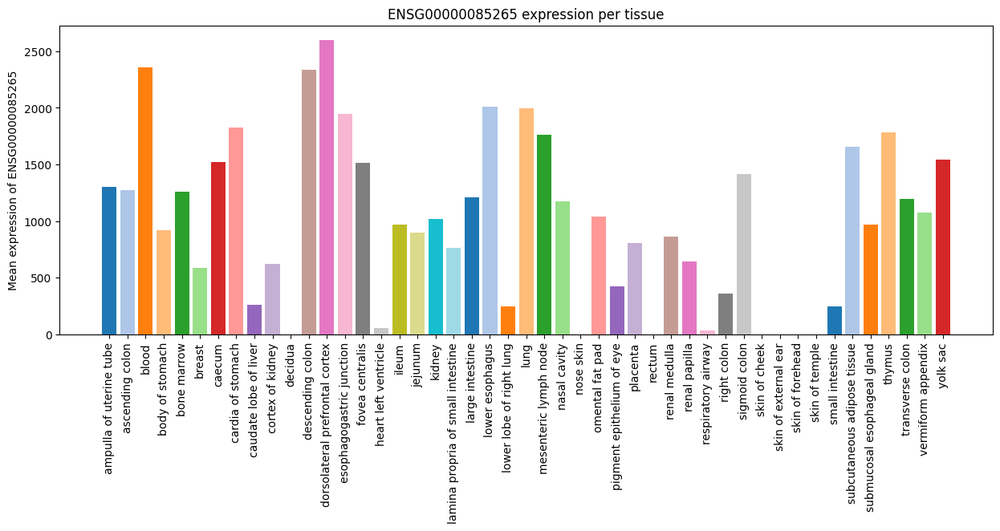

# cellNexusPy

## Importing the package


```python
from cellnexuspy import get_metadata, get_anndata, get_pseudobulk, join_census_table, keep_quality_cells, get_cell_communication_strength, get_metadata_url, SAMPLE_DATABASE_URL, CENSUS_SAMPLE_METADATA_URL
```

## Getting the metadata

The `get_metadata()` function returns a database connection and a DuckDB table.

The table can be used to query the metadata, while the connection's main purpose is to be closed when you are finished:


```python
conn, table = get_metadata()
table = join_census_table(conn, table)

table
```

    File is missing or corrupted. Re-downloading...


    Downloading https://object-store.rc.nectar.org.au/v1/AUTH_06d6e008e3e642da99d806ba3ea629c5/cellNexus-metadata/cellnexus_metadata.2.3.0.parquet to /home/juan/.cache/cellNexusPy/cellnexus_metadata.2.3.0.parquet
    858MB [13:06, 1.14MB/s]95222 [00:00<?, ?it/s]
      0%|          | 0/899595222 [13:06<?, ?it/s]
    Downloading https://object-store.rc.nectar.org.au/v1/AUTH_06d6e008e3e642da99d806ba3ea629c5/cellNexus-metadata/census_cell_metadata.2.3.0.parquet to /home/juan/.cache/cellNexusPy/census_cell_metadata.2.3.0.parquet


    File is missing or corrupted. Re-downloading...


    414MB [06:11, 1.17MB/s]60949 [00:00<?, ?it/s]
      0%|          | 0/433860949 [06:11<?, ?it/s]


    ┌─────────┬────────────────────┬──────────────────────────────────────┬──────────────────────────────────────────────┬──────────────────────────────────┬───────────────┬──────────────────┬─────────────────────────────────────────────────────────────────────────────────────────────────────────────────────────────────────────────────────────────────────────────────────────────────────────────────┬──────────┬─────────────────────────────────────┬──────────────────────────────┬───────────────────┬───────────────┬────────────────────────────┬───────────┬──────────────────────┬──────────────────────┬────────────────────┬───────────────┬───────────────────┬──────────────┬────────────┬─────────────────────────┬───────────────────────────────────────────┬───────────────────────────────────────────┬───────────────────┬───────────────────────────┬─────────────────────────┬─────────┬───────────────────────────────────┬────────────────────────────────┬────────────────────────────┬──────────────────────────┬──────────────────────────┬───────────────────┬───────────────────┬──────────────────────┬────────────────────┬──────────────────────────────────────┬──────────────────────────────────────────────┬──────────────────────────────────────┬────────────────────────────┬───────────┬────────────────────────┬─────────────────────────┬────────────────────────────────────┬─────────┬──────────────────────────┬────────────┬─────────────────┬──────────────┬───────────────────────────┬─────────────────────────┬──────────────────────────────────────────┬─────────┬──────────────────────┬─────────────────────────┬─────────────────────────┬───────────────────────────────────────────────────────────────────────────────────────────────────────────────────────────────────────────────────────────────────────────────────────────────────────────────────────────────────────────────────────────────────────────────────────────────────────────────┬──────────────────────────────────────┬──────────────────────────────────────┬───────────────────┬──────────────┬───────────────────┬────────────┬────────────────────┬────────────────┬─────────────┬─────────────────────────────────────────────────────────────────────────────────┬───────────┬────────────────────────────┬──────────────────────────────────────────────────────────────────────────────┬────────────┬───────────────┬──────────────┬──────────┬─────────────────────┬─────────────────┬─────────────────────────────────────────────────────────────────────────────────────┐
    │ cell_id │ observation_joinid │              dataset_id              │                  sample_id                   │             sample_              │ experiment___ │ run_from_cell_id │                                                                                                sample_heuristic                                                                                                 │ age_days │            tissue_groups            │ nFeature_expressed_in_sample │    nCount_RNA     │ empty_droplet │ cell_type_unified_ensemble │ is_immune │ subsets_Mito_percent │ subsets_Ribo_percent │ high_mitochondrion │ high_ribosome │ scDblFinder.class │ sample_chunk │ cell_chunk │ sample_pseudobulk_chunk │       file_id_cellNexus_single_cell       │       file_id_cellNexus_pseudobulk        │ count_upper_bound │ nfeature_expressed_thresh │    inverse_transform    │  alive  │ cell_annotation_blueprint_singler │ cell_annotation_monaco_singler │ cell_annotation_azimuth_l2 │ ethnicity_flagging_score │ low_confidence_ethnicity │ .aggregated_cells │ imputed_ethnicity │       atlas_id       │ observation_joinid │              dataset_id              │                  sample_id                   │              cell_type               │ cell_type_ontology_term_id │   assay   │ assay_ontology_term_id │    development_stage    │ development_stage_ontology_term_id │ disease │ disease_ontology_term_id │  donor_id  │ is_primary_data │   organism   │ organism_ontology_term_id │ self_reported_ethnicity │ self_reported_ethnicity_ontology_term_id │   sex   │ sex_ontology_term_id │         tissue          │ tissue_ontology_term_id │                                                                                                                                                   citation                                                                                                                                                    │            collection_id             │          dataset_version_id          │ default_embedding │ published_at │ raw_data_location │ revised_at │ primary_cell_count │ schema_version │ tissue_type │                                      title                                      │ tombstone │ x_approximate_distribution │                                 explorer_url                                 │ cell_count │ feature_count │   filesize   │ filetype │ mean_genes_per_cell │ suspension_type │                                         url                                         │
    │ double  │      varchar       │               varchar                │                   varchar                    │             varchar              │    varchar    │     varchar      │                                                                                                     varchar                                                                                                     │  int32   │               varchar               │            int32             │      double       │    boolean    │          varchar           │  boolean  │        int32         │        int32         │      boolean       │    boolean    │      varchar      │    int32     │   int32    │          int32          │                  varchar                  │                  varchar                  │      double       │          double           │         varchar         │ boolean │              varchar              │            varchar             │          varchar           │          double          │         varchar          │       int32       │      varchar      │       varchar        │      varchar       │               varchar                │                   varchar                    │               varchar                │          varchar           │  varchar  │        varchar         │         varchar         │              varchar               │ varchar │         varchar          │  varchar   │     varchar     │   varchar    │          varchar          │         varchar         │                 varchar                  │ varchar │       varchar        │         varchar         │         varchar         │                                                                                                                                                    varchar                                                                                                                                                    │               varchar                │               varchar                │      varchar      │   varchar    │      varchar      │  varchar   │      varchar       │    varchar     │   varchar   │                                     varchar                                     │  boolean  │          varchar           │                                   varchar                                    │   int32    │     int32     │    double    │ varchar  │       double        │     varchar     │                                       varchar                                       │
    ├─────────┼────────────────────┼──────────────────────────────────────┼──────────────────────────────────────────────┼──────────────────────────────────┼───────────────┼──────────────────┼─────────────────────────────────────────────────────────────────────────────────────────────────────────────────────────────────────────────────────────────────────────────────────────────────────────────────┼──────────┼─────────────────────────────────────┼──────────────────────────────┼───────────────────┼───────────────┼────────────────────────────┼───────────┼──────────────────────┼──────────────────────┼────────────────────┼───────────────┼───────────────────┼──────────────┼────────────┼─────────────────────────┼───────────────────────────────────────────┼───────────────────────────────────────────┼───────────────────┼───────────────────────────┼─────────────────────────┼─────────┼───────────────────────────────────┼────────────────────────────────┼────────────────────────────┼──────────────────────────┼──────────────────────────┼───────────────────┼───────────────────┼──────────────────────┼────────────────────┼──────────────────────────────────────┼──────────────────────────────────────────────┼──────────────────────────────────────┼────────────────────────────┼───────────┼────────────────────────┼─────────────────────────┼────────────────────────────────────┼─────────┼──────────────────────────┼────────────┼─────────────────┼──────────────┼───────────────────────────┼─────────────────────────┼──────────────────────────────────────────┼─────────┼──────────────────────┼─────────────────────────┼─────────────────────────┼───────────────────────────────────────────────────────────────────────────────────────────────────────────────────────────────────────────────────────────────────────────────────────────────────────────────────────────────────────────────────────────────────────────────────────────────────────────────┼──────────────────────────────────────┼──────────────────────────────────────┼───────────────────┼──────────────┼───────────────────┼────────────┼────────────────────┼────────────────┼─────────────┼─────────────────────────────────────────────────────────────────────────────────┼───────────┼────────────────────────────┼──────────────────────────────────────────────────────────────────────────────┼────────────┼───────────────┼──────────────┼──────────┼─────────────────────┼─────────────────┼─────────────────────────────────────────────────────────────────────────────────────┤
    │ 11934.0 │ tMa=76pr}S         │ 4976b234-9028-4b4b-8a2f-8ac59d636219 │ 144da207531b7877c50d4aa306d967f3___10X237_1: │ 144da207531b7877c50d4aa306d967f3 │               │ NULL             │ H19.30.001___cerebellum___42-year-old human stage___10x 3' v3______normal___TRUE                                                                                                                                │    15330 │ brainstem and cerebellar structures │                         1701 │            3003.0 │ false         │ neuron                     │ false     │                    0 │                    0 │ false              │ false         │ singlet           │            1 │          1 │                       1 │ 34b4a444f06d582c50b59e279e44b9a3___1.h5ad │ 83915546022d9c58bb1d23397d4e987c___1.h5ad │              10.0 │                     200.0 │ identity_with_max_limit │ true    │ Neurons                           │ Myeloid dendritic cells        │ pDC                        │                     NULL │ NULL                     │              5093 │ European          │ cellxgene_2024/0.4.0 │ tMa=76pr}S         │ 4976b234-9028-4b4b-8a2f-8ac59d636219 │ 144da207531b7877c50d4aa306d967f3___10X237_1: │ neuron                               │ CL:0000540                 │ 10x 3' v3 │ EFO:0009922            │ 42-year-old human stage │ HsapDv:0000136                     │ normal  │ PATO:0000461             │ H19.30.001 │ TRUE            │ Homo sapiens │ NCBITaxon:9606            │ European                │ HANCESTRO:0005                           │ male    │ PATO:0000384         │ cerebellum              │ UBERON:0002037          │ Publication: https://doi.org/10.1126/science.add7046 Dataset Version: https://datasets.cellxgene.cziscience.com/e9f575c0-bf54-4252-9551-1d4c69eda1bf.h5ad curated and distributed by CZ CELLxGENE Discover in Collection: https://cellxgene.cziscience.com/collections/283d65eb-dd53-496d-adb7-7570c7caa443   │ 283d65eb-dd53-496d-adb7-7570c7caa443 │ e9f575c0-bf54-4252-9551-1d4c69eda1bf │ NULL              │ 2022-12-08   │ X                 │ 2024-06-11 │ 71874              │ 5.1.0          │ tissue      │ Dissection: Cerebellum (CB) - Cerebellar Vermis - CBV                           │ false     │ NULL                       │ https://cellxgene.cziscience.com/e/4976b234-9028-4b4b-8a2f-8ac59d636219.cxg/ │      71874 │         59236 │  438436612.0 │ H5AD     │  2560.6052536383113 │ nucleus         │ https://datasets.cellxgene.cziscience.com/e9f575c0-bf54-4252-9551-1d4c69eda1bf.h5ad │
    │ 11925.0 │ kNWk5U<kHP         │ 4976b234-9028-4b4b-8a2f-8ac59d636219 │ 144da207531b7877c50d4aa306d967f3___10X237_1: │ 144da207531b7877c50d4aa306d967f3 │               │ NULL             │ H19.30.001___cerebellum___42-year-old human stage___10x 3' v3______normal___TRUE                                                                                                                                │    15330 │ brainstem and cerebellar structures │                         1518 │            2913.0 │ false         │ neuron                     │ false     │                    0 │                    0 │ false              │ false         │ singlet           │            1 │          1 │                       1 │ 34b4a444f06d582c50b59e279e44b9a3___1.h5ad │ 83915546022d9c58bb1d23397d4e987c___1.h5ad │              10.0 │                     200.0 │ identity_with_max_limit │ true    │ Neurons                           │ Myeloid dendritic cells        │ pDC                        │                     NULL │ NULL                     │              5093 │ European          │ cellxgene_2024/0.4.0 │ kNWk5U<kHP         │ 4976b234-9028-4b4b-8a2f-8ac59d636219 │ 144da207531b7877c50d4aa306d967f3___10X237_1: │ neuron                               │ CL:0000540                 │ 10x 3' v3 │ EFO:0009922            │ 42-year-old human stage │ HsapDv:0000136                     │ normal  │ PATO:0000461             │ H19.30.001 │ TRUE            │ Homo sapiens │ NCBITaxon:9606            │ European                │ HANCESTRO:0005                           │ male    │ PATO:0000384         │ cerebellum              │ UBERON:0002037          │ Publication: https://doi.org/10.1126/science.add7046 Dataset Version: https://datasets.cellxgene.cziscience.com/e9f575c0-bf54-4252-9551-1d4c69eda1bf.h5ad curated and distributed by CZ CELLxGENE Discover in Collection: https://cellxgene.cziscience.com/collections/283d65eb-dd53-496d-adb7-7570c7caa443   │ 283d65eb-dd53-496d-adb7-7570c7caa443 │ e9f575c0-bf54-4252-9551-1d4c69eda1bf │ NULL              │ 2022-12-08   │ X                 │ 2024-06-11 │ 71874              │ 5.1.0          │ tissue      │ Dissection: Cerebellum (CB) - Cerebellar Vermis - CBV                           │ false     │ NULL                       │ https://cellxgene.cziscience.com/e/4976b234-9028-4b4b-8a2f-8ac59d636219.cxg/ │      71874 │         59236 │  438436612.0 │ H5AD     │  2560.6052536383113 │ nucleus         │ https://datasets.cellxgene.cziscience.com/e9f575c0-bf54-4252-9551-1d4c69eda1bf.h5ad │
    │ 11993.0 │ 3gHkK@=&M6         │ 4976b234-9028-4b4b-8a2f-8ac59d636219 │ 144da207531b7877c50d4aa306d967f3___10X237_1: │ 144da207531b7877c50d4aa306d967f3 │               │ NULL             │ H19.30.001___cerebellum___42-year-old human stage___10x 3' v3______normal___TRUE                                                                                                                                │    15330 │ brainstem and cerebellar structures │                         1498 │            2744.0 │ false         │ neuron                     │ false     │                    0 │                    0 │ false              │ false         │ singlet           │            1 │          1 │                       1 │ 34b4a444f06d582c50b59e279e44b9a3___1.h5ad │ 83915546022d9c58bb1d23397d4e987c___1.h5ad │              10.0 │                     200.0 │ identity_with_max_limit │ true    │ Neurons                           │ Myeloid dendritic cells        │ pDC                        │                     NULL │ NULL                     │              5093 │ European          │ cellxgene_2024/0.4.0 │ 3gHkK@=&M6         │ 4976b234-9028-4b4b-8a2f-8ac59d636219 │ 144da207531b7877c50d4aa306d967f3___10X237_1: │ neuron                               │ CL:0000540                 │ 10x 3' v3 │ EFO:0009922            │ 42-year-old human stage │ HsapDv:0000136                     │ normal  │ PATO:0000461             │ H19.30.001 │ TRUE            │ Homo sapiens │ NCBITaxon:9606            │ European                │ HANCESTRO:0005                           │ male    │ PATO:0000384         │ cerebellum              │ UBERON:0002037          │ Publication: https://doi.org/10.1126/science.add7046 Dataset Version: https://datasets.cellxgene.cziscience.com/e9f575c0-bf54-4252-9551-1d4c69eda1bf.h5ad curated and distributed by CZ CELLxGENE Discover in Collection: https://cellxgene.cziscience.com/collections/283d65eb-dd53-496d-adb7-7570c7caa443   │ 283d65eb-dd53-496d-adb7-7570c7caa443 │ e9f575c0-bf54-4252-9551-1d4c69eda1bf │ NULL              │ 2022-12-08   │ X                 │ 2024-06-11 │ 71874              │ 5.1.0          │ tissue      │ Dissection: Cerebellum (CB) - Cerebellar Vermis - CBV                           │ false     │ NULL                       │ https://cellxgene.cziscience.com/e/4976b234-9028-4b4b-8a2f-8ac59d636219.cxg/ │      71874 │         59236 │  438436612.0 │ H5AD     │  2560.6052536383113 │ nucleus         │ https://datasets.cellxgene.cziscience.com/e9f575c0-bf54-4252-9551-1d4c69eda1bf.h5ad │
    │ 14176.0 │ 6TUbfTwfb{         │ 4976b234-9028-4b4b-8a2f-8ac59d636219 │ 144da207531b7877c50d4aa306d967f3___10X237_1: │ 144da207531b7877c50d4aa306d967f3 │               │ NULL             │ H19.30.001___cerebellum___42-year-old human stage___10x 3' v3______normal___TRUE                                                                                                                                │    15330 │ brainstem and cerebellar structures │                         1654 │            2887.0 │ false         │ neuron                     │ false     │                    0 │                    0 │ false              │ false         │ singlet           │            1 │          1 │                       1 │ 34b4a444f06d582c50b59e279e44b9a3___1.h5ad │ 83915546022d9c58bb1d23397d4e987c___1.h5ad │              10.0 │                     200.0 │ identity_with_max_limit │ true    │ Neurons                           │ Myeloid dendritic cells        │ pDC                        │                     NULL │ NULL                     │              5093 │ European          │ cellxgene_2024/0.4.0 │ 6TUbfTwfb{         │ 4976b234-9028-4b4b-8a2f-8ac59d636219 │ 144da207531b7877c50d4aa306d967f3___10X237_1: │ neuron                               │ CL:0000540                 │ 10x 3' v3 │ EFO:0009922            │ 42-year-old human stage │ HsapDv:0000136                     │ normal  │ PATO:0000461             │ H19.30.001 │ TRUE            │ Homo sapiens │ NCBITaxon:9606            │ European                │ HANCESTRO:0005                           │ male    │ PATO:0000384         │ cerebellum              │ UBERON:0002037          │ Publication: https://doi.org/10.1126/science.add7046 Dataset Version: https://datasets.cellxgene.cziscience.com/e9f575c0-bf54-4252-9551-1d4c69eda1bf.h5ad curated and distributed by CZ CELLxGENE Discover in Collection: https://cellxgene.cziscience.com/collections/283d65eb-dd53-496d-adb7-7570c7caa443   │ 283d65eb-dd53-496d-adb7-7570c7caa443 │ e9f575c0-bf54-4252-9551-1d4c69eda1bf │ NULL              │ 2022-12-08   │ X                 │ 2024-06-11 │ 71874              │ 5.1.0          │ tissue      │ Dissection: Cerebellum (CB) - Cerebellar Vermis - CBV                           │ false     │ NULL                       │ https://cellxgene.cziscience.com/e/4976b234-9028-4b4b-8a2f-8ac59d636219.cxg/ │      71874 │         59236 │  438436612.0 │ H5AD     │  2560.6052536383113 │ nucleus         │ https://datasets.cellxgene.cziscience.com/e9f575c0-bf54-4252-9551-1d4c69eda1bf.h5ad │
    │ 13874.0 │ S9RRZO<P-$         │ 4976b234-9028-4b4b-8a2f-8ac59d636219 │ 144da207531b7877c50d4aa306d967f3___10X237_1: │ 144da207531b7877c50d4aa306d967f3 │               │ NULL             │ H19.30.001___cerebellum___42-year-old human stage___10x 3' v3______normal___TRUE                                                                                                                                │    15330 │ brainstem and cerebellar structures │                         1506 │            2777.0 │ false         │ neuron                     │ false     │                    0 │                    0 │ false              │ false         │ singlet           │            1 │          1 │                       1 │ 34b4a444f06d582c50b59e279e44b9a3___1.h5ad │ 83915546022d9c58bb1d23397d4e987c___1.h5ad │              10.0 │                     200.0 │ identity_with_max_limit │ true    │ Neurons                           │ Plasmacytoid dendritic cells   │ pDC                        │                     NULL │ NULL                     │              5093 │ European          │ cellxgene_2024/0.4.0 │ S9RRZO<P-$         │ 4976b234-9028-4b4b-8a2f-8ac59d636219 │ 144da207531b7877c50d4aa306d967f3___10X237_1: │ neuron                               │ CL:0000540                 │ 10x 3' v3 │ EFO:0009922            │ 42-year-old human stage │ HsapDv:0000136                     │ normal  │ PATO:0000461             │ H19.30.001 │ TRUE            │ Homo sapiens │ NCBITaxon:9606            │ European                │ HANCESTRO:0005                           │ male    │ PATO:0000384         │ cerebellum              │ UBERON:0002037          │ Publication: https://doi.org/10.1126/science.add7046 Dataset Version: https://datasets.cellxgene.cziscience.com/e9f575c0-bf54-4252-9551-1d4c69eda1bf.h5ad curated and distributed by CZ CELLxGENE Discover in Collection: https://cellxgene.cziscience.com/collections/283d65eb-dd53-496d-adb7-7570c7caa443   │ 283d65eb-dd53-496d-adb7-7570c7caa443 │ e9f575c0-bf54-4252-9551-1d4c69eda1bf │ NULL              │ 2022-12-08   │ X                 │ 2024-06-11 │ 71874              │ 5.1.0          │ tissue      │ Dissection: Cerebellum (CB) - Cerebellar Vermis - CBV                           │ false     │ NULL                       │ https://cellxgene.cziscience.com/e/4976b234-9028-4b4b-8a2f-8ac59d636219.cxg/ │      71874 │         59236 │  438436612.0 │ H5AD     │  2560.6052536383113 │ nucleus         │ https://datasets.cellxgene.cziscience.com/e9f575c0-bf54-4252-9551-1d4c69eda1bf.h5ad │
    │ 13796.0 │ V&CgQ`0T}n         │ 4976b234-9028-4b4b-8a2f-8ac59d636219 │ 144da207531b7877c50d4aa306d967f3___10X237_1: │ 144da207531b7877c50d4aa306d967f3 │               │ NULL             │ H19.30.001___cerebellum___42-year-old human stage___10x 3' v3______normal___TRUE                                                                                                                                │    15330 │ brainstem and cerebellar structures │                         1447 │            2637.0 │ false         │ neuron                     │ false     │                    0 │                    0 │ false              │ false         │ singlet           │            1 │          1 │                       1 │ 34b4a444f06d582c50b59e279e44b9a3___1.h5ad │ 83915546022d9c58bb1d23397d4e987c___1.h5ad │              10.0 │                     200.0 │ identity_with_max_limit │ true    │ Neurons                           │ Progenitor cells               │ pDC                        │                     NULL │ NULL                     │              5093 │ European          │ cellxgene_2024/0.4.0 │ V&CgQ`0T}n         │ 4976b234-9028-4b4b-8a2f-8ac59d636219 │ 144da207531b7877c50d4aa306d967f3___10X237_1: │ neuron                               │ CL:0000540                 │ 10x 3' v3 │ EFO:0009922            │ 42-year-old human stage │ HsapDv:0000136                     │ normal  │ PATO:0000461             │ H19.30.001 │ TRUE            │ Homo sapiens │ NCBITaxon:9606            │ European                │ HANCESTRO:0005                           │ male    │ PATO:0000384         │ cerebellum              │ UBERON:0002037          │ Publication: https://doi.org/10.1126/science.add7046 Dataset Version: https://datasets.cellxgene.cziscience.com/e9f575c0-bf54-4252-9551-1d4c69eda1bf.h5ad curated and distributed by CZ CELLxGENE Discover in Collection: https://cellxgene.cziscience.com/collections/283d65eb-dd53-496d-adb7-7570c7caa443   │ 283d65eb-dd53-496d-adb7-7570c7caa443 │ e9f575c0-bf54-4252-9551-1d4c69eda1bf │ NULL              │ 2022-12-08   │ X                 │ 2024-06-11 │ 71874              │ 5.1.0          │ tissue      │ Dissection: Cerebellum (CB) - Cerebellar Vermis - CBV                           │ false     │ NULL                       │ https://cellxgene.cziscience.com/e/4976b234-9028-4b4b-8a2f-8ac59d636219.cxg/ │      71874 │         59236 │  438436612.0 │ H5AD     │  2560.6052536383113 │ nucleus         │ https://datasets.cellxgene.cziscience.com/e9f575c0-bf54-4252-9551-1d4c69eda1bf.h5ad │
    │ 13889.0 │ Czj;=DLKX*         │ 4976b234-9028-4b4b-8a2f-8ac59d636219 │ 144da207531b7877c50d4aa306d967f3___10X237_1: │ 144da207531b7877c50d4aa306d967f3 │               │ NULL             │ H19.30.001___cerebellum___42-year-old human stage___10x 3' v3______normal___TRUE                                                                                                                                │    15330 │ brainstem and cerebellar structures │                         1290 │            2302.0 │ false         │ neuron                     │ false     │                    0 │                    0 │ false              │ false         │ singlet           │            1 │          1 │                       1 │ 34b4a444f06d582c50b59e279e44b9a3___1.h5ad │ 83915546022d9c58bb1d23397d4e987c___1.h5ad │              10.0 │                     200.0 │ identity_with_max_limit │ true    │ Neurons                           │ Myeloid dendritic cells        │ pDC                        │                     NULL │ NULL                     │              5093 │ European          │ cellxgene_2024/0.4.0 │ Czj;=DLKX*         │ 4976b234-9028-4b4b-8a2f-8ac59d636219 │ 144da207531b7877c50d4aa306d967f3___10X237_1: │ neuron                               │ CL:0000540                 │ 10x 3' v3 │ EFO:0009922            │ 42-year-old human stage │ HsapDv:0000136                     │ normal  │ PATO:0000461             │ H19.30.001 │ TRUE            │ Homo sapiens │ NCBITaxon:9606            │ European                │ HANCESTRO:0005                           │ male    │ PATO:0000384         │ cerebellum              │ UBERON:0002037          │ Publication: https://doi.org/10.1126/science.add7046 Dataset Version: https://datasets.cellxgene.cziscience.com/e9f575c0-bf54-4252-9551-1d4c69eda1bf.h5ad curated and distributed by CZ CELLxGENE Discover in Collection: https://cellxgene.cziscience.com/collections/283d65eb-dd53-496d-adb7-7570c7caa443   │ 283d65eb-dd53-496d-adb7-7570c7caa443 │ e9f575c0-bf54-4252-9551-1d4c69eda1bf │ NULL              │ 2022-12-08   │ X                 │ 2024-06-11 │ 71874              │ 5.1.0          │ tissue      │ Dissection: Cerebellum (CB) - Cerebellar Vermis - CBV                           │ false     │ NULL                       │ https://cellxgene.cziscience.com/e/4976b234-9028-4b4b-8a2f-8ac59d636219.cxg/ │      71874 │         59236 │  438436612.0 │ H5AD     │  2560.6052536383113 │ nucleus         │ https://datasets.cellxgene.cziscience.com/e9f575c0-bf54-4252-9551-1d4c69eda1bf.h5ad │
    │ 12476.0 │ mkLgyEZ^9d         │ 4976b234-9028-4b4b-8a2f-8ac59d636219 │ 144da207531b7877c50d4aa306d967f3___10X237_1: │ 144da207531b7877c50d4aa306d967f3 │               │ NULL             │ H19.30.001___cerebellum___42-year-old human stage___10x 3' v3______normal___TRUE                                                                                                                                │    15330 │ brainstem and cerebellar structures │                         1405 │            2582.0 │ false         │ neuron                     │ false     │                    0 │                    0 │ false              │ false         │ singlet           │            1 │          1 │                       1 │ 34b4a444f06d582c50b59e279e44b9a3___1.h5ad │ 83915546022d9c58bb1d23397d4e987c___1.h5ad │              10.0 │                     200.0 │ identity_with_max_limit │ true    │ Neurons                           │ Myeloid dendritic cells        │ pDC                        │                     NULL │ NULL                     │              5093 │ European          │ cellxgene_2024/0.4.0 │ mkLgyEZ^9d         │ 4976b234-9028-4b4b-8a2f-8ac59d636219 │ 144da207531b7877c50d4aa306d967f3___10X237_1: │ neuron                               │ CL:0000540                 │ 10x 3' v3 │ EFO:0009922            │ 42-year-old human stage │ HsapDv:0000136                     │ normal  │ PATO:0000461             │ H19.30.001 │ TRUE            │ Homo sapiens │ NCBITaxon:9606            │ European                │ HANCESTRO:0005                           │ male    │ PATO:0000384         │ cerebellum              │ UBERON:0002037          │ Publication: https://doi.org/10.1126/science.add7046 Dataset Version: https://datasets.cellxgene.cziscience.com/e9f575c0-bf54-4252-9551-1d4c69eda1bf.h5ad curated and distributed by CZ CELLxGENE Discover in Collection: https://cellxgene.cziscience.com/collections/283d65eb-dd53-496d-adb7-7570c7caa443   │ 283d65eb-dd53-496d-adb7-7570c7caa443 │ e9f575c0-bf54-4252-9551-1d4c69eda1bf │ NULL              │ 2022-12-08   │ X                 │ 2024-06-11 │ 71874              │ 5.1.0          │ tissue      │ Dissection: Cerebellum (CB) - Cerebellar Vermis - CBV                           │ false     │ NULL                       │ https://cellxgene.cziscience.com/e/4976b234-9028-4b4b-8a2f-8ac59d636219.cxg/ │      71874 │         59236 │  438436612.0 │ H5AD     │  2560.6052536383113 │ nucleus         │ https://datasets.cellxgene.cziscience.com/e9f575c0-bf54-4252-9551-1d4c69eda1bf.h5ad │
    │ 12441.0 │ h^?FBc|4>?         │ 4976b234-9028-4b4b-8a2f-8ac59d636219 │ 144da207531b7877c50d4aa306d967f3___10X237_1: │ 144da207531b7877c50d4aa306d967f3 │               │ NULL             │ H19.30.001___cerebellum___42-year-old human stage___10x 3' v3______normal___TRUE                                                                                                                                │    15330 │ brainstem and cerebellar structures │                         1520 │            2740.0 │ false         │ neuron                     │ false     │                    0 │                    0 │ false              │ false         │ singlet           │            1 │          1 │                       1 │ 34b4a444f06d582c50b59e279e44b9a3___1.h5ad │ 83915546022d9c58bb1d23397d4e987c___1.h5ad │              10.0 │                     200.0 │ identity_with_max_limit │ true    │ Neurons                           │ Myeloid dendritic cells        │ pDC                        │                     NULL │ NULL                     │              5093 │ European          │ cellxgene_2024/0.4.0 │ h^?FBc|4>?         │ 4976b234-9028-4b4b-8a2f-8ac59d636219 │ 144da207531b7877c50d4aa306d967f3___10X237_1: │ neuron                               │ CL:0000540                 │ 10x 3' v3 │ EFO:0009922            │ 42-year-old human stage │ HsapDv:0000136                     │ normal  │ PATO:0000461             │ H19.30.001 │ TRUE            │ Homo sapiens │ NCBITaxon:9606            │ European                │ HANCESTRO:0005                           │ male    │ PATO:0000384         │ cerebellum              │ UBERON:0002037          │ Publication: https://doi.org/10.1126/science.add7046 Dataset Version: https://datasets.cellxgene.cziscience.com/e9f575c0-bf54-4252-9551-1d4c69eda1bf.h5ad curated and distributed by CZ CELLxGENE Discover in Collection: https://cellxgene.cziscience.com/collections/283d65eb-dd53-496d-adb7-7570c7caa443   │ 283d65eb-dd53-496d-adb7-7570c7caa443 │ e9f575c0-bf54-4252-9551-1d4c69eda1bf │ NULL              │ 2022-12-08   │ X                 │ 2024-06-11 │ 71874              │ 5.1.0          │ tissue      │ Dissection: Cerebellum (CB) - Cerebellar Vermis - CBV                           │ false     │ NULL                       │ https://cellxgene.cziscience.com/e/4976b234-9028-4b4b-8a2f-8ac59d636219.cxg/ │      71874 │         59236 │  438436612.0 │ H5AD     │  2560.6052536383113 │ nucleus         │ https://datasets.cellxgene.cziscience.com/e9f575c0-bf54-4252-9551-1d4c69eda1bf.h5ad │
    │ 13835.0 │ NAQ!sPRagS         │ 4976b234-9028-4b4b-8a2f-8ac59d636219 │ 144da207531b7877c50d4aa306d967f3___10X237_1: │ 144da207531b7877c50d4aa306d967f3 │               │ NULL             │ H19.30.001___cerebellum___42-year-old human stage___10x 3' v3______normal___TRUE                                                                                                                                │    15330 │ brainstem and cerebellar structures │                         1414 │            2398.0 │ false         │ neuron                     │ false     │                    0 │                    0 │ false              │ false         │ singlet           │            1 │          1 │                       1 │ 34b4a444f06d582c50b59e279e44b9a3___1.h5ad │ 83915546022d9c58bb1d23397d4e987c___1.h5ad │              10.0 │                     200.0 │ identity_with_max_limit │ true    │ Neurons                           │ Th2 cells                      │ pDC                        │                     NULL │ NULL                     │              5093 │ European          │ cellxgene_2024/0.4.0 │ NAQ!sPRagS         │ 4976b234-9028-4b4b-8a2f-8ac59d636219 │ 144da207531b7877c50d4aa306d967f3___10X237_1: │ neuron                               │ CL:0000540                 │ 10x 3' v3 │ EFO:0009922            │ 42-year-old human stage │ HsapDv:0000136                     │ normal  │ PATO:0000461             │ H19.30.001 │ TRUE            │ Homo sapiens │ NCBITaxon:9606            │ European                │ HANCESTRO:0005                           │ male    │ PATO:0000384         │ cerebellum              │ UBERON:0002037          │ Publication: https://doi.org/10.1126/science.add7046 Dataset Version: https://datasets.cellxgene.cziscience.com/e9f575c0-bf54-4252-9551-1d4c69eda1bf.h5ad curated and distributed by CZ CELLxGENE Discover in Collection: https://cellxgene.cziscience.com/collections/283d65eb-dd53-496d-adb7-7570c7caa443   │ 283d65eb-dd53-496d-adb7-7570c7caa443 │ e9f575c0-bf54-4252-9551-1d4c69eda1bf │ NULL              │ 2022-12-08   │ X                 │ 2024-06-11 │ 71874              │ 5.1.0          │ tissue      │ Dissection: Cerebellum (CB) - Cerebellar Vermis - CBV                           │ false     │ NULL                       │ https://cellxgene.cziscience.com/e/4976b234-9028-4b4b-8a2f-8ac59d636219.cxg/ │      71874 │         59236 │  438436612.0 │ H5AD     │  2560.6052536383113 │ nucleus         │ https://datasets.cellxgene.cziscience.com/e9f575c0-bf54-4252-9551-1d4c69eda1bf.h5ad │
    │     ·   │     ·              │                  ·                   │                ·                             │                ·                 │       ·       │  ·               │                                        ·                                                                                                                                                                        │      ·   │             ·                       │                           ·  │               ·   │   ·           │   ·                        │   ·       │                    · │                    · │   ·                │   ·           │    ·              │            · │          · │                       · │                     ·                     │                     ·                     │                ·  │                       ·   │   ·                     │  ·      │    ·                              │     ·                          │  ·                         │                       ·  │  ·                       │                ·  │    ·              │          ·           │     ·              │                  ·                   │                ·                             │   ·                                  │     ·                      │     ·     │      ·                 │            ·            │       ·                            │   ·     │      ·                   │    ·       │  ·              │      ·       │       ·                   │    ·                    │       ·                                  │  ·      │      ·               │     ·                   │       ·                 │                                                                                                                                                      ·                                                                                                                                                        │                  ·                   │                  ·                   │  ·                │     ·        │ ·                 │     ·      │   ·                │   ·            │   ·         │                           ·                                                     │   ·       │  ·                         │                                      ·                                       │        ·   │           ·   │       ·      │  ·       │           ·         │  ·              │                                          ·                                          │
    │     ·   │     ·              │                  ·                   │                ·                             │                ·                 │       ·       │  ·               │                                        ·                                                                                                                                                                        │      ·   │             ·                       │                           ·  │               ·   │   ·           │   ·                        │   ·       │                    · │                    · │   ·                │   ·           │    ·              │            · │          · │                       · │                     ·                     │                     ·                     │                ·  │                       ·   │   ·                     │  ·      │    ·                              │     ·                          │  ·                         │                       ·  │  ·                       │                ·  │    ·              │          ·           │     ·              │                  ·                   │                ·                             │   ·                                  │     ·                      │     ·     │      ·                 │            ·            │       ·                            │   ·     │      ·                   │    ·       │  ·              │      ·       │       ·                   │    ·                    │       ·                                  │  ·      │      ·               │     ·                   │       ·                 │                                                                                                                                                      ·                                                                                                                                                        │                  ·                   │                  ·                   │  ·                │     ·        │ ·                 │     ·      │   ·                │   ·            │   ·         │                           ·                                                     │   ·       │  ·                         │                                      ·                                       │        ·   │           ·   │       ·      │  ·       │           ·         │  ·              │                                          ·                                          │
    │     ·   │     ·              │                  ·                   │                ·                             │                ·                 │       ·       │  ·               │                                        ·                                                                                                                                                                        │      ·   │             ·                       │                           ·  │               ·   │   ·           │   ·                        │   ·       │                    · │                    · │   ·                │   ·           │    ·              │            · │          · │                       · │                     ·                     │                     ·                     │                ·  │                       ·   │   ·                     │  ·      │    ·                              │     ·                          │  ·                         │                       ·  │  ·                       │                ·  │    ·              │          ·           │     ·              │                  ·                   │                ·                             │   ·                                  │     ·                      │     ·     │      ·                 │            ·            │       ·                            │   ·     │      ·                   │    ·       │  ·              │      ·       │       ·                   │    ·                    │       ·                                  │  ·      │      ·               │     ·                   │       ·                 │                                                                                                                                                      ·                                                                                                                                                        │                  ·                   │                  ·                   │  ·                │     ·        │ ·                 │     ·      │   ·                │   ·            │   ·         │                           ·                                                     │   ·       │  ·                         │                                      ·                                       │        ·   │           ·   │       ·      │  ·       │           ·         │  ·              │                                          ·                                          │
    │   294.0 │ d<Qr`I#wl|         │ b693123e-95e6-4331-8b50-f367489a767e │ 479b1e0f4ce28dffaa5c5fa629ed5ce8             │ 479b1e0f4ce28dffaa5c5fa629ed5ce8 │               │ NULL             │ 354fb56c-1534-4a1f-8d33-9c17de10897b___donor_3___f0b58e0b-1485-4e90-83a9-9efa284dbbbb___edbf7426-f74b-4d8c-8b2d-d0238ec64447___ampulla of uterine tube___46-year-old human stage___10x 3' v3______normal___TRUE │    16790 │ female reproductive system          │                         2777 │ 7546.856679999938 │ false         │ endothelial                │ false     │                    0 │                    0 │ false              │ false         │ singlet           │            1 │          1 │                       1 │ 64d4a3da902a9a4143de4b60a52bf2e0___1.h5ad │ f1b1af79acdb0249ad1eeee7c7571724___1.h5ad │              10.0 │                     200.0 │ expm1                   │ true    │ mv Endothelial cells              │ Progenitor cells               │ Platelet                   │                      1.0 │ FALSE                    │               290 │ European          │ cellxgene_2024/0.4.0 │ d<Qr`I#wl|         │ b693123e-95e6-4331-8b50-f367489a767e │ 479b1e0f4ce28dffaa5c5fa629ed5ce8             │ endothelial cell of lymphatic vessel │ CL:0002138                 │ 10x 3' v3 │ EFO:0009922            │ 46-year-old human stage │ HsapDv:0000140                     │ normal  │ PATO:0000461             │ donor_3    │ TRUE            │ Homo sapiens │ NCBITaxon:9606            │ European                │ HANCESTRO:0005                           │ female  │ PATO:0000383         │ ampulla of uterine tube │ UBERON:0012648          │ Publication: https://doi.org/10.1101/2021.09.16.460628 Dataset Version: https://datasets.cellxgene.cziscience.com/7fa27624-7eda-454a-a066-4de49d5788bd.h5ad curated and distributed by CZ CELLxGENE Discover in Collection: https://cellxgene.cziscience.com/collections/fc77d2ae-247d-44d7-aa24-3f4859254c2c │ fc77d2ae-247d-44d7-aa24-3f4859254c2c │ 7fa27624-7eda-454a-a066-4de49d5788bd │ X_umap            │ 2022-01-23   │ raw.X             │ 2024-06-11 │ 77536              │ 5.1.0          │ tissue      │ scRNA-seq analysis of human fallopian tubes in healthy Vs. hydrosalphinx states │ false     │ NULL                       │ https://cellxgene.cziscience.com/e/b693123e-95e6-4331-8b50-f367489a767e.cxg/ │      77536 │         36960 │ 1002296655.0 │ H5AD     │   2641.664426846884 │ cell            │ https://datasets.cellxgene.cziscience.com/7fa27624-7eda-454a-a066-4de49d5788bd.h5ad │
    │  4685.0 │ Ul=NE=!mh3         │ b693123e-95e6-4331-8b50-f367489a767e │ 479b1e0f4ce28dffaa5c5fa629ed5ce8             │ 479b1e0f4ce28dffaa5c5fa629ed5ce8 │               │ NULL             │ 354fb56c-1534-4a1f-8d33-9c17de10897b___donor_3___f0b58e0b-1485-4e90-83a9-9efa284dbbbb___edbf7426-f74b-4d8c-8b2d-d0238ec64447___ampulla of uterine tube___46-year-old human stage___10x 3' v3______normal___TRUE │    16790 │ female reproductive system          │                         4422 │ 6925.952869999976 │ false         │ secretory                  │ false     │                    0 │                    0 │ false              │ false         │ singlet           │            1 │          1 │                       1 │ 4bfcce87f64ea52b1096d115e95428eb___1.h5ad │ f1b1af79acdb0249ad1eeee7c7571724___1.h5ad │              10.0 │                     200.0 │ expm1                   │ true    │ Epithelial cells                  │ Myeloid dendritic cells        │ Platelet                   │                      1.0 │ FALSE                    │               198 │ European          │ cellxgene_2024/0.4.0 │ Ul=NE=!mh3         │ b693123e-95e6-4331-8b50-f367489a767e │ 479b1e0f4ce28dffaa5c5fa629ed5ce8             │ secretory cell                       │ CL:0000151                 │ 10x 3' v3 │ EFO:0009922            │ 46-year-old human stage │ HsapDv:0000140                     │ normal  │ PATO:0000461             │ donor_3    │ TRUE            │ Homo sapiens │ NCBITaxon:9606            │ European                │ HANCESTRO:0005                           │ female  │ PATO:0000383         │ ampulla of uterine tube │ UBERON:0012648          │ Publication: https://doi.org/10.1101/2021.09.16.460628 Dataset Version: https://datasets.cellxgene.cziscience.com/7fa27624-7eda-454a-a066-4de49d5788bd.h5ad curated and distributed by CZ CELLxGENE Discover in Collection: https://cellxgene.cziscience.com/collections/fc77d2ae-247d-44d7-aa24-3f4859254c2c │ fc77d2ae-247d-44d7-aa24-3f4859254c2c │ 7fa27624-7eda-454a-a066-4de49d5788bd │ X_umap            │ 2022-01-23   │ raw.X             │ 2024-06-11 │ 77536              │ 5.1.0          │ tissue      │ scRNA-seq analysis of human fallopian tubes in healthy Vs. hydrosalphinx states │ false     │ NULL                       │ https://cellxgene.cziscience.com/e/b693123e-95e6-4331-8b50-f367489a767e.cxg/ │      77536 │         36960 │ 1002296655.0 │ H5AD     │   2641.664426846884 │ cell            │ https://datasets.cellxgene.cziscience.com/7fa27624-7eda-454a-a066-4de49d5788bd.h5ad │
    │  2187.0 │ L)db-Kt3V@         │ b693123e-95e6-4331-8b50-f367489a767e │ 479b1e0f4ce28dffaa5c5fa629ed5ce8             │ 479b1e0f4ce28dffaa5c5fa629ed5ce8 │               │ NULL             │ 354fb56c-1534-4a1f-8d33-9c17de10897b___donor_3___f0b58e0b-1485-4e90-83a9-9efa284dbbbb___edbf7426-f74b-4d8c-8b2d-d0238ec64447___ampulla of uterine tube___46-year-old human stage___10x 3' v3______normal___TRUE │    16790 │ female reproductive system          │                         3371 │ 6820.755330000038 │ false         │ stromal                    │ false     │                    0 │                    0 │ false              │ false         │ singlet           │            1 │          1 │                       1 │ c202d2ed067f7b775e0666ac5cc84404___1.h5ad │ f1b1af79acdb0249ad1eeee7c7571724___1.h5ad │              10.0 │                     200.0 │ expm1                   │ true    │ Fibroblasts                       │ Progenitor cells               │ Platelet                   │                      1.0 │ FALSE                    │               420 │ European          │ cellxgene_2024/0.4.0 │ L)db-Kt3V@         │ b693123e-95e6-4331-8b50-f367489a767e │ 479b1e0f4ce28dffaa5c5fa629ed5ce8             │ myofibroblast cell                   │ CL:0000186                 │ 10x 3' v3 │ EFO:0009922            │ 46-year-old human stage │ HsapDv:0000140                     │ normal  │ PATO:0000461             │ donor_3    │ TRUE            │ Homo sapiens │ NCBITaxon:9606            │ European                │ HANCESTRO:0005                           │ female  │ PATO:0000383         │ ampulla of uterine tube │ UBERON:0012648          │ Publication: https://doi.org/10.1101/2021.09.16.460628 Dataset Version: https://datasets.cellxgene.cziscience.com/7fa27624-7eda-454a-a066-4de49d5788bd.h5ad curated and distributed by CZ CELLxGENE Discover in Collection: https://cellxgene.cziscience.com/collections/fc77d2ae-247d-44d7-aa24-3f4859254c2c │ fc77d2ae-247d-44d7-aa24-3f4859254c2c │ 7fa27624-7eda-454a-a066-4de49d5788bd │ X_umap            │ 2022-01-23   │ raw.X             │ 2024-06-11 │ 77536              │ 5.1.0          │ tissue      │ scRNA-seq analysis of human fallopian tubes in healthy Vs. hydrosalphinx states │ false     │ NULL                       │ https://cellxgene.cziscience.com/e/b693123e-95e6-4331-8b50-f367489a767e.cxg/ │      77536 │         36960 │ 1002296655.0 │ H5AD     │   2641.664426846884 │ cell            │ https://datasets.cellxgene.cziscience.com/7fa27624-7eda-454a-a066-4de49d5788bd.h5ad │
    │   557.0 │ BwF`8u0$FY         │ b693123e-95e6-4331-8b50-f367489a767e │ 479b1e0f4ce28dffaa5c5fa629ed5ce8             │ 479b1e0f4ce28dffaa5c5fa629ed5ce8 │               │ NULL             │ 354fb56c-1534-4a1f-8d33-9c17de10897b___donor_3___f0b58e0b-1485-4e90-83a9-9efa284dbbbb___edbf7426-f74b-4d8c-8b2d-d0238ec64447___ampulla of uterine tube___46-year-old human stage___10x 3' v3______normal___TRUE │    16790 │ female reproductive system          │                          559 │ 9774.013200000007 │ false         │ granulocyte                │ true      │                    0 │                    0 │ false              │ false         │ singlet           │            1 │          1 │                       1 │ bcea410ed178c0dfa9b62dd31fa5a709___1.h5ad │ f1b1af79acdb0249ad1eeee7c7571724___1.h5ad │              10.0 │                     200.0 │ expm1                   │ true    │ Neutrophils                       │ Low-density neutrophils        │ Platelet                   │                      1.0 │ FALSE                    │                75 │ European          │ cellxgene_2024/0.4.0 │ BwF`8u0$FY         │ b693123e-95e6-4331-8b50-f367489a767e │ 479b1e0f4ce28dffaa5c5fa629ed5ce8             │ macrophage                           │ CL:0000235                 │ 10x 3' v3 │ EFO:0009922            │ 46-year-old human stage │ HsapDv:0000140                     │ normal  │ PATO:0000461             │ donor_3    │ TRUE            │ Homo sapiens │ NCBITaxon:9606            │ European                │ HANCESTRO:0005                           │ female  │ PATO:0000383         │ ampulla of uterine tube │ UBERON:0012648          │ Publication: https://doi.org/10.1101/2021.09.16.460628 Dataset Version: https://datasets.cellxgene.cziscience.com/7fa27624-7eda-454a-a066-4de49d5788bd.h5ad curated and distributed by CZ CELLxGENE Discover in Collection: https://cellxgene.cziscience.com/collections/fc77d2ae-247d-44d7-aa24-3f4859254c2c │ fc77d2ae-247d-44d7-aa24-3f4859254c2c │ 7fa27624-7eda-454a-a066-4de49d5788bd │ X_umap            │ 2022-01-23   │ raw.X             │ 2024-06-11 │ 77536              │ 5.1.0          │ tissue      │ scRNA-seq analysis of human fallopian tubes in healthy Vs. hydrosalphinx states │ false     │ NULL                       │ https://cellxgene.cziscience.com/e/b693123e-95e6-4331-8b50-f367489a767e.cxg/ │      77536 │         36960 │ 1002296655.0 │ H5AD     │   2641.664426846884 │ cell            │ https://datasets.cellxgene.cziscience.com/7fa27624-7eda-454a-a066-4de49d5788bd.h5ad │
    │   295.0 │ mpdtUlm-@u         │ b693123e-95e6-4331-8b50-f367489a767e │ 479b1e0f4ce28dffaa5c5fa629ed5ce8             │ 479b1e0f4ce28dffaa5c5fa629ed5ce8 │               │ NULL             │ 354fb56c-1534-4a1f-8d33-9c17de10897b___donor_3___f0b58e0b-1485-4e90-83a9-9efa284dbbbb___edbf7426-f74b-4d8c-8b2d-d0238ec64447___ampulla of uterine tube___46-year-old human stage___10x 3' v3______normal___TRUE │    16790 │ female reproductive system          │                         3056 │ 7131.659800000012 │ false         │ endothelial                │ false     │                    0 │                    0 │ false              │ false         │ singlet           │            1 │          1 │                       1 │ 64d4a3da902a9a4143de4b60a52bf2e0___1.h5ad │ f1b1af79acdb0249ad1eeee7c7571724___1.h5ad │              10.0 │                     200.0 │ expm1                   │ true    │ mv Endothelial cells              │ Progenitor cells               │ Platelet                   │                      1.0 │ FALSE                    │               290 │ European          │ cellxgene_2024/0.4.0 │ mpdtUlm-@u         │ b693123e-95e6-4331-8b50-f367489a767e │ 479b1e0f4ce28dffaa5c5fa629ed5ce8             │ endothelial cell of lymphatic vessel │ CL:0002138                 │ 10x 3' v3 │ EFO:0009922            │ 46-year-old human stage │ HsapDv:0000140                     │ normal  │ PATO:0000461             │ donor_3    │ TRUE            │ Homo sapiens │ NCBITaxon:9606            │ European                │ HANCESTRO:0005                           │ female  │ PATO:0000383         │ ampulla of uterine tube │ UBERON:0012648          │ Publication: https://doi.org/10.1101/2021.09.16.460628 Dataset Version: https://datasets.cellxgene.cziscience.com/7fa27624-7eda-454a-a066-4de49d5788bd.h5ad curated and distributed by CZ CELLxGENE Discover in Collection: https://cellxgene.cziscience.com/collections/fc77d2ae-247d-44d7-aa24-3f4859254c2c │ fc77d2ae-247d-44d7-aa24-3f4859254c2c │ 7fa27624-7eda-454a-a066-4de49d5788bd │ X_umap            │ 2022-01-23   │ raw.X             │ 2024-06-11 │ 77536              │ 5.1.0          │ tissue      │ scRNA-seq analysis of human fallopian tubes in healthy Vs. hydrosalphinx states │ false     │ NULL                       │ https://cellxgene.cziscience.com/e/b693123e-95e6-4331-8b50-f367489a767e.cxg/ │      77536 │         36960 │ 1002296655.0 │ H5AD     │   2641.664426846884 │ cell            │ https://datasets.cellxgene.cziscience.com/7fa27624-7eda-454a-a066-4de49d5788bd.h5ad │
    │  1040.0 │ ^uXQo67L*{         │ b693123e-95e6-4331-8b50-f367489a767e │ 479b1e0f4ce28dffaa5c5fa629ed5ce8             │ 479b1e0f4ce28dffaa5c5fa629ed5ce8 │               │ NULL             │ 354fb56c-1534-4a1f-8d33-9c17de10897b___donor_3___f0b58e0b-1485-4e90-83a9-9efa284dbbbb___edbf7426-f74b-4d8c-8b2d-d0238ec64447___ampulla of uterine tube___46-year-old human stage___10x 3' v3______normal___TRUE │    16790 │ female reproductive system          │                         4171 │ 8248.187819999981 │ false         │ progenitor                 │ false     │                    0 │                    0 │ false              │ false         │ singlet           │            1 │          1 │                       1 │ e086b99b339bbcd48d1beacad9e1985d___1.h5ad │ f1b1af79acdb0249ad1eeee7c7571724___1.h5ad │              10.0 │                     200.0 │ expm1                   │ true    │ Fibroblasts                       │ Classical monocytes            │ Platelet                   │                      1.0 │ FALSE                    │               490 │ European          │ cellxgene_2024/0.4.0 │ ^uXQo67L*{         │ b693123e-95e6-4331-8b50-f367489a767e │ 479b1e0f4ce28dffaa5c5fa629ed5ce8             │ fibroblast                           │ CL:0000057                 │ 10x 3' v3 │ EFO:0009922            │ 46-year-old human stage │ HsapDv:0000140                     │ normal  │ PATO:0000461             │ donor_3    │ TRUE            │ Homo sapiens │ NCBITaxon:9606            │ European                │ HANCESTRO:0005                           │ female  │ PATO:0000383         │ ampulla of uterine tube │ UBERON:0012648          │ Publication: https://doi.org/10.1101/2021.09.16.460628 Dataset Version: https://datasets.cellxgene.cziscience.com/7fa27624-7eda-454a-a066-4de49d5788bd.h5ad curated and distributed by CZ CELLxGENE Discover in Collection: https://cellxgene.cziscience.com/collections/fc77d2ae-247d-44d7-aa24-3f4859254c2c │ fc77d2ae-247d-44d7-aa24-3f4859254c2c │ 7fa27624-7eda-454a-a066-4de49d5788bd │ X_umap            │ 2022-01-23   │ raw.X             │ 2024-06-11 │ 77536              │ 5.1.0          │ tissue      │ scRNA-seq analysis of human fallopian tubes in healthy Vs. hydrosalphinx states │ false     │ NULL                       │ https://cellxgene.cziscience.com/e/b693123e-95e6-4331-8b50-f367489a767e.cxg/ │      77536 │         36960 │ 1002296655.0 │ H5AD     │   2641.664426846884 │ cell            │ https://datasets.cellxgene.cziscience.com/7fa27624-7eda-454a-a066-4de49d5788bd.h5ad │
    │  4686.0 │ 22+Mrur{<i         │ b693123e-95e6-4331-8b50-f367489a767e │ 479b1e0f4ce28dffaa5c5fa629ed5ce8             │ 479b1e0f4ce28dffaa5c5fa629ed5ce8 │               │ NULL             │ 354fb56c-1534-4a1f-8d33-9c17de10897b___donor_3___f0b58e0b-1485-4e90-83a9-9efa284dbbbb___edbf7426-f74b-4d8c-8b2d-d0238ec64447___ampulla of uterine tube___46-year-old human stage___10x 3' v3______normal___TRUE │    16790 │ female reproductive system          │                         7173 │ 6976.518689999965 │ false         │ secretory                  │ false     │                    0 │                    0 │ false              │ false         │ singlet           │            1 │          1 │                       1 │ 4bfcce87f64ea52b1096d115e95428eb___1.h5ad │ f1b1af79acdb0249ad1eeee7c7571724___1.h5ad │              10.0 │                     200.0 │ expm1                   │ true    │ Epithelial cells                  │ Myeloid dendritic cells        │ Platelet                   │                      1.0 │ FALSE                    │               198 │ European          │ cellxgene_2024/0.4.0 │ 22+Mrur{<i         │ b693123e-95e6-4331-8b50-f367489a767e │ 479b1e0f4ce28dffaa5c5fa629ed5ce8             │ secretory cell                       │ CL:0000151                 │ 10x 3' v3 │ EFO:0009922            │ 46-year-old human stage │ HsapDv:0000140                     │ normal  │ PATO:0000461             │ donor_3    │ TRUE            │ Homo sapiens │ NCBITaxon:9606            │ European                │ HANCESTRO:0005                           │ female  │ PATO:0000383         │ ampulla of uterine tube │ UBERON:0012648          │ Publication: https://doi.org/10.1101/2021.09.16.460628 Dataset Version: https://datasets.cellxgene.cziscience.com/7fa27624-7eda-454a-a066-4de49d5788bd.h5ad curated and distributed by CZ CELLxGENE Discover in Collection: https://cellxgene.cziscience.com/collections/fc77d2ae-247d-44d7-aa24-3f4859254c2c │ fc77d2ae-247d-44d7-aa24-3f4859254c2c │ 7fa27624-7eda-454a-a066-4de49d5788bd │ X_umap            │ 2022-01-23   │ raw.X             │ 2024-06-11 │ 77536              │ 5.1.0          │ tissue      │ scRNA-seq analysis of human fallopian tubes in healthy Vs. hydrosalphinx states │ false     │ NULL                       │ https://cellxgene.cziscience.com/e/b693123e-95e6-4331-8b50-f367489a767e.cxg/ │      77536 │         36960 │ 1002296655.0 │ H5AD     │   2641.664426846884 │ cell            │ https://datasets.cellxgene.cziscience.com/7fa27624-7eda-454a-a066-4de49d5788bd.h5ad │
    │  1041.0 │ `N0#f29ixc         │ b693123e-95e6-4331-8b50-f367489a767e │ 479b1e0f4ce28dffaa5c5fa629ed5ce8             │ 479b1e0f4ce28dffaa5c5fa629ed5ce8 │               │ NULL             │ 354fb56c-1534-4a1f-8d33-9c17de10897b___donor_3___f0b58e0b-1485-4e90-83a9-9efa284dbbbb___edbf7426-f74b-4d8c-8b2d-d0238ec64447___ampulla of uterine tube___46-year-old human stage___10x 3' v3______normal___TRUE │    16790 │ female reproductive system          │                         4578 │ 8129.233670000019 │ false         │ progenitor                 │ false     │                    0 │                    0 │ false              │ false         │ singlet           │            1 │          1 │                       1 │ e086b99b339bbcd48d1beacad9e1985d___1.h5ad │ f1b1af79acdb0249ad1eeee7c7571724___1.h5ad │              10.0 │                     200.0 │ expm1                   │ true    │ Fibroblasts                       │ Classical monocytes            │ Platelet                   │                      1.0 │ FALSE                    │               490 │ European          │ cellxgene_2024/0.4.0 │ `N0#f29ixc         │ b693123e-95e6-4331-8b50-f367489a767e │ 479b1e0f4ce28dffaa5c5fa629ed5ce8             │ fibroblast                           │ CL:0000057                 │ 10x 3' v3 │ EFO:0009922            │ 46-year-old human stage │ HsapDv:0000140                     │ normal  │ PATO:0000461             │ donor_3    │ TRUE            │ Homo sapiens │ NCBITaxon:9606            │ European                │ HANCESTRO:0005                           │ female  │ PATO:0000383         │ ampulla of uterine tube │ UBERON:0012648          │ Publication: https://doi.org/10.1101/2021.09.16.460628 Dataset Version: https://datasets.cellxgene.cziscience.com/7fa27624-7eda-454a-a066-4de49d5788bd.h5ad curated and distributed by CZ CELLxGENE Discover in Collection: https://cellxgene.cziscience.com/collections/fc77d2ae-247d-44d7-aa24-3f4859254c2c │ fc77d2ae-247d-44d7-aa24-3f4859254c2c │ 7fa27624-7eda-454a-a066-4de49d5788bd │ X_umap            │ 2022-01-23   │ raw.X             │ 2024-06-11 │ 77536              │ 5.1.0          │ tissue      │ scRNA-seq analysis of human fallopian tubes in healthy Vs. hydrosalphinx states │ false     │ NULL                       │ https://cellxgene.cziscience.com/e/b693123e-95e6-4331-8b50-f367489a767e.cxg/ │      77536 │         36960 │ 1002296655.0 │ H5AD     │   2641.664426846884 │ cell            │ https://datasets.cellxgene.cziscience.com/7fa27624-7eda-454a-a066-4de49d5788bd.h5ad │
    │   558.0 │ N108C&z+r*         │ b693123e-95e6-4331-8b50-f367489a767e │ 479b1e0f4ce28dffaa5c5fa629ed5ce8             │ 479b1e0f4ce28dffaa5c5fa629ed5ce8 │               │ NULL             │ 354fb56c-1534-4a1f-8d33-9c17de10897b___donor_3___f0b58e0b-1485-4e90-83a9-9efa284dbbbb___edbf7426-f74b-4d8c-8b2d-d0238ec64447___ampulla of uterine tube___46-year-old human stage___10x 3' v3______normal___TRUE │    16790 │ female reproductive system          │                         2728 │  7964.86221000001 │ false         │ macrophage                 │ true      │                    0 │                    0 │ false              │ false         │ singlet           │            1 │          1 │                       1 │ bcea410ed178c0dfa9b62dd31fa5a709___1.h5ad │ f1b1af79acdb0249ad1eeee7c7571724___1.h5ad │              10.0 │                     200.0 │ expm1                   │ true    │ Monocytes                         │ Classical monocytes            │ Platelet                   │                      1.0 │ FALSE                    │               178 │ European          │ cellxgene_2024/0.4.0 │ N108C&z+r*         │ b693123e-95e6-4331-8b50-f367489a767e │ 479b1e0f4ce28dffaa5c5fa629ed5ce8             │ macrophage                           │ CL:0000235                 │ 10x 3' v3 │ EFO:0009922            │ 46-year-old human stage │ HsapDv:0000140                     │ normal  │ PATO:0000461             │ donor_3    │ TRUE            │ Homo sapiens │ NCBITaxon:9606            │ European                │ HANCESTRO:0005                           │ female  │ PATO:0000383         │ ampulla of uterine tube │ UBERON:0012648          │ Publication: https://doi.org/10.1101/2021.09.16.460628 Dataset Version: https://datasets.cellxgene.cziscience.com/7fa27624-7eda-454a-a066-4de49d5788bd.h5ad curated and distributed by CZ CELLxGENE Discover in Collection: https://cellxgene.cziscience.com/collections/fc77d2ae-247d-44d7-aa24-3f4859254c2c │ fc77d2ae-247d-44d7-aa24-3f4859254c2c │ 7fa27624-7eda-454a-a066-4de49d5788bd │ X_umap            │ 2022-01-23   │ raw.X             │ 2024-06-11 │ 77536              │ 5.1.0          │ tissue      │ scRNA-seq analysis of human fallopian tubes in healthy Vs. hydrosalphinx states │ false     │ NULL                       │ https://cellxgene.cziscience.com/e/b693123e-95e6-4331-8b50-f367489a767e.cxg/ │      77536 │         36960 │ 1002296655.0 │ H5AD     │   2641.664426846884 │ cell            │ https://datasets.cellxgene.cziscience.com/7fa27624-7eda-454a-a066-4de49d5788bd.h5ad │
    │  2188.0 │ sHv|-W)Q);         │ b693123e-95e6-4331-8b50-f367489a767e │ 479b1e0f4ce28dffaa5c5fa629ed5ce8             │ 479b1e0f4ce28dffaa5c5fa629ed5ce8 │               │ NULL             │ 354fb56c-1534-4a1f-8d33-9c17de10897b___donor_3___f0b58e0b-1485-4e90-83a9-9efa284dbbbb___edbf7426-f74b-4d8c-8b2d-d0238ec64447___ampulla of uterine tube___46-year-old human stage___10x 3' v3______normal___TRUE │    16790 │ female reproductive system          │                         2897 │ 7695.171710000061 │ false         │ stromal                    │ false     │                    0 │                    0 │ false              │ false         │ singlet           │            1 │          1 │                       1 │ c202d2ed067f7b775e0666ac5cc84404___1.h5ad │ f1b1af79acdb0249ad1eeee7c7571724___1.h5ad │              10.0 │                     200.0 │ expm1                   │ true    │ Fibroblasts                       │ Intermediate monocytes         │ Platelet                   │                      1.0 │ FALSE                    │               420 │ European          │ cellxgene_2024/0.4.0 │ sHv|-W)Q);         │ b693123e-95e6-4331-8b50-f367489a767e │ 479b1e0f4ce28dffaa5c5fa629ed5ce8             │ myofibroblast cell                   │ CL:0000186                 │ 10x 3' v3 │ EFO:0009922            │ 46-year-old human stage │ HsapDv:0000140                     │ normal  │ PATO:0000461             │ donor_3    │ TRUE            │ Homo sapiens │ NCBITaxon:9606            │ European                │ HANCESTRO:0005                           │ female  │ PATO:0000383         │ ampulla of uterine tube │ UBERON:0012648          │ Publication: https://doi.org/10.1101/2021.09.16.460628 Dataset Version: https://datasets.cellxgene.cziscience.com/7fa27624-7eda-454a-a066-4de49d5788bd.h5ad curated and distributed by CZ CELLxGENE Discover in Collection: https://cellxgene.cziscience.com/collections/fc77d2ae-247d-44d7-aa24-3f4859254c2c │ fc77d2ae-247d-44d7-aa24-3f4859254c2c │ 7fa27624-7eda-454a-a066-4de49d5788bd │ X_umap            │ 2022-01-23   │ raw.X             │ 2024-06-11 │ 77536              │ 5.1.0          │ tissue      │ scRNA-seq analysis of human fallopian tubes in healthy Vs. hydrosalphinx states │ false     │ NULL                       │ https://cellxgene.cziscience.com/e/b693123e-95e6-4331-8b50-f367489a767e.cxg/ │      77536 │         36960 │ 1002296655.0 │ H5AD     │   2641.664426846884 │ cell            │ https://datasets.cellxgene.cziscience.com/7fa27624-7eda-454a-a066-4de49d5788bd.h5ad │
    └─────────┴────────────────────┴──────────────────────────────────────┴──────────────────────────────────────────────┴──────────────────────────────────┴───────────────┴──────────────────┴─────────────────────────────────────────────────────────────────────────────────────────────────────────────────────────────────────────────────────────────────────────────────────────────────────────────────┴──────────┴─────────────────────────────────────┴──────────────────────────────┴───────────────────┴───────────────┴────────────────────────────┴───────────┴──────────────────────┴──────────────────────┴────────────────────┴───────────────┴───────────────────┴──────────────┴────────────┴─────────────────────────┴───────────────────────────────────────────┴───────────────────────────────────────────┴───────────────────┴───────────────────────────┴─────────────────────────┴─────────┴───────────────────────────────────┴────────────────────────────────┴────────────────────────────┴──────────────────────────┴──────────────────────────┴───────────────────┴───────────────────┴──────────────────────┴────────────────────┴──────────────────────────────────────┴──────────────────────────────────────────────┴──────────────────────────────────────┴────────────────────────────┴───────────┴────────────────────────┴─────────────────────────┴────────────────────────────────────┴─────────┴──────────────────────────┴────────────┴─────────────────┴──────────────┴───────────────────────────┴─────────────────────────┴──────────────────────────────────────────┴─────────┴──────────────────────┴─────────────────────────┴─────────────────────────┴───────────────────────────────────────────────────────────────────────────────────────────────────────────────────────────────────────────────────────────────────────────────────────────────────────────────────────────────────────────────────────────────────────────────────────────────────────────────┴──────────────────────────────────────┴──────────────────────────────────────┴───────────────────┴──────────────┴───────────────────┴────────────┴────────────────────┴────────────────┴─────────────┴─────────────────────────────────────────────────────────────────────────────────┴───────────┴────────────────────────────┴──────────────────────────────────────────────────────────────────────────────┴────────────┴───────────────┴──────────────┴──────────┴─────────────────────┴─────────────────┴─────────────────────────────────────────────────────────────────────────────────────┘
      ? rows (>9999 rows, 20 shown)                                                                                                                                                                                                                                                                                                                                                                                                                                                                                                                                                                                                                                                                                                                                                                                                                                                                                                                                                                                                                                                                                                                                                                                                                                                                                                                                                                                                                                                                                                                                                                                                                                                                                                                                                                                                                                                                                                                                                                                                                                                                                                                                                                                                                                                                                                                                                                                                                                                                                                                                                                                 79 columns


### Querying the metadata
The DuckDB table can be queried using a number of methods [described here](https://duckdb.org/docs/api/python/reference/#duckdb.DuckDBPyRelation). In particular:
* [`.filter()`](https://duckdb.org/docs/api/python/reference/#duckdb.DuckDBPyRelation.filter): filters the metadata using a string expression
* [`.aggregate()`](https://duckdb.org/docs/api/python/reference/#duckdb.DuckDBPyRelation.aggregate): groups by one or more columns, and calculates some aggregate statistics such as counts
* [`.fetchdf()`](https://duckdb.org/docs/api/python/reference/#duckdb.DuckDBPyRelation.fetchdf): Executes the query and returns it as a pandas DataFrame


```python
table.aggregate("tissue, cell_type_unified_ensemble, COUNT(*) as n", group_expr="tissue, cell_type_unified_ensemble")
```


    ┌────────────────────────────────┬────────────────────────────┬────────┐
    │             tissue             │ cell_type_unified_ensemble │   n    │
    │            varchar             │          varchar           │ int64  │
    ├────────────────────────────────┼────────────────────────────┼────────┤
    │ blood                          │ tgd                        │ 109332 │
    │ dorsolateral prefrontal cortex │ endothelial                │   9365 │
    │ dorsolateral prefrontal cortex │ pericyte                   │   9332 │
    │ fovea centralis                │ neuron                     │ 144412 │
    │ brain                          │ muscle                     │    144 │
    │ lung                           │ pericyte                   │  16737 │
    │ lung                           │ endothelial                │ 147095 │
    │ lung                           │ stromal                    │ 159983 │
    │ ileum                          │ b                          │   4028 │
    │ ileum                          │ t cd4                      │   7073 │
    │  ·                             │   ·                        │     ·  │
    │  ·                             │   ·                        │     ·  │
    │  ·                             │   ·                        │     ·  │
    │ vein                           │ progenitor                 │    199 │
    │ arm skin                       │ ilc                        │     22 │
    │ arm skin                       │ mast                       │      4 │
    │ submucosa of ascending colon   │ stromal                    │   7132 │
    │ temporoparietal junction       │ cd8 tcm                    │      3 │
    │ temporoparietal junction       │ cd4 th17 em                │      1 │
    │ hepatic flexure of colon       │ cd4 th2 em                 │      2 │
    │ respiratory airway             │ erythrocyte                │      1 │
    │ kidney                         │ cartilage                  │      1 │
    │ white matter of cerebellum     │ Unknown                    │      1 │
    └────────────────────────────────┴────────────────────────────┴────────┘
      6390 rows (20 shown)                                       3 columns


```python
table.filter("self_reported_ethnicity == 'African'")
```


    ┌─────────┬────────────────────┬──────────────────────────────────────┬──────────────────────────────────────────────────┬──────────────────────────────────┬───────────────┬──────────────────┬──────────────────────────────────────────────────────────────────────────────────────────────────────────────────────────────────────────────────────┬──────────┬────────────────────┬──────────────────────────────┬───────────────────┬───────────────┬────────────────────────────┬───────────┬──────────────────────┬──────────────────────┬────────────────────┬───────────────┬───────────────────┬──────────────┬────────────┬─────────────────────────┬───────────────────────────────────────────┬───────────────────────────────────────────┬───────────────────┬───────────────────────────┬───────────────────┬─────────┬───────────────────────────────────┬────────────────────────────────┬────────────────────────────┬──────────────────────────┬──────────────────────────┬───────────────────┬───────────────────┬──────────────────────┬────────────────────┬──────────────────────────────────────┬──────────────────────────────────────────────────┬────────────────────────────────────────────────────────────┬────────────────────────────┬───────────┬────────────────────────┬─────────────────────────┬────────────────────────────────────┬─────────┬──────────────────────────┬───────────────────────────────────────────────────────────────────────────┬─────────────────┬──────────────┬───────────────────────────┬─────────────────────────┬──────────────────────────────────────────┬─────────┬──────────────────────┬─────────────────┬─────────────────────────┬────────────────────────────────────────────────────────────────────────────────────────────────────────────────────────────────────────────────────────────────────────────────────────────────────────────────────────────────────────────────────────────────────────────────────────────────────────────────┬──────────────────────────────────────┬──────────────────────────────────────┬───────────────────┬──────────────┬───────────────────┬────────────┬────────────────────┬────────────────┬─────────────┬─────────────────────────────────────────────────────────────────────────┬───────────┬────────────────────────────┬──────────────────────────────────────────────────────────────────────────────┬────────────┬───────────────┬───────────────┬──────────┬─────────────────────┬─────────────────┬─────────────────────────────────────────────────────────────────────────────────────┐
    │ cell_id │ observation_joinid │              dataset_id              │                    sample_id                     │             sample_              │ experiment___ │ run_from_cell_id │                                                                   sample_heuristic                                                                   │ age_days │   tissue_groups    │ nFeature_expressed_in_sample │    nCount_RNA     │ empty_droplet │ cell_type_unified_ensemble │ is_immune │ subsets_Mito_percent │ subsets_Ribo_percent │ high_mitochondrion │ high_ribosome │ scDblFinder.class │ sample_chunk │ cell_chunk │ sample_pseudobulk_chunk │       file_id_cellNexus_single_cell       │       file_id_cellNexus_pseudobulk        │ count_upper_bound │ nfeature_expressed_thresh │ inverse_transform │  alive  │ cell_annotation_blueprint_singler │ cell_annotation_monaco_singler │ cell_annotation_azimuth_l2 │ ethnicity_flagging_score │ low_confidence_ethnicity │ .aggregated_cells │ imputed_ethnicity │       atlas_id       │ observation_joinid │              dataset_id              │                    sample_id                     │                         cell_type                          │ cell_type_ontology_term_id │   assay   │ assay_ontology_term_id │    development_stage    │ development_stage_ontology_term_id │ disease │ disease_ontology_term_id │                                 donor_id                                  │ is_primary_data │   organism   │ organism_ontology_term_id │ self_reported_ethnicity │ self_reported_ethnicity_ontology_term_id │   sex   │ sex_ontology_term_id │     tissue      │ tissue_ontology_term_id │                                                                                                                                                    citation                                                                                                                                                    │            collection_id             │          dataset_version_id          │ default_embedding │ published_at │ raw_data_location │ revised_at │ primary_cell_count │ schema_version │ tissue_type │                                  title                                  │ tombstone │ x_approximate_distribution │                                 explorer_url                                 │ cell_count │ feature_count │   filesize    │ filetype │ mean_genes_per_cell │ suspension_type │                                         url                                         │
    │ double  │      varchar       │               varchar                │                     varchar                      │             varchar              │    varchar    │     varchar      │                                                                       varchar                                                                        │  int32   │      varchar       │            int32             │      double       │    boolean    │          varchar           │  boolean  │        int32         │        int32         │      boolean       │    boolean    │      varchar      │    int32     │   int32    │          int32          │                  varchar                  │                  varchar                  │      double       │          double           │      varchar      │ boolean │              varchar              │            varchar             │          varchar           │          double          │         varchar          │       int32       │      varchar      │       varchar        │      varchar       │               varchar                │                     varchar                      │                          varchar                           │          varchar           │  varchar  │        varchar         │         varchar         │              varchar               │ varchar │         varchar          │                                  varchar                                  │     varchar     │   varchar    │          varchar          │         varchar         │                 varchar                  │ varchar │       varchar        │     varchar     │         varchar         │                                                                                                                                                    varchar                                                                                                                                                     │               varchar                │               varchar                │      varchar      │   varchar    │      varchar      │  varchar   │      varchar       │    varchar     │   varchar   │                                 varchar                                 │  boolean  │          varchar           │                                   varchar                                    │   int32    │     int32     │    double     │ varchar  │       double        │     varchar     │                                       varchar                                       │
    ├─────────┼────────────────────┼──────────────────────────────────────┼──────────────────────────────────────────────────┼──────────────────────────────────┼───────────────┼──────────────────┼──────────────────────────────────────────────────────────────────────────────────────────────────────────────────────────────────────────────────────┼──────────┼────────────────────┼──────────────────────────────┼───────────────────┼───────────────┼────────────────────────────┼───────────┼──────────────────────┼──────────────────────┼────────────────────┼───────────────┼───────────────────┼──────────────┼────────────┼─────────────────────────┼───────────────────────────────────────────┼───────────────────────────────────────────┼───────────────────┼───────────────────────────┼───────────────────┼─────────┼───────────────────────────────────┼────────────────────────────────┼────────────────────────────┼──────────────────────────┼──────────────────────────┼───────────────────┼───────────────────┼──────────────────────┼────────────────────┼──────────────────────────────────────┼──────────────────────────────────────────────────┼────────────────────────────────────────────────────────────┼────────────────────────────┼───────────┼────────────────────────┼─────────────────────────┼────────────────────────────────────┼─────────┼──────────────────────────┼───────────────────────────────────────────────────────────────────────────┼─────────────────┼──────────────┼───────────────────────────┼─────────────────────────┼──────────────────────────────────────────┼─────────┼──────────────────────┼─────────────────┼─────────────────────────┼────────────────────────────────────────────────────────────────────────────────────────────────────────────────────────────────────────────────────────────────────────────────────────────────────────────────────────────────────────────────────────────────────────────────────────────────────────────────┼──────────────────────────────────────┼──────────────────────────────────────┼───────────────────┼──────────────┼───────────────────┼────────────┼────────────────────┼────────────────┼─────────────┼─────────────────────────────────────────────────────────────────────────┼───────────┼────────────────────────────┼──────────────────────────────────────────────────────────────────────────────┼────────────┼───────────────┼───────────────┼──────────┼─────────────────────┼─────────────────┼─────────────────────────────────────────────────────────────────────────────────────┤
    │  1853.0 │ XD$kqRjl`=         │ 9f222629-9e39-47d0-b83f-e08d610c7479 │ 9c8fa5a8d2ae37179b579a0217670512___LAP87_1_duong │ 9c8fa5a8d2ae37179b579a0217670512 │               │ NULL             │ homosapiens_None_2023_None_sikkemalisa_002_d10_1101_2022_03_10_483747D239___lung parenchyma___37-year-old human stage___10x 3' v3______normal___TRUE │    13505 │ respiratory system │                          486 │ 7604.303520000003 │ false         │ cd14 mono                  │ true      │                    0 │                    0 │ false              │ false         │ singlet           │            1 │          6 │                       2 │ d172a7edacd12a94fa015f141db87852___1.h5ad │ c25a6ea6b00d263d6cbb2d06a542a2c7___1.h5ad │              10.0 │                     200.0 │ expm1             │ true    │ Neutrophils                       │ Low-density neutrophils        │ CD14 Mono                  │                      1.0 │ FALSE                    │               252 │ African           │ cellxgene_2024/0.4.0 │ XD$kqRjl`=         │ 9f222629-9e39-47d0-b83f-e08d610c7479 │ 9c8fa5a8d2ae37179b579a0217670512___LAP87_1_duong │ classical monocyte                                         │ CL:0000860                 │ 10x 3' v3 │ EFO:0009922            │ 37-year-old human stage │ HsapDv:0000131                     │ normal  │ PATO:0000461             │ homosapiens_None_2023_None_sikkemalisa_002_d10_1101_2022_03_10_483747D239 │ TRUE            │ Homo sapiens │ NCBITaxon:9606            │ African                 │ HANCESTRO:0010                           │ male    │ PATO:0000384         │ lung parenchyma │ UBERON:0008946          │ Publication: https://doi.org/10.1038/s41591-023-02327-2 Dataset Version: https://datasets.cellxgene.cziscience.com/8d84ba15-d367-4dce-979c-85da70b868a2.h5ad curated and distributed by CZ CELLxGENE Discover in Collection: https://cellxgene.cziscience.com/collections/6f6d381a-7701-4781-935c-db10d30de293 │ 6f6d381a-7701-4781-935c-db10d30de293 │ 8d84ba15-d367-4dce-979c-85da70b868a2 │ X_umap            │ 2023-05-08   │ raw.X             │ 2024-06-11 │ 1959503            │ 5.1.0          │ tissue      │ An integrated cell atlas of the human lung in health and disease (full) │ false     │ NULL                       │ https://cellxgene.cziscience.com/e/9f222629-9e39-47d0-b83f-e08d610c7479.cxg/ │    2282447 │         56239 │ 21851725645.0 │ H5AD     │  1760.6743113859818 │ NULL            │ https://datasets.cellxgene.cziscience.com/8d84ba15-d367-4dce-979c-85da70b868a2.h5ad │
    │  3999.0 │ n8_c{oOpKl         │ 9f222629-9e39-47d0-b83f-e08d610c7479 │ 9c8fa5a8d2ae37179b579a0217670512___LAP87_1_duong │ 9c8fa5a8d2ae37179b579a0217670512 │               │ NULL             │ homosapiens_None_2023_None_sikkemalisa_002_d10_1101_2022_03_10_483747D239___lung parenchyma___37-year-old human stage___10x 3' v3______normal___TRUE │    13505 │ respiratory system │                         2630 │  7619.86868999999 │ false         │ other                      │ false     │                    0 │                    0 │ false              │ false         │ singlet           │            1 │          6 │                       2 │ 8612194bc96cde5a7ec8990c3b4650b1___2.h5ad │ c25a6ea6b00d263d6cbb2d06a542a2c7___2.h5ad │              10.0 │                     200.0 │ expm1             │ true    │ HSC                               │ Plasmacytoid dendritic cells   │ CD14 Mono                  │                      1.0 │ FALSE                    │              1029 │ African           │ cellxgene_2024/0.4.0 │ n8_c{oOpKl         │ 9f222629-9e39-47d0-b83f-e08d610c7479 │ 9c8fa5a8d2ae37179b579a0217670512___LAP87_1_duong │ unknown                                                    │ unknown                    │ 10x 3' v3 │ EFO:0009922            │ 37-year-old human stage │ HsapDv:0000131                     │ normal  │ PATO:0000461             │ homosapiens_None_2023_None_sikkemalisa_002_d10_1101_2022_03_10_483747D239 │ TRUE            │ Homo sapiens │ NCBITaxon:9606            │ African                 │ HANCESTRO:0010                           │ male    │ PATO:0000384         │ lung parenchyma │ UBERON:0008946          │ Publication: https://doi.org/10.1038/s41591-023-02327-2 Dataset Version: https://datasets.cellxgene.cziscience.com/8d84ba15-d367-4dce-979c-85da70b868a2.h5ad curated and distributed by CZ CELLxGENE Discover in Collection: https://cellxgene.cziscience.com/collections/6f6d381a-7701-4781-935c-db10d30de293 │ 6f6d381a-7701-4781-935c-db10d30de293 │ 8d84ba15-d367-4dce-979c-85da70b868a2 │ X_umap            │ 2023-05-08   │ raw.X             │ 2024-06-11 │ 1959503            │ 5.1.0          │ tissue      │ An integrated cell atlas of the human lung in health and disease (full) │ false     │ NULL                       │ https://cellxgene.cziscience.com/e/9f222629-9e39-47d0-b83f-e08d610c7479.cxg/ │    2282447 │         56239 │ 21851725645.0 │ H5AD     │  1760.6743113859818 │ NULL            │ https://datasets.cellxgene.cziscience.com/8d84ba15-d367-4dce-979c-85da70b868a2.h5ad │
    │   121.0 │ <O6V_D`RJ7         │ 9f222629-9e39-47d0-b83f-e08d610c7479 │ 9c8fa5a8d2ae37179b579a0217670512___LAP87_1_duong │ 9c8fa5a8d2ae37179b579a0217670512 │               │ NULL             │ homosapiens_None_2023_None_sikkemalisa_002_d10_1101_2022_03_10_483747D239___lung parenchyma___37-year-old human stage___10x 3' v3______normal___TRUE │    13505 │ respiratory system │                         1286 │ 7628.085160000006 │ false         │ pericyte                   │ false     │                    0 │                    0 │ false              │ false         │ singlet           │            1 │          6 │                       2 │ bb65e61557ccedd4ae94bfdabd6be26a___1.h5ad │ c25a6ea6b00d263d6cbb2d06a542a2c7___1.h5ad │              10.0 │                     200.0 │ expm1             │ true    │ Adipocytes                        │ Myeloid dendritic cells        │ CD14 Mono                  │                      1.0 │ FALSE                    │                51 │ African           │ cellxgene_2024/0.4.0 │ <O6V_D`RJ7         │ 9f222629-9e39-47d0-b83f-e08d610c7479 │ 9c8fa5a8d2ae37179b579a0217670512___LAP87_1_duong │ lung pericyte                                              │ CL:0009089                 │ 10x 3' v3 │ EFO:0009922            │ 37-year-old human stage │ HsapDv:0000131                     │ normal  │ PATO:0000461             │ homosapiens_None_2023_None_sikkemalisa_002_d10_1101_2022_03_10_483747D239 │ TRUE            │ Homo sapiens │ NCBITaxon:9606            │ African                 │ HANCESTRO:0010                           │ male    │ PATO:0000384         │ lung parenchyma │ UBERON:0008946          │ Publication: https://doi.org/10.1038/s41591-023-02327-2 Dataset Version: https://datasets.cellxgene.cziscience.com/8d84ba15-d367-4dce-979c-85da70b868a2.h5ad curated and distributed by CZ CELLxGENE Discover in Collection: https://cellxgene.cziscience.com/collections/6f6d381a-7701-4781-935c-db10d30de293 │ 6f6d381a-7701-4781-935c-db10d30de293 │ 8d84ba15-d367-4dce-979c-85da70b868a2 │ X_umap            │ 2023-05-08   │ raw.X             │ 2024-06-11 │ 1959503            │ 5.1.0          │ tissue      │ An integrated cell atlas of the human lung in health and disease (full) │ false     │ NULL                       │ https://cellxgene.cziscience.com/e/9f222629-9e39-47d0-b83f-e08d610c7479.cxg/ │    2282447 │         56239 │ 21851725645.0 │ H5AD     │  1760.6743113859818 │ NULL            │ https://datasets.cellxgene.cziscience.com/8d84ba15-d367-4dce-979c-85da70b868a2.h5ad │
    │   188.0 │ RQLpOI~QU&         │ 9f222629-9e39-47d0-b83f-e08d610c7479 │ 9c8fa5a8d2ae37179b579a0217670512___LAP87_1_duong │ 9c8fa5a8d2ae37179b579a0217670512 │               │ NULL             │ homosapiens_None_2023_None_sikkemalisa_002_d10_1101_2022_03_10_483747D239___lung parenchyma___37-year-old human stage___10x 3' v3______normal___TRUE │    13505 │ respiratory system │                         2729 │ 7657.642730000015 │ false         │ pneumocyte                 │ false     │                    0 │                    0 │ false              │ false         │ singlet           │            1 │          6 │                       2 │ 22f433b222bdf21fc2e5f9172d1ffee5___1.h5ad │ c25a6ea6b00d263d6cbb2d06a542a2c7___1.h5ad │              10.0 │                     200.0 │ expm1             │ true    │ Epithelial cells                  │ Myeloid dendritic cells        │ CD14 Mono                  │                      1.0 │ FALSE                    │               781 │ African           │ cellxgene_2024/0.4.0 │ RQLpOI~QU&         │ 9f222629-9e39-47d0-b83f-e08d610c7479 │ 9c8fa5a8d2ae37179b579a0217670512___LAP87_1_duong │ type I pneumocyte                                          │ CL:0002062                 │ 10x 3' v3 │ EFO:0009922            │ 37-year-old human stage │ HsapDv:0000131                     │ normal  │ PATO:0000461             │ homosapiens_None_2023_None_sikkemalisa_002_d10_1101_2022_03_10_483747D239 │ TRUE            │ Homo sapiens │ NCBITaxon:9606            │ African                 │ HANCESTRO:0010                           │ male    │ PATO:0000384         │ lung parenchyma │ UBERON:0008946          │ Publication: https://doi.org/10.1038/s41591-023-02327-2 Dataset Version: https://datasets.cellxgene.cziscience.com/8d84ba15-d367-4dce-979c-85da70b868a2.h5ad curated and distributed by CZ CELLxGENE Discover in Collection: https://cellxgene.cziscience.com/collections/6f6d381a-7701-4781-935c-db10d30de293 │ 6f6d381a-7701-4781-935c-db10d30de293 │ 8d84ba15-d367-4dce-979c-85da70b868a2 │ X_umap            │ 2023-05-08   │ raw.X             │ 2024-06-11 │ 1959503            │ 5.1.0          │ tissue      │ An integrated cell atlas of the human lung in health and disease (full) │ false     │ NULL                       │ https://cellxgene.cziscience.com/e/9f222629-9e39-47d0-b83f-e08d610c7479.cxg/ │    2282447 │         56239 │ 21851725645.0 │ H5AD     │  1760.6743113859818 │ NULL            │ https://datasets.cellxgene.cziscience.com/8d84ba15-d367-4dce-979c-85da70b868a2.h5ad │
    │   343.0 │ @@|r;oqpU=         │ 9f222629-9e39-47d0-b83f-e08d610c7479 │ 9c8fa5a8d2ae37179b579a0217670512___LAP87_1_duong │ 9c8fa5a8d2ae37179b579a0217670512 │               │ NULL             │ homosapiens_None_2023_None_sikkemalisa_002_d10_1101_2022_03_10_483747D239___lung parenchyma___37-year-old human stage___10x 3' v3______normal___TRUE │    13505 │ respiratory system │                         2603 │  7653.08804999999 │ false         │ pneumocyte                 │ false     │                    0 │                    0 │ false              │ false         │ singlet           │            1 │          6 │                       2 │ 22f433b222bdf21fc2e5f9172d1ffee5___1.h5ad │ c25a6ea6b00d263d6cbb2d06a542a2c7___1.h5ad │              10.0 │                     200.0 │ expm1             │ true    │ Epithelial cells                  │ Plasmacytoid dendritic cells   │ CD14 Mono                  │                      1.0 │ FALSE                    │               781 │ African           │ cellxgene_2024/0.4.0 │ @@|r;oqpU=         │ 9f222629-9e39-47d0-b83f-e08d610c7479 │ 9c8fa5a8d2ae37179b579a0217670512___LAP87_1_duong │ type I pneumocyte                                          │ CL:0002062                 │ 10x 3' v3 │ EFO:0009922            │ 37-year-old human stage │ HsapDv:0000131                     │ normal  │ PATO:0000461             │ homosapiens_None_2023_None_sikkemalisa_002_d10_1101_2022_03_10_483747D239 │ TRUE            │ Homo sapiens │ NCBITaxon:9606            │ African                 │ HANCESTRO:0010                           │ male    │ PATO:0000384         │ lung parenchyma │ UBERON:0008946          │ Publication: https://doi.org/10.1038/s41591-023-02327-2 Dataset Version: https://datasets.cellxgene.cziscience.com/8d84ba15-d367-4dce-979c-85da70b868a2.h5ad curated and distributed by CZ CELLxGENE Discover in Collection: https://cellxgene.cziscience.com/collections/6f6d381a-7701-4781-935c-db10d30de293 │ 6f6d381a-7701-4781-935c-db10d30de293 │ 8d84ba15-d367-4dce-979c-85da70b868a2 │ X_umap            │ 2023-05-08   │ raw.X             │ 2024-06-11 │ 1959503            │ 5.1.0          │ tissue      │ An integrated cell atlas of the human lung in health and disease (full) │ false     │ NULL                       │ https://cellxgene.cziscience.com/e/9f222629-9e39-47d0-b83f-e08d610c7479.cxg/ │    2282447 │         56239 │ 21851725645.0 │ H5AD     │  1760.6743113859818 │ NULL            │ https://datasets.cellxgene.cziscience.com/8d84ba15-d367-4dce-979c-85da70b868a2.h5ad │
    │  3298.0 │ dF6bijTtJF         │ 9f222629-9e39-47d0-b83f-e08d610c7479 │ 9c8fa5a8d2ae37179b579a0217670512___LAP87_1_duong │ 9c8fa5a8d2ae37179b579a0217670512 │               │ NULL             │ homosapiens_None_2023_None_sikkemalisa_002_d10_1101_2022_03_10_483747D239___lung parenchyma___37-year-old human stage___10x 3' v3______normal___TRUE │    13505 │ respiratory system │                          747 │ 7510.242950000011 │ false         │ other                      │ false     │                    0 │                    0 │ false              │ false         │ singlet           │            1 │          6 │                       2 │ 8612194bc96cde5a7ec8990c3b4650b1___2.h5ad │ c25a6ea6b00d263d6cbb2d06a542a2c7___2.h5ad │              10.0 │                     200.0 │ expm1             │ true    │ Adipocytes                        │ Non classical monocytes        │ CD14 Mono                  │                      1.0 │ FALSE                    │              1029 │ African           │ cellxgene_2024/0.4.0 │ dF6bijTtJF         │ 9f222629-9e39-47d0-b83f-e08d610c7479 │ 9c8fa5a8d2ae37179b579a0217670512___LAP87_1_duong │ unknown                                                    │ unknown                    │ 10x 3' v3 │ EFO:0009922            │ 37-year-old human stage │ HsapDv:0000131                     │ normal  │ PATO:0000461             │ homosapiens_None_2023_None_sikkemalisa_002_d10_1101_2022_03_10_483747D239 │ TRUE            │ Homo sapiens │ NCBITaxon:9606            │ African                 │ HANCESTRO:0010                           │ male    │ PATO:0000384         │ lung parenchyma │ UBERON:0008946          │ Publication: https://doi.org/10.1038/s41591-023-02327-2 Dataset Version: https://datasets.cellxgene.cziscience.com/8d84ba15-d367-4dce-979c-85da70b868a2.h5ad curated and distributed by CZ CELLxGENE Discover in Collection: https://cellxgene.cziscience.com/collections/6f6d381a-7701-4781-935c-db10d30de293 │ 6f6d381a-7701-4781-935c-db10d30de293 │ 8d84ba15-d367-4dce-979c-85da70b868a2 │ X_umap            │ 2023-05-08   │ raw.X             │ 2024-06-11 │ 1959503            │ 5.1.0          │ tissue      │ An integrated cell atlas of the human lung in health and disease (full) │ false     │ NULL                       │ https://cellxgene.cziscience.com/e/9f222629-9e39-47d0-b83f-e08d610c7479.cxg/ │    2282447 │         56239 │ 21851725645.0 │ H5AD     │  1760.6743113859818 │ NULL            │ https://datasets.cellxgene.cziscience.com/8d84ba15-d367-4dce-979c-85da70b868a2.h5ad │
    │   321.0 │ !+(-*p>Y9F         │ 9f222629-9e39-47d0-b83f-e08d610c7479 │ 9c8fa5a8d2ae37179b579a0217670512___LAP87_1_duong │ 9c8fa5a8d2ae37179b579a0217670512 │               │ NULL             │ homosapiens_None_2023_None_sikkemalisa_002_d10_1101_2022_03_10_483747D239___lung parenchyma___37-year-old human stage___10x 3' v3______normal___TRUE │    13505 │ respiratory system │                         1373 │ 7638.290979999999 │ false         │ progenitor                 │ false     │                    0 │                    0 │ false              │ false         │ singlet           │            1 │          6 │                       2 │ 519f026adfa0a26f731bb941e29e3588___1.h5ad │ c25a6ea6b00d263d6cbb2d06a542a2c7___1.h5ad │              10.0 │                     200.0 │ expm1             │ true    │ Adipocytes                        │ Progenitor cells               │ CD14 Mono                  │                      1.0 │ FALSE                    │               230 │ African           │ cellxgene_2024/0.4.0 │ !+(-*p>Y9F         │ 9f222629-9e39-47d0-b83f-e08d610c7479 │ 9c8fa5a8d2ae37179b579a0217670512___LAP87_1_duong │ alveolar type 1 fibroblast cell                            │ CL:4028004                 │ 10x 3' v3 │ EFO:0009922            │ 37-year-old human stage │ HsapDv:0000131                     │ normal  │ PATO:0000461             │ homosapiens_None_2023_None_sikkemalisa_002_d10_1101_2022_03_10_483747D239 │ TRUE            │ Homo sapiens │ NCBITaxon:9606            │ African                 │ HANCESTRO:0010                           │ male    │ PATO:0000384         │ lung parenchyma │ UBERON:0008946          │ Publication: https://doi.org/10.1038/s41591-023-02327-2 Dataset Version: https://datasets.cellxgene.cziscience.com/8d84ba15-d367-4dce-979c-85da70b868a2.h5ad curated and distributed by CZ CELLxGENE Discover in Collection: https://cellxgene.cziscience.com/collections/6f6d381a-7701-4781-935c-db10d30de293 │ 6f6d381a-7701-4781-935c-db10d30de293 │ 8d84ba15-d367-4dce-979c-85da70b868a2 │ X_umap            │ 2023-05-08   │ raw.X             │ 2024-06-11 │ 1959503            │ 5.1.0          │ tissue      │ An integrated cell atlas of the human lung in health and disease (full) │ false     │ NULL                       │ https://cellxgene.cziscience.com/e/9f222629-9e39-47d0-b83f-e08d610c7479.cxg/ │    2282447 │         56239 │ 21851725645.0 │ H5AD     │  1760.6743113859818 │ NULL            │ https://datasets.cellxgene.cziscience.com/8d84ba15-d367-4dce-979c-85da70b868a2.h5ad │
    │   370.0 │ P8Fj^XE$Hj         │ 9f222629-9e39-47d0-b83f-e08d610c7479 │ 9c8fa5a8d2ae37179b579a0217670512___LAP87_1_duong │ 9c8fa5a8d2ae37179b579a0217670512 │               │ NULL             │ homosapiens_None_2023_None_sikkemalisa_002_d10_1101_2022_03_10_483747D239___lung parenchyma___37-year-old human stage___10x 3' v3______normal___TRUE │    13505 │ respiratory system │                         2077 │ 7652.269010000013 │ false         │ pneumocyte                 │ false     │                    0 │                    0 │ false              │ false         │ singlet           │            1 │          6 │                       2 │ 22f433b222bdf21fc2e5f9172d1ffee5___1.h5ad │ c25a6ea6b00d263d6cbb2d06a542a2c7___1.h5ad │              10.0 │                     200.0 │ expm1             │ true    │ Epithelial cells                  │ Myeloid dendritic cells        │ CD14 Mono                  │                      1.0 │ FALSE                    │               781 │ African           │ cellxgene_2024/0.4.0 │ P8Fj^XE$Hj         │ 9f222629-9e39-47d0-b83f-e08d610c7479 │ 9c8fa5a8d2ae37179b579a0217670512___LAP87_1_duong │ type I pneumocyte                                          │ CL:0002062                 │ 10x 3' v3 │ EFO:0009922            │ 37-year-old human stage │ HsapDv:0000131                     │ normal  │ PATO:0000461             │ homosapiens_None_2023_None_sikkemalisa_002_d10_1101_2022_03_10_483747D239 │ TRUE            │ Homo sapiens │ NCBITaxon:9606            │ African                 │ HANCESTRO:0010                           │ male    │ PATO:0000384         │ lung parenchyma │ UBERON:0008946          │ Publication: https://doi.org/10.1038/s41591-023-02327-2 Dataset Version: https://datasets.cellxgene.cziscience.com/8d84ba15-d367-4dce-979c-85da70b868a2.h5ad curated and distributed by CZ CELLxGENE Discover in Collection: https://cellxgene.cziscience.com/collections/6f6d381a-7701-4781-935c-db10d30de293 │ 6f6d381a-7701-4781-935c-db10d30de293 │ 8d84ba15-d367-4dce-979c-85da70b868a2 │ X_umap            │ 2023-05-08   │ raw.X             │ 2024-06-11 │ 1959503            │ 5.1.0          │ tissue      │ An integrated cell atlas of the human lung in health and disease (full) │ false     │ NULL                       │ https://cellxgene.cziscience.com/e/9f222629-9e39-47d0-b83f-e08d610c7479.cxg/ │    2282447 │         56239 │ 21851725645.0 │ H5AD     │  1760.6743113859818 │ NULL            │ https://datasets.cellxgene.cziscience.com/8d84ba15-d367-4dce-979c-85da70b868a2.h5ad │
    │  1767.0 │ c(5W4Oou9d         │ 9f222629-9e39-47d0-b83f-e08d610c7479 │ 9c8fa5a8d2ae37179b579a0217670512___LAP87_1_duong │ 9c8fa5a8d2ae37179b579a0217670512 │               │ NULL             │ homosapiens_None_2023_None_sikkemalisa_002_d10_1101_2022_03_10_483747D239___lung parenchyma___37-year-old human stage___10x 3' v3______normal___TRUE │    13505 │ respiratory system │                          461 │        7603.82414 │ false         │ cd14 mono                  │ true      │                    0 │                    0 │ false              │ false         │ singlet           │            1 │          6 │                       2 │ d172a7edacd12a94fa015f141db87852___1.h5ad │ c25a6ea6b00d263d6cbb2d06a542a2c7___1.h5ad │              10.0 │                     200.0 │ expm1             │ true    │ Neutrophils                       │ Low-density neutrophils        │ CD14 Mono                  │                      1.0 │ FALSE                    │               252 │ African           │ cellxgene_2024/0.4.0 │ c(5W4Oou9d         │ 9f222629-9e39-47d0-b83f-e08d610c7479 │ 9c8fa5a8d2ae37179b579a0217670512___LAP87_1_duong │ classical monocyte                                         │ CL:0000860                 │ 10x 3' v3 │ EFO:0009922            │ 37-year-old human stage │ HsapDv:0000131                     │ normal  │ PATO:0000461             │ homosapiens_None_2023_None_sikkemalisa_002_d10_1101_2022_03_10_483747D239 │ TRUE            │ Homo sapiens │ NCBITaxon:9606            │ African                 │ HANCESTRO:0010                           │ male    │ PATO:0000384         │ lung parenchyma │ UBERON:0008946          │ Publication: https://doi.org/10.1038/s41591-023-02327-2 Dataset Version: https://datasets.cellxgene.cziscience.com/8d84ba15-d367-4dce-979c-85da70b868a2.h5ad curated and distributed by CZ CELLxGENE Discover in Collection: https://cellxgene.cziscience.com/collections/6f6d381a-7701-4781-935c-db10d30de293 │ 6f6d381a-7701-4781-935c-db10d30de293 │ 8d84ba15-d367-4dce-979c-85da70b868a2 │ X_umap            │ 2023-05-08   │ raw.X             │ 2024-06-11 │ 1959503            │ 5.1.0          │ tissue      │ An integrated cell atlas of the human lung in health and disease (full) │ false     │ NULL                       │ https://cellxgene.cziscience.com/e/9f222629-9e39-47d0-b83f-e08d610c7479.cxg/ │    2282447 │         56239 │ 21851725645.0 │ H5AD     │  1760.6743113859818 │ NULL            │ https://datasets.cellxgene.cziscience.com/8d84ba15-d367-4dce-979c-85da70b868a2.h5ad │
    │  3599.0 │ &N}bSaSaen         │ 9f222629-9e39-47d0-b83f-e08d610c7479 │ 9c8fa5a8d2ae37179b579a0217670512___LAP87_1_duong │ 9c8fa5a8d2ae37179b579a0217670512 │               │ NULL             │ homosapiens_None_2023_None_sikkemalisa_002_d10_1101_2022_03_10_483747D239___lung parenchyma___37-year-old human stage___10x 3' v3______normal___TRUE │    13505 │ respiratory system │                          465 │ 7611.227539999995 │ false         │ other                      │ false     │                    0 │                    0 │ false              │ false         │ singlet           │            1 │          6 │                       2 │ 8612194bc96cde5a7ec8990c3b4650b1___2.h5ad │ c25a6ea6b00d263d6cbb2d06a542a2c7___2.h5ad │              10.0 │                     200.0 │ expm1             │ true    │ Myocytes                          │ Progenitor cells               │ CD14 Mono                  │                      1.0 │ FALSE                    │              1029 │ African           │ cellxgene_2024/0.4.0 │ &N}bSaSaen         │ 9f222629-9e39-47d0-b83f-e08d610c7479 │ 9c8fa5a8d2ae37179b579a0217670512___LAP87_1_duong │ unknown                                                    │ unknown                    │ 10x 3' v3 │ EFO:0009922            │ 37-year-old human stage │ HsapDv:0000131                     │ normal  │ PATO:0000461             │ homosapiens_None_2023_None_sikkemalisa_002_d10_1101_2022_03_10_483747D239 │ TRUE            │ Homo sapiens │ NCBITaxon:9606            │ African                 │ HANCESTRO:0010                           │ male    │ PATO:0000384         │ lung parenchyma │ UBERON:0008946          │ Publication: https://doi.org/10.1038/s41591-023-02327-2 Dataset Version: https://datasets.cellxgene.cziscience.com/8d84ba15-d367-4dce-979c-85da70b868a2.h5ad curated and distributed by CZ CELLxGENE Discover in Collection: https://cellxgene.cziscience.com/collections/6f6d381a-7701-4781-935c-db10d30de293 │ 6f6d381a-7701-4781-935c-db10d30de293 │ 8d84ba15-d367-4dce-979c-85da70b868a2 │ X_umap            │ 2023-05-08   │ raw.X             │ 2024-06-11 │ 1959503            │ 5.1.0          │ tissue      │ An integrated cell atlas of the human lung in health and disease (full) │ false     │ NULL                       │ https://cellxgene.cziscience.com/e/9f222629-9e39-47d0-b83f-e08d610c7479.cxg/ │    2282447 │         56239 │ 21851725645.0 │ H5AD     │  1760.6743113859818 │ NULL            │ https://datasets.cellxgene.cziscience.com/8d84ba15-d367-4dce-979c-85da70b868a2.h5ad │
    │     ·   │     ·              │                  ·                   │                ·                                 │                ·                 │       ·       │  ·               │                                                    ·                                                                                                 │      ·   │   ·                │                           ·  │         ·         │   ·           │   ·                        │   ·       │                    · │                    · │   ·                │   ·           │    ·              │            · │          · │                       · │                     ·                     │                     ·                     │                ·  │                       ·   │   ·               │  ·      │    ·                              │        ·                       │    ·                       │                       ·  │  ·                       │                ·  │    ·              │          ·           │     ·              │                  ·                   │                ·                                 │    ·                                                       │    ·                       │     ·     │      ·                 │            ·            │       ·                            │   ·     │      ·                   │      ·                                                                    │  ·              │      ·       │       ·                   │    ·                    │       ·                                  │  ·      │      ·               │   ·             │       ·                 │                                                                                                                                                       ·                                                                                                                                                        │                  ·                   │                  ·                   │  ·                │     ·        │   ·               │     ·      │   ·                │   ·            │   ·         │       ·                                                                 │   ·       │  ·                         │                                      ·                                       │        ·   │           ·   │        ·      │  ·       │           ·         │  ·              │                                          ·                                          │
    │     ·   │     ·              │                  ·                   │                ·                                 │                ·                 │       ·       │  ·               │                                                    ·                                                                                                 │      ·   │   ·                │                           ·  │         ·         │   ·           │   ·                        │   ·       │                    · │                    · │   ·                │   ·           │    ·              │            · │          · │                       · │                     ·                     │                     ·                     │                ·  │                       ·   │   ·               │  ·      │    ·                              │        ·                       │    ·                       │                       ·  │  ·                       │                ·  │    ·              │          ·           │     ·              │                  ·                   │                ·                                 │    ·                                                       │    ·                       │     ·     │      ·                 │            ·            │       ·                            │   ·     │      ·                   │      ·                                                                    │  ·              │      ·       │       ·                   │    ·                    │       ·                                  │  ·      │      ·               │   ·             │       ·                 │                                                                                                                                                       ·                                                                                                                                                        │                  ·                   │                  ·                   │  ·                │     ·        │   ·               │     ·      │   ·                │   ·            │   ·         │       ·                                                                 │   ·       │  ·                         │                                      ·                                       │        ·   │           ·   │        ·      │  ·       │           ·         │  ·              │                                          ·                                          │
    │     ·   │     ·              │                  ·                   │                ·                                 │                ·                 │       ·       │  ·               │                                                    ·                                                                                                 │      ·   │   ·                │                           ·  │         ·         │   ·           │   ·                        │   ·       │                    · │                    · │   ·                │   ·           │    ·              │            · │          · │                       · │                     ·                     │                     ·                     │                ·  │                       ·   │   ·               │  ·      │    ·                              │        ·                       │    ·                       │                       ·  │  ·                       │                ·  │    ·              │          ·           │     ·              │                  ·                   │                ·                                 │    ·                                                       │    ·                       │     ·     │      ·                 │            ·            │       ·                            │   ·     │      ·                   │      ·                                                                    │  ·              │      ·       │       ·                   │    ·                    │       ·                                  │  ·      │      ·               │   ·             │       ·                 │                                                                                                                                                       ·                                                                                                                                                        │                  ·                   │                  ·                   │  ·                │     ·        │   ·               │     ·      │   ·                │   ·            │   ·         │       ·                                                                 │   ·       │  ·                         │                                      ·                                       │        ·   │           ·   │        ·      │  ·       │           ·         │  ·              │                                          ·                                          │
    │   427.0 │ PJXyb=HE?z         │ 0ba636a1-4754-4786-a8be-7ab3cf760fd6 │ 36d69323b8acd4f222cc94333b7b34e2                 │ 36d69323b8acd4f222cc94333b7b34e2 │               │ NULL             │ HBCA_Donor_2___SLX-20005-20446_SIGAG12___breast___33-year-old human stage___10x 3' v3______normal___TRUE                                             │    12045 │ breast             │                         1039 │ 8841.184599999995 │ false         │ myoepithelial              │ false     │                    0 │                    0 │ false              │ false         │ singlet           │            1 │          4 │                       1 │ 323a3de37656865fcec3f8ac0d6ff186___1.h5ad │ c0c024db188c173eeb0af3bb5f030156___1.h5ad │              10.0 │                     200.0 │ expm1             │ true    │ Epithelial cells                  │ Progenitor cells               │ CD8 TCM                    │                     NULL │ NULL                     │               930 │ African           │ cellxgene_2024/0.4.0 │ PJXyb=HE?z         │ 0ba636a1-4754-4786-a8be-7ab3cf760fd6 │ 36d69323b8acd4f222cc94333b7b34e2                 │ myoepithelial cell of mammary gland                        │ CL:0002324                 │ 10x 3' v3 │ EFO:0009922            │ 33-year-old human stage │ HsapDv:0000127                     │ normal  │ PATO:0000461             │ HBCA_Donor_2                                                              │ TRUE            │ Homo sapiens │ NCBITaxon:9606            │ African                 │ HANCESTRO:0010                           │ female  │ PATO:0000383         │ breast          │ UBERON:0000310          │ Publication: https://doi.org/10.1038/s41588-024-01688-9 Dataset Version: https://datasets.cellxgene.cziscience.com/5a611776-aae0-41b9-9f2b-aaf5f83771a3.h5ad curated and distributed by CZ CELLxGENE Discover in Collection: https://cellxgene.cziscience.com/collections/48259aa8-f168-4bf5-b797-af8e88da6637 │ 48259aa8-f168-4bf5-b797-af8e88da6637 │ 5a611776-aae0-41b9-9f2b-aaf5f83771a3 │ NULL              │ 2023-04-24   │ raw.X             │ 2024-06-11 │ 803283             │ 5.1.0          │ tissue      │ HBCA - global                                                           │ false     │ NULL                       │ https://cellxgene.cziscience.com/e/0ba636a1-4754-4786-a8be-7ab3cf760fd6.cxg/ │     803283 │         34455 │  8493125588.0 │ H5AD     │  2057.3174435410683 │ cell            │ https://datasets.cellxgene.cziscience.com/5a611776-aae0-41b9-9f2b-aaf5f83771a3.h5ad │
    │  1086.0 │ xQ*lYXDun%         │ 0ba636a1-4754-4786-a8be-7ab3cf760fd6 │ 36d69323b8acd4f222cc94333b7b34e2                 │ 36d69323b8acd4f222cc94333b7b34e2 │               │ NULL             │ HBCA_Donor_2___SLX-20005-20446_SIGAG12___breast___33-year-old human stage___10x 3' v3______normal___TRUE                                             │    12045 │ breast             │                         1279 │ 6757.374889999996 │ false         │ progenitor                 │ false     │                    0 │                    0 │ false              │ false         │ singlet           │            1 │          4 │                       1 │ 5366b7abd3a51cda6af161e7bb4d5000___2.h5ad │ c0c024db188c173eeb0af3bb5f030156___2.h5ad │              10.0 │                     200.0 │ expm1             │ true    │ Epithelial cells                  │ Myeloid dendritic cells        │ CD8 TCM                    │                     NULL │ NULL                     │              2393 │ African           │ cellxgene_2024/0.4.0 │ xQ*lYXDun%         │ 0ba636a1-4754-4786-a8be-7ab3cf760fd6 │ 36d69323b8acd4f222cc94333b7b34e2                 │ luminal adaptive secretory precursor cell of mammary gland │ CL:4033057                 │ 10x 3' v3 │ EFO:0009922            │ 33-year-old human stage │ HsapDv:0000127                     │ normal  │ PATO:0000461             │ HBCA_Donor_2                                                              │ TRUE            │ Homo sapiens │ NCBITaxon:9606            │ African                 │ HANCESTRO:0010                           │ female  │ PATO:0000383         │ breast          │ UBERON:0000310          │ Publication: https://doi.org/10.1038/s41588-024-01688-9 Dataset Version: https://datasets.cellxgene.cziscience.com/5a611776-aae0-41b9-9f2b-aaf5f83771a3.h5ad curated and distributed by CZ CELLxGENE Discover in Collection: https://cellxgene.cziscience.com/collections/48259aa8-f168-4bf5-b797-af8e88da6637 │ 48259aa8-f168-4bf5-b797-af8e88da6637 │ 5a611776-aae0-41b9-9f2b-aaf5f83771a3 │ NULL              │ 2023-04-24   │ raw.X             │ 2024-06-11 │ 803283             │ 5.1.0          │ tissue      │ HBCA - global                                                           │ false     │ NULL                       │ https://cellxgene.cziscience.com/e/0ba636a1-4754-4786-a8be-7ab3cf760fd6.cxg/ │     803283 │         34455 │  8493125588.0 │ H5AD     │  2057.3174435410683 │ cell            │ https://datasets.cellxgene.cziscience.com/5a611776-aae0-41b9-9f2b-aaf5f83771a3.h5ad │
    │  8189.0 │ mjzEbjox4`         │ 0ba636a1-4754-4786-a8be-7ab3cf760fd6 │ 36d69323b8acd4f222cc94333b7b34e2                 │ 36d69323b8acd4f222cc94333b7b34e2 │               │ NULL             │ HBCA_Donor_2___SLX-20005-20446_SIGAG12___breast___33-year-old human stage___10x 3' v3______normal___TRUE                                             │    12045 │ breast             │                         2238 │        5666.45579 │ false         │ progenitor                 │ false     │                    0 │                    0 │ false              │ false         │ singlet           │            1 │          4 │                       1 │ 5366b7abd3a51cda6af161e7bb4d5000___2.h5ad │ c0c024db188c173eeb0af3bb5f030156___2.h5ad │              10.0 │                     200.0 │ expm1             │ true    │ Epithelial cells                  │ Classical monocytes            │ CD8 TCM                    │                     NULL │ NULL                     │              2393 │ African           │ cellxgene_2024/0.4.0 │ mjzEbjox4`         │ 0ba636a1-4754-4786-a8be-7ab3cf760fd6 │ 36d69323b8acd4f222cc94333b7b34e2                 │ luminal adaptive secretory precursor cell of mammary gland │ CL:4033057                 │ 10x 3' v3 │ EFO:0009922            │ 33-year-old human stage │ HsapDv:0000127                     │ normal  │ PATO:0000461             │ HBCA_Donor_2                                                              │ TRUE            │ Homo sapiens │ NCBITaxon:9606            │ African                 │ HANCESTRO:0010                           │ female  │ PATO:0000383         │ breast          │ UBERON:0000310          │ Publication: https://doi.org/10.1038/s41588-024-01688-9 Dataset Version: https://datasets.cellxgene.cziscience.com/5a611776-aae0-41b9-9f2b-aaf5f83771a3.h5ad curated and distributed by CZ CELLxGENE Discover in Collection: https://cellxgene.cziscience.com/collections/48259aa8-f168-4bf5-b797-af8e88da6637 │ 48259aa8-f168-4bf5-b797-af8e88da6637 │ 5a611776-aae0-41b9-9f2b-aaf5f83771a3 │ NULL              │ 2023-04-24   │ raw.X             │ 2024-06-11 │ 803283             │ 5.1.0          │ tissue      │ HBCA - global                                                           │ false     │ NULL                       │ https://cellxgene.cziscience.com/e/0ba636a1-4754-4786-a8be-7ab3cf760fd6.cxg/ │     803283 │         34455 │  8493125588.0 │ H5AD     │  2057.3174435410683 │ cell            │ https://datasets.cellxgene.cziscience.com/5a611776-aae0-41b9-9f2b-aaf5f83771a3.h5ad │
    │  8404.0 │ lBf%Mu*)|H         │ 0ba636a1-4754-4786-a8be-7ab3cf760fd6 │ 36d69323b8acd4f222cc94333b7b34e2                 │ 36d69323b8acd4f222cc94333b7b34e2 │               │ NULL             │ HBCA_Donor_2___SLX-20005-20446_SIGAG12___breast___33-year-old human stage___10x 3' v3______normal___TRUE                                             │    12045 │ breast             │                         2057 │  8507.31074000001 │ false         │ endocrine                  │ false     │                    0 │                    0 │ false              │ false         │ singlet           │            1 │          4 │                       1 │ 9721d26d10409a23b3d7a090d03366f4___1.h5ad │ c0c024db188c173eeb0af3bb5f030156___1.h5ad │              10.0 │                     200.0 │ expm1             │ true    │ Epithelial cells                  │ Myeloid dendritic cells        │ CD8 TCM                    │                     NULL │ NULL                     │              1632 │ African           │ cellxgene_2024/0.4.0 │ lBf%Mu*)|H         │ 0ba636a1-4754-4786-a8be-7ab3cf760fd6 │ 36d69323b8acd4f222cc94333b7b34e2                 │ luminal hormone-sensing cell of mammary gland              │ CL:4033058                 │ 10x 3' v3 │ EFO:0009922            │ 33-year-old human stage │ HsapDv:0000127                     │ normal  │ PATO:0000461             │ HBCA_Donor_2                                                              │ TRUE            │ Homo sapiens │ NCBITaxon:9606            │ African                 │ HANCESTRO:0010                           │ female  │ PATO:0000383         │ breast          │ UBERON:0000310          │ Publication: https://doi.org/10.1038/s41588-024-01688-9 Dataset Version: https://datasets.cellxgene.cziscience.com/5a611776-aae0-41b9-9f2b-aaf5f83771a3.h5ad curated and distributed by CZ CELLxGENE Discover in Collection: https://cellxgene.cziscience.com/collections/48259aa8-f168-4bf5-b797-af8e88da6637 │ 48259aa8-f168-4bf5-b797-af8e88da6637 │ 5a611776-aae0-41b9-9f2b-aaf5f83771a3 │ NULL              │ 2023-04-24   │ raw.X             │ 2024-06-11 │ 803283             │ 5.1.0          │ tissue      │ HBCA - global                                                           │ false     │ NULL                       │ https://cellxgene.cziscience.com/e/0ba636a1-4754-4786-a8be-7ab3cf760fd6.cxg/ │     803283 │         34455 │  8493125588.0 │ H5AD     │  2057.3174435410683 │ cell            │ https://datasets.cellxgene.cziscience.com/5a611776-aae0-41b9-9f2b-aaf5f83771a3.h5ad │
    │  5100.0 │ gD7YieXX34         │ 0ba636a1-4754-4786-a8be-7ab3cf760fd6 │ 36d69323b8acd4f222cc94333b7b34e2                 │ 36d69323b8acd4f222cc94333b7b34e2 │               │ NULL             │ HBCA_Donor_2___SLX-20005-20446_SIGAG12___breast___33-year-old human stage___10x 3' v3______normal___TRUE                                             │    12045 │ breast             │                         2539 │ 6299.737090000004 │ false         │ progenitor                 │ false     │                    0 │                    0 │ false              │ false         │ singlet           │            1 │          4 │                       1 │ 5366b7abd3a51cda6af161e7bb4d5000___2.h5ad │ c0c024db188c173eeb0af3bb5f030156___2.h5ad │              10.0 │                     200.0 │ expm1             │ true    │ Epithelial cells                  │ Classical monocytes            │ CD8 TCM                    │                     NULL │ NULL                     │              2393 │ African           │ cellxgene_2024/0.4.0 │ gD7YieXX34         │ 0ba636a1-4754-4786-a8be-7ab3cf760fd6 │ 36d69323b8acd4f222cc94333b7b34e2                 │ luminal adaptive secretory precursor cell of mammary gland │ CL:4033057                 │ 10x 3' v3 │ EFO:0009922            │ 33-year-old human stage │ HsapDv:0000127                     │ normal  │ PATO:0000461             │ HBCA_Donor_2                                                              │ TRUE            │ Homo sapiens │ NCBITaxon:9606            │ African                 │ HANCESTRO:0010                           │ female  │ PATO:0000383         │ breast          │ UBERON:0000310          │ Publication: https://doi.org/10.1038/s41588-024-01688-9 Dataset Version: https://datasets.cellxgene.cziscience.com/5a611776-aae0-41b9-9f2b-aaf5f83771a3.h5ad curated and distributed by CZ CELLxGENE Discover in Collection: https://cellxgene.cziscience.com/collections/48259aa8-f168-4bf5-b797-af8e88da6637 │ 48259aa8-f168-4bf5-b797-af8e88da6637 │ 5a611776-aae0-41b9-9f2b-aaf5f83771a3 │ NULL              │ 2023-04-24   │ raw.X             │ 2024-06-11 │ 803283             │ 5.1.0          │ tissue      │ HBCA - global                                                           │ false     │ NULL                       │ https://cellxgene.cziscience.com/e/0ba636a1-4754-4786-a8be-7ab3cf760fd6.cxg/ │     803283 │         34455 │  8493125588.0 │ H5AD     │  2057.3174435410683 │ cell            │ https://datasets.cellxgene.cziscience.com/5a611776-aae0-41b9-9f2b-aaf5f83771a3.h5ad │
    │  2280.0 │ <|6=~j1d1J         │ 0ba636a1-4754-4786-a8be-7ab3cf760fd6 │ 36d69323b8acd4f222cc94333b7b34e2                 │ 36d69323b8acd4f222cc94333b7b34e2 │               │ NULL             │ HBCA_Donor_2___SLX-20005-20446_SIGAG12___breast___33-year-old human stage___10x 3' v3______normal___TRUE                                             │    12045 │ breast             │                         1437 │        8522.00811 │ false         │ myoepithelial              │ false     │                    0 │                    0 │ false              │ false         │ singlet           │            1 │          4 │                       1 │ 323a3de37656865fcec3f8ac0d6ff186___1.h5ad │ c0c024db188c173eeb0af3bb5f030156___1.h5ad │              10.0 │                     200.0 │ expm1             │ true    │ Keratinocytes                     │ Classical monocytes            │ CD8 TCM                    │                     NULL │ NULL                     │               930 │ African           │ cellxgene_2024/0.4.0 │ <|6=~j1d1J         │ 0ba636a1-4754-4786-a8be-7ab3cf760fd6 │ 36d69323b8acd4f222cc94333b7b34e2                 │ myoepithelial cell of mammary gland                        │ CL:0002324                 │ 10x 3' v3 │ EFO:0009922            │ 33-year-old human stage │ HsapDv:0000127                     │ normal  │ PATO:0000461             │ HBCA_Donor_2                                                              │ TRUE            │ Homo sapiens │ NCBITaxon:9606            │ African                 │ HANCESTRO:0010                           │ female  │ PATO:0000383         │ breast          │ UBERON:0000310          │ Publication: https://doi.org/10.1038/s41588-024-01688-9 Dataset Version: https://datasets.cellxgene.cziscience.com/5a611776-aae0-41b9-9f2b-aaf5f83771a3.h5ad curated and distributed by CZ CELLxGENE Discover in Collection: https://cellxgene.cziscience.com/collections/48259aa8-f168-4bf5-b797-af8e88da6637 │ 48259aa8-f168-4bf5-b797-af8e88da6637 │ 5a611776-aae0-41b9-9f2b-aaf5f83771a3 │ NULL              │ 2023-04-24   │ raw.X             │ 2024-06-11 │ 803283             │ 5.1.0          │ tissue      │ HBCA - global                                                           │ false     │ NULL                       │ https://cellxgene.cziscience.com/e/0ba636a1-4754-4786-a8be-7ab3cf760fd6.cxg/ │     803283 │         34455 │  8493125588.0 │ H5AD     │  2057.3174435410683 │ cell            │ https://datasets.cellxgene.cziscience.com/5a611776-aae0-41b9-9f2b-aaf5f83771a3.h5ad │
    │   655.0 │ &f9eh@col}         │ 0ba636a1-4754-4786-a8be-7ab3cf760fd6 │ 36d69323b8acd4f222cc94333b7b34e2                 │ 36d69323b8acd4f222cc94333b7b34e2 │               │ NULL             │ HBCA_Donor_2___SLX-20005-20446_SIGAG12___breast___33-year-old human stage___10x 3' v3______normal___TRUE                                             │    12045 │ breast             │                         1243 │ 8091.328510000004 │ false         │ endothelial                │ false     │                    0 │                    0 │ false              │ false         │ singlet           │            1 │          4 │                       1 │ c16b262e4f10269c80eb743b56eafe85___1.h5ad │ c0c024db188c173eeb0af3bb5f030156___1.h5ad │              10.0 │                     200.0 │ expm1             │ true    │ mv Endothelial cells              │ Progenitor cells               │ CD8 TCM                    │                     NULL │ NULL                     │               337 │ African           │ cellxgene_2024/0.4.0 │ &f9eh@col}         │ 0ba636a1-4754-4786-a8be-7ab3cf760fd6 │ 36d69323b8acd4f222cc94333b7b34e2                 │ blood vessel endothelial cell                              │ CL:0000071                 │ 10x 3' v3 │ EFO:0009922            │ 33-year-old human stage │ HsapDv:0000127                     │ normal  │ PATO:0000461             │ HBCA_Donor_2                                                              │ TRUE            │ Homo sapiens │ NCBITaxon:9606            │ African                 │ HANCESTRO:0010                           │ female  │ PATO:0000383         │ breast          │ UBERON:0000310          │ Publication: https://doi.org/10.1038/s41588-024-01688-9 Dataset Version: https://datasets.cellxgene.cziscience.com/5a611776-aae0-41b9-9f2b-aaf5f83771a3.h5ad curated and distributed by CZ CELLxGENE Discover in Collection: https://cellxgene.cziscience.com/collections/48259aa8-f168-4bf5-b797-af8e88da6637 │ 48259aa8-f168-4bf5-b797-af8e88da6637 │ 5a611776-aae0-41b9-9f2b-aaf5f83771a3 │ NULL              │ 2023-04-24   │ raw.X             │ 2024-06-11 │ 803283             │ 5.1.0          │ tissue      │ HBCA - global                                                           │ false     │ NULL                       │ https://cellxgene.cziscience.com/e/0ba636a1-4754-4786-a8be-7ab3cf760fd6.cxg/ │     803283 │         34455 │  8493125588.0 │ H5AD     │  2057.3174435410683 │ cell            │ https://datasets.cellxgene.cziscience.com/5a611776-aae0-41b9-9f2b-aaf5f83771a3.h5ad │
    │   839.0 │ fGXeE3>7vN         │ 0ba636a1-4754-4786-a8be-7ab3cf760fd6 │ 36d69323b8acd4f222cc94333b7b34e2                 │ 36d69323b8acd4f222cc94333b7b34e2 │               │ NULL             │ HBCA_Donor_2___SLX-20005-20446_SIGAG12___breast___33-year-old human stage___10x 3' v3______normal___TRUE                                             │    12045 │ breast             │                         2766 │ 8523.722500000013 │ false         │ myoepithelial              │ false     │                    0 │                    0 │ false              │ false         │ singlet           │            1 │          4 │                       1 │ 323a3de37656865fcec3f8ac0d6ff186___1.h5ad │ c0c024db188c173eeb0af3bb5f030156___1.h5ad │              10.0 │                     200.0 │ expm1             │ true    │ Epithelial cells                  │ Classical monocytes            │ CD8 TCM                    │                     NULL │ NULL                     │               930 │ African           │ cellxgene_2024/0.4.0 │ fGXeE3>7vN         │ 0ba636a1-4754-4786-a8be-7ab3cf760fd6 │ 36d69323b8acd4f222cc94333b7b34e2                 │ myoepithelial cell of mammary gland                        │ CL:0002324                 │ 10x 3' v3 │ EFO:0009922            │ 33-year-old human stage │ HsapDv:0000127                     │ normal  │ PATO:0000461             │ HBCA_Donor_2                                                              │ TRUE            │ Homo sapiens │ NCBITaxon:9606            │ African                 │ HANCESTRO:0010                           │ female  │ PATO:0000383         │ breast          │ UBERON:0000310          │ Publication: https://doi.org/10.1038/s41588-024-01688-9 Dataset Version: https://datasets.cellxgene.cziscience.com/5a611776-aae0-41b9-9f2b-aaf5f83771a3.h5ad curated and distributed by CZ CELLxGENE Discover in Collection: https://cellxgene.cziscience.com/collections/48259aa8-f168-4bf5-b797-af8e88da6637 │ 48259aa8-f168-4bf5-b797-af8e88da6637 │ 5a611776-aae0-41b9-9f2b-aaf5f83771a3 │ NULL              │ 2023-04-24   │ raw.X             │ 2024-06-11 │ 803283             │ 5.1.0          │ tissue      │ HBCA - global                                                           │ false     │ NULL                       │ https://cellxgene.cziscience.com/e/0ba636a1-4754-4786-a8be-7ab3cf760fd6.cxg/ │     803283 │         34455 │  8493125588.0 │ H5AD     │  2057.3174435410683 │ cell            │ https://datasets.cellxgene.cziscience.com/5a611776-aae0-41b9-9f2b-aaf5f83771a3.h5ad │
    │   907.0 │ 5DL5AOd2&K         │ 0ba636a1-4754-4786-a8be-7ab3cf760fd6 │ 36d69323b8acd4f222cc94333b7b34e2                 │ 36d69323b8acd4f222cc94333b7b34e2 │               │ NULL             │ HBCA_Donor_2___SLX-20005-20446_SIGAG12___breast___33-year-old human stage___10x 3' v3______normal___TRUE                                             │    12045 │ breast             │                         1906 │ 8293.194120000018 │ false         │ stromal                    │ false     │                    0 │                    0 │ false              │ false         │ singlet           │            1 │          4 │                       1 │ c16a062ca68faac78b6fc80e130ea3a0___2.h5ad │ c0c024db188c173eeb0af3bb5f030156___2.h5ad │              10.0 │                     200.0 │ expm1             │ true    │ Fibroblasts                       │ Intermediate monocytes         │ CD8 TCM                    │                     NULL │ NULL                     │               847 │ African           │ cellxgene_2024/0.4.0 │ 5DL5AOd2&K         │ 0ba636a1-4754-4786-a8be-7ab3cf760fd6 │ 36d69323b8acd4f222cc94333b7b34e2                 │ fibroblast of mammary gland                                │ CL:0002555                 │ 10x 3' v3 │ EFO:0009922            │ 33-year-old human stage │ HsapDv:0000127                     │ normal  │ PATO:0000461             │ HBCA_Donor_2                                                              │ TRUE            │ Homo sapiens │ NCBITaxon:9606            │ African                 │ HANCESTRO:0010                           │ female  │ PATO:0000383         │ breast          │ UBERON:0000310          │ Publication: https://doi.org/10.1038/s41588-024-01688-9 Dataset Version: https://datasets.cellxgene.cziscience.com/5a611776-aae0-41b9-9f2b-aaf5f83771a3.h5ad curated and distributed by CZ CELLxGENE Discover in Collection: https://cellxgene.cziscience.com/collections/48259aa8-f168-4bf5-b797-af8e88da6637 │ 48259aa8-f168-4bf5-b797-af8e88da6637 │ 5a611776-aae0-41b9-9f2b-aaf5f83771a3 │ NULL              │ 2023-04-24   │ raw.X             │ 2024-06-11 │ 803283             │ 5.1.0          │ tissue      │ HBCA - global                                                           │ false     │ NULL                       │ https://cellxgene.cziscience.com/e/0ba636a1-4754-4786-a8be-7ab3cf760fd6.cxg/ │     803283 │         34455 │  8493125588.0 │ H5AD     │  2057.3174435410683 │ cell            │ https://datasets.cellxgene.cziscience.com/5a611776-aae0-41b9-9f2b-aaf5f83771a3.h5ad │
    │ 10416.0 │ SM7tH?1aNw         │ 0ba636a1-4754-4786-a8be-7ab3cf760fd6 │ 36d69323b8acd4f222cc94333b7b34e2                 │ 36d69323b8acd4f222cc94333b7b34e2 │               │ NULL             │ HBCA_Donor_2___SLX-20005-20446_SIGAG12___breast___33-year-old human stage___10x 3' v3______normal___TRUE                                             │    12045 │ breast             │                         1322 │        8101.23688 │ false         │ pericyte                   │ false     │                    0 │                    0 │ false              │ false         │ singlet           │            1 │          4 │                       1 │ cf7ad9a9b464d5da6bd087fbb2a7f028___1.h5ad │ c0c024db188c173eeb0af3bb5f030156___1.h5ad │              10.0 │                     200.0 │ expm1             │ true    │ Fibroblasts                       │ Progenitor cells               │ CD8 TCM                    │                     NULL │ NULL                     │               226 │ African           │ cellxgene_2024/0.4.0 │ SM7tH?1aNw         │ 0ba636a1-4754-4786-a8be-7ab3cf760fd6 │ 36d69323b8acd4f222cc94333b7b34e2                 │ perivascular cell                                          │ CL:4033054                 │ 10x 3' v3 │ EFO:0009922            │ 33-year-old human stage │ HsapDv:0000127                     │ normal  │ PATO:0000461             │ HBCA_Donor_2                                                              │ TRUE            │ Homo sapiens │ NCBITaxon:9606            │ African                 │ HANCESTRO:0010                           │ female  │ PATO:0000383         │ breast          │ UBERON:0000310          │ Publication: https://doi.org/10.1038/s41588-024-01688-9 Dataset Version: https://datasets.cellxgene.cziscience.com/5a611776-aae0-41b9-9f2b-aaf5f83771a3.h5ad curated and distributed by CZ CELLxGENE Discover in Collection: https://cellxgene.cziscience.com/collections/48259aa8-f168-4bf5-b797-af8e88da6637 │ 48259aa8-f168-4bf5-b797-af8e88da6637 │ 5a611776-aae0-41b9-9f2b-aaf5f83771a3 │ NULL              │ 2023-04-24   │ raw.X             │ 2024-06-11 │ 803283             │ 5.1.0          │ tissue      │ HBCA - global                                                           │ false     │ NULL                       │ https://cellxgene.cziscience.com/e/0ba636a1-4754-4786-a8be-7ab3cf760fd6.cxg/ │     803283 │         34455 │  8493125588.0 │ H5AD     │  2057.3174435410683 │ cell            │ https://datasets.cellxgene.cziscience.com/5a611776-aae0-41b9-9f2b-aaf5f83771a3.h5ad │
    └─────────┴────────────────────┴──────────────────────────────────────┴──────────────────────────────────────────────────┴──────────────────────────────────┴───────────────┴──────────────────┴──────────────────────────────────────────────────────────────────────────────────────────────────────────────────────────────────────────────────────┴──────────┴────────────────────┴──────────────────────────────┴───────────────────┴───────────────┴────────────────────────────┴───────────┴──────────────────────┴──────────────────────┴────────────────────┴───────────────┴───────────────────┴──────────────┴────────────┴─────────────────────────┴───────────────────────────────────────────┴───────────────────────────────────────────┴───────────────────┴───────────────────────────┴───────────────────┴─────────┴───────────────────────────────────┴────────────────────────────────┴────────────────────────────┴──────────────────────────┴──────────────────────────┴───────────────────┴───────────────────┴──────────────────────┴────────────────────┴──────────────────────────────────────┴──────────────────────────────────────────────────┴────────────────────────────────────────────────────────────┴────────────────────────────┴───────────┴────────────────────────┴─────────────────────────┴────────────────────────────────────┴─────────┴──────────────────────────┴───────────────────────────────────────────────────────────────────────────┴─────────────────┴──────────────┴───────────────────────────┴─────────────────────────┴──────────────────────────────────────────┴─────────┴──────────────────────┴─────────────────┴─────────────────────────┴────────────────────────────────────────────────────────────────────────────────────────────────────────────────────────────────────────────────────────────────────────────────────────────────────────────────────────────────────────────────────────────────────────────────────────────────────────────────┴──────────────────────────────────────┴──────────────────────────────────────┴───────────────────┴──────────────┴───────────────────┴────────────┴────────────────────┴────────────────┴─────────────┴─────────────────────────────────────────────────────────────────────────┴───────────┴────────────────────────────┴──────────────────────────────────────────────────────────────────────────────┴────────────┴───────────────┴───────────────┴──────────┴─────────────────────┴─────────────────┴─────────────────────────────────────────────────────────────────────────────────────┘
      ? rows (>9999 rows, 20 shown)                                                                                                                                                                                                                                                                                                                                                                                                                                                                                                                                                                                                                                                                                                                                                                                                                                                                                                                                                                                                                                                                                                                                                                                                                                                                                                                                                                                                                                                                                                                                                                                                                                                                                                                                                                                                                                                                                                                                                                                                                                                                                                                                                                                                                                                                                                                                                                                                                                                                                                                                                                              79 columns


# Quality control

cellNexusPy metadata provides quality control records such as empty droplets, inoperable cells (death or damaged), doublets, and samples with low gene counts:


```python
table = keep_quality_cells(table)

table = table.filter('feature_count >= 5000')
table
```


    ┌─────────┬────────────────────┬──────────────────────────────────────┬──────────────────────────────────┬──────────────────────────────────┬───────────────┬──────────────────┬──────────────────────────────────────────────────────────────────────────────────────────────────────────┬──────────┬───────────────────────────────────┬──────────────────────────────┬────────────────────┬───────────────┬────────────────────────────┬───────────┬──────────────────────┬──────────────────────┬────────────────────┬───────────────┬───────────────────┬──────────────┬────────────┬─────────────────────────┬───────────────────────────────────────────┬───────────────────────────────────────────┬───────────────────┬───────────────────────────┬─────────────────────────┬─────────┬───────────────────────────────────┬────────────────────────────────┬────────────────────────────┬──────────────────────────┬──────────────────────────┬───────────────────┬───────────────────┬──────────────────────┬────────────────────┬──────────────────────────────────────┬──────────────────────────────────┬───────────────────────────────────────────────┬────────────────────────────┬───────────┬────────────────────────┬─────────────────────────┬────────────────────────────────────┬─────────┬──────────────────────────┬───────────────┬─────────────────┬──────────────┬───────────────────────────┬─────────────────────────┬──────────────────────────────────────────┬─────────┬──────────────────────┬─────────────────┬─────────────────────────┬────────────────────────────────────────────────────────────────────────────────────────────────────────────────────────────────────────────────────────────────────────────────────────────────────────────────────────────────────────────────────────────────────────────────────────────────────────────────┬──────────────────────────────────────┬──────────────────────────────────────┬───────────────────┬──────────────┬───────────────────┬────────────┬────────────────────┬────────────────┬─────────────┬─────────────────────────────────────────────────────────────────────────────────────────┬───────────┬────────────────────────────┬──────────────────────────────────────────────────────────────────────────────┬────────────┬───────────────┬──────────────┬──────────┬─────────────────────┬─────────────────┬─────────────────────────────────────────────────────────────────────────────────────┐
    │ cell_id │ observation_joinid │              dataset_id              │            sample_id             │             sample_              │ experiment___ │ run_from_cell_id │                                             sample_heuristic                                             │ age_days │           tissue_groups           │ nFeature_expressed_in_sample │     nCount_RNA     │ empty_droplet │ cell_type_unified_ensemble │ is_immune │ subsets_Mito_percent │ subsets_Ribo_percent │ high_mitochondrion │ high_ribosome │ scDblFinder.class │ sample_chunk │ cell_chunk │ sample_pseudobulk_chunk │       file_id_cellNexus_single_cell       │       file_id_cellNexus_pseudobulk        │ count_upper_bound │ nfeature_expressed_thresh │    inverse_transform    │  alive  │ cell_annotation_blueprint_singler │ cell_annotation_monaco_singler │ cell_annotation_azimuth_l2 │ ethnicity_flagging_score │ low_confidence_ethnicity │ .aggregated_cells │ imputed_ethnicity │       atlas_id       │ observation_joinid │              dataset_id              │            sample_id             │                   cell_type                   │ cell_type_ontology_term_id │   assay   │ assay_ontology_term_id │    development_stage    │ development_stage_ontology_term_id │ disease │ disease_ontology_term_id │   donor_id    │ is_primary_data │   organism   │ organism_ontology_term_id │ self_reported_ethnicity │ self_reported_ethnicity_ontology_term_id │   sex   │ sex_ontology_term_id │     tissue      │ tissue_ontology_term_id │                                                                                                                                                    citation                                                                                                                                                    │            collection_id             │          dataset_version_id          │ default_embedding │ published_at │ raw_data_location │ revised_at │ primary_cell_count │ schema_version │ tissue_type │                                          title                                          │ tombstone │ x_approximate_distribution │                                 explorer_url                                 │ cell_count │ feature_count │   filesize   │ filetype │ mean_genes_per_cell │ suspension_type │                                         url                                         │
    │ double  │      varchar       │               varchar                │             varchar              │             varchar              │    varchar    │     varchar      │                                                 varchar                                                  │  int32   │              varchar              │            int32             │       double       │    boolean    │          varchar           │  boolean  │        int32         │        int32         │      boolean       │    boolean    │      varchar      │    int32     │   int32    │          int32          │                  varchar                  │                  varchar                  │      double       │          double           │         varchar         │ boolean │              varchar              │            varchar             │          varchar           │          double          │         varchar          │       int32       │      varchar      │       varchar        │      varchar       │               varchar                │             varchar              │                    varchar                    │          varchar           │  varchar  │        varchar         │         varchar         │              varchar               │ varchar │         varchar          │    varchar    │     varchar     │   varchar    │          varchar          │         varchar         │                 varchar                  │ varchar │       varchar        │     varchar     │         varchar         │                                                                                                                                                    varchar                                                                                                                                                     │               varchar                │               varchar                │      varchar      │   varchar    │      varchar      │  varchar   │      varchar       │    varchar     │   varchar   │                                         varchar                                         │  boolean  │          varchar           │                                   varchar                                    │   int32    │     int32     │    double    │ varchar  │       double        │     varchar     │                                       varchar                                       │
    ├─────────┼────────────────────┼──────────────────────────────────────┼──────────────────────────────────┼──────────────────────────────────┼───────────────┼──────────────────┼──────────────────────────────────────────────────────────────────────────────────────────────────────────┼──────────┼───────────────────────────────────┼──────────────────────────────┼────────────────────┼───────────────┼────────────────────────────┼───────────┼──────────────────────┼──────────────────────┼────────────────────┼───────────────┼───────────────────┼──────────────┼────────────┼─────────────────────────┼───────────────────────────────────────────┼───────────────────────────────────────────┼───────────────────┼───────────────────────────┼─────────────────────────┼─────────┼───────────────────────────────────┼────────────────────────────────┼────────────────────────────┼──────────────────────────┼──────────────────────────┼───────────────────┼───────────────────┼──────────────────────┼────────────────────┼──────────────────────────────────────┼──────────────────────────────────┼───────────────────────────────────────────────┼────────────────────────────┼───────────┼────────────────────────┼─────────────────────────┼────────────────────────────────────┼─────────┼──────────────────────────┼───────────────┼─────────────────┼──────────────┼───────────────────────────┼─────────────────────────┼──────────────────────────────────────────┼─────────┼──────────────────────┼─────────────────┼─────────────────────────┼────────────────────────────────────────────────────────────────────────────────────────────────────────────────────────────────────────────────────────────────────────────────────────────────────────────────────────────────────────────────────────────────────────────────────────────────────────────────┼──────────────────────────────────────┼──────────────────────────────────────┼───────────────────┼──────────────┼───────────────────┼────────────┼────────────────────┼────────────────┼─────────────┼─────────────────────────────────────────────────────────────────────────────────────────┼───────────┼────────────────────────────┼──────────────────────────────────────────────────────────────────────────────┼────────────┼───────────────┼──────────────┼──────────┼─────────────────────┼─────────────────┼─────────────────────────────────────────────────────────────────────────────────────┤
    │ 18599.0 │ 2a6`X+5!F9         │ 0ba636a1-4754-4786-a8be-7ab3cf760fd6 │ 080110f3f267b3d6291c4d8b72f5b372 │ 080110f3f267b3d6291c4d8b72f5b372 │               │ NULL             │ HBCA_Donor_35___SLX-20261-20448_SIGAG6___breast___46-year-old human stage___10x 3' v3______normal___TRUE │    16790 │ breast                            │                         1558 │  8171.269290000017 │ false         │ endothelial                │ false     │                    0 │                    0 │ false              │ false         │ singlet           │            1 │          8 │                       1 │ d88d461bbd8c0c258eb36a80160fed83___1.h5ad │ c0c024db188c173eeb0af3bb5f030156___1.h5ad │              10.0 │                     200.0 │ expm1                   │ true    │ mv Endothelial cells              │ Non classical monocytes        │ Platelet                   │                     NULL │ NULL                     │              4677 │ British           │ cellxgene_2024/0.4.0 │ 2a6`X+5!F9         │ 0ba636a1-4754-4786-a8be-7ab3cf760fd6 │ 080110f3f267b3d6291c4d8b72f5b372 │ blood vessel endothelial cell                 │ CL:0000071                 │ 10x 3' v3 │ EFO:0009922            │ 46-year-old human stage │ HsapDv:0000140                     │ normal  │ PATO:0000461             │ HBCA_Donor_35 │ TRUE            │ Homo sapiens │ NCBITaxon:9606            │ British                 │ HANCESTRO:0462                           │ female  │ PATO:0000383         │ breast          │ UBERON:0000310          │ Publication: https://doi.org/10.1038/s41588-024-01688-9 Dataset Version: https://datasets.cellxgene.cziscience.com/5a611776-aae0-41b9-9f2b-aaf5f83771a3.h5ad curated and distributed by CZ CELLxGENE Discover in Collection: https://cellxgene.cziscience.com/collections/48259aa8-f168-4bf5-b797-af8e88da6637 │ 48259aa8-f168-4bf5-b797-af8e88da6637 │ 5a611776-aae0-41b9-9f2b-aaf5f83771a3 │ NULL              │ 2023-04-24   │ raw.X             │ 2024-06-11 │ 803283             │ 5.1.0          │ tissue      │ HBCA - global                                                                           │ false     │ NULL                       │ https://cellxgene.cziscience.com/e/0ba636a1-4754-4786-a8be-7ab3cf760fd6.cxg/ │     803283 │         34455 │ 8493125588.0 │ H5AD     │  2057.3174435410683 │ cell            │ https://datasets.cellxgene.cziscience.com/5a611776-aae0-41b9-9f2b-aaf5f83771a3.h5ad │
    │  6847.0 │ e^*mI`qSS%         │ 0ba636a1-4754-4786-a8be-7ab3cf760fd6 │ 080110f3f267b3d6291c4d8b72f5b372 │ 080110f3f267b3d6291c4d8b72f5b372 │               │ NULL             │ HBCA_Donor_35___SLX-20261-20448_SIGAG6___breast___46-year-old human stage___10x 3' v3______normal___TRUE │    16790 │ breast                            │                         1690 │  6423.733250000009 │ false         │ pericyte                   │ false     │                    0 │                    0 │ false              │ false         │ singlet           │            1 │          8 │                       1 │ d6a190604d86ea52302a6c8e39b41fca___1.h5ad │ c0c024db188c173eeb0af3bb5f030156___1.h5ad │              10.0 │                     200.0 │ expm1                   │ true    │ Adipocytes                        │ Classical monocytes            │ Platelet                   │                     NULL │ NULL                     │              3036 │ British           │ cellxgene_2024/0.4.0 │ e^*mI`qSS%         │ 0ba636a1-4754-4786-a8be-7ab3cf760fd6 │ 080110f3f267b3d6291c4d8b72f5b372 │ perivascular cell                             │ CL:4033054                 │ 10x 3' v3 │ EFO:0009922            │ 46-year-old human stage │ HsapDv:0000140                     │ normal  │ PATO:0000461             │ HBCA_Donor_35 │ TRUE            │ Homo sapiens │ NCBITaxon:9606            │ British                 │ HANCESTRO:0462                           │ female  │ PATO:0000383         │ breast          │ UBERON:0000310          │ Publication: https://doi.org/10.1038/s41588-024-01688-9 Dataset Version: https://datasets.cellxgene.cziscience.com/5a611776-aae0-41b9-9f2b-aaf5f83771a3.h5ad curated and distributed by CZ CELLxGENE Discover in Collection: https://cellxgene.cziscience.com/collections/48259aa8-f168-4bf5-b797-af8e88da6637 │ 48259aa8-f168-4bf5-b797-af8e88da6637 │ 5a611776-aae0-41b9-9f2b-aaf5f83771a3 │ NULL              │ 2023-04-24   │ raw.X             │ 2024-06-11 │ 803283             │ 5.1.0          │ tissue      │ HBCA - global                                                                           │ false     │ NULL                       │ https://cellxgene.cziscience.com/e/0ba636a1-4754-4786-a8be-7ab3cf760fd6.cxg/ │     803283 │         34455 │ 8493125588.0 │ H5AD     │  2057.3174435410683 │ cell            │ https://datasets.cellxgene.cziscience.com/5a611776-aae0-41b9-9f2b-aaf5f83771a3.h5ad │
    │  5486.0 │ V%CDcq|XnR         │ 0ba636a1-4754-4786-a8be-7ab3cf760fd6 │ 080110f3f267b3d6291c4d8b72f5b372 │ 080110f3f267b3d6291c4d8b72f5b372 │               │ NULL             │ HBCA_Donor_35___SLX-20261-20448_SIGAG6___breast___46-year-old human stage___10x 3' v3______normal___TRUE │    16790 │ breast                            │                         1460 │  7448.898930000004 │ false         │ pericyte                   │ false     │                    0 │                    0 │ false              │ false         │ singlet           │            1 │          8 │                       1 │ d6a190604d86ea52302a6c8e39b41fca___1.h5ad │ c0c024db188c173eeb0af3bb5f030156___1.h5ad │              10.0 │                     200.0 │ expm1                   │ true    │ Myocytes                          │ Classical monocytes            │ Platelet                   │                     NULL │ NULL                     │              3036 │ British           │ cellxgene_2024/0.4.0 │ V%CDcq|XnR         │ 0ba636a1-4754-4786-a8be-7ab3cf760fd6 │ 080110f3f267b3d6291c4d8b72f5b372 │ perivascular cell                             │ CL:4033054                 │ 10x 3' v3 │ EFO:0009922            │ 46-year-old human stage │ HsapDv:0000140                     │ normal  │ PATO:0000461             │ HBCA_Donor_35 │ TRUE            │ Homo sapiens │ NCBITaxon:9606            │ British                 │ HANCESTRO:0462                           │ female  │ PATO:0000383         │ breast          │ UBERON:0000310          │ Publication: https://doi.org/10.1038/s41588-024-01688-9 Dataset Version: https://datasets.cellxgene.cziscience.com/5a611776-aae0-41b9-9f2b-aaf5f83771a3.h5ad curated and distributed by CZ CELLxGENE Discover in Collection: https://cellxgene.cziscience.com/collections/48259aa8-f168-4bf5-b797-af8e88da6637 │ 48259aa8-f168-4bf5-b797-af8e88da6637 │ 5a611776-aae0-41b9-9f2b-aaf5f83771a3 │ NULL              │ 2023-04-24   │ raw.X             │ 2024-06-11 │ 803283             │ 5.1.0          │ tissue      │ HBCA - global                                                                           │ false     │ NULL                       │ https://cellxgene.cziscience.com/e/0ba636a1-4754-4786-a8be-7ab3cf760fd6.cxg/ │     803283 │         34455 │ 8493125588.0 │ H5AD     │  2057.3174435410683 │ cell            │ https://datasets.cellxgene.cziscience.com/5a611776-aae0-41b9-9f2b-aaf5f83771a3.h5ad │
    │  4688.0 │ k<-O8Sc{H)         │ 0ba636a1-4754-4786-a8be-7ab3cf760fd6 │ 080110f3f267b3d6291c4d8b72f5b372 │ 080110f3f267b3d6291c4d8b72f5b372 │               │ NULL             │ HBCA_Donor_35___SLX-20261-20448_SIGAG6___breast___46-year-old human stage___10x 3' v3______normal___TRUE │    16790 │ breast                            │                          847 │  8575.688839999993 │ false         │ pericyte                   │ false     │                    0 │                    0 │ false              │ false         │ singlet           │            1 │          8 │                       1 │ d6a190604d86ea52302a6c8e39b41fca___1.h5ad │ c0c024db188c173eeb0af3bb5f030156___1.h5ad │              10.0 │                     200.0 │ expm1                   │ true    │ Adipocytes                        │ Classical monocytes            │ Platelet                   │                     NULL │ NULL                     │              3036 │ British           │ cellxgene_2024/0.4.0 │ k<-O8Sc{H)         │ 0ba636a1-4754-4786-a8be-7ab3cf760fd6 │ 080110f3f267b3d6291c4d8b72f5b372 │ perivascular cell                             │ CL:4033054                 │ 10x 3' v3 │ EFO:0009922            │ 46-year-old human stage │ HsapDv:0000140                     │ normal  │ PATO:0000461             │ HBCA_Donor_35 │ TRUE            │ Homo sapiens │ NCBITaxon:9606            │ British                 │ HANCESTRO:0462                           │ female  │ PATO:0000383         │ breast          │ UBERON:0000310          │ Publication: https://doi.org/10.1038/s41588-024-01688-9 Dataset Version: https://datasets.cellxgene.cziscience.com/5a611776-aae0-41b9-9f2b-aaf5f83771a3.h5ad curated and distributed by CZ CELLxGENE Discover in Collection: https://cellxgene.cziscience.com/collections/48259aa8-f168-4bf5-b797-af8e88da6637 │ 48259aa8-f168-4bf5-b797-af8e88da6637 │ 5a611776-aae0-41b9-9f2b-aaf5f83771a3 │ NULL              │ 2023-04-24   │ raw.X             │ 2024-06-11 │ 803283             │ 5.1.0          │ tissue      │ HBCA - global                                                                           │ false     │ NULL                       │ https://cellxgene.cziscience.com/e/0ba636a1-4754-4786-a8be-7ab3cf760fd6.cxg/ │     803283 │         34455 │ 8493125588.0 │ H5AD     │  2057.3174435410683 │ cell            │ https://datasets.cellxgene.cziscience.com/5a611776-aae0-41b9-9f2b-aaf5f83771a3.h5ad │
    │  4283.0 │ Pmzw2)tRq?         │ 0ba636a1-4754-4786-a8be-7ab3cf760fd6 │ 080110f3f267b3d6291c4d8b72f5b372 │ 080110f3f267b3d6291c4d8b72f5b372 │               │ NULL             │ HBCA_Donor_35___SLX-20261-20448_SIGAG6___breast___46-year-old human stage___10x 3' v3______normal___TRUE │    16790 │ breast                            │                         2050 │  7100.951800000012 │ false         │ endothelial                │ false     │                    0 │                    0 │ false              │ false         │ singlet           │            1 │          8 │                       1 │ d88d461bbd8c0c258eb36a80160fed83___1.h5ad │ c0c024db188c173eeb0af3bb5f030156___1.h5ad │              10.0 │                     200.0 │ expm1                   │ true    │ mv Endothelial cells              │ Intermediate monocytes         │ Platelet                   │                     NULL │ NULL                     │              4677 │ British           │ cellxgene_2024/0.4.0 │ Pmzw2)tRq?         │ 0ba636a1-4754-4786-a8be-7ab3cf760fd6 │ 080110f3f267b3d6291c4d8b72f5b372 │ blood vessel endothelial cell                 │ CL:0000071                 │ 10x 3' v3 │ EFO:0009922            │ 46-year-old human stage │ HsapDv:0000140                     │ normal  │ PATO:0000461             │ HBCA_Donor_35 │ TRUE            │ Homo sapiens │ NCBITaxon:9606            │ British                 │ HANCESTRO:0462                           │ female  │ PATO:0000383         │ breast          │ UBERON:0000310          │ Publication: https://doi.org/10.1038/s41588-024-01688-9 Dataset Version: https://datasets.cellxgene.cziscience.com/5a611776-aae0-41b9-9f2b-aaf5f83771a3.h5ad curated and distributed by CZ CELLxGENE Discover in Collection: https://cellxgene.cziscience.com/collections/48259aa8-f168-4bf5-b797-af8e88da6637 │ 48259aa8-f168-4bf5-b797-af8e88da6637 │ 5a611776-aae0-41b9-9f2b-aaf5f83771a3 │ NULL              │ 2023-04-24   │ raw.X             │ 2024-06-11 │ 803283             │ 5.1.0          │ tissue      │ HBCA - global                                                                           │ false     │ NULL                       │ https://cellxgene.cziscience.com/e/0ba636a1-4754-4786-a8be-7ab3cf760fd6.cxg/ │     803283 │         34455 │ 8493125588.0 │ H5AD     │  2057.3174435410683 │ cell            │ https://datasets.cellxgene.cziscience.com/5a611776-aae0-41b9-9f2b-aaf5f83771a3.h5ad │
    │ 13396.0 │ )0aYk3tzKS         │ 0ba636a1-4754-4786-a8be-7ab3cf760fd6 │ 080110f3f267b3d6291c4d8b72f5b372 │ 080110f3f267b3d6291c4d8b72f5b372 │               │ NULL             │ HBCA_Donor_35___SLX-20261-20448_SIGAG6___breast___46-year-old human stage___10x 3' v3______normal___TRUE │    16790 │ breast                            │                         1422 │  7371.200010000009 │ false         │ pericyte                   │ false     │                    0 │                    0 │ false              │ false         │ singlet           │            1 │          8 │                       1 │ d6a190604d86ea52302a6c8e39b41fca___1.h5ad │ c0c024db188c173eeb0af3bb5f030156___1.h5ad │              10.0 │                     200.0 │ expm1                   │ true    │ Adipocytes                        │ Myeloid dendritic cells        │ Platelet                   │                     NULL │ NULL                     │              3036 │ British           │ cellxgene_2024/0.4.0 │ )0aYk3tzKS         │ 0ba636a1-4754-4786-a8be-7ab3cf760fd6 │ 080110f3f267b3d6291c4d8b72f5b372 │ perivascular cell                             │ CL:4033054                 │ 10x 3' v3 │ EFO:0009922            │ 46-year-old human stage │ HsapDv:0000140                     │ normal  │ PATO:0000461             │ HBCA_Donor_35 │ TRUE            │ Homo sapiens │ NCBITaxon:9606            │ British                 │ HANCESTRO:0462                           │ female  │ PATO:0000383         │ breast          │ UBERON:0000310          │ Publication: https://doi.org/10.1038/s41588-024-01688-9 Dataset Version: https://datasets.cellxgene.cziscience.com/5a611776-aae0-41b9-9f2b-aaf5f83771a3.h5ad curated and distributed by CZ CELLxGENE Discover in Collection: https://cellxgene.cziscience.com/collections/48259aa8-f168-4bf5-b797-af8e88da6637 │ 48259aa8-f168-4bf5-b797-af8e88da6637 │ 5a611776-aae0-41b9-9f2b-aaf5f83771a3 │ NULL              │ 2023-04-24   │ raw.X             │ 2024-06-11 │ 803283             │ 5.1.0          │ tissue      │ HBCA - global                                                                           │ false     │ NULL                       │ https://cellxgene.cziscience.com/e/0ba636a1-4754-4786-a8be-7ab3cf760fd6.cxg/ │     803283 │         34455 │ 8493125588.0 │ H5AD     │  2057.3174435410683 │ cell            │ https://datasets.cellxgene.cziscience.com/5a611776-aae0-41b9-9f2b-aaf5f83771a3.h5ad │
    │  8244.0 │ ^gLd?g$cVJ         │ 0ba636a1-4754-4786-a8be-7ab3cf760fd6 │ 080110f3f267b3d6291c4d8b72f5b372 │ 080110f3f267b3d6291c4d8b72f5b372 │               │ NULL             │ HBCA_Donor_35___SLX-20261-20448_SIGAG6___breast___46-year-old human stage___10x 3' v3______normal___TRUE │    16790 │ breast                            │                         1478 │  7174.088100000005 │ false         │ pericyte                   │ false     │                    0 │                    0 │ false              │ false         │ singlet           │            1 │          8 │                       1 │ d6a190604d86ea52302a6c8e39b41fca___1.h5ad │ c0c024db188c173eeb0af3bb5f030156___1.h5ad │              10.0 │                     200.0 │ expm1                   │ true    │ Adipocytes                        │ Myeloid dendritic cells        │ Platelet                   │                     NULL │ NULL                     │              3036 │ British           │ cellxgene_2024/0.4.0 │ ^gLd?g$cVJ         │ 0ba636a1-4754-4786-a8be-7ab3cf760fd6 │ 080110f3f267b3d6291c4d8b72f5b372 │ perivascular cell                             │ CL:4033054                 │ 10x 3' v3 │ EFO:0009922            │ 46-year-old human stage │ HsapDv:0000140                     │ normal  │ PATO:0000461             │ HBCA_Donor_35 │ TRUE            │ Homo sapiens │ NCBITaxon:9606            │ British                 │ HANCESTRO:0462                           │ female  │ PATO:0000383         │ breast          │ UBERON:0000310          │ Publication: https://doi.org/10.1038/s41588-024-01688-9 Dataset Version: https://datasets.cellxgene.cziscience.com/5a611776-aae0-41b9-9f2b-aaf5f83771a3.h5ad curated and distributed by CZ CELLxGENE Discover in Collection: https://cellxgene.cziscience.com/collections/48259aa8-f168-4bf5-b797-af8e88da6637 │ 48259aa8-f168-4bf5-b797-af8e88da6637 │ 5a611776-aae0-41b9-9f2b-aaf5f83771a3 │ NULL              │ 2023-04-24   │ raw.X             │ 2024-06-11 │ 803283             │ 5.1.0          │ tissue      │ HBCA - global                                                                           │ false     │ NULL                       │ https://cellxgene.cziscience.com/e/0ba636a1-4754-4786-a8be-7ab3cf760fd6.cxg/ │     803283 │         34455 │ 8493125588.0 │ H5AD     │  2057.3174435410683 │ cell            │ https://datasets.cellxgene.cziscience.com/5a611776-aae0-41b9-9f2b-aaf5f83771a3.h5ad │
    │ 11282.0 │ U_{jyc+Q&|         │ 0ba636a1-4754-4786-a8be-7ab3cf760fd6 │ 080110f3f267b3d6291c4d8b72f5b372 │ 080110f3f267b3d6291c4d8b72f5b372 │               │ NULL             │ HBCA_Donor_35___SLX-20261-20448_SIGAG6___breast___46-year-old human stage___10x 3' v3______normal___TRUE │    16790 │ breast                            │                         1321 │         8695.37884 │ false         │ endocrine                  │ false     │                    0 │                    0 │ false              │ false         │ singlet           │            1 │          8 │                       1 │ e1097c5223497c92e1d3a1f4aab841d2___1.h5ad │ c0c024db188c173eeb0af3bb5f030156___1.h5ad │              10.0 │                     200.0 │ expm1                   │ true    │ Epithelial cells                  │ Myeloid dendritic cells        │ Platelet                   │                     NULL │ NULL                     │               231 │ British           │ cellxgene_2024/0.4.0 │ U_{jyc+Q&|         │ 0ba636a1-4754-4786-a8be-7ab3cf760fd6 │ 080110f3f267b3d6291c4d8b72f5b372 │ luminal hormone-sensing cell of mammary gland │ CL:4033058                 │ 10x 3' v3 │ EFO:0009922            │ 46-year-old human stage │ HsapDv:0000140                     │ normal  │ PATO:0000461             │ HBCA_Donor_35 │ TRUE            │ Homo sapiens │ NCBITaxon:9606            │ British                 │ HANCESTRO:0462                           │ female  │ PATO:0000383         │ breast          │ UBERON:0000310          │ Publication: https://doi.org/10.1038/s41588-024-01688-9 Dataset Version: https://datasets.cellxgene.cziscience.com/5a611776-aae0-41b9-9f2b-aaf5f83771a3.h5ad curated and distributed by CZ CELLxGENE Discover in Collection: https://cellxgene.cziscience.com/collections/48259aa8-f168-4bf5-b797-af8e88da6637 │ 48259aa8-f168-4bf5-b797-af8e88da6637 │ 5a611776-aae0-41b9-9f2b-aaf5f83771a3 │ NULL              │ 2023-04-24   │ raw.X             │ 2024-06-11 │ 803283             │ 5.1.0          │ tissue      │ HBCA - global                                                                           │ false     │ NULL                       │ https://cellxgene.cziscience.com/e/0ba636a1-4754-4786-a8be-7ab3cf760fd6.cxg/ │     803283 │         34455 │ 8493125588.0 │ H5AD     │  2057.3174435410683 │ cell            │ https://datasets.cellxgene.cziscience.com/5a611776-aae0-41b9-9f2b-aaf5f83771a3.h5ad │
    │ 18483.0 │ A(-V1jtou)         │ 0ba636a1-4754-4786-a8be-7ab3cf760fd6 │ 080110f3f267b3d6291c4d8b72f5b372 │ 080110f3f267b3d6291c4d8b72f5b372 │               │ NULL             │ HBCA_Donor_35___SLX-20261-20448_SIGAG6___breast___46-year-old human stage___10x 3' v3______normal___TRUE │    16790 │ breast                            │                         1938 │  8411.673580000015 │ false         │ endothelial                │ false     │                    0 │                    0 │ false              │ false         │ singlet           │            1 │          8 │                       1 │ d88d461bbd8c0c258eb36a80160fed83___1.h5ad │ c0c024db188c173eeb0af3bb5f030156___1.h5ad │              10.0 │                     200.0 │ expm1                   │ true    │ Adipocytes                        │ Myeloid dendritic cells        │ Platelet                   │                     NULL │ NULL                     │              4677 │ British           │ cellxgene_2024/0.4.0 │ A(-V1jtou)         │ 0ba636a1-4754-4786-a8be-7ab3cf760fd6 │ 080110f3f267b3d6291c4d8b72f5b372 │ blood vessel endothelial cell                 │ CL:0000071                 │ 10x 3' v3 │ EFO:0009922            │ 46-year-old human stage │ HsapDv:0000140                     │ normal  │ PATO:0000461             │ HBCA_Donor_35 │ TRUE            │ Homo sapiens │ NCBITaxon:9606            │ British                 │ HANCESTRO:0462                           │ female  │ PATO:0000383         │ breast          │ UBERON:0000310          │ Publication: https://doi.org/10.1038/s41588-024-01688-9 Dataset Version: https://datasets.cellxgene.cziscience.com/5a611776-aae0-41b9-9f2b-aaf5f83771a3.h5ad curated and distributed by CZ CELLxGENE Discover in Collection: https://cellxgene.cziscience.com/collections/48259aa8-f168-4bf5-b797-af8e88da6637 │ 48259aa8-f168-4bf5-b797-af8e88da6637 │ 5a611776-aae0-41b9-9f2b-aaf5f83771a3 │ NULL              │ 2023-04-24   │ raw.X             │ 2024-06-11 │ 803283             │ 5.1.0          │ tissue      │ HBCA - global                                                                           │ false     │ NULL                       │ https://cellxgene.cziscience.com/e/0ba636a1-4754-4786-a8be-7ab3cf760fd6.cxg/ │     803283 │         34455 │ 8493125588.0 │ H5AD     │  2057.3174435410683 │ cell            │ https://datasets.cellxgene.cziscience.com/5a611776-aae0-41b9-9f2b-aaf5f83771a3.h5ad │
    │ 10276.0 │ B3Xt^?%n(!         │ 0ba636a1-4754-4786-a8be-7ab3cf760fd6 │ 080110f3f267b3d6291c4d8b72f5b372 │ 080110f3f267b3d6291c4d8b72f5b372 │               │ NULL             │ HBCA_Donor_35___SLX-20261-20448_SIGAG6___breast___46-year-old human stage___10x 3' v3______normal___TRUE │    16790 │ breast                            │                         2232 │ 7342.8573899999865 │ false         │ endothelial                │ false     │                    0 │                    0 │ false              │ false         │ singlet           │            1 │          8 │                       1 │ d88d461bbd8c0c258eb36a80160fed83___1.h5ad │ c0c024db188c173eeb0af3bb5f030156___1.h5ad │              10.0 │                     200.0 │ expm1                   │ true    │ Adipocytes                        │ Classical monocytes            │ Platelet                   │                     NULL │ NULL                     │              4677 │ British           │ cellxgene_2024/0.4.0 │ B3Xt^?%n(!         │ 0ba636a1-4754-4786-a8be-7ab3cf760fd6 │ 080110f3f267b3d6291c4d8b72f5b372 │ blood vessel endothelial cell                 │ CL:0000071                 │ 10x 3' v3 │ EFO:0009922            │ 46-year-old human stage │ HsapDv:0000140                     │ normal  │ PATO:0000461             │ HBCA_Donor_35 │ TRUE            │ Homo sapiens │ NCBITaxon:9606            │ British                 │ HANCESTRO:0462                           │ female  │ PATO:0000383         │ breast          │ UBERON:0000310          │ Publication: https://doi.org/10.1038/s41588-024-01688-9 Dataset Version: https://datasets.cellxgene.cziscience.com/5a611776-aae0-41b9-9f2b-aaf5f83771a3.h5ad curated and distributed by CZ CELLxGENE Discover in Collection: https://cellxgene.cziscience.com/collections/48259aa8-f168-4bf5-b797-af8e88da6637 │ 48259aa8-f168-4bf5-b797-af8e88da6637 │ 5a611776-aae0-41b9-9f2b-aaf5f83771a3 │ NULL              │ 2023-04-24   │ raw.X             │ 2024-06-11 │ 803283             │ 5.1.0          │ tissue      │ HBCA - global                                                                           │ false     │ NULL                       │ https://cellxgene.cziscience.com/e/0ba636a1-4754-4786-a8be-7ab3cf760fd6.cxg/ │     803283 │         34455 │ 8493125588.0 │ H5AD     │  2057.3174435410683 │ cell            │ https://datasets.cellxgene.cziscience.com/5a611776-aae0-41b9-9f2b-aaf5f83771a3.h5ad │
    │    ·    │     ·              │                  ·                   │                ·                 │                ·                 │       ·       │  ·               │                                           ·                                                              │      ·   │   ·                               │                           ·  │                ·   │   ·           │   ·                        │   ·       │                    · │                    · │   ·                │   ·           │    ·              │            · │          · │                       · │                     ·                     │                     ·                     │                ·  │                       ·   │   ·                     │  ·      │    ·                              │          ·                     │  ·                         │                       ·  │  ·                       │                ·  │    ·              │          ·           │     ·              │                  ·                   │                ·                 │   ·                                           │     ·                      │     ·     │      ·                 │            ·            │       ·                            │   ·     │      ·                   │     ·         │  ·              │      ·       │       ·                   │    ·                    │       ·                                  │  ·      │      ·               │   ·             │       ·                 │                                                                                                                                                      ·                                                                                                                                                         │                  ·                   │                  ·                   │  ·                │     ·        │ ·                 │     ·      │   ·                │   ·            │   ·         │       ·                                                                                 │   ·       │  ·                         │                                      ·                                       │        ·   │           ·   │       ·      │  ·       │           ·         │  ·              │                                          ·                                          │
    │    ·    │     ·              │                  ·                   │                ·                 │                ·                 │       ·       │  ·               │                                           ·                                                              │      ·   │   ·                               │                           ·  │                ·   │   ·           │   ·                        │   ·       │                    · │                    · │   ·                │   ·           │    ·              │            · │          · │                       · │                     ·                     │                     ·                     │                ·  │                       ·   │   ·                     │  ·      │    ·                              │          ·                     │  ·                         │                       ·  │  ·                       │                ·  │    ·              │          ·           │     ·              │                  ·                   │                ·                 │   ·                                           │     ·                      │     ·     │      ·                 │            ·            │       ·                            │   ·     │      ·                   │     ·         │  ·              │      ·       │       ·                   │    ·                    │       ·                                  │  ·      │      ·               │   ·             │       ·                 │                                                                                                                                                      ·                                                                                                                                                         │                  ·                   │                  ·                   │  ·                │     ·        │ ·                 │     ·      │   ·                │   ·            │   ·         │       ·                                                                                 │   ·       │  ·                         │                                      ·                                       │        ·   │           ·   │       ·      │  ·       │           ·         │  ·              │                                          ·                                          │
    │    ·    │     ·              │                  ·                   │                ·                 │                ·                 │       ·       │  ·               │                                           ·                                                              │      ·   │   ·                               │                           ·  │                ·   │   ·           │   ·                        │   ·       │                    · │                    · │   ·                │   ·           │    ·              │            · │          · │                       · │                     ·                     │                     ·                     │                ·  │                       ·   │   ·                     │  ·      │    ·                              │          ·                     │  ·                         │                       ·  │  ·                       │                ·  │    ·              │          ·           │     ·              │                  ·                   │                ·                 │   ·                                           │     ·                      │     ·     │      ·                 │            ·            │       ·                            │   ·     │      ·                   │     ·         │  ·              │      ·       │       ·                   │    ·                    │       ·                                  │  ·      │      ·               │   ·             │       ·                 │                                                                                                                                                      ·                                                                                                                                                         │                  ·                   │                  ·                   │  ·                │     ·        │ ·                 │     ·      │   ·                │   ·            │   ·         │       ·                                                                                 │   ·       │  ·                         │                                      ·                                       │        ·   │           ·   │       ·      │  ·       │           ·         │  ·              │                                          ·                                          │
    │ 11411.0 │ Cd<hi8j|oz         │ f32c2c13-bb1a-4ffd-a457-60b64ecfa4cb │ 7296de260dac42b70a8e469d2ea1aac0 │ 7296de260dac42b70a8e469d2ea1aac0 │               │ NULL             │ H19.30.002___cerebral cortex___29-year-old human stage___10x 3' v3______normal___TRUE                    │    10585 │ cerebral lobes and cortical areas │                         3697 │             8891.0 │ false         │ neuron                     │ false     │                    0 │                    0 │ false              │ false         │ singlet           │            1 │          2 │                       1 │ a98df8d62ba814166c54c3729511a2ad___1.h5ad │ c6e5f05427ee78b65182f93dc5858cf1___1.h5ad │              10.0 │                     200.0 │ identity_with_max_limit │ true    │ Neurons                           │ Plasmacytoid dendritic cells   │ HSPC                       │                     NULL │ NULL                     │             11475 │ European          │ cellxgene_2024/0.4.0 │ Cd<hi8j|oz         │ f32c2c13-bb1a-4ffd-a457-60b64ecfa4cb │ 7296de260dac42b70a8e469d2ea1aac0 │ neuron                                        │ CL:0000540                 │ 10x 3' v3 │ EFO:0009922            │ 29-year-old human stage │ HsapDv:0000123                     │ normal  │ PATO:0000461             │ H19.30.002    │ TRUE            │ Homo sapiens │ NCBITaxon:9606            │ European                │ HANCESTRO:0005                           │ male    │ PATO:0000384         │ cerebral cortex │ UBERON:0000956          │ Publication: https://doi.org/10.1126/science.add7046 Dataset Version: https://datasets.cellxgene.cziscience.com/73ec94b8-e1c8-4de8-966a-8dea2842b068.h5ad curated and distributed by CZ CELLxGENE Discover in Collection: https://cellxgene.cziscience.com/collections/283d65eb-dd53-496d-adb7-7570c7caa443    │ 283d65eb-dd53-496d-adb7-7570c7caa443 │ 73ec94b8-e1c8-4de8-966a-8dea2842b068 │ NULL              │ 2022-12-08   │ X                 │ 2024-06-11 │ 116576             │ 5.1.0          │ tissue      │ Dissection: Cerebral cortex (Cx) - Precentral gyrus (PrCG) - Primary motor cortex - M1C │ false     │ NULL                       │ https://cellxgene.cziscience.com/e/f32c2c13-bb1a-4ffd-a457-60b64ecfa4cb.cxg/ │     116576 │         59236 │ 1418111189.0 │ H5AD     │   5574.439138416141 │ nucleus         │ https://datasets.cellxgene.cziscience.com/73ec94b8-e1c8-4de8-966a-8dea2842b068.h5ad │
    │  6714.0 │ Se7Rxt|)C<         │ f32c2c13-bb1a-4ffd-a457-60b64ecfa4cb │ 7296de260dac42b70a8e469d2ea1aac0 │ 7296de260dac42b70a8e469d2ea1aac0 │               │ NULL             │ H19.30.002___cerebral cortex___29-year-old human stage___10x 3' v3______normal___TRUE                    │    10585 │ cerebral lobes and cortical areas │                         1969 │             3285.0 │ false         │ neuron                     │ false     │                    0 │                    0 │ false              │ false         │ singlet           │            1 │          2 │                       1 │ a98df8d62ba814166c54c3729511a2ad___1.h5ad │ c6e5f05427ee78b65182f93dc5858cf1___1.h5ad │              10.0 │                     200.0 │ identity_with_max_limit │ true    │ Neurons                           │ Progenitor cells               │ HSPC                       │                     NULL │ NULL                     │             11475 │ European          │ cellxgene_2024/0.4.0 │ Se7Rxt|)C<         │ f32c2c13-bb1a-4ffd-a457-60b64ecfa4cb │ 7296de260dac42b70a8e469d2ea1aac0 │ neuron                                        │ CL:0000540                 │ 10x 3' v3 │ EFO:0009922            │ 29-year-old human stage │ HsapDv:0000123                     │ normal  │ PATO:0000461             │ H19.30.002    │ TRUE            │ Homo sapiens │ NCBITaxon:9606            │ European                │ HANCESTRO:0005                           │ male    │ PATO:0000384         │ cerebral cortex │ UBERON:0000956          │ Publication: https://doi.org/10.1126/science.add7046 Dataset Version: https://datasets.cellxgene.cziscience.com/73ec94b8-e1c8-4de8-966a-8dea2842b068.h5ad curated and distributed by CZ CELLxGENE Discover in Collection: https://cellxgene.cziscience.com/collections/283d65eb-dd53-496d-adb7-7570c7caa443    │ 283d65eb-dd53-496d-adb7-7570c7caa443 │ 73ec94b8-e1c8-4de8-966a-8dea2842b068 │ NULL              │ 2022-12-08   │ X                 │ 2024-06-11 │ 116576             │ 5.1.0          │ tissue      │ Dissection: Cerebral cortex (Cx) - Precentral gyrus (PrCG) - Primary motor cortex - M1C │ false     │ NULL                       │ https://cellxgene.cziscience.com/e/f32c2c13-bb1a-4ffd-a457-60b64ecfa4cb.cxg/ │     116576 │         59236 │ 1418111189.0 │ H5AD     │   5574.439138416141 │ nucleus         │ https://datasets.cellxgene.cziscience.com/73ec94b8-e1c8-4de8-966a-8dea2842b068.h5ad │
    │ 10279.0 │ 1NS=+aBY*>         │ f32c2c13-bb1a-4ffd-a457-60b64ecfa4cb │ 7296de260dac42b70a8e469d2ea1aac0 │ 7296de260dac42b70a8e469d2ea1aac0 │               │ NULL             │ H19.30.002___cerebral cortex___29-year-old human stage___10x 3' v3______normal___TRUE                    │    10585 │ cerebral lobes and cortical areas │                         5396 │            16127.0 │ false         │ neuron                     │ false     │                    0 │                    0 │ false              │ false         │ singlet           │            1 │          2 │                       1 │ a98df8d62ba814166c54c3729511a2ad___1.h5ad │ c6e5f05427ee78b65182f93dc5858cf1___1.h5ad │              10.0 │                     200.0 │ identity_with_max_limit │ true    │ Neurons                           │ Progenitor cells               │ HSPC                       │                     NULL │ NULL                     │             11475 │ European          │ cellxgene_2024/0.4.0 │ 1NS=+aBY*>         │ f32c2c13-bb1a-4ffd-a457-60b64ecfa4cb │ 7296de260dac42b70a8e469d2ea1aac0 │ neuron                                        │ CL:0000540                 │ 10x 3' v3 │ EFO:0009922            │ 29-year-old human stage │ HsapDv:0000123                     │ normal  │ PATO:0000461             │ H19.30.002    │ TRUE            │ Homo sapiens │ NCBITaxon:9606            │ European                │ HANCESTRO:0005                           │ male    │ PATO:0000384         │ cerebral cortex │ UBERON:0000956          │ Publication: https://doi.org/10.1126/science.add7046 Dataset Version: https://datasets.cellxgene.cziscience.com/73ec94b8-e1c8-4de8-966a-8dea2842b068.h5ad curated and distributed by CZ CELLxGENE Discover in Collection: https://cellxgene.cziscience.com/collections/283d65eb-dd53-496d-adb7-7570c7caa443    │ 283d65eb-dd53-496d-adb7-7570c7caa443 │ 73ec94b8-e1c8-4de8-966a-8dea2842b068 │ NULL              │ 2022-12-08   │ X                 │ 2024-06-11 │ 116576             │ 5.1.0          │ tissue      │ Dissection: Cerebral cortex (Cx) - Precentral gyrus (PrCG) - Primary motor cortex - M1C │ false     │ NULL                       │ https://cellxgene.cziscience.com/e/f32c2c13-bb1a-4ffd-a457-60b64ecfa4cb.cxg/ │     116576 │         59236 │ 1418111189.0 │ H5AD     │   5574.439138416141 │ nucleus         │ https://datasets.cellxgene.cziscience.com/73ec94b8-e1c8-4de8-966a-8dea2842b068.h5ad │
    │  2441.0 │ o0<p(qisI?         │ f32c2c13-bb1a-4ffd-a457-60b64ecfa4cb │ 7296de260dac42b70a8e469d2ea1aac0 │ 7296de260dac42b70a8e469d2ea1aac0 │               │ NULL             │ H19.30.002___cerebral cortex___29-year-old human stage___10x 3' v3______normal___TRUE                    │    10585 │ cerebral lobes and cortical areas │                         4374 │            10889.0 │ false         │ neuron                     │ false     │                    0 │                    0 │ false              │ false         │ singlet           │            1 │          2 │                       1 │ a98df8d62ba814166c54c3729511a2ad___1.h5ad │ c6e5f05427ee78b65182f93dc5858cf1___1.h5ad │              10.0 │                     200.0 │ identity_with_max_limit │ true    │ Neurons                           │ Myeloid dendritic cells        │ HSPC                       │                     NULL │ NULL                     │             11475 │ European          │ cellxgene_2024/0.4.0 │ o0<p(qisI?         │ f32c2c13-bb1a-4ffd-a457-60b64ecfa4cb │ 7296de260dac42b70a8e469d2ea1aac0 │ neuron                                        │ CL:0000540                 │ 10x 3' v3 │ EFO:0009922            │ 29-year-old human stage │ HsapDv:0000123                     │ normal  │ PATO:0000461             │ H19.30.002    │ TRUE            │ Homo sapiens │ NCBITaxon:9606            │ European                │ HANCESTRO:0005                           │ male    │ PATO:0000384         │ cerebral cortex │ UBERON:0000956          │ Publication: https://doi.org/10.1126/science.add7046 Dataset Version: https://datasets.cellxgene.cziscience.com/73ec94b8-e1c8-4de8-966a-8dea2842b068.h5ad curated and distributed by CZ CELLxGENE Discover in Collection: https://cellxgene.cziscience.com/collections/283d65eb-dd53-496d-adb7-7570c7caa443    │ 283d65eb-dd53-496d-adb7-7570c7caa443 │ 73ec94b8-e1c8-4de8-966a-8dea2842b068 │ NULL              │ 2022-12-08   │ X                 │ 2024-06-11 │ 116576             │ 5.1.0          │ tissue      │ Dissection: Cerebral cortex (Cx) - Precentral gyrus (PrCG) - Primary motor cortex - M1C │ false     │ NULL                       │ https://cellxgene.cziscience.com/e/f32c2c13-bb1a-4ffd-a457-60b64ecfa4cb.cxg/ │     116576 │         59236 │ 1418111189.0 │ H5AD     │   5574.439138416141 │ nucleus         │ https://datasets.cellxgene.cziscience.com/73ec94b8-e1c8-4de8-966a-8dea2842b068.h5ad │
    │  2120.0 │ @KLS$O-?7`         │ f32c2c13-bb1a-4ffd-a457-60b64ecfa4cb │ 7296de260dac42b70a8e469d2ea1aac0 │ 7296de260dac42b70a8e469d2ea1aac0 │               │ NULL             │ H19.30.002___cerebral cortex___29-year-old human stage___10x 3' v3______normal___TRUE                    │    10585 │ cerebral lobes and cortical areas │                         4355 │            13250.0 │ false         │ neuron                     │ false     │                    0 │                    0 │ false              │ false         │ singlet           │            1 │          2 │                       1 │ a98df8d62ba814166c54c3729511a2ad___1.h5ad │ c6e5f05427ee78b65182f93dc5858cf1___1.h5ad │              10.0 │                     200.0 │ identity_with_max_limit │ true    │ Neurons                           │ Progenitor cells               │ HSPC                       │                     NULL │ NULL                     │             11475 │ European          │ cellxgene_2024/0.4.0 │ @KLS$O-?7`         │ f32c2c13-bb1a-4ffd-a457-60b64ecfa4cb │ 7296de260dac42b70a8e469d2ea1aac0 │ neuron                                        │ CL:0000540                 │ 10x 3' v3 │ EFO:0009922            │ 29-year-old human stage │ HsapDv:0000123                     │ normal  │ PATO:0000461             │ H19.30.002    │ TRUE            │ Homo sapiens │ NCBITaxon:9606            │ European                │ HANCESTRO:0005                           │ male    │ PATO:0000384         │ cerebral cortex │ UBERON:0000956          │ Publication: https://doi.org/10.1126/science.add7046 Dataset Version: https://datasets.cellxgene.cziscience.com/73ec94b8-e1c8-4de8-966a-8dea2842b068.h5ad curated and distributed by CZ CELLxGENE Discover in Collection: https://cellxgene.cziscience.com/collections/283d65eb-dd53-496d-adb7-7570c7caa443    │ 283d65eb-dd53-496d-adb7-7570c7caa443 │ 73ec94b8-e1c8-4de8-966a-8dea2842b068 │ NULL              │ 2022-12-08   │ X                 │ 2024-06-11 │ 116576             │ 5.1.0          │ tissue      │ Dissection: Cerebral cortex (Cx) - Precentral gyrus (PrCG) - Primary motor cortex - M1C │ false     │ NULL                       │ https://cellxgene.cziscience.com/e/f32c2c13-bb1a-4ffd-a457-60b64ecfa4cb.cxg/ │     116576 │         59236 │ 1418111189.0 │ H5AD     │   5574.439138416141 │ nucleus         │ https://datasets.cellxgene.cziscience.com/73ec94b8-e1c8-4de8-966a-8dea2842b068.h5ad │
    │  2090.0 │ mvD51R>)-9         │ f32c2c13-bb1a-4ffd-a457-60b64ecfa4cb │ 7296de260dac42b70a8e469d2ea1aac0 │ 7296de260dac42b70a8e469d2ea1aac0 │               │ NULL             │ H19.30.002___cerebral cortex___29-year-old human stage___10x 3' v3______normal___TRUE                    │    10585 │ cerebral lobes and cortical areas │                         3870 │             8633.0 │ false         │ neuron                     │ false     │                    0 │                    0 │ false              │ false         │ singlet           │            1 │          2 │                       1 │ a98df8d62ba814166c54c3729511a2ad___1.h5ad │ c6e5f05427ee78b65182f93dc5858cf1___1.h5ad │              10.0 │                     200.0 │ identity_with_max_limit │ true    │ Neurons                           │ Progenitor cells               │ HSPC                       │                     NULL │ NULL                     │             11475 │ European          │ cellxgene_2024/0.4.0 │ mvD51R>)-9         │ f32c2c13-bb1a-4ffd-a457-60b64ecfa4cb │ 7296de260dac42b70a8e469d2ea1aac0 │ neuron                                        │ CL:0000540                 │ 10x 3' v3 │ EFO:0009922            │ 29-year-old human stage │ HsapDv:0000123                     │ normal  │ PATO:0000461             │ H19.30.002    │ TRUE            │ Homo sapiens │ NCBITaxon:9606            │ European                │ HANCESTRO:0005                           │ male    │ PATO:0000384         │ cerebral cortex │ UBERON:0000956          │ Publication: https://doi.org/10.1126/science.add7046 Dataset Version: https://datasets.cellxgene.cziscience.com/73ec94b8-e1c8-4de8-966a-8dea2842b068.h5ad curated and distributed by CZ CELLxGENE Discover in Collection: https://cellxgene.cziscience.com/collections/283d65eb-dd53-496d-adb7-7570c7caa443    │ 283d65eb-dd53-496d-adb7-7570c7caa443 │ 73ec94b8-e1c8-4de8-966a-8dea2842b068 │ NULL              │ 2022-12-08   │ X                 │ 2024-06-11 │ 116576             │ 5.1.0          │ tissue      │ Dissection: Cerebral cortex (Cx) - Precentral gyrus (PrCG) - Primary motor cortex - M1C │ false     │ NULL                       │ https://cellxgene.cziscience.com/e/f32c2c13-bb1a-4ffd-a457-60b64ecfa4cb.cxg/ │     116576 │         59236 │ 1418111189.0 │ H5AD     │   5574.439138416141 │ nucleus         │ https://datasets.cellxgene.cziscience.com/73ec94b8-e1c8-4de8-966a-8dea2842b068.h5ad │
    │  7380.0 │ yqIdKq}KQ0         │ f32c2c13-bb1a-4ffd-a457-60b64ecfa4cb │ 7296de260dac42b70a8e469d2ea1aac0 │ 7296de260dac42b70a8e469d2ea1aac0 │               │ NULL             │ H19.30.002___cerebral cortex___29-year-old human stage___10x 3' v3______normal___TRUE                    │    10585 │ cerebral lobes and cortical areas │                         5336 │            16881.0 │ false         │ neuron                     │ false     │                    0 │                    0 │ false              │ false         │ singlet           │            1 │          2 │                       1 │ a98df8d62ba814166c54c3729511a2ad___1.h5ad │ c6e5f05427ee78b65182f93dc5858cf1___1.h5ad │              10.0 │                     200.0 │ identity_with_max_limit │ true    │ Neurons                           │ Myeloid dendritic cells        │ HSPC                       │                     NULL │ NULL                     │             11475 │ European          │ cellxgene_2024/0.4.0 │ yqIdKq}KQ0         │ f32c2c13-bb1a-4ffd-a457-60b64ecfa4cb │ 7296de260dac42b70a8e469d2ea1aac0 │ neuron                                        │ CL:0000540                 │ 10x 3' v3 │ EFO:0009922            │ 29-year-old human stage │ HsapDv:0000123                     │ normal  │ PATO:0000461             │ H19.30.002    │ TRUE            │ Homo sapiens │ NCBITaxon:9606            │ European                │ HANCESTRO:0005                           │ male    │ PATO:0000384         │ cerebral cortex │ UBERON:0000956          │ Publication: https://doi.org/10.1126/science.add7046 Dataset Version: https://datasets.cellxgene.cziscience.com/73ec94b8-e1c8-4de8-966a-8dea2842b068.h5ad curated and distributed by CZ CELLxGENE Discover in Collection: https://cellxgene.cziscience.com/collections/283d65eb-dd53-496d-adb7-7570c7caa443    │ 283d65eb-dd53-496d-adb7-7570c7caa443 │ 73ec94b8-e1c8-4de8-966a-8dea2842b068 │ NULL              │ 2022-12-08   │ X                 │ 2024-06-11 │ 116576             │ 5.1.0          │ tissue      │ Dissection: Cerebral cortex (Cx) - Precentral gyrus (PrCG) - Primary motor cortex - M1C │ false     │ NULL                       │ https://cellxgene.cziscience.com/e/f32c2c13-bb1a-4ffd-a457-60b64ecfa4cb.cxg/ │     116576 │         59236 │ 1418111189.0 │ H5AD     │   5574.439138416141 │ nucleus         │ https://datasets.cellxgene.cziscience.com/73ec94b8-e1c8-4de8-966a-8dea2842b068.h5ad │
    │ 10477.0 │ 6*!$=L3hVP         │ f32c2c13-bb1a-4ffd-a457-60b64ecfa4cb │ 7296de260dac42b70a8e469d2ea1aac0 │ 7296de260dac42b70a8e469d2ea1aac0 │               │ NULL             │ H19.30.002___cerebral cortex___29-year-old human stage___10x 3' v3______normal___TRUE                    │    10585 │ cerebral lobes and cortical areas │                         5972 │            19352.0 │ false         │ neuron                     │ false     │                    0 │                    0 │ false              │ false         │ singlet           │            1 │          2 │                       1 │ a98df8d62ba814166c54c3729511a2ad___1.h5ad │ c6e5f05427ee78b65182f93dc5858cf1___1.h5ad │              10.0 │                     200.0 │ identity_with_max_limit │ true    │ Neurons                           │ Plasmacytoid dendritic cells   │ HSPC                       │                     NULL │ NULL                     │             11475 │ European          │ cellxgene_2024/0.4.0 │ 6*!$=L3hVP         │ f32c2c13-bb1a-4ffd-a457-60b64ecfa4cb │ 7296de260dac42b70a8e469d2ea1aac0 │ neuron                                        │ CL:0000540                 │ 10x 3' v3 │ EFO:0009922            │ 29-year-old human stage │ HsapDv:0000123                     │ normal  │ PATO:0000461             │ H19.30.002    │ TRUE            │ Homo sapiens │ NCBITaxon:9606            │ European                │ HANCESTRO:0005                           │ male    │ PATO:0000384         │ cerebral cortex │ UBERON:0000956          │ Publication: https://doi.org/10.1126/science.add7046 Dataset Version: https://datasets.cellxgene.cziscience.com/73ec94b8-e1c8-4de8-966a-8dea2842b068.h5ad curated and distributed by CZ CELLxGENE Discover in Collection: https://cellxgene.cziscience.com/collections/283d65eb-dd53-496d-adb7-7570c7caa443    │ 283d65eb-dd53-496d-adb7-7570c7caa443 │ 73ec94b8-e1c8-4de8-966a-8dea2842b068 │ NULL              │ 2022-12-08   │ X                 │ 2024-06-11 │ 116576             │ 5.1.0          │ tissue      │ Dissection: Cerebral cortex (Cx) - Precentral gyrus (PrCG) - Primary motor cortex - M1C │ false     │ NULL                       │ https://cellxgene.cziscience.com/e/f32c2c13-bb1a-4ffd-a457-60b64ecfa4cb.cxg/ │     116576 │         59236 │ 1418111189.0 │ H5AD     │   5574.439138416141 │ nucleus         │ https://datasets.cellxgene.cziscience.com/73ec94b8-e1c8-4de8-966a-8dea2842b068.h5ad │
    │  9047.0 │ RzP^sXT4~5         │ f32c2c13-bb1a-4ffd-a457-60b64ecfa4cb │ 7296de260dac42b70a8e469d2ea1aac0 │ 7296de260dac42b70a8e469d2ea1aac0 │               │ NULL             │ H19.30.002___cerebral cortex___29-year-old human stage___10x 3' v3______normal___TRUE                    │    10585 │ cerebral lobes and cortical areas │                         4753 │            14704.0 │ false         │ neuron                     │ false     │                    0 │                    0 │ false              │ false         │ singlet           │            1 │          2 │                       1 │ a98df8d62ba814166c54c3729511a2ad___1.h5ad │ c6e5f05427ee78b65182f93dc5858cf1___1.h5ad │              10.0 │                     200.0 │ identity_with_max_limit │ true    │ Neurons                           │ Plasmacytoid dendritic cells   │ HSPC                       │                     NULL │ NULL                     │             11475 │ European          │ cellxgene_2024/0.4.0 │ RzP^sXT4~5         │ f32c2c13-bb1a-4ffd-a457-60b64ecfa4cb │ 7296de260dac42b70a8e469d2ea1aac0 │ neuron                                        │ CL:0000540                 │ 10x 3' v3 │ EFO:0009922            │ 29-year-old human stage │ HsapDv:0000123                     │ normal  │ PATO:0000461             │ H19.30.002    │ TRUE            │ Homo sapiens │ NCBITaxon:9606            │ European                │ HANCESTRO:0005                           │ male    │ PATO:0000384         │ cerebral cortex │ UBERON:0000956          │ Publication: https://doi.org/10.1126/science.add7046 Dataset Version: https://datasets.cellxgene.cziscience.com/73ec94b8-e1c8-4de8-966a-8dea2842b068.h5ad curated and distributed by CZ CELLxGENE Discover in Collection: https://cellxgene.cziscience.com/collections/283d65eb-dd53-496d-adb7-7570c7caa443    │ 283d65eb-dd53-496d-adb7-7570c7caa443 │ 73ec94b8-e1c8-4de8-966a-8dea2842b068 │ NULL              │ 2022-12-08   │ X                 │ 2024-06-11 │ 116576             │ 5.1.0          │ tissue      │ Dissection: Cerebral cortex (Cx) - Precentral gyrus (PrCG) - Primary motor cortex - M1C │ false     │ NULL                       │ https://cellxgene.cziscience.com/e/f32c2c13-bb1a-4ffd-a457-60b64ecfa4cb.cxg/ │     116576 │         59236 │ 1418111189.0 │ H5AD     │   5574.439138416141 │ nucleus         │ https://datasets.cellxgene.cziscience.com/73ec94b8-e1c8-4de8-966a-8dea2842b068.h5ad │
    │ 11968.0 │ q*gG|#X)ve         │ f32c2c13-bb1a-4ffd-a457-60b64ecfa4cb │ 7296de260dac42b70a8e469d2ea1aac0 │ 7296de260dac42b70a8e469d2ea1aac0 │               │ NULL             │ H19.30.002___cerebral cortex___29-year-old human stage___10x 3' v3______normal___TRUE                    │    10585 │ cerebral lobes and cortical areas │                         4409 │            11344.0 │ false         │ neuron                     │ false     │                    0 │                    0 │ false              │ false         │ singlet           │            1 │          2 │                       1 │ a98df8d62ba814166c54c3729511a2ad___1.h5ad │ c6e5f05427ee78b65182f93dc5858cf1___1.h5ad │              10.0 │                     200.0 │ identity_with_max_limit │ true    │ Neurons                           │ Plasmacytoid dendritic cells   │ HSPC                       │                     NULL │ NULL                     │             11475 │ European          │ cellxgene_2024/0.4.0 │ q*gG|#X)ve         │ f32c2c13-bb1a-4ffd-a457-60b64ecfa4cb │ 7296de260dac42b70a8e469d2ea1aac0 │ neuron                                        │ CL:0000540                 │ 10x 3' v3 │ EFO:0009922            │ 29-year-old human stage │ HsapDv:0000123                     │ normal  │ PATO:0000461             │ H19.30.002    │ TRUE            │ Homo sapiens │ NCBITaxon:9606            │ European                │ HANCESTRO:0005                           │ male    │ PATO:0000384         │ cerebral cortex │ UBERON:0000956          │ Publication: https://doi.org/10.1126/science.add7046 Dataset Version: https://datasets.cellxgene.cziscience.com/73ec94b8-e1c8-4de8-966a-8dea2842b068.h5ad curated and distributed by CZ CELLxGENE Discover in Collection: https://cellxgene.cziscience.com/collections/283d65eb-dd53-496d-adb7-7570c7caa443    │ 283d65eb-dd53-496d-adb7-7570c7caa443 │ 73ec94b8-e1c8-4de8-966a-8dea2842b068 │ NULL              │ 2022-12-08   │ X                 │ 2024-06-11 │ 116576             │ 5.1.0          │ tissue      │ Dissection: Cerebral cortex (Cx) - Precentral gyrus (PrCG) - Primary motor cortex - M1C │ false     │ NULL                       │ https://cellxgene.cziscience.com/e/f32c2c13-bb1a-4ffd-a457-60b64ecfa4cb.cxg/ │     116576 │         59236 │ 1418111189.0 │ H5AD     │   5574.439138416141 │ nucleus         │ https://datasets.cellxgene.cziscience.com/73ec94b8-e1c8-4de8-966a-8dea2842b068.h5ad │
    └─────────┴────────────────────┴──────────────────────────────────────┴──────────────────────────────────┴──────────────────────────────────┴───────────────┴──────────────────┴──────────────────────────────────────────────────────────────────────────────────────────────────────────┴──────────┴───────────────────────────────────┴──────────────────────────────┴────────────────────┴───────────────┴────────────────────────────┴───────────┴──────────────────────┴──────────────────────┴────────────────────┴───────────────┴───────────────────┴──────────────┴────────────┴─────────────────────────┴───────────────────────────────────────────┴───────────────────────────────────────────┴───────────────────┴───────────────────────────┴─────────────────────────┴─────────┴───────────────────────────────────┴────────────────────────────────┴────────────────────────────┴──────────────────────────┴──────────────────────────┴───────────────────┴───────────────────┴──────────────────────┴────────────────────┴──────────────────────────────────────┴──────────────────────────────────┴───────────────────────────────────────────────┴────────────────────────────┴───────────┴────────────────────────┴─────────────────────────┴────────────────────────────────────┴─────────┴──────────────────────────┴───────────────┴─────────────────┴──────────────┴───────────────────────────┴─────────────────────────┴──────────────────────────────────────────┴─────────┴──────────────────────┴─────────────────┴─────────────────────────┴────────────────────────────────────────────────────────────────────────────────────────────────────────────────────────────────────────────────────────────────────────────────────────────────────────────────────────────────────────────────────────────────────────────────────────────────────────────────┴──────────────────────────────────────┴──────────────────────────────────────┴───────────────────┴──────────────┴───────────────────┴────────────┴────────────────────┴────────────────┴─────────────┴─────────────────────────────────────────────────────────────────────────────────────────┴───────────┴────────────────────────────┴──────────────────────────────────────────────────────────────────────────────┴────────────┴───────────────┴──────────────┴──────────┴─────────────────────┴─────────────────┴─────────────────────────────────────────────────────────────────────────────────────┘
      ? rows (>9999 rows, 20 shown)                                                                                                                                                                                                                                                                                                                                                                                                                                                                                                                                                                                                                                                                                                                                                                                                                                                                                                                                                                                                                                                                                                                                                                                                                                                                                                                                                                                                                                                                                                                                                                                                                                                                                                                                                                                                                                                                                                                                                                                                                                                                                                                                                                                                                                                                                                                                                                                                                                                              79 columns


## Query raw counts

Once you have filtered your query accordingly, you can pass it into `get_anndata()` to obtain an AnnData object:


```python
adata = table.filter("""
                     self_reported_ethnicity == 'African American' AND
                     assay == '10x 3'' v3' AND
                     tissue == 'breast' AND
                     cell_type == 'T cell'
                     """).get_anndata(assays = "counts")

adata
```

    Downloading https://object-store.rc.nectar.org.au/v1/AUTH_06d6e008e3e642da99d806ba3ea629c5/cellNexus-anndata/cellxgene_2024/0.4.0/counts/25abd48f5a79cc3a0e0bd05856c1b38c___1.h5ad to /home/juan/.cache/cellNexusPy/cellxgene_2024/0.4.0/single_cell/counts/25abd48f5a79cc3a0e0bd05856c1b38c___1.h5ad
    1.30MB [00:05, 255kB/s]700 [00:00<?, ?it/s]
      0%|          | 0/1361700 [00:05<?, ?it/s]
    Downloading https://object-store.rc.nectar.org.au/v1/AUTH_06d6e008e3e642da99d806ba3ea629c5/cellNexus-anndata/cellxgene_2024/0.4.0/counts/0564327b4fafe37274d2aaa16854c17c___1.h5ad to /home/juan/.cache/cellNexusPy/cellxgene_2024/0.4.0/single_cell/counts/0564327b4fafe37274d2aaa16854c17c___1.h5ad
    1.55MB [00:05, 317kB/s]120 [00:00<?, ?it/s]
      0%|          | 0/1623120 [00:05<?, ?it/s]
    Downloading https://object-store.rc.nectar.org.au/v1/AUTH_06d6e008e3e642da99d806ba3ea629c5/cellNexus-anndata/cellxgene_2024/0.4.0/counts/2aad1b31e2f3469b90409a420580a751___1.h5ad to /home/juan/.cache/cellNexusPy/cellxgene_2024/0.4.0/single_cell/counts/2aad1b31e2f3469b90409a420580a751___1.h5ad
    1.14MB [00:04, 278kB/s]878 [00:00<?, ?it/s]
      0%|          | 0/1197878 [00:04<?, ?it/s]
    Downloading https://object-store.rc.nectar.org.au/v1/AUTH_06d6e008e3e642da99d806ba3ea629c5/cellNexus-anndata/cellxgene_2024/0.4.0/counts/1207f64fe9042392bf6cd4f12b44cae1___1.h5ad to /home/juan/.cache/cellNexusPy/cellxgene_2024/0.4.0/single_cell/counts/1207f64fe9042392bf6cd4f12b44cae1___1.h5ad
    1.28MB [00:05, 252kB/s]836 [00:00<?, ?it/s]
      0%|          | 0/1344836 [00:05<?, ?it/s]
    Downloading https://object-store.rc.nectar.org.au/v1/AUTH_06d6e008e3e642da99d806ba3ea629c5/cellNexus-anndata/cellxgene_2024/0.4.0/counts/4f58dca4a0382ba2be314b7d2a90c00d___1.h5ad to /home/juan/.cache/cellNexusPy/cellxgene_2024/0.4.0/single_cell/counts/4f58dca4a0382ba2be314b7d2a90c00d___1.h5ad
    2.32MB [00:07, 344kB/s]402 [00:00<?, ?it/s]
      0%|          | 0/2430402 [00:07<?, ?it/s]
    Downloading https://object-store.rc.nectar.org.au/v1/AUTH_06d6e008e3e642da99d806ba3ea629c5/cellNexus-anndata/cellxgene_2024/0.4.0/counts/dee2434b0eac086c39cfd4b6e2a8ced8___1.h5ad to /home/juan/.cache/cellNexusPy/cellxgene_2024/0.4.0/single_cell/counts/dee2434b0eac086c39cfd4b6e2a8ced8___1.h5ad
    1.18MB [00:05, 216kB/s]693 [00:00<?, ?it/s]
      0%|          | 0/1237693 [00:05<?, ?it/s]
    Downloading https://object-store.rc.nectar.org.au/v1/AUTH_06d6e008e3e642da99d806ba3ea629c5/cellNexus-anndata/cellxgene_2024/0.4.0/counts/ed2497589840a1149eceb311a584a163___1.h5ad to /home/juan/.cache/cellNexusPy/cellxgene_2024/0.4.0/single_cell/counts/ed2497589840a1149eceb311a584a163___1.h5ad
    1.19MB [00:05, 217kB/s]177 [00:00<?, ?it/s]
      0%|          | 0/1244177 [00:05<?, ?it/s]
    Downloading https://object-store.rc.nectar.org.au/v1/AUTH_06d6e008e3e642da99d806ba3ea629c5/cellNexus-anndata/cellxgene_2024/0.4.0/counts/85181133561f280b3f121da2a9202c77___1.h5ad to /home/juan/.cache/cellNexusPy/cellxgene_2024/0.4.0/single_cell/counts/85181133561f280b3f121da2a9202c77___1.h5ad
    1.32MB [00:05, 232kB/s]204 [00:00<?, ?it/s]
      0%|          | 0/1383204 [00:05<?, ?it/s]
    Downloading https://object-store.rc.nectar.org.au/v1/AUTH_06d6e008e3e642da99d806ba3ea629c5/cellNexus-anndata/cellxgene_2024/0.4.0/counts/4628066dbf02df9c67eabcfb6d42d139___1.h5ad to /home/juan/.cache/cellNexusPy/cellxgene_2024/0.4.0/single_cell/counts/4628066dbf02df9c67eabcfb6d42d139___1.h5ad
    12.2MB [00:16, 793kB/s] 232 [00:00<?, ?it/s]
      0%|          | 0/12752232 [00:16<?, ?it/s]
    Downloading https://object-store.rc.nectar.org.au/v1/AUTH_06d6e008e3e642da99d806ba3ea629c5/cellNexus-anndata/cellxgene_2024/0.4.0/counts/9e7e0780c4e91a6a5420c2ba42714ad3___1.h5ad to /home/juan/.cache/cellNexusPy/cellxgene_2024/0.4.0/single_cell/counts/9e7e0780c4e91a6a5420c2ba42714ad3___1.h5ad
    1.56MB [00:05, 293kB/s]293 [00:00<?, ?it/s]
      0%|          | 0/1631293 [00:05<?, ?it/s]


    View of AnnData object with n_obs × n_vars = 2924 × 33145
        obs: 'cell_id', 'observation_joinid', 'dataset_id', 'sample_id', 'sample_', 'experiment___', 'run_from_cell_id', 'sample_heuristic', 'age_days', 'tissue_groups', 'nFeature_expressed_in_sample', 'nCount_RNA', 'empty_droplet', 'cell_type_unified_ensemble', 'is_immune', 'subsets_Mito_percent', 'subsets_Ribo_percent', 'high_mitochondrion', 'high_ribosome', 'scDblFinder.class', 'sample_chunk', 'cell_chunk', 'sample_pseudobulk_chunk', 'file_id_cellNexus_single_cell', 'file_id_cellNexus_pseudobulk', 'count_upper_bound', 'nfeature_expressed_thresh', 'inverse_transform', 'alive', 'cell_annotation_blueprint_singler', 'cell_annotation_monaco_singler', 'cell_annotation_azimuth_l2', 'ethnicity_flagging_score', 'low_confidence_ethnicity', '.aggregated_cells', 'imputed_ethnicity', 'atlas_id', 'observation_joinid_1', 'dataset_id_1', 'sample_id_1', 'cell_type', 'cell_type_ontology_term_id', 'assay', 'assay_ontology_term_id', 'development_stage', 'development_stage_ontology_term_id', 'disease', 'disease_ontology_term_id', 'donor_id', 'is_primary_data', 'organism', 'organism_ontology_term_id', 'self_reported_ethnicity', 'self_reported_ethnicity_ontology_term_id', 'sex', 'sex_ontology_term_id', 'tissue', 'tissue_ontology_term_id', 'citation', 'collection_id', 'dataset_version_id', 'default_embedding', 'published_at', 'raw_data_location', 'revised_at', 'primary_cell_count', 'schema_version', 'tissue_type', 'title', 'tombstone', 'x_approximate_distribution', 'explorer_url', 'cell_count', 'feature_count', 'filesize', 'filetype', 'mean_genes_per_cell', 'suspension_type', 'url'
        layers: 'counts'


## Query counts scaled per million

You can query counts scaled per million. This is helpful if just few genes are of interest:


```python
adata = table.filter("""
                     self_reported_ethnicity == 'African American' AND
                     assay == '10x 3'' v3' AND
                     tissue == 'breast' AND
                     cell_type == 'T cell'
                     """).get_anndata(assays = 'cpm')
adata
```

    Downloading https://object-store.rc.nectar.org.au/v1/AUTH_06d6e008e3e642da99d806ba3ea629c5/cellNexus-anndata/cellxgene_2024/0.4.0/cpm/4f58dca4a0382ba2be314b7d2a90c00d___1.h5ad to /home/juan/.cache/cellNexusPy/cellxgene_2024/0.4.0/single_cell/cpm/4f58dca4a0382ba2be314b7d2a90c00d___1.h5ad
    2.32MB [00:07, 323kB/s]955 [00:00<?, ?it/s]
      0%|          | 0/2430955 [00:07<?, ?it/s]
    Downloading https://object-store.rc.nectar.org.au/v1/AUTH_06d6e008e3e642da99d806ba3ea629c5/cellNexus-anndata/cellxgene_2024/0.4.0/cpm/4628066dbf02df9c67eabcfb6d42d139___1.h5ad to /home/juan/.cache/cellNexusPy/cellxgene_2024/0.4.0/single_cell/cpm/4628066dbf02df9c67eabcfb6d42d139___1.h5ad
    12.2MB [00:17, 741kB/s] 529 [00:00<?, ?it/s]
      0%|          | 0/12754529 [00:17<?, ?it/s]
    Downloading https://object-store.rc.nectar.org.au/v1/AUTH_06d6e008e3e642da99d806ba3ea629c5/cellNexus-anndata/cellxgene_2024/0.4.0/cpm/ed2497589840a1149eceb311a584a163___1.h5ad to /home/juan/.cache/cellNexusPy/cellxgene_2024/0.4.0/single_cell/cpm/ed2497589840a1149eceb311a584a163___1.h5ad
    1.19MB [00:04, 269kB/s]121 [00:00<?, ?it/s]
      0%|          | 0/1244121 [00:04<?, ?it/s]
    Downloading https://object-store.rc.nectar.org.au/v1/AUTH_06d6e008e3e642da99d806ba3ea629c5/cellNexus-anndata/cellxgene_2024/0.4.0/cpm/1207f64fe9042392bf6cd4f12b44cae1___1.h5ad to /home/juan/.cache/cellNexusPy/cellxgene_2024/0.4.0/single_cell/cpm/1207f64fe9042392bf6cd4f12b44cae1___1.h5ad
    1.28MB [00:04, 273kB/s]213 [00:00<?, ?it/s]
      0%|          | 0/1344213 [00:04<?, ?it/s]
    Downloading https://object-store.rc.nectar.org.au/v1/AUTH_06d6e008e3e642da99d806ba3ea629c5/cellNexus-anndata/cellxgene_2024/0.4.0/cpm/dee2434b0eac086c39cfd4b6e2a8ced8___1.h5ad to /home/juan/.cache/cellNexusPy/cellxgene_2024/0.4.0/single_cell/cpm/dee2434b0eac086c39cfd4b6e2a8ced8___1.h5ad
    1.18MB [00:05, 220kB/s]468 [00:00<?, ?it/s]
      0%|          | 0/1237468 [00:05<?, ?it/s]
    Downloading https://object-store.rc.nectar.org.au/v1/AUTH_06d6e008e3e642da99d806ba3ea629c5/cellNexus-anndata/cellxgene_2024/0.4.0/cpm/85181133561f280b3f121da2a9202c77___1.h5ad to /home/juan/.cache/cellNexusPy/cellxgene_2024/0.4.0/single_cell/cpm/85181133561f280b3f121da2a9202c77___1.h5ad
    1.32MB [00:06, 225kB/s]573 [00:00<?, ?it/s]
      0%|          | 0/1382573 [00:06<?, ?it/s]
    Downloading https://object-store.rc.nectar.org.au/v1/AUTH_06d6e008e3e642da99d806ba3ea629c5/cellNexus-anndata/cellxgene_2024/0.4.0/cpm/25abd48f5a79cc3a0e0bd05856c1b38c___1.h5ad to /home/juan/.cache/cellNexusPy/cellxgene_2024/0.4.0/single_cell/cpm/25abd48f5a79cc3a0e0bd05856c1b38c___1.h5ad
    1.30MB [00:05, 237kB/s]036 [00:00<?, ?it/s]
      0%|          | 0/1361036 [00:05<?, ?it/s]
    Downloading https://object-store.rc.nectar.org.au/v1/AUTH_06d6e008e3e642da99d806ba3ea629c5/cellNexus-anndata/cellxgene_2024/0.4.0/cpm/2aad1b31e2f3469b90409a420580a751___1.h5ad to /home/juan/.cache/cellNexusPy/cellxgene_2024/0.4.0/single_cell/cpm/2aad1b31e2f3469b90409a420580a751___1.h5ad
    1.14MB [00:04, 247kB/s]871 [00:00<?, ?it/s]
      0%|          | 0/1197871 [00:04<?, ?it/s]
    Downloading https://object-store.rc.nectar.org.au/v1/AUTH_06d6e008e3e642da99d806ba3ea629c5/cellNexus-anndata/cellxgene_2024/0.4.0/cpm/0564327b4fafe37274d2aaa16854c17c___1.h5ad to /home/juan/.cache/cellNexusPy/cellxgene_2024/0.4.0/single_cell/cpm/0564327b4fafe37274d2aaa16854c17c___1.h5ad
    1.55MB [00:06, 264kB/s]716 [00:00<?, ?it/s]
      0%|          | 0/1621716 [00:06<?, ?it/s]
    Downloading https://object-store.rc.nectar.org.au/v1/AUTH_06d6e008e3e642da99d806ba3ea629c5/cellNexus-anndata/cellxgene_2024/0.4.0/cpm/9e7e0780c4e91a6a5420c2ba42714ad3___1.h5ad to /home/juan/.cache/cellNexusPy/cellxgene_2024/0.4.0/single_cell/cpm/9e7e0780c4e91a6a5420c2ba42714ad3___1.h5ad
    1.55MB [00:05, 279kB/s]191 [00:00<?, ?it/s]
      0%|          | 0/1629191 [00:05<?, ?it/s]


    View of AnnData object with n_obs × n_vars = 2924 × 33145
        obs: 'cell_id', 'observation_joinid', 'dataset_id', 'sample_id', 'sample_', 'experiment___', 'run_from_cell_id', 'sample_heuristic', 'age_days', 'tissue_groups', 'nFeature_expressed_in_sample', 'nCount_RNA', 'empty_droplet', 'cell_type_unified_ensemble', 'is_immune', 'subsets_Mito_percent', 'subsets_Ribo_percent', 'high_mitochondrion', 'high_ribosome', 'scDblFinder.class', 'sample_chunk', 'cell_chunk', 'sample_pseudobulk_chunk', 'file_id_cellNexus_single_cell', 'file_id_cellNexus_pseudobulk', 'count_upper_bound', 'nfeature_expressed_thresh', 'inverse_transform', 'alive', 'cell_annotation_blueprint_singler', 'cell_annotation_monaco_singler', 'cell_annotation_azimuth_l2', 'ethnicity_flagging_score', 'low_confidence_ethnicity', '.aggregated_cells', 'imputed_ethnicity', 'atlas_id', 'observation_joinid_1', 'dataset_id_1', 'sample_id_1', 'cell_type', 'cell_type_ontology_term_id', 'assay', 'assay_ontology_term_id', 'development_stage', 'development_stage_ontology_term_id', 'disease', 'disease_ontology_term_id', 'donor_id', 'is_primary_data', 'organism', 'organism_ontology_term_id', 'self_reported_ethnicity', 'self_reported_ethnicity_ontology_term_id', 'sex', 'sex_ontology_term_id', 'tissue', 'tissue_ontology_term_id', 'citation', 'collection_id', 'dataset_version_id', 'default_embedding', 'published_at', 'raw_data_location', 'revised_at', 'primary_cell_count', 'schema_version', 'tissue_type', 'title', 'tombstone', 'x_approximate_distribution', 'explorer_url', 'cell_count', 'feature_count', 'filesize', 'filetype', 'mean_genes_per_cell', 'suspension_type', 'url'
        layers: 'cpm'


# Query SCT normalized counts

You can query counts normalized using SCT (Single-Cell Transform):


```python
adata = table.filter("""
                     self_reported_ethnicity == 'African American' AND
                     assay == '10x 3'' v3' AND
                     tissue == 'breast' AND
                     cell_type == 'T cell'
                     """).get_anndata(assays = 'sct')
adata
```

    Downloading https://object-store.rc.nectar.org.au/v1/AUTH_06d6e008e3e642da99d806ba3ea629c5/cellNexus-anndata/cellxgene_2024/0.4.0/sct/4628066dbf02df9c67eabcfb6d42d139___1.h5ad to /home/juan/.cache/cellNexusPy/cellxgene_2024/0.4.0/single_cell/sct/4628066dbf02df9c67eabcfb6d42d139___1.h5ad
    11.7MB [00:12, 1.00MB/s]565 [00:00<?, ?it/s]
      0%|          | 0/12221565 [00:12<?, ?it/s]
    /home/juan/miniconda3/envs/cellnexuspy/lib/python3.14/site-packages/anndata/_core/anndata.py:740: UserWarning: 
    AnnData expects .obs.index to contain strings, but got values like:
        [0, 1, 2, 3, 4]
    
        Inferred to be: integer
    
      value_idx = self._prep_dim_index(value.index, attr)
    Downloading https://object-store.rc.nectar.org.au/v1/AUTH_06d6e008e3e642da99d806ba3ea629c5/cellNexus-anndata/cellxgene_2024/0.4.0/sct/25abd48f5a79cc3a0e0bd05856c1b38c___1.h5ad to /home/juan/.cache/cellNexusPy/cellxgene_2024/0.4.0/single_cell/sct/25abd48f5a79cc3a0e0bd05856c1b38c___1.h5ad
    1.46MB [00:04, 354kB/s]075 [00:00<?, ?it/s]
      0%|          | 0/1535075 [00:04<?, ?it/s]
    Downloading https://object-store.rc.nectar.org.au/v1/AUTH_06d6e008e3e642da99d806ba3ea629c5/cellNexus-anndata/cellxgene_2024/0.4.0/sct/0564327b4fafe37274d2aaa16854c17c___1.h5ad to /home/juan/.cache/cellNexusPy/cellxgene_2024/0.4.0/single_cell/sct/0564327b4fafe37274d2aaa16854c17c___1.h5ad
    2.45MB [00:07, 334kB/s]843 [00:00<?, ?it/s]
      0%|          | 0/2567843 [00:07<?, ?it/s]
    /home/juan/miniconda3/envs/cellnexuspy/lib/python3.14/site-packages/anndata/_core/anndata.py:740: UserWarning: 
    AnnData expects .obs.index to contain strings, but got values like:
        [0, 1, 2, 3, 4]
    
        Inferred to be: integer
    
      value_idx = self._prep_dim_index(value.index, attr)
    Downloading https://object-store.rc.nectar.org.au/v1/AUTH_06d6e008e3e642da99d806ba3ea629c5/cellNexus-anndata/cellxgene_2024/0.4.0/sct/dee2434b0eac086c39cfd4b6e2a8ced8___1.h5ad to /home/juan/.cache/cellNexusPy/cellxgene_2024/0.4.0/single_cell/sct/dee2434b0eac086c39cfd4b6e2a8ced8___1.h5ad
    1.25MB [00:04, 304kB/s]751 [00:00<?, ?it/s]
      0%|          | 0/1309751 [00:04<?, ?it/s]
    Downloading https://object-store.rc.nectar.org.au/v1/AUTH_06d6e008e3e642da99d806ba3ea629c5/cellNexus-anndata/cellxgene_2024/0.4.0/sct/85181133561f280b3f121da2a9202c77___1.h5ad to /home/juan/.cache/cellNexusPy/cellxgene_2024/0.4.0/single_cell/sct/85181133561f280b3f121da2a9202c77___1.h5ad
    1.59MB [00:10, 158kB/s]282 [00:00<?, ?it/s]
      0%|          | 0/1671282 [00:10<?, ?it/s]
    Downloading https://object-store.rc.nectar.org.au/v1/AUTH_06d6e008e3e642da99d806ba3ea629c5/cellNexus-anndata/cellxgene_2024/0.4.0/sct/9e7e0780c4e91a6a5420c2ba42714ad3___1.h5ad to /home/juan/.cache/cellNexusPy/cellxgene_2024/0.4.0/single_cell/sct/9e7e0780c4e91a6a5420c2ba42714ad3___1.h5ad
    1.86MB [00:03, 564kB/s]344 [00:00<?, ?it/s]
      0%|          | 0/1950344 [00:03<?, ?it/s]
    /home/juan/miniconda3/envs/cellnexuspy/lib/python3.14/site-packages/anndata/_core/anndata.py:740: UserWarning: 
    AnnData expects .obs.index to contain strings, but got values like:
        [0, 1, 2, 3, 4]
    
        Inferred to be: integer
    
      value_idx = self._prep_dim_index(value.index, attr)
    Downloading https://object-store.rc.nectar.org.au/v1/AUTH_06d6e008e3e642da99d806ba3ea629c5/cellNexus-anndata/cellxgene_2024/0.4.0/sct/2aad1b31e2f3469b90409a420580a751___1.h5ad to /home/juan/.cache/cellNexusPy/cellxgene_2024/0.4.0/single_cell/sct/2aad1b31e2f3469b90409a420580a751___1.h5ad
    1.17MB [00:06, 184kB/s]689 [00:00<?, ?it/s]
      0%|          | 0/1222689 [00:06<?, ?it/s]
    Downloading https://object-store.rc.nectar.org.au/v1/AUTH_06d6e008e3e642da99d806ba3ea629c5/cellNexus-anndata/cellxgene_2024/0.4.0/sct/4f58dca4a0382ba2be314b7d2a90c00d___1.h5ad to /home/juan/.cache/cellNexusPy/cellxgene_2024/0.4.0/single_cell/sct/4f58dca4a0382ba2be314b7d2a90c00d___1.h5ad
    3.57MB [00:09, 380kB/s]187 [00:00<?, ?it/s]
      0%|          | 0/3738187 [00:09<?, ?it/s]
    Downloading https://object-store.rc.nectar.org.au/v1/AUTH_06d6e008e3e642da99d806ba3ea629c5/cellNexus-anndata/cellxgene_2024/0.4.0/sct/ed2497589840a1149eceb311a584a163___1.h5ad to /home/juan/.cache/cellNexusPy/cellxgene_2024/0.4.0/single_cell/sct/ed2497589840a1149eceb311a584a163___1.h5ad
    1.27MB [00:05, 246kB/s]444 [00:00<?, ?it/s]
      0%|          | 0/1336444 [00:05<?, ?it/s]
    Downloading https://object-store.rc.nectar.org.au/v1/AUTH_06d6e008e3e642da99d806ba3ea629c5/cellNexus-anndata/cellxgene_2024/0.4.0/sct/1207f64fe9042392bf6cd4f12b44cae1___1.h5ad to /home/juan/.cache/cellNexusPy/cellxgene_2024/0.4.0/single_cell/sct/1207f64fe9042392bf6cd4f12b44cae1___1.h5ad
    1.45MB [00:05, 270kB/s]002 [00:00<?, ?it/s]
      0%|          | 0/1518002 [00:05<?, ?it/s]


    View of AnnData object with n_obs × n_vars = 1244 × 33145
        obs: 'cell_id', 'observation_joinid', 'dataset_id', 'sample_id', 'sample_', 'experiment___', 'run_from_cell_id', 'sample_heuristic', 'age_days', 'tissue_groups', 'nFeature_expressed_in_sample', 'nCount_RNA', 'empty_droplet', 'cell_type_unified_ensemble', 'is_immune', 'subsets_Mito_percent', 'subsets_Ribo_percent', 'high_mitochondrion', 'high_ribosome', 'scDblFinder.class', 'sample_chunk', 'cell_chunk', 'sample_pseudobulk_chunk', 'file_id_cellNexus_single_cell', 'file_id_cellNexus_pseudobulk', 'count_upper_bound', 'nfeature_expressed_thresh', 'inverse_transform', 'alive', 'cell_annotation_blueprint_singler', 'cell_annotation_monaco_singler', 'cell_annotation_azimuth_l2', 'ethnicity_flagging_score', 'low_confidence_ethnicity', '.aggregated_cells', 'imputed_ethnicity', 'atlas_id', 'observation_joinid_1', 'dataset_id_1', 'sample_id_1', 'cell_type', 'cell_type_ontology_term_id', 'assay', 'assay_ontology_term_id', 'development_stage', 'development_stage_ontology_term_id', 'disease', 'disease_ontology_term_id', 'donor_id', 'is_primary_data', 'organism', 'organism_ontology_term_id', 'self_reported_ethnicity', 'self_reported_ethnicity_ontology_term_id', 'sex', 'sex_ontology_term_id', 'tissue', 'tissue_ontology_term_id', 'citation', 'collection_id', 'dataset_version_id', 'default_embedding', 'published_at', 'raw_data_location', 'revised_at', 'primary_cell_count', 'schema_version', 'tissue_type', 'title', 'tombstone', 'x_approximate_distribution', 'explorer_url', 'cell_count', 'feature_count', 'filesize', 'filetype', 'mean_genes_per_cell', 'suspension_type', 'url'
        layers: 'sct'


## Query pseudobulk

cellNexusPy metadata allows to work with pseudobulk data:


```python
adata = table.filter("""
                     assay == '10x 5'' v1' AND
                     tissue == 'lung' AND
                     cell_type == 'classical monocyte'
                     """).get_pseudobulk()
adata
```

    Downloading https://object-store.rc.nectar.org.au/v1/AUTH_06d6e008e3e642da99d806ba3ea629c5/cellNexus-anndata/cellxgene_2024/0.4.0/pseudobulk/counts/25d99bbda1b544585f6ff0fa05353b97___1.h5ad to /home/juan/.cache/cellNexusPy/cellxgene_2024/0.4.0/pseudobulk/counts/25d99bbda1b544585f6ff0fa05353b97___1.h5ad
    313MB [03:41, 1.48MB/s]12404 [00:00<?, ?it/s]
      0%|          | 0/328512404 [03:41<?, ?it/s]
    Downloading https://object-store.rc.nectar.org.au/v1/AUTH_06d6e008e3e642da99d806ba3ea629c5/cellNexus-anndata/cellxgene_2024/0.4.0/pseudobulk/counts/e69c0fb4e72ced6acd902eb79b66b91d___1.h5ad to /home/juan/.cache/cellNexusPy/cellxgene_2024/0.4.0/pseudobulk/counts/e69c0fb4e72ced6acd902eb79b66b91d___1.h5ad
    35.7MB [00:34, 1.08MB/s]379 [00:00<?, ?it/s]
      0%|          | 0/37448379 [00:34<?, ?it/s]
    Downloading https://object-store.rc.nectar.org.au/v1/AUTH_06d6e008e3e642da99d806ba3ea629c5/cellNexus-anndata/cellxgene_2024/0.4.0/pseudobulk/counts/11d9b242ad2fc637e43a23a6b7389fde___1.h5ad to /home/juan/.cache/cellNexusPy/cellxgene_2024/0.4.0/pseudobulk/counts/11d9b242ad2fc637e43a23a6b7389fde___1.h5ad
    927kB [00:04, 211kB/s]850 [00:00<?, ?it/s]
      0%|          | 0/948850 [00:04<?, ?it/s]
    Downloading https://object-store.rc.nectar.org.au/v1/AUTH_06d6e008e3e642da99d806ba3ea629c5/cellNexus-anndata/cellxgene_2024/0.4.0/pseudobulk/counts/a4942dd92de40cc23c6161df7e02ccc7___1.h5ad to /home/juan/.cache/cellNexusPy/cellxgene_2024/0.4.0/pseudobulk/counts/a4942dd92de40cc23c6161df7e02ccc7___1.h5ad
    173MB [02:28, 1.22MB/s]41847 [00:00<?, ?it/s]
      0%|          | 0/181041847 [02:28<?, ?it/s]
    Downloading https://object-store.rc.nectar.org.au/v1/AUTH_06d6e008e3e642da99d806ba3ea629c5/cellNexus-anndata/cellxgene_2024/0.4.0/pseudobulk/counts/80f25290a070dea4e59d74cb5251413c___1.h5ad to /home/juan/.cache/cellNexusPy/cellxgene_2024/0.4.0/pseudobulk/counts/80f25290a070dea4e59d74cb5251413c___1.h5ad
    224MB [03:13, 1.21MB/s]39901 [00:00<?, ?it/s]
      0%|          | 0/234439901 [03:13<?, ?it/s]
    Downloading https://object-store.rc.nectar.org.au/v1/AUTH_06d6e008e3e642da99d806ba3ea629c5/cellNexus-anndata/cellxgene_2024/0.4.0/pseudobulk/counts/c25a6ea6b00d263d6cbb2d06a542a2c7___1.h5ad to /home/juan/.cache/cellNexusPy/cellxgene_2024/0.4.0/pseudobulk/counts/c25a6ea6b00d263d6cbb2d06a542a2c7___1.h5ad
    389MB [05:01, 1.36MB/s]50088 [00:00<?, ?it/s]
      0%|          | 0/408050088 [05:01<?, ?it/s]
    Downloading https://object-store.rc.nectar.org.au/v1/AUTH_06d6e008e3e642da99d806ba3ea629c5/cellNexus-anndata/cellxgene_2024/0.4.0/pseudobulk/counts/89c1ba2ca459024c669012e3bf86fefa___1.h5ad to /home/juan/.cache/cellNexusPy/cellxgene_2024/0.4.0/pseudobulk/counts/89c1ba2ca459024c669012e3bf86fefa___1.h5ad
    27.4MB [00:27, 1.04MB/s]431 [00:00<?, ?it/s]
      0%|          | 0/28705431 [00:27<?, ?it/s]


    View of AnnData object with n_obs × n_vars = 139 × 15888
        obs: 'dataset_id', 'sample_id', 'sample_', 'experiment___', 'run_from_cell_id', 'sample_heuristic', 'age_days', 'tissue_groups', 'cell_type_unified_ensemble', 'sample_chunk', 'cell_chunk', 'sample_pseudobulk_chunk', 'file_id_cellNexus_pseudobulk', 'count_upper_bound', 'nfeature_expressed_thresh', 'inverse_transform', 'ethnicity_flagging_score', 'low_confidence_ethnicity', '.aggregated_cells', 'imputed_ethnicity', 'atlas_id', 'observation_joinid_1', 'dataset_id_1', 'sample_id_1', 'assay', 'assay_ontology_term_id', 'development_stage', 'development_stage_ontology_term_id', 'disease', 'disease_ontology_term_id', 'donor_id', 'is_primary_data', 'organism', 'organism_ontology_term_id', 'self_reported_ethnicity', 'self_reported_ethnicity_ontology_term_id', 'sex', 'sex_ontology_term_id', 'tissue', 'tissue_ontology_term_id', 'citation', 'collection_id', 'dataset_version_id', 'default_embedding', 'published_at', 'raw_data_location', 'revised_at', 'primary_cell_count', 'schema_version', 'tissue_type', 'title', 'tombstone', 'x_approximate_distribution', 'explorer_url', 'cell_count', 'feature_count', 'filesize', 'filetype', 'mean_genes_per_cell', 'suspension_type', 'url'
        layers: 'counts'


# Download cell communication metadata

Cell communication metadata was generated based on post-QC cells per sample using CellChat v2 method. It uses our harmonised cell type annotation (cell_type_unified_ensemble) to infer the communication. It captures inferred communication at both the ligand–receptor pair level and the signalling pathway level.

* interaction_count: The number of inferred interactions between each pair of cell groups.
* interaction_weight: The aggregated communication strength between each pair of cell groups.

For definitions of additional annotations, please refer to the CellChat v2 documentation: https://github.com/jinworks/CellChat.

For demonstration purpose, read cell communication metadata from a demo file here. Users do not need to specify `parquet_url` argument in this case.


```python
get_cell_communication_strength(parquet_url =  get_metadata_url("cellNexus_lr_signaling_pathway_strength_DEMO.parquet"))
```


    (<_duckdb.DuckDBPyConnection at 0x763a55adb230>,
     ┌───────────┬─────────┬─────────┬───────────┬────────────────────────┬─────────┬─────────────────────┬─────────────────────────┬──────────────┬────────────────────┬────────────────┬───────────────────────┬────────────────────┬──────────────────────────────────┬───────────────────┬─────────────────────┐
     │  source   │ target  │ ligand  │ receptor  │        lr_prob         │ lr_pval │  interaction_name   │   interaction_name_2    │ pathway_name │     annotation     │    evidence    │     pathway_prob      │    pathway_pval    │            sample_id             │ interaction_count │ interaction_weight  │
     │  varchar  │ varchar │ varchar │  varchar  │         double         │ double  │       varchar       │         varchar         │   varchar    │      varchar       │    varchar     │        double         │       double       │             varchar              │      double       │       double        │
     ├───────────┼─────────┼─────────┼───────────┼────────────────────────┼─────────┼─────────────────────┼─────────────────────────┼──────────────┼────────────────────┼────────────────┼───────────────────────┼────────────────────┼──────────────────────────────────┼───────────────────┼─────────────────────┤
     │ b         │ b       │ TGFB1   │ TGFbR1_R2 │ 0.00011572297912110056 │     1.0 │ TGFB1_TGFBR1_TGFBR2 │ TGFB1 - (TGFBR1+TGFBR2) │ TGFb         │ Secreted Signaling │ KEGG: hsa04350 │ 0.0004201449591179544 │                1.0 │ b290d7ef52f83156391e1827e60e5466 │              24.0 │  0.6718443772855172 │
     │ b memory  │ b       │ TGFB1   │ TGFbR1_R2 │  0.0008647641397195719 │     1.0 │ TGFB1_TGFBR1_TGFBR2 │ TGFB1 - (TGFBR1+TGFBR2) │ TGFb         │ Secreted Signaling │ KEGG: hsa04350 │  0.001845932371036158 │                1.0 │ b290d7ef52f83156391e1827e60e5466 │              27.0 │  0.6520273348503719 │
     │ b naive   │ b       │ TGFB1   │ TGFbR1_R2 │  0.0006964938883689721 │    0.99 │ TGFB1_TGFBR1_TGFBR2 │ TGFB1 - (TGFBR1+TGFBR2) │ TGFb         │ Secreted Signaling │ KEGG: hsa04350 │ 0.0014559020673046948 │ 0.9944444444444445 │ b290d7ef52f83156391e1827e60e5466 │              19.0 │  0.7177834557225372 │
     │ cd14 mono │ b       │ TGFB1   │ TGFbR1_R2 │  0.0024049907871326443 │    0.81 │ TGFB1_TGFBR1_TGFBR2 │ TGFB1 - (TGFBR1+TGFBR2) │ TGFb         │ Secreted Signaling │ KEGG: hsa04350 │  0.004716764702589936 │ 0.9244444444444444 │ b290d7ef52f83156391e1827e60e5466 │              46.0 │  0.5737335068227721 │
     │ cd4 naive │ b       │ TGFB1   │ TGFbR1_R2 │  0.0009571851813537339 │     1.0 │ TGFB1_TGFBR1_TGFBR2 │ TGFB1 - (TGFBR1+TGFBR2) │ TGFb         │ Secreted Signaling │ KEGG: hsa04350 │ 0.0020071802827783644 │ 0.9977777777777778 │ b290d7ef52f83156391e1827e60e5466 │              21.0 │ 0.33115603633814017 │
     │ cd4 tem   │ b       │ TGFB1   │ TGFbR1_R2 │  0.0024169229493851787 │    0.76 │ TGFB1_TGFBR1_TGFBR2 │ TGFB1 - (TGFBR1+TGFBR2) │ TGFb         │ Secreted Signaling │ KEGG: hsa04350 │ 0.0046745766723373895 │ 0.7966666666666666 │ b290d7ef52f83156391e1827e60e5466 │              23.0 │  0.3335206917229981 │
     └───────────┴─────────┴─────────┴───────────┴────────────────────────┴─────────┴─────────────────────┴─────────────────────────┴──────────────┴────────────────────┴────────────────┴───────────────────────┴────────────────────┴──────────────────────────────────┴───────────────────┴─────────────────────┘)


## Extract only a subset of genes

We can query a subset of genes. Notice how the result only has `nvars = 1`:


```python
adata = table.filter("""
                     self_reported_ethnicity == 'African American' AND
                     assay == '10x 3'' v3' AND
                     tissue == 'breast' AND
                     cell_type == 'T cell'
                     """).get_anndata(assays = "cpm", features = ['ENSG00000134644'])

adata
```


    View of AnnData object with n_obs × n_vars = 2908 × 1
        obs: 'cell_id', 'observation_joinid', 'dataset_id', 'sample_id', 'sample_', 'experiment___', 'run_from_cell_id', 'sample_heuristic', 'age_days', 'tissue_groups', 'nFeature_expressed_in_sample', 'nCount_RNA', 'empty_droplet', 'cell_type_unified_ensemble', 'is_immune', 'subsets_Mito_percent', 'subsets_Ribo_percent', 'high_mitochondrion', 'high_ribosome', 'scDblFinder.class', 'sample_chunk', 'cell_chunk', 'sample_pseudobulk_chunk', 'file_id_cellNexus_single_cell', 'file_id_cellNexus_pseudobulk', 'count_upper_bound', 'nfeature_expressed_thresh', 'inverse_transform', 'alive', 'cell_annotation_blueprint_singler', 'cell_annotation_monaco_singler', 'cell_annotation_azimuth_l2', 'ethnicity_flagging_score', 'low_confidence_ethnicity', '.aggregated_cells', 'imputed_ethnicity', 'atlas_id', 'observation_joinid_1', 'dataset_id_1', 'sample_id_1', 'cell_type', 'cell_type_ontology_term_id', 'assay', 'assay_ontology_term_id', 'development_stage', 'development_stage_ontology_term_id', 'disease', 'disease_ontology_term_id', 'donor_id', 'is_primary_data', 'organism', 'organism_ontology_term_id', 'self_reported_ethnicity', 'self_reported_ethnicity_ontology_term_id', 'sex', 'sex_ontology_term_id', 'tissue', 'tissue_ontology_term_id', 'citation', 'collection_id', 'dataset_version_id', 'default_embedding', 'published_at', 'raw_data_location', 'revised_at', 'primary_cell_count', 'schema_version', 'tissue_type', 'title', 'tombstone', 'x_approximate_distribution', 'explorer_url', 'cell_count', 'feature_count', 'filesize', 'filetype', 'mean_genes_per_cell', 'suspension_type', 'url'
        layers: 'cpm'


# Visualizing gene expression

Taking advantage of the `AnnData` object, we can use `scanpy` library to visualize gene expression gfor a groups of interest:


```python
adata = table.filter("""
    cell_type_unified_ensemble = 'cd14 mono'
""").get_anndata(assays = 'cpm')
```


```python
from matplotlib.pyplot import rc_context
import scanpy as sc

with rc_context({"figure.figsize": (15, 5)}):
    sc.pl.violin(adata, ["ENSG00000085265"], groupby="disease",rotation=90)

```


    

    


Furthermore, it is possible to use `matplotlib` to generate customized plots:


```python
import matplotlib.pyplot as plt

gene = "ENSG00000085265"
group = "tissue"

# Compute mean expression per condition
mean_expr = adata.to_df()[gene].groupby(adata.obs[group]).mean()

# Plot
colors = plt.cm.tab20.colors[:len(mean_expr)]

plt.figure(figsize=(15,5))
plt.bar(mean_expr.index, mean_expr.values,color=colors)
plt.ylabel(f"Mean expression of {gene}")
plt.xticks(rotation=90)
plt.title(f"{gene} expression per {group}")
plt.show()
```

    /tmp/ipykernel_28358/4092819108.py:7: FutureWarning: The default of observed=False is deprecated and will be changed to True in a future version of pandas. Pass observed=False to retain current behavior or observed=True to adopt the future default and silence this warning.
      mean_expr = adata.to_df()[gene].groupby(adata.obs[group]).mean()


    

    


# Saving as H5AD 

It is possible to save `AnnData` objects using the function `write_h5ad`:


```python
adata.obs.index.name = None
adata.obs["run_from_cell_id"] = adata.obs["run_from_cell_id"].fillna("NA").astype(str)

# convert all remaining object columns to str
for col in adata.obs.select_dtypes(include="object").columns:
    adata.obs[col] = adata.obs[col].fillna("NA").astype(str)

adata.write_h5ad("myH5ADfile.h5ad")

```

## Finishing Up

When you are finished, you should close the connection:


```python
conn.close()
```

# Cell metadata

Dataset-specific columns (definitions available at cellxgene.cziscience.com)

`cell_count`, `collection_id`, `filetype`, `is_primary_data`, `mean_genes_per_cell`, `published_at`, `revised_at`, `schema_version`, `tombstone`, `x_normalization`, `explorer_url`, `dataset_id`, `dataset_version_id`

Sample-specific columns (definitions available at cellxgene.cziscience.com)

`sample_id`, `sample_`, `age_days`, `assay`, `assay_ontology_term_id`, `development_stage`, `development_stage_ontology_term_id`, `self_reported_ethnicity`, `self_reported_ethnicity_ontology_term_id`, `experiment___`, `organism`, `organism_ontology_term_id`, `sample_placeholder`, `sex`, `sex_ontology_term_id`, `tissue`, `tissue_type`, `tissue_ontology_term_id`, `tissue_groups`, `disease`, `disease_ontology_term_id`, `is_primary_data`, `donor_id`, `is_immune`

Cell-specific columns (definitions available at cellxgene.cziscience.com)

`cell_id`, `cell_type`, `cell_type_ontology_term_id`, `cell_annotation_azimuth_l2`, `cell_annotation_blueprint_singler`, `observation_joinid`, `empty_droplet`, `alive`, `scDblFinder.class`

Through harmonisation and curation we introduced custom column, not present in the original CELLxGENE metadata

* `age_days`: donors' age in days
* `cell_type_unified_ensemble`: the consensus call identity (for immune cells) using the original and three novel annotations using Seurat Azimuth and SingleR
* `cell_annotation_azimuth_l2`: Azimuth cell annotation
* `cell_annotation_blueprint_singler`: SingleR cell annotation using Blueprint reference
* `cell_annotation_blueprint_monaco`: SingleR cell annotation using Monaco reference
* `sample_heuristic`: sample subdivision for internal use
* `file_id_cellNexus_single_cell`: file subdivision for internal use
* `file_id_cellNexus_pseudobulk`: file subdivision for internal use
* `sample_id`: sample ID
* `nCount_RNA`: total number of RNA detected in a cell per sample
* `nFeature_expressed_in_sample`: total number of genes expressed in a cell per sample


# RNA abundance

The `counts` assay includes RNA abundance in the positive real scale (not transformed with non-linear functions, e.g. log sqrt). Originally CELLxGENE include a mix of scales and transformations specified in the x_normalization column.

The `cpm` assay includes counts per million.

# Other representations

The `rank` assay is the representation of each cell’s gene expression profile where genes are ranked by expression intensity.

The `pseudobulk` assay includes aggregated RNA abundance for sample and cell type combination.

The metacell (e.g `metacell_2`, `metacell_4`, etc) assays represent hierarchical partitions of cells into metacell groups.
