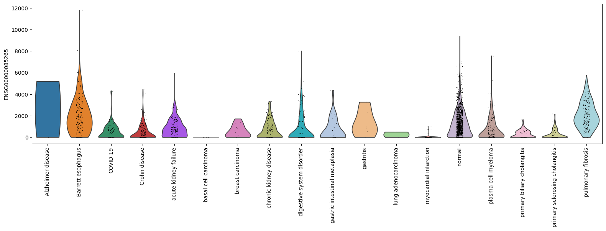

# cellNexusPy

## Importing the package


```python
from cellnexuspy import get_metadata, get_single_cell_experiment, get_pseudobulk, SAMPLE_DATABASE_URL

```

## Getting the metadata

The `get_metadata()` function returns a database connection and a DuckDB table.

The table can be used to query the metadata, while the connection's main purpose is to be closed when you are finished:


```python
conn, table = get_metadata(parquet_url = SAMPLE_DATABASE_URL)
table
```


    ┌─────────┬──────────────────────────────────────┬────────────────────┬──────────────────────────────────────────────────────┬─────────────────────────────────┬────────────────────────────┬──────────────────────────────────┬────────────────────────────────┬────────────────────────┬────────────┬────────────────────────────────────────────────────────────────────────────────────────────────────────────────────────────────────────────────────────────────────────────────────────────────────────────────────────────────────────────────────────────────────────────────────────────────────────────────┬──────────────────────────────────────┬──────────────────────────────────────┬───────────────────┬──────────────────────────────────────────┬────────────────────────────────────┬───────────────────────────┬──────────────────────────┬───────────────────────────────────────────────────────────────────────────────────┬───────────────┬──────────────────────────────────────────────────────────────────────────────┬───────────────┬───────────────┬──────────┬─────────────────┬─────────────────────┬──────────────┬───────────────────────────┬────────────────────┬──────────────┬───────────────────┬────────────┬──────────────────┬───────────────────────────────────────────────────────────────────────────────────────────────────────────────────────────────────────────────────────────────────────────┬────────────────┬─────────────────────────┬──────────────────────────────────────────┬─────────┬──────────────────────┬─────────────────┬─────────┬─────────────────────────┬─────────────┬─────────────────────────────────────────────────────────────────────────────────────────┬───────────┬─────────────────────────────────────────────────────────────────────────────────────┬────────────────────────────┬──────────┬────────────────────┬──────────────────────────────┬────────────────────┬───────────────┬────────────────────────────┬───────────┬──────────────────────┬──────────────────────┬────────────────────┬───────────────┬───────────────────┬────────────┬────────────┬────────────┬─────────────┬─────────────┬─────────────┬──────────────┬──────────────┬──────────────┬───────────────┬───────────────┬───────────────┬───────────────┬────────────────┬────────────────┬────────────────┬──────────────┬────────────┬─────────────────────────┬───────────────────────────────────────────┬───────────────────────────────────────────┬─────────┬──────────────────────┬───────────────────────────────────┬────────────────────────────────┬────────────────────────────┬──────────────────────────┬──────────────────────────┬───────────────────┬───────────────────┐
    │ cell_id │              dataset_id              │ observation_joinid │                      sample_id                       │            cell_type            │ cell_type_ontology_term_id │             sample_              │             assay              │ assay_ontology_term_id │ cell_count │                                                                                                                                                    citation                                                                                                                                                    │            collection_id             │          dataset_version_id          │ default_embedding │            development_stage             │ development_stage_ontology_term_id │          disease          │ disease_ontology_term_id │                                     donor_id                                      │ experiment___ │                                 explorer_url                                 │ feature_count │   filesize    │ filetype │ is_primary_data │ mean_genes_per_cell │   organism   │ organism_ontology_term_id │ primary_cell_count │ published_at │ raw_data_location │ revised_at │ run_from_cell_id │                                                                             sample_heuristic                                                                              │ schema_version │ self_reported_ethnicity │ self_reported_ethnicity_ontology_term_id │   sex   │ sex_ontology_term_id │ suspension_type │ tissue  │ tissue_ontology_term_id │ tissue_type │                                          title                                          │ tombstone │                                         url                                         │ x_approximate_distribution │ age_days │   tissue_groups    │ nFeature_expressed_in_sample │     nCount_RNA     │ empty_droplet │ cell_type_unified_ensemble │ is_immune │ subsets_Mito_percent │ subsets_Ribo_percent │ high_mitochondrion │ high_ribosome │ scDblFinder.class │ metacell_2 │ metacell_4 │ metacell_8 │ metacell_16 │ metacell_32 │ metacell_64 │ metacell_128 │ metacell_256 │ metacell_512 │ metacell_1024 │ metacell_2048 │ metacell_4096 │ metacell_8192 │ metacell_16384 │ metacell_32768 │ metacell_65536 │ sample_chunk │ cell_chunk │ sample_pseudobulk_chunk │       file_id_cellNexus_single_cell       │       file_id_cellNexus_pseudobulk        │  alive  │       atlas_id       │ cell_annotation_blueprint_singler │ cell_annotation_monaco_singler │ cell_annotation_azimuth_l2 │ ethnicity_flagging_score │ low_confidence_ethnicity │ .aggregated_cells │ imputed_ethnicity │
    │ double  │               varchar                │      varchar       │                       varchar                        │             varchar             │          varchar           │             varchar              │            varchar             │        varchar         │   int32    │                                                                                                                                                    varchar                                                                                                                                                     │               varchar                │               varchar                │      varchar      │                 varchar                  │              varchar               │          varchar          │         varchar          │                                      varchar                                      │    varchar    │                                   varchar                                    │     int32     │    double     │ varchar  │     varchar     │       double        │   varchar    │          varchar          │      varchar       │   varchar    │      varchar      │  varchar   │     varchar      │                                                                                  varchar                                                                                  │    varchar     │         varchar         │                 varchar                  │ varchar │       varchar        │     varchar     │ varchar │         varchar         │   varchar   │                                         varchar                                         │  boolean  │                                       varchar                                       │          varchar           │  int32   │      varchar       │            int32             │       double       │    boolean    │          varchar           │  boolean  │        int32         │        int32         │      boolean       │    boolean    │      varchar      │   int32    │   int32    │   int32    │    int32    │    int32    │    int32    │    int32     │    int32     │    int32     │     int32     │     int32     │     int32     │     int32     │     int32      │     int32      │     int32      │    int32     │   int32    │          int32          │                  varchar                  │                  varchar                  │ boolean │       varchar        │              varchar              │            varchar             │          varchar           │          double          │         varchar          │       int32       │      varchar      │
    ├─────────┼──────────────────────────────────────┼────────────────────┼──────────────────────────────────────────────────────┼─────────────────────────────────┼────────────────────────────┼──────────────────────────────────┼────────────────────────────────┼────────────────────────┼────────────┼────────────────────────────────────────────────────────────────────────────────────────────────────────────────────────────────────────────────────────────────────────────────────────────────────────────────────────────────────────────────────────────────────────────────────────────────────────────────┼──────────────────────────────────────┼──────────────────────────────────────┼───────────────────┼──────────────────────────────────────────┼────────────────────────────────────┼───────────────────────────┼──────────────────────────┼───────────────────────────────────────────────────────────────────────────────────┼───────────────┼──────────────────────────────────────────────────────────────────────────────┼───────────────┼───────────────┼──────────┼─────────────────┼─────────────────────┼──────────────┼───────────────────────────┼────────────────────┼──────────────┼───────────────────┼────────────┼──────────────────┼───────────────────────────────────────────────────────────────────────────────────────────────────────────────────────────────────────────────────────────────────────────┼────────────────┼─────────────────────────┼──────────────────────────────────────────┼─────────┼──────────────────────┼─────────────────┼─────────┼─────────────────────────┼─────────────┼─────────────────────────────────────────────────────────────────────────────────────────┼───────────┼─────────────────────────────────────────────────────────────────────────────────────┼────────────────────────────┼──────────┼────────────────────┼──────────────────────────────┼────────────────────┼───────────────┼────────────────────────────┼───────────┼──────────────────────┼──────────────────────┼────────────────────┼───────────────┼───────────────────┼────────────┼────────────┼────────────┼─────────────┼─────────────┼─────────────┼──────────────┼──────────────┼──────────────┼───────────────┼───────────────┼───────────────┼───────────────┼────────────────┼────────────────┼────────────────┼──────────────┼────────────┼─────────────────────────┼───────────────────────────────────────────┼───────────────────────────────────────────┼─────────┼──────────────────────┼───────────────────────────────────┼────────────────────────────────┼────────────────────────────┼──────────────────────────┼──────────────────────────┼───────────────────┼───────────────────┤
    │    81.0 │ cda2c8cd-be1c-42e5-b2cd-162caa1c4ce7 │ *NUPW@J{c2         │ 034f0fb1b1dfabfd15d0a19431cd1f59                     │ monocyte                        │ CL:0000576                 │ 034f0fb1b1dfabfd15d0a19431cd1f59 │ 10x 5' v1                      │ EFO:0011025            │     255901 │ Publication: https://doi.org/10.1126/science.aay3224 Dataset Version: https://datasets.cellxgene.cziscience.com/c6e08ab6-ab3b-41dc-8058-8e6442e081ec.h5ad curated and distributed by CZ CELLxGENE Discover in Collection: https://cellxgene.cziscience.com/collections/de13e3e2-23b6-40ed-a413-e9e12d7d3910    │ de13e3e2-23b6-40ed-a413-e9e12d7d3910 │ c6e08ab6-ab3b-41dc-8058-8e6442e081ec │ NULL              │ 13th week post-fertilization human stage │ HsapDv:0000050                     │ normal                    │ PATO:0000461             │ F38                                                                               │               │ https://cellxgene.cziscience.com/e/cda2c8cd-be1c-42e5-b2cd-162caa1c4ce7.cxg/ │         32839 │  2633195386.0 │ H5AD     │ TRUE            │    2145.70318599771 │ Homo sapiens │ NCBITaxon:9606            │ 255901             │ 2022-07-26   │ raw.X             │ 2024-06-11 │ NULL             │ F38_TH_45P_5GEX___F38___thymus___13th week post-fertilization human stage___10x 5' v1______normal___TRUE                                                                  │ 5.1.0          │ unknown                 │ unknown                                  │ male    │ PATO:0000384         │ cell            │ thymus  │ UBERON:0002370          │ tissue      │ Figure 1 - A cell atlas of human thymic development defines T cell repertoire formation │ false     │ https://datasets.cellxgene.cziscience.com/c6e08ab6-ab3b-41dc-8058-8e6442e081ec.h5ad │ NULL                       │       91 │ thymus             │                         2853 │ 64343.977450000086 │ false         │ cd14 mono                  │ true      │                    0 │                    0 │ false              │ false         │ singlet           │          1 │          1 │          1 │        NULL │        NULL │        NULL │         NULL │         NULL │         NULL │          NULL │          NULL │          NULL │          NULL │           NULL │           NULL │           NULL │            1 │          1 │                       1 │ 03319e4f54220f534de2c4e42e607126___1.h5ad │ f0946b9064dead3a6b2228fb70af8de1___1.h5ad │ true    │ cellxgene/01-07-2024 │ Monocytes                         │ Classical monocytes            │ CD4 TCM                    │                     NULL │ NULL                     │                 9 │ unknown           │
    │    82.0 │ cda2c8cd-be1c-42e5-b2cd-162caa1c4ce7 │ KIV>qGFIS?         │ 034f0fb1b1dfabfd15d0a19431cd1f59                     │ monocyte                        │ CL:0000576                 │ 034f0fb1b1dfabfd15d0a19431cd1f59 │ 10x 5' v1                      │ EFO:0011025            │     255901 │ Publication: https://doi.org/10.1126/science.aay3224 Dataset Version: https://datasets.cellxgene.cziscience.com/c6e08ab6-ab3b-41dc-8058-8e6442e081ec.h5ad curated and distributed by CZ CELLxGENE Discover in Collection: https://cellxgene.cziscience.com/collections/de13e3e2-23b6-40ed-a413-e9e12d7d3910    │ de13e3e2-23b6-40ed-a413-e9e12d7d3910 │ c6e08ab6-ab3b-41dc-8058-8e6442e081ec │ NULL              │ 13th week post-fertilization human stage │ HsapDv:0000050                     │ normal                    │ PATO:0000461             │ F38                                                                               │               │ https://cellxgene.cziscience.com/e/cda2c8cd-be1c-42e5-b2cd-162caa1c4ce7.cxg/ │         32839 │  2633195386.0 │ H5AD     │ TRUE            │    2145.70318599771 │ Homo sapiens │ NCBITaxon:9606            │ 255901             │ 2022-07-26   │ raw.X             │ 2024-06-11 │ NULL             │ F38_TH_45P_5GEX___F38___thymus___13th week post-fertilization human stage___10x 5' v1______normal___TRUE                                                                  │ 5.1.0          │ unknown                 │ unknown                                  │ male    │ PATO:0000384         │ cell            │ thymus  │ UBERON:0002370          │ tissue      │ Figure 1 - A cell atlas of human thymic development defines T cell repertoire formation │ false     │ https://datasets.cellxgene.cziscience.com/c6e08ab6-ab3b-41dc-8058-8e6442e081ec.h5ad │ NULL                       │       91 │ thymus             │                         2374 │  81901.13326999985 │ false         │ cd14 mono                  │ true      │                    0 │                    0 │ false              │ false         │ singlet           │          1 │          1 │          1 │        NULL │        NULL │        NULL │         NULL │         NULL │         NULL │          NULL │          NULL │          NULL │          NULL │           NULL │           NULL │           NULL │            1 │          1 │                       1 │ 03319e4f54220f534de2c4e42e607126___1.h5ad │ f0946b9064dead3a6b2228fb70af8de1___1.h5ad │ true    │ cellxgene/01-07-2024 │ Monocytes                         │ Classical monocytes            │ CD4 TCM                    │                     NULL │ NULL                     │                 9 │ unknown           │
    │    83.0 │ cda2c8cd-be1c-42e5-b2cd-162caa1c4ce7 │ p5e=WoIq0d         │ 034f0fb1b1dfabfd15d0a19431cd1f59                     │ monocyte                        │ CL:0000576                 │ 034f0fb1b1dfabfd15d0a19431cd1f59 │ 10x 5' v1                      │ EFO:0011025            │     255901 │ Publication: https://doi.org/10.1126/science.aay3224 Dataset Version: https://datasets.cellxgene.cziscience.com/c6e08ab6-ab3b-41dc-8058-8e6442e081ec.h5ad curated and distributed by CZ CELLxGENE Discover in Collection: https://cellxgene.cziscience.com/collections/de13e3e2-23b6-40ed-a413-e9e12d7d3910    │ de13e3e2-23b6-40ed-a413-e9e12d7d3910 │ c6e08ab6-ab3b-41dc-8058-8e6442e081ec │ NULL              │ 13th week post-fertilization human stage │ HsapDv:0000050                     │ normal                    │ PATO:0000461             │ F38                                                                               │               │ https://cellxgene.cziscience.com/e/cda2c8cd-be1c-42e5-b2cd-162caa1c4ce7.cxg/ │         32839 │  2633195386.0 │ H5AD     │ TRUE            │    2145.70318599771 │ Homo sapiens │ NCBITaxon:9606            │ 255901             │ 2022-07-26   │ raw.X             │ 2024-06-11 │ NULL             │ F38_TH_45P_5GEX___F38___thymus___13th week post-fertilization human stage___10x 5' v1______normal___TRUE                                                                  │ 5.1.0          │ unknown                 │ unknown                                  │ male    │ PATO:0000384         │ cell            │ thymus  │ UBERON:0002370          │ tissue      │ Figure 1 - A cell atlas of human thymic development defines T cell repertoire formation │ false     │ https://datasets.cellxgene.cziscience.com/c6e08ab6-ab3b-41dc-8058-8e6442e081ec.h5ad │ NULL                       │       91 │ thymus             │                         2064 │  87096.28738000002 │ false         │ cd14 mono                  │ true      │                    0 │                    0 │ false              │ false         │ singlet           │          3 │          1 │          1 │        NULL │        NULL │        NULL │         NULL │         NULL │         NULL │          NULL │          NULL │          NULL │          NULL │           NULL │           NULL │           NULL │            1 │          1 │                       1 │ 03319e4f54220f534de2c4e42e607126___1.h5ad │ f0946b9064dead3a6b2228fb70af8de1___1.h5ad │ true    │ cellxgene/01-07-2024 │ Monocytes                         │ Classical monocytes            │ CD4 TCM                    │                     NULL │ NULL                     │                 9 │ unknown           │
    │    84.0 │ cda2c8cd-be1c-42e5-b2cd-162caa1c4ce7 │ I6>u{Gb-J_         │ 034f0fb1b1dfabfd15d0a19431cd1f59                     │ monocyte                        │ CL:0000576                 │ 034f0fb1b1dfabfd15d0a19431cd1f59 │ 10x 5' v1                      │ EFO:0011025            │     255901 │ Publication: https://doi.org/10.1126/science.aay3224 Dataset Version: https://datasets.cellxgene.cziscience.com/c6e08ab6-ab3b-41dc-8058-8e6442e081ec.h5ad curated and distributed by CZ CELLxGENE Discover in Collection: https://cellxgene.cziscience.com/collections/de13e3e2-23b6-40ed-a413-e9e12d7d3910    │ de13e3e2-23b6-40ed-a413-e9e12d7d3910 │ c6e08ab6-ab3b-41dc-8058-8e6442e081ec │ NULL              │ 13th week post-fertilization human stage │ HsapDv:0000050                     │ normal                    │ PATO:0000461             │ F38                                                                               │               │ https://cellxgene.cziscience.com/e/cda2c8cd-be1c-42e5-b2cd-162caa1c4ce7.cxg/ │         32839 │  2633195386.0 │ H5AD     │ TRUE            │    2145.70318599771 │ Homo sapiens │ NCBITaxon:9606            │ 255901             │ 2022-07-26   │ raw.X             │ 2024-06-11 │ NULL             │ F38_TH_45P_5GEX___F38___thymus___13th week post-fertilization human stage___10x 5' v1______normal___TRUE                                                                  │ 5.1.0          │ unknown                 │ unknown                                  │ male    │ PATO:0000384         │ cell            │ thymus  │ UBERON:0002370          │ tissue      │ Figure 1 - A cell atlas of human thymic development defines T cell repertoire formation │ false     │ https://datasets.cellxgene.cziscience.com/c6e08ab6-ab3b-41dc-8058-8e6442e081ec.h5ad │ NULL                       │       91 │ thymus             │                         2684 │  74944.24382999937 │ false         │ cd14 mono                  │ true      │                    0 │                    0 │ false              │ false         │ singlet           │          2 │          1 │          1 │        NULL │        NULL │        NULL │         NULL │         NULL │         NULL │          NULL │          NULL │          NULL │          NULL │           NULL │           NULL │           NULL │            1 │          1 │                       1 │ 03319e4f54220f534de2c4e42e607126___1.h5ad │ f0946b9064dead3a6b2228fb70af8de1___1.h5ad │ true    │ cellxgene/01-07-2024 │ Monocytes                         │ Classical monocytes            │ CD4 TCM                    │                     NULL │ NULL                     │                 9 │ unknown           │
    │    85.0 │ cda2c8cd-be1c-42e5-b2cd-162caa1c4ce7 │ lx`7Bo-&7n         │ 034f0fb1b1dfabfd15d0a19431cd1f59                     │ monocyte                        │ CL:0000576                 │ 034f0fb1b1dfabfd15d0a19431cd1f59 │ 10x 5' v1                      │ EFO:0011025            │     255901 │ Publication: https://doi.org/10.1126/science.aay3224 Dataset Version: https://datasets.cellxgene.cziscience.com/c6e08ab6-ab3b-41dc-8058-8e6442e081ec.h5ad curated and distributed by CZ CELLxGENE Discover in Collection: https://cellxgene.cziscience.com/collections/de13e3e2-23b6-40ed-a413-e9e12d7d3910    │ de13e3e2-23b6-40ed-a413-e9e12d7d3910 │ c6e08ab6-ab3b-41dc-8058-8e6442e081ec │ NULL              │ 13th week post-fertilization human stage │ HsapDv:0000050                     │ normal                    │ PATO:0000461             │ F38                                                                               │               │ https://cellxgene.cziscience.com/e/cda2c8cd-be1c-42e5-b2cd-162caa1c4ce7.cxg/ │         32839 │  2633195386.0 │ H5AD     │ TRUE            │    2145.70318599771 │ Homo sapiens │ NCBITaxon:9606            │ 255901             │ 2022-07-26   │ raw.X             │ 2024-06-11 │ NULL             │ F38_TH_45P_5GEX___F38___thymus___13th week post-fertilization human stage___10x 5' v1______normal___TRUE                                                                  │ 5.1.0          │ unknown                 │ unknown                                  │ male    │ PATO:0000384         │ cell            │ thymus  │ UBERON:0002370          │ tissue      │ Figure 1 - A cell atlas of human thymic development defines T cell repertoire formation │ false     │ https://datasets.cellxgene.cziscience.com/c6e08ab6-ab3b-41dc-8058-8e6442e081ec.h5ad │ NULL                       │       91 │ thymus             │                         1361 │  77091.73000000005 │ false         │ cd14 mono                  │ true      │                    0 │                    0 │ false              │ false         │ singlet           │          4 │          2 │          1 │        NULL │        NULL │        NULL │         NULL │         NULL │         NULL │          NULL │          NULL │          NULL │          NULL │           NULL │           NULL │           NULL │            1 │          1 │                       1 │ 03319e4f54220f534de2c4e42e607126___1.h5ad │ f0946b9064dead3a6b2228fb70af8de1___1.h5ad │ true    │ cellxgene/01-07-2024 │ Monocytes                         │ Classical monocytes            │ CD4 TCM                    │                     NULL │ NULL                     │                 9 │ unknown           │
    │    86.0 │ cda2c8cd-be1c-42e5-b2cd-162caa1c4ce7 │ 6mRCZW}rOM         │ 034f0fb1b1dfabfd15d0a19431cd1f59                     │ monocyte                        │ CL:0000576                 │ 034f0fb1b1dfabfd15d0a19431cd1f59 │ 10x 5' v1                      │ EFO:0011025            │     255901 │ Publication: https://doi.org/10.1126/science.aay3224 Dataset Version: https://datasets.cellxgene.cziscience.com/c6e08ab6-ab3b-41dc-8058-8e6442e081ec.h5ad curated and distributed by CZ CELLxGENE Discover in Collection: https://cellxgene.cziscience.com/collections/de13e3e2-23b6-40ed-a413-e9e12d7d3910    │ de13e3e2-23b6-40ed-a413-e9e12d7d3910 │ c6e08ab6-ab3b-41dc-8058-8e6442e081ec │ NULL              │ 13th week post-fertilization human stage │ HsapDv:0000050                     │ normal                    │ PATO:0000461             │ F38                                                                               │               │ https://cellxgene.cziscience.com/e/cda2c8cd-be1c-42e5-b2cd-162caa1c4ce7.cxg/ │         32839 │  2633195386.0 │ H5AD     │ TRUE            │    2145.70318599771 │ Homo sapiens │ NCBITaxon:9606            │ 255901             │ 2022-07-26   │ raw.X             │ 2024-06-11 │ NULL             │ F38_TH_45P_5GEX___F38___thymus___13th week post-fertilization human stage___10x 5' v1______normal___TRUE                                                                  │ 5.1.0          │ unknown                 │ unknown                                  │ male    │ PATO:0000384         │ cell            │ thymus  │ UBERON:0002370          │ tissue      │ Figure 1 - A cell atlas of human thymic development defines T cell repertoire formation │ false     │ https://datasets.cellxgene.cziscience.com/c6e08ab6-ab3b-41dc-8058-8e6442e081ec.h5ad │ NULL                       │       91 │ thymus             │                         2123 │  80974.27661999944 │ false         │ cd14 mono                  │ true      │                    0 │                    0 │ false              │ false         │ singlet           │          2 │          1 │          1 │        NULL │        NULL │        NULL │         NULL │         NULL │         NULL │          NULL │          NULL │          NULL │          NULL │           NULL │           NULL │           NULL │            1 │          1 │                       1 │ 03319e4f54220f534de2c4e42e607126___1.h5ad │ f0946b9064dead3a6b2228fb70af8de1___1.h5ad │ true    │ cellxgene/01-07-2024 │ Monocytes                         │ Classical monocytes            │ CD4 TCM                    │                     NULL │ NULL                     │                 9 │ unknown           │
    │    87.0 │ cda2c8cd-be1c-42e5-b2cd-162caa1c4ce7 │ -NL-OH3!IA         │ 034f0fb1b1dfabfd15d0a19431cd1f59                     │ monocyte                        │ CL:0000576                 │ 034f0fb1b1dfabfd15d0a19431cd1f59 │ 10x 5' v1                      │ EFO:0011025            │     255901 │ Publication: https://doi.org/10.1126/science.aay3224 Dataset Version: https://datasets.cellxgene.cziscience.com/c6e08ab6-ab3b-41dc-8058-8e6442e081ec.h5ad curated and distributed by CZ CELLxGENE Discover in Collection: https://cellxgene.cziscience.com/collections/de13e3e2-23b6-40ed-a413-e9e12d7d3910    │ de13e3e2-23b6-40ed-a413-e9e12d7d3910 │ c6e08ab6-ab3b-41dc-8058-8e6442e081ec │ NULL              │ 13th week post-fertilization human stage │ HsapDv:0000050                     │ normal                    │ PATO:0000461             │ F38                                                                               │               │ https://cellxgene.cziscience.com/e/cda2c8cd-be1c-42e5-b2cd-162caa1c4ce7.cxg/ │         32839 │  2633195386.0 │ H5AD     │ TRUE            │    2145.70318599771 │ Homo sapiens │ NCBITaxon:9606            │ 255901             │ 2022-07-26   │ raw.X             │ 2024-06-11 │ NULL             │ F38_TH_45P_5GEX___F38___thymus___13th week post-fertilization human stage___10x 5' v1______normal___TRUE                                                                  │ 5.1.0          │ unknown                 │ unknown                                  │ male    │ PATO:0000384         │ cell            │ thymus  │ UBERON:0002370          │ tissue      │ Figure 1 - A cell atlas of human thymic development defines T cell repertoire formation │ false     │ https://datasets.cellxgene.cziscience.com/c6e08ab6-ab3b-41dc-8058-8e6442e081ec.h5ad │ NULL                       │       91 │ thymus             │                         2033 │  82355.15189000044 │ false         │ cd14 mono                  │ true      │                    0 │                    0 │ false              │ false         │ singlet           │          2 │          1 │          1 │        NULL │        NULL │        NULL │         NULL │         NULL │         NULL │          NULL │          NULL │          NULL │          NULL │           NULL │           NULL │           NULL │            1 │          1 │                       1 │ 03319e4f54220f534de2c4e42e607126___1.h5ad │ f0946b9064dead3a6b2228fb70af8de1___1.h5ad │ true    │ cellxgene/01-07-2024 │ Monocytes                         │ Classical monocytes            │ CD4 TCM                    │                     NULL │ NULL                     │                 9 │ unknown           │
    │    88.0 │ cda2c8cd-be1c-42e5-b2cd-162caa1c4ce7 │ zHCZWNmUHu         │ 034f0fb1b1dfabfd15d0a19431cd1f59                     │ monocyte                        │ CL:0000576                 │ 034f0fb1b1dfabfd15d0a19431cd1f59 │ 10x 5' v1                      │ EFO:0011025            │     255901 │ Publication: https://doi.org/10.1126/science.aay3224 Dataset Version: https://datasets.cellxgene.cziscience.com/c6e08ab6-ab3b-41dc-8058-8e6442e081ec.h5ad curated and distributed by CZ CELLxGENE Discover in Collection: https://cellxgene.cziscience.com/collections/de13e3e2-23b6-40ed-a413-e9e12d7d3910    │ de13e3e2-23b6-40ed-a413-e9e12d7d3910 │ c6e08ab6-ab3b-41dc-8058-8e6442e081ec │ NULL              │ 13th week post-fertilization human stage │ HsapDv:0000050                     │ normal                    │ PATO:0000461             │ F38                                                                               │               │ https://cellxgene.cziscience.com/e/cda2c8cd-be1c-42e5-b2cd-162caa1c4ce7.cxg/ │         32839 │  2633195386.0 │ H5AD     │ TRUE            │    2145.70318599771 │ Homo sapiens │ NCBITaxon:9606            │ 255901             │ 2022-07-26   │ raw.X             │ 2024-06-11 │ NULL             │ F38_TH_45P_5GEX___F38___thymus___13th week post-fertilization human stage___10x 5' v1______normal___TRUE                                                                  │ 5.1.0          │ unknown                 │ unknown                                  │ male    │ PATO:0000384         │ cell            │ thymus  │ UBERON:0002370          │ tissue      │ Figure 1 - A cell atlas of human thymic development defines T cell repertoire formation │ false     │ https://datasets.cellxgene.cziscience.com/c6e08ab6-ab3b-41dc-8058-8e6442e081ec.h5ad │ NULL                       │       91 │ thymus             │                         3705 │  79029.37513999944 │ false         │ cd14 mono                  │ true      │                    0 │                    0 │ false              │ false         │ singlet           │          1 │          1 │          1 │        NULL │        NULL │        NULL │         NULL │         NULL │         NULL │          NULL │          NULL │          NULL │          NULL │           NULL │           NULL │           NULL │            1 │          1 │                       1 │ 03319e4f54220f534de2c4e42e607126___1.h5ad │ f0946b9064dead3a6b2228fb70af8de1___1.h5ad │ true    │ cellxgene/01-07-2024 │ Monocytes                         │ Classical monocytes            │ CD4 TCM                    │                     NULL │ NULL                     │                 9 │ unknown           │
    │    89.0 │ cda2c8cd-be1c-42e5-b2cd-162caa1c4ce7 │ *_#lQ<oUnT         │ 034f0fb1b1dfabfd15d0a19431cd1f59                     │ monocyte                        │ CL:0000576                 │ 034f0fb1b1dfabfd15d0a19431cd1f59 │ 10x 5' v1                      │ EFO:0011025            │     255901 │ Publication: https://doi.org/10.1126/science.aay3224 Dataset Version: https://datasets.cellxgene.cziscience.com/c6e08ab6-ab3b-41dc-8058-8e6442e081ec.h5ad curated and distributed by CZ CELLxGENE Discover in Collection: https://cellxgene.cziscience.com/collections/de13e3e2-23b6-40ed-a413-e9e12d7d3910    │ de13e3e2-23b6-40ed-a413-e9e12d7d3910 │ c6e08ab6-ab3b-41dc-8058-8e6442e081ec │ NULL              │ 13th week post-fertilization human stage │ HsapDv:0000050                     │ normal                    │ PATO:0000461             │ F38                                                                               │               │ https://cellxgene.cziscience.com/e/cda2c8cd-be1c-42e5-b2cd-162caa1c4ce7.cxg/ │         32839 │  2633195386.0 │ H5AD     │ TRUE            │    2145.70318599771 │ Homo sapiens │ NCBITaxon:9606            │ 255901             │ 2022-07-26   │ raw.X             │ 2024-06-11 │ NULL             │ F38_TH_45P_5GEX___F38___thymus___13th week post-fertilization human stage___10x 5' v1______normal___TRUE                                                                  │ 5.1.0          │ unknown                 │ unknown                                  │ male    │ PATO:0000384         │ cell            │ thymus  │ UBERON:0002370          │ tissue      │ Figure 1 - A cell atlas of human thymic development defines T cell repertoire formation │ false     │ https://datasets.cellxgene.cziscience.com/c6e08ab6-ab3b-41dc-8058-8e6442e081ec.h5ad │ NULL                       │       91 │ thymus             │                         2965 │  78896.33439999982 │ false         │ cd14 mono                  │ true      │                    0 │                    0 │ false              │ false         │ singlet           │          2 │          1 │          1 │        NULL │        NULL │        NULL │         NULL │         NULL │         NULL │          NULL │          NULL │          NULL │          NULL │           NULL │           NULL │           NULL │            1 │          1 │                       1 │ 03319e4f54220f534de2c4e42e607126___1.h5ad │ f0946b9064dead3a6b2228fb70af8de1___1.h5ad │ true    │ cellxgene/01-07-2024 │ Monocytes                         │ Classical monocytes            │ CD4 TCM                    │                     NULL │ NULL                     │                 9 │ unknown           │
    │    99.0 │ cda2c8cd-be1c-42e5-b2cd-162caa1c4ce7 │ IdHwp1GBZm         │ 03ddfd577963ac4c5d33903f8bd3ef0e                     │ monocyte                        │ CL:0000576                 │ 03ddfd577963ac4c5d33903f8bd3ef0e │ 10x 3' v2                      │ EFO:0009899            │     255901 │ Publication: https://doi.org/10.1126/science.aay3224 Dataset Version: https://datasets.cellxgene.cziscience.com/c6e08ab6-ab3b-41dc-8058-8e6442e081ec.h5ad curated and distributed by CZ CELLxGENE Discover in Collection: https://cellxgene.cziscience.com/collections/de13e3e2-23b6-40ed-a413-e9e12d7d3910    │ de13e3e2-23b6-40ed-a413-e9e12d7d3910 │ c6e08ab6-ab3b-41dc-8058-8e6442e081ec │ NULL              │ 12th week post-fertilization human stage │ HsapDv:0000049                     │ normal                    │ PATO:0000461             │ F45                                                                               │               │ https://cellxgene.cziscience.com/e/cda2c8cd-be1c-42e5-b2cd-162caa1c4ce7.cxg/ │         32839 │  2633195386.0 │ H5AD     │ TRUE            │    2145.70318599771 │ Homo sapiens │ NCBITaxon:9606            │ 255901             │ 2022-07-26   │ raw.X             │ 2024-06-11 │ NULL             │ F45_TH_45P___F45___thymus___12th week post-fertilization human stage___10x 3' v2______normal___TRUE                                                                       │ 5.1.0          │ unknown                 │ unknown                                  │ female  │ PATO:0000383         │ cell            │ thymus  │ UBERON:0002370          │ tissue      │ Figure 1 - A cell atlas of human thymic development defines T cell repertoire formation │ false     │ https://datasets.cellxgene.cziscience.com/c6e08ab6-ab3b-41dc-8058-8e6442e081ec.h5ad │ NULL                       │       84 │ thymus             │                         1354 │  62693.02996999965 │ false         │ cd14 mono                  │ true      │                    0 │                    0 │ false              │ false         │ singlet           │          1 │       NULL │       NULL │        NULL │        NULL │        NULL │         NULL │         NULL │         NULL │          NULL │          NULL │          NULL │          NULL │           NULL │           NULL │           NULL │            1 │          1 │                       1 │ 03319e4f54220f534de2c4e42e607126___1.h5ad │ f0946b9064dead3a6b2228fb70af8de1___1.h5ad │ true    │ cellxgene/01-07-2024 │ Monocytes                         │ Classical monocytes            │ CD8 Naive                  │                     NULL │ NULL                     │                 3 │ unknown           │
    │      ·  │                  ·                   │     ·              │                ·                                     │    ·                            │     ·                      │                ·                 │     ·                          │      ·                 │        ·   │                                                                                                                                                      ·                                                                                                                                                         │                  ·                   │                  ·                   │  ·                │    ·                                     │    ·                               │   ·                       │      ·                   │  ·                                                                                │       ·       │                                      ·                                       │           ·   │        ·      │  ·       │  ·              │            ·        │      ·       │       ·                   │   ·                │     ·        │   ·               │     ·      │  ·               │                                                  ·                                                                                                                        │   ·            │    ·                    │    ·                                     │   ·     │    ·                 │  ·              │  ·      │       ·                 │   ·         │                                    ·                                                    │   ·       │                                          ·                                          │  ·                         │        · │   ·                │                           ·  │              ·     │   ·           │    ·                       │  ·        │                    · │                    · │   ·                │   ·           │    ·              │          · │          · │          · │          ·  │          ·  │          ·  │           ·  │           ·  │           ·  │            ·  │            ·  │            ·  │            ·  │             ·  │             ·  │             ·  │            · │          · │                       · │                     ·                     │                     ·                     │  ·      │          ·           │    ·                              │       ·                        │     ·                      │                       ·  │  ·                       │                 · │    ·              │
    │      ·  │                  ·                   │     ·              │                ·                                     │    ·                            │     ·                      │                ·                 │     ·                          │      ·                 │        ·   │                                                                                                                                                      ·                                                                                                                                                         │                  ·                   │                  ·                   │  ·                │    ·                                     │    ·                               │   ·                       │      ·                   │  ·                                                                                │       ·       │                                      ·                                       │           ·   │        ·      │  ·       │  ·              │            ·        │      ·       │       ·                   │   ·                │     ·        │   ·               │     ·      │  ·               │                                                  ·                                                                                                                        │   ·            │    ·                    │    ·                                     │   ·     │    ·                 │  ·              │  ·      │       ·                 │   ·         │                                    ·                                                    │   ·       │                                          ·                                          │  ·                         │        · │   ·                │                           ·  │              ·     │   ·           │    ·                       │  ·        │                    · │                    · │   ·                │   ·           │    ·              │          · │          · │          · │          ·  │          ·  │          ·  │           ·  │           ·  │           ·  │            ·  │            ·  │            ·  │            ·  │             ·  │             ·  │             ·  │            · │          · │                       · │                     ·                     │                     ·                     │  ·      │          ·           │    ·                              │       ·                        │     ·                      │                       ·  │  ·                       │                 · │    ·              │
    │      ·  │                  ·                   │     ·              │                ·                                     │    ·                            │     ·                      │                ·                 │     ·                          │      ·                 │        ·   │                                                                                                                                                      ·                                                                                                                                                         │                  ·                   │                  ·                   │  ·                │    ·                                     │    ·                               │   ·                       │      ·                   │  ·                                                                                │       ·       │                                      ·                                       │           ·   │        ·      │  ·       │  ·              │            ·        │      ·       │       ·                   │   ·                │     ·        │   ·               │     ·      │  ·               │                                                  ·                                                                                                                        │   ·            │    ·                    │    ·                                     │   ·     │    ·                 │  ·              │  ·      │       ·                 │   ·         │                                    ·                                                    │   ·       │                                          ·                                          │  ·                         │        · │   ·                │                           ·  │              ·     │   ·           │    ·                       │  ·        │                    · │                    · │   ·                │   ·           │    ·              │          · │          · │          · │          ·  │          ·  │          ·  │           ·  │           ·  │           ·  │            ·  │            ·  │            ·  │            ·  │             ·  │             ·  │             ·  │            · │          · │                       · │                     ·                     │                     ·                     │  ·      │          ·           │    ·                              │       ·                        │     ·                      │                       ·  │  ·                       │                 · │    ·              │
    │   206.0 │ 9f222629-9e39-47d0-b83f-e08d610c7479 │ tUlYc_F#LM         │ 1a28ccedf9f2fdb340f63e18512c231f___BT1299_lambrechts │ CD4-positive, alpha-beta T cell │ CL:0000624                 │ 1a28ccedf9f2fdb340f63e18512c231f │ 10x 3' transcription profiling │ EFO:0030003            │    2282447 │ Publication: https://doi.org/10.1038/s41591-023-02327-2 Dataset Version: https://datasets.cellxgene.cziscience.com/8d84ba15-d367-4dce-979c-85da70b868a2.h5ad curated and distributed by CZ CELLxGENE Discover in Collection: https://cellxgene.cziscience.com/collections/6f6d381a-7701-4781-935c-db10d30de293 │ 6f6d381a-7701-4781-935c-db10d30de293 │ 8d84ba15-d367-4dce-979c-85da70b868a2 │ X_umap            │ unknown                                  │ unknown                            │ lung large cell carcinoma │ MONDO:0003050            │ homosapiens_None_2023_None_sikkemalisa_002_d10_1101_2022_03_10_483747lambrechts_5 │               │ https://cellxgene.cziscience.com/e/9f222629-9e39-47d0-b83f-e08d610c7479.cxg/ │         56239 │ 21851725645.0 │ H5AD     │ TRUE            │  1760.6743113859818 │ Homo sapiens │ NCBITaxon:9606            │ 1959503            │ 2023-05-08   │ raw.X             │ 2024-06-11 │ NULL             │ homosapiens_None_2023_None_sikkemalisa_002_d10_1101_2022_03_10_483747lambrechts_5___lung___unknown___10x 3' transcription profiling______lung large cell carcinoma___TRUE │ 5.1.0          │ unknown                 │ unknown                                  │ unknown │ unknown              │ NULL            │ lung    │ UBERON:0002048          │ tissue      │ An integrated cell atlas of the human lung in health and disease (full)                 │ false     │ https://datasets.cellxgene.cziscience.com/8d84ba15-d367-4dce-979c-85da70b868a2.h5ad │ NULL                       │     NULL │ respiratory system │                          320 │         5181.85273 │ false         │ cd4 tcm                    │ true      │                    0 │                    0 │ false              │ false         │ singlet           │          1 │          2 │          2 │        NULL │        NULL │        NULL │         NULL │         NULL │         NULL │          NULL │          NULL │          NULL │          NULL │           NULL │           NULL │           NULL │            1 │          9 │                       2 │ 1af9e4710374605bb904949487c6108e___1.h5ad │ c25a6ea6b00d263d6cbb2d06a542a2c7___1.h5ad │ true    │ cellxgene/01-07-2024 │ CD4+ Tcm                          │ Vd2 gd T cells                 │ CD14 Mono                  │                     NULL │ NULL                     │                13 │ unknown           │
    │   205.0 │ 9f222629-9e39-47d0-b83f-e08d610c7479 │ i0`KDD?<w8         │ 1a28ccedf9f2fdb340f63e18512c231f___BT1299_lambrechts │ CD4-positive, alpha-beta T cell │ CL:0000624                 │ 1a28ccedf9f2fdb340f63e18512c231f │ 10x 3' transcription profiling │ EFO:0030003            │    2282447 │ Publication: https://doi.org/10.1038/s41591-023-02327-2 Dataset Version: https://datasets.cellxgene.cziscience.com/8d84ba15-d367-4dce-979c-85da70b868a2.h5ad curated and distributed by CZ CELLxGENE Discover in Collection: https://cellxgene.cziscience.com/collections/6f6d381a-7701-4781-935c-db10d30de293 │ 6f6d381a-7701-4781-935c-db10d30de293 │ 8d84ba15-d367-4dce-979c-85da70b868a2 │ X_umap            │ unknown                                  │ unknown                            │ lung large cell carcinoma │ MONDO:0003050            │ homosapiens_None_2023_None_sikkemalisa_002_d10_1101_2022_03_10_483747lambrechts_5 │               │ https://cellxgene.cziscience.com/e/9f222629-9e39-47d0-b83f-e08d610c7479.cxg/ │         56239 │ 21851725645.0 │ H5AD     │ TRUE            │  1760.6743113859818 │ Homo sapiens │ NCBITaxon:9606            │ 1959503            │ 2023-05-08   │ raw.X             │ 2024-06-11 │ NULL             │ homosapiens_None_2023_None_sikkemalisa_002_d10_1101_2022_03_10_483747lambrechts_5___lung___unknown___10x 3' transcription profiling______lung large cell carcinoma___TRUE │ 5.1.0          │ unknown                 │ unknown                                  │ unknown │ unknown              │ NULL            │ lung    │ UBERON:0002048          │ tissue      │ An integrated cell atlas of the human lung in health and disease (full)                 │ false     │ https://datasets.cellxgene.cziscience.com/8d84ba15-d367-4dce-979c-85da70b868a2.h5ad │ NULL                       │     NULL │ respiratory system │                          475 │  5344.387310000004 │ false         │ cd4 tcm                    │ true      │                    0 │                    0 │ false              │ false         │ singlet           │          1 │          2 │          2 │        NULL │        NULL │        NULL │         NULL │         NULL │         NULL │          NULL │          NULL │          NULL │          NULL │           NULL │           NULL │           NULL │            1 │          9 │                       2 │ 1af9e4710374605bb904949487c6108e___1.h5ad │ c25a6ea6b00d263d6cbb2d06a542a2c7___1.h5ad │ true    │ cellxgene/01-07-2024 │ CD4+ Tcm                          │ Natural killer cells           │ CD14 Mono                  │                     NULL │ NULL                     │                13 │ unknown           │
    │   210.0 │ 9f222629-9e39-47d0-b83f-e08d610c7479 │ Wq5^6LL`D{         │ 1a28ccedf9f2fdb340f63e18512c231f___BT1299_lambrechts │ CD4-positive, alpha-beta T cell │ CL:0000624                 │ 1a28ccedf9f2fdb340f63e18512c231f │ 10x 3' transcription profiling │ EFO:0030003            │    2282447 │ Publication: https://doi.org/10.1038/s41591-023-02327-2 Dataset Version: https://datasets.cellxgene.cziscience.com/8d84ba15-d367-4dce-979c-85da70b868a2.h5ad curated and distributed by CZ CELLxGENE Discover in Collection: https://cellxgene.cziscience.com/collections/6f6d381a-7701-4781-935c-db10d30de293 │ 6f6d381a-7701-4781-935c-db10d30de293 │ 8d84ba15-d367-4dce-979c-85da70b868a2 │ X_umap            │ unknown                                  │ unknown                            │ lung large cell carcinoma │ MONDO:0003050            │ homosapiens_None_2023_None_sikkemalisa_002_d10_1101_2022_03_10_483747lambrechts_5 │               │ https://cellxgene.cziscience.com/e/9f222629-9e39-47d0-b83f-e08d610c7479.cxg/ │         56239 │ 21851725645.0 │ H5AD     │ TRUE            │  1760.6743113859818 │ Homo sapiens │ NCBITaxon:9606            │ 1959503            │ 2023-05-08   │ raw.X             │ 2024-06-11 │ NULL             │ homosapiens_None_2023_None_sikkemalisa_002_d10_1101_2022_03_10_483747lambrechts_5___lung___unknown___10x 3' transcription profiling______lung large cell carcinoma___TRUE │ 5.1.0          │ unknown                 │ unknown                                  │ unknown │ unknown              │ NULL            │ lung    │ UBERON:0002048          │ tissue      │ An integrated cell atlas of the human lung in health and disease (full)                 │ false     │ https://datasets.cellxgene.cziscience.com/8d84ba15-d367-4dce-979c-85da70b868a2.h5ad │ NULL                       │     NULL │ respiratory system │                          388 │          4059.6996 │ false         │ cd4 tcm                    │ true      │                    0 │                    0 │ false              │ false         │ singlet           │          2 │          1 │          1 │        NULL │        NULL │        NULL │         NULL │         NULL │         NULL │          NULL │          NULL │          NULL │          NULL │           NULL │           NULL │           NULL │            1 │          9 │                       2 │ 1af9e4710374605bb904949487c6108e___1.h5ad │ c25a6ea6b00d263d6cbb2d06a542a2c7___1.h5ad │ true    │ cellxgene/01-07-2024 │ CD4+ Tcm                          │ Non-Vd2 gd T cells             │ CD14 Mono                  │                     NULL │ NULL                     │                13 │ unknown           │
    │   207.0 │ 9f222629-9e39-47d0-b83f-e08d610c7479 │ !Fywp4GA&o         │ 1a28ccedf9f2fdb340f63e18512c231f___BT1299_lambrechts │ CD4-positive, alpha-beta T cell │ CL:0000624                 │ 1a28ccedf9f2fdb340f63e18512c231f │ 10x 3' transcription profiling │ EFO:0030003            │    2282447 │ Publication: https://doi.org/10.1038/s41591-023-02327-2 Dataset Version: https://datasets.cellxgene.cziscience.com/8d84ba15-d367-4dce-979c-85da70b868a2.h5ad curated and distributed by CZ CELLxGENE Discover in Collection: https://cellxgene.cziscience.com/collections/6f6d381a-7701-4781-935c-db10d30de293 │ 6f6d381a-7701-4781-935c-db10d30de293 │ 8d84ba15-d367-4dce-979c-85da70b868a2 │ X_umap            │ unknown                                  │ unknown                            │ lung large cell carcinoma │ MONDO:0003050            │ homosapiens_None_2023_None_sikkemalisa_002_d10_1101_2022_03_10_483747lambrechts_5 │               │ https://cellxgene.cziscience.com/e/9f222629-9e39-47d0-b83f-e08d610c7479.cxg/ │         56239 │ 21851725645.0 │ H5AD     │ TRUE            │  1760.6743113859818 │ Homo sapiens │ NCBITaxon:9606            │ 1959503            │ 2023-05-08   │ raw.X             │ 2024-06-11 │ NULL             │ homosapiens_None_2023_None_sikkemalisa_002_d10_1101_2022_03_10_483747lambrechts_5___lung___unknown___10x 3' transcription profiling______lung large cell carcinoma___TRUE │ 5.1.0          │ unknown                 │ unknown                                  │ unknown │ unknown              │ NULL            │ lung    │ UBERON:0002048          │ tissue      │ An integrated cell atlas of the human lung in health and disease (full)                 │ false     │ https://datasets.cellxgene.cziscience.com/8d84ba15-d367-4dce-979c-85da70b868a2.h5ad │ NULL                       │     NULL │ respiratory system │                          571 │  5077.593970000004 │ false         │ cd4 tcm                    │ true      │                    0 │                    0 │ false              │ false         │ singlet           │          5 │          1 │          1 │        NULL │        NULL │        NULL │         NULL │         NULL │         NULL │          NULL │          NULL │          NULL │          NULL │           NULL │           NULL │           NULL │            1 │          9 │                       2 │ 1af9e4710374605bb904949487c6108e___1.h5ad │ c25a6ea6b00d263d6cbb2d06a542a2c7___1.h5ad │ true    │ cellxgene/01-07-2024 │ CD4+ Tcm                          │ MAIT cells                     │ CD14 Mono                  │                     NULL │ NULL                     │                13 │ unknown           │
    │   208.0 │ 9f222629-9e39-47d0-b83f-e08d610c7479 │ _UGCk+)yuF         │ 1a28ccedf9f2fdb340f63e18512c231f___BT1299_lambrechts │ CD4-positive, alpha-beta T cell │ CL:0000624                 │ 1a28ccedf9f2fdb340f63e18512c231f │ 10x 3' transcription profiling │ EFO:0030003            │    2282447 │ Publication: https://doi.org/10.1038/s41591-023-02327-2 Dataset Version: https://datasets.cellxgene.cziscience.com/8d84ba15-d367-4dce-979c-85da70b868a2.h5ad curated and distributed by CZ CELLxGENE Discover in Collection: https://cellxgene.cziscience.com/collections/6f6d381a-7701-4781-935c-db10d30de293 │ 6f6d381a-7701-4781-935c-db10d30de293 │ 8d84ba15-d367-4dce-979c-85da70b868a2 │ X_umap            │ unknown                                  │ unknown                            │ lung large cell carcinoma │ MONDO:0003050            │ homosapiens_None_2023_None_sikkemalisa_002_d10_1101_2022_03_10_483747lambrechts_5 │               │ https://cellxgene.cziscience.com/e/9f222629-9e39-47d0-b83f-e08d610c7479.cxg/ │         56239 │ 21851725645.0 │ H5AD     │ TRUE            │  1760.6743113859818 │ Homo sapiens │ NCBITaxon:9606            │ 1959503            │ 2023-05-08   │ raw.X             │ 2024-06-11 │ NULL             │ homosapiens_None_2023_None_sikkemalisa_002_d10_1101_2022_03_10_483747lambrechts_5___lung___unknown___10x 3' transcription profiling______lung large cell carcinoma___TRUE │ 5.1.0          │ unknown                 │ unknown                                  │ unknown │ unknown              │ NULL            │ lung    │ UBERON:0002048          │ tissue      │ An integrated cell atlas of the human lung in health and disease (full)                 │ false     │ https://datasets.cellxgene.cziscience.com/8d84ba15-d367-4dce-979c-85da70b868a2.h5ad │ NULL                       │     NULL │ respiratory system │                          209 │  4928.649439999999 │ false         │ cd4 tcm                    │ true      │                    0 │                    0 │ false              │ false         │ singlet           │          3 │          1 │          1 │        NULL │        NULL │        NULL │         NULL │         NULL │         NULL │          NULL │          NULL │          NULL │          NULL │           NULL │           NULL │           NULL │            1 │          9 │                       2 │ 1af9e4710374605bb904949487c6108e___1.h5ad │ c25a6ea6b00d263d6cbb2d06a542a2c7___1.h5ad │ true    │ cellxgene/01-07-2024 │ CD4+ Tcm                          │ Non-switched memory B cells    │ CD14 Mono                  │                     NULL │ NULL                     │                13 │ unknown           │
    │   215.0 │ 9f222629-9e39-47d0-b83f-e08d610c7479 │ GV13#H_%9C         │ 301da3fe7726a2b6bd7b6ac75cd1098e                     │ CD4-positive, alpha-beta T cell │ CL:0000624                 │ 301da3fe7726a2b6bd7b6ac75cd1098e │ Seq-Well                       │ EFO:0008919            │    2282447 │ Publication: https://doi.org/10.1038/s41591-023-02327-2 Dataset Version: https://datasets.cellxgene.cziscience.com/8d84ba15-d367-4dce-979c-85da70b868a2.h5ad curated and distributed by CZ CELLxGENE Discover in Collection: https://cellxgene.cziscience.com/collections/6f6d381a-7701-4781-935c-db10d30de293 │ 6f6d381a-7701-4781-935c-db10d30de293 │ 8d84ba15-d367-4dce-979c-85da70b868a2 │ X_umap            │ 55-year-old human stage                  │ HsapDv:0000149                     │ normal                    │ PATO:0000461             │ homosapiens_None_2023_None_sikkemalisa_002_d10_1101_2022_03_10_483747LuT_553      │               │ https://cellxgene.cziscience.com/e/9f222629-9e39-47d0-b83f-e08d610c7479.cxg/ │         56239 │ 21851725645.0 │ H5AD     │ TRUE            │  1760.6743113859818 │ Homo sapiens │ NCBITaxon:9606            │ 1959503            │ 2023-05-08   │ raw.X             │ 2024-06-11 │ NULL             │ homosapiens_None_2023_None_sikkemalisa_002_d10_1101_2022_03_10_483747LuT_553___lung___55-year-old human stage___Seq-Well______normal___TRUE                               │ 5.1.0          │ unknown                 │ unknown                                  │ male    │ PATO:0000384         │ NULL            │ lung    │ UBERON:0002048          │ tissue      │ An integrated cell atlas of the human lung in health and disease (full)                 │ false     │ https://datasets.cellxgene.cziscience.com/8d84ba15-d367-4dce-979c-85da70b868a2.h5ad │ NULL                       │    20075 │ respiratory system │                          265 │ 5787.7740799999965 │ false         │ cd4 tcm                    │ true      │                    0 │                    0 │ false              │ false         │ singlet           │          1 │       NULL │       NULL │        NULL │        NULL │        NULL │         NULL │         NULL │         NULL │          NULL │          NULL │          NULL │          NULL │           NULL │           NULL │           NULL │            1 │          9 │                       2 │ 1af9e4710374605bb904949487c6108e___1.h5ad │ c25a6ea6b00d263d6cbb2d06a542a2c7___1.h5ad │ true    │ cellxgene/01-07-2024 │ CD4+ Tcm                          │ MAIT cells                     │ cDC2                       │                     NULL │ NULL                     │                 1 │ European          │
    │   219.0 │ 9f222629-9e39-47d0-b83f-e08d610c7479 │ y;G=XI-tkT         │ 356a5cda613b1b4b10d9ce7350d5d247                     │ CD4-positive, alpha-beta T cell │ CL:0000624                 │ 356a5cda613b1b4b10d9ce7350d5d247 │ 10x 3' v3                      │ EFO:0009922            │    2282447 │ Publication: https://doi.org/10.1038/s41591-023-02327-2 Dataset Version: https://datasets.cellxgene.cziscience.com/8d84ba15-d367-4dce-979c-85da70b868a2.h5ad curated and distributed by CZ CELLxGENE Discover in Collection: https://cellxgene.cziscience.com/collections/6f6d381a-7701-4781-935c-db10d30de293 │ 6f6d381a-7701-4781-935c-db10d30de293 │ 8d84ba15-d367-4dce-979c-85da70b868a2 │ X_umap            │ unknown                                  │ unknown                            │ normal                    │ PATO:0000461             │ homosapiens_None_2023_None_sikkemalisa_002_d10_1101_2022_03_10_483747SAMN15153958 │               │ https://cellxgene.cziscience.com/e/9f222629-9e39-47d0-b83f-e08d610c7479.cxg/ │         56239 │ 21851725645.0 │ H5AD     │ TRUE            │  1760.6743113859818 │ Homo sapiens │ NCBITaxon:9606            │ 1959503            │ 2023-05-08   │ raw.X             │ 2024-06-11 │ NULL             │ homosapiens_None_2023_None_sikkemalisa_002_d10_1101_2022_03_10_483747SAMN15153958___lung___unknown___10x 3' v3______normal___TRUE                                         │ 5.1.0          │ unknown                 │ unknown                                  │ unknown │ unknown              │ NULL            │ lung    │ UBERON:0002048          │ tissue      │ An integrated cell atlas of the human lung in health and disease (full)                 │ false     │ https://datasets.cellxgene.cziscience.com/8d84ba15-d367-4dce-979c-85da70b868a2.h5ad │ NULL                       │     NULL │ respiratory system │                         1132 │ 3405.1476400000015 │ false         │ cd4 tcm                    │ true      │                    0 │                    0 │ false              │ false         │ singlet           │          1 │       NULL │       NULL │        NULL │        NULL │        NULL │         NULL │         NULL │         NULL │          NULL │          NULL │          NULL │          NULL │           NULL │           NULL │           NULL │            1 │          9 │                       2 │ 1af9e4710374605bb904949487c6108e___1.h5ad │ c25a6ea6b00d263d6cbb2d06a542a2c7___1.h5ad │ true    │ cellxgene/01-07-2024 │ CD4+ Tcm                          │ MAIT cells                     │ CD16 Mono                  │                     NULL │ NULL                     │                 2 │ unknown           │
    │     3.0 │ 9f222629-9e39-47d0-b83f-e08d610c7479 │ >KT|OFc=35         │ 356a5cda613b1b4b10d9ce7350d5d247                     │ CD4-positive, alpha-beta T cell │ CL:0000624                 │ 356a5cda613b1b4b10d9ce7350d5d247 │ 10x 3' v3                      │ EFO:0009922            │    2282447 │ Publication: https://doi.org/10.1038/s41591-023-02327-2 Dataset Version: https://datasets.cellxgene.cziscience.com/8d84ba15-d367-4dce-979c-85da70b868a2.h5ad curated and distributed by CZ CELLxGENE Discover in Collection: https://cellxgene.cziscience.com/collections/6f6d381a-7701-4781-935c-db10d30de293 │ 6f6d381a-7701-4781-935c-db10d30de293 │ 8d84ba15-d367-4dce-979c-85da70b868a2 │ X_umap            │ unknown                                  │ unknown                            │ normal                    │ PATO:0000461             │ homosapiens_None_2023_None_sikkemalisa_002_d10_1101_2022_03_10_483747SAMN15153958 │               │ https://cellxgene.cziscience.com/e/9f222629-9e39-47d0-b83f-e08d610c7479.cxg/ │         56239 │ 21851725645.0 │ H5AD     │ TRUE            │  1760.6743113859818 │ Homo sapiens │ NCBITaxon:9606            │ 1959503            │ 2023-05-08   │ raw.X             │ 2024-06-11 │ NULL             │ homosapiens_None_2023_None_sikkemalisa_002_d10_1101_2022_03_10_483747SAMN15153958___lung___unknown___10x 3' v3______normal___TRUE                                         │ 5.1.0          │ unknown                 │ unknown                                  │ unknown │ unknown              │ NULL            │ lung    │ UBERON:0002048          │ tissue      │ An integrated cell atlas of the human lung in health and disease (full)                 │ false     │ https://datasets.cellxgene.cziscience.com/8d84ba15-d367-4dce-979c-85da70b868a2.h5ad │ NULL                       │     NULL │ respiratory system │                          864 │  4556.799749999999 │ false         │ cd4 tcm                    │ true      │                    0 │                    0 │ false              │ false         │ singlet           │          1 │       NULL │       NULL │        NULL │        NULL │        NULL │         NULL │         NULL │         NULL │          NULL │          NULL │          NULL │          NULL │           NULL │           NULL │           NULL │            1 │          9 │                       2 │ 1af9e4710374605bb904949487c6108e___1.h5ad │ c25a6ea6b00d263d6cbb2d06a542a2c7___1.h5ad │ true    │ cellxgene/01-07-2024 │ CD4+ Tcm                          │ MAIT cells                     │ CD16 Mono                  │                     NULL │ NULL                     │                 2 │ unknown           │
    │   216.0 │ 9f222629-9e39-47d0-b83f-e08d610c7479 │ fwSFnQYiqr         │ dcc8bb25c068048c13168de10ce4fed0                     │ CD4-positive, alpha-beta T cell │ CL:0000624                 │ dcc8bb25c068048c13168de10ce4fed0 │ 10x 3' v2                      │ EFO:0009899            │    2282447 │ Publication: https://doi.org/10.1038/s41591-023-02327-2 Dataset Version: https://datasets.cellxgene.cziscience.com/8d84ba15-d367-4dce-979c-85da70b868a2.h5ad curated and distributed by CZ CELLxGENE Discover in Collection: https://cellxgene.cziscience.com/collections/6f6d381a-7701-4781-935c-db10d30de293 │ 6f6d381a-7701-4781-935c-db10d30de293 │ 8d84ba15-d367-4dce-979c-85da70b868a2 │ X_umap            │ unknown                                  │ unknown                            │ interstitial lung disease │ MONDO:0015925            │ homosapiens_None_2023_None_sikkemalisa_002_d10_1101_2022_03_10_483747SSc-ILD_01   │               │ https://cellxgene.cziscience.com/e/9f222629-9e39-47d0-b83f-e08d610c7479.cxg/ │         56239 │ 21851725645.0 │ H5AD     │ TRUE            │  1760.6743113859818 │ Homo sapiens │ NCBITaxon:9606            │ 1959503            │ 2023-05-08   │ raw.X             │ 2024-06-11 │ NULL             │ homosapiens_None_2023_None_sikkemalisa_002_d10_1101_2022_03_10_483747SSc-ILD_01___lung___unknown___10x 3' v2______interstitial lung disease___TRUE                        │ 5.1.0          │ unknown                 │ unknown                                  │ unknown │ unknown              │ NULL            │ lung    │ UBERON:0002048          │ tissue      │ An integrated cell atlas of the human lung in health and disease (full)                 │ false     │ https://datasets.cellxgene.cziscience.com/8d84ba15-d367-4dce-979c-85da70b868a2.h5ad │ NULL                       │     NULL │ respiratory system │                          702 │         4304.67398 │ false         │ cd4 tcm                    │ true      │                    0 │                    0 │ false              │ false         │ singlet           │          2 │       NULL │       NULL │        NULL │        NULL │        NULL │         NULL │         NULL │         NULL │          NULL │          NULL │          NULL │          NULL │           NULL │           NULL │           NULL │            1 │          9 │                       2 │ 1af9e4710374605bb904949487c6108e___1.h5ad │ c25a6ea6b00d263d6cbb2d06a542a2c7___1.h5ad │ true    │ cellxgene/01-07-2024 │ CD4+ Tcm                          │ MAIT cells                     │ CD14 Mono                  │                     NULL │ NULL                     │                 3 │ unknown           │
    │   218.0 │ 9f222629-9e39-47d0-b83f-e08d610c7479 │ x=vgeTx#*D         │ dcc8bb25c068048c13168de10ce4fed0                     │ CD4-positive, alpha-beta T cell │ CL:0000624                 │ dcc8bb25c068048c13168de10ce4fed0 │ 10x 3' v2                      │ EFO:0009899            │    2282447 │ Publication: https://doi.org/10.1038/s41591-023-02327-2 Dataset Version: https://datasets.cellxgene.cziscience.com/8d84ba15-d367-4dce-979c-85da70b868a2.h5ad curated and distributed by CZ CELLxGENE Discover in Collection: https://cellxgene.cziscience.com/collections/6f6d381a-7701-4781-935c-db10d30de293 │ 6f6d381a-7701-4781-935c-db10d30de293 │ 8d84ba15-d367-4dce-979c-85da70b868a2 │ X_umap            │ unknown                                  │ unknown                            │ interstitial lung disease │ MONDO:0015925            │ homosapiens_None_2023_None_sikkemalisa_002_d10_1101_2022_03_10_483747SSc-ILD_01   │               │ https://cellxgene.cziscience.com/e/9f222629-9e39-47d0-b83f-e08d610c7479.cxg/ │         56239 │ 21851725645.0 │ H5AD     │ TRUE            │  1760.6743113859818 │ Homo sapiens │ NCBITaxon:9606            │ 1959503            │ 2023-05-08   │ raw.X             │ 2024-06-11 │ NULL             │ homosapiens_None_2023_None_sikkemalisa_002_d10_1101_2022_03_10_483747SSc-ILD_01___lung___unknown___10x 3' v2______interstitial lung disease___TRUE                        │ 5.1.0          │ unknown                 │ unknown                                  │ unknown │ unknown              │ NULL            │ lung    │ UBERON:0002048          │ tissue      │ An integrated cell atlas of the human lung in health and disease (full)                 │ false     │ https://datasets.cellxgene.cziscience.com/8d84ba15-d367-4dce-979c-85da70b868a2.h5ad │ NULL                       │     NULL │ respiratory system │                          581 │ 3489.4483700000014 │ false         │ cd4 tcm                    │ true      │                    0 │                    0 │ false              │ false         │ singlet           │          1 │       NULL │       NULL │        NULL │        NULL │        NULL │         NULL │         NULL │         NULL │          NULL │          NULL │          NULL │          NULL │           NULL │           NULL │           NULL │            1 │          9 │                       2 │ 1af9e4710374605bb904949487c6108e___1.h5ad │ c25a6ea6b00d263d6cbb2d06a542a2c7___1.h5ad │ true    │ cellxgene/01-07-2024 │ CD4+ Tcm                          │ MAIT cells                     │ CD14 Mono                  │                     NULL │ NULL                     │                 3 │ unknown           │
    └─────────┴──────────────────────────────────────┴────────────────────┴──────────────────────────────────────────────────────┴─────────────────────────────────┴────────────────────────────┴──────────────────────────────────┴────────────────────────────────┴────────────────────────┴────────────┴────────────────────────────────────────────────────────────────────────────────────────────────────────────────────────────────────────────────────────────────────────────────────────────────────────────────────────────────────────────────────────────────────────────────────────────────────────────────┴──────────────────────────────────────┴──────────────────────────────────────┴───────────────────┴──────────────────────────────────────────┴────────────────────────────────────┴───────────────────────────┴──────────────────────────┴───────────────────────────────────────────────────────────────────────────────────┴───────────────┴──────────────────────────────────────────────────────────────────────────────┴───────────────┴───────────────┴──────────┴─────────────────┴─────────────────────┴──────────────┴───────────────────────────┴────────────────────┴──────────────┴───────────────────┴────────────┴──────────────────┴───────────────────────────────────────────────────────────────────────────────────────────────────────────────────────────────────────────────────────────────────────────┴────────────────┴─────────────────────────┴──────────────────────────────────────────┴─────────┴──────────────────────┴─────────────────┴─────────┴─────────────────────────┴─────────────┴─────────────────────────────────────────────────────────────────────────────────────────┴───────────┴─────────────────────────────────────────────────────────────────────────────────────┴────────────────────────────┴──────────┴────────────────────┴──────────────────────────────┴────────────────────┴───────────────┴────────────────────────────┴───────────┴──────────────────────┴──────────────────────┴────────────────────┴───────────────┴───────────────────┴────────────┴────────────┴────────────┴─────────────┴─────────────┴─────────────┴──────────────┴──────────────┴──────────────┴───────────────┴───────────────┴───────────────┴───────────────┴────────────────┴────────────────┴────────────────┴──────────────┴────────────┴─────────────────────────┴───────────────────────────────────────────┴───────────────────────────────────────────┴─────────┴──────────────────────┴───────────────────────────────────┴────────────────────────────────┴────────────────────────────┴──────────────────────────┴──────────────────────────┴───────────────────┴───────────────────┘
      ? rows (>9999 rows, 20 shown)                                                                                                                                                                                                                                                                                                                                                                                                                                                                                                                                                                                                                                                                                                                                                                                                                                                                                                                                                                                                                                                                                                                                                                                                                                                                                                                                                                                                                                                                                                                                                                                                                                                                                                                                                                                                                                                                                                                                                                                                                                                                                                                                                                                                                                                                                                                                                                                                                                                                                                                                                                                                                                                                                                                   89 columns


### Querying the metadata
The DuckDB table can be queried using a number of methods [described here](https://duckdb.org/docs/api/python/reference/#duckdb.DuckDBPyRelation). In particular:
* [`.filter()`](https://duckdb.org/docs/api/python/reference/#duckdb.DuckDBPyRelation.filter): filters the metadata using a string expression
* [`.aggregate()`](https://duckdb.org/docs/api/python/reference/#duckdb.DuckDBPyRelation.aggregate): groups by one or more columns, and calculates some aggregate statistics such as counts
* [`.fetchdf()`](https://duckdb.org/docs/api/python/reference/#duckdb.DuckDBPyRelation.fetchdf): Executes the query and returns it as a pandas DataFrame


```python
table.aggregate("tissue, cell_type_unified_ensemble, COUNT(*) as n", group_expr="tissue, cell_type_unified_ensemble")
```


    ┌────────────────────────────────┬────────────────────────────┬───────┐
    │             tissue             │ cell_type_unified_ensemble │   n   │
    │            varchar             │          varchar           │ int64 │
    ├────────────────────────────────┼────────────────────────────┼───────┤
    │ lung                           │ cd4 fh em                  │   416 │
    │ kidney                         │ nk                         │   185 │
    │ body of stomach                │ nk                         │    47 │
    │ large intestine                │ cd14 mono                  │    16 │
    │ renal medulla                  │ cd14 mono                  │    45 │
    │ submucosal esophageal gland    │ cd14 mono                  │     3 │
    │ nose                           │ t                          │     1 │
    │ right colon                    │ cd14 mono                  │    60 │
    │ lung                           │ cd4 tcm                    │   992 │
    │ sigmoid colon                  │ cd14 mono                  │    31 │
    │  ·                             │     ·                      │     · │
    │  ·                             │     ·                      │     · │
    │  ·                             │     ·                      │     · │
    │ lung                           │ cd4 th1/th17 em            │  1852 │
    │ body of stomach                │ cd14 mono                  │   119 │
    │ dorsolateral prefrontal cortex │ cd14 mono                  │     2 │
    │ skin of cheek                  │ cd14 mono                  │     7 │
    │ submucosal esophageal gland    │ nk                         │     6 │
    │ left temporal lobe             │ nk                         │     5 │
    │ parietal lobe                  │ nk                         │     1 │
    │ respiratory airway             │ epithelial                 │   415 │
    │ temporoparietal junction       │ nk                         │     1 │
    │ lung parenchyma                │ t cd4                      │   679 │
    └────────────────────────────────┴────────────────────────────┴───────┘
      143 rows (20 shown)                                       3 columns


```python
table.filter("self_reported_ethnicity == 'African'")
```


    ┌─────────┬──────────────────────────────────────┬────────────────────┬──────────────────────────────────────────────────┬─────────────────────────────────┬────────────────────────────┬──────────────────────────────────┬───────────┬────────────────────────┬────────────┬────────────────────────────────────────────────────────────────────────────────────────────────────────────────────────────────────────────────────────────────────────────────────────────────────────────────────────────────────────────────────────────────────────────────────────────────────────────────┬──────────────────────────────────────┬──────────────────────────────────────┬───────────────────┬─────────────────────────┬────────────────────────────────────┬─────────┬──────────────────────────┬───────────────────────────────────────────────────────────────────────────────┬───────────────┬──────────────────────────────────────────────────────────────────────────────┬───────────────┬───────────────┬──────────┬─────────────────┬─────────────────────┬──────────────┬───────────────────────────┬────────────────────┬──────────────┬───────────────────┬────────────┬──────────────────┬──────────────────────────────────────────────────────────────────────────────────────────────────────────────────────────────────────────────────────────┬────────────────┬─────────────────────────┬──────────────────────────────────────────┬─────────┬──────────────────────┬─────────────────┬────────────────────┬─────────────────────────┬─────────────┬─────────────────────────────────────────────────────────────────────────┬───────────┬─────────────────────────────────────────────────────────────────────────────────────┬────────────────────────────┬──────────┬────────────────────┬──────────────────────────────┬────────────────────┬───────────────┬────────────────────────────┬───────────┬──────────────────────┬──────────────────────┬────────────────────┬───────────────┬───────────────────┬────────────┬────────────┬────────────┬─────────────┬─────────────┬─────────────┬──────────────┬──────────────┬──────────────┬───────────────┬───────────────┬───────────────┬───────────────┬────────────────┬────────────────┬────────────────┬──────────────┬────────────┬─────────────────────────┬───────────────────────────────────────────┬───────────────────────────────────────────┬─────────┬──────────────────────┬───────────────────────────────────┬────────────────────────────────┬────────────────────────────┬──────────────────────────┬──────────────────────────┬───────────────────┬───────────────────┐
    │ cell_id │              dataset_id              │ observation_joinid │                    sample_id                     │            cell_type            │ cell_type_ontology_term_id │             sample_              │   assay   │ assay_ontology_term_id │ cell_count │                                                                                                                                                    citation                                                                                                                                                    │            collection_id             │          dataset_version_id          │ default_embedding │    development_stage    │ development_stage_ontology_term_id │ disease │ disease_ontology_term_id │                                   donor_id                                    │ experiment___ │                                 explorer_url                                 │ feature_count │   filesize    │ filetype │ is_primary_data │ mean_genes_per_cell │   organism   │ organism_ontology_term_id │ primary_cell_count │ published_at │ raw_data_location │ revised_at │ run_from_cell_id │                                                                     sample_heuristic                                                                     │ schema_version │ self_reported_ethnicity │ self_reported_ethnicity_ontology_term_id │   sex   │ sex_ontology_term_id │ suspension_type │       tissue       │ tissue_ontology_term_id │ tissue_type │                                  title                                  │ tombstone │                                         url                                         │ x_approximate_distribution │ age_days │   tissue_groups    │ nFeature_expressed_in_sample │     nCount_RNA     │ empty_droplet │ cell_type_unified_ensemble │ is_immune │ subsets_Mito_percent │ subsets_Ribo_percent │ high_mitochondrion │ high_ribosome │ scDblFinder.class │ metacell_2 │ metacell_4 │ metacell_8 │ metacell_16 │ metacell_32 │ metacell_64 │ metacell_128 │ metacell_256 │ metacell_512 │ metacell_1024 │ metacell_2048 │ metacell_4096 │ metacell_8192 │ metacell_16384 │ metacell_32768 │ metacell_65536 │ sample_chunk │ cell_chunk │ sample_pseudobulk_chunk │       file_id_cellNexus_single_cell       │       file_id_cellNexus_pseudobulk        │  alive  │       atlas_id       │ cell_annotation_blueprint_singler │ cell_annotation_monaco_singler │ cell_annotation_azimuth_l2 │ ethnicity_flagging_score │ low_confidence_ethnicity │ .aggregated_cells │ imputed_ethnicity │
    │ double  │               varchar                │      varchar       │                     varchar                      │             varchar             │          varchar           │             varchar              │  varchar  │        varchar         │   int32    │                                                                                                                                                    varchar                                                                                                                                                     │               varchar                │               varchar                │      varchar      │         varchar         │              varchar               │ varchar │         varchar          │                                    varchar                                    │    varchar    │                                   varchar                                    │     int32     │    double     │ varchar  │     varchar     │       double        │   varchar    │          varchar          │      varchar       │   varchar    │      varchar      │  varchar   │     varchar      │                                                                         varchar                                                                          │    varchar     │         varchar         │                 varchar                  │ varchar │       varchar        │     varchar     │      varchar       │         varchar         │   varchar   │                                 varchar                                 │  boolean  │                                       varchar                                       │          varchar           │  int32   │      varchar       │            int32             │       double       │    boolean    │          varchar           │  boolean  │        int32         │        int32         │      boolean       │    boolean    │      varchar      │   int32    │   int32    │   int32    │    int32    │    int32    │    int32    │    int32     │    int32     │    int32     │     int32     │     int32     │     int32     │     int32     │     int32      │     int32      │     int32      │    int32     │   int32    │          int32          │                  varchar                  │                  varchar                  │ boolean │       varchar        │              varchar              │            varchar             │          varchar           │          double          │         varchar          │       int32       │      varchar      │
    ├─────────┼──────────────────────────────────────┼────────────────────┼──────────────────────────────────────────────────┼─────────────────────────────────┼────────────────────────────┼──────────────────────────────────┼───────────┼────────────────────────┼────────────┼────────────────────────────────────────────────────────────────────────────────────────────────────────────────────────────────────────────────────────────────────────────────────────────────────────────────────────────────────────────────────────────────────────────────────────────────────────────────┼──────────────────────────────────────┼──────────────────────────────────────┼───────────────────┼─────────────────────────┼────────────────────────────────────┼─────────┼──────────────────────────┼───────────────────────────────────────────────────────────────────────────────┼───────────────┼──────────────────────────────────────────────────────────────────────────────┼───────────────┼───────────────┼──────────┼─────────────────┼─────────────────────┼──────────────┼───────────────────────────┼────────────────────┼──────────────┼───────────────────┼────────────┼──────────────────┼──────────────────────────────────────────────────────────────────────────────────────────────────────────────────────────────────────────────────────────┼────────────────┼─────────────────────────┼──────────────────────────────────────────┼─────────┼──────────────────────┼─────────────────┼────────────────────┼─────────────────────────┼─────────────┼─────────────────────────────────────────────────────────────────────────┼───────────┼─────────────────────────────────────────────────────────────────────────────────────┼────────────────────────────┼──────────┼────────────────────┼──────────────────────────────┼────────────────────┼───────────────┼────────────────────────────┼───────────┼──────────────────────┼──────────────────────┼────────────────────┼───────────────┼───────────────────┼────────────┼────────────┼────────────┼─────────────┼─────────────┼─────────────┼──────────────┼──────────────┼──────────────┼───────────────┼───────────────┼───────────────┼───────────────┼────────────────┼────────────────┼────────────────┼──────────────┼────────────┼─────────────────────────┼───────────────────────────────────────────┼───────────────────────────────────────────┼─────────┼──────────────────────┼───────────────────────────────────┼────────────────────────────────┼────────────────────────────┼──────────────────────────┼──────────────────────────┼───────────────────┼───────────────────┤
    │    71.0 │ 9f222629-9e39-47d0-b83f-e08d610c7479 │ lyppDZKU;5         │ 9c8fa5a8d2ae37179b579a0217670512___LAP92_1_duong │ CD4-positive, alpha-beta T cell │ CL:0000624                 │ 9c8fa5a8d2ae37179b579a0217670512 │ 10x 3' v3 │ EFO:0009922            │    2282447 │ Publication: https://doi.org/10.1038/s41591-023-02327-2 Dataset Version: https://datasets.cellxgene.cziscience.com/8d84ba15-d367-4dce-979c-85da70b868a2.h5ad curated and distributed by CZ CELLxGENE Discover in Collection: https://cellxgene.cziscience.com/collections/6f6d381a-7701-4781-935c-db10d30de293 │ 6f6d381a-7701-4781-935c-db10d30de293 │ 8d84ba15-d367-4dce-979c-85da70b868a2 │ X_umap            │ 37-year-old human stage │ HsapDv:0000131                     │ normal  │ PATO:0000461             │ homosapiens_None_2023_None_sikkemalisa_002_d10_1101_2022_03_10_483747D239     │               │ https://cellxgene.cziscience.com/e/9f222629-9e39-47d0-b83f-e08d610c7479.cxg/ │         56239 │ 21851725645.0 │ H5AD     │ TRUE            │  1760.6743113859818 │ Homo sapiens │ NCBITaxon:9606            │ 1959503            │ 2023-05-08   │ raw.X             │ 2024-06-11 │ NULL             │ homosapiens_None_2023_None_sikkemalisa_002_d10_1101_2022_03_10_483747D239___lung parenchyma___37-year-old human stage___10x 3' v3______normal___TRUE     │ 5.1.0          │ African                 │ HANCESTRO:0010                           │ male    │ PATO:0000384         │ NULL            │ lung parenchyma    │ UBERON:0008946          │ tissue      │ An integrated cell atlas of the human lung in health and disease (full) │ false     │ https://datasets.cellxgene.cziscience.com/8d84ba15-d367-4dce-979c-85da70b868a2.h5ad │ NULL                       │    13505 │ respiratory system │                         1447 │  7592.489229999996 │ false         │ cd4 th2 em                 │ true      │                    0 │                    0 │ false              │ false         │ singlet           │          1 │          1 │       NULL │        NULL │        NULL │        NULL │         NULL │         NULL │         NULL │          NULL │          NULL │          NULL │          NULL │           NULL │           NULL │           NULL │            1 │         11 │                       2 │ 08c5020f2fdc8fb97897827e8258ba97___1.h5ad │ c25a6ea6b00d263d6cbb2d06a542a2c7___1.h5ad │ true    │ cellxgene/01-07-2024 │ CD4+ T-cells                      │ Th2 cells                      │ HSPC                       │                      1.0 │ FALSE                    │                 4 │ African           │
    │    70.0 │ 9f222629-9e39-47d0-b83f-e08d610c7479 │ )i-{f4(#c3         │ 9c8fa5a8d2ae37179b579a0217670512___LAP92_1_duong │ CD4-positive, alpha-beta T cell │ CL:0000624                 │ 9c8fa5a8d2ae37179b579a0217670512 │ 10x 3' v3 │ EFO:0009922            │    2282447 │ Publication: https://doi.org/10.1038/s41591-023-02327-2 Dataset Version: https://datasets.cellxgene.cziscience.com/8d84ba15-d367-4dce-979c-85da70b868a2.h5ad curated and distributed by CZ CELLxGENE Discover in Collection: https://cellxgene.cziscience.com/collections/6f6d381a-7701-4781-935c-db10d30de293 │ 6f6d381a-7701-4781-935c-db10d30de293 │ 8d84ba15-d367-4dce-979c-85da70b868a2 │ X_umap            │ 37-year-old human stage │ HsapDv:0000131                     │ normal  │ PATO:0000461             │ homosapiens_None_2023_None_sikkemalisa_002_d10_1101_2022_03_10_483747D239     │               │ https://cellxgene.cziscience.com/e/9f222629-9e39-47d0-b83f-e08d610c7479.cxg/ │         56239 │ 21851725645.0 │ H5AD     │ TRUE            │  1760.6743113859818 │ Homo sapiens │ NCBITaxon:9606            │ 1959503            │ 2023-05-08   │ raw.X             │ 2024-06-11 │ NULL             │ homosapiens_None_2023_None_sikkemalisa_002_d10_1101_2022_03_10_483747D239___lung parenchyma___37-year-old human stage___10x 3' v3______normal___TRUE     │ 5.1.0          │ African                 │ HANCESTRO:0010                           │ male    │ PATO:0000384         │ NULL            │ lung parenchyma    │ UBERON:0008946          │ tissue      │ An integrated cell atlas of the human lung in health and disease (full) │ false     │ https://datasets.cellxgene.cziscience.com/8d84ba15-d367-4dce-979c-85da70b868a2.h5ad │ NULL                       │    13505 │ respiratory system │                         1295 │  7536.390920000011 │ false         │ cd4 th2 em                 │ true      │                    0 │                    0 │ false              │ false         │ singlet           │          1 │          1 │       NULL │        NULL │        NULL │        NULL │         NULL │         NULL │         NULL │          NULL │          NULL │          NULL │          NULL │           NULL │           NULL │           NULL │            1 │         11 │                       2 │ 08c5020f2fdc8fb97897827e8258ba97___1.h5ad │ c25a6ea6b00d263d6cbb2d06a542a2c7___1.h5ad │ true    │ cellxgene/01-07-2024 │ CD4+ T-cells                      │ Th2 cells                      │ HSPC                       │                      1.0 │ FALSE                    │                 4 │ African           │
    │    69.0 │ 9f222629-9e39-47d0-b83f-e08d610c7479 │ WMYiKuYI2T         │ 9c8fa5a8d2ae37179b579a0217670512___LAP92_1_duong │ CD4-positive, alpha-beta T cell │ CL:0000624                 │ 9c8fa5a8d2ae37179b579a0217670512 │ 10x 3' v3 │ EFO:0009922            │    2282447 │ Publication: https://doi.org/10.1038/s41591-023-02327-2 Dataset Version: https://datasets.cellxgene.cziscience.com/8d84ba15-d367-4dce-979c-85da70b868a2.h5ad curated and distributed by CZ CELLxGENE Discover in Collection: https://cellxgene.cziscience.com/collections/6f6d381a-7701-4781-935c-db10d30de293 │ 6f6d381a-7701-4781-935c-db10d30de293 │ 8d84ba15-d367-4dce-979c-85da70b868a2 │ X_umap            │ 37-year-old human stage │ HsapDv:0000131                     │ normal  │ PATO:0000461             │ homosapiens_None_2023_None_sikkemalisa_002_d10_1101_2022_03_10_483747D239     │               │ https://cellxgene.cziscience.com/e/9f222629-9e39-47d0-b83f-e08d610c7479.cxg/ │         56239 │ 21851725645.0 │ H5AD     │ TRUE            │  1760.6743113859818 │ Homo sapiens │ NCBITaxon:9606            │ 1959503            │ 2023-05-08   │ raw.X             │ 2024-06-11 │ NULL             │ homosapiens_None_2023_None_sikkemalisa_002_d10_1101_2022_03_10_483747D239___lung parenchyma___37-year-old human stage___10x 3' v3______normal___TRUE     │ 5.1.0          │ African                 │ HANCESTRO:0010                           │ male    │ PATO:0000384         │ NULL            │ lung parenchyma    │ UBERON:0008946          │ tissue      │ An integrated cell atlas of the human lung in health and disease (full) │ false     │ https://datasets.cellxgene.cziscience.com/8d84ba15-d367-4dce-979c-85da70b868a2.h5ad │ NULL                       │    13505 │ respiratory system │                         1292 │  7401.793599999996 │ false         │ cd4 th2 em                 │ true      │                    0 │                    0 │ false              │ false         │ singlet           │          2 │          1 │       NULL │        NULL │        NULL │        NULL │         NULL │         NULL │         NULL │          NULL │          NULL │          NULL │          NULL │           NULL │           NULL │           NULL │            1 │         11 │                       2 │ 08c5020f2fdc8fb97897827e8258ba97___1.h5ad │ c25a6ea6b00d263d6cbb2d06a542a2c7___1.h5ad │ true    │ cellxgene/01-07-2024 │ CD4+ T-cells                      │ Th2 cells                      │ HSPC                       │                      1.0 │ FALSE                    │                 4 │ African           │
    │    68.0 │ 9f222629-9e39-47d0-b83f-e08d610c7479 │ C@Lbno3>(F         │ 9c8fa5a8d2ae37179b579a0217670512___LAP92_1_duong │ CD4-positive, alpha-beta T cell │ CL:0000624                 │ 9c8fa5a8d2ae37179b579a0217670512 │ 10x 3' v3 │ EFO:0009922            │    2282447 │ Publication: https://doi.org/10.1038/s41591-023-02327-2 Dataset Version: https://datasets.cellxgene.cziscience.com/8d84ba15-d367-4dce-979c-85da70b868a2.h5ad curated and distributed by CZ CELLxGENE Discover in Collection: https://cellxgene.cziscience.com/collections/6f6d381a-7701-4781-935c-db10d30de293 │ 6f6d381a-7701-4781-935c-db10d30de293 │ 8d84ba15-d367-4dce-979c-85da70b868a2 │ X_umap            │ 37-year-old human stage │ HsapDv:0000131                     │ normal  │ PATO:0000461             │ homosapiens_None_2023_None_sikkemalisa_002_d10_1101_2022_03_10_483747D239     │               │ https://cellxgene.cziscience.com/e/9f222629-9e39-47d0-b83f-e08d610c7479.cxg/ │         56239 │ 21851725645.0 │ H5AD     │ TRUE            │  1760.6743113859818 │ Homo sapiens │ NCBITaxon:9606            │ 1959503            │ 2023-05-08   │ raw.X             │ 2024-06-11 │ NULL             │ homosapiens_None_2023_None_sikkemalisa_002_d10_1101_2022_03_10_483747D239___lung parenchyma___37-year-old human stage___10x 3' v3______normal___TRUE     │ 5.1.0          │ African                 │ HANCESTRO:0010                           │ male    │ PATO:0000384         │ NULL            │ lung parenchyma    │ UBERON:0008946          │ tissue      │ An integrated cell atlas of the human lung in health and disease (full) │ false     │ https://datasets.cellxgene.cziscience.com/8d84ba15-d367-4dce-979c-85da70b868a2.h5ad │ NULL                       │    13505 │ respiratory system │                         1681 │  7363.542430000009 │ false         │ cd4 th2 em                 │ true      │                    0 │                    0 │ false              │ false         │ singlet           │          1 │          1 │       NULL │        NULL │        NULL │        NULL │         NULL │         NULL │         NULL │          NULL │          NULL │          NULL │          NULL │           NULL │           NULL │           NULL │            1 │         11 │                       2 │ 08c5020f2fdc8fb97897827e8258ba97___1.h5ad │ c25a6ea6b00d263d6cbb2d06a542a2c7___1.h5ad │ true    │ cellxgene/01-07-2024 │ CD4+ T-cells                      │ Th2 cells                      │ HSPC                       │                      1.0 │ FALSE                    │                 4 │ African           │
    │    65.0 │ 9f222629-9e39-47d0-b83f-e08d610c7479 │ 9XEB6y1sct         │ b3d27bbec53d4fa905dddf174f974842___LAP40_duong   │ CD4-positive, alpha-beta T cell │ CL:0000624                 │ b3d27bbec53d4fa905dddf174f974842 │ 10x 3' v3 │ EFO:0009922            │    2282447 │ Publication: https://doi.org/10.1038/s41591-023-02327-2 Dataset Version: https://datasets.cellxgene.cziscience.com/8d84ba15-d367-4dce-979c-85da70b868a2.h5ad curated and distributed by CZ CELLxGENE Discover in Collection: https://cellxgene.cziscience.com/collections/6f6d381a-7701-4781-935c-db10d30de293 │ 6f6d381a-7701-4781-935c-db10d30de293 │ 8d84ba15-d367-4dce-979c-85da70b868a2 │ X_umap            │ 37-year-old human stage │ HsapDv:0000131                     │ normal  │ PATO:0000461             │ homosapiens_None_2023_None_sikkemalisa_002_d10_1101_2022_03_10_483747D239     │               │ https://cellxgene.cziscience.com/e/9f222629-9e39-47d0-b83f-e08d610c7479.cxg/ │         56239 │ 21851725645.0 │ H5AD     │ TRUE            │  1760.6743113859818 │ Homo sapiens │ NCBITaxon:9606            │ 1959503            │ 2023-05-08   │ raw.X             │ 2024-06-11 │ NULL             │ homosapiens_None_2023_None_sikkemalisa_002_d10_1101_2022_03_10_483747D239___respiratory airway___37-year-old human stage___10x 3' v3______normal___TRUE  │ 5.1.0          │ African                 │ HANCESTRO:0010                           │ male    │ PATO:0000384         │ NULL            │ respiratory airway │ UBERON:0001005          │ tissue      │ An integrated cell atlas of the human lung in health and disease (full) │ false     │ https://datasets.cellxgene.cziscience.com/8d84ba15-d367-4dce-979c-85da70b868a2.h5ad │ NULL                       │    13505 │ respiratory system │                         1582 │  7456.821029999988 │ false         │ cd4 th2 em                 │ true      │                    0 │                    0 │ false              │ false         │ singlet           │          2 │       NULL │       NULL │        NULL │        NULL │        NULL │         NULL │         NULL │         NULL │          NULL │          NULL │          NULL │          NULL │           NULL │           NULL │           NULL │            1 │         11 │                       2 │ 08c5020f2fdc8fb97897827e8258ba97___1.h5ad │ c25a6ea6b00d263d6cbb2d06a542a2c7___1.h5ad │ true    │ cellxgene/01-07-2024 │ CD4+ T-cells                      │ Th2 cells                      │ NK                         │                      1.0 │ FALSE                    │                 3 │ African           │
    │    66.0 │ 9f222629-9e39-47d0-b83f-e08d610c7479 │ I?*wqob@mY         │ b3d27bbec53d4fa905dddf174f974842___LAP40_duong   │ CD4-positive, alpha-beta T cell │ CL:0000624                 │ b3d27bbec53d4fa905dddf174f974842 │ 10x 3' v3 │ EFO:0009922            │    2282447 │ Publication: https://doi.org/10.1038/s41591-023-02327-2 Dataset Version: https://datasets.cellxgene.cziscience.com/8d84ba15-d367-4dce-979c-85da70b868a2.h5ad curated and distributed by CZ CELLxGENE Discover in Collection: https://cellxgene.cziscience.com/collections/6f6d381a-7701-4781-935c-db10d30de293 │ 6f6d381a-7701-4781-935c-db10d30de293 │ 8d84ba15-d367-4dce-979c-85da70b868a2 │ X_umap            │ 37-year-old human stage │ HsapDv:0000131                     │ normal  │ PATO:0000461             │ homosapiens_None_2023_None_sikkemalisa_002_d10_1101_2022_03_10_483747D239     │               │ https://cellxgene.cziscience.com/e/9f222629-9e39-47d0-b83f-e08d610c7479.cxg/ │         56239 │ 21851725645.0 │ H5AD     │ TRUE            │  1760.6743113859818 │ Homo sapiens │ NCBITaxon:9606            │ 1959503            │ 2023-05-08   │ raw.X             │ 2024-06-11 │ NULL             │ homosapiens_None_2023_None_sikkemalisa_002_d10_1101_2022_03_10_483747D239___respiratory airway___37-year-old human stage___10x 3' v3______normal___TRUE  │ 5.1.0          │ African                 │ HANCESTRO:0010                           │ male    │ PATO:0000384         │ NULL            │ respiratory airway │ UBERON:0001005          │ tissue      │ An integrated cell atlas of the human lung in health and disease (full) │ false     │ https://datasets.cellxgene.cziscience.com/8d84ba15-d367-4dce-979c-85da70b868a2.h5ad │ NULL                       │    13505 │ respiratory system │                         1275 │  7554.083540000002 │ false         │ cd4 th2 em                 │ true      │                    0 │                    0 │ false              │ false         │ singlet           │          1 │       NULL │       NULL │        NULL │        NULL │        NULL │         NULL │         NULL │         NULL │          NULL │          NULL │          NULL │          NULL │           NULL │           NULL │           NULL │            1 │         11 │                       2 │ 08c5020f2fdc8fb97897827e8258ba97___1.h5ad │ c25a6ea6b00d263d6cbb2d06a542a2c7___1.h5ad │ true    │ cellxgene/01-07-2024 │ CD4+ T-cells                      │ Th2 cells                      │ NK                         │                      1.0 │ FALSE                    │                 3 │ African           │
    │    67.0 │ 9f222629-9e39-47d0-b83f-e08d610c7479 │ >$0D4u5I-^         │ b3d27bbec53d4fa905dddf174f974842___LAP40_duong   │ CD4-positive, alpha-beta T cell │ CL:0000624                 │ b3d27bbec53d4fa905dddf174f974842 │ 10x 3' v3 │ EFO:0009922            │    2282447 │ Publication: https://doi.org/10.1038/s41591-023-02327-2 Dataset Version: https://datasets.cellxgene.cziscience.com/8d84ba15-d367-4dce-979c-85da70b868a2.h5ad curated and distributed by CZ CELLxGENE Discover in Collection: https://cellxgene.cziscience.com/collections/6f6d381a-7701-4781-935c-db10d30de293 │ 6f6d381a-7701-4781-935c-db10d30de293 │ 8d84ba15-d367-4dce-979c-85da70b868a2 │ X_umap            │ 37-year-old human stage │ HsapDv:0000131                     │ normal  │ PATO:0000461             │ homosapiens_None_2023_None_sikkemalisa_002_d10_1101_2022_03_10_483747D239     │               │ https://cellxgene.cziscience.com/e/9f222629-9e39-47d0-b83f-e08d610c7479.cxg/ │         56239 │ 21851725645.0 │ H5AD     │ TRUE            │  1760.6743113859818 │ Homo sapiens │ NCBITaxon:9606            │ 1959503            │ 2023-05-08   │ raw.X             │ 2024-06-11 │ NULL             │ homosapiens_None_2023_None_sikkemalisa_002_d10_1101_2022_03_10_483747D239___respiratory airway___37-year-old human stage___10x 3' v3______normal___TRUE  │ 5.1.0          │ African                 │ HANCESTRO:0010                           │ male    │ PATO:0000384         │ NULL            │ respiratory airway │ UBERON:0001005          │ tissue      │ An integrated cell atlas of the human lung in health and disease (full) │ false     │ https://datasets.cellxgene.cziscience.com/8d84ba15-d367-4dce-979c-85da70b868a2.h5ad │ NULL                       │    13505 │ respiratory system │                         1359 │  7509.474099999986 │ false         │ cd4 th2 em                 │ true      │                    0 │                    0 │ false              │ false         │ singlet           │          1 │       NULL │       NULL │        NULL │        NULL │        NULL │         NULL │         NULL │         NULL │          NULL │          NULL │          NULL │          NULL │           NULL │           NULL │           NULL │            1 │         11 │                       2 │ 08c5020f2fdc8fb97897827e8258ba97___1.h5ad │ c25a6ea6b00d263d6cbb2d06a542a2c7___1.h5ad │ true    │ cellxgene/01-07-2024 │ CD4+ T-cells                      │ Th2 cells                      │ NK                         │                      1.0 │ FALSE                    │                 3 │ African           │
    │    63.0 │ 9f222629-9e39-47d0-b83f-e08d610c7479 │ iFA<ESpL;5         │ e4d7f8162faf68a85f61bdbd81dae627                 │ CD4-positive, alpha-beta T cell │ CL:0000624                 │ e4d7f8162faf68a85f61bdbd81dae627 │ 10x 5' v1 │ EFO:0011025            │    2282447 │ Publication: https://doi.org/10.1038/s41591-023-02327-2 Dataset Version: https://datasets.cellxgene.cziscience.com/8d84ba15-d367-4dce-979c-85da70b868a2.h5ad curated and distributed by CZ CELLxGENE Discover in Collection: https://cellxgene.cziscience.com/collections/6f6d381a-7701-4781-935c-db10d30de293 │ 6f6d381a-7701-4781-935c-db10d30de293 │ 8d84ba15-d367-4dce-979c-85da70b868a2 │ X_umap            │ 29-year-old human stage │ HsapDv:0000123                     │ normal  │ PATO:0000461             │ homosapiens_None_2023_None_sikkemalisa_002_d10_1101_2022_03_10_483747VUHD104  │               │ https://cellxgene.cziscience.com/e/9f222629-9e39-47d0-b83f-e08d610c7479.cxg/ │         56239 │ 21851725645.0 │ H5AD     │ TRUE            │  1760.6743113859818 │ Homo sapiens │ NCBITaxon:9606            │ 1959503            │ 2023-05-08   │ raw.X             │ 2024-06-11 │ NULL             │ homosapiens_None_2023_None_sikkemalisa_002_d10_1101_2022_03_10_483747VUHD104___lung parenchyma___29-year-old human stage___10x 5' v1______normal___TRUE  │ 5.1.0          │ African                 │ HANCESTRO:0010                           │ male    │ PATO:0000384         │ NULL            │ lung parenchyma    │ UBERON:0008946          │ tissue      │ An integrated cell atlas of the human lung in health and disease (full) │ false     │ https://datasets.cellxgene.cziscience.com/8d84ba15-d367-4dce-979c-85da70b868a2.h5ad │ NULL                       │    10585 │ respiratory system │                          744 │  4801.754430000002 │ false         │ cd4 th2 em                 │ true      │                    0 │                    0 │ false              │ false         │ singlet           │          1 │       NULL │       NULL │        NULL │        NULL │        NULL │         NULL │         NULL │         NULL │          NULL │          NULL │          NULL │          NULL │           NULL │           NULL │           NULL │            1 │         11 │                       2 │ 08c5020f2fdc8fb97897827e8258ba97___1.h5ad │ c25a6ea6b00d263d6cbb2d06a542a2c7___1.h5ad │ true    │ cellxgene/01-07-2024 │ CLP                               │ Th2 cells                      │ Platelet                   │                      0.0 │ TRUE                     │                 1 │ European          │
    │    27.0 │ 9f222629-9e39-47d0-b83f-e08d610c7479 │ O#X!v37H)7         │ a2459ad4272363e6eb775e8e99607c3e                 │ CD4-positive, alpha-beta T cell │ CL:0000624                 │ a2459ad4272363e6eb775e8e99607c3e │ 10x 5' v1 │ EFO:0011025            │    2282447 │ Publication: https://doi.org/10.1038/s41591-023-02327-2 Dataset Version: https://datasets.cellxgene.cziscience.com/8d84ba15-d367-4dce-979c-85da70b868a2.h5ad curated and distributed by CZ CELLxGENE Discover in Collection: https://cellxgene.cziscience.com/collections/6f6d381a-7701-4781-935c-db10d30de293 │ 6f6d381a-7701-4781-935c-db10d30de293 │ 8d84ba15-d367-4dce-979c-85da70b868a2 │ X_umap            │ 53-year-old human stage │ HsapDv:0000147                     │ normal  │ PATO:0000461             │ homosapiens_None_2023_None_sikkemalisa_002_d10_1101_2022_03_10_483747VUHD85   │               │ https://cellxgene.cziscience.com/e/9f222629-9e39-47d0-b83f-e08d610c7479.cxg/ │         56239 │ 21851725645.0 │ H5AD     │ TRUE            │  1760.6743113859818 │ Homo sapiens │ NCBITaxon:9606            │ 1959503            │ 2023-05-08   │ raw.X             │ 2024-06-11 │ NULL             │ homosapiens_None_2023_None_sikkemalisa_002_d10_1101_2022_03_10_483747VUHD85___lung parenchyma___53-year-old human stage___10x 5' v1______normal___TRUE   │ 5.1.0          │ African                 │ HANCESTRO:0010                           │ male    │ PATO:0000384         │ NULL            │ lung parenchyma    │ UBERON:0008946          │ tissue      │ An integrated cell atlas of the human lung in health and disease (full) │ false     │ https://datasets.cellxgene.cziscience.com/8d84ba15-d367-4dce-979c-85da70b868a2.h5ad │ NULL                       │    19345 │ respiratory system │                          484 │  5006.575919999997 │ false         │ cd4 th1 em                 │ true      │                    0 │                    0 │ false              │ false         │ singlet           │          1 │       NULL │       NULL │        NULL │        NULL │        NULL │         NULL │         NULL │         NULL │          NULL │          NULL │          NULL │          NULL │           NULL │           NULL │           NULL │            1 │          1 │                       1 │ 0a68d60a27c6fbdb297102abcb16a0d0___1.h5ad │ a4942dd92de40cc23c6161df7e02ccc7___1.h5ad │ true    │ cellxgene/01-07-2024 │ CD4+ Tem                          │ Th1 cells                      │ Platelet                   │                      1.0 │ FALSE                    │                 3 │ African           │
    │    76.0 │ 9f222629-9e39-47d0-b83f-e08d610c7479 │ t2otTQDn7G         │ a2459ad4272363e6eb775e8e99607c3e                 │ CD4-positive, alpha-beta T cell │ CL:0000624                 │ a2459ad4272363e6eb775e8e99607c3e │ 10x 5' v1 │ EFO:0011025            │    2282447 │ Publication: https://doi.org/10.1038/s41591-023-02327-2 Dataset Version: https://datasets.cellxgene.cziscience.com/8d84ba15-d367-4dce-979c-85da70b868a2.h5ad curated and distributed by CZ CELLxGENE Discover in Collection: https://cellxgene.cziscience.com/collections/6f6d381a-7701-4781-935c-db10d30de293 │ 6f6d381a-7701-4781-935c-db10d30de293 │ 8d84ba15-d367-4dce-979c-85da70b868a2 │ X_umap            │ 53-year-old human stage │ HsapDv:0000147                     │ normal  │ PATO:0000461             │ homosapiens_None_2023_None_sikkemalisa_002_d10_1101_2022_03_10_483747VUHD85   │               │ https://cellxgene.cziscience.com/e/9f222629-9e39-47d0-b83f-e08d610c7479.cxg/ │         56239 │ 21851725645.0 │ H5AD     │ TRUE            │  1760.6743113859818 │ Homo sapiens │ NCBITaxon:9606            │ 1959503            │ 2023-05-08   │ raw.X             │ 2024-06-11 │ NULL             │ homosapiens_None_2023_None_sikkemalisa_002_d10_1101_2022_03_10_483747VUHD85___lung parenchyma___53-year-old human stage___10x 5' v1______normal___TRUE   │ 5.1.0          │ African                 │ HANCESTRO:0010                           │ male    │ PATO:0000384         │ NULL            │ lung parenchyma    │ UBERON:0008946          │ tissue      │ An integrated cell atlas of the human lung in health and disease (full) │ false     │ https://datasets.cellxgene.cziscience.com/8d84ba15-d367-4dce-979c-85da70b868a2.h5ad │ NULL                       │    19345 │ respiratory system │                         1117 │  4958.486779999996 │ false         │ cd4 th1 em                 │ true      │                    0 │                    0 │ false              │ false         │ singlet           │          1 │       NULL │       NULL │        NULL │        NULL │        NULL │         NULL │         NULL │         NULL │          NULL │          NULL │          NULL │          NULL │           NULL │           NULL │           NULL │            1 │          1 │                       1 │ 0a68d60a27c6fbdb297102abcb16a0d0___1.h5ad │ a4942dd92de40cc23c6161df7e02ccc7___1.h5ad │ true    │ cellxgene/01-07-2024 │ CD4+ T-cells                      │ Th1 cells                      │ Platelet                   │                      1.0 │ FALSE                    │                 3 │ African           │
    │      ·  │                  ·                   │     ·              │                ·                                 │                ·                │     ·                      │                ·                 │     ·     │      ·                 │       ·    │                                                                                                                                                       ·                                                                                                                                                        │                  ·                   │                  ·                   │   ·               │            ·            │       ·                            │   ·     │      ·                   │                                      ·                                        │       ·       │                                      ·                                       │           ·   │       ·       │  ·       │  ·              │           ·         │      ·       │       ·                   │    ·               │     ·        │   ·               │     ·      │  ·               │                                                                           ·                                                                              │   ·            │    ·                    │       ·                                  │  ·      │      ·               │  ·              │        ·           │       ·                 │   ·         │                                    ·                                    │   ·       │                                          ·                                          │  ·                         │       ·  │         ·          │                           ·  │              ·     │   ·           │     ·                      │  ·        │                    · │                    · │   ·                │   ·           │    ·              │          · │          · │         ·  │          ·  │          ·  │          ·  │           ·  │           ·  │           ·  │            ·  │            ·  │            ·  │            ·  │             ·  │             ·  │             ·  │            · │          · │                       · │                     ·                     │                     ·                     │  ·      │          ·           │    ·                              │     ·                          │    ·                       │                       ·  │  ·                       │                 · │    ·              │
    │      ·  │                  ·                   │     ·              │                ·                                 │                ·                │     ·                      │                ·                 │     ·     │      ·                 │       ·    │                                                                                                                                                       ·                                                                                                                                                        │                  ·                   │                  ·                   │   ·               │            ·            │       ·                            │   ·     │      ·                   │                                      ·                                        │       ·       │                                      ·                                       │           ·   │       ·       │  ·       │  ·              │           ·         │      ·       │       ·                   │    ·               │     ·        │   ·               │     ·      │  ·               │                                                                           ·                                                                              │   ·            │    ·                    │       ·                                  │  ·      │      ·               │  ·              │        ·           │       ·                 │   ·         │                                    ·                                    │   ·       │                                          ·                                          │  ·                         │       ·  │         ·          │                           ·  │              ·     │   ·           │     ·                      │  ·        │                    · │                    · │   ·                │   ·           │    ·              │          · │          · │         ·  │          ·  │          ·  │          ·  │           ·  │           ·  │           ·  │            ·  │            ·  │            ·  │            ·  │             ·  │             ·  │             ·  │            · │          · │                       · │                     ·                     │                     ·                     │  ·      │          ·           │    ·                              │     ·                          │    ·                       │                       ·  │  ·                       │                 · │    ·              │
    │      ·  │                  ·                   │     ·              │                ·                                 │                ·                │     ·                      │                ·                 │     ·     │      ·                 │       ·    │                                                                                                                                                       ·                                                                                                                                                        │                  ·                   │                  ·                   │   ·               │            ·            │       ·                            │   ·     │      ·                   │                                      ·                                        │       ·       │                                      ·                                       │           ·   │       ·       │  ·       │  ·              │           ·         │      ·       │       ·                   │    ·               │     ·        │   ·               │     ·      │  ·               │                                                                           ·                                                                              │   ·            │    ·                    │       ·                                  │  ·      │      ·               │  ·              │        ·           │       ·                 │   ·         │                                    ·                                    │   ·       │                                          ·                                          │  ·                         │       ·  │         ·          │                           ·  │              ·     │   ·           │     ·                      │  ·        │                    · │                    · │   ·                │   ·           │    ·              │          · │          · │         ·  │          ·  │          ·  │          ·  │           ·  │           ·  │           ·  │            ·  │            ·  │            ·  │            ·  │             ·  │             ·  │             ·  │            · │          · │                       · │                     ·                     │                     ·                     │  ·      │          ·           │    ·                              │     ·                          │    ·                       │                       ·  │  ·                       │                 · │    ·              │
    │   323.0 │ 9f222629-9e39-47d0-b83f-e08d610c7479 │ N((-F5PKgZ         │ 270eb221dd0456cc063240404aec74cd                 │ CD4-positive, alpha-beta T cell │ CL:0000624                 │ 270eb221dd0456cc063240404aec74cd │ 10x 3' v2 │ EFO:0009899            │    2282447 │ Publication: https://doi.org/10.1038/s41591-023-02327-2 Dataset Version: https://datasets.cellxgene.cziscience.com/8d84ba15-d367-4dce-979c-85da70b868a2.h5ad curated and distributed by CZ CELLxGENE Discover in Collection: https://cellxgene.cziscience.com/collections/6f6d381a-7701-4781-935c-db10d30de293 │ 6f6d381a-7701-4781-935c-db10d30de293 │ 8d84ba15-d367-4dce-979c-85da70b868a2 │ X_umap            │ 22-year-old human stage │ HsapDv:0000116                     │ normal  │ PATO:0000461             │ homosapiens_None_2023_None_sikkemalisa_002_d10_1101_2022_03_10_483747Donor_06 │               │ https://cellxgene.cziscience.com/e/9f222629-9e39-47d0-b83f-e08d610c7479.cxg/ │         56239 │ 21851725645.0 │ H5AD     │ TRUE            │  1760.6743113859818 │ Homo sapiens │ NCBITaxon:9606            │ 1959503            │ 2023-05-08   │ raw.X             │ 2024-06-11 │ NULL             │ homosapiens_None_2023_None_sikkemalisa_002_d10_1101_2022_03_10_483747Donor_06___lung parenchyma___22-year-old human stage___10x 3' v2______normal___TRUE │ 5.1.0          │ African                 │ HANCESTRO:0010                           │ female  │ PATO:0000383         │ NULL            │ lung parenchyma    │ UBERON:0008946          │ tissue      │ An integrated cell atlas of the human lung in health and disease (full) │ false     │ https://datasets.cellxgene.cziscience.com/8d84ba15-d367-4dce-979c-85da70b868a2.h5ad │ NULL                       │     8030 │ respiratory system │                          861 │         4261.94886 │ false         │ cd4 th1/th17 em            │ true      │                    0 │                    0 │ false              │ false         │ singlet           │          1 │          1 │       NULL │        NULL │        NULL │        NULL │         NULL │         NULL │         NULL │          NULL │          NULL │          NULL │          NULL │           NULL │           NULL │           NULL │            1 │          7 │                       2 │ fa2f8f101864a1cd13d53a7c2f8de8a2___1.h5ad │ c25a6ea6b00d263d6cbb2d06a542a2c7___1.h5ad │ true    │ cellxgene/01-07-2024 │ CD4+ Tem                          │ Th1/Th17 cells                 │ CD16 Mono                  │                      0.5 │ TRUE                     │                 7 │ South Asian       │
    │   349.0 │ 9f222629-9e39-47d0-b83f-e08d610c7479 │ EfxV<G8_^7         │ 270eb221dd0456cc063240404aec74cd                 │ CD4-positive, alpha-beta T cell │ CL:0000624                 │ 270eb221dd0456cc063240404aec74cd │ 10x 3' v2 │ EFO:0009899            │    2282447 │ Publication: https://doi.org/10.1038/s41591-023-02327-2 Dataset Version: https://datasets.cellxgene.cziscience.com/8d84ba15-d367-4dce-979c-85da70b868a2.h5ad curated and distributed by CZ CELLxGENE Discover in Collection: https://cellxgene.cziscience.com/collections/6f6d381a-7701-4781-935c-db10d30de293 │ 6f6d381a-7701-4781-935c-db10d30de293 │ 8d84ba15-d367-4dce-979c-85da70b868a2 │ X_umap            │ 22-year-old human stage │ HsapDv:0000116                     │ normal  │ PATO:0000461             │ homosapiens_None_2023_None_sikkemalisa_002_d10_1101_2022_03_10_483747Donor_06 │               │ https://cellxgene.cziscience.com/e/9f222629-9e39-47d0-b83f-e08d610c7479.cxg/ │         56239 │ 21851725645.0 │ H5AD     │ TRUE            │  1760.6743113859818 │ Homo sapiens │ NCBITaxon:9606            │ 1959503            │ 2023-05-08   │ raw.X             │ 2024-06-11 │ NULL             │ homosapiens_None_2023_None_sikkemalisa_002_d10_1101_2022_03_10_483747Donor_06___lung parenchyma___22-year-old human stage___10x 3' v2______normal___TRUE │ 5.1.0          │ African                 │ HANCESTRO:0010                           │ female  │ PATO:0000383         │ NULL            │ lung parenchyma    │ UBERON:0008946          │ tissue      │ An integrated cell atlas of the human lung in health and disease (full) │ false     │ https://datasets.cellxgene.cziscience.com/8d84ba15-d367-4dce-979c-85da70b868a2.h5ad │ NULL                       │     8030 │ respiratory system │                          855 │  3581.263549999998 │ false         │ cd4 th1/th17 em            │ true      │                    0 │                    0 │ false              │ false         │ singlet           │          2 │          1 │       NULL │        NULL │        NULL │        NULL │         NULL │         NULL │         NULL │          NULL │          NULL │          NULL │          NULL │           NULL │           NULL │           NULL │            1 │          7 │                       2 │ fa2f8f101864a1cd13d53a7c2f8de8a2___1.h5ad │ c25a6ea6b00d263d6cbb2d06a542a2c7___1.h5ad │ true    │ cellxgene/01-07-2024 │ CD4+ Tem                          │ Th1/Th17 cells                 │ CD16 Mono                  │                      0.5 │ TRUE                     │                 7 │ South Asian       │
    │   319.0 │ 9f222629-9e39-47d0-b83f-e08d610c7479 │ {b_Pkz8;(X         │ 270eb221dd0456cc063240404aec74cd                 │ CD4-positive, alpha-beta T cell │ CL:0000624                 │ 270eb221dd0456cc063240404aec74cd │ 10x 3' v2 │ EFO:0009899            │    2282447 │ Publication: https://doi.org/10.1038/s41591-023-02327-2 Dataset Version: https://datasets.cellxgene.cziscience.com/8d84ba15-d367-4dce-979c-85da70b868a2.h5ad curated and distributed by CZ CELLxGENE Discover in Collection: https://cellxgene.cziscience.com/collections/6f6d381a-7701-4781-935c-db10d30de293 │ 6f6d381a-7701-4781-935c-db10d30de293 │ 8d84ba15-d367-4dce-979c-85da70b868a2 │ X_umap            │ 22-year-old human stage │ HsapDv:0000116                     │ normal  │ PATO:0000461             │ homosapiens_None_2023_None_sikkemalisa_002_d10_1101_2022_03_10_483747Donor_06 │               │ https://cellxgene.cziscience.com/e/9f222629-9e39-47d0-b83f-e08d610c7479.cxg/ │         56239 │ 21851725645.0 │ H5AD     │ TRUE            │  1760.6743113859818 │ Homo sapiens │ NCBITaxon:9606            │ 1959503            │ 2023-05-08   │ raw.X             │ 2024-06-11 │ NULL             │ homosapiens_None_2023_None_sikkemalisa_002_d10_1101_2022_03_10_483747Donor_06___lung parenchyma___22-year-old human stage___10x 3' v2______normal___TRUE │ 5.1.0          │ African                 │ HANCESTRO:0010                           │ female  │ PATO:0000383         │ NULL            │ lung parenchyma    │ UBERON:0008946          │ tissue      │ An integrated cell atlas of the human lung in health and disease (full) │ false     │ https://datasets.cellxgene.cziscience.com/8d84ba15-d367-4dce-979c-85da70b868a2.h5ad │ NULL                       │     8030 │ respiratory system │                          811 │ 4101.3349499999995 │ false         │ cd4 th1/th17 em            │ true      │                    0 │                    0 │ false              │ false         │ singlet           │          4 │          2 │       NULL │        NULL │        NULL │        NULL │         NULL │         NULL │         NULL │          NULL │          NULL │          NULL │          NULL │           NULL │           NULL │           NULL │            1 │          7 │                       2 │ fa2f8f101864a1cd13d53a7c2f8de8a2___1.h5ad │ c25a6ea6b00d263d6cbb2d06a542a2c7___1.h5ad │ true    │ cellxgene/01-07-2024 │ CD4+ Tem                          │ Th1/Th17 cells                 │ CD16 Mono                  │                      0.5 │ TRUE                     │                 7 │ South Asian       │
    │   162.0 │ 9f222629-9e39-47d0-b83f-e08d610c7479 │ !!o2-M%o|s         │ 9c8fa5a8d2ae37179b579a0217670512___LAP87_1_duong │ CD4-positive, alpha-beta T cell │ CL:0000624                 │ 9c8fa5a8d2ae37179b579a0217670512 │ 10x 3' v3 │ EFO:0009922            │    2282447 │ Publication: https://doi.org/10.1038/s41591-023-02327-2 Dataset Version: https://datasets.cellxgene.cziscience.com/8d84ba15-d367-4dce-979c-85da70b868a2.h5ad curated and distributed by CZ CELLxGENE Discover in Collection: https://cellxgene.cziscience.com/collections/6f6d381a-7701-4781-935c-db10d30de293 │ 6f6d381a-7701-4781-935c-db10d30de293 │ 8d84ba15-d367-4dce-979c-85da70b868a2 │ X_umap            │ 37-year-old human stage │ HsapDv:0000131                     │ normal  │ PATO:0000461             │ homosapiens_None_2023_None_sikkemalisa_002_d10_1101_2022_03_10_483747D239     │               │ https://cellxgene.cziscience.com/e/9f222629-9e39-47d0-b83f-e08d610c7479.cxg/ │         56239 │ 21851725645.0 │ H5AD     │ TRUE            │  1760.6743113859818 │ Homo sapiens │ NCBITaxon:9606            │ 1959503            │ 2023-05-08   │ raw.X             │ 2024-06-11 │ NULL             │ homosapiens_None_2023_None_sikkemalisa_002_d10_1101_2022_03_10_483747D239___lung parenchyma___37-year-old human stage___10x 3' v3______normal___TRUE     │ 5.1.0          │ African                 │ HANCESTRO:0010                           │ male    │ PATO:0000384         │ NULL            │ lung parenchyma    │ UBERON:0008946          │ tissue      │ An integrated cell atlas of the human lung in health and disease (full) │ false     │ https://datasets.cellxgene.cziscience.com/8d84ba15-d367-4dce-979c-85da70b868a2.h5ad │ NULL                       │    13505 │ respiratory system │                         1509 │  7379.126129999996 │ false         │ cd4 th2 em                 │ true      │                    0 │                    0 │ false              │ false         │ singlet           │          2 │          1 │       NULL │        NULL │        NULL │        NULL │         NULL │         NULL │         NULL │          NULL │          NULL │          NULL │          NULL │           NULL │           NULL │           NULL │            1 │          6 │                       2 │ fdf7ee00e9cfc1c8be52d0a5576a039b___1.h5ad │ c25a6ea6b00d263d6cbb2d06a542a2c7___1.h5ad │ true    │ cellxgene/01-07-2024 │ CD4+ T-cells                      │ Th2 cells                      │ CD14 Mono                  │                      1.0 │ FALSE                    │                 5 │ African           │
    │   164.0 │ 9f222629-9e39-47d0-b83f-e08d610c7479 │ jVn#NanpI<         │ 9c8fa5a8d2ae37179b579a0217670512___LAP87_1_duong │ CD4-positive, alpha-beta T cell │ CL:0000624                 │ 9c8fa5a8d2ae37179b579a0217670512 │ 10x 3' v3 │ EFO:0009922            │    2282447 │ Publication: https://doi.org/10.1038/s41591-023-02327-2 Dataset Version: https://datasets.cellxgene.cziscience.com/8d84ba15-d367-4dce-979c-85da70b868a2.h5ad curated and distributed by CZ CELLxGENE Discover in Collection: https://cellxgene.cziscience.com/collections/6f6d381a-7701-4781-935c-db10d30de293 │ 6f6d381a-7701-4781-935c-db10d30de293 │ 8d84ba15-d367-4dce-979c-85da70b868a2 │ X_umap            │ 37-year-old human stage │ HsapDv:0000131                     │ normal  │ PATO:0000461             │ homosapiens_None_2023_None_sikkemalisa_002_d10_1101_2022_03_10_483747D239     │               │ https://cellxgene.cziscience.com/e/9f222629-9e39-47d0-b83f-e08d610c7479.cxg/ │         56239 │ 21851725645.0 │ H5AD     │ TRUE            │  1760.6743113859818 │ Homo sapiens │ NCBITaxon:9606            │ 1959503            │ 2023-05-08   │ raw.X             │ 2024-06-11 │ NULL             │ homosapiens_None_2023_None_sikkemalisa_002_d10_1101_2022_03_10_483747D239___lung parenchyma___37-year-old human stage___10x 3' v3______normal___TRUE     │ 5.1.0          │ African                 │ HANCESTRO:0010                           │ male    │ PATO:0000384         │ NULL            │ lung parenchyma    │ UBERON:0008946          │ tissue      │ An integrated cell atlas of the human lung in health and disease (full) │ false     │ https://datasets.cellxgene.cziscience.com/8d84ba15-d367-4dce-979c-85da70b868a2.h5ad │ NULL                       │    13505 │ respiratory system │                         1706 │  7423.541559999985 │ false         │ cd4 th2 em                 │ true      │                    0 │                    0 │ false              │ false         │ singlet           │          1 │          1 │       NULL │        NULL │        NULL │        NULL │         NULL │         NULL │         NULL │          NULL │          NULL │          NULL │          NULL │           NULL │           NULL │           NULL │            1 │          6 │                       2 │ fdf7ee00e9cfc1c8be52d0a5576a039b___1.h5ad │ c25a6ea6b00d263d6cbb2d06a542a2c7___1.h5ad │ true    │ cellxgene/01-07-2024 │ CD4+ T-cells                      │ Th2 cells                      │ CD14 Mono                  │                      1.0 │ FALSE                    │                 5 │ African           │
    │   163.0 │ 9f222629-9e39-47d0-b83f-e08d610c7479 │ meM?=LSl**         │ 9c8fa5a8d2ae37179b579a0217670512___LAP87_1_duong │ CD4-positive, alpha-beta T cell │ CL:0000624                 │ 9c8fa5a8d2ae37179b579a0217670512 │ 10x 3' v3 │ EFO:0009922            │    2282447 │ Publication: https://doi.org/10.1038/s41591-023-02327-2 Dataset Version: https://datasets.cellxgene.cziscience.com/8d84ba15-d367-4dce-979c-85da70b868a2.h5ad curated and distributed by CZ CELLxGENE Discover in Collection: https://cellxgene.cziscience.com/collections/6f6d381a-7701-4781-935c-db10d30de293 │ 6f6d381a-7701-4781-935c-db10d30de293 │ 8d84ba15-d367-4dce-979c-85da70b868a2 │ X_umap            │ 37-year-old human stage │ HsapDv:0000131                     │ normal  │ PATO:0000461             │ homosapiens_None_2023_None_sikkemalisa_002_d10_1101_2022_03_10_483747D239     │               │ https://cellxgene.cziscience.com/e/9f222629-9e39-47d0-b83f-e08d610c7479.cxg/ │         56239 │ 21851725645.0 │ H5AD     │ TRUE            │  1760.6743113859818 │ Homo sapiens │ NCBITaxon:9606            │ 1959503            │ 2023-05-08   │ raw.X             │ 2024-06-11 │ NULL             │ homosapiens_None_2023_None_sikkemalisa_002_d10_1101_2022_03_10_483747D239___lung parenchyma___37-year-old human stage___10x 3' v3______normal___TRUE     │ 5.1.0          │ African                 │ HANCESTRO:0010                           │ male    │ PATO:0000384         │ NULL            │ lung parenchyma    │ UBERON:0008946          │ tissue      │ An integrated cell atlas of the human lung in health and disease (full) │ false     │ https://datasets.cellxgene.cziscience.com/8d84ba15-d367-4dce-979c-85da70b868a2.h5ad │ NULL                       │    13505 │ respiratory system │                         1677 │  7274.495030000003 │ false         │ cd4 th2 em                 │ true      │                    0 │                    0 │ false              │ false         │ singlet           │          1 │          1 │       NULL │        NULL │        NULL │        NULL │         NULL │         NULL │         NULL │          NULL │          NULL │          NULL │          NULL │           NULL │           NULL │           NULL │            1 │          6 │                       2 │ fdf7ee00e9cfc1c8be52d0a5576a039b___1.h5ad │ c25a6ea6b00d263d6cbb2d06a542a2c7___1.h5ad │ true    │ cellxgene/01-07-2024 │ CD4+ T-cells                      │ Th2 cells                      │ CD14 Mono                  │                      1.0 │ FALSE                    │                 5 │ African           │
    │   165.0 │ 9f222629-9e39-47d0-b83f-e08d610c7479 │ 7pLV-+i*6t         │ 9c8fa5a8d2ae37179b579a0217670512___LAP87_1_duong │ CD4-positive, alpha-beta T cell │ CL:0000624                 │ 9c8fa5a8d2ae37179b579a0217670512 │ 10x 3' v3 │ EFO:0009922            │    2282447 │ Publication: https://doi.org/10.1038/s41591-023-02327-2 Dataset Version: https://datasets.cellxgene.cziscience.com/8d84ba15-d367-4dce-979c-85da70b868a2.h5ad curated and distributed by CZ CELLxGENE Discover in Collection: https://cellxgene.cziscience.com/collections/6f6d381a-7701-4781-935c-db10d30de293 │ 6f6d381a-7701-4781-935c-db10d30de293 │ 8d84ba15-d367-4dce-979c-85da70b868a2 │ X_umap            │ 37-year-old human stage │ HsapDv:0000131                     │ normal  │ PATO:0000461             │ homosapiens_None_2023_None_sikkemalisa_002_d10_1101_2022_03_10_483747D239     │               │ https://cellxgene.cziscience.com/e/9f222629-9e39-47d0-b83f-e08d610c7479.cxg/ │         56239 │ 21851725645.0 │ H5AD     │ TRUE            │  1760.6743113859818 │ Homo sapiens │ NCBITaxon:9606            │ 1959503            │ 2023-05-08   │ raw.X             │ 2024-06-11 │ NULL             │ homosapiens_None_2023_None_sikkemalisa_002_d10_1101_2022_03_10_483747D239___lung parenchyma___37-year-old human stage___10x 3' v3______normal___TRUE     │ 5.1.0          │ African                 │ HANCESTRO:0010                           │ male    │ PATO:0000384         │ NULL            │ lung parenchyma    │ UBERON:0008946          │ tissue      │ An integrated cell atlas of the human lung in health and disease (full) │ false     │ https://datasets.cellxgene.cziscience.com/8d84ba15-d367-4dce-979c-85da70b868a2.h5ad │ NULL                       │    13505 │ respiratory system │                         1513 │  7422.314680000018 │ false         │ cd4 th2 em                 │ true      │                    0 │                    0 │ false              │ false         │ singlet           │          1 │          1 │       NULL │        NULL │        NULL │        NULL │         NULL │         NULL │         NULL │          NULL │          NULL │          NULL │          NULL │           NULL │           NULL │           NULL │            1 │          6 │                       2 │ fdf7ee00e9cfc1c8be52d0a5576a039b___1.h5ad │ c25a6ea6b00d263d6cbb2d06a542a2c7___1.h5ad │ true    │ cellxgene/01-07-2024 │ CD4+ T-cells                      │ Th2 cells                      │ CD14 Mono                  │                      1.0 │ FALSE                    │                 5 │ African           │
    │   166.0 │ 9f222629-9e39-47d0-b83f-e08d610c7479 │ Q9*E~=<w;{         │ 9c8fa5a8d2ae37179b579a0217670512___LAP87_1_duong │ CD4-positive, alpha-beta T cell │ CL:0000624                 │ 9c8fa5a8d2ae37179b579a0217670512 │ 10x 3' v3 │ EFO:0009922            │    2282447 │ Publication: https://doi.org/10.1038/s41591-023-02327-2 Dataset Version: https://datasets.cellxgene.cziscience.com/8d84ba15-d367-4dce-979c-85da70b868a2.h5ad curated and distributed by CZ CELLxGENE Discover in Collection: https://cellxgene.cziscience.com/collections/6f6d381a-7701-4781-935c-db10d30de293 │ 6f6d381a-7701-4781-935c-db10d30de293 │ 8d84ba15-d367-4dce-979c-85da70b868a2 │ X_umap            │ 37-year-old human stage │ HsapDv:0000131                     │ normal  │ PATO:0000461             │ homosapiens_None_2023_None_sikkemalisa_002_d10_1101_2022_03_10_483747D239     │               │ https://cellxgene.cziscience.com/e/9f222629-9e39-47d0-b83f-e08d610c7479.cxg/ │         56239 │ 21851725645.0 │ H5AD     │ TRUE            │  1760.6743113859818 │ Homo sapiens │ NCBITaxon:9606            │ 1959503            │ 2023-05-08   │ raw.X             │ 2024-06-11 │ NULL             │ homosapiens_None_2023_None_sikkemalisa_002_d10_1101_2022_03_10_483747D239___lung parenchyma___37-year-old human stage___10x 3' v3______normal___TRUE     │ 5.1.0          │ African                 │ HANCESTRO:0010                           │ male    │ PATO:0000384         │ NULL            │ lung parenchyma    │ UBERON:0008946          │ tissue      │ An integrated cell atlas of the human lung in health and disease (full) │ false     │ https://datasets.cellxgene.cziscience.com/8d84ba15-d367-4dce-979c-85da70b868a2.h5ad │ NULL                       │    13505 │ respiratory system │                         1468 │ 7281.6563299999925 │ false         │ cd4 th2 em                 │ true      │                    0 │                    0 │ false              │ false         │ singlet           │          1 │          1 │       NULL │        NULL │        NULL │        NULL │         NULL │         NULL │         NULL │          NULL │          NULL │          NULL │          NULL │           NULL │           NULL │           NULL │            1 │          6 │                       2 │ fdf7ee00e9cfc1c8be52d0a5576a039b___1.h5ad │ c25a6ea6b00d263d6cbb2d06a542a2c7___1.h5ad │ true    │ cellxgene/01-07-2024 │ CD4+ T-cells                      │ Th2 cells                      │ CD14 Mono                  │                      1.0 │ FALSE                    │                 5 │ African           │
    │   167.0 │ 9f222629-9e39-47d0-b83f-e08d610c7479 │ gb-VQ4DV{n         │ b3d27bbec53d4fa905dddf174f974842___LAP88_1_duong │ CD4-positive, alpha-beta T cell │ CL:0000624                 │ b3d27bbec53d4fa905dddf174f974842 │ 10x 3' v3 │ EFO:0009922            │    2282447 │ Publication: https://doi.org/10.1038/s41591-023-02327-2 Dataset Version: https://datasets.cellxgene.cziscience.com/8d84ba15-d367-4dce-979c-85da70b868a2.h5ad curated and distributed by CZ CELLxGENE Discover in Collection: https://cellxgene.cziscience.com/collections/6f6d381a-7701-4781-935c-db10d30de293 │ 6f6d381a-7701-4781-935c-db10d30de293 │ 8d84ba15-d367-4dce-979c-85da70b868a2 │ X_umap            │ 37-year-old human stage │ HsapDv:0000131                     │ normal  │ PATO:0000461             │ homosapiens_None_2023_None_sikkemalisa_002_d10_1101_2022_03_10_483747D239     │               │ https://cellxgene.cziscience.com/e/9f222629-9e39-47d0-b83f-e08d610c7479.cxg/ │         56239 │ 21851725645.0 │ H5AD     │ TRUE            │  1760.6743113859818 │ Homo sapiens │ NCBITaxon:9606            │ 1959503            │ 2023-05-08   │ raw.X             │ 2024-06-11 │ NULL             │ homosapiens_None_2023_None_sikkemalisa_002_d10_1101_2022_03_10_483747D239___respiratory airway___37-year-old human stage___10x 3' v3______normal___TRUE  │ 5.1.0          │ African                 │ HANCESTRO:0010                           │ male    │ PATO:0000384         │ NULL            │ respiratory airway │ UBERON:0001005          │ tissue      │ An integrated cell atlas of the human lung in health and disease (full) │ false     │ https://datasets.cellxgene.cziscience.com/8d84ba15-d367-4dce-979c-85da70b868a2.h5ad │ NULL                       │    13505 │ respiratory system │                         1474 │  7300.172359999997 │ false         │ cd4 th2 em                 │ true      │                    0 │                    0 │ false              │ false         │ singlet           │          1 │       NULL │       NULL │        NULL │        NULL │        NULL │         NULL │         NULL │         NULL │          NULL │          NULL │          NULL │          NULL │           NULL │           NULL │           NULL │            1 │          6 │                       2 │ fdf7ee00e9cfc1c8be52d0a5576a039b___1.h5ad │ c25a6ea6b00d263d6cbb2d06a542a2c7___1.h5ad │ true    │ cellxgene/01-07-2024 │ CD4+ T-cells                      │ Th2 cells                      │ HSPC                       │                      1.0 │ FALSE                    │                 2 │ African           │
    │   168.0 │ 9f222629-9e39-47d0-b83f-e08d610c7479 │ B4V=(%GA}V         │ b3d27bbec53d4fa905dddf174f974842___LAP88_1_duong │ CD4-positive, alpha-beta T cell │ CL:0000624                 │ b3d27bbec53d4fa905dddf174f974842 │ 10x 3' v3 │ EFO:0009922            │    2282447 │ Publication: https://doi.org/10.1038/s41591-023-02327-2 Dataset Version: https://datasets.cellxgene.cziscience.com/8d84ba15-d367-4dce-979c-85da70b868a2.h5ad curated and distributed by CZ CELLxGENE Discover in Collection: https://cellxgene.cziscience.com/collections/6f6d381a-7701-4781-935c-db10d30de293 │ 6f6d381a-7701-4781-935c-db10d30de293 │ 8d84ba15-d367-4dce-979c-85da70b868a2 │ X_umap            │ 37-year-old human stage │ HsapDv:0000131                     │ normal  │ PATO:0000461             │ homosapiens_None_2023_None_sikkemalisa_002_d10_1101_2022_03_10_483747D239     │               │ https://cellxgene.cziscience.com/e/9f222629-9e39-47d0-b83f-e08d610c7479.cxg/ │         56239 │ 21851725645.0 │ H5AD     │ TRUE            │  1760.6743113859818 │ Homo sapiens │ NCBITaxon:9606            │ 1959503            │ 2023-05-08   │ raw.X             │ 2024-06-11 │ NULL             │ homosapiens_None_2023_None_sikkemalisa_002_d10_1101_2022_03_10_483747D239___respiratory airway___37-year-old human stage___10x 3' v3______normal___TRUE  │ 5.1.0          │ African                 │ HANCESTRO:0010                           │ male    │ PATO:0000384         │ NULL            │ respiratory airway │ UBERON:0001005          │ tissue      │ An integrated cell atlas of the human lung in health and disease (full) │ false     │ https://datasets.cellxgene.cziscience.com/8d84ba15-d367-4dce-979c-85da70b868a2.h5ad │ NULL                       │    13505 │ respiratory system │                         1316 │  7461.791110000003 │ false         │ cd4 th2 em                 │ true      │                    0 │                    0 │ false              │ false         │ singlet           │          1 │       NULL │       NULL │        NULL │        NULL │        NULL │         NULL │         NULL │         NULL │          NULL │          NULL │          NULL │          NULL │           NULL │           NULL │           NULL │            1 │          6 │                       2 │ fdf7ee00e9cfc1c8be52d0a5576a039b___1.h5ad │ c25a6ea6b00d263d6cbb2d06a542a2c7___1.h5ad │ true    │ cellxgene/01-07-2024 │ CD4+ T-cells                      │ Th2 cells                      │ HSPC                       │                      1.0 │ FALSE                    │                 2 │ African           │
    └─────────┴──────────────────────────────────────┴────────────────────┴──────────────────────────────────────────────────┴─────────────────────────────────┴────────────────────────────┴──────────────────────────────────┴───────────┴────────────────────────┴────────────┴────────────────────────────────────────────────────────────────────────────────────────────────────────────────────────────────────────────────────────────────────────────────────────────────────────────────────────────────────────────────────────────────────────────────────────────────────────────────┴──────────────────────────────────────┴──────────────────────────────────────┴───────────────────┴─────────────────────────┴────────────────────────────────────┴─────────┴──────────────────────────┴───────────────────────────────────────────────────────────────────────────────┴───────────────┴──────────────────────────────────────────────────────────────────────────────┴───────────────┴───────────────┴──────────┴─────────────────┴─────────────────────┴──────────────┴───────────────────────────┴────────────────────┴──────────────┴───────────────────┴────────────┴──────────────────┴──────────────────────────────────────────────────────────────────────────────────────────────────────────────────────────────────────────────────────────┴────────────────┴─────────────────────────┴──────────────────────────────────────────┴─────────┴──────────────────────┴─────────────────┴────────────────────┴─────────────────────────┴─────────────┴─────────────────────────────────────────────────────────────────────────┴───────────┴─────────────────────────────────────────────────────────────────────────────────────┴────────────────────────────┴──────────┴────────────────────┴──────────────────────────────┴────────────────────┴───────────────┴────────────────────────────┴───────────┴──────────────────────┴──────────────────────┴────────────────────┴───────────────┴───────────────────┴────────────┴────────────┴────────────┴─────────────┴─────────────┴─────────────┴──────────────┴──────────────┴──────────────┴───────────────┴───────────────┴───────────────┴───────────────┴────────────────┴────────────────┴────────────────┴──────────────┴────────────┴─────────────────────────┴───────────────────────────────────────────┴───────────────────────────────────────────┴─────────┴──────────────────────┴───────────────────────────────────┴────────────────────────────────┴────────────────────────────┴──────────────────────────┴──────────────────────────┴───────────────────┴───────────────────┘
      1207 rows (20 shown)                                                                                                                                                                                                                                                                                                                                                                                                                                                                                                                                                                                                                                                                                                                                                                                                                                                                                                                                                                                                                                                                                                                                                                                                                                                                                                                                                                                                                                                                                                                                                                                                                                                                                                                                                                                                                                                                                                                                                                                                                                                                                                                                                                                                                                                                                                                                                                                                                                                                                                                                                                                                                                      89 columns


# Quality control

cellNexusPy metadata provides quality control records such as empty droplets, inoperable cells (death or damaged), doublets, and samples with low gene counts:


```python
table = table.filter("""
    empty_droplet = 'false'
    AND alive = 'true'
    AND "scDblFinder.class" != 'doublet'
    AND feature_count >= 5000
""")

query = table.filter("""
    self_reported_ethnicity = 'African'
    AND assay LIKE '%10%'
    AND tissue = 'lung parenchyma'
    AND cell_type LIKE '%CD4%'
    AND feature_count >= 5000
""")
query
```


    ┌─────────┬──────────────────────────────────────┬────────────────────┬──────────────────────────────────────────────────┬─────────────────────────────────┬────────────────────────────┬──────────────────────────────────┬───────────┬────────────────────────┬────────────┬────────────────────────────────────────────────────────────────────────────────────────────────────────────────────────────────────────────────────────────────────────────────────────────────────────────────────────────────────────────────────────────────────────────────────────────────────────────────┬──────────────────────────────────────┬──────────────────────────────────────┬───────────────────┬─────────────────────────┬────────────────────────────────────┬─────────┬──────────────────────────┬───────────────────────────────────────────────────────────────────────────────┬───────────────┬──────────────────────────────────────────────────────────────────────────────┬───────────────┬───────────────┬──────────┬─────────────────┬─────────────────────┬──────────────┬───────────────────────────┬────────────────────┬──────────────┬───────────────────┬────────────┬──────────────────┬──────────────────────────────────────────────────────────────────────────────────────────────────────────────────────────────────────────────────────────┬────────────────┬─────────────────────────┬──────────────────────────────────────────┬─────────┬──────────────────────┬─────────────────┬─────────────────┬─────────────────────────┬─────────────┬─────────────────────────────────────────────────────────────────────────┬───────────┬─────────────────────────────────────────────────────────────────────────────────────┬────────────────────────────┬──────────┬────────────────────┬──────────────────────────────┬────────────────────┬───────────────┬────────────────────────────┬───────────┬──────────────────────┬──────────────────────┬────────────────────┬───────────────┬───────────────────┬────────────┬────────────┬────────────┬─────────────┬─────────────┬─────────────┬──────────────┬──────────────┬──────────────┬───────────────┬───────────────┬───────────────┬───────────────┬────────────────┬────────────────┬────────────────┬──────────────┬────────────┬─────────────────────────┬───────────────────────────────────────────┬───────────────────────────────────────────┬─────────┬──────────────────────┬───────────────────────────────────┬────────────────────────────────┬────────────────────────────┬──────────────────────────┬──────────────────────────┬───────────────────┬───────────────────┐
    │ cell_id │              dataset_id              │ observation_joinid │                    sample_id                     │            cell_type            │ cell_type_ontology_term_id │             sample_              │   assay   │ assay_ontology_term_id │ cell_count │                                                                                                                                                    citation                                                                                                                                                    │            collection_id             │          dataset_version_id          │ default_embedding │    development_stage    │ development_stage_ontology_term_id │ disease │ disease_ontology_term_id │                                   donor_id                                    │ experiment___ │                                 explorer_url                                 │ feature_count │   filesize    │ filetype │ is_primary_data │ mean_genes_per_cell │   organism   │ organism_ontology_term_id │ primary_cell_count │ published_at │ raw_data_location │ revised_at │ run_from_cell_id │                                                                     sample_heuristic                                                                     │ schema_version │ self_reported_ethnicity │ self_reported_ethnicity_ontology_term_id │   sex   │ sex_ontology_term_id │ suspension_type │     tissue      │ tissue_ontology_term_id │ tissue_type │                                  title                                  │ tombstone │                                         url                                         │ x_approximate_distribution │ age_days │   tissue_groups    │ nFeature_expressed_in_sample │     nCount_RNA     │ empty_droplet │ cell_type_unified_ensemble │ is_immune │ subsets_Mito_percent │ subsets_Ribo_percent │ high_mitochondrion │ high_ribosome │ scDblFinder.class │ metacell_2 │ metacell_4 │ metacell_8 │ metacell_16 │ metacell_32 │ metacell_64 │ metacell_128 │ metacell_256 │ metacell_512 │ metacell_1024 │ metacell_2048 │ metacell_4096 │ metacell_8192 │ metacell_16384 │ metacell_32768 │ metacell_65536 │ sample_chunk │ cell_chunk │ sample_pseudobulk_chunk │       file_id_cellNexus_single_cell       │       file_id_cellNexus_pseudobulk        │  alive  │       atlas_id       │ cell_annotation_blueprint_singler │ cell_annotation_monaco_singler │ cell_annotation_azimuth_l2 │ ethnicity_flagging_score │ low_confidence_ethnicity │ .aggregated_cells │ imputed_ethnicity │
    │ double  │               varchar                │      varchar       │                     varchar                      │             varchar             │          varchar           │             varchar              │  varchar  │        varchar         │   int32    │                                                                                                                                                    varchar                                                                                                                                                     │               varchar                │               varchar                │      varchar      │         varchar         │              varchar               │ varchar │         varchar          │                                    varchar                                    │    varchar    │                                   varchar                                    │     int32     │    double     │ varchar  │     varchar     │       double        │   varchar    │          varchar          │      varchar       │   varchar    │      varchar      │  varchar   │     varchar      │                                                                         varchar                                                                          │    varchar     │         varchar         │                 varchar                  │ varchar │       varchar        │     varchar     │     varchar     │         varchar         │   varchar   │                                 varchar                                 │  boolean  │                                       varchar                                       │          varchar           │  int32   │      varchar       │            int32             │       double       │    boolean    │          varchar           │  boolean  │        int32         │        int32         │      boolean       │    boolean    │      varchar      │   int32    │   int32    │   int32    │    int32    │    int32    │    int32    │    int32     │    int32     │    int32     │     int32     │     int32     │     int32     │     int32     │     int32      │     int32      │     int32      │    int32     │   int32    │          int32          │                  varchar                  │                  varchar                  │ boolean │       varchar        │              varchar              │            varchar             │          varchar           │          double          │         varchar          │       int32       │      varchar      │
    ├─────────┼──────────────────────────────────────┼────────────────────┼──────────────────────────────────────────────────┼─────────────────────────────────┼────────────────────────────┼──────────────────────────────────┼───────────┼────────────────────────┼────────────┼────────────────────────────────────────────────────────────────────────────────────────────────────────────────────────────────────────────────────────────────────────────────────────────────────────────────────────────────────────────────────────────────────────────────────────────────────────────────┼──────────────────────────────────────┼──────────────────────────────────────┼───────────────────┼─────────────────────────┼────────────────────────────────────┼─────────┼──────────────────────────┼───────────────────────────────────────────────────────────────────────────────┼───────────────┼──────────────────────────────────────────────────────────────────────────────┼───────────────┼───────────────┼──────────┼─────────────────┼─────────────────────┼──────────────┼───────────────────────────┼────────────────────┼──────────────┼───────────────────┼────────────┼──────────────────┼──────────────────────────────────────────────────────────────────────────────────────────────────────────────────────────────────────────────────────────┼────────────────┼─────────────────────────┼──────────────────────────────────────────┼─────────┼──────────────────────┼─────────────────┼─────────────────┼─────────────────────────┼─────────────┼─────────────────────────────────────────────────────────────────────────┼───────────┼─────────────────────────────────────────────────────────────────────────────────────┼────────────────────────────┼──────────┼────────────────────┼──────────────────────────────┼────────────────────┼───────────────┼────────────────────────────┼───────────┼──────────────────────┼──────────────────────┼────────────────────┼───────────────┼───────────────────┼────────────┼────────────┼────────────┼─────────────┼─────────────┼─────────────┼──────────────┼──────────────┼──────────────┼───────────────┼───────────────┼───────────────┼───────────────┼────────────────┼────────────────┼────────────────┼──────────────┼────────────┼─────────────────────────┼───────────────────────────────────────────┼───────────────────────────────────────────┼─────────┼──────────────────────┼───────────────────────────────────┼────────────────────────────────┼────────────────────────────┼──────────────────────────┼──────────────────────────┼───────────────────┼───────────────────┤
    │    71.0 │ 9f222629-9e39-47d0-b83f-e08d610c7479 │ lyppDZKU;5         │ 9c8fa5a8d2ae37179b579a0217670512___LAP92_1_duong │ CD4-positive, alpha-beta T cell │ CL:0000624                 │ 9c8fa5a8d2ae37179b579a0217670512 │ 10x 3' v3 │ EFO:0009922            │    2282447 │ Publication: https://doi.org/10.1038/s41591-023-02327-2 Dataset Version: https://datasets.cellxgene.cziscience.com/8d84ba15-d367-4dce-979c-85da70b868a2.h5ad curated and distributed by CZ CELLxGENE Discover in Collection: https://cellxgene.cziscience.com/collections/6f6d381a-7701-4781-935c-db10d30de293 │ 6f6d381a-7701-4781-935c-db10d30de293 │ 8d84ba15-d367-4dce-979c-85da70b868a2 │ X_umap            │ 37-year-old human stage │ HsapDv:0000131                     │ normal  │ PATO:0000461             │ homosapiens_None_2023_None_sikkemalisa_002_d10_1101_2022_03_10_483747D239     │               │ https://cellxgene.cziscience.com/e/9f222629-9e39-47d0-b83f-e08d610c7479.cxg/ │         56239 │ 21851725645.0 │ H5AD     │ TRUE            │  1760.6743113859818 │ Homo sapiens │ NCBITaxon:9606            │ 1959503            │ 2023-05-08   │ raw.X             │ 2024-06-11 │ NULL             │ homosapiens_None_2023_None_sikkemalisa_002_d10_1101_2022_03_10_483747D239___lung parenchyma___37-year-old human stage___10x 3' v3______normal___TRUE     │ 5.1.0          │ African                 │ HANCESTRO:0010                           │ male    │ PATO:0000384         │ NULL            │ lung parenchyma │ UBERON:0008946          │ tissue      │ An integrated cell atlas of the human lung in health and disease (full) │ false     │ https://datasets.cellxgene.cziscience.com/8d84ba15-d367-4dce-979c-85da70b868a2.h5ad │ NULL                       │    13505 │ respiratory system │                         1447 │  7592.489229999996 │ false         │ cd4 th2 em                 │ true      │                    0 │                    0 │ false              │ false         │ singlet           │          1 │          1 │       NULL │        NULL │        NULL │        NULL │         NULL │         NULL │         NULL │          NULL │          NULL │          NULL │          NULL │           NULL │           NULL │           NULL │            1 │         11 │                       2 │ 08c5020f2fdc8fb97897827e8258ba97___1.h5ad │ c25a6ea6b00d263d6cbb2d06a542a2c7___1.h5ad │ true    │ cellxgene/01-07-2024 │ CD4+ T-cells                      │ Th2 cells                      │ HSPC                       │                      1.0 │ FALSE                    │                 4 │ African           │
    │    70.0 │ 9f222629-9e39-47d0-b83f-e08d610c7479 │ )i-{f4(#c3         │ 9c8fa5a8d2ae37179b579a0217670512___LAP92_1_duong │ CD4-positive, alpha-beta T cell │ CL:0000624                 │ 9c8fa5a8d2ae37179b579a0217670512 │ 10x 3' v3 │ EFO:0009922            │    2282447 │ Publication: https://doi.org/10.1038/s41591-023-02327-2 Dataset Version: https://datasets.cellxgene.cziscience.com/8d84ba15-d367-4dce-979c-85da70b868a2.h5ad curated and distributed by CZ CELLxGENE Discover in Collection: https://cellxgene.cziscience.com/collections/6f6d381a-7701-4781-935c-db10d30de293 │ 6f6d381a-7701-4781-935c-db10d30de293 │ 8d84ba15-d367-4dce-979c-85da70b868a2 │ X_umap            │ 37-year-old human stage │ HsapDv:0000131                     │ normal  │ PATO:0000461             │ homosapiens_None_2023_None_sikkemalisa_002_d10_1101_2022_03_10_483747D239     │               │ https://cellxgene.cziscience.com/e/9f222629-9e39-47d0-b83f-e08d610c7479.cxg/ │         56239 │ 21851725645.0 │ H5AD     │ TRUE            │  1760.6743113859818 │ Homo sapiens │ NCBITaxon:9606            │ 1959503            │ 2023-05-08   │ raw.X             │ 2024-06-11 │ NULL             │ homosapiens_None_2023_None_sikkemalisa_002_d10_1101_2022_03_10_483747D239___lung parenchyma___37-year-old human stage___10x 3' v3______normal___TRUE     │ 5.1.0          │ African                 │ HANCESTRO:0010                           │ male    │ PATO:0000384         │ NULL            │ lung parenchyma │ UBERON:0008946          │ tissue      │ An integrated cell atlas of the human lung in health and disease (full) │ false     │ https://datasets.cellxgene.cziscience.com/8d84ba15-d367-4dce-979c-85da70b868a2.h5ad │ NULL                       │    13505 │ respiratory system │                         1295 │  7536.390920000011 │ false         │ cd4 th2 em                 │ true      │                    0 │                    0 │ false              │ false         │ singlet           │          1 │          1 │       NULL │        NULL │        NULL │        NULL │         NULL │         NULL │         NULL │          NULL │          NULL │          NULL │          NULL │           NULL │           NULL │           NULL │            1 │         11 │                       2 │ 08c5020f2fdc8fb97897827e8258ba97___1.h5ad │ c25a6ea6b00d263d6cbb2d06a542a2c7___1.h5ad │ true    │ cellxgene/01-07-2024 │ CD4+ T-cells                      │ Th2 cells                      │ HSPC                       │                      1.0 │ FALSE                    │                 4 │ African           │
    │    69.0 │ 9f222629-9e39-47d0-b83f-e08d610c7479 │ WMYiKuYI2T         │ 9c8fa5a8d2ae37179b579a0217670512___LAP92_1_duong │ CD4-positive, alpha-beta T cell │ CL:0000624                 │ 9c8fa5a8d2ae37179b579a0217670512 │ 10x 3' v3 │ EFO:0009922            │    2282447 │ Publication: https://doi.org/10.1038/s41591-023-02327-2 Dataset Version: https://datasets.cellxgene.cziscience.com/8d84ba15-d367-4dce-979c-85da70b868a2.h5ad curated and distributed by CZ CELLxGENE Discover in Collection: https://cellxgene.cziscience.com/collections/6f6d381a-7701-4781-935c-db10d30de293 │ 6f6d381a-7701-4781-935c-db10d30de293 │ 8d84ba15-d367-4dce-979c-85da70b868a2 │ X_umap            │ 37-year-old human stage │ HsapDv:0000131                     │ normal  │ PATO:0000461             │ homosapiens_None_2023_None_sikkemalisa_002_d10_1101_2022_03_10_483747D239     │               │ https://cellxgene.cziscience.com/e/9f222629-9e39-47d0-b83f-e08d610c7479.cxg/ │         56239 │ 21851725645.0 │ H5AD     │ TRUE            │  1760.6743113859818 │ Homo sapiens │ NCBITaxon:9606            │ 1959503            │ 2023-05-08   │ raw.X             │ 2024-06-11 │ NULL             │ homosapiens_None_2023_None_sikkemalisa_002_d10_1101_2022_03_10_483747D239___lung parenchyma___37-year-old human stage___10x 3' v3______normal___TRUE     │ 5.1.0          │ African                 │ HANCESTRO:0010                           │ male    │ PATO:0000384         │ NULL            │ lung parenchyma │ UBERON:0008946          │ tissue      │ An integrated cell atlas of the human lung in health and disease (full) │ false     │ https://datasets.cellxgene.cziscience.com/8d84ba15-d367-4dce-979c-85da70b868a2.h5ad │ NULL                       │    13505 │ respiratory system │                         1292 │  7401.793599999996 │ false         │ cd4 th2 em                 │ true      │                    0 │                    0 │ false              │ false         │ singlet           │          2 │          1 │       NULL │        NULL │        NULL │        NULL │         NULL │         NULL │         NULL │          NULL │          NULL │          NULL │          NULL │           NULL │           NULL │           NULL │            1 │         11 │                       2 │ 08c5020f2fdc8fb97897827e8258ba97___1.h5ad │ c25a6ea6b00d263d6cbb2d06a542a2c7___1.h5ad │ true    │ cellxgene/01-07-2024 │ CD4+ T-cells                      │ Th2 cells                      │ HSPC                       │                      1.0 │ FALSE                    │                 4 │ African           │
    │    68.0 │ 9f222629-9e39-47d0-b83f-e08d610c7479 │ C@Lbno3>(F         │ 9c8fa5a8d2ae37179b579a0217670512___LAP92_1_duong │ CD4-positive, alpha-beta T cell │ CL:0000624                 │ 9c8fa5a8d2ae37179b579a0217670512 │ 10x 3' v3 │ EFO:0009922            │    2282447 │ Publication: https://doi.org/10.1038/s41591-023-02327-2 Dataset Version: https://datasets.cellxgene.cziscience.com/8d84ba15-d367-4dce-979c-85da70b868a2.h5ad curated and distributed by CZ CELLxGENE Discover in Collection: https://cellxgene.cziscience.com/collections/6f6d381a-7701-4781-935c-db10d30de293 │ 6f6d381a-7701-4781-935c-db10d30de293 │ 8d84ba15-d367-4dce-979c-85da70b868a2 │ X_umap            │ 37-year-old human stage │ HsapDv:0000131                     │ normal  │ PATO:0000461             │ homosapiens_None_2023_None_sikkemalisa_002_d10_1101_2022_03_10_483747D239     │               │ https://cellxgene.cziscience.com/e/9f222629-9e39-47d0-b83f-e08d610c7479.cxg/ │         56239 │ 21851725645.0 │ H5AD     │ TRUE            │  1760.6743113859818 │ Homo sapiens │ NCBITaxon:9606            │ 1959503            │ 2023-05-08   │ raw.X             │ 2024-06-11 │ NULL             │ homosapiens_None_2023_None_sikkemalisa_002_d10_1101_2022_03_10_483747D239___lung parenchyma___37-year-old human stage___10x 3' v3______normal___TRUE     │ 5.1.0          │ African                 │ HANCESTRO:0010                           │ male    │ PATO:0000384         │ NULL            │ lung parenchyma │ UBERON:0008946          │ tissue      │ An integrated cell atlas of the human lung in health and disease (full) │ false     │ https://datasets.cellxgene.cziscience.com/8d84ba15-d367-4dce-979c-85da70b868a2.h5ad │ NULL                       │    13505 │ respiratory system │                         1681 │  7363.542430000009 │ false         │ cd4 th2 em                 │ true      │                    0 │                    0 │ false              │ false         │ singlet           │          1 │          1 │       NULL │        NULL │        NULL │        NULL │         NULL │         NULL │         NULL │          NULL │          NULL │          NULL │          NULL │           NULL │           NULL │           NULL │            1 │         11 │                       2 │ 08c5020f2fdc8fb97897827e8258ba97___1.h5ad │ c25a6ea6b00d263d6cbb2d06a542a2c7___1.h5ad │ true    │ cellxgene/01-07-2024 │ CD4+ T-cells                      │ Th2 cells                      │ HSPC                       │                      1.0 │ FALSE                    │                 4 │ African           │
    │    63.0 │ 9f222629-9e39-47d0-b83f-e08d610c7479 │ iFA<ESpL;5         │ e4d7f8162faf68a85f61bdbd81dae627                 │ CD4-positive, alpha-beta T cell │ CL:0000624                 │ e4d7f8162faf68a85f61bdbd81dae627 │ 10x 5' v1 │ EFO:0011025            │    2282447 │ Publication: https://doi.org/10.1038/s41591-023-02327-2 Dataset Version: https://datasets.cellxgene.cziscience.com/8d84ba15-d367-4dce-979c-85da70b868a2.h5ad curated and distributed by CZ CELLxGENE Discover in Collection: https://cellxgene.cziscience.com/collections/6f6d381a-7701-4781-935c-db10d30de293 │ 6f6d381a-7701-4781-935c-db10d30de293 │ 8d84ba15-d367-4dce-979c-85da70b868a2 │ X_umap            │ 29-year-old human stage │ HsapDv:0000123                     │ normal  │ PATO:0000461             │ homosapiens_None_2023_None_sikkemalisa_002_d10_1101_2022_03_10_483747VUHD104  │               │ https://cellxgene.cziscience.com/e/9f222629-9e39-47d0-b83f-e08d610c7479.cxg/ │         56239 │ 21851725645.0 │ H5AD     │ TRUE            │  1760.6743113859818 │ Homo sapiens │ NCBITaxon:9606            │ 1959503            │ 2023-05-08   │ raw.X             │ 2024-06-11 │ NULL             │ homosapiens_None_2023_None_sikkemalisa_002_d10_1101_2022_03_10_483747VUHD104___lung parenchyma___29-year-old human stage___10x 5' v1______normal___TRUE  │ 5.1.0          │ African                 │ HANCESTRO:0010                           │ male    │ PATO:0000384         │ NULL            │ lung parenchyma │ UBERON:0008946          │ tissue      │ An integrated cell atlas of the human lung in health and disease (full) │ false     │ https://datasets.cellxgene.cziscience.com/8d84ba15-d367-4dce-979c-85da70b868a2.h5ad │ NULL                       │    10585 │ respiratory system │                          744 │  4801.754430000002 │ false         │ cd4 th2 em                 │ true      │                    0 │                    0 │ false              │ false         │ singlet           │          1 │       NULL │       NULL │        NULL │        NULL │        NULL │         NULL │         NULL │         NULL │          NULL │          NULL │          NULL │          NULL │           NULL │           NULL │           NULL │            1 │         11 │                       2 │ 08c5020f2fdc8fb97897827e8258ba97___1.h5ad │ c25a6ea6b00d263d6cbb2d06a542a2c7___1.h5ad │ true    │ cellxgene/01-07-2024 │ CLP                               │ Th2 cells                      │ Platelet                   │                      0.0 │ TRUE                     │                 1 │ European          │
    │    27.0 │ 9f222629-9e39-47d0-b83f-e08d610c7479 │ O#X!v37H)7         │ a2459ad4272363e6eb775e8e99607c3e                 │ CD4-positive, alpha-beta T cell │ CL:0000624                 │ a2459ad4272363e6eb775e8e99607c3e │ 10x 5' v1 │ EFO:0011025            │    2282447 │ Publication: https://doi.org/10.1038/s41591-023-02327-2 Dataset Version: https://datasets.cellxgene.cziscience.com/8d84ba15-d367-4dce-979c-85da70b868a2.h5ad curated and distributed by CZ CELLxGENE Discover in Collection: https://cellxgene.cziscience.com/collections/6f6d381a-7701-4781-935c-db10d30de293 │ 6f6d381a-7701-4781-935c-db10d30de293 │ 8d84ba15-d367-4dce-979c-85da70b868a2 │ X_umap            │ 53-year-old human stage │ HsapDv:0000147                     │ normal  │ PATO:0000461             │ homosapiens_None_2023_None_sikkemalisa_002_d10_1101_2022_03_10_483747VUHD85   │               │ https://cellxgene.cziscience.com/e/9f222629-9e39-47d0-b83f-e08d610c7479.cxg/ │         56239 │ 21851725645.0 │ H5AD     │ TRUE            │  1760.6743113859818 │ Homo sapiens │ NCBITaxon:9606            │ 1959503            │ 2023-05-08   │ raw.X             │ 2024-06-11 │ NULL             │ homosapiens_None_2023_None_sikkemalisa_002_d10_1101_2022_03_10_483747VUHD85___lung parenchyma___53-year-old human stage___10x 5' v1______normal___TRUE   │ 5.1.0          │ African                 │ HANCESTRO:0010                           │ male    │ PATO:0000384         │ NULL            │ lung parenchyma │ UBERON:0008946          │ tissue      │ An integrated cell atlas of the human lung in health and disease (full) │ false     │ https://datasets.cellxgene.cziscience.com/8d84ba15-d367-4dce-979c-85da70b868a2.h5ad │ NULL                       │    19345 │ respiratory system │                          484 │  5006.575919999997 │ false         │ cd4 th1 em                 │ true      │                    0 │                    0 │ false              │ false         │ singlet           │          1 │       NULL │       NULL │        NULL │        NULL │        NULL │         NULL │         NULL │         NULL │          NULL │          NULL │          NULL │          NULL │           NULL │           NULL │           NULL │            1 │          1 │                       1 │ 0a68d60a27c6fbdb297102abcb16a0d0___1.h5ad │ a4942dd92de40cc23c6161df7e02ccc7___1.h5ad │ true    │ cellxgene/01-07-2024 │ CD4+ Tem                          │ Th1 cells                      │ Platelet                   │                      1.0 │ FALSE                    │                 3 │ African           │
    │    76.0 │ 9f222629-9e39-47d0-b83f-e08d610c7479 │ t2otTQDn7G         │ a2459ad4272363e6eb775e8e99607c3e                 │ CD4-positive, alpha-beta T cell │ CL:0000624                 │ a2459ad4272363e6eb775e8e99607c3e │ 10x 5' v1 │ EFO:0011025            │    2282447 │ Publication: https://doi.org/10.1038/s41591-023-02327-2 Dataset Version: https://datasets.cellxgene.cziscience.com/8d84ba15-d367-4dce-979c-85da70b868a2.h5ad curated and distributed by CZ CELLxGENE Discover in Collection: https://cellxgene.cziscience.com/collections/6f6d381a-7701-4781-935c-db10d30de293 │ 6f6d381a-7701-4781-935c-db10d30de293 │ 8d84ba15-d367-4dce-979c-85da70b868a2 │ X_umap            │ 53-year-old human stage │ HsapDv:0000147                     │ normal  │ PATO:0000461             │ homosapiens_None_2023_None_sikkemalisa_002_d10_1101_2022_03_10_483747VUHD85   │               │ https://cellxgene.cziscience.com/e/9f222629-9e39-47d0-b83f-e08d610c7479.cxg/ │         56239 │ 21851725645.0 │ H5AD     │ TRUE            │  1760.6743113859818 │ Homo sapiens │ NCBITaxon:9606            │ 1959503            │ 2023-05-08   │ raw.X             │ 2024-06-11 │ NULL             │ homosapiens_None_2023_None_sikkemalisa_002_d10_1101_2022_03_10_483747VUHD85___lung parenchyma___53-year-old human stage___10x 5' v1______normal___TRUE   │ 5.1.0          │ African                 │ HANCESTRO:0010                           │ male    │ PATO:0000384         │ NULL            │ lung parenchyma │ UBERON:0008946          │ tissue      │ An integrated cell atlas of the human lung in health and disease (full) │ false     │ https://datasets.cellxgene.cziscience.com/8d84ba15-d367-4dce-979c-85da70b868a2.h5ad │ NULL                       │    19345 │ respiratory system │                         1117 │  4958.486779999996 │ false         │ cd4 th1 em                 │ true      │                    0 │                    0 │ false              │ false         │ singlet           │          1 │       NULL │       NULL │        NULL │        NULL │        NULL │         NULL │         NULL │         NULL │          NULL │          NULL │          NULL │          NULL │           NULL │           NULL │           NULL │            1 │          1 │                       1 │ 0a68d60a27c6fbdb297102abcb16a0d0___1.h5ad │ a4942dd92de40cc23c6161df7e02ccc7___1.h5ad │ true    │ cellxgene/01-07-2024 │ CD4+ T-cells                      │ Th1 cells                      │ Platelet                   │                      1.0 │ FALSE                    │                 3 │ African           │
    │    74.0 │ 9f222629-9e39-47d0-b83f-e08d610c7479 │ p`w9}^BGKH         │ a2459ad4272363e6eb775e8e99607c3e                 │ CD4-positive, alpha-beta T cell │ CL:0000624                 │ a2459ad4272363e6eb775e8e99607c3e │ 10x 5' v1 │ EFO:0011025            │    2282447 │ Publication: https://doi.org/10.1038/s41591-023-02327-2 Dataset Version: https://datasets.cellxgene.cziscience.com/8d84ba15-d367-4dce-979c-85da70b868a2.h5ad curated and distributed by CZ CELLxGENE Discover in Collection: https://cellxgene.cziscience.com/collections/6f6d381a-7701-4781-935c-db10d30de293 │ 6f6d381a-7701-4781-935c-db10d30de293 │ 8d84ba15-d367-4dce-979c-85da70b868a2 │ X_umap            │ 53-year-old human stage │ HsapDv:0000147                     │ normal  │ PATO:0000461             │ homosapiens_None_2023_None_sikkemalisa_002_d10_1101_2022_03_10_483747VUHD85   │               │ https://cellxgene.cziscience.com/e/9f222629-9e39-47d0-b83f-e08d610c7479.cxg/ │         56239 │ 21851725645.0 │ H5AD     │ TRUE            │  1760.6743113859818 │ Homo sapiens │ NCBITaxon:9606            │ 1959503            │ 2023-05-08   │ raw.X             │ 2024-06-11 │ NULL             │ homosapiens_None_2023_None_sikkemalisa_002_d10_1101_2022_03_10_483747VUHD85___lung parenchyma___53-year-old human stage___10x 5' v1______normal___TRUE   │ 5.1.0          │ African                 │ HANCESTRO:0010                           │ male    │ PATO:0000384         │ NULL            │ lung parenchyma │ UBERON:0008946          │ tissue      │ An integrated cell atlas of the human lung in health and disease (full) │ false     │ https://datasets.cellxgene.cziscience.com/8d84ba15-d367-4dce-979c-85da70b868a2.h5ad │ NULL                       │    19345 │ respiratory system │                          828 │  4157.985309999996 │ false         │ cd4 th1 em                 │ true      │                    0 │                    0 │ false              │ false         │ singlet           │          2 │       NULL │       NULL │        NULL │        NULL │        NULL │         NULL │         NULL │         NULL │          NULL │          NULL │          NULL │          NULL │           NULL │           NULL │           NULL │            1 │          1 │                       1 │ 0a68d60a27c6fbdb297102abcb16a0d0___1.h5ad │ a4942dd92de40cc23c6161df7e02ccc7___1.h5ad │ true    │ cellxgene/01-07-2024 │ CD4+ Tem                          │ Th1 cells                      │ Platelet                   │                      1.0 │ FALSE                    │                 3 │ African           │
    │    82.0 │ 9f222629-9e39-47d0-b83f-e08d610c7479 │ aysU)HNYee         │ bfe624d44f7e5868cc22e11ad0f13866                 │ CD4-positive, alpha-beta T cell │ CL:0000624                 │ bfe624d44f7e5868cc22e11ad0f13866 │ 10x 5' v1 │ EFO:0011025            │    2282447 │ Publication: https://doi.org/10.1038/s41591-023-02327-2 Dataset Version: https://datasets.cellxgene.cziscience.com/8d84ba15-d367-4dce-979c-85da70b868a2.h5ad curated and distributed by CZ CELLxGENE Discover in Collection: https://cellxgene.cziscience.com/collections/6f6d381a-7701-4781-935c-db10d30de293 │ 6f6d381a-7701-4781-935c-db10d30de293 │ 8d84ba15-d367-4dce-979c-85da70b868a2 │ X_umap            │ 31-year-old human stage │ HsapDv:0000125                     │ normal  │ PATO:0000461             │ homosapiens_None_2023_None_sikkemalisa_002_d10_1101_2022_03_10_483747VUHD69   │               │ https://cellxgene.cziscience.com/e/9f222629-9e39-47d0-b83f-e08d610c7479.cxg/ │         56239 │ 21851725645.0 │ H5AD     │ TRUE            │  1760.6743113859818 │ Homo sapiens │ NCBITaxon:9606            │ 1959503            │ 2023-05-08   │ raw.X             │ 2024-06-11 │ NULL             │ homosapiens_None_2023_None_sikkemalisa_002_d10_1101_2022_03_10_483747VUHD69___lung parenchyma___31-year-old human stage___10x 5' v1______normal___TRUE   │ 5.1.0          │ African                 │ HANCESTRO:0010                           │ female  │ PATO:0000383         │ NULL            │ lung parenchyma │ UBERON:0008946          │ tissue      │ An integrated cell atlas of the human lung in health and disease (full) │ false     │ https://datasets.cellxgene.cziscience.com/8d84ba15-d367-4dce-979c-85da70b868a2.h5ad │ NULL                       │    11315 │ respiratory system │                          951 │  6964.003780000031 │ false         │ cd4 th1 em                 │ true      │                    0 │                    0 │ false              │ false         │ singlet           │          1 │       NULL │       NULL │        NULL │        NULL │        NULL │         NULL │         NULL │         NULL │          NULL │          NULL │          NULL │          NULL │           NULL │           NULL │           NULL │            1 │          1 │                       1 │ 0a68d60a27c6fbdb297102abcb16a0d0___1.h5ad │ a4942dd92de40cc23c6161df7e02ccc7___1.h5ad │ true    │ cellxgene/01-07-2024 │ CD4+ Tem                          │ Th1 cells                      │ CD4 TCM                    │                      1.0 │ FALSE                    │                 2 │ African           │
    │    73.0 │ 9f222629-9e39-47d0-b83f-e08d610c7479 │ qLF+N=4vwo         │ bfe624d44f7e5868cc22e11ad0f13866                 │ CD4-positive, alpha-beta T cell │ CL:0000624                 │ bfe624d44f7e5868cc22e11ad0f13866 │ 10x 5' v1 │ EFO:0011025            │    2282447 │ Publication: https://doi.org/10.1038/s41591-023-02327-2 Dataset Version: https://datasets.cellxgene.cziscience.com/8d84ba15-d367-4dce-979c-85da70b868a2.h5ad curated and distributed by CZ CELLxGENE Discover in Collection: https://cellxgene.cziscience.com/collections/6f6d381a-7701-4781-935c-db10d30de293 │ 6f6d381a-7701-4781-935c-db10d30de293 │ 8d84ba15-d367-4dce-979c-85da70b868a2 │ X_umap            │ 31-year-old human stage │ HsapDv:0000125                     │ normal  │ PATO:0000461             │ homosapiens_None_2023_None_sikkemalisa_002_d10_1101_2022_03_10_483747VUHD69   │               │ https://cellxgene.cziscience.com/e/9f222629-9e39-47d0-b83f-e08d610c7479.cxg/ │         56239 │ 21851725645.0 │ H5AD     │ TRUE            │  1760.6743113859818 │ Homo sapiens │ NCBITaxon:9606            │ 1959503            │ 2023-05-08   │ raw.X             │ 2024-06-11 │ NULL             │ homosapiens_None_2023_None_sikkemalisa_002_d10_1101_2022_03_10_483747VUHD69___lung parenchyma___31-year-old human stage___10x 5' v1______normal___TRUE   │ 5.1.0          │ African                 │ HANCESTRO:0010                           │ female  │ PATO:0000383         │ NULL            │ lung parenchyma │ UBERON:0008946          │ tissue      │ An integrated cell atlas of the human lung in health and disease (full) │ false     │ https://datasets.cellxgene.cziscience.com/8d84ba15-d367-4dce-979c-85da70b868a2.h5ad │ NULL                       │    11315 │ respiratory system │                         1054 │  5223.278269999988 │ false         │ cd4 th1 em                 │ true      │                    0 │                    0 │ false              │ false         │ singlet           │          1 │       NULL │       NULL │        NULL │        NULL │        NULL │         NULL │         NULL │         NULL │          NULL │          NULL │          NULL │          NULL │           NULL │           NULL │           NULL │            1 │          1 │                       1 │ 0a68d60a27c6fbdb297102abcb16a0d0___1.h5ad │ a4942dd92de40cc23c6161df7e02ccc7___1.h5ad │ true    │ cellxgene/01-07-2024 │ CD4+ Tem                          │ Th1 cells                      │ CD4 TCM                    │                      1.0 │ FALSE                    │                 2 │ African           │
    │      ·  │                  ·                   │     ·              │                ·                                 │                ·                │     ·                      │                ·                 │     ·     │      ·                 │       ·    │                                                                                                                                                       ·                                                                                                                                                        │                  ·                   │                  ·                   │   ·               │            ·            │       ·                            │   ·     │      ·                   │                                      ·                                        │       ·       │                                      ·                                       │           ·   │       ·       │  ·       │  ·              │           ·         │      ·       │       ·                   │    ·               │     ·        │   ·               │     ·      │  ·               │                                                                           ·                                                                              │   ·            │    ·                    │       ·                                  │   ·     │      ·               │  ·              │        ·        │       ·                 │   ·         │                                    ·                                    │   ·       │                                          ·                                          │  ·                         │       ·  │         ·          │                           ·  │          ·         │   ·           │     ·                      │  ·        │                    · │                    · │   ·                │   ·           │    ·              │          · │          · │         ·  │          ·  │          ·  │          ·  │           ·  │           ·  │           ·  │            ·  │            ·  │            ·  │            ·  │             ·  │             ·  │             ·  │            · │          · │                       · │                     ·                     │                     ·                     │  ·      │          ·           │    ·                              │     ·                          │    ·                       │                       ·  │  ·                       │                 · │    ·              │
    │      ·  │                  ·                   │     ·              │                ·                                 │                ·                │     ·                      │                ·                 │     ·     │      ·                 │       ·    │                                                                                                                                                       ·                                                                                                                                                        │                  ·                   │                  ·                   │   ·               │            ·            │       ·                            │   ·     │      ·                   │                                      ·                                        │       ·       │                                      ·                                       │           ·   │       ·       │  ·       │  ·              │           ·         │      ·       │       ·                   │    ·               │     ·        │   ·               │     ·      │  ·               │                                                                           ·                                                                              │   ·            │    ·                    │       ·                                  │   ·     │      ·               │  ·              │        ·        │       ·                 │   ·         │                                    ·                                    │   ·       │                                          ·                                          │  ·                         │       ·  │         ·          │                           ·  │          ·         │   ·           │     ·                      │  ·        │                    · │                    · │   ·                │   ·           │    ·              │          · │          · │         ·  │          ·  │          ·  │          ·  │           ·  │           ·  │           ·  │            ·  │            ·  │            ·  │            ·  │             ·  │             ·  │             ·  │            · │          · │                       · │                     ·                     │                     ·                     │  ·      │          ·           │    ·                              │     ·                          │    ·                       │                       ·  │  ·                       │                 · │    ·              │
    │      ·  │                  ·                   │     ·              │                ·                                 │                ·                │     ·                      │                ·                 │     ·     │      ·                 │       ·    │                                                                                                                                                       ·                                                                                                                                                        │                  ·                   │                  ·                   │   ·               │            ·            │       ·                            │   ·     │      ·                   │                                      ·                                        │       ·       │                                      ·                                       │           ·   │       ·       │  ·       │  ·              │           ·         │      ·       │       ·                   │    ·               │     ·        │   ·               │     ·      │  ·               │                                                                           ·                                                                              │   ·            │    ·                    │       ·                                  │   ·     │      ·               │  ·              │        ·        │       ·                 │   ·         │                                    ·                                    │   ·       │                                          ·                                          │  ·                         │       ·  │         ·          │                           ·  │          ·         │   ·           │     ·                      │  ·        │                    · │                    · │   ·                │   ·           │    ·              │          · │          · │         ·  │          ·  │          ·  │          ·  │           ·  │           ·  │           ·  │            ·  │            ·  │            ·  │            ·  │             ·  │             ·  │             ·  │            · │          · │                       · │                     ·                     │                     ·                     │  ·      │          ·           │    ·                              │     ·                          │    ·                       │                       ·  │  ·                       │                 · │    ·              │
    │   267.0 │ 9f222629-9e39-47d0-b83f-e08d610c7479 │ lm}<WwG1QO         │ 270eb221dd0456cc063240404aec74cd                 │ CD4-positive, alpha-beta T cell │ CL:0000624                 │ 270eb221dd0456cc063240404aec74cd │ 10x 3' v2 │ EFO:0009899            │    2282447 │ Publication: https://doi.org/10.1038/s41591-023-02327-2 Dataset Version: https://datasets.cellxgene.cziscience.com/8d84ba15-d367-4dce-979c-85da70b868a2.h5ad curated and distributed by CZ CELLxGENE Discover in Collection: https://cellxgene.cziscience.com/collections/6f6d381a-7701-4781-935c-db10d30de293 │ 6f6d381a-7701-4781-935c-db10d30de293 │ 8d84ba15-d367-4dce-979c-85da70b868a2 │ X_umap            │ 22-year-old human stage │ HsapDv:0000116                     │ normal  │ PATO:0000461             │ homosapiens_None_2023_None_sikkemalisa_002_d10_1101_2022_03_10_483747Donor_06 │               │ https://cellxgene.cziscience.com/e/9f222629-9e39-47d0-b83f-e08d610c7479.cxg/ │         56239 │ 21851725645.0 │ H5AD     │ TRUE            │  1760.6743113859818 │ Homo sapiens │ NCBITaxon:9606            │ 1959503            │ 2023-05-08   │ raw.X             │ 2024-06-11 │ NULL             │ homosapiens_None_2023_None_sikkemalisa_002_d10_1101_2022_03_10_483747Donor_06___lung parenchyma___22-year-old human stage___10x 3' v2______normal___TRUE │ 5.1.0          │ African                 │ HANCESTRO:0010                           │ female  │ PATO:0000383         │ NULL            │ lung parenchyma │ UBERON:0008946          │ tissue      │ An integrated cell atlas of the human lung in health and disease (full) │ false     │ https://datasets.cellxgene.cziscience.com/8d84ba15-d367-4dce-979c-85da70b868a2.h5ad │ NULL                       │     8030 │ respiratory system │                         1382 │  4851.792489999989 │ false         │ cd4 th1/th17 em            │ true      │                    0 │                    0 │ false              │ false         │ singlet           │          1 │          1 │       NULL │        NULL │        NULL │        NULL │         NULL │         NULL │         NULL │          NULL │          NULL │          NULL │          NULL │           NULL │           NULL │           NULL │            1 │          7 │                       2 │ fa2f8f101864a1cd13d53a7c2f8de8a2___1.h5ad │ c25a6ea6b00d263d6cbb2d06a542a2c7___1.h5ad │ true    │ cellxgene/01-07-2024 │ CD4+ Tem                          │ Th1/Th17 cells                 │ CD16 Mono                  │                      0.5 │ TRUE                     │                 7 │ South Asian       │
    │   315.0 │ 9f222629-9e39-47d0-b83f-e08d610c7479 │ _MFp`y$*fg         │ 270eb221dd0456cc063240404aec74cd                 │ CD4-positive, alpha-beta T cell │ CL:0000624                 │ 270eb221dd0456cc063240404aec74cd │ 10x 3' v2 │ EFO:0009899            │    2282447 │ Publication: https://doi.org/10.1038/s41591-023-02327-2 Dataset Version: https://datasets.cellxgene.cziscience.com/8d84ba15-d367-4dce-979c-85da70b868a2.h5ad curated and distributed by CZ CELLxGENE Discover in Collection: https://cellxgene.cziscience.com/collections/6f6d381a-7701-4781-935c-db10d30de293 │ 6f6d381a-7701-4781-935c-db10d30de293 │ 8d84ba15-d367-4dce-979c-85da70b868a2 │ X_umap            │ 22-year-old human stage │ HsapDv:0000116                     │ normal  │ PATO:0000461             │ homosapiens_None_2023_None_sikkemalisa_002_d10_1101_2022_03_10_483747Donor_06 │               │ https://cellxgene.cziscience.com/e/9f222629-9e39-47d0-b83f-e08d610c7479.cxg/ │         56239 │ 21851725645.0 │ H5AD     │ TRUE            │  1760.6743113859818 │ Homo sapiens │ NCBITaxon:9606            │ 1959503            │ 2023-05-08   │ raw.X             │ 2024-06-11 │ NULL             │ homosapiens_None_2023_None_sikkemalisa_002_d10_1101_2022_03_10_483747Donor_06___lung parenchyma___22-year-old human stage___10x 3' v2______normal___TRUE │ 5.1.0          │ African                 │ HANCESTRO:0010                           │ female  │ PATO:0000383         │ NULL            │ lung parenchyma │ UBERON:0008946          │ tissue      │ An integrated cell atlas of the human lung in health and disease (full) │ false     │ https://datasets.cellxgene.cziscience.com/8d84ba15-d367-4dce-979c-85da70b868a2.h5ad │ NULL                       │     8030 │ respiratory system │                          912 │  5017.615849999996 │ false         │ cd4 th1/th17 em            │ true      │                    0 │                    0 │ false              │ false         │ singlet           │          3 │          1 │       NULL │        NULL │        NULL │        NULL │         NULL │         NULL │         NULL │          NULL │          NULL │          NULL │          NULL │           NULL │           NULL │           NULL │            1 │          7 │                       2 │ fa2f8f101864a1cd13d53a7c2f8de8a2___1.h5ad │ c25a6ea6b00d263d6cbb2d06a542a2c7___1.h5ad │ true    │ cellxgene/01-07-2024 │ CD4+ Tem                          │ Th1/Th17 cells                 │ CD16 Mono                  │                      0.5 │ TRUE                     │                 7 │ South Asian       │
    │   323.0 │ 9f222629-9e39-47d0-b83f-e08d610c7479 │ N((-F5PKgZ         │ 270eb221dd0456cc063240404aec74cd                 │ CD4-positive, alpha-beta T cell │ CL:0000624                 │ 270eb221dd0456cc063240404aec74cd │ 10x 3' v2 │ EFO:0009899            │    2282447 │ Publication: https://doi.org/10.1038/s41591-023-02327-2 Dataset Version: https://datasets.cellxgene.cziscience.com/8d84ba15-d367-4dce-979c-85da70b868a2.h5ad curated and distributed by CZ CELLxGENE Discover in Collection: https://cellxgene.cziscience.com/collections/6f6d381a-7701-4781-935c-db10d30de293 │ 6f6d381a-7701-4781-935c-db10d30de293 │ 8d84ba15-d367-4dce-979c-85da70b868a2 │ X_umap            │ 22-year-old human stage │ HsapDv:0000116                     │ normal  │ PATO:0000461             │ homosapiens_None_2023_None_sikkemalisa_002_d10_1101_2022_03_10_483747Donor_06 │               │ https://cellxgene.cziscience.com/e/9f222629-9e39-47d0-b83f-e08d610c7479.cxg/ │         56239 │ 21851725645.0 │ H5AD     │ TRUE            │  1760.6743113859818 │ Homo sapiens │ NCBITaxon:9606            │ 1959503            │ 2023-05-08   │ raw.X             │ 2024-06-11 │ NULL             │ homosapiens_None_2023_None_sikkemalisa_002_d10_1101_2022_03_10_483747Donor_06___lung parenchyma___22-year-old human stage___10x 3' v2______normal___TRUE │ 5.1.0          │ African                 │ HANCESTRO:0010                           │ female  │ PATO:0000383         │ NULL            │ lung parenchyma │ UBERON:0008946          │ tissue      │ An integrated cell atlas of the human lung in health and disease (full) │ false     │ https://datasets.cellxgene.cziscience.com/8d84ba15-d367-4dce-979c-85da70b868a2.h5ad │ NULL                       │     8030 │ respiratory system │                          861 │         4261.94886 │ false         │ cd4 th1/th17 em            │ true      │                    0 │                    0 │ false              │ false         │ singlet           │          1 │          1 │       NULL │        NULL │        NULL │        NULL │         NULL │         NULL │         NULL │          NULL │          NULL │          NULL │          NULL │           NULL │           NULL │           NULL │            1 │          7 │                       2 │ fa2f8f101864a1cd13d53a7c2f8de8a2___1.h5ad │ c25a6ea6b00d263d6cbb2d06a542a2c7___1.h5ad │ true    │ cellxgene/01-07-2024 │ CD4+ Tem                          │ Th1/Th17 cells                 │ CD16 Mono                  │                      0.5 │ TRUE                     │                 7 │ South Asian       │
    │   349.0 │ 9f222629-9e39-47d0-b83f-e08d610c7479 │ EfxV<G8_^7         │ 270eb221dd0456cc063240404aec74cd                 │ CD4-positive, alpha-beta T cell │ CL:0000624                 │ 270eb221dd0456cc063240404aec74cd │ 10x 3' v2 │ EFO:0009899            │    2282447 │ Publication: https://doi.org/10.1038/s41591-023-02327-2 Dataset Version: https://datasets.cellxgene.cziscience.com/8d84ba15-d367-4dce-979c-85da70b868a2.h5ad curated and distributed by CZ CELLxGENE Discover in Collection: https://cellxgene.cziscience.com/collections/6f6d381a-7701-4781-935c-db10d30de293 │ 6f6d381a-7701-4781-935c-db10d30de293 │ 8d84ba15-d367-4dce-979c-85da70b868a2 │ X_umap            │ 22-year-old human stage │ HsapDv:0000116                     │ normal  │ PATO:0000461             │ homosapiens_None_2023_None_sikkemalisa_002_d10_1101_2022_03_10_483747Donor_06 │               │ https://cellxgene.cziscience.com/e/9f222629-9e39-47d0-b83f-e08d610c7479.cxg/ │         56239 │ 21851725645.0 │ H5AD     │ TRUE            │  1760.6743113859818 │ Homo sapiens │ NCBITaxon:9606            │ 1959503            │ 2023-05-08   │ raw.X             │ 2024-06-11 │ NULL             │ homosapiens_None_2023_None_sikkemalisa_002_d10_1101_2022_03_10_483747Donor_06___lung parenchyma___22-year-old human stage___10x 3' v2______normal___TRUE │ 5.1.0          │ African                 │ HANCESTRO:0010                           │ female  │ PATO:0000383         │ NULL            │ lung parenchyma │ UBERON:0008946          │ tissue      │ An integrated cell atlas of the human lung in health and disease (full) │ false     │ https://datasets.cellxgene.cziscience.com/8d84ba15-d367-4dce-979c-85da70b868a2.h5ad │ NULL                       │     8030 │ respiratory system │                          855 │  3581.263549999998 │ false         │ cd4 th1/th17 em            │ true      │                    0 │                    0 │ false              │ false         │ singlet           │          2 │          1 │       NULL │        NULL │        NULL │        NULL │         NULL │         NULL │         NULL │          NULL │          NULL │          NULL │          NULL │           NULL │           NULL │           NULL │            1 │          7 │                       2 │ fa2f8f101864a1cd13d53a7c2f8de8a2___1.h5ad │ c25a6ea6b00d263d6cbb2d06a542a2c7___1.h5ad │ true    │ cellxgene/01-07-2024 │ CD4+ Tem                          │ Th1/Th17 cells                 │ CD16 Mono                  │                      0.5 │ TRUE                     │                 7 │ South Asian       │
    │   319.0 │ 9f222629-9e39-47d0-b83f-e08d610c7479 │ {b_Pkz8;(X         │ 270eb221dd0456cc063240404aec74cd                 │ CD4-positive, alpha-beta T cell │ CL:0000624                 │ 270eb221dd0456cc063240404aec74cd │ 10x 3' v2 │ EFO:0009899            │    2282447 │ Publication: https://doi.org/10.1038/s41591-023-02327-2 Dataset Version: https://datasets.cellxgene.cziscience.com/8d84ba15-d367-4dce-979c-85da70b868a2.h5ad curated and distributed by CZ CELLxGENE Discover in Collection: https://cellxgene.cziscience.com/collections/6f6d381a-7701-4781-935c-db10d30de293 │ 6f6d381a-7701-4781-935c-db10d30de293 │ 8d84ba15-d367-4dce-979c-85da70b868a2 │ X_umap            │ 22-year-old human stage │ HsapDv:0000116                     │ normal  │ PATO:0000461             │ homosapiens_None_2023_None_sikkemalisa_002_d10_1101_2022_03_10_483747Donor_06 │               │ https://cellxgene.cziscience.com/e/9f222629-9e39-47d0-b83f-e08d610c7479.cxg/ │         56239 │ 21851725645.0 │ H5AD     │ TRUE            │  1760.6743113859818 │ Homo sapiens │ NCBITaxon:9606            │ 1959503            │ 2023-05-08   │ raw.X             │ 2024-06-11 │ NULL             │ homosapiens_None_2023_None_sikkemalisa_002_d10_1101_2022_03_10_483747Donor_06___lung parenchyma___22-year-old human stage___10x 3' v2______normal___TRUE │ 5.1.0          │ African                 │ HANCESTRO:0010                           │ female  │ PATO:0000383         │ NULL            │ lung parenchyma │ UBERON:0008946          │ tissue      │ An integrated cell atlas of the human lung in health and disease (full) │ false     │ https://datasets.cellxgene.cziscience.com/8d84ba15-d367-4dce-979c-85da70b868a2.h5ad │ NULL                       │     8030 │ respiratory system │                          811 │ 4101.3349499999995 │ false         │ cd4 th1/th17 em            │ true      │                    0 │                    0 │ false              │ false         │ singlet           │          4 │          2 │       NULL │        NULL │        NULL │        NULL │         NULL │         NULL │         NULL │          NULL │          NULL │          NULL │          NULL │           NULL │           NULL │           NULL │            1 │          7 │                       2 │ fa2f8f101864a1cd13d53a7c2f8de8a2___1.h5ad │ c25a6ea6b00d263d6cbb2d06a542a2c7___1.h5ad │ true    │ cellxgene/01-07-2024 │ CD4+ Tem                          │ Th1/Th17 cells                 │ CD16 Mono                  │                      0.5 │ TRUE                     │                 7 │ South Asian       │
    │   162.0 │ 9f222629-9e39-47d0-b83f-e08d610c7479 │ !!o2-M%o|s         │ 9c8fa5a8d2ae37179b579a0217670512___LAP87_1_duong │ CD4-positive, alpha-beta T cell │ CL:0000624                 │ 9c8fa5a8d2ae37179b579a0217670512 │ 10x 3' v3 │ EFO:0009922            │    2282447 │ Publication: https://doi.org/10.1038/s41591-023-02327-2 Dataset Version: https://datasets.cellxgene.cziscience.com/8d84ba15-d367-4dce-979c-85da70b868a2.h5ad curated and distributed by CZ CELLxGENE Discover in Collection: https://cellxgene.cziscience.com/collections/6f6d381a-7701-4781-935c-db10d30de293 │ 6f6d381a-7701-4781-935c-db10d30de293 │ 8d84ba15-d367-4dce-979c-85da70b868a2 │ X_umap            │ 37-year-old human stage │ HsapDv:0000131                     │ normal  │ PATO:0000461             │ homosapiens_None_2023_None_sikkemalisa_002_d10_1101_2022_03_10_483747D239     │               │ https://cellxgene.cziscience.com/e/9f222629-9e39-47d0-b83f-e08d610c7479.cxg/ │         56239 │ 21851725645.0 │ H5AD     │ TRUE            │  1760.6743113859818 │ Homo sapiens │ NCBITaxon:9606            │ 1959503            │ 2023-05-08   │ raw.X             │ 2024-06-11 │ NULL             │ homosapiens_None_2023_None_sikkemalisa_002_d10_1101_2022_03_10_483747D239___lung parenchyma___37-year-old human stage___10x 3' v3______normal___TRUE     │ 5.1.0          │ African                 │ HANCESTRO:0010                           │ male    │ PATO:0000384         │ NULL            │ lung parenchyma │ UBERON:0008946          │ tissue      │ An integrated cell atlas of the human lung in health and disease (full) │ false     │ https://datasets.cellxgene.cziscience.com/8d84ba15-d367-4dce-979c-85da70b868a2.h5ad │ NULL                       │    13505 │ respiratory system │                         1509 │  7379.126129999996 │ false         │ cd4 th2 em                 │ true      │                    0 │                    0 │ false              │ false         │ singlet           │          2 │          1 │       NULL │        NULL │        NULL │        NULL │         NULL │         NULL │         NULL │          NULL │          NULL │          NULL │          NULL │           NULL │           NULL │           NULL │            1 │          6 │                       2 │ fdf7ee00e9cfc1c8be52d0a5576a039b___1.h5ad │ c25a6ea6b00d263d6cbb2d06a542a2c7___1.h5ad │ true    │ cellxgene/01-07-2024 │ CD4+ T-cells                      │ Th2 cells                      │ CD14 Mono                  │                      1.0 │ FALSE                    │                 5 │ African           │
    │   164.0 │ 9f222629-9e39-47d0-b83f-e08d610c7479 │ jVn#NanpI<         │ 9c8fa5a8d2ae37179b579a0217670512___LAP87_1_duong │ CD4-positive, alpha-beta T cell │ CL:0000624                 │ 9c8fa5a8d2ae37179b579a0217670512 │ 10x 3' v3 │ EFO:0009922            │    2282447 │ Publication: https://doi.org/10.1038/s41591-023-02327-2 Dataset Version: https://datasets.cellxgene.cziscience.com/8d84ba15-d367-4dce-979c-85da70b868a2.h5ad curated and distributed by CZ CELLxGENE Discover in Collection: https://cellxgene.cziscience.com/collections/6f6d381a-7701-4781-935c-db10d30de293 │ 6f6d381a-7701-4781-935c-db10d30de293 │ 8d84ba15-d367-4dce-979c-85da70b868a2 │ X_umap            │ 37-year-old human stage │ HsapDv:0000131                     │ normal  │ PATO:0000461             │ homosapiens_None_2023_None_sikkemalisa_002_d10_1101_2022_03_10_483747D239     │               │ https://cellxgene.cziscience.com/e/9f222629-9e39-47d0-b83f-e08d610c7479.cxg/ │         56239 │ 21851725645.0 │ H5AD     │ TRUE            │  1760.6743113859818 │ Homo sapiens │ NCBITaxon:9606            │ 1959503            │ 2023-05-08   │ raw.X             │ 2024-06-11 │ NULL             │ homosapiens_None_2023_None_sikkemalisa_002_d10_1101_2022_03_10_483747D239___lung parenchyma___37-year-old human stage___10x 3' v3______normal___TRUE     │ 5.1.0          │ African                 │ HANCESTRO:0010                           │ male    │ PATO:0000384         │ NULL            │ lung parenchyma │ UBERON:0008946          │ tissue      │ An integrated cell atlas of the human lung in health and disease (full) │ false     │ https://datasets.cellxgene.cziscience.com/8d84ba15-d367-4dce-979c-85da70b868a2.h5ad │ NULL                       │    13505 │ respiratory system │                         1706 │  7423.541559999985 │ false         │ cd4 th2 em                 │ true      │                    0 │                    0 │ false              │ false         │ singlet           │          1 │          1 │       NULL │        NULL │        NULL │        NULL │         NULL │         NULL │         NULL │          NULL │          NULL │          NULL │          NULL │           NULL │           NULL │           NULL │            1 │          6 │                       2 │ fdf7ee00e9cfc1c8be52d0a5576a039b___1.h5ad │ c25a6ea6b00d263d6cbb2d06a542a2c7___1.h5ad │ true    │ cellxgene/01-07-2024 │ CD4+ T-cells                      │ Th2 cells                      │ CD14 Mono                  │                      1.0 │ FALSE                    │                 5 │ African           │
    │   163.0 │ 9f222629-9e39-47d0-b83f-e08d610c7479 │ meM?=LSl**         │ 9c8fa5a8d2ae37179b579a0217670512___LAP87_1_duong │ CD4-positive, alpha-beta T cell │ CL:0000624                 │ 9c8fa5a8d2ae37179b579a0217670512 │ 10x 3' v3 │ EFO:0009922            │    2282447 │ Publication: https://doi.org/10.1038/s41591-023-02327-2 Dataset Version: https://datasets.cellxgene.cziscience.com/8d84ba15-d367-4dce-979c-85da70b868a2.h5ad curated and distributed by CZ CELLxGENE Discover in Collection: https://cellxgene.cziscience.com/collections/6f6d381a-7701-4781-935c-db10d30de293 │ 6f6d381a-7701-4781-935c-db10d30de293 │ 8d84ba15-d367-4dce-979c-85da70b868a2 │ X_umap            │ 37-year-old human stage │ HsapDv:0000131                     │ normal  │ PATO:0000461             │ homosapiens_None_2023_None_sikkemalisa_002_d10_1101_2022_03_10_483747D239     │               │ https://cellxgene.cziscience.com/e/9f222629-9e39-47d0-b83f-e08d610c7479.cxg/ │         56239 │ 21851725645.0 │ H5AD     │ TRUE            │  1760.6743113859818 │ Homo sapiens │ NCBITaxon:9606            │ 1959503            │ 2023-05-08   │ raw.X             │ 2024-06-11 │ NULL             │ homosapiens_None_2023_None_sikkemalisa_002_d10_1101_2022_03_10_483747D239___lung parenchyma___37-year-old human stage___10x 3' v3______normal___TRUE     │ 5.1.0          │ African                 │ HANCESTRO:0010                           │ male    │ PATO:0000384         │ NULL            │ lung parenchyma │ UBERON:0008946          │ tissue      │ An integrated cell atlas of the human lung in health and disease (full) │ false     │ https://datasets.cellxgene.cziscience.com/8d84ba15-d367-4dce-979c-85da70b868a2.h5ad │ NULL                       │    13505 │ respiratory system │                         1677 │  7274.495030000003 │ false         │ cd4 th2 em                 │ true      │                    0 │                    0 │ false              │ false         │ singlet           │          1 │          1 │       NULL │        NULL │        NULL │        NULL │         NULL │         NULL │         NULL │          NULL │          NULL │          NULL │          NULL │           NULL │           NULL │           NULL │            1 │          6 │                       2 │ fdf7ee00e9cfc1c8be52d0a5576a039b___1.h5ad │ c25a6ea6b00d263d6cbb2d06a542a2c7___1.h5ad │ true    │ cellxgene/01-07-2024 │ CD4+ T-cells                      │ Th2 cells                      │ CD14 Mono                  │                      1.0 │ FALSE                    │                 5 │ African           │
    │   165.0 │ 9f222629-9e39-47d0-b83f-e08d610c7479 │ 7pLV-+i*6t         │ 9c8fa5a8d2ae37179b579a0217670512___LAP87_1_duong │ CD4-positive, alpha-beta T cell │ CL:0000624                 │ 9c8fa5a8d2ae37179b579a0217670512 │ 10x 3' v3 │ EFO:0009922            │    2282447 │ Publication: https://doi.org/10.1038/s41591-023-02327-2 Dataset Version: https://datasets.cellxgene.cziscience.com/8d84ba15-d367-4dce-979c-85da70b868a2.h5ad curated and distributed by CZ CELLxGENE Discover in Collection: https://cellxgene.cziscience.com/collections/6f6d381a-7701-4781-935c-db10d30de293 │ 6f6d381a-7701-4781-935c-db10d30de293 │ 8d84ba15-d367-4dce-979c-85da70b868a2 │ X_umap            │ 37-year-old human stage │ HsapDv:0000131                     │ normal  │ PATO:0000461             │ homosapiens_None_2023_None_sikkemalisa_002_d10_1101_2022_03_10_483747D239     │               │ https://cellxgene.cziscience.com/e/9f222629-9e39-47d0-b83f-e08d610c7479.cxg/ │         56239 │ 21851725645.0 │ H5AD     │ TRUE            │  1760.6743113859818 │ Homo sapiens │ NCBITaxon:9606            │ 1959503            │ 2023-05-08   │ raw.X             │ 2024-06-11 │ NULL             │ homosapiens_None_2023_None_sikkemalisa_002_d10_1101_2022_03_10_483747D239___lung parenchyma___37-year-old human stage___10x 3' v3______normal___TRUE     │ 5.1.0          │ African                 │ HANCESTRO:0010                           │ male    │ PATO:0000384         │ NULL            │ lung parenchyma │ UBERON:0008946          │ tissue      │ An integrated cell atlas of the human lung in health and disease (full) │ false     │ https://datasets.cellxgene.cziscience.com/8d84ba15-d367-4dce-979c-85da70b868a2.h5ad │ NULL                       │    13505 │ respiratory system │                         1513 │  7422.314680000018 │ false         │ cd4 th2 em                 │ true      │                    0 │                    0 │ false              │ false         │ singlet           │          1 │          1 │       NULL │        NULL │        NULL │        NULL │         NULL │         NULL │         NULL │          NULL │          NULL │          NULL │          NULL │           NULL │           NULL │           NULL │            1 │          6 │                       2 │ fdf7ee00e9cfc1c8be52d0a5576a039b___1.h5ad │ c25a6ea6b00d263d6cbb2d06a542a2c7___1.h5ad │ true    │ cellxgene/01-07-2024 │ CD4+ T-cells                      │ Th2 cells                      │ CD14 Mono                  │                      1.0 │ FALSE                    │                 5 │ African           │
    │   166.0 │ 9f222629-9e39-47d0-b83f-e08d610c7479 │ Q9*E~=<w;{         │ 9c8fa5a8d2ae37179b579a0217670512___LAP87_1_duong │ CD4-positive, alpha-beta T cell │ CL:0000624                 │ 9c8fa5a8d2ae37179b579a0217670512 │ 10x 3' v3 │ EFO:0009922            │    2282447 │ Publication: https://doi.org/10.1038/s41591-023-02327-2 Dataset Version: https://datasets.cellxgene.cziscience.com/8d84ba15-d367-4dce-979c-85da70b868a2.h5ad curated and distributed by CZ CELLxGENE Discover in Collection: https://cellxgene.cziscience.com/collections/6f6d381a-7701-4781-935c-db10d30de293 │ 6f6d381a-7701-4781-935c-db10d30de293 │ 8d84ba15-d367-4dce-979c-85da70b868a2 │ X_umap            │ 37-year-old human stage │ HsapDv:0000131                     │ normal  │ PATO:0000461             │ homosapiens_None_2023_None_sikkemalisa_002_d10_1101_2022_03_10_483747D239     │               │ https://cellxgene.cziscience.com/e/9f222629-9e39-47d0-b83f-e08d610c7479.cxg/ │         56239 │ 21851725645.0 │ H5AD     │ TRUE            │  1760.6743113859818 │ Homo sapiens │ NCBITaxon:9606            │ 1959503            │ 2023-05-08   │ raw.X             │ 2024-06-11 │ NULL             │ homosapiens_None_2023_None_sikkemalisa_002_d10_1101_2022_03_10_483747D239___lung parenchyma___37-year-old human stage___10x 3' v3______normal___TRUE     │ 5.1.0          │ African                 │ HANCESTRO:0010                           │ male    │ PATO:0000384         │ NULL            │ lung parenchyma │ UBERON:0008946          │ tissue      │ An integrated cell atlas of the human lung in health and disease (full) │ false     │ https://datasets.cellxgene.cziscience.com/8d84ba15-d367-4dce-979c-85da70b868a2.h5ad │ NULL                       │    13505 │ respiratory system │                         1468 │ 7281.6563299999925 │ false         │ cd4 th2 em                 │ true      │                    0 │                    0 │ false              │ false         │ singlet           │          1 │          1 │       NULL │        NULL │        NULL │        NULL │         NULL │         NULL │         NULL │          NULL │          NULL │          NULL │          NULL │           NULL │           NULL │           NULL │            1 │          6 │                       2 │ fdf7ee00e9cfc1c8be52d0a5576a039b___1.h5ad │ c25a6ea6b00d263d6cbb2d06a542a2c7___1.h5ad │ true    │ cellxgene/01-07-2024 │ CD4+ T-cells                      │ Th2 cells                      │ CD14 Mono                  │                      1.0 │ FALSE                    │                 5 │ African           │
    └─────────┴──────────────────────────────────────┴────────────────────┴──────────────────────────────────────────────────┴─────────────────────────────────┴────────────────────────────┴──────────────────────────────────┴───────────┴────────────────────────┴────────────┴────────────────────────────────────────────────────────────────────────────────────────────────────────────────────────────────────────────────────────────────────────────────────────────────────────────────────────────────────────────────────────────────────────────────────────────────────────────────┴──────────────────────────────────────┴──────────────────────────────────────┴───────────────────┴─────────────────────────┴────────────────────────────────────┴─────────┴──────────────────────────┴───────────────────────────────────────────────────────────────────────────────┴───────────────┴──────────────────────────────────────────────────────────────────────────────┴───────────────┴───────────────┴──────────┴─────────────────┴─────────────────────┴──────────────┴───────────────────────────┴────────────────────┴──────────────┴───────────────────┴────────────┴──────────────────┴──────────────────────────────────────────────────────────────────────────────────────────────────────────────────────────────────────────────────────────┴────────────────┴─────────────────────────┴──────────────────────────────────────────┴─────────┴──────────────────────┴─────────────────┴─────────────────┴─────────────────────────┴─────────────┴─────────────────────────────────────────────────────────────────────────┴───────────┴─────────────────────────────────────────────────────────────────────────────────────┴────────────────────────────┴──────────┴────────────────────┴──────────────────────────────┴────────────────────┴───────────────┴────────────────────────────┴───────────┴──────────────────────┴──────────────────────┴────────────────────┴───────────────┴───────────────────┴────────────┴────────────┴────────────┴─────────────┴─────────────┴─────────────┴──────────────┴──────────────┴──────────────┴───────────────┴───────────────┴───────────────┴───────────────┴────────────────┴────────────────┴────────────────┴──────────────┴────────────┴─────────────────────────┴───────────────────────────────────────────┴───────────────────────────────────────────┴─────────┴──────────────────────┴───────────────────────────────────┴────────────────────────────────┴────────────────────────────┴──────────────────────────┴──────────────────────────┴───────────────────┴───────────────────┘
      1056 rows (20 shown)                                                                                                                                                                                                                                                                                                                                                                                                                                                                                                                                                                                                                                                                                                                                                                                                                                                                                                                                                                                                                                                                                                                                                                                                                                                                                                                                                                                                                                                                                                                                                                                                                                                                                                                                                                                                                                                                                                                                                                                                                                                                                                                                                                                                                                                                                                                                                                                                                                                                                                                                                                                                                                   89 columns


## Query raw counts

Once you have filtered your query accordingly, you can pass it into `get_anndata()` to obtain an AnnData object:


```python
adata = get_single_cell_experiment(query.limit(6), assays ="counts")
adata
```


    View of AnnData object with n_obs × n_vars = 6 × 56239
        obs: 'cell_id', 'dataset_id', 'observation_joinid', 'sample_id', 'cell_type', 'cell_type_ontology_term_id', 'sample_', 'assay', 'assay_ontology_term_id', 'cell_count', 'citation', 'collection_id', 'dataset_version_id', 'default_embedding', 'development_stage', 'development_stage_ontology_term_id', 'disease', 'disease_ontology_term_id', 'donor_id', 'experiment___', 'explorer_url', 'feature_count', 'filesize', 'filetype', 'is_primary_data', 'mean_genes_per_cell', 'organism', 'organism_ontology_term_id', 'primary_cell_count', 'published_at', 'raw_data_location', 'revised_at', 'run_from_cell_id', 'sample_heuristic', 'schema_version', 'self_reported_ethnicity', 'self_reported_ethnicity_ontology_term_id', 'sex', 'sex_ontology_term_id', 'suspension_type', 'tissue', 'tissue_ontology_term_id', 'tissue_type', 'title', 'tombstone', 'url', 'x_approximate_distribution', 'age_days', 'tissue_groups', 'nFeature_expressed_in_sample', 'nCount_RNA', 'empty_droplet', 'cell_type_unified_ensemble', 'is_immune', 'subsets_Mito_percent', 'subsets_Ribo_percent', 'high_mitochondrion', 'high_ribosome', 'scDblFinder.class', 'metacell_2', 'metacell_4', 'metacell_8', 'metacell_16', 'metacell_32', 'metacell_64', 'metacell_128', 'metacell_256', 'metacell_512', 'metacell_1024', 'metacell_2048', 'metacell_4096', 'metacell_8192', 'metacell_16384', 'metacell_32768', 'metacell_65536', 'sample_chunk', 'cell_chunk', 'sample_pseudobulk_chunk', 'file_id_cellNexus_single_cell', 'file_id_cellNexus_pseudobulk', 'alive', 'atlas_id', 'cell_annotation_blueprint_singler', 'cell_annotation_monaco_singler', 'cell_annotation_azimuth_l2', 'ethnicity_flagging_score', 'low_confidence_ethnicity', '.aggregated_cells', 'imputed_ethnicity'


## Query counts scaled per million

You can query counts scaled per million. This is helpful if just few genes are of interest:


```python
adata = get_single_cell_experiment(query.limit(6), assays = 'cpm')
adata
```


    View of AnnData object with n_obs × n_vars = 6 × 56239
        obs: 'cell_id', 'dataset_id', 'observation_joinid', 'sample_id', 'cell_type', 'cell_type_ontology_term_id', 'sample_', 'assay', 'assay_ontology_term_id', 'cell_count', 'citation', 'collection_id', 'dataset_version_id', 'default_embedding', 'development_stage', 'development_stage_ontology_term_id', 'disease', 'disease_ontology_term_id', 'donor_id', 'experiment___', 'explorer_url', 'feature_count', 'filesize', 'filetype', 'is_primary_data', 'mean_genes_per_cell', 'organism', 'organism_ontology_term_id', 'primary_cell_count', 'published_at', 'raw_data_location', 'revised_at', 'run_from_cell_id', 'sample_heuristic', 'schema_version', 'self_reported_ethnicity', 'self_reported_ethnicity_ontology_term_id', 'sex', 'sex_ontology_term_id', 'suspension_type', 'tissue', 'tissue_ontology_term_id', 'tissue_type', 'title', 'tombstone', 'url', 'x_approximate_distribution', 'age_days', 'tissue_groups', 'nFeature_expressed_in_sample', 'nCount_RNA', 'empty_droplet', 'cell_type_unified_ensemble', 'is_immune', 'subsets_Mito_percent', 'subsets_Ribo_percent', 'high_mitochondrion', 'high_ribosome', 'scDblFinder.class', 'metacell_2', 'metacell_4', 'metacell_8', 'metacell_16', 'metacell_32', 'metacell_64', 'metacell_128', 'metacell_256', 'metacell_512', 'metacell_1024', 'metacell_2048', 'metacell_4096', 'metacell_8192', 'metacell_16384', 'metacell_32768', 'metacell_65536', 'sample_chunk', 'cell_chunk', 'sample_pseudobulk_chunk', 'file_id_cellNexus_single_cell', 'file_id_cellNexus_pseudobulk', 'alive', 'atlas_id', 'cell_annotation_blueprint_singler', 'cell_annotation_monaco_singler', 'cell_annotation_azimuth_l2', 'ethnicity_flagging_score', 'low_confidence_ethnicity', '.aggregated_cells', 'imputed_ethnicity'


## Query pseudobulk

cellNexusPy metadata allows to work with pseudobulk data:


```python
get_pseudobulk(query.limit(6))
```


    View of AnnData object with n_obs × n_vars = 3 × 56239
        obs: 'dataset_id', 'sample_id', 'sample_', 'assay', 'assay_ontology_term_id', 'cell_count', 'citation', 'collection_id', 'dataset_version_id', 'default_embedding', 'development_stage', 'development_stage_ontology_term_id', 'disease', 'disease_ontology_term_id', 'donor_id', 'experiment___', 'explorer_url', 'feature_count', 'filesize', 'filetype', 'is_primary_data', 'mean_genes_per_cell', 'organism', 'organism_ontology_term_id', 'primary_cell_count', 'published_at', 'raw_data_location', 'revised_at', 'run_from_cell_id', 'sample_heuristic', 'schema_version', 'self_reported_ethnicity', 'self_reported_ethnicity_ontology_term_id', 'sex', 'sex_ontology_term_id', 'suspension_type', 'tissue', 'tissue_ontology_term_id', 'tissue_type', 'title', 'tombstone', 'url', 'x_approximate_distribution', 'age_days', 'tissue_groups', 'cell_type_unified_ensemble', 'sample_chunk', 'cell_chunk', 'sample_pseudobulk_chunk', 'file_id_cellNexus_pseudobulk', 'atlas_id', 'ethnicity_flagging_score', 'low_confidence_ethnicity', '.aggregated_cells', 'imputed_ethnicity'


## Extract only a subset of genes

We can query a subset of genes. Notice how the result only has `nvars = 1`:


```python
get_single_cell_experiment(query.limit(6), assays = "cpm", features = ['ENSG00000134644'])
```


    View of AnnData object with n_obs × n_vars = 6 × 1
        obs: 'cell_id', 'dataset_id', 'observation_joinid', 'sample_id', 'cell_type', 'cell_type_ontology_term_id', 'sample_', 'assay', 'assay_ontology_term_id', 'cell_count', 'citation', 'collection_id', 'dataset_version_id', 'default_embedding', 'development_stage', 'development_stage_ontology_term_id', 'disease', 'disease_ontology_term_id', 'donor_id', 'experiment___', 'explorer_url', 'feature_count', 'filesize', 'filetype', 'is_primary_data', 'mean_genes_per_cell', 'organism', 'organism_ontology_term_id', 'primary_cell_count', 'published_at', 'raw_data_location', 'revised_at', 'run_from_cell_id', 'sample_heuristic', 'schema_version', 'self_reported_ethnicity', 'self_reported_ethnicity_ontology_term_id', 'sex', 'sex_ontology_term_id', 'suspension_type', 'tissue', 'tissue_ontology_term_id', 'tissue_type', 'title', 'tombstone', 'url', 'x_approximate_distribution', 'age_days', 'tissue_groups', 'nFeature_expressed_in_sample', 'nCount_RNA', 'empty_droplet', 'cell_type_unified_ensemble', 'is_immune', 'subsets_Mito_percent', 'subsets_Ribo_percent', 'high_mitochondrion', 'high_ribosome', 'scDblFinder.class', 'metacell_2', 'metacell_4', 'metacell_8', 'metacell_16', 'metacell_32', 'metacell_64', 'metacell_128', 'metacell_256', 'metacell_512', 'metacell_1024', 'metacell_2048', 'metacell_4096', 'metacell_8192', 'metacell_16384', 'metacell_32768', 'metacell_65536', 'sample_chunk', 'cell_chunk', 'sample_pseudobulk_chunk', 'file_id_cellNexus_single_cell', 'file_id_cellNexus_pseudobulk', 'alive', 'atlas_id', 'cell_annotation_blueprint_singler', 'cell_annotation_monaco_singler', 'cell_annotation_azimuth_l2', 'ethnicity_flagging_score', 'low_confidence_ethnicity', '.aggregated_cells', 'imputed_ethnicity'


# Visualizing gene expression

Taking advantage of the `AnnData` object, we can use `scanpy` library to visualize gene expression gfor a groups of interest:


```python
query = table.filter("""
    cell_type_unified_ensemble = 'cd14 mono'
""")

adata = get_single_cell_experiment(query, assays = 'cpm')
```


```python
from matplotlib.pyplot import rc_context
import scanpy as sc

with rc_context({"figure.figsize": (15, 5)}):
    sc.pl.violin(adata, ["ENSG00000085265"], groupby="disease",rotation=90)

```


    

    


Furthermore, it is possible to use `matplotlib` to generate customized plots:


```python
import matplotlib.pyplot as plt

gene = "ENSG00000085265"
group = "tissue"

# Compute mean expression per condition
mean_expr = adata.to_df()[gene].groupby(adata.obs[group]).mean()

# Plot
colors = plt.cm.tab20.colors[:len(mean_expr)]

plt.figure(figsize=(15,5))
plt.bar(mean_expr.index, mean_expr.values,color=colors)
plt.ylabel(f"Mean expression of {gene}")
plt.xticks(rotation=90)
plt.title(f"{gene} expression per {group}")
plt.show()
```

    /tmp/ipykernel_28358/4092819108.py:7: FutureWarning: The default of observed=False is deprecated and will be changed to True in a future version of pandas. Pass observed=False to retain current behavior or observed=True to adopt the future default and silence this warning.
      mean_expr = adata.to_df()[gene].groupby(adata.obs[group]).mean()


    

    


# Saving as H5AD 

It is possible to save `AnnData` objects using the function `write_h5ad`:


```python
adata.obs.index.name = None
adata.obs["run_from_cell_id"] = adata.obs["run_from_cell_id"].fillna("NA").astype(str)

adata.write_h5ad("myH5ADfile.h5ad")
```

## Finishing Up

When you are finished, you should close the connection:


```python
conn.close()
```

# Cell metadata

Dataset-specific columns (definitions available at cellxgene.cziscience.com)

`cell_count`, `collection_id`, `filetype`, `is_primary_data`, `mean_genes_per_cell`, `published_at`, `revised_at`, `schema_version`, `tombstone`, `x_normalization`, `explorer_url`, `dataset_id`, `dataset_version_id`

Sample-specific columns (definitions available at cellxgene.cziscience.com)

`sample_id`, `sample_`, `age_days`, `assay`, `assay_ontology_term_id`, `development_stage`, `development_stage_ontology_term_id`, `self_reported_ethnicity`, `self_reported_ethnicity_ontology_term_id`, `experiment___`, `organism`, `organism_ontology_term_id`, `sample_placeholder`, `sex`, `sex_ontology_term_id`, `tissue`, `tissue_type`, `tissue_ontology_term_id`, `tissue_groups`, `disease`, `disease_ontology_term_id`, `is_primary_data`, `donor_id`, `is_immune`

Cell-specific columns (definitions available at cellxgene.cziscience.com)

`cell_id`, `cell_type`, `cell_type_ontology_term_id`, `cell_annotation_azimuth_l2`, `cell_annotation_blueprint_singler`, `observation_joinid`, `empty_droplet`, `alive`, `scDblFinder.class`

Through harmonisation and curation we introduced custom column, not present in the original CELLxGENE metadata

* `age_days`: donors' age in days
* `cell_type_unified_ensemble`: the consensus call identity (for immune cells) using the original and three novel annotations using Seurat Azimuth and SingleR
* `cell_annotation_azimuth_l2`: Azimuth cell annotation
* `cell_annotation_blueprint_singler`: SingleR cell annotation using Blueprint reference
* `cell_annotation_blueprint_monaco`: SingleR cell annotation using Monaco reference
* `sample_heuristic`: sample subdivision for internal use
* `file_id_cellNexus_single_cell`: file subdivision for internal use
* `file_id_cellNexus_pseudobulk`: file subdivision for internal use
* `sample_id`: sample ID
* `nCount_RNA`: total number of RNA detected in a cell per sample
* `nFeature_expressed_in_sample`: total number of genes expressed in a cell per sample


# RNA abundance

The `counts` assay includes RNA abundance in the positive real scale (not transformed with non-linear functions, e.g. log sqrt). Originally CELLxGENE include a mix of scales and transformations specified in the x_normalization column.

The `cpm` assay includes counts per million.

# Other representations

The `rank` assay is the representation of each cell’s gene expression profile where genes are ranked by expression intensity.

The `pseudobulk` assay includes aggregated RNA abundance for sample and cell type combination.

The metacell (e.g `metacell_2`, `metacell_4`, etc) assays represent hierarchical partitions of cells into metacell groups.
